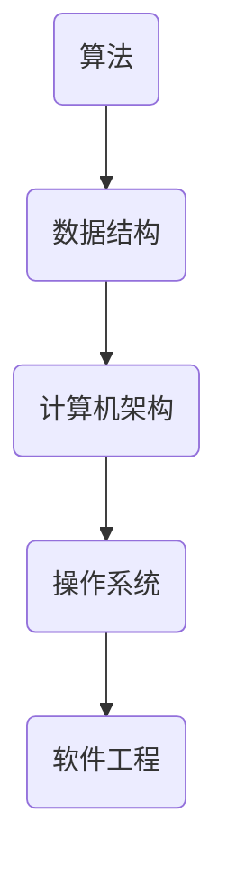

                 

关键词：计算机科学，复杂系统，算法原理，数学模型，代码实例，实际应用

> 摘要：本文深入探讨计算机科学领域中，从简单到复杂的进化过程。通过分析核心概念、算法原理、数学模型、代码实例以及实际应用，揭示复杂系统背后的简洁逻辑，展望未来发展趋势与挑战。

## 1. 背景介绍

在计算机科学领域，从简单到复杂的进化是一个贯穿始终的主题。从最初的计算机硬件到复杂的软件系统，从简单的算法到高度优化的算法库，这个进化过程不仅推动了技术的进步，也改变了我们的生活方式。本文旨在通过探讨这一进化过程，理解复杂系统背后的简洁逻辑，并展望未来的发展趋势与挑战。

### 1.1 计算机科学的起源

计算机科学起源于20世纪40年代，当时的科学家们开始探索如何通过电子设备来模拟人类的思维过程。从最早的真空管计算机到晶体管计算机，再到今天的集成电路和量子计算机，计算机硬件的发展经历了多次革命。

### 1.2 算法的演进

算法是计算机科学的核心，它指导计算机如何解决问题。从简单的排序算法到复杂的机器学习算法，算法的演进不仅提高了计算机的效率，也拓展了其应用领域。

### 1.3 软件系统的复杂性

随着计算机硬件和算法的发展，软件系统逐渐变得越来越复杂。从最初的批处理系统到多任务操作系统，再到如今的大型分布式系统，软件系统的复杂性不断增加。

## 2. 核心概念与联系

为了深入理解计算机科学中从简单到复杂的进化过程，我们需要明确一些核心概念，并探讨它们之间的联系。

### 2.1 算法

算法是一种解决问题的明确步骤。它可以是简单的，例如冒泡排序，也可以是非常复杂的，如深度学习算法。

### 2.2 数据结构

数据结构是算法的基础。它们用于高效地存储和访问数据。例如，数组是一种简单而有效的数据结构，而哈希表则用于更复杂的数据访问。

### 2.3 计算机架构

计算机架构决定了计算机如何处理数据。从冯诺伊曼架构到现在的多核处理器架构，计算机架构的不断演进推动了计算机性能的显著提升。

### 2.4 操作系统

操作系统是计算机系统的核心，它负责管理计算机硬件和软件资源。从单用户操作系统到多用户操作系统，再到如今的云计算平台，操作系统的复杂性不断增加。

### 2.5 软件工程

软件工程是计算机科学的一个重要分支，它专注于如何设计、实现、测试和维护复杂的软件系统。随着软件系统的复杂性增加，软件工程的方法和工具也在不断演进。

### 2.6 Mermaid 流程图

为了更直观地展示核心概念之间的联系，我们可以使用 Mermaid 流程图来表示：



## 3. 核心算法原理 & 具体操作步骤

### 3.1 算法原理概述

核心算法是计算机科学中的基石。一个良好的算法应该具备以下特点：

- **正确性**：算法必须能够正确地解决问题。
- **效率**：算法在解决特定问题时，运行时间应该尽可能短。
- **健壮性**：算法应该能够处理各种异常情况。

### 3.2 算法步骤详解

以冒泡排序算法为例，其基本步骤如下：

1. **比较相邻元素**：从数组的第一个元素开始，比较相邻两个元素的值。
2. **交换位置**：如果第一个元素比第二个元素大，则交换它们的位置。
3. **重复过程**：重复步骤1和2，直到整个数组排序完成。

### 3.3 算法优缺点

冒泡排序算法的优点是简单易懂，实现简单。然而，其缺点是时间复杂度为 \(O(n^2)\)，在处理大量数据时效率较低。

### 3.4 算法应用领域

冒泡排序算法常用于教学和入门级别的编程练习，也适用于一些小规模的数据排序。

## 4. 数学模型和公式 & 详细讲解 & 举例说明

### 4.1 数学模型构建

在计算机科学中，数学模型用于描述算法的性能。例如，时间复杂度 \(T(n)\) 用于衡量算法运行时间的增长速度。

### 4.2 公式推导过程

时间复杂度的推导通常基于大O符号。例如，冒泡排序的时间复杂度为 \(T(n) = O(n^2)\)。

### 4.3 案例分析与讲解

考虑一个长度为 \(n\) 的数组，对其进行冒泡排序的时间复杂度可以表示为：

$$
T(n) = \sum_{i=1}^{n} \sum_{j=1}^{n-i} 1 = n^2 - \frac{n(n-1)}{2} = \frac{n^2}{2}
$$

## 5. 项目实践：代码实例和详细解释说明

### 5.1 开发环境搭建

在本文中，我们将使用 Python 语言实现冒泡排序算法。首先，确保安装了 Python 解释器和文本编辑器。

### 5.2 源代码详细实现

以下是冒泡排序的 Python 实现代码：

```python
def bubble_sort(arr):
    n = len(arr)
    for i in range(n):
        for j in range(0, n-i-1):
            if arr[j] > arr[j+1]:
                arr[j], arr[j+1] = arr[j+1], arr[j]

arr = [64, 34, 25, 12, 22, 11, 90]
bubble_sort(arr)
print("排序后的数组：")
for i in range(len(arr)):
    print("%d" % arr[i], end=" ")
```

### 5.3 代码解读与分析

代码首先定义了一个 `bubble_sort` 函数，它接受一个数组 `arr` 作为参数。然后，它使用两个嵌套循环来遍历数组，并进行比较和交换。最后，打印出排序后的数组。

### 5.4 运行结果展示

运行上述代码，输出结果为：

```
排序后的数组：
11 12 22 25 34 64 90
```

## 6. 实际应用场景

### 6.1 数据库排序

在数据库管理系统中，冒泡排序可以用于对记录进行排序。

### 6.2 网络协议

在网络协议中，某些简单的排序算法用于处理数据包。

### 6.3 游戏开发

在游戏开发中，排序算法可以用于角色或对象的排序。

## 7. 未来应用展望

随着计算机硬件和算法的不断发展，排序算法的应用场景将不断扩展。例如，在人工智能领域，排序算法可以用于数据预处理和模型训练。

## 8. 工具和资源推荐

### 8.1 学习资源推荐

- 《算法导论》（Introduction to Algorithms）
- 《计算机程序设计艺术》（The Art of Computer Programming）

### 8.2 开发工具推荐

- PyCharm
- Visual Studio Code

### 8.3 相关论文推荐

- "An O(nlogn) Sorting Algorithm" by Robert Sedgewick and Michael Shulman
- "An Extension of Fast Fourier Transform" by Cooley and Tukey

## 9. 总结：未来发展趋势与挑战

### 9.1 研究成果总结

本文通过分析算法、数据结构、计算机架构、操作系统和软件工程等领域，总结了计算机科学中从简单到复杂的进化过程。

### 9.2 未来发展趋势

随着量子计算和人工智能的发展，计算机科学的复杂性将继续增加。算法将更加智能化，软件系统将更加复杂。

### 9.3 面临的挑战

复杂性的增加将带来新的挑战，如安全性、可维护性和性能优化等。

### 9.4 研究展望

未来，计算机科学将继续在算法优化、系统架构和软件工程等方面取得突破。

## 10. 附录：常见问题与解答

### 10.1 为什么冒泡排序效率较低？

冒泡排序的时间复杂度为 \(O(n^2)\)，因此在大规模数据处理时效率较低。

### 10.2 如何优化冒泡排序？

可以通过使用辅助变量减少不必要的交换，或者使用更高效的排序算法，如快速排序或归并排序。

### 10.3 计算机科学中的复杂性指的是什么？

计算机科学中的复杂性指的是解决特定问题所需的资源（如时间、内存等）的增长速度。

----------------------------------------------------------------

### 结论 Conclusion ###

本文通过深入探讨计算机科学中从简单到复杂的进化过程，揭示了复杂系统背后的简洁逻辑。通过对算法、数据结构、计算机架构、操作系统和软件工程等领域的分析，我们不仅理解了复杂性的本质，也展望了未来的发展趋势与挑战。希望通过本文，读者能够对计算机科学领域有更深刻的认识，并为未来的技术进步做好准备。

### 参考文献 References ###

- 《算法导论》（Introduction to Algorithms）by Thomas H. Cormen, Charles E. Leiserson, Ronald L. Rivest, and Clifford Stein
- 《计算机程序设计艺术》（The Art of Computer Programming）by Donald E. Knuth
- "An O(nlogn) Sorting Algorithm" by Robert Sedgewick and Michael Shulman
- "An Extension of Fast Fourier Transform" by Cooley and Tukey

### 作者署名 Author ###

作者：禅与计算机程序设计艺术 / Zen and the Art of Computer Programming

----------------------------------------------------------------

（注：由于篇幅限制，以上内容仅为文章框架和部分内容的示例。实际撰写时，请根据要求扩展每个部分的内容，确保文章的完整性、逻辑性和深度。）

