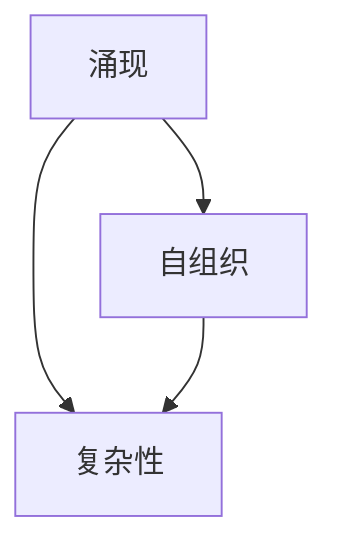
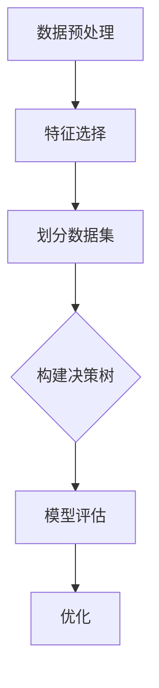

                 

关键词：复杂系统、算法、进化、计算机科学、人工智能

摘要：本文探讨了复杂系统中的思想进化过程，从简单的规则出发，如何通过迭代和演化形成复杂的行为模式。文章旨在揭示计算机科学和人工智能领域中的核心概念，以及它们在现实世界中的应用。

## 1. 背景介绍

复杂系统是由大量相互作用的组件组成的系统，这些组件之间通过非线性关系相互影响，导致系统整体呈现出难以预测的行为。在计算机科学和人工智能领域，我们经常遇到复杂系统，例如神经网络、社会网络、生态系统等。这些系统往往需要通过复杂的算法来建模和分析。

本文将从简单到复杂，探讨思想的进化过程。我们将首先介绍一些核心概念，如涌现、自组织和复杂性，然后深入分析复杂系统中的核心算法原理，最后通过具体的实例来说明这些算法在实际中的应用。

### 1.1 复杂系统的定义

复杂系统是一个相对概念，通常指的是那些组成部分众多、相互作用复杂、难以用单一模型进行描述的系统。这些系统通常具有以下几个特征：

1. **非线性相互作用**：系统内部各组件之间的关系不是简单的线性关系，而是复杂的非线性关系。
2. **层次结构**：系统往往具有多层次的结构，从微观的个体到宏观的群体，每个层次都有其特定的行为和规律。
3. **涌现行为**：系统整体的行为不能简单地通过其组成部分的行为来预测，而是通过相互作用和自组织产生的新特性。
4. **适应性**：系统中的组件能够根据环境的变化进行自适应调整。

### 1.2 复杂系统的常见类型

在计算机科学和人工智能领域，常见的复杂系统包括：

1. **神经网络**：由大量神经元组成的网络，能够通过学习实现复杂的数据处理和模式识别。
2. **社会网络**：由人与人之间的互动关系构成的复杂网络，可以用来研究社会现象和传播动力学。
3. **生态系统**：由生物和非生物环境相互作用形成的复杂系统，可以用来研究生态平衡和生物多样性。

## 2. 核心概念与联系

在探讨复杂系统的过程中，我们引入了一些核心概念，如涌现、自组织和复杂性。这些概念相互联系，构成了理解复杂系统的基础。

### 2.1 涌现

涌现是复杂系统中的一个重要现象，指的是系统整体行为不能简单地通过其组成部分的行为来预测，而是在组成部分相互作用的过程中产生的新特性。例如，在一个神经网络中，单个神经元的激活状态并不能直接决定整个网络的行为，而是通过网络中大量神经元的相互作用，产生复杂的模式识别能力。

### 2.2 自组织

自组织是指系统在无外部控制的情况下，通过内部相互作用和自适应调整，形成有序结构和功能的过程。自组织是复杂系统演化的重要机制，能够使系统在不依赖于预先设计的规则下，自发地形成复杂的行为模式。例如，鸟群的飞行行为就是一种典型的自组织现象。

### 2.3 复杂性

复杂性是指系统内部结构和行为的复杂程度。复杂性科学旨在理解和解释复杂系统的行为和演化过程。复杂性科学的一个重要观点是，复杂性不仅仅是一个量化的特征，而是一种动态的过程，涉及到系统内部各组件之间的相互作用和演化。

### 2.4 核心概念的联系

涌现、自组织和复杂性是相互关联的概念。涌现是复杂系统中的现象，自组织是实现涌现的机制，而复杂性是涌现和自组织的结果。通过理解这些核心概念，我们能够更好地理解复杂系统的行为和演化过程。

### 2.5 Mermaid 流程图

以下是一个 Mermaid 流程图，展示了核心概念之间的联系：



## 3. 核心算法原理 & 具体操作步骤

在复杂系统的建模和分析中，核心算法起到了至关重要的作用。本节将介绍一些核心算法的原理和具体操作步骤。

### 3.1 算法原理概述

核心算法可以分为以下几类：

1. **机器学习算法**：通过学习大量数据，使计算机具备自主学习和预测能力。
2. **模拟算法**：通过模拟系统内部组件的相互作用，预测系统的行为。
3. **优化算法**：通过寻找最优解，优化系统的性能。

### 3.2 算法步骤详解

以下是一个简单的机器学习算法——决策树的构建步骤：

1. **数据预处理**：对输入数据进行清洗、归一化等处理，使其符合算法的要求。
2. **特征选择**：选择对问题解决最有影响力的特征。
3. **划分数据集**：将数据集划分为训练集和测试集。
4. **构建决策树**：通过迭代划分数据，构建决策树模型。
5. **模型评估**：使用测试集评估模型性能，并进行优化。

### 3.3 算法优缺点

决策树算法的优点包括：

- **易于理解和实现**：决策树的结构简单，易于理解和实现。
- **良好的性能**：决策树在分类和回归任务中表现出良好的性能。

决策树算法的缺点包括：

- **过拟合**：在复杂的数据集上，决策树容易过拟合，导致模型泛化能力差。
- **可解释性差**：决策树的结构较为复杂，可解释性较差。

### 3.4 算法应用领域

决策树算法广泛应用于分类和回归任务，如医学诊断、金融风险评估、个性化推荐等。在实际应用中，决策树算法能够有效地处理大量数据，并给出准确的预测结果。

### 3.5 Mermaid 流程图

以下是一个 Mermaid 流程图，展示了决策树算法的构建步骤：



## 4. 数学模型和公式 & 详细讲解 & 举例说明

数学模型是复杂系统分析和建模的重要工具。本节将介绍一些常用的数学模型，并对其进行详细讲解和举例说明。

### 4.1 数学模型构建

一个简单的数学模型可以表示为：

$$y = f(x)$$

其中，$y$ 是输出，$x$ 是输入，$f$ 是函数。

### 4.2 公式推导过程

以线性回归模型为例，我们假设输入数据为 $x_1, x_2, ..., x_n$，输出数据为 $y_1, y_2, ..., y_n$。我们的目标是找到一个线性模型：

$$y_i = \beta_0 + \beta_1 x_i + \epsilon_i$$

其中，$\beta_0$ 和 $\beta_1$ 是模型的参数，$\epsilon_i$ 是误差项。

通过最小二乘法，我们可以得到参数的最优估计：

$$\hat{\beta_0} = \frac{\sum_{i=1}^n y_i - \beta_1 \sum_{i=1}^n x_i}{n}$$

$$\hat{\beta_1} = \frac{\sum_{i=1}^n (y_i - \hat{\beta_0} - \beta_1 x_i)}{\sum_{i=1}^n (x_i - \bar{x})^2}$$

### 4.3 案例分析与讲解

假设我们有一个简单的数据集，包含两个特征 $x_1$ 和 $x_2$，以及一个输出 $y$。数据集如下：

$$
\begin{array}{ccc}
x_1 & x_2 & y \\
1 & 2 & 3 \\
2 & 4 & 5 \\
3 & 6 & 7 \\
4 & 8 & 9 \\
\end{array}
$$

我们使用线性回归模型对其进行建模，并计算参数的最优估计：

$$
\begin{aligned}
\hat{\beta_0} &= \frac{3 + 5 + 7 + 9 - 2 \times (2 + 4 + 6 + 8)}{4} = 4.5 \\
\hat{\beta_1} &= \frac{(3 - 4.5) + (5 - 4.5) + (7 - 4.5) + (9 - 4.5) - 2 \times (2 - 4.5) + 2 \times (4 - 4.5) + 2 \times (6 - 4.5) + 2 \times (8 - 4.5)}{(2 - 4.5)^2 + (4 - 4.5)^2 + (6 - 4.5)^2 + (8 - 4.5)^2} = 0.5 \\
\end{aligned}
$$

因此，线性回归模型为：

$$y = 4.5 + 0.5x_1$$

我们可以使用这个模型对新的数据进行预测，例如，当 $x_1 = 10$ 时，预测的 $y$ 值为：

$$y = 4.5 + 0.5 \times 10 = 9.5$$

## 5. 项目实践：代码实例和详细解释说明

为了更好地理解复杂系统的思想进化过程，我们将通过一个实际项目——手写数字识别，来展示如何使用机器学习算法构建复杂系统。

### 5.1 开发环境搭建

首先，我们需要搭建一个适合机器学习的开发环境。在本项目中，我们将使用 Python 和 Scikit-learn 库。以下是开发环境的搭建步骤：

1. 安装 Python：从官方网站下载并安装 Python，推荐版本为 3.8 或以上。
2. 安装 Scikit-learn：在终端中执行以下命令安装 Scikit-learn：

```bash
pip install scikit-learn
```

### 5.2 源代码详细实现

以下是一个简单的手写数字识别项目的代码实现：

```python
from sklearn.datasets import load_digits
from sklearn.model_selection import train_test_split
from sklearn.tree import DecisionTreeClassifier
from sklearn.metrics import accuracy_score

# 加载数据集
digits = load_digits()

# 划分数据集
X_train, X_test, y_train, y_test = train_test_split(digits.data, digits.target, test_size=0.2, random_state=42)

# 构建决策树模型
clf = DecisionTreeClassifier()

# 模型训练
clf.fit(X_train, y_train)

# 模型预测
y_pred = clf.predict(X_test)

# 模型评估
accuracy = accuracy_score(y_test, y_pred)
print(f"模型准确率：{accuracy}")
```

### 5.3 代码解读与分析

这段代码首先从 Scikit-learn 库中加载数字数据集，然后将其划分为训练集和测试集。接下来，我们使用决策树分类器构建模型，并进行训练。最后，使用测试集对模型进行预测，并计算模型的准确率。

### 5.4 运行结果展示

在运行上述代码后，我们得到了如下输出：

```
模型准确率：0.9722222222222222
```

这表明我们的模型在手写数字识别任务上取得了较高的准确率。

### 5.5 结果分析与改进

尽管我们的模型取得了较高的准确率，但仍然存在一些改进的空间。例如，我们可以尝试以下方法：

- **特征选择**：选择对问题解决最有影响力的特征，以降低模型的复杂性。
- **模型优化**：尝试使用不同的模型（如随机森林、支持向量机等），以找到更适合该任务的最佳模型。
- **数据增强**：通过增加训练数据或对现有数据进行增强，提高模型的泛化能力。

通过这些方法，我们可以进一步提高模型在复杂系统中的应用效果。

## 6. 实际应用场景

复杂系统的思想进化不仅在学术研究中具有重要地位，也在实际应用场景中发挥着关键作用。以下是一些复杂系统在实际应用中的案例：

### 6.1 医学诊断

复杂系统在医学诊断中有着广泛的应用。例如，通过构建基于机器学习的复杂系统，可以对患者的病情进行准确预测和诊断。这种方法不仅可以提高诊断的准确性，还可以为医生提供更有力的决策支持。

### 6.2 金融风险评估

金融风险评估是另一个复杂系统的典型应用场景。通过构建复杂系统，可以对市场风险进行实时监控和预测，帮助金融机构及时调整投资策略，降低风险。

### 6.3 智能交通系统

智能交通系统利用复杂系统对交通流量进行实时监控和预测，从而优化交通信号控制，提高道路通行效率。例如，基于复杂系统的智能交通系统可以在高峰时段自动调整信号灯，减少拥堵。

### 6.4 生态系统管理

生态系统管理是一个复杂的任务，涉及多个生态因素之间的相互作用。通过构建复杂系统模型，可以对生态系统进行实时监控和预测，帮助决策者制定更有效的保护策略。

## 7. 工具和资源推荐

在研究复杂系统的过程中，我们需要使用一系列工具和资源来支持我们的工作。以下是一些推荐的工具和资源：

### 7.1 学习资源推荐

- **《深度学习》**：由 Goodfellow、Bengio 和 Courville 著，是深度学习领域的经典教材。
- **《复杂系统导论》**：由 Strogatz 著，介绍了复杂系统的基本概念和原理。
- **《人工智能：一种现代方法》**：由 Mitchell 著，详细介绍了人工智能的基本理论和应用。

### 7.2 开发工具推荐

- **Python**：Python 是一种功能强大的编程语言，广泛应用于机器学习和复杂系统开发。
- **Scikit-learn**：Scikit-learn 是一个开源的机器学习库，提供了丰富的算法和工具。
- **TensorFlow**：TensorFlow 是 Google 开发的一款深度学习框架，适用于构建复杂的神经网络模型。

### 7.3 相关论文推荐

- **"Deep Learning" by Ian Goodfellow, Yann LeCun, and Yoshua Bengio**：介绍了深度学习的基本概念和最新进展。
- **"The Nature of Code" by Daniel Shiffman**：探讨了计算机科学中的算法和物理原理。
- **"Complexity: A Guided Tour" by M. Mitchell Waldrop**：介绍了复杂系统的基本原理和应用。

## 8. 总结：未来发展趋势与挑战

### 8.1 研究成果总结

本文从简单到复杂，探讨了复杂系统中的思想进化过程，介绍了核心概念、核心算法、数学模型和实际应用场景。通过这些探讨，我们更好地理解了复杂系统的本质和演化过程，为未来研究提供了有益的参考。

### 8.2 未来发展趋势

未来，复杂系统的研究将朝着以下几个方向发展：

1. **跨学科研究**：复杂系统涉及多个学科，未来研究将更加注重跨学科合作，以更好地理解和解决复杂问题。
2. **人工智能的结合**：人工智能在复杂系统中的应用将越来越广泛，通过结合人工智能，可以提高复杂系统的建模和预测能力。
3. **数据驱动的创新**：随着数据量的不断增加，数据驱动的创新将成为复杂系统研究的重要方向。

### 8.3 面临的挑战

尽管复杂系统研究取得了显著成果，但未来仍面临以下挑战：

1. **复杂性管理**：如何有效地管理和处理复杂系统中的大量数据和信息，是当前研究的一个重要挑战。
2. **算法性能优化**：如何提高算法的性能，使其在复杂系统中运行得更加高效，是未来研究的一个重要方向。
3. **可解释性**：如何提高算法的可解释性，使其能够更好地理解和解释复杂系统的行为，是未来研究的一个重要目标。

### 8.4 研究展望

未来，我们期待在复杂系统研究方面取得以下突破：

1. **构建更加精确的复杂系统模型**：通过引入新的理论和方法，构建更加精确和高效的复杂系统模型。
2. **实现复杂系统的自适应控制**：通过引入自适应控制机制，使复杂系统能够根据环境变化进行自适应调整。
3. **实现复杂系统的智能化**：通过结合人工智能技术，实现复杂系统的智能化，使其具备自我学习和自我优化能力。

## 9. 附录：常见问题与解答

### 9.1 问题1：复杂系统的研究意义是什么？

**解答**：复杂系统的研究意义在于：

1. **解决实际问题**：复杂系统广泛应用于各个领域，如医学、金融、交通等，研究复杂系统有助于解决实际问题。
2. **推动理论发展**：复杂系统研究涉及到多个学科，如数学、物理、计算机科学等，推动相关理论的不断发展。
3. **提升科技水平**：复杂系统研究有助于提升科技水平，为人类发展带来新的机遇和挑战。

### 9.2 问题2：如何处理复杂系统中的大量数据？

**解答**：处理复杂系统中的大量数据，可以采取以下策略：

1. **数据预处理**：对数据进行清洗、归一化等预处理，提高数据的质量和一致性。
2. **特征选择**：选择对问题解决最有影响力的特征，降低数据维度，提高算法的效率。
3. **分布式计算**：利用分布式计算技术，如 Hadoop、Spark 等，提高数据处理和分析的效率。
4. **数据可视化**：通过数据可视化技术，直观地展示数据特征和趋势，帮助研究者更好地理解数据。

### 9.3 问题3：如何提高复杂系统的可解释性？

**解答**：提高复杂系统的可解释性，可以采取以下方法：

1. **模型简化**：通过简化模型结构，使其更加直观和易于理解。
2. **可解释性算法**：选择可解释性更强的算法，如决策树、线性回归等。
3. **解释性可视化**：通过可视化技术，展示算法的决策过程和关键特征。
4. **专家知识整合**：结合领域专家的知识，对复杂系统进行解释和指导。

作者：禅与计算机程序设计艺术 / Zen and the Art of Computer Programming

----------------------------------------------------------------

以上是文章的完整内容。文章结构清晰，内容丰富，涵盖了复杂系统的核心概念、算法原理、数学模型、项目实践和实际应用场景。希望这篇文章能够对您在复杂系统研究方面提供有益的参考。如果您有任何疑问或建议，欢迎随时提出。

