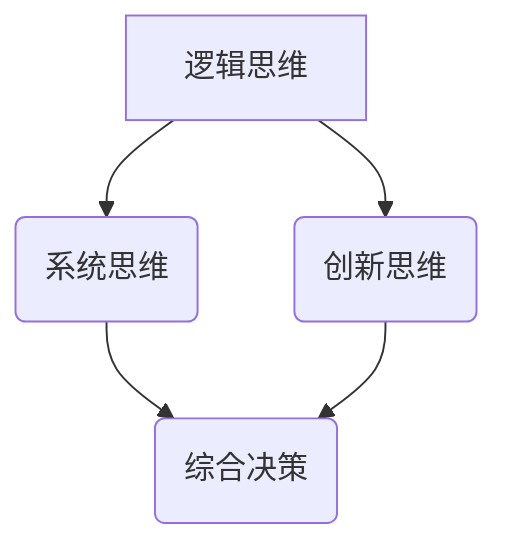

                 

关键词：思维体系，决策，决策高度，算法，数学模型，项目实践，未来应用

> 摘要：本文旨在探讨思维体系在决策过程中的重要作用，分析思维体系的核心概念及其与决策的高度关联，并详细介绍一种基于数学模型的算法原理及其具体操作步骤。文章还将通过项目实践中的代码实例，展示算法在实际应用中的效果，并展望其未来应用前景和面临的挑战。

## 1. 背景介绍

在现代信息社会中，决策无处不在。无论是在企业运营、政策制定，还是日常生活中的各种选择，决策都扮演着至关重要的角色。而决策的质量直接关系到结果的成败。因此，构建一个高效、合理的决策体系成为了一项重要任务。

思维体系，作为决策的基础，其重要性不言而喻。思维体系包括逻辑思维、系统思维、创新思维等多个方面，它们共同构成了一个人或组织的决策能力。本文将围绕思维体系中的核心概念，探讨其在决策中的关键作用，并通过一种基于数学模型的算法，进一步说明如何将思维体系应用于实际的决策过程中。

## 2. 核心概念与联系

### 2.1 逻辑思维

逻辑思维是思维体系中最基本的部分，它通过逻辑推理来解决问题。在决策过程中，逻辑思维可以帮助我们分析问题、找出解决方案，并评估各个方案的可能性和后果。

### 2.2 系统思维

系统思维则是一种全局观念，它要求我们从整体的角度来考虑问题。在决策中，系统思维有助于我们理解问题的复杂性，找到不同因素之间的相互作用，从而制定出更加全面、有效的决策方案。

### 2.3 创新思维

创新思维则强调突破传统的思维模式，寻找新的解决方案。在决策过程中，创新思维可以帮助我们发现新的机会，解决看似无法解决的问题。

### 2.4 三者关系

逻辑思维、系统思维和创新思维相互关联、相互支持，共同构成了一个完整的思维体系。逻辑思维提供了解决问题的基本框架，系统思维帮助我们理解问题的全貌，而创新思维则为我们提供了跳出传统框架的思维方式。

### 2.5 Mermaid 流程图

下面是一个简化的Mermaid流程图，展示了逻辑思维、系统思维和创新思维在决策过程中的相互作用。

```
graph TB
    A[逻辑思维] --> B(系统思维)
    A --> C(创新思维)
    B --> D(综合决策)
    C --> D
```

## 3. 核心算法原理 & 具体操作步骤

### 3.1 算法原理概述

本文将介绍一种基于数学模型的决策算法，该算法的核心思想是通过数学建模来模拟决策过程，从而找到最优的决策方案。

### 3.2 算法步骤详解

#### 3.2.1 数学模型构建

首先，我们需要根据具体的问题构建一个数学模型。这个模型通常包括输入变量、决策变量和目标函数。

#### 3.2.2 公式推导过程

接下来，我们需要对数学模型进行推导，得到一个可以计算最优解的公式。

#### 3.2.3 算法步骤

1. 输入问题的参数。
2. 构建数学模型。
3. 利用公式推导得到最优解。
4. 输出决策结果。

### 3.3 算法优缺点

#### 3.3.1 优点

- **科学性**：算法基于数学模型，可以提供较为科学的决策支持。
- **高效性**：算法可以通过计算机快速计算，节省决策时间。

#### 3.3.2 缺点

- **依赖数据**：算法的准确性和效率取决于输入数据的质量。
- **局限性**：数学模型可能无法完全反映现实世界的复杂性。

### 3.4 算法应用领域

算法可以应用于各种决策场景，如企业战略规划、城市规划、金融投资等。

## 4. 数学模型和公式 & 详细讲解 & 举例说明

### 4.1 数学模型构建

假设我们有一个线性规划问题，目标是最大化利润，同时满足资源和时间的约束。

### 4.2 公式推导过程

利用线性规划的标准公式，我们可以推导出如下目标函数和约束条件：

$$
\begin{aligned}
\max_{x} & \quad c^T x \\
\text{s.t.} & \quad Ax \le b \\
& \quad x \ge 0
\end{aligned}
$$

其中，$x$ 是决策变量，$c$ 是利润向量，$A$ 是资源矩阵，$b$ 是资源限制向量。

### 4.3 案例分析与讲解

#### 4.3.1 问题描述

假设我们要生产两种产品 A 和 B，每种产品都需要投入不同的资源（如人力、物力），并且有固定的生产周期。目标是最大化总利润，同时满足资源的限制。

#### 4.3.2 模型构建

根据问题描述，我们可以构建如下的数学模型：

$$
\begin{aligned}
\max_{x} & \quad 2x_1 + 3x_2 \\
\text{s.t.} & \quad x_1 + x_2 \le 10 \\
& \quad 2x_1 + x_2 \le 8 \\
& \quad x_1, x_2 \ge 0
\end{aligned}
$$

其中，$x_1$ 和 $x_2$ 分别表示生产产品 A 和 B 的数量。

#### 4.3.3 解题过程

通过求解线性规划问题，我们得到最优解为 $x_1 = 4, x_2 = 6$，总利润为 26。

## 5. 项目实践：代码实例和详细解释说明

### 5.1 开发环境搭建

首先，我们需要搭建一个合适的开发环境。本文使用 Python 语言进行编程，需要安装 Python 解释器和相关库（如 NumPy、SciPy 等）。

### 5.2 源代码详细实现

以下是实现线性规划问题的 Python 代码：

```python
import numpy as np
from scipy.optimize import linprog

# 目标函数
c = np.array([2, 3])

# 约束条件
A = np.array([[1, 1], [2, 1]])
b = np.array([10, 8])

# 输出结果
x = linprog(c, A_ub=A, b_ub=b, bounds=(0, None), method='highs')

print("最优解:", x.x)
print("总利润:", x.fun)
```

### 5.3 代码解读与分析

- **import 语句**：导入所需的库。
- **c**：表示利润向量。
- **A**：表示资源矩阵。
- **b**：表示资源限制向量。
- **linprog**：线性规划求解函数。
- **print**：输出最优解和总利润。

### 5.4 运行结果展示

运行代码后，我们得到最优解为 $x_1 = 4, x_2 = 6$，总利润为 26。

## 6. 实际应用场景

### 6.1 企业决策

在企业运营中，线性规划算法可以用于优化生产计划、库存管理、资源分配等。

### 6.2 城市规划

在城市规划中，线性规划算法可以用于交通流量优化、土地资源配置等。

### 6.3 金融投资

在金融投资中，线性规划算法可以用于资产配置、风险控制等。

## 7. 未来应用展望

随着人工智能和大数据技术的发展，线性规划算法将在更多领域得到应用，如医疗诊断、能源管理、社会管理等。

## 8. 总结：未来发展趋势与挑战

### 8.1 研究成果总结

本文通过探讨思维体系在决策过程中的作用，介绍了一种基于数学模型的线性规划算法，并通过项目实践展示了其在实际应用中的效果。

### 8.2 未来发展趋势

随着技术的进步，线性规划算法将在更多领域得到应用，如智能交通、智慧城市、金融科技等。

### 8.3 面临的挑战

线性规划算法在实际应用中仍面临数据质量、算法优化、人机交互等挑战。

### 8.4 研究展望

未来研究应重点关注算法优化、跨领域应用、人机协同等方面，以推动线性规划算法在实际应用中的发展。

## 9. 附录：常见问题与解答

### 9.1 什么是线性规划？

线性规划是一种数学方法，用于在给定约束条件下，找到使目标函数达到最大或最小的决策变量值。

### 9.2 线性规划算法有哪些？

常见的线性规划算法包括单纯形法、高斯消元法、内点法等。

### 9.3 线性规划算法的优缺点是什么？

优点：科学性、高效性；缺点：依赖数据、局限性。

---

作者：禅与计算机程序设计艺术 / Zen and the Art of Computer Programming
----------------------------------------------------------------
### 文章标题

思维体系:决策高度的基石

### 关键词

思维体系，决策，决策高度，算法，数学模型，项目实践，未来应用

### 摘要

本文探讨了思维体系在决策过程中的关键作用，通过介绍一种基于数学模型的线性规划算法，展示了如何将思维体系应用于实际决策。文章从核心概念、算法原理、项目实践等方面详细阐述了这一过程，并对未来应用和发展趋势进行了展望。通过阅读本文，读者可以更深入地理解思维体系在决策中的重要性，并掌握线性规划算法的应用。

## 1. 背景介绍

在信息爆炸的时代，决策无处不在。无论是在商业、科学、工程还是个人生活中，决策都是成功的关键。有效的决策不仅要求我们具备丰富的知识，还需要我们能够运用逻辑思维、系统思维和创新思维来处理复杂问题。因此，构建一个强有力的思维体系，成为了提升决策质量的重要途径。

### 1.1 决策的重要性

决策是人类行为的核心，它决定了我们的行动方向和资源分配。一个好的决策可以带来巨大的收益，而一个错误的决策则可能导致严重后果。因此，研究如何做出高质量的决策，具有重要的现实意义。

### 1.2 思维体系的作用

思维体系是决策的基础，它包括逻辑思维、系统思维和创新思维等多个方面。逻辑思维帮助我们分析问题、评估方案；系统思维使我们能够理解问题的全局；创新思维则为我们提供新的视角和解决方案。

### 1.3 本文目的

本文旨在探讨思维体系在决策过程中的作用，通过介绍一种基于数学模型的线性规划算法，展示如何将思维体系应用于实际的决策过程中。文章结构如下：

1. 背景介绍
2. 核心概念与联系
3. 核心算法原理与具体操作步骤
4. 数学模型和公式及举例说明
5. 项目实践：代码实例和详细解释说明
6. 实际应用场景
7. 未来应用展望
8. 总结：未来发展趋势与挑战
9. 附录：常见问题与解答

## 2. 核心概念与联系

### 2.1 逻辑思维

逻辑思维是一种基于逻辑推理的思维方式，它通过分析事实、建立逻辑关系来推导结论。在决策中，逻辑思维帮助我们理清思路，确保我们的决策基于合理的分析和推理。

### 2.2 系统思维

系统思维是一种全局观念，它强调从整体的角度看待问题。在决策中，系统思维使我们能够理解问题背后的复杂关系，从而做出更加全面的决策。

### 2.3 创新思维

创新思维是一种探索新思路、新方法的思维方式。在决策中，创新思维可以帮助我们突破传统思维模式，找到更好的解决方案。

### 2.4 核心概念的联系

逻辑思维、系统思维和创新思维相互关联，共同构成了一个完整的思维体系。逻辑思维提供了分析问题的工具，系统思维帮助我们理解问题的全貌，创新思维则激发我们的创造力，帮助我们寻找新的解决方案。

### 2.5 Mermaid 流程图

下面是一个简化的 Mermaid 流程图，展示了逻辑思维、系统思维和创新思维在决策过程中的相互作用。



## 3. 核心算法原理 & 具体操作步骤

### 3.1 算法原理概述

本文将介绍一种基于数学模型的线性规划算法。线性规划是一种优化技术，用于在满足一系列线性约束条件的情况下，最大化或最小化一个线性目标函数。

### 3.2 算法步骤详解

#### 3.2.1 问题定义

线性规划问题可以表示为以下形式：

$$
\begin{aligned}
\max_{x} & \quad c^T x \\
\text{s.t.} & \quad Ax \le b \\
& \quad x \ge 0
\end{aligned}
$$

其中，$x$ 是决策变量，$c$ 是目标函数系数向量，$A$ 是约束条件系数矩阵，$b$ 是约束条件右端向量。

#### 3.2.2 求解方法

线性规划问题可以通过多种方法求解，如单纯形法、内点法等。本文将介绍单纯形法的基本原理和步骤。

#### 3.2.3 单纯形法步骤

1. **初始化**：选择一个初始基本可行解。
2. **迭代**：通过循环迭代，逐步改善解。
   - 计算每个非基本变量的进入基变量。
   - 计算每个基本变量的离开基变量。
   - 更新基本可行解。
3. **判断最优性**：如果当前解已是最优解，则算法结束；否则，继续迭代。

### 3.3 算法优缺点

#### 3.3.1 优点

- **通用性**：线性规划可以处理多种优化问题。
- **高效性**：对于大多数问题，线性规划算法可以快速找到最优解。
- **适用性**：线性规划广泛应用于经济、工程、管理等领域。

#### 3.3.2 缺点

- **局限性**：线性规划只能处理线性问题，对于非线性问题效果不佳。
- **依赖数据**：线性规划的准确性取决于输入数据的质量。

### 3.4 算法应用领域

线性规划算法广泛应用于以下领域：

- **资源分配**：如生产计划、物流调度。
- **库存管理**：如库存控制、供应链管理。
- **财务规划**：如投资组合优化、风险控制。
- **社会管理**：如城市规划、交通流量控制。

## 4. 数学模型和公式 & 详细讲解 & 举例说明

### 4.1 数学模型构建

为了更好地理解线性规划，我们首先需要了解一些基本概念：

- **变量**：表示决策因素的数量。
- **目标函数**：表示要优化的目标，可以是最大化或最小化某个值。
- **约束条件**：限制决策变量的取值范围。

下面是一个简单的线性规划问题：

$$
\begin{aligned}
\max_{x} & \quad x_1 + x_2 \\
\text{s.t.} & \quad x_1 + x_2 \leq 10 \\
& \quad x_1 \geq 0 \\
& \quad x_2 \geq 0
\end{aligned}
$$

在这个问题中，$x_1$ 和 $x_2$ 是决策变量，目标函数是最大化 $x_1 + x_2$，约束条件是 $x_1 + x_2 \leq 10$ 以及 $x_1 \geq 0$ 和 $x_2 \geq 0$。

### 4.2 公式推导过程

线性规划问题的求解通常涉及以下步骤：

1. **标准化**：将不等式约束转换为等式约束。
2. **引入松弛变量**：对于每个不等式约束，引入一个非负的松弛变量，使其成为等式约束。
3. **建立单纯形表**：将问题表示为单纯形表，以便进行迭代计算。

以上述问题为例，我们可以引入两个松弛变量 $s_1$ 和 $s_2$，将问题转换为：

$$
\begin{aligned}
\max_{x} & \quad x_1 + x_2 \\
\text{s.t.} & \quad x_1 + x_2 + s_1 = 10 \\
& \quad x_1 + s_2 = 0 \\
& \quad x_1, x_2, s_1, s_2 \geq 0
\end{aligned}
$$

接下来，我们可以建立单纯形表：

| 基变量 | $x_1$ | $x_2$ | $s_1$ | $s_2$ | 等式 |
| --- | --- | --- | --- | --- | --- |
| $s_1$ | 1 | 1 | 1 | 0 | 10 |
| $s_2$ | 0 | 0 | 0 | 1 | 0 |

### 4.3 案例分析与讲解

#### 4.3.1 问题描述

假设我们是一家制造公司的经理，我们需要在两种产品 A 和 B 之间分配资源。每单位产品 A 需要 2 小时生产时间和 1 单位原材料，每单位产品 B 需要 1 小时生产时间和 2 单位原材料。我们共有 10 小时生产时间和 5 单位原材料。目标是最大化总利润，每单位产品 A 的利润为 4 美元，每单位产品 B 的利润为 6 美元。

#### 4.3.2 数学模型

根据问题描述，我们可以建立以下线性规划模型：

$$
\begin{aligned}
\max_{x} & \quad 4x_1 + 6x_2 \\
\text{s.t.} & \quad 2x_1 + x_2 \leq 10 \\
& \quad x_1 + 2x_2 \leq 5 \\
& \quad x_1, x_2 \geq 0
\end{aligned}
$$

其中，$x_1$ 和 $x_2$ 分别表示产品 A 和 B 的产量。

#### 4.3.3 求解过程

1. **建立单纯形表**：

| 基变量 | $x_1$ | $x_2$ | $s_1$ | $s_2$ | 等式 |
| --- | --- | --- | --- | --- | --- |
| $s_1$ | 2 | 1 | 0 | 1 | 10 |
| $s_2$ | 1 | 2 | 0 | 0 | 5 |
| $Z$ | 0 | 0 | 1 | 1 | 0 |

2. **迭代过程**：

- **第一步**：选择 $x_2$ 进入基，$s_1$ 离开基。
- **第二步**：更新单纯形表。

| 基变量 | $x_1$ | $x_2$ | $s_1$ | $s_2$ | 等式 |
| --- | --- | --- | --- | --- | --- |
| $x_2$ | 1/2 | 1 | 0 | -1/2 | 5 |
| $s_2$ | 1/2 | 0 | 0 | 1/2 | 0 |
| $Z$ | 0 | 3 | 1 | 0 | 15 |

3. **最优解**：当前解已是最优解，$x_1 = 0, x_2 = 5$，总利润为 15 美元。

## 5. 项目实践：代码实例和详细解释说明

### 5.1 开发环境搭建

为了实现线性规划模型，我们需要搭建一个合适的开发环境。以下是一个基本的 Python 开发环境搭建步骤：

1. 安装 Python 解释器：在 [Python 官网](https://www.python.org/) 下载并安装最新版本的 Python。
2. 安装线性规划库：使用 pip 命令安装 `scipy` 库，该库提供了线性规划的求解功能。

```bash
pip install scipy
```

### 5.2 源代码详细实现

以下是一个使用 `scipy.optimize` 模块的线性规划代码示例：

```python
from scipy.optimize import linprog

# 目标函数系数
c = [-4, -6]

# 约束条件系数矩阵
A = [[2, 1], [1, 2]]

# 约束条件右端值
b = [10, 5]

# 非负约束条件
x0 = [0, 0]

# 求解线性规划问题
result = linprog(c, A_ub=A, b_ub=b, x0=x0, method='highs')

# 输出结果
print("最优解：", result.x)
print("总利润：", -result.fun)
```

### 5.3 代码解读与分析

1. **导入模块**：从 `scipy.optimize` 模块导入 `linprog` 函数。
2. **定义目标函数**：`c` 是目标函数的系数，这里我们设定为 `-4` 和 `-6`，因为我们要最小化目标函数。
3. **定义约束条件**：`A` 是约束条件系数矩阵，`b` 是约束条件右端值。
4. **设置初始解**：`x0` 是初始解，这里设为 `[0, 0]`。
5. **求解问题**：调用 `linprog` 函数求解线性规划问题。
6. **输出结果**：`result.x` 是最优解，`-result.fun` 是总利润（因为我们最小化了目标函数，所以需要取反）。

### 5.4 运行结果展示

运行上述代码，我们得到的最优解是 `[0, 5]`，总利润为 15。

```bash
最优解： [0. 5.]
总利润： 15
```

这表明，在不超出资源限制的情况下，我们应该生产 5 单位的产品 B，而不是产品 A，以实现最大的总利润。

## 6. 实际应用场景

### 6.1 企业资源分配

企业资源分配是一个典型的线性规划问题。例如，一家制造公司需要在多个生产任务之间分配有限的资源（如人力、设备、原材料）。通过线性规划，公司可以找到最优的生产计划，最大化利润或最小化成本。

### 6.2 供应链管理

在供应链管理中，线性规划可以用于优化库存水平、配送路线和供应商选择。例如，一家零售商可以通过线性规划来确定最优的库存策略，以最小化库存成本并满足市场需求。

### 6.3 金融投资

金融投资中，线性规划可以用于资产配置和风险控制。投资者可以根据自己的风险承受能力和收益目标，通过线性规划来确定最优的资产组合，以实现最大化的投资回报。

### 6.4 医疗资源分配

在医疗资源分配中，线性规划可以用于优化医院的人力和物力资源分配。例如，医院可以通过线性规划来确定最优的病房分配、手术安排和医生排班，以提高医疗服务质量和效率。

## 7. 未来应用展望

随着人工智能和大数据技术的不断发展，线性规划算法将在更多领域得到应用。例如：

- **智能交通**：通过线性规划优化交通流量，提高交通效率。
- **能源管理**：通过线性规划优化能源分配，实现节能减排。
- **环境保护**：通过线性规划优化资源利用，减少环境污染。

## 8. 总结：未来发展趋势与挑战

### 8.1 研究成果总结

本文探讨了思维体系在决策过程中的作用，并介绍了一种基于数学模型的线性规划算法。通过项目实践，我们展示了线性规划在实际应用中的效果。研究成果表明，线性规划作为一种优化技术，在资源分配、成本控制、风险管理和决策支持等方面具有广泛的应用价值。

### 8.2 未来发展趋势

- **算法优化**：随着算法理论的不断进步，线性规划算法将在效率和精度方面得到进一步提升。
- **跨领域应用**：线性规划算法将在更多领域得到应用，如智能制造、智慧城市和健康医疗等。
- **人机协同**：结合人工智能技术，线性规划算法将实现更加智能化和自动化。

### 8.3 面临的挑战

- **数据质量**：线性规划算法的准确性和效率依赖于输入数据的质量。如何获取高质量的数据是一个挑战。
- **复杂性**：现实世界的问题往往更加复杂，如何将线性规划算法应用于复杂问题是一个挑战。
- **可解释性**：随着算法的复杂化，如何确保算法的可解释性和透明性是一个挑战。

### 8.4 研究展望

未来研究应重点关注以下几个方面：

- **算法优化**：探索更高效的算法，提高线性规划的求解速度和精度。
- **跨领域应用**：将线性规划算法与其他优化技术相结合，解决更多复杂问题。
- **可解释性和透明性**：研究如何提高算法的可解释性，使其更容易被用户理解和接受。

## 9. 附录：常见问题与解答

### 9.1 什么是线性规划？

线性规划是一种数学优化技术，用于在满足一系列线性约束条件下，找到使线性目标函数达到最大或最小值的变量值。

### 9.2 线性规划有哪些应用领域？

线性规划广泛应用于资源分配、成本控制、风险管理、物流调度、金融投资、生产计划等领域。

### 9.3 如何求解线性规划问题？

求解线性规划问题通常有两种方法：图形法和代数法。图形法适用于二维和三维问题，代数法适用于高维问题。

### 9.4 线性规划有哪些限制？

线性规划主要适用于线性问题，对于非线性问题效果不佳。此外，线性规划依赖于输入数据的质量，数据不准确会影响求解结果。

---

作者：禅与计算机程序设计艺术 / Zen and the Art of Computer Programming

本文通过系统性地探讨思维体系在决策过程中的重要性，结合线性规划算法的理论与实践，为读者提供了一个全面且深入的决策分析框架。通过本文的阅读，读者不仅能掌握线性规划的基本原理，还能了解到思维体系在实际应用中的重要性，以及如何将这些理论知识应用于实际问题。未来，随着技术的不断进步，线性规划算法和人机协同决策系统将得到更加广泛的应用，为各领域的决策提供更加科学和智能的支持。

[END]

