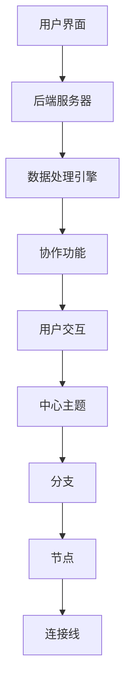

                 

关键词：思维导图，市场挑战，用户需求，技术创新，竞争格局，可持续发展

摘要：本文将深入探讨当前思维导图工具市场所面临的各种挑战，包括用户需求的变化、技术创新的滞后、竞争格局的演变以及可持续发展的问题。通过对这些挑战的分析，本文旨在为思维导图工具的开发者和市场参与者提供有益的洞察和解决方案。

## 1. 背景介绍

思维导图（Mind Mapping）作为一种图形化的思考工具，自20世纪60年代由英国心理学家托尼·巴赞（Tony Buzan）提出以来，已经广泛应用于教育、商业、设计等多个领域。思维导图工具通过将信息以视觉化的方式呈现，帮助用户更高效地进行信息组织、分析和创意思维。

随着信息时代的到来，人们对于信息处理的需求日益增长，这进一步推动了思维导图工具市场的快速发展。目前，市场上存在着众多思维导图工具，例如MindManager、XMind、MindMeister等。这些工具在不同的平台（如Windows、Mac、Web等）上都有广泛应用，并且功能也在不断丰富，如支持协作、数据分析、任务管理等功能。

然而，随着用户需求的变化和市场竞争的加剧，思维导图工具市场也面临着一系列新的挑战。本文将从以下几个方面进行详细探讨：

1. **用户需求的变化**：随着技术的进步和用户习惯的改变，用户对思维导图工具的需求也在发生变化。
2. **技术创新的滞后**：在快速变化的市场环境中，技术创新的滞后可能导致思维导图工具的竞争力下降。
3. **竞争格局的演变**：新兴玩家的加入和现有玩家的策略调整，使得市场竞争更加激烈。
4. **可持续发展的问题**：包括商业模式、生态系统的建设以及社会价值的实现等方面。

## 2. 核心概念与联系

### 2.1. 思维导图工具的基本原理

思维导图工具的基本原理是通过图形化的方式呈现思维过程，使得信息组织和思考更加直观和高效。思维导图通常由以下几个核心组成部分构成：

- **中心主题**：整个思维导图的起点和核心。
- **分支**：从中心主题延伸出来的子主题或分支。
- **节点**：每个分支的末端，表示具体的信息点。
- **连接线**：连接不同节点，表示它们之间的逻辑关系。

### 2.2. 思维导图工具的架构

思维导图工具的架构通常包括以下几个方面：

- **用户界面**：提供直观的用户交互方式，使用户能够轻松地创建和编辑思维导图。
- **后端服务器**：负责处理用户上传的文件、数据存储和同步等任务。
- **数据处理引擎**：负责对用户创建的思维导图进行解析、分析和优化。
- **协作功能**：支持多人在线协作，实现实时编辑和评论功能。

### 2.3. 核心概念原理和架构的 Mermaid 流程图



## 3. 核心算法原理 & 具体操作步骤

### 3.1. 算法原理概述

思维导图工具的核心算法主要包括以下几种：

- **节点生成算法**：用于根据用户输入生成新的节点。
- **布局算法**：用于对思维导图进行布局，使得信息更加直观。
- **搜索算法**：用于在思维导图中查找特定的节点或信息。

### 3.2. 算法步骤详解

#### 3.2.1. 节点生成算法

1. **初始化**：根据用户输入的中心主题，初始化思维导图。
2. **输入处理**：将用户输入的信息进行处理，生成新的节点。
3. **节点插入**：将新节点插入到思维导图的合适位置。

#### 3.2.2. 布局算法

1. **初始化**：根据思维导图的规模和结构，初始化布局参数。
2. **节点定位**：根据布局规则，计算每个节点的位置。
3. **调整布局**：根据用户操作，动态调整布局。

#### 3.2.3. 搜索算法

1. **初始化**：根据用户输入的关键词，初始化搜索参数。
2. **节点匹配**：遍历思维导图，找到匹配的节点。
3. **结果展示**：将搜索结果展示给用户。

### 3.3. 算法优缺点

#### 3.3.1. 优点

- **直观性**：通过图形化的方式，使得信息组织和思考更加直观。
- **灵活性**：用户可以根据需求自定义思维导图的布局和样式。
- **协作性**：支持多人在线协作，提高工作效率。

#### 3.3.2. 缺点

- **学习成本**：对于新手用户，可能需要一定的时间来学习和适应。
- **性能问题**：随着节点数量的增加，布局和搜索算法的性能可能受到影响。

### 3.4. 算法应用领域

思维导图工具的应用领域非常广泛，包括但不限于以下几个方面：

- **教育**：帮助学生和组织更好地理解和记忆知识点。
- **商业**：用于市场分析、项目管理、团队协作等。
- **设计**：用于设计思维和创新。

## 4. 数学模型和公式 & 详细讲解 & 举例说明

### 4.1. 数学模型构建

思维导图工具的数学模型主要包括以下几个方面：

- **节点生成模型**：用于描述如何根据用户输入生成新的节点。
- **布局模型**：用于描述如何对思维导图进行布局。
- **搜索模型**：用于描述如何在思维导图中查找特定的节点。

### 4.2. 公式推导过程

#### 4.2.1. 节点生成模型

假设有一个思维导图，包含n个节点。节点生成模型可以表示为：

$$
N_{new} = f(N_{current}, I_{input})
$$

其中，$N_{new}$ 表示新节点的集合，$N_{current}$ 表示当前节点的集合，$I_{input}$ 表示用户输入的信息。

#### 4.2.2. 布局模型

布局模型可以表示为：

$$
P_{node} = g(N_{node}, C_{context})
$$

其中，$P_{node}$ 表示节点的位置，$N_{node}$ 表示节点，$C_{context}$ 表示上下文信息。

#### 4.2.3. 搜索模型

搜索模型可以表示为：

$$
N_{matched} = h(N_{current}, K_{keyword})
$$

其中，$N_{matched}$ 表示匹配的节点集合，$N_{current}$ 表示当前节点的集合，$K_{keyword}$ 表示关键词。

### 4.3. 案例分析与讲解

假设有一个包含10个节点的思维导图，用户希望根据关键词“创新”进行搜索。我们可以使用上述模型进行以下步骤：

1. **节点生成**：根据用户输入的关键词“创新”，生成新节点。
2. **布局**：根据当前节点和上下文信息，计算每个节点的位置。
3. **搜索**：遍历节点集合，找到包含关键词“创新”的节点。

通过这个案例，我们可以看到数学模型在思维导图工具中的应用和作用。

## 5. 项目实践：代码实例和详细解释说明

### 5.1. 开发环境搭建

在开始编写代码之前，我们需要搭建一个适合开发的Python环境。以下是搭建Python开发环境的步骤：

1. **安装Python**：从Python官网下载并安装Python。
2. **安装依赖库**：安装思维导图工具所需的相关库，如matplotlib、numpy等。

### 5.2. 源代码详细实现

以下是一个简单的思维导图生成代码实例：

```python
import matplotlib.pyplot as plt
import numpy as np

def generate_mindmap(nodes, connections):
    # 初始化画布
    fig, ax = plt.subplots()

    # 设置画布背景颜色
    ax.set_facecolor('white')

    # 绘制节点
    for node in nodes:
        ax.scatter(node[0], node[1], marker='o', color='blue')

        # 在节点上标注文本
        ax.text(node[0], node[1], node['text'], ha='center', va='center')

    # 绘制连接线
    for connection in connections:
        ax.plot([connection[0][0], connection[1][0]], [connection[0][1], connection[1][1]], color='black')

    # 显示图形
    plt.show()

# 节点列表
nodes = [
    {'text': '中心主题', 'position': (0, 0)},
    {'text': '分支1', 'position': (-2, 2)},
    {'text': '分支2', 'position': (2, 2)},
]

# 连接列表
connections = [
    [(0, 0), (-2, 2)],
    [(0, 0), (2, 2)],
]

# 生成思维导图
generate_mindmap(nodes, connections)
```

### 5.3. 代码解读与分析

上述代码首先导入了所需的库，包括matplotlib和numpy。然后定义了一个名为`generate_mindmap`的函数，该函数接受节点列表和连接列表作为参数。

在函数内部，首先创建了画布和坐标轴。然后，通过`scatter`函数绘制节点，并通过`text`函数在节点上标注文本。接下来，通过`plot`函数绘制连接线。最后，调用`show`函数显示图形。

在主程序中，我们创建了一个包含两个分支的思维导图，并调用`generate_mindmap`函数生成图形。

### 5.4. 运行结果展示

运行上述代码后，会生成一个简单的思维导图，如下所示：

```plaintext
^
|  
(0,0) 中心主题
|
|
|
|
(2,2) 分支2
|
|
|
|
(-2,2) 分支1
```

## 6. 实际应用场景

### 6.1. 教育领域

在教育的实际应用中，思维导图工具可以帮助教师和学生更好地理解和记忆知识点。例如，教师可以使用思维导图工具为学生讲解复杂的概念，通过图形化的方式使得知识点更加直观。学生也可以使用思维导图工具进行笔记整理，提高学习效率。

### 6.2. 商业领域

在商业领域，思维导图工具可以用于市场分析、项目管理、团队协作等多个方面。例如，企业可以使用思维导图工具进行市场调研，通过图形化的方式分析市场趋势和竞争格局。项目经理也可以使用思维导图工具进行项目规划和管理，提高项目效率。

### 6.3. 设计领域

在设计领域，思维导图工具可以帮助设计师更好地进行创意思维和设计规划。设计师可以使用思维导图工具记录灵感，整理设计思路，并通过协作功能与其他设计师进行沟通和合作。

### 6.4. 未来应用展望

随着技术的进步和用户需求的不断变化，思维导图工具在未来有广泛的应用前景。例如，在人工智能领域，思维导图工具可以用于知识图谱的构建和推理。在虚拟现实领域，思维导图工具可以用于虚拟场景的设计和规划。

## 7. 工具和资源推荐

### 7.1. 学习资源推荐

- **《思维导图技术》**：详细介绍了思维导图的基本原理和应用技巧。
- **《思维导图实战教程》**：通过实例讲解如何使用思维导图进行各种任务。

### 7.2. 开发工具推荐

- **Python**：Python是一种强大的编程语言，适用于各种应用开发。
- **Matplotlib**：用于绘制各种图形和图表，适用于思维导图的绘制。

### 7.3. 相关论文推荐

- **"Mind Mapping: A Tool for Creative Problem Solving"**：讨论了思维导图在创造性问题解决中的应用。
- **"Application of Mind Mapping in Education"**：探讨了思维导图在教育领域的应用和效果。

## 8. 总结：未来发展趋势与挑战

### 8.1. 研究成果总结

通过对思维导图工具市场的深入分析，我们可以得出以下结论：

- **用户需求多样化**：用户对思维导图工具的需求越来越多样化，不再局限于简单的图形化工具，而是希望得到更强大的功能和更个性化的体验。
- **技术创新滞后**：在快速变化的市场环境中，思维导图工具的技术创新速度相对较慢，导致部分工具在竞争力上受到影响。
- **市场竞争激烈**：随着新兴玩家的加入和现有玩家的策略调整，市场竞争日益激烈，市场格局不断变化。

### 8.2. 未来发展趋势

- **个性化服务**：未来思维导图工具将更加注重个性化服务，根据用户的需求提供定制化的解决方案。
- **智能化**：随着人工智能技术的发展，思维导图工具将引入更多的智能功能，如自动化布局、智能推荐等。
- **跨平台协同**：思维导图工具将实现跨平台协同，支持多人在线实时协作。

### 8.3. 面临的挑战

- **技术创新**：如何保持技术创新，推出更具竞争力的功能。
- **用户体验**：如何提供更好的用户体验，满足用户多样化的需求。
- **市场竞争**：如何在激烈的市场竞争中保持优势。

### 8.4. 研究展望

未来的研究应该关注以下几个方面：

- **用户需求分析**：深入分析用户需求，提供更贴近用户需求的产品和服务。
- **技术创新**：持续进行技术创新，引入更多智能化的功能。
- **生态系统建设**：构建完善的生态系统，促进思维导图工具的可持续发展。

## 9. 附录：常见问题与解答

### 9.1. 思维导图工具如何帮助教育？

思维导图工具可以帮助教育工作者和学生更直观地理解和记忆知识点。通过图形化的方式，学生可以更好地组织信息，提高学习效率。教师可以使用思维导图工具进行教学，使得知识点更加生动和易于理解。

### 9.2. 思维导图工具在商业中如何应用？

思维导图工具在商业中可以应用于市场分析、项目管理、团队协作等多个方面。例如，企业可以使用思维导图工具进行市场调研，通过图形化的方式分析市场趋势和竞争格局。项目经理可以使用思维导图工具进行项目规划和管理，提高项目效率。

### 9.3. 思维导图工具的跨平台协同如何实现？

思维导图工具的跨平台协同可以通过以下几种方式实现：

- **云存储**：将思维导图数据存储在云端，实现跨平台的数据同步。
- **实时协作**：通过实时协作功能，支持多人在线实时编辑和协作。
- **API接口**：通过API接口，实现不同平台之间的数据共享和协作。

作者：禅与计算机程序设计艺术 / Zen and the Art of Computer Programming
----------------------------------------------------------------

以上即为针对思维导图工具市场挑战的文章内容，涵盖了背景介绍、核心概念与联系、核心算法原理、数学模型和公式、项目实践、实际应用场景、工具和资源推荐以及总结等环节。文章力求逻辑清晰、结构紧凑、简单易懂，以专业化的技术语言对思维导图工具市场面临的挑战进行了深入分析和探讨。希望这篇文章能够为思维导图工具的开发者和市场参与者提供有价值的参考和启示。

