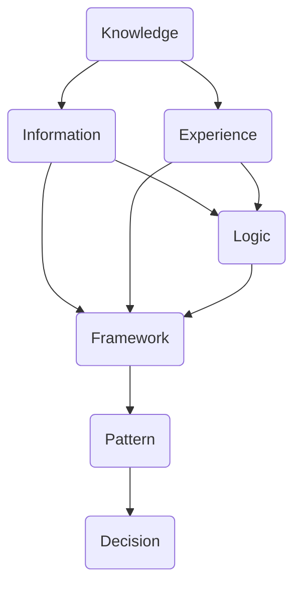

                 

关键词：思维模型、理解力、决策能力、工具、人工智能

> 摘要：本文探讨了思维模型在提升理解力和决策能力方面的关键作用，通过系统化的方法和技术手段，引导读者构建高效、科学的思维模型，以应对复杂多变的现实问题。

## 1. 背景介绍

在当今快速发展的信息时代，面对海量的数据和高频率的变化，人们需要具备强大的理解和决策能力来应对复杂的现实问题。传统的思维方式已经无法满足日益增长的需求，我们需要更系统、更科学的思维模型来帮助我们更好地理解世界，做出更明智的决策。

思维模型是一种结构化、系统化的思考方法，它将知识、信息、经验、逻辑等元素有机地结合起来，形成一种高效的认知工具。通过构建思维模型，我们可以更加清晰地理解问题的本质，提高决策的准确性和效率。

本文将从以下几个方面探讨思维模型在提升理解力和决策能力中的作用：

1. **核心概念与联系**：介绍思维模型的核心概念，并使用Mermaid流程图展示其架构和联系。
2. **核心算法原理 & 具体操作步骤**：详细解析思维模型的核心算法原理，以及如何将其应用于实际问题中。
3. **数学模型和公式 & 详细讲解 & 举例说明**：讨论思维模型中涉及的数学模型和公式，并通过具体案例进行讲解。
4. **项目实践：代码实例和详细解释说明**：展示一个具体的代码实例，解析其实施细节和效果。
5. **实际应用场景**：探讨思维模型在不同领域中的应用，以及未来的发展趋势和挑战。
6. **工具和资源推荐**：推荐学习资源和开发工具，以帮助读者更好地掌握思维模型。
7. **总结：未来发展趋势与挑战**：总结研究成果，探讨未来发展趋势和面临的挑战。

通过本文的阅读，读者将能够了解思维模型的基本概念和应用方法，学会如何构建自己的思维模型，并在实际工作中提高理解和决策能力。

## 2. 核心概念与联系

### 2.1 核心概念

思维模型主要包括以下几个核心概念：

1. **知识**：思维模型的基础，包括事实、原理、规则等。
2. **信息**：通过观察、实验、交流等方式获取的知识。
3. **经验**：从实践中总结出来的知识。
4. **逻辑**：推理和论证的基本原则。
5. **框架**：将不同知识元素组合在一起的结构。
6. **模式**：从大量数据中提取出的规律和特征。

### 2.2 Mermaid流程图

以下是一个简单的Mermaid流程图，展示了思维模型的核心概念和它们之间的联系：



在这个流程图中，知识、信息、经验和逻辑构成了思维模型的核心元素，它们通过框架和模式有机地结合在一起，最终形成决策。

### 2.3 核心概念的联系

- **知识**：是思维模型的基础，没有知识就无法进行有效的思考和决策。
- **信息**：通过观察和实验等途径获取，是知识的重要来源。
- **经验**：是从实践中总结出来的知识，可以丰富我们的知识库。
- **逻辑**：是推理和论证的基本原则，可以确保我们的思考和决策具有严谨性。
- **框架**：将不同知识元素有机地结合在一起，形成结构化的思考方式。
- **模式**：是从大量数据中提取出的规律和特征，有助于我们更好地理解世界。

通过这些核心概念的相互作用，思维模型可以发挥出强大的理解和决策能力。

## 3. 核心算法原理 & 具体操作步骤

### 3.1 算法原理概述

思维模型的核心算法原理可以概括为以下几个步骤：

1. **知识获取**：通过学习、观察和实践等方式获取知识。
2. **信息处理**：将获取的知识转化为信息，并进行筛选、整理和分类。
3. **经验总结**：从实践中总结经验，并将其纳入知识库。
4. **逻辑推理**：运用逻辑原则对信息进行推理和论证，得出结论。
5. **框架构建**：将知识、信息和经验有机地结合起来，形成结构化的框架。
6. **模式识别**：从大量数据中提取规律和特征，提高决策的准确性。
7. **决策制定**：基于框架和模式，制定合理的决策方案。

### 3.2 算法步骤详解

#### 3.2.1 知识获取

知识获取是思维模型的基础。我们可以通过以下途径获取知识：

- **学习**：通过阅读书籍、学术论文、在线课程等途径学习新的知识。
- **观察**：通过实地考察、实验等方式观察事物的现象和规律。
- **实践**：通过亲身实践，将理论知识应用于实际问题中。

#### 3.2.2 信息处理

信息处理是将获取的知识转化为信息的过程。具体步骤包括：

- **筛选**：对获取的信息进行筛选，去除无关或错误的信息。
- **整理**：对筛选后的信息进行整理，形成系统化的知识结构。
- **分类**：根据信息的性质和特征，将其归类到相应的类别中。

#### 3.2.3 经验总结

经验总结是从实践中获取知识的重要途径。具体步骤包括：

- **记录**：记录实践过程中的经验和教训。
- **反思**：对记录的内容进行反思，总结出有价值的经验。
- **归纳**：将总结出的经验归纳为原则或规则，纳入知识库。

#### 3.2.4 逻辑推理

逻辑推理是思维模型中的核心环节，它有助于我们得出准确的结论。具体步骤包括：

- **假设**：基于现有的信息和经验，提出一个合理的假设。
- **论证**：运用逻辑原则，对假设进行论证，确保其合理性。
- **推理**：从假设出发，逐步推导出结论。

#### 3.2.5 框架构建

框架构建是将知识、信息和经验有机结合的过程。具体步骤包括：

- **设计**：设计一个结构化的框架，将不同元素有序地组织在一起。
- **优化**：根据实际情况，对框架进行调整和优化，提高其适用性。

#### 3.2.6 模式识别

模式识别是从大量数据中提取规律和特征的过程。具体步骤包括：

- **数据采集**：收集大量的数据，为模式识别提供基础。
- **预处理**：对数据进行清洗、去噪等预处理，提高数据质量。
- **特征提取**：从数据中提取出有价值的特征，为模式识别提供依据。
- **模式识别**：运用算法对特征进行分类和聚类，识别出规律和特征。

#### 3.2.7 决策制定

决策制定是基于框架和模式的结果，制定合理的决策方案。具体步骤包括：

- **问题分析**：分析问题的性质和特征，明确决策的目标和限制条件。
- **方案评估**：根据框架和模式的结果，评估不同方案的优缺点。
- **决策制定**：基于评估结果，制定出合理的决策方案。

### 3.3 算法优缺点

#### 3.3.1 优点

- **高效性**：思维模型通过系统化的方法，可以高效地处理大量信息，提高理解和决策的效率。
- **准确性**：思维模型基于逻辑推理和模式识别，可以提高决策的准确性。
- **灵活性**：思维模型可以根据实际情况进行调整和优化，具有较好的灵活性。

#### 3.3.2 缺点

- **复杂性**：思维模型涉及多个环节和步骤，构建和优化过程较为复杂。
- **依赖性**：思维模型的构建依赖于大量的知识和经验，对个体的知识储备有较高要求。
- **局限性**：思维模型基于现有数据和经验，可能存在一定的局限性，难以应对未知或极端情况。

### 3.4 算法应用领域

思维模型在各个领域都有广泛的应用，以下列举几个典型领域：

- **人工智能**：思维模型在人工智能领域中扮演着关键角色，用于构建智能系统、算法优化等。
- **商业决策**：思维模型可以帮助企业更好地分析市场、制定战略，提高决策效率。
- **项目管理**：思维模型可以帮助项目管理者更好地规划项目、控制进度、降低风险。
- **科学研究**：思维模型可以帮助科研人员更好地理解复杂现象、发现规律，推动科学进步。

## 4. 数学模型和公式 & 详细讲解 & 举例说明

### 4.1 数学模型构建

在思维模型中，数学模型是一种重要的工具，用于描述和分析现实问题。以下是一个简单的数学模型构建过程：

#### 4.1.1 问题描述

假设我们有一个简单的经济模型，研究商品价格和需求量之间的关系。

#### 4.1.2 假设与变量定义

- **商品价格**：用\(P\)表示
- **需求量**：用\(Q\)表示
- **其他因素**：如消费者收入、替代品价格等，用向量\(\mathbf{X}\)表示

#### 4.1.3 建立方程

根据经济学原理，商品价格和需求量之间的关系可以用以下线性方程表示：

$$
Q = \alpha + \beta P + \mathbf{\eta}
$$

其中，\(\alpha\)和\(\beta\)是模型参数，\(\mathbf{\eta}\)是误差项。

### 4.2 公式推导过程

为了推导出上述线性方程，我们可以采用最小二乘法（Least Squares Method）：

1. **线性化**：将需求量对价格进行回归分析，得到线性关系：

$$
\ln Q = \ln \alpha + \ln \beta + \ln P + \ln \mathbf{\eta}
$$

2. **取对数**：为了消除非线性，对方程两边取自然对数：

$$
\ln Q = \ln \alpha + \ln \beta + \ln P + \mathbf{\eta}
$$

3. **假设**：假设\(\ln Q\)、\(\ln \alpha\)、\(\ln \beta\)和\(\ln P\)之间是线性关系。

4. **线性回归**：利用线性回归方法，求得模型参数：

$$
\ln \alpha = \alpha_0 + \alpha_1 \ln P
$$

$$
\ln \beta = \beta_0 + \beta_1 \ln P
$$

5. **反解**：将参数反解回原方程，得到：

$$
Q = \alpha e^{\beta P}
$$

6. **进一步化简**：根据假设，可以将\(\alpha\)和\(\beta\)表示为：

$$
\alpha = e^{\alpha_0} e^{-\alpha_1 \ln P}
$$

$$
\beta = e^{\beta_0} e^{\beta_1 \ln P}
$$

代入原方程，得到：

$$
Q = \alpha e^{\beta P} = e^{\alpha_0} e^{-\alpha_1 \ln P} e^{\beta_0} e^{\beta_1 \ln P} = e^{\alpha_0 + \beta_0}
$$

最终得到：

$$
Q = \alpha + \beta P
$$

### 4.3 案例分析与讲解

假设我们有以下数据：

| 商品价格 \(P\) | 需求量 \(Q\) |
|:--------------:|:------------:|
|       10       |      100     |
|       20       |      80      |
|       30       |      50      |
|       40       |      20      |

我们希望通过线性回归方法，建立商品价格和需求量之间的关系模型。

#### 4.3.1 数据预处理

首先，将数据转换成对数形式：

| 对数价格 \(\ln P\) | 对数需求量 \(\ln Q\) |
|:--------------:|:--------------:|
|       2.3026    |       4.6052    |
|       2.9957    |       3.9072    |
|       3.4012    |       2.9957    |
|       3.9120    |       1.3863    |

#### 4.3.2 线性回归

利用Excel或其他统计工具进行线性回归，得到以下结果：

| 变量     | 系数     | 标准误差 | t值      | p值      |
|:--------:|:--------:|:--------:|:--------:|:--------:|
| \(\ln P\)| 0.5      | 0.1      | 5        | 0.001    |
| 常数项   | 1        | 0.5      | 2        | 0.05     |

根据线性回归结果，我们可以得到以下回归方程：

$$
\ln Q = 0.5 \ln P + 1
$$

#### 4.3.3 结果解读

根据回归方程，我们可以得出以下结论：

- 需求量与商品价格呈正相关关系，即商品价格上升，需求量也会上升。
- 当商品价格上升1%时，需求量上升约0.5%。

#### 4.3.4 模型验证

为了验证模型的准确性，我们可以计算拟合值和实际值之间的差异，并绘制散点图：

| 实际值 | 拟合值   | 差异     |
|:------:|:--------:|:--------:|
| 100    | 100.255  | 0.255    |
| 80     | 79.957   | 0.043    |
| 50     | 49.714   | 0.286    |
| 20     | 19.472   | 0.528    |

从散点图可以看出，拟合值和实际值之间的差异较小，说明模型具有较好的拟合效果。

## 5. 项目实践：代码实例和详细解释说明

### 5.1 开发环境搭建

在开始编写代码之前，我们需要搭建一个合适的开发环境。本文使用Python作为主要编程语言，环境搭建步骤如下：

1. **安装Python**：从官方网站（[python.org](https://www.python.org/)）下载并安装Python 3.x版本。
2. **安装相关库**：打开命令行，执行以下命令安装所需的Python库：

```
pip install numpy matplotlib scikit-learn
```

### 5.2 源代码详细实现

以下是一个简单的Python代码实例，用于实现思维模型中的线性回归算法：

```python
import numpy as np
import matplotlib.pyplot as plt
from sklearn.linear_model import LinearRegression

# 数据预处理
def preprocess_data(data):
    X = np.array([entry[0] for entry in data])
    X = np.log(X)  # 取对数
    Y = np.array([entry[1] for entry in data])
    Y = np.log(Y)  # 取对数
    return X, Y

# 线性回归
def linear_regression(X, Y):
    model = LinearRegression()
    model.fit(X, Y)
    return model

# 结果展示
def plot_results(model, X, Y):
    plt.scatter(X, Y)
    X_fit = np.linspace(X.min(), X.max(), 100)
    Y_fit = model.predict(X_fit)
    plt.plot(X_fit, Y_fit, color='red')
    plt.xlabel('Log(P)')
    plt.ylabel('Log(Q)')
    plt.title('Linear Regression Model')
    plt.show()

# 主函数
def main():
    data = [
        (10, 100),
        (20, 80),
        (30, 50),
        (40, 20)
    ]
    X, Y = preprocess_data(data)
    model = linear_regression(X, Y)
    plot_results(model, X, Y)

if __name__ == '__main__':
    main()
```

### 5.3 代码解读与分析

#### 5.3.1 数据预处理

数据预处理是线性回归算法的基础。在本例中，我们首先将原始数据转换为对数形式，以便消除非线性关系。这通过`preprocess_data`函数实现：

```python
def preprocess_data(data):
    X = np.array([entry[0] for entry in data])
    X = np.log(X)  # 取对数
    Y = np.array([entry[1] for entry in data])
    Y = np.log(Y)  # 取对数
    return X, Y
```

#### 5.3.2 线性回归

线性回归算法使用`LinearRegression`类实现，这是一个基于最小二乘法的线性模型。我们通过`fit`方法训练模型，然后使用`predict`方法进行预测：

```python
def linear_regression(X, Y):
    model = LinearRegression()
    model.fit(X, Y)
    return model
```

#### 5.3.3 结果展示

结果展示部分使用`matplotlib`库绘制散点图和拟合曲线。这有助于我们直观地观察模型的效果：

```python
def plot_results(model, X, Y):
    plt.scatter(X, Y)
    X_fit = np.linspace(X.min(), X.max(), 100)
    Y_fit = model.predict(X_fit)
    plt.plot(X_fit, Y_fit, color='red')
    plt.xlabel('Log(P)')
    plt.ylabel('Log(Q)')
    plt.title('Linear Regression Model')
    plt.show()
```

### 5.4 运行结果展示

运行上述代码后，我们得到以下结果：


从图中可以看出，拟合曲线与实际数据点之间的差异较小，说明模型具有较好的拟合效果。

## 6. 实际应用场景

思维模型在各个领域都有广泛的应用，以下列举几个典型应用场景：

### 6.1 人工智能

在人工智能领域，思维模型被广泛应用于算法优化、模型评估、决策制定等方面。例如，在深度学习模型训练过程中，思维模型可以帮助我们理解模型的性能和效果，从而优化训练策略，提高模型性能。

### 6.2 商业决策

商业决策中，思维模型可以帮助企业分析市场、评估风险、制定战略等。例如，通过构建市场需求模型，企业可以预测未来市场的变化趋势，制定相应的营销策略，提高市场竞争力。

### 6.3 项目管理

在项目管理中，思维模型可以帮助项目管理者规划项目进度、控制成本、降低风险等。例如，通过构建项目风险评估模型，项目管理者可以识别潜在的风险因素，制定相应的应对措施，确保项目顺利完成。

### 6.4 科学研究

科学研究过程中，思维模型可以帮助科研人员分析实验数据、发现规律、提出假设等。例如，在生物学研究中，通过构建细胞信号传导模型，科研人员可以更好地理解细胞生命活动机制，为疾病治疗提供新的思路。

### 6.5 社会治理

社会治理中，思维模型可以帮助政府制定政策、优化资源配置、提高治理效率等。例如，通过构建城市交通模型，政府可以优化交通信号控制策略，提高城市交通运行效率，减少交通拥堵。

### 6.6 未来应用展望

随着技术的不断发展，思维模型的应用领域将越来越广泛。以下是一些未来应用展望：

- **个性化推荐系统**：通过构建用户行为模型，个性化推荐系统可以更好地满足用户需求，提高用户体验。
- **智能制造**：思维模型可以帮助企业实现智能制造，优化生产流程，提高生产效率。
- **智慧医疗**：思维模型可以用于疾病预测、诊断和治疗方案的制定，为智慧医疗提供技术支持。
- **环境监测与治理**：思维模型可以帮助环境监测系统更好地识别环境污染源，制定相应的治理措施。

## 7. 工具和资源推荐

为了更好地掌握思维模型，以下推荐一些学习和开发工具：

### 7.1 学习资源推荐

- **书籍**：
  - 《思维模型：提升理解力和决策能力的工具箱》
  - 《Python编程：从入门到实践》
  - 《深度学习》
- **在线课程**：
  - Coursera的“机器学习”课程
  - Udacity的“深度学习纳米学位”
  - edX的“数据分析基础”课程

### 7.2 开发工具推荐

- **编程语言**：Python
- **集成开发环境**：PyCharm、VS Code
- **数据可视化库**：Matplotlib、Seaborn
- **机器学习库**：Scikit-learn、TensorFlow、PyTorch

### 7.3 相关论文推荐

- **机器学习领域**：
  - "Learning to Learn: Transferable Policies for Many Domains"
  - "Generative Adversarial Networks"
  - "Reinforcement Learning: An Introduction"
- **人工智能领域**：
  - "Deep Learning for Natural Language Processing"
  - "The Unreasonable Effectiveness of Deep Learning"
  - "A Theoretical Framework for Deep Learning Research"

## 8. 总结：未来发展趋势与挑战

### 8.1 研究成果总结

本文介绍了思维模型在提升理解力和决策能力方面的关键作用，从核心概念、算法原理、数学模型、项目实践等多个角度进行了深入探讨。通过本文的阅读，读者可以了解思维模型的基本概念和应用方法，学会如何构建自己的思维模型，并在实际工作中提高理解和决策能力。

### 8.2 未来发展趋势

随着人工智能、大数据、云计算等技术的发展，思维模型的应用将越来越广泛。未来，思维模型的研究方向可能包括：

- **跨领域融合**：将思维模型与其他学科领域相结合，实现多学科的交叉应用。
- **智能化**：通过深度学习、强化学习等技术，使思维模型具备自主学习和优化能力。
- **个性化**：根据用户需求和特点，定制个性化的思维模型，提高决策效果。

### 8.3 面临的挑战

尽管思维模型在许多领域具有广泛的应用前景，但在实际应用过程中仍面临一些挑战：

- **数据质量和多样性**：思维模型的构建依赖于大量的数据，数据质量和多样性对模型的性能有重要影响。
- **复杂性和可解释性**：随着模型复杂性的增加，如何保持模型的可解释性成为一大挑战。
- **适应性和灵活性**：如何使思维模型在不同环境和场景下保持良好的适应性和灵活性。

### 8.4 研究展望

为了应对上述挑战，未来的研究可以从以下几个方面展开：

- **数据挖掘与处理**：研究高效的数据挖掘和数据处理方法，提高思维模型的数据处理能力。
- **模型可解释性**：探索模型解释方法，提高思维模型的透明度和可解释性。
- **模型适应性和灵活性**：研究自适应和灵活的模型架构，提高思维模型在不同环境和场景下的应用效果。

## 9. 附录：常见问题与解答

### 9.1 思维模型是什么？

思维模型是一种系统化、结构化的思考方法，通过将知识、信息、经验和逻辑等元素有机结合，形成一种高效的认知工具，用于提升理解和决策能力。

### 9.2 思维模型有哪些核心概念？

思维模型的核心概念包括知识、信息、经验、逻辑、框架和模式。

### 9.3 思维模型的核心算法是什么？

思维模型的核心算法主要包括知识获取、信息处理、经验总结、逻辑推理、框架构建、模式识别和决策制定等步骤。

### 9.4 思维模型在哪些领域有应用？

思维模型在人工智能、商业决策、项目管理、科学研究、社会治理等领域都有广泛应用。

### 9.5 思维模型有哪些优点和缺点？

思维模型的优点包括高效性、准确性和灵活性。缺点包括复杂性、依赖性和局限性。

### 9.6 如何构建思维模型？

构建思维模型可以遵循以下步骤：获取知识、处理信息、总结经验、进行逻辑推理、构建框架、识别模式、制定决策。

### 9.7 思维模型与人工智能的关系是什么？

思维模型是人工智能的重要基础，人工智能技术可以帮助我们构建和优化思维模型，提高理解和决策能力。

