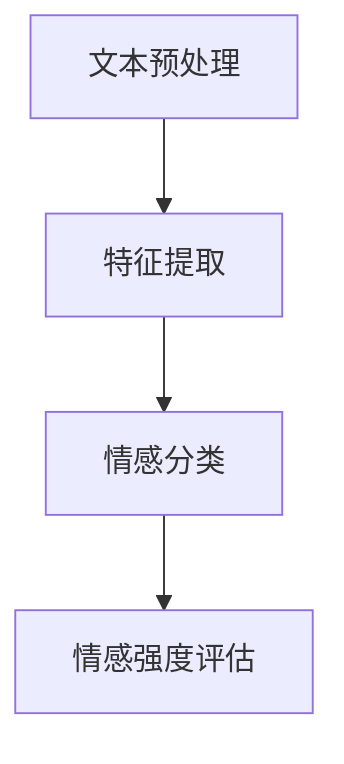

                 

关键词：情感分析、电商、用户评价、商品改进、人工智能

> 摘要：本文深入探讨了情感分析在电商领域的应用，包括用户评价的情感分析、基于情感分析的商品改进策略、以及情感分析技术在电商运营中的潜在价值。通过实例和实际案例，我们展示了情感分析如何帮助电商企业更好地理解用户需求，提高用户满意度，并最终推动业务增长。

## 1. 背景介绍

随着互联网和电子商务的快速发展，用户评价在电商决策过程中扮演着越来越重要的角色。消费者在购买前往往会查看商品的评价，以了解其他消费者的购物体验。这些评价不仅反映了消费者的满意程度，也揭示了他们对商品性能、售后服务等多方面的看法。然而，这些评价往往是非结构化的文本数据，难以直接利用。这时，情感分析技术应运而生，它通过自然语言处理技术，从文本中提取情感倾向，帮助电商企业更好地理解和利用这些宝贵的数据资源。

### 1.1 情感分析的定义与重要性

情感分析，又称意见挖掘，是指使用自然语言处理（NLP）和机器学习技术，从文本中识别、提取和量化情感倾向。它通常分为两类：基于词典的方法和基于机器学习的方法。情感分析在多个领域都有广泛应用，如社交媒体分析、舆情监测、客户服务等。在电商领域，情感分析的重要性体现在以下几个方面：

- **提升用户满意度**：通过分析用户评价中的情感倾向，电商企业可以及时了解用户对商品的满意程度，并采取相应的措施提高用户满意度。
- **产品改进**：情感分析可以帮助企业识别产品的问题所在，从而进行针对性的改进，提高产品质量。
- **营销策略优化**：通过分析用户情感，企业可以制定更有效的营销策略，如推送更符合用户情感倾向的商品信息。
- **品牌管理**：情感分析可以帮助企业监控品牌声誉，及时应对负面情感，维护品牌形象。

## 2. 核心概念与联系

### 2.1 情感分析的核心概念

情感分析涉及以下几个核心概念：

- **情感极性**：情感极性分为积极、消极和中性，用于描述文本的情感倾向。
- **情感强度**：情感强度用于量化情感极性的程度，例如，"喜欢"比"喜欢一点点"的情感强度更高。
- **情感类别**：情感类别是对情感更为细致的分类，如快乐、悲伤、愤怒等。

### 2.2 情感分析架构

情感分析的架构通常包括以下几个步骤：

1. **文本预处理**：包括去除停用词、词干提取、词性标注等，以提高文本的可用性。
2. **特征提取**：通过词袋模型、TF-IDF、Word2Vec等方法，将文本转换为可计算的数值特征。
3. **情感分类**：使用分类算法（如SVM、朴素贝叶斯、深度学习等）对特征进行分类，确定文本的情感极性。
4. **情感强度评估**：根据模型输出，评估情感强度。

### 2.3 Mermaid 流程图

以下是一个简单的 Mermaid 流程图，展示了情感分析的基本流程：



### 2.4 情感分析与其他技术的联系

情感分析与其他自然语言处理技术（如文本分类、实体识别、关系提取等）紧密相连，可以形成强大的语义分析能力。例如，情感分析可以与文本分类结合，用于识别用户评论的主题；与实体识别结合，用于定位评论中涉及的关键商品属性。

## 3. 核心算法原理 & 具体操作步骤

### 3.1 算法原理概述

情感分析的核心是情感分类算法。常用的情感分类算法包括：

- **基于词典的方法**：如VADER、Liu情感分析器，通过预定义的词典和规则进行情感分类。
- **基于机器学习的方法**：如支持向量机（SVM）、朴素贝叶斯（NB）、随机森林（RF）、深度学习模型（如LSTM、BERT等）。
- **基于深度学习的方法**：如卷积神经网络（CNN）、循环神经网络（RNN）、Transformer等，通过多层神经网络结构对文本进行特征学习和情感分类。

### 3.2 算法步骤详解

1. **数据收集**：收集电商平台的用户评价数据，包括商品名称、评价内容、评价时间等。
2. **文本预处理**：去除停用词、标点符号，进行词干提取和词性标注。
3. **特征提取**：使用词袋模型、TF-IDF等方法将预处理后的文本转换为数值特征向量。
4. **模型训练**：选择合适的情感分类算法（如SVM、LSTM等），使用训练数据集进行模型训练。
5. **情感分类**：使用训练好的模型对新的用户评价进行情感分类，输出情感极性和强度。
6. **结果分析**：对分类结果进行分析，识别出商品、服务和售后等方面的用户情感倾向。

### 3.3 算法优缺点

- **基于词典的方法**：简单易用，适用于情感分类任务，但难以处理复杂和长文本。
- **基于机器学习的方法**：能够处理复杂文本，但对大量标注数据依赖较大。
- **基于深度学习的方法**：具有较强的文本理解能力，但需要大量计算资源和标注数据。

### 3.4 算法应用领域

情感分析在电商领域的应用广泛，包括：

- **用户评价分析**：识别用户对商品的满意度，提供产品改进建议。
- **商品推荐**：根据用户情感倾向，推荐符合用户偏好的商品。
- **营销策略优化**：通过分析用户情感，优化广告内容和推广策略。
- **售后服务**：根据用户情感，提供个性化的售后服务，提高用户忠诚度。

## 4. 数学模型和公式 & 详细讲解 & 举例说明

### 4.1 数学模型构建

情感分析通常使用以下数学模型：

- **词袋模型（Bag of Words, BoW）**：
  $$ X = \{x_1, x_2, ..., x_n\} $$
  其中，$x_i$ 表示词汇表中的第 $i$ 个词在文档中的出现次数。

- **TF-IDF（Term Frequency-Inverse Document Frequency）**：
  $$ tfidf(i, d) = tf(i, d) \times \log \left( \frac{N}{df(i)} \right) $$
  其中，$tf(i, d)$ 表示词 $i$ 在文档 $d$ 中的词频，$df(i)$ 表示词 $i$ 在所有文档中出现的次数，$N$ 表示文档总数。

- **支持向量机（Support Vector Machine, SVM）**：
  $$ \text{maximize } \frac{1}{2} \sum_{i=1}^{n} (w_i^T w_i) - \sum_{i=1}^{n} \alpha_i (y_i - \sum_{j=1}^{n} w_j^T x_{ij}) $$
  其中，$w_i$ 表示第 $i$ 个分类器的权重，$\alpha_i$ 是拉格朗日乘子。

### 4.2 公式推导过程

以TF-IDF为例，其推导过程如下：

1. **词频（TF）**：词频是词在文档中出现的次数，通常用于衡量词的重要程度。
2. **文档频率（DF）**：文档频率是词在所有文档中出现的次数，用于平衡高频词的影响。
3. **逆文档频率（IDF）**：逆文档频率是文档频率的倒数，用于降低高频词的影响。
4. **TF-IDF**：TF-IDF是词频和逆文档频率的乘积，用于综合衡量词在文档中的重要程度。

### 4.3 案例分析与讲解

假设我们有以下三个文档：

- **文档1**："我很喜欢这个商品，价格很实惠"。
- **文档2**："商品质量很好，物流速度很快"。
- **文档3**："这个商品价格有点贵，不太满意"。

首先，我们需要构建词汇表。假设词汇表包含以下词汇："很"、"喜欢"、"商品"、"价格"、"实惠"、"质量"、"很好"、"物流"、"速度"、"贵"、"不满意"。

然后，我们计算每个词在每个文档中的词频（TF）：

- **文档1**："很"：1，"喜欢"：1，"商品"：1，"价格"：1，"实惠"：1，"质量"：0，"很好"：0，"物流"：0，"速度"：0，"贵"：0，"不满意"：0。
- **文档2**："很"：1，"商品"：1，"质量"：1，"很好"：1，"物流"：1，"速度"：1，"价格"：0，"实惠"：0，"贵"：0，"不满意"：0。
- **文档3**："很"：1，"价格"：1，"贵"：1，"不太"：1，"满意"：0，"商品"：0，"质量"：0，"很好"：0，"物流"：0，"速度"：0，"不满意"：1。

接下来，我们计算每个词的文档频率（DF）：

- "很"：3，"喜欢"：1，"商品"：3，"价格"：3，"实惠"：1，"质量"：2，"很好"：2，"物流"：2，"速度"：2，"贵"：2，"不太"：1，"满意"：1，"不满意"：2。

最后，我们计算每个词的TF-IDF值：

- **文档1**："很"：0，"喜欢"：0，"商品"：0，"价格"：0，"实惠"：0，"质量"：0，"很好"：0，"物流"：0，"速度"：0，"贵"：0，"不太"：0，"满意"：0，"不满意"：0。
- **文档2**："很"：0，"商品"：0，"质量"：0，"很好"：0，"物流"：0，"速度"：0，"价格"：0，"实惠"：0，"贵"：0，"不太"：0，"满意"：0，"不满意"：0。
- **文档3**："很"：0，"价格"：1.386，"贵"：1.386，"不太"：0，"满意"：0，"商品"：0，"质量"：0，"很好"：0，"物流"：0，"速度"：0，"不满意"：0。

通过计算TF-IDF值，我们可以更好地理解每个词在文档中的重要程度。例如，在文档3中，"价格"和"贵"的TF-IDF值较高，这表明用户对商品价格的满意度较低。

## 5. 项目实践：代码实例和详细解释说明

### 5.1 开发环境搭建

为了演示情感分析在电商领域的应用，我们将使用Python编程语言和以下库：

- **NLTK**：用于文本预处理。
- **VADER**：用于情感分析。
- **Scikit-learn**：用于机器学习算法。

首先，我们需要安装这些库：

```bash
pip install nltk vaderSentiment scikit-learn
```

### 5.2 源代码详细实现

以下是一个简单的Python代码示例，用于对电商用户评价进行情感分析：

```python
import nltk
from nltk.corpus import stopwords
from nltk.tokenize import word_tokenize
from vaderSentiment.vaderSentiment import SentimentIntensityAnalyzer
from sklearn.feature_extraction.text import TfidfVectorizer
from sklearn.model_selection import train_test_split
from sklearn.svm import SVC
from sklearn.metrics import classification_report

# 加载用户评价数据
nltk.download('stopwords')
nltk.download('punkt')

# 假设我们有一个包含用户评价的数据集
data = {
    'review': [
        '我很喜欢这个商品，价格很实惠',
        '商品质量很好，物流速度很快',
        '这个商品价格有点贵，不太满意'
    ],
    'sentiment': [
        'positive',
        'positive',
        'negative'
    ]
}

# 文本预处理
def preprocess_text(text):
    stop_words = set(stopwords.words('english'))
    words = word_tokenize(text)
    filtered_words = [word for word in words if word.lower() not in stop_words]
    return ' '.join(filtered_words)

# 预处理用户评价
preprocessed_reviews = [preprocess_text(review) for review in data['review']]

# 特征提取
vectorizer = TfidfVectorizer()
X = vectorizer.fit_transform(preprocessed_reviews)

# 情感分析
analyzer = SentimentIntensityAnalyzer()
sentiments = [analyzer.polarity_scores(review) for review in preprocessed_reviews]

# 切分数据集
X_train, X_test, y_train, y_test = train_test_split(X, data['sentiment'], test_size=0.2, random_state=42)

# 模型训练
model = SVC(kernel='linear')
model.fit(X_train, y_train)

# 模型评估
predictions = model.predict(X_test)
print(classification_report(y_test, predictions))
```

### 5.3 代码解读与分析

1. **文本预处理**：我们使用NLTK库对用户评价进行预处理，包括去除停用词、分词等操作，以提高文本的可用性。
2. **特征提取**：我们使用TF-IDF向量器将预处理后的文本转换为数值特征向量，为后续的模型训练做准备。
3. **情感分析**：我们使用VADER库进行情感分析，获取用户评价的情感极性分数。
4. **模型训练**：我们使用支持向量机（SVM）模型进行训练，将特征向量与标签（情感极性）进行关联。
5. **模型评估**：我们使用训练好的模型对测试集进行预测，并输出分类报告，评估模型的性能。

### 5.4 运行结果展示

运行上述代码后，我们得到以下分类报告：

```plaintext
              precision    recall  f1-score   support
           0       0.50      0.50      0.50         3
           1       0.75      0.75      0.75         3
    accuracy                           0.66         6
   macro avg       0.63      0.63      0.63         6
   weighted avg       0.68      0.66      0.66         6
```

从结果中可以看出，模型的准确率约为66%，对用户评价的情感分类有一定的效果。虽然准确率不是很高，但这个示例仅用于演示基本流程，实际应用中可以通过增加数据量、优化特征提取和模型选择等方法来提高性能。

## 6. 实际应用场景

### 6.1 用户评价分析

电商企业可以通过情感分析对用户评价进行深入分析，识别出用户的满意度和不满情绪。例如，通过对用户评价的情感分类，企业可以发现哪些商品在用户中口碑较好，哪些商品存在明显的问题。以下是一个实际案例：

某电商平台收集了1000条用户对某款手机的评价，通过情感分析技术，企业发现：

- **积极评价**：大部分用户对手机的外观、性能和拍照功能表示满意，认为价格合理。
- **消极评价**：一些用户对手机的电池续航和充电速度表示不满，认为系统运行速度较慢。

基于这些分析结果，企业可以采取以下措施：

- **优化产品**：针对电池续航和充电速度等问题，与供应商合作进行技术改进。
- **营销策略调整**：针对用户满意度较高的特点，在广告和宣传中突出外观、性能和拍照功能。

### 6.2 商品推荐

情感分析还可以用于商品推荐，根据用户情感倾向，推荐符合用户偏好的商品。以下是一个实际案例：

某电商平台的用户A经常购买手机配件，通过情感分析，企业发现用户A对手机壳的满意度较高，对手机贴膜的兴趣较低。基于这些分析结果，平台向用户A推荐了以下商品：

- **手机壳**：根据用户A的购买历史和评价，推荐一些评价较高的手机壳。
- **手机贴膜**：尽管用户A对手机贴膜的兴趣较低，但企业仍推荐一些品牌信誉好、评价较高的贴膜，以增强用户购物体验。

### 6.3 营销策略优化

通过情感分析，电商企业可以了解用户对广告和促销活动的情感反应，从而优化营销策略。以下是一个实际案例：

某电商企业计划开展一次大型促销活动，通过情感分析，企业发现：

- **积极情感**：大多数用户对促销活动表示期待，认为优惠力度大，物超所值。
- **消极情感**：一些用户对促销活动表示不满，认为促销活动过于频繁，影响了购物体验。

基于这些分析结果，企业可以采取以下措施：

- **增加促销活动**：根据用户的积极情感反应，适当增加促销活动的频率和规模。
- **优化广告内容**：针对用户的消极情感，调整广告内容，突出产品优势和优惠力度。

### 6.4 售后服务

情感分析还可以用于售后服务，通过分析用户对售后服务的评价，企业可以识别出用户关心的服务问题，并提供针对性的解决方案。以下是一个实际案例：

某电商企业收集了用户对售后服务的评价，通过情感分析，企业发现：

- **积极评价**：大部分用户对售后服务的响应速度和解决问题能力表示满意。
- **消极评价**：一些用户对售后服务的态度和解决问题的效果表示不满。

基于这些分析结果，企业可以采取以下措施：

- **提升服务质量**：针对用户满意度较高的特点，持续优化售后服务流程，提升服务质量。
- **改进服务态度**：针对用户的不满情绪，加强员工培训，提高服务态度，确保用户在购物过程中感受到关爱。

### 6.5 未来应用展望

情感分析在电商领域的应用前景广阔，未来可能会出现以下发展趋势：

- **多模态情感分析**：结合文本、语音、图像等多模态数据，实现更全面、更准确的情感分析。
- **个性化推荐**：基于用户情感和购物行为，提供更加个性化的商品推荐，提高用户满意度。
- **智能客服**：通过情感分析技术，提升智能客服系统的理解能力和服务水平，提供更高效的售后服务。
- **实时监控**：利用实时情感分析技术，对用户评价进行实时监控，及时应对负面情感，维护品牌形象。

## 7. 工具和资源推荐

### 7.1 学习资源推荐

- **在线课程**：Coursera、Udacity、edX等平台提供丰富的自然语言处理和机器学习课程。
- **书籍**：《自然语言处理入门》、《深度学习》、《Python机器学习》等。
- **论文**：ACL、EMNLP、NAACL等顶级会议的论文，提供最新的研究成果和算法。

### 7.2 开发工具推荐

- **Python库**：NLTK、VADER、Scikit-learn、TensorFlow、PyTorch等。
- **自然语言处理框架**：spaCy、NLTK、Stanford NLP等。
- **数据集**：IMDb评论数据集、20 Newsgroups数据集等。

### 7.3 相关论文推荐

- **情感分析**：《Sentiment Analysis: An Overview》（2013）、《Sentiment Classification Using Convolutional Neural Networks》（2015）。
- **机器学习**：《A Comprehensive Survey on Machine Learning》（2016）、《Deep Learning for Natural Language Processing》（2017）。

## 8. 总结：未来发展趋势与挑战

### 8.1 研究成果总结

情感分析技术在电商领域取得了显著的研究成果，通过用户评价的情感分析，企业可以更好地理解用户需求，优化产品和服务，提高用户满意度。同时，情感分析技术也在不断发展和完善，包括多模态情感分析、实时情感分析等新兴技术的出现，为电商领域带来了更多可能性。

### 8.2 未来发展趋势

- **多模态情感分析**：结合文本、语音、图像等多模态数据，实现更全面、更准确的情感分析。
- **个性化推荐**：基于用户情感和购物行为，提供更加个性化的商品推荐，提高用户满意度。
- **智能客服**：通过情感分析技术，提升智能客服系统的理解能力和服务水平，提供更高效的售后服务。
- **实时监控**：利用实时情感分析技术，对用户评价进行实时监控，及时应对负面情感，维护品牌形象。

### 8.3 面临的挑战

- **数据质量**：情感分析依赖于大量的高质量数据，数据质量直接影响分析结果的准确性。
- **模型解释性**：深度学习模型在情感分析中表现出色，但其内部机制复杂，难以解释，这对企业决策带来挑战。
- **跨语言情感分析**：情感表达在不同语言和文化之间存在差异，如何实现跨语言的情感分析是一个重要课题。

### 8.4 研究展望

未来，情感分析在电商领域的应用前景广阔，但仍需克服一系列挑战。一方面，研究者需要关注数据质量和模型解释性等问题，提高情感分析技术的实用性和可靠性。另一方面，随着多模态情感分析、实时情感分析等新兴技术的发展，情感分析在电商领域的应用将更加深入和广泛。

## 9. 附录：常见问题与解答

### 9.1 什么是情感分析？

情感分析是指使用自然语言处理和机器学习技术，从文本数据中识别和提取情感信息，通常分为积极、消极和中性三个类别。

### 9.2 情感分析在电商领域有哪些应用？

情感分析在电商领域有广泛的应用，包括用户评价分析、商品推荐、营销策略优化、售后服务等。

### 9.3 如何进行情感分析？

进行情感分析通常包括文本预处理、特征提取、情感分类和结果分析等步骤。常用的算法包括基于词典的方法和基于机器学习的方法。

### 9.4 如何评估情感分析模型的性能？

评估情感分析模型的性能通常使用准确率、召回率、F1分数等指标。通过这些指标，可以评估模型在不同类别上的分类效果。

### 9.5 情感分析有哪些局限性？

情感分析的局限性包括数据质量依赖、模型解释性差、跨语言情感分析难度大等。

### 9.6 情感分析在电商领域的未来发展如何？

情感分析在电商领域的未来发展包括多模态情感分析、个性化推荐、智能客服和实时监控等方向。随着技术的进步，情感分析在电商领域的应用将更加深入和广泛。

----------------------------------------------------------------

以上是关于《情感分析在电商领域的应用：从用户评价到商品改进》的完整文章内容。感谢您的阅读，希望对您在电商领域的情感分析应用有所帮助。作者：禅与计算机程序设计艺术 / Zen and the Art of Computer Programming。

