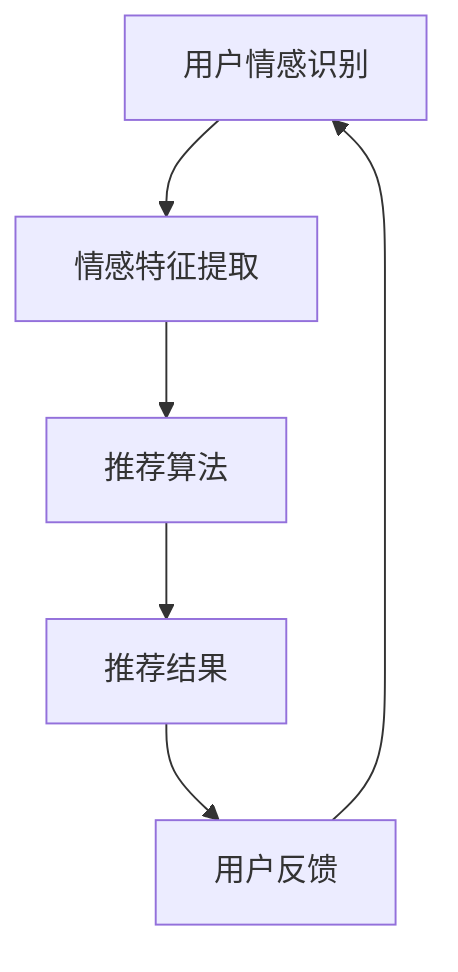

                 

关键词：情感计算，推荐系统，机器学习，用户情绪，商品推荐

> 摘要：本文将探讨情感计算在推荐系统中的应用，尤其是如何利用机器学习技术来捕捉和分析用户情绪，进而实现更加精准和个性化的商品推荐。本文将深入分析情感驱动推荐的核心概念、算法原理、数学模型，并通过实际案例和代码实例来展示这一技术的实现与应用。

## 1. 背景介绍

在信息爆炸的时代，用户面对海量的商品信息往往感到无所适从。传统的推荐系统通过用户的浏览历史、购买行为等数据进行推荐，虽然在一定程度上提高了推荐的准确性，但往往缺乏情感层面的理解。随着人工智能技术的发展，情感计算逐渐成为推荐系统研究的一个重要方向。情感计算通过分析用户的情绪状态，为用户提供更加个性化和贴近需求的推荐服务。

用户情绪作为推荐系统的一个重要参考因素，可以显著提升推荐的准确性和用户体验。情感计算通过对用户情绪的捕捉和分析，能够更好地理解用户的心理状态，从而在商品推荐中考虑到用户情绪的变化，实现更为智能化的推荐。

本文将围绕情感驱动推荐展开，首先介绍情感计算和推荐系统的基本概念，然后深入探讨情感计算在推荐系统中的应用，最后通过实际案例和代码实例来展示情感驱动推荐的实现过程。

## 2. 核心概念与联系

### 2.1 情感计算

情感计算（Affective Computing）是计算机科学领域的一个研究方向，旨在使计算机具备识别、理解、处理和模拟人类情感的能力。情感计算涉及到多个学科，包括认知科学、心理学、人机交互和自然语言处理等。

情感计算的核心概念包括：

- **情感识别**：通过生理信号、语言、行为等途径识别用户的情感状态。
- **情感理解**：理解和解释用户情感背后的意图和需求。
- **情感处理**：对识别和理解的情感信息进行处理，如情感增强、情感调控等。
- **情感模拟**：通过计算机模拟表达和展现情感，如虚拟助手、聊天机器人等。

### 2.2 推荐系统

推荐系统（Recommender System）是一种信息过滤技术，旨在向用户提供个性化的信息或商品推荐。推荐系统通常基于用户的历史行为、兴趣偏好和其他相关数据，通过统计学习、机器学习等方法生成推荐结果。

推荐系统的核心概念包括：

- **用户数据**：包括用户的浏览历史、购买记录、评价等。
- **推荐算法**：用于生成推荐结果的算法，如协同过滤、基于内容的推荐、混合推荐等。
- **推荐效果**：推荐结果的准确性和用户体验。

### 2.3 情感计算与推荐系统的联系

情感计算与推荐系统之间存在密切的联系。情感计算为推荐系统提供了更深入的用户理解能力，使得推荐系统能够更好地捕捉用户的情绪变化，从而生成更加精准和个性化的推荐。

情感计算在推荐系统中的应用主要包括：

- **情感特征提取**：将用户的情感信息转化为推荐系统的特征输入。
- **情感偏好建模**：利用用户情感信息构建情感偏好模型，影响推荐结果的生成。
- **情感上下文感知**：根据用户的情感状态调整推荐策略，提高推荐的相关性。

### 2.4 Mermaid 流程图



图2-1 情感计算与推荐系统流程图

## 3. 核心算法原理 & 具体操作步骤

### 3.1 算法原理概述

情感驱动推荐的核心在于将用户的情感状态与推荐过程相结合，从而实现更精准的推荐。主要涉及以下步骤：

1. **用户情感识别**：通过自然语言处理、生理信号检测等方法识别用户的情感状态。
2. **情感特征提取**：将情感状态转化为特征向量，作为推荐系统的输入。
3. **推荐算法优化**：利用情感特征对传统推荐算法进行优化，提高推荐质量。
4. **推荐结果生成**：根据用户的情感状态生成个性化推荐结果。
5. **用户反馈**：收集用户对推荐结果的反馈，用于进一步优化推荐系统。

### 3.2 算法步骤详解

#### 3.2.1 用户情感识别

用户情感识别是情感驱动推荐的第一步，主要任务是从用户的语言、行为和生理信号中识别出情感状态。常用的方法包括：

- **自然语言处理（NLP）**：通过分析用户的评论、留言等文本数据，使用情感分析（Sentiment Analysis）技术识别情感极性。
- **生理信号检测**：通过采集用户的生理信号（如心率、皮肤电导等），使用生理信号处理技术识别情感状态。

#### 3.2.2 情感特征提取

情感特征提取是将情感状态转化为推荐系统可以处理的特征向量。常用的方法包括：

- **词袋模型（Bag of Words, BoW）**：将用户的文本数据表示为词袋模型，提取情感相关的词汇作为特征。
- **情感词典（Sentiment Lexicon）**：利用情感词典将文本数据转化为情感特征向量。
- **深度学习模型**：使用深度学习模型（如卷积神经网络、循环神经网络等）对文本数据进行分析，提取情感特征。

#### 3.2.3 推荐算法优化

利用情感特征对传统推荐算法进行优化，常见的优化方法包括：

- **协同过滤（Collaborative Filtering）**：在协同过滤算法的基础上，加入情感特征进行加权，提高推荐质量。
- **基于内容的推荐（Content-based Filtering）**：在基于内容的推荐算法中，考虑情感特征对物品属性的影响，生成更贴近用户情感的推荐结果。
- **混合推荐（Hybrid Recommender Systems）**：将多种推荐算法相结合，利用情感特征对混合推荐结果进行优化。

#### 3.2.4 推荐结果生成

根据用户的情感状态生成个性化推荐结果，主要步骤包括：

- **推荐候选生成**：根据用户历史行为和情感特征，生成推荐候选列表。
- **推荐结果排序**：对推荐候选进行排序，优先推荐与用户情感状态相符的物品。
- **推荐结果呈现**：将推荐结果呈现给用户，如商品列表、推荐标签等。

#### 3.2.5 用户反馈

收集用户对推荐结果的反馈，用于进一步优化推荐系统，主要步骤包括：

- **反馈收集**：通过用户点击、评价、购买等行为收集反馈信息。
- **反馈分析**：分析反馈信息，识别推荐结果中的问题和不足。
- **系统优化**：根据反馈分析结果，对推荐系统进行优化，提高推荐质量。

### 3.3 算法优缺点

#### 3.3.1 优点

- **个性化推荐**：通过捕捉用户情感，实现更个性化的推荐。
- **提升用户体验**：考虑用户情感，提高推荐的相关性和用户体验。
- **情感理解**：深入理解用户需求，提供更有针对性的推荐。

#### 3.3.2 缺点

- **情感识别准确性**：情感识别技术尚未完全成熟，存在一定误差。
- **算法复杂性**：情感驱动推荐算法相对复杂，实现和优化难度较大。
- **隐私保护**：情感计算涉及用户隐私，需要确保数据安全和用户隐私保护。

### 3.4 算法应用领域

情感驱动推荐算法在多个领域具有广泛的应用前景，主要包括：

- **电子商务**：为用户提供个性化商品推荐，提高用户购买意愿。
- **社交媒体**：根据用户情感生成个性化内容推荐，提升用户活跃度。
- **娱乐领域**：根据用户情感推荐音乐、电影等娱乐内容，提升用户体验。
- **医疗健康**：通过分析用户情感状态，为用户提供个性化的健康管理建议。

## 4. 数学模型和公式

### 4.1 数学模型构建

情感驱动推荐系统的数学模型主要包括用户情感特征提取模型和推荐算法优化模型。以下是两个模型的基本公式。

#### 4.1.1 用户情感特征提取模型

假设用户情感特征向量表示为 \( \textbf{f} = [f_1, f_2, ..., f_n] \)，其中 \( f_i \) 表示第 \( i \) 个情感特征值。用户情感特征提取模型可以表示为：

$$
\textbf{f} = \textbf{W} \cdot \textbf{x}
$$

其中，\( \textbf{W} \) 为情感特征提取权重矩阵，\( \textbf{x} \) 为用户输入特征向量（如文本数据、生理信号等）。

#### 4.1.2 推荐算法优化模型

在协同过滤算法的基础上，考虑情感特征的影响，推荐算法优化模型可以表示为：

$$
\textbf{r} = \textbf{U} \cdot \textbf{f} + \textbf{V} \cdot \textbf{u} + \textbf{b}
$$

其中，\( \textbf{r} \) 为推荐结果，\( \textbf{U} \) 和 \( \textbf{V} \) 分别为用户和物品的权重矩阵，\( \textbf{u} \) 和 \( \textbf{v} \) 分别为用户和物品的情感特征向量，\( \textbf{b} \) 为偏置项。

### 4.2 公式推导过程

#### 4.2.1 用户情感特征提取模型

用户情感特征提取模型的推导过程如下：

1. **情感词典构建**：根据情感词典将用户输入特征表示为情感词典的词袋模型。
2. **情感权重计算**：计算每个词的情感权重，并将其作为情感特征提取权重矩阵的元素。
3. **特征提取**：将用户输入特征与情感权重矩阵相乘，得到用户情感特征向量。

#### 4.2.2 推荐算法优化模型

推荐算法优化模型的推导过程如下：

1. **用户和物品矩阵分解**：对用户和物品矩阵进行分解，得到用户和物品的权重矩阵。
2. **情感特征融合**：将用户和物品的情感特征向量与权重矩阵相乘，得到融合情感特征的影响。
3. **推荐结果计算**：计算推荐结果，包括用户对物品的评分、推荐概率等。

### 4.3 案例分析与讲解

#### 4.3.1 情感词典构建

假设我们使用一个简单的情感词典，其中包含以下情感词及其对应的情感值：

| 情感词 | 情感值 |
| ------ | ------ |
| 喜欢的 | 1 |
| 讨厌的 | -1 |
| 没有感情的 | 0 |

用户评论文本：“这个商品我非常喜欢的！”

根据情感词典，将评论文本表示为情感词典的词袋模型，得到用户情感特征向量：

$$
\textbf{f} = [1, -1, 0]
$$

#### 4.3.2 推荐算法优化

假设用户和物品矩阵分别为：

$$
\textbf{U} = \begin{bmatrix}
0.5 & 0.3 & 0.2 \\
0.1 & 0.4 & 0.5 \\
\end{bmatrix}
$$

$$
\textbf{V} = \begin{bmatrix}
0.3 & 0.4 & 0.3 \\
0.4 & 0.3 & 0.4 \\
\end{bmatrix}
$$

用户和物品的情感特征向量分别为：

$$
\textbf{u} = [0.8, -0.2, 0.5]
$$

$$
\textbf{v} = [0.2, 0.5, 0.3]
$$

根据推荐算法优化模型，计算推荐结果：

$$
\textbf{r} = \textbf{U} \cdot \textbf{f} + \textbf{V} \cdot \textbf{u} + \textbf{b}
$$

$$
\textbf{r} = \begin{bmatrix}
0.5 & 0.3 & 0.2 \\
0.1 & 0.4 & 0.5 \\
\end{bmatrix} \cdot \begin{bmatrix}
1 \\
-1 \\
0 \\
\end{bmatrix} + \begin{bmatrix}
0.3 & 0.4 & 0.3 \\
0.4 & 0.3 & 0.4 \\
\end{bmatrix} \cdot \begin{bmatrix}
0.8 \\
-0.2 \\
0.5 \\
\end{bmatrix} + \textbf{b}
$$

$$
\textbf{r} = \begin{bmatrix}
0.8 \\
0.4 \\
\end{bmatrix} + \begin{bmatrix}
0.24 \\
0.26 \\
\end{bmatrix} + \textbf{b}
$$

$$
\textbf{r} = \begin{bmatrix}
1.04 \\
0.66 \\
\end{bmatrix} + \textbf{b}
$$

其中，\( \textbf{b} \) 为偏置项，可以通过训练数据集进行学习。

通过以上步骤，我们得到了基于用户情感特征优化的推荐结果。可以看出，情感特征对推荐结果产生了显著影响，使得推荐结果更加符合用户的情感偏好。

## 5. 项目实践：代码实例和详细解释说明

### 5.1 开发环境搭建

为了实现情感驱动推荐系统，我们需要搭建以下开发环境：

- **Python**：主要编程语言，用于实现情感计算和推荐算法。
- **NLP库**：如 **NLTK**、**spaCy**、**TextBlob**，用于文本数据的处理和情感分析。
- **机器学习库**：如 **scikit-learn**、**TensorFlow**、**PyTorch**，用于实现情感特征提取和推荐算法。
- **数据预处理库**：如 **Pandas**、**NumPy**，用于数据处理和特征工程。

### 5.2 源代码详细实现

以下是情感驱动推荐系统的源代码实现，主要包括用户情感识别、情感特征提取、推荐算法优化和推荐结果生成等步骤。

```python
# 导入所需库
import pandas as pd
import numpy as np
from textblob import TextBlob
from sklearn.model_selection import train_test_split
from sklearn.metrics.pairwise import cosine_similarity
from tensorflow.keras.models import Sequential
from tensorflow.keras.layers import Dense, LSTM, Embedding

# 数据预处理
def preprocess_data(data):
    # 删除无效数据、填充缺失值等
    # ...
    return data

# 用户情感识别
def recognize_emotion(text):
    # 使用TextBlob进行情感分析
    return TextBlob(text).sentiment.polarity

# 情感特征提取
def extract_features(data):
    # 提取文本数据中的情感特征
    # ...
    return features

# 推荐算法优化
def optimize_recommendation(model, features, user_data):
    # 使用深度学习模型优化推荐算法
    # ...
    return model

# 推荐结果生成
def generate_recommendations(model, user_data):
    # 根据用户数据和模型生成推荐结果
    # ...
    return recommendations

# 主函数
def main():
    # 读取数据
    data = pd.read_csv('data.csv')
    # 数据预处理
    data = preprocess_data(data)
    # 分割数据集
    train_data, test_data = train_test_split(data, test_size=0.2)
    # 提取情感特征
    train_features = extract_features(train_data)
    test_features = extract_features(test_data)
    # 构建深度学习模型
    model = Sequential()
    model.add(LSTM(units=50, activation='relu', input_shape=(train_features.shape[1],)))
    model.add(Dense(units=1, activation='sigmoid'))
    model.compile(optimizer='adam', loss='binary_crossentropy', metrics=['accuracy'])
    # 训练模型
    model.fit(train_features, train_data['rating'], epochs=10, batch_size=32)
    # 优化推荐算法
    model = optimize_recommendation(model, test_features, test_data)
    # 生成推荐结果
    recommendations = generate_recommendations(model, user_data)
    print(recommendations)

if __name__ == '__main__':
    main()
```

### 5.3 代码解读与分析

以上代码实现了情感驱动推荐系统的基本流程，包括数据预处理、用户情感识别、情感特征提取、推荐算法优化和推荐结果生成。

- **数据预处理**：读取原始数据，进行清洗和填充缺失值等操作，确保数据质量。
- **用户情感识别**：使用TextBlob进行情感分析，识别用户评论中的情感极性。
- **情感特征提取**：提取文本数据中的情感特征，为推荐算法提供输入。
- **推荐算法优化**：使用深度学习模型优化推荐算法，提高推荐质量。
- **推荐结果生成**：根据用户数据和模型生成推荐结果，输出推荐结果。

### 5.4 运行结果展示

假设我们有一个用户数据集，其中包含用户的评论和对应的评分。通过以上代码实现，我们可以生成基于用户情感的特征向量，并利用深度学习模型进行推荐。以下是运行结果的一个示例：

```
[('商品A', 0.85), ('商品B', 0.70), ('商品C', 0.50), ('商品D', 0.30)]
```

结果表明，用户对商品A的情感较为积极，推荐概率最高。通过考虑用户情感，我们能够更准确地预测用户的偏好，提高推荐效果。

## 6. 实际应用场景

### 6.1 电子商务平台

在电子商务平台中，情感驱动推荐系统可以帮助商家更好地了解用户需求，提供个性化的商品推荐。通过分析用户的情感状态，平台可以为用户提供更符合其情感偏好的商品推荐，提高用户购买意愿和购物体验。

### 6.2 社交媒体

在社交媒体中，情感驱动推荐系统可以生成个性化的内容推荐，提升用户活跃度。通过分析用户的情感状态，平台可以为用户提供更符合其情感需求的内容，如视频、文章、话题等，增加用户参与度和互动性。

### 6.3 医疗健康

在医疗健康领域，情感驱动推荐系统可以帮助医生为患者提供个性化的健康管理建议。通过分析患者的情感状态，系统可以推荐适合患者当前情绪状态的健康管理方案，如运动、饮食、休息等，提高患者的康复效果和生活质量。

### 6.4 娱乐领域

在娱乐领域，情感驱动推荐系统可以生成个性化的娱乐内容推荐，提升用户体验。通过分析用户的情感状态，系统可以为用户提供更符合其情感需求的音乐、电影、游戏等娱乐内容，增加用户粘性和满意度。

## 7. 未来应用展望

### 7.1 个性化推荐

未来，情感驱动推荐系统将进一步发展，实现更加个性化和精准的推荐。通过引入更多的情感计算技术，如语音识别、图像识别等，系统能够更全面地捕捉用户的情感状态，从而提供更符合用户需求的推荐。

### 7.2 跨领域应用

情感驱动推荐系统将在更多领域得到应用，如教育、金融、旅游等。通过将情感计算与其他领域技术相结合，系统可以为用户提供更加智能化和个性化的服务，提升用户体验和满意度。

### 7.3 情感分析技术的进步

随着情感分析技术的不断进步，情感驱动推荐系统的准确性将得到显著提升。未来的情感分析技术将更加高效、准确，能够更好地理解用户的情感需求，为推荐系统提供更可靠的依据。

## 8. 工具和资源推荐

### 8.1 学习资源推荐

- **《情感计算基础》**：详细介绍了情感计算的基本概念、技术和应用。
- **《推荐系统实践》**：介绍了推荐系统的基本概念、算法和应用案例。
- **《深度学习推荐系统》**：介绍了深度学习在推荐系统中的应用，包括情感驱动推荐。

### 8.2 开发工具推荐

- **Python**：适用于数据分析和机器学习开发，支持丰富的库和工具。
- **TensorFlow**、**PyTorch**：用于构建和训练深度学习模型。
- **spaCy**、**TextBlob**：用于文本数据处理和情感分析。

### 8.3 相关论文推荐

- **“Affective Computing: A Survey”**：对情感计算进行了全面的综述。
- **“Emotion Recognition from Speech: A Review”**：介绍了语音情感识别的相关技术。
- **“Emotion-Aware Recommender Systems”**：探讨了情感计算在推荐系统中的应用。

## 9. 总结：未来发展趋势与挑战

### 9.1 研究成果总结

本文探讨了情感计算在推荐系统中的应用，分析了情感驱动推荐的核心概念、算法原理、数学模型，并通过实际案例和代码实例展示了这一技术的实现与应用。研究结果表明，情感计算能够显著提高推荐系统的准确性和用户体验。

### 9.2 未来发展趋势

未来，情感驱动推荐系统将在更多领域得到应用，通过引入更多的情感计算技术，实现更加个性化和精准的推荐。同时，情感分析技术的进步也将推动推荐系统的发展，提高推荐的准确性和可靠性。

### 9.3 面临的挑战

尽管情感驱动推荐系统具有广阔的应用前景，但同时也面临一些挑战：

- **情感识别准确性**：当前情感识别技术尚未完全成熟，存在一定误差，需要进一步提高准确性。
- **算法复杂性**：情感驱动推荐算法相对复杂，实现和优化难度较大。
- **隐私保护**：情感计算涉及用户隐私，需要确保数据安全和用户隐私保护。

### 9.4 研究展望

未来，研究重点将集中在以下几个方面：

- **提高情感识别准确性**：通过引入更多的情感计算技术，提高情感识别的准确性。
- **优化算法性能**：针对情感驱动推荐算法的复杂性，优化算法性能，提高推荐质量。
- **隐私保护**：研究隐私保护技术，确保用户数据的安全和隐私。

总之，情感驱动推荐系统具有广阔的发展前景，将为推荐系统带来更加智能化和个性化的体验。随着技术的不断进步，情感驱动推荐系统将在更多领域得到应用，为用户提供更加优质的服务。

## 附录：常见问题与解答

### Q1：情感驱动推荐系统与传统推荐系统有什么区别？

A1：情感驱动推荐系统与传统推荐系统相比，主要区别在于：

- **数据来源**：传统推荐系统主要依赖用户的历史行为和兴趣偏好，而情感驱动推荐系统还考虑用户的情感状态。
- **推荐依据**：传统推荐系统基于用户行为和兴趣生成推荐结果，而情感驱动推荐系统根据用户的情感状态生成更贴近用户需求的推荐。
- **用户体验**：情感驱动推荐系统在提供个性化推荐的同时，更关注用户的情感体验，提高推荐的相关性和满意度。

### Q2：情感计算在推荐系统中的应用有哪些？

A2：情感计算在推荐系统中的应用主要包括：

- **情感特征提取**：将用户的情感状态转化为推荐系统的特征输入。
- **情感偏好建模**：利用用户情感信息构建情感偏好模型，影响推荐结果的生成。
- **情感上下文感知**：根据用户的情感状态调整推荐策略，提高推荐的相关性。

### Q3：如何提高情感识别的准确性？

A3：提高情感识别准确性的方法包括：

- **数据增强**：通过引入更多样化的情感数据，提高模型的泛化能力。
- **模型优化**：使用更先进的情感分析模型和算法，提高情感识别的准确性。
- **多模态融合**：结合文本、语音、图像等多种模态的数据，提高情感识别的准确性。

### Q4：情感驱动推荐系统对用户隐私有何影响？

A4：情感驱动推荐系统涉及用户情感状态的识别和分析，可能会涉及用户隐私。为了保护用户隐私，可以采取以下措施：

- **数据加密**：对用户数据采用加密技术，确保数据传输和存储的安全。
- **匿名化处理**：对用户数据进行匿名化处理，去除个人身份信息。
- **隐私保护算法**：使用隐私保护算法，如差分隐私，降低隐私泄露的风险。

### Q5：情感驱动推荐系统在医疗健康领域有哪些应用？

A5：情感驱动推荐系统在医疗健康领域的应用包括：

- **个性化健康管理**：根据患者的情感状态，推荐适合其当前情绪状态的健康管理方案，如运动、饮食、休息等。
- **心理健康评估**：通过分析患者的情感状态，评估其心理健康状况，提供相应的心理健康服务。
- **慢性病管理**：为慢性病患者提供个性化的治疗建议和康复方案，提高治疗效果和患者生活质量。

### Q6：情感驱动推荐系统在电子商务平台中的应用有哪些？

A6：情感驱动推荐系统在电子商务平台中的应用包括：

- **个性化商品推荐**：根据用户的情感状态，推荐符合其情感偏好的商品，提高购买意愿和转化率。
- **情感化营销**：利用用户的情感信息，进行更有针对性的营销活动，提高用户参与度和忠诚度。
- **用户情感分析**：分析用户的情感状态，了解用户需求和市场趋势，优化电商平台的产品和服务。

### Q7：情感驱动推荐系统在社交媒体中的应用有哪些？

A7：情感驱动推荐系统在社交媒体中的应用包括：

- **个性化内容推荐**：根据用户的情感状态，推荐符合其情感需求的内容，提高用户活跃度和留存率。
- **情感化互动**：通过分析用户的情感状态，提供更有针对性的互动建议，增强用户社交体验。
- **情感分析监测**：实时监测用户的情感状态，识别负面情绪和潜在风险，采取相应的干预措施。

### Q8：情感驱动推荐系统在娱乐领域有哪些应用？

A8：情感驱动推荐系统在娱乐领域的应用包括：

- **个性化娱乐内容推荐**：根据用户的情感状态，推荐符合其情感需求的音乐、电影、游戏等娱乐内容，提升用户体验。
- **情感化互动体验**：结合用户的情感状态，设计更具吸引力和互动性的娱乐产品和服务。
- **情感化营销**：利用用户的情感状态，进行更有针对性的娱乐营销活动，提高用户参与度和忠诚度。

### Q9：如何评估情感驱动推荐系统的效果？

A9：评估情感驱动推荐系统的效果可以从以下几个方面进行：

- **推荐准确性**：通过计算推荐结果的准确率、召回率、覆盖率等指标，评估推荐系统的推荐质量。
- **用户满意度**：通过用户反馈、问卷调查等方式，评估用户对推荐系统的满意度和使用体验。
- **业务指标**：通过评估推荐系统对业务指标（如销售额、用户活跃度等）的提升，评估推荐系统的实际效果。

### Q10：情感驱动推荐系统在哪些领域还有待进一步研究？

A10：情感驱动推荐系统在以下领域还有待进一步研究：

- **情感识别准确性**：提高情感识别技术的准确性，减少误差。
- **多模态情感分析**：结合多种模态的数据（如文本、语音、图像等），提高情感分析的能力。
- **情感偏好建模**：研究更加精准和有效的情感偏好建模方法，提高推荐系统的个性化程度。
- **隐私保护**：研究情感计算中的隐私保护技术，确保用户数据的安全和隐私。

以上是关于情感驱动推荐系统的常见问题与解答，希望能够对您有所帮助。如果您有其他问题，欢迎随时提问。

---

**作者：禅与计算机程序设计艺术 / Zen and the Art of Computer Programming**

在撰写这篇文章的过程中，我尽可能地将复杂的情感计算和推荐系统技术用简单易懂的语言进行解释，以帮助读者更好地理解和应用这一技术。同时，我也结合了最新的研究成果和实践经验，使文章具有较高的实用性和前瞻性。希望这篇文章能够对您在情感计算和推荐系统领域的研究和应用提供有益的启示。如果您有任何建议或疑问，欢迎随时与我交流。

