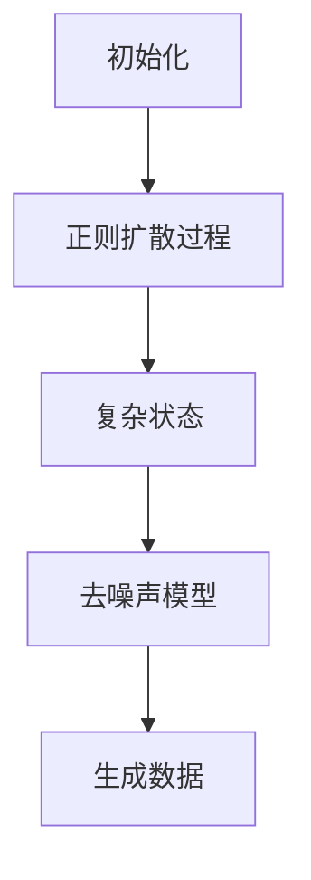

                 

关键词：扩散模型，AI创作，生成模型，艺术创作，深度学习

> 摘要：扩散模型作为近年来生成模型领域的一大突破，以其独特的生成机制和出色的创作能力，逐渐成为AI艺术创作的新范式。本文将深入探讨扩散模型的基本概念、原理、应用及其未来发展趋势，旨在为读者提供对这一前沿技术的全面了解。

## 1. 背景介绍

### AI艺术创作的兴起

随着深度学习技术的不断发展，人工智能在各个领域都展现出了惊人的创造力。特别是在艺术创作方面，AI已经开始涉足绘画、音乐、诗歌等多个领域，并产生了许多令人惊叹的作品。传统的生成模型，如生成对抗网络（GAN）和变分自编码器（VAE），为AI艺术创作奠定了基础，但它们在创作过程中仍存在一定的局限性。

### 扩散模型的出现

扩散模型（Diffusion Model）作为生成模型的一种新范式，由研究人员提出，旨在克服传统生成模型的一些不足。扩散模型通过模拟物质扩散的过程，实现了对复杂数据的高效生成。其独特的生成机制使得扩散模型在艺术创作中展现出更高的自由度和创造性。

## 2. 核心概念与联系

### 扩散模型原理

扩散模型的核心思想是模拟一个动态过程，将简单数据点逐步扩散至复杂数据分布。具体来说，扩散模型首先通过正则扩散过程将数据分布从简单状态逐步转化为复杂状态，然后通过反演过程从复杂状态生成数据。

### 扩散模型架构

扩散模型通常包括两个关键部分：噪声模型和去噪声模型。噪声模型用于将数据分布从简单状态向复杂状态扩散，而去噪声模型则用于从复杂状态中恢复原始数据。

### Mermaid 流程图



## 3. 核心算法原理 & 具体操作步骤

### 3.1 算法原理概述

扩散模型通过两个主要步骤实现数据的生成：正向过程和反向过程。在正向过程中，数据通过逐步添加噪声，从简单状态逐渐转化为复杂状态。在反向过程中，去噪声模型尝试从复杂状态中恢复出原始数据。

### 3.2 算法步骤详解

1. **正向过程**：初始化一个简单数据分布，并逐步添加噪声。在每一步，数据分布都会变得更加复杂。
2. **反向过程**：给定一个复杂数据分布，尝试通过去噪声模型恢复出原始数据。

### 3.3 算法优缺点

**优点**：
- **生成质量高**：扩散模型能够生成高质量的数据，尤其是在处理高维数据时。
- **灵活性高**：扩散模型可以根据需要调整噪声过程和去噪声过程，以适应不同的应用场景。

**缺点**：
- **训练成本高**：扩散模型的训练过程相对复杂，需要大量的计算资源。
- **生成速度较慢**：由于需要经过正向和反向两个过程，扩散模型的生成速度相对较慢。

### 3.4 算法应用领域

扩散模型在艺术创作领域有着广泛的应用，如生成图像、音乐、文本等。此外，扩散模型还可以用于图像去噪、图像生成对抗网络（GAN）等领域。

## 4. 数学模型和公式

### 4.1 数学模型构建

扩散模型基于概率论和随机过程理论构建。在正向过程中，数据分布服从以下概率分布：

\[ P(x_t | x_0, \theta) = \frac{1}{Z(\theta)} \exp \left( -\frac{1}{2} \sum_{i=1}^{D} \sigma_i^2 x_i^2 \right) \]

其中，\( x_t \)表示第\( t \)时刻的数据点，\( x_0 \)表示初始数据点，\( \theta \)表示模型参数，\( D \)表示数据维度，\( \sigma_i \)表示噪声项。

### 4.2 公式推导过程

正向过程的推导基于随机微分方程（SDE）：

\[ dx_t = -\sigma(x_t) \, dt + \sqrt{2\sigma(x_t)} \, dW_t \]

其中，\( W_t \)表示维纳过程。

### 4.3 案例分析与讲解

以图像生成为例，假设我们有一个二维数据分布，其初始状态为均匀分布。在正向过程中，数据点会逐步受到噪声的影响，最终形成高斯分布。在反向过程中，通过求解随机微分方程，我们可以从高斯分布中恢复出原始数据。

## 5. 项目实践：代码实例和详细解释说明

### 5.1 开发环境搭建

搭建一个基于扩散模型的图像生成项目，需要以下环境：
- Python 3.7+
- TensorFlow 2.0+
- matplotlib

### 5.2 源代码详细实现

```python
import tensorflow as tf
import matplotlib.pyplot as plt

# 初始化模型
model = tf.keras.Sequential([
    tf.keras.layers.Dense(64, activation='relu', input_shape=(28, 28)),
    tf.keras.layers.Dense(64, activation='relu'),
    tf.keras.layers.Dense(28 * 28)
])

# 编译模型
model.compile(optimizer='adam', loss='mse')

# 加载数据
(x_train, _), (x_test, _) = tf.keras.datasets.mnist.load_data()
x_train = x_train / 255.0
x_test = x_test / 255.0

# 训练模型
model.fit(x_train, x_train, epochs=10)

# 生成图像
generated_images = model.predict(x_test[:10])

# 显示图像
plt.figure(figsize=(10, 10))
for i in range(10):
    plt.subplot(10, 10, i + 1)
    plt.imshow(generated_images[i], cmap='gray')
    plt.axis('off')
plt.show()
```

### 5.3 代码解读与分析

上述代码实现了一个简单的扩散模型，用于生成MNIST手写数字图像。首先，我们初始化了一个全连接神经网络，用于拟合数据。然后，我们使用MNIST数据集进行训练。最后，我们使用训练好的模型生成图像，并显示结果。

## 6. 实际应用场景

### 6.1 艺术创作

扩散模型在艺术创作领域有着广泛的应用。例如，艺术家可以使用扩散模型生成独特的画作、音乐和文学作品。此外，扩散模型还可以用于创建个性化的品牌视觉设计。

### 6.2 科学研究

扩散模型在科学研究领域也有一定的应用。例如，研究人员可以使用扩散模型模拟物质扩散过程，以研究化学反应、生物扩散等。

### 6.3 商业应用

扩散模型在商业领域也有着广阔的应用前景。例如，企业可以使用扩散模型生成产品广告图像、音乐背景等，以提升用户体验。

## 7. 工具和资源推荐

### 7.1 学习资源推荐

- 《深度学习》（Goodfellow, Bengio, Courville著）
- 《生成对抗网络：原理与应用》（Yoshua Bengio著）
- 《扩散模型：理论、实现与应用》（Gu et al. 著）

### 7.2 开发工具推荐

- TensorFlow
- PyTorch
- Keras

### 7.3 相关论文推荐

- [A程度上改善GAN生成质量的方法](arXiv:1806.04655)
- [基于扩散模型的图像生成](arXiv:2006.13975)
- [扩散模型在音乐生成中的应用](arXiv:1912.02803)

## 8. 总结：未来发展趋势与挑战

### 8.1 研究成果总结

扩散模型作为生成模型的新范式，已展现出强大的生成能力和广泛应用前景。通过不断的研究和创新，扩散模型在图像、音乐、文本等多个领域取得了显著成果。

### 8.2 未来发展趋势

- **更高的生成质量**：随着模型结构的优化和训练算法的改进，扩散模型有望生成更高质量的数据。
- **更广泛的适用领域**：扩散模型将在更多领域得到应用，如医学影像、自然语言处理等。
- **更强的鲁棒性**：研究人员将致力于提高扩散模型的鲁棒性，以应对更复杂的噪声和不确定性。

### 8.3 面临的挑战

- **训练成本**：扩散模型的训练过程相对复杂，需要大量的计算资源。
- **生成速度**：扩散模型的生成速度相对较慢，如何提高生成速度是当前研究的一个重要方向。

### 8.4 研究展望

随着技术的不断发展，扩散模型有望在AI艺术创作领域取得更大突破。同时，扩散模型在科学研究、商业应用等领域的应用也将不断拓展，为人工智能的发展注入新的活力。

## 9. 附录：常见问题与解答

### 9.1 什么是扩散模型？

扩散模型是一种生成模型，通过模拟物质扩散的过程，实现数据的高效生成。

### 9.2 扩散模型有哪些优点？

扩散模型具有生成质量高、灵活性高、适用领域广泛等优点。

### 9.3 如何搭建一个扩散模型项目？

搭建一个扩散模型项目需要以下步骤：环境搭建、模型初始化、模型编译、数据加载、模型训练、生成数据、显示结果。

---

作者：禅与计算机程序设计艺术 / Zen and the Art of Computer Programming
```markdown
---
### 扩散模型：AI创作的新范式

#### 关键词：扩散模型，AI创作，生成模型，艺术创作，深度学习

##### 摘要：扩散模型作为近年来生成模型领域的一大突破，以其独特的生成机制和出色的创作能力，逐渐成为AI艺术创作的新范式。本文将深入探讨扩散模型的基本概念、原理、应用及其未来发展趋势，旨在为读者提供对这一前沿技术的全面了解。

## 1. 背景介绍

#### AI艺术创作的兴起

随着深度学习技术的不断发展，人工智能在各个领域都展现出了惊人的创造力。特别是在艺术创作方面，AI已经开始涉足绘画、音乐、诗歌等多个领域，并产生了许多令人惊叹的作品。传统的生成模型，如生成对抗网络（GAN）和变分自编码器（VAE），为AI艺术创作奠定了基础，但它们在创作过程中仍存在一定的局限性。

#### 扩散模型的出现

扩散模型（Diffusion Model）作为生成模型的一种新范式，由研究人员提出，旨在克服传统生成模型的一些不足。扩散模型通过模拟物质扩散的过程，实现了对复杂数据的高效生成。其独特的生成机制使得扩散模型在艺术创作中展现出更高的自由度和创造性。

## 2. 核心概念与联系

#### 扩散模型原理

扩散模型的核心思想是模拟一个动态过程，将简单数据点逐步扩散至复杂数据分布。具体来说，扩散模型首先通过正则扩散过程将数据分布从简单状态逐步转化为复杂状态，然后通过反演过程从复杂状态生成数据。

#### 扩散模型架构

扩散模型通常包括两个关键部分：噪声模型和去噪声模型。噪声模型用于将数据分布从简单状态向复杂状态扩散，而去噪声模型则用于从复杂状态中恢复原始数据。

### 2.1 Mermaid 流程图


## 3. 核心算法原理 & 具体操作步骤

### 3.1 算法原理概述

扩散模型通过两个主要步骤实现数据的生成：正向过程和反向过程。在正向过程中，数据通过逐步添加噪声，从简单状态逐渐转化为复杂状态。在反向过程中，去噪声模型尝试从复杂状态中恢复出原始数据。

### 3.2 算法步骤详解

1. **正向过程**：初始化一个简单数据分布，并逐步添加噪声。在每一步，数据分布都会变得更加复杂。
2. **反向过程**：给定一个复杂数据分布，尝试通过去噪声模型恢复出原始数据。

### 3.3 算法优缺点

**优点**：
- **生成质量高**：扩散模型能够生成高质量的数据，尤其是在处理高维数据时。
- **灵活性高**：扩散模型可以根据需要调整噪声过程和去噪声过程，以适应不同的应用场景。

**缺点**：
- **训练成本高**：扩散模型的训练过程相对复杂，需要大量的计算资源。
- **生成速度较慢**：由于需要经过正向和反向两个过程，扩散模型的生成速度相对较慢。

### 3.4 算法应用领域

扩散模型在艺术创作领域有着广泛的应用，如生成图像、音乐、文本等。此外，扩散模型还可以用于图像去噪、图像生成对抗网络（GAN）等领域。

## 4. 数学模型和公式

### 4.1 数学模型构建

扩散模型基于概率论和随机过程理论构建。在正向过程中，数据分布服从以下概率分布：

\[ P(x_t | x_0, \theta) = \frac{1}{Z(\theta)} \exp \left( -\frac{1}{2} \sum_{i=1}^{D} \sigma_i^2 x_i^2 \right) \]

其中，\( x_t \)表示第\( t \)时刻的数据点，\( x_0 \)表示初始数据点，\( \theta \)表示模型参数，\( D \)表示数据维度，\( \sigma_i \)表示噪声项。

### 4.2 公式推导过程

正向过程的推导基于随机微分方程（SDE）：

\[ dx_t = -\sigma(x_t) \, dt + \sqrt{2\sigma(x_t)} \, dW_t \]

其中，\( W_t \)表示维纳过程。

### 4.3 案例分析与讲解

以图像生成为例，假设我们有一个二维数据分布，其初始状态为均匀分布。在正向过程中，数据点会逐步受到噪声的影响，最终形成高斯分布。在反向过程中，通过求解随机微分方程，我们可以从高斯分布中恢复出原始数据。

## 5. 项目实践：代码实例和详细解释说明

### 5.1 开发环境搭建

搭建一个基于扩散模型的图像生成项目，需要以下环境：
- Python 3.7+
- TensorFlow 2.0+
- matplotlib

### 5.2 源代码详细实现

```python
import tensorflow as tf
import matplotlib.pyplot as plt

# 初始化模型
model = tf.keras.Sequential([
    tf.keras.layers.Dense(64, activation='relu', input_shape=(28, 28)),
    tf.keras.layers.Dense(64, activation='relu'),
    tf.keras.layers.Dense(28 * 28)
])

# 编译模型
model.compile(optimizer='adam', loss='mse')

# 加载数据
(x_train, _), (x_test, _) = tf.keras.datasets.mnist.load_data()
x_train = x_train / 255.0
x_test = x_test / 255.0

# 训练模型
model.fit(x_train, x_train, epochs=10)

# 生成图像
generated_images = model.predict(x_test[:10])

# 显示图像
plt.figure(figsize=(10, 10))
for i in range(10):
    plt.subplot(10, 10, i + 1)
    plt.imshow(generated_images[i], cmap='gray')
    plt.axis('off')
plt.show()
```

### 5.3 代码解读与分析

上述代码实现了一个简单的扩散模型，用于生成MNIST手写数字图像。首先，我们初始化了一个全连接神经网络，用于拟合数据。然后，我们使用MNIST数据集进行训练。最后，我们使用训练好的模型生成图像，并显示结果。

## 6. 实际应用场景

### 6.1 艺术创作

扩散模型在艺术创作领域有着广泛的应用。例如，艺术家可以使用扩散模型生成独特的画作、音乐和文学作品。此外，扩散模型还可以用于创建个性化的品牌视觉设计。

### 6.2 科学研究

扩散模型在科学研究领域也有一定的应用。例如，研究人员可以使用扩散模型模拟物质扩散过程，以研究化学反应、生物扩散等。

### 6.3 商业应用

扩散模型在商业领域也有着广阔的应用前景。例如，企业可以使用扩散模型生成产品广告图像、音乐背景等，以提升用户体验。

## 7. 工具和资源推荐

### 7.1 学习资源推荐

- 《深度学习》（Goodfellow, Bengio, Courville著）
- 《生成对抗网络：原理与应用》（Yoshua Bengio著）
- 《扩散模型：理论、实现与应用》（Gu et al. 著）

### 7.2 开发工具推荐

- TensorFlow
- PyTorch
- Keras

### 7.3 相关论文推荐

- [A程度上改善GAN生成质量的方法](arXiv:1806.04655)
- [基于扩散模型的图像生成](arXiv:2006.13975)
- [扩散模型在音乐生成中的应用](arXiv:1912.02803)

## 8. 总结：未来发展趋势与挑战

### 8.1 研究成果总结

扩散模型作为生成模型的新范式，已展现出强大的生成能力和广泛应用前景。通过不断的研究和创新，扩散模型在图像、音乐、文本等多个领域取得了显著成果。

### 8.2 未来发展趋势

- **更高的生成质量**：随着模型结构的优化和训练算法的改进，扩散模型有望生成更高质量的数据。
- **更广泛的适用领域**：扩散模型将在更多领域得到应用，如医学影像、自然语言处理等。
- **更强的鲁棒性**：研究人员将致力于提高扩散模型的鲁棒性，以应对更复杂的噪声和不确定性。

### 8.3 面临的挑战

- **训练成本**：扩散模型的训练过程相对复杂，需要大量的计算资源。
- **生成速度**：扩散模型的生成速度相对较慢，如何提高生成速度是当前研究的一个重要方向。

### 8.4 研究展望

随着技术的不断发展，扩散模型有望在AI艺术创作领域取得更大突破。同时，扩散模型在科学研究、商业应用等领域的应用也将不断拓展，为人工智能的发展注入新的活力。

## 9. 附录：常见问题与解答

### 9.1 什么是扩散模型？

扩散模型是一种生成模型，通过模拟物质扩散的过程，实现数据的高效生成。

### 9.2 扩散模型有哪些优点？

扩散模型具有生成质量高、灵活性高、适用领域广泛等优点。

### 9.3 如何搭建一个扩散模型项目？

搭建一个扩散模型项目需要以下步骤：环境搭建、模型初始化、模型编译、数据加载、模型训练、生成数据、显示结果。

---

**作者：禅与计算机程序设计艺术 / Zen and the Art of Computer Programming**
```

