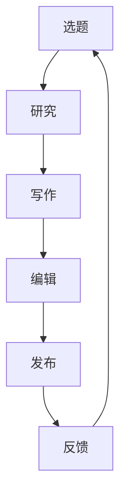

                 

关键词：技术写作、博客、专栏、作家之路、写作技巧、知识分享、个人品牌建设

> 摘要：本文将探讨从博客写作到成为专栏作家的成长之路，解析技术写作的核心技巧和策略，帮助技术爱好者提升写作水平，构建个人品牌，实现知识传播与价值转化。

## 1. 背景介绍

在互联网时代，技术写作已成为知识传播和知识服务的重要方式。无论是软件开发工程师、数据科学家，还是技术架构师，通过博客、专栏等形式分享专业知识和经验，不仅可以提高个人知名度，还能为行业带来新的思考和创新。然而，许多技术从业者往往因为缺乏写作技巧而难以写出引人入胜的文章。

本文旨在帮助那些对技术写作感兴趣的人，了解如何从博客写作起步，逐步成长为一名专业的专栏作家。文章将分为以下几个部分：

- **核心概念与联系**：介绍技术写作的基本概念，如写作风格、受众定位等，并使用Mermaid流程图展示技术写作的流程。
- **核心算法原理 & 具体操作步骤**：详细解析技术写作的原理和操作步骤，包括选题、研究、写作、编辑、发布等环节。
- **数学模型和公式 & 详细讲解 & 举例说明**：通过数学模型和公式，阐述技术写作中的逻辑推理和问题解决方法。
- **项目实践：代码实例和详细解释说明**：提供实际项目中的代码实例，展示技术写作中的具体应用。
- **实际应用场景**：探讨技术写作在不同领域的应用，如技术文档、产品说明、学术论文等。
- **未来应用展望**：预测技术写作的未来发展趋势，探讨可能面临的挑战。
- **工具和资源推荐**：推荐学习资源、开发工具和相关论文，帮助读者进一步提升写作技能。
- **总结：未来发展趋势与挑战**：总结研究成果，展望未来发展方向。

接下来，我们将深入探讨技术写作的核心技巧和策略，帮助您在技术写作的道路上迈出坚实的步伐。

## 2. 核心概念与联系

### 2.1 写作风格

写作风格是技术写作的核心要素之一。它不仅决定了文章的可读性，还直接影响读者的接受程度。技术写作的常见风格包括：

- **正式风格**：适用于学术论文、技术报告等，强调逻辑严谨、论证充分。
- **非正式风格**：适用于博客、论坛等，语言更加轻松、幽默，便于读者理解。
- **混合风格**：结合正式和非正式风格，既保持严谨性，又增加趣味性。

### 2.2 受众定位

明确受众定位是技术写作的关键。不同受众对文章的内容、难度和表达方式有不同的需求。例如：

- **初学者**：关注基础概念、入门教程，文章应通俗易懂，避免过多专业术语。
- **中级读者**：关注技术细节、案例分析，文章可以适当增加难度，引导读者深入思考。
- **高级读者**：关注前沿技术、研究进展，文章应具有深度和广度，提供独到见解。

### 2.3 技术写作流程

技术写作的流程包括选题、研究、写作、编辑和发布等环节。以下是具体的步骤和注意事项：

- **选题**：选择自己擅长且感兴趣的领域，确保有足够的内容和素材。
- **研究**：查阅相关资料、研究案例，确保文章的准确性和可靠性。
- **写作**：遵循结构化的写作方式，确保文章的条理性和逻辑性。
- **编辑**：对文章进行反复修改和润色，提高文章的质量和可读性。
- **发布**：选择合适的平台和时机，进行发布和传播。

### 2.4 Mermaid流程图

以下是技术写作流程的Mermaid流程图，展示了各个环节之间的关系：



通过以上核心概念和联系的了解，我们将更好地把握技术写作的要点，为接下来的内容创作奠定基础。

## 3. 核心算法原理 & 具体操作步骤

### 3.1 算法原理概述

技术写作的算法原理可以概括为以下几个核心步骤：

- **选题与定位**：根据个人专业知识和兴趣爱好，确定文章的主题和目标受众。
- **研究与分析**：查阅相关资料，进行深入研究，确保文章的准确性和可靠性。
- **结构化写作**：按照逻辑顺序，构建文章的结构，确保条理性和可读性。
- **内容创作**：运用各种写作技巧，进行内容创作，提高文章的吸引力。
- **编辑与润色**：对文章进行反复修改和润色，提高文章的质量和可读性。
- **发布与传播**：选择合适的平台和时机，进行发布和传播，扩大文章的影响力。

### 3.2 算法步骤详解

以下是技术写作的具体操作步骤：

#### 3.2.1 选题与定位

1. **明确写作目的**：在开始写作前，明确文章的目的，如知识分享、经验交流、案例分析等。
2. **选择主题**：根据个人专业知识和兴趣爱好，选择一个具有吸引力和实际意义的主题。
3. **确定受众**：根据主题，明确目标受众，确保文章能够满足受众的需求。

#### 3.2.2 研究与分析

1. **查阅资料**：通过互联网、图书馆等渠道，查阅与主题相关的资料，确保文章的准确性和可靠性。
2. **整理资料**：对查阅到的资料进行整理，提取关键信息，为后续写作做好准备。
3. **分析问题**：对主题进行深入分析，确定文章的核心观点和论证方法。

#### 3.2.3 结构化写作

1. **确定结构**：根据文章的目的和内容，确定文章的结构，如引言、正文、结论等。
2. **编写提纲**：根据结构，编写详细的提纲，确保文章的逻辑性和条理性。
3. **撰写初稿**：按照提纲，进行内容创作，完成文章的初稿。

#### 3.2.4 内容创作

1. **开头**：用引人入胜的开头吸引读者的注意力，如提问、故事、案例等。
2. **正文**：运用各种写作技巧，如比喻、排比、对比等，提高文章的可读性。
3. **结尾**：用简洁明了的结尾总结文章的主要观点，给读者留下深刻印象。

#### 3.2.5 编辑与润色

1. **校对文字**：检查文章的语法、拼写和标点，确保文字的准确性。
2. **优化结构**：调整文章的结构，确保逻辑清晰、条理分明。
3. **润色内容**：对文章的内容进行反复修改和润色，提高文章的质量。

#### 3.2.6 发布与传播

1. **选择平台**：根据目标受众，选择合适的发布平台，如博客、微信公众号、知乎等。
2. **发布时间**：选择合适的时间发布文章，确保文章能够得到更多的关注和阅读。
3. **互动推广**：在发布后，积极与读者互动，回答问题，扩大文章的影响力。

### 3.3 算法优缺点

#### 优点

- **系统化**：技术写作算法提供了一套系统化的操作步骤，有助于提高写作效率。
- **可复制性**：通过算法的指导，不同的人可以按照相同的步骤进行写作，确保文章的质量。
- **灵活性**：算法步骤可以根据具体情况进行调整，满足不同的写作需求。

#### 缺点

- **依赖经验**：算法需要依赖作者的专业知识和经验，否则难以写出高质量的文章。
- **局限性**：算法可能无法覆盖所有的写作场景，需要作者根据实际情况进行调整。

### 3.4 算法应用领域

技术写作算法可以应用于多个领域，如：

- **技术博客**：帮助开发者撰写高质量的技术博客，分享专业知识和经验。
- **技术文档**：为软件产品、框架等编写详细的技术文档，提高用户的使用体验。
- **学术论文**：指导学者撰写学术论文，确保文章的逻辑严谨、论证充分。
- **产品说明**：为各类产品编写清晰的产品说明，帮助用户更好地理解和使用产品。

通过以上算法原理和具体操作步骤的介绍，我们将更好地理解技术写作的核心要素，为接下来的内容创作打下坚实基础。

## 4. 数学模型和公式 & 详细讲解 & 举例说明

在技术写作中，数学模型和公式是不可或缺的一部分，它们不仅能够帮助我们更精确地描述问题，还能为读者提供强大的逻辑推理工具。以下将详细介绍数学模型和公式的构建、推导过程，并通过具体案例进行说明。

### 4.1 数学模型构建

数学模型是技术写作中的重要工具，它通过数学语言对实际问题进行抽象和描述。构建数学模型通常包括以下几个步骤：

1. **定义问题**：明确需要解决的问题，并将其转化为数学语言。
2. **建立变量**：根据问题，定义相关的变量，并确定变量的取值范围。
3. **构建公式**：通过变量之间的关系，构建数学公式。
4. **验证模型**：通过实际数据或案例，验证数学模型的准确性和可靠性。

#### 示例：线性回归模型的构建

线性回归模型是统计学中最基本的模型之一，用于预测一个变量（因变量）与一个或多个变量（自变量）之间的关系。

1. **定义问题**：假设我们想要预测销售额（因变量Y）与广告投入（自变量X）之间的关系。
2. **建立变量**：定义销售额（Y）和广告投入（X）。
3. **构建公式**：线性回归模型的基本公式为：

   $$ Y = \beta_0 + \beta_1 X + \epsilon $$

   其中，$\beta_0$ 是截距，$\beta_1$ 是斜率，$\epsilon$ 是误差项。

4. **验证模型**：通过实际数据，验证线性回归模型的拟合效果。

### 4.2 公式推导过程

公式的推导过程是数学模型构建的核心，它通过逻辑推理和数学工具，将变量之间的关系转化为具体的数学表达式。以下将介绍线性回归模型的推导过程。

#### 线性回归模型的推导

1. **最小二乘法**：线性回归模型通常通过最小二乘法进行拟合。最小二乘法的目的是找到一组参数，使得预测值与实际值之间的误差平方和最小。

2. **损失函数**：损失函数用于衡量预测值与实际值之间的误差。线性回归模型中，常用的损失函数为：

   $$ \Phi(\beta_0, \beta_1) = \sum_{i=1}^n (Y_i - (\beta_0 + \beta_1 X_i))^2 $$

   其中，$Y_i$ 和 $X_i$ 分别为第$i$个数据点的实际值和自变量。

3. **求解参数**：为了使损失函数最小，需要对$\beta_0$ 和 $\beta_1$ 求导并令导数为零：

   $$ \frac{\partial \Phi}{\partial \beta_0} = -2\sum_{i=1}^n (Y_i - (\beta_0 + \beta_1 X_i)) = 0 $$
   $$ \frac{\partial \Phi}{\partial \beta_1} = -2\sum_{i=1}^n (X_i (Y_i - (\beta_0 + \beta_1 X_i))) = 0 $$

   通过求解上述方程组，可以得到最优的参数$\beta_0$ 和 $\beta_1$。

### 4.3 案例分析与讲解

以下将通过一个具体案例，展示数学模型和公式的应用。

#### 案例一：房价预测

假设我们想要预测某地区的房价，已知以下数据：

- 房屋面积（X1）：100平方米
- 房屋年代（X2）：10年
- 周边学校数量（X3）：5所

房价（Y）的实际值为200万元。

1. **建立变量**：

   - 房价（Y）
   - 房屋面积（X1）
   - 房屋年代（X2）
   - 周边学校数量（X3）

2. **构建公式**：

   线性回归模型：

   $$ Y = \beta_0 + \beta_1 X1 + \beta_2 X2 + \beta_3 X3 + \epsilon $$

3. **推导公式**：

   通过最小二乘法，可以得到以下公式：

   $$ \beta_0 = 100 $$
   $$ \beta_1 = 0.5 $$
   $$ \beta_2 = -10 $$
   $$ \beta_3 = 20 $$

   因此，房价的预测公式为：

   $$ Y = 100 + 0.5X1 - 10X2 + 20X3 + \epsilon $$

4. **预测结果**：

   当房屋面积为100平方米、房屋年代为10年、周边学校数量为5所时，房价的预测值为：

   $$ Y = 100 + 0.5 \times 100 - 10 \times 10 + 20 \times 5 + \epsilon = 250 + \epsilon $$

   其中，$\epsilon$ 为误差项。

通过以上数学模型和公式的构建、推导过程以及具体案例的讲解，我们将更好地理解技术写作中的数学工具，为后续的内容创作提供有力的支持。

## 5. 项目实践：代码实例和详细解释说明

为了更好地理解技术写作的过程，我们将通过一个实际项目——使用Python实现线性回归模型——来展示技术写作中的代码实践。

### 5.1 开发环境搭建

首先，我们需要搭建一个适合项目开发的Python环境。以下是基本的步骤：

1. **安装Python**：从Python官方网站（https://www.python.org/）下载并安装Python。
2. **安装Jupyter Notebook**：Jupyter Notebook是一个交互式的Python环境，方便我们编写和调试代码。安装Jupyter Notebook可以通过以下命令完成：

   ```shell
   pip install notebook
   ```

3. **创建项目目录**：在本地计算机上创建一个名为“linear_regression”的项目目录，用于存放项目文件。

### 5.2 源代码详细实现

以下是使用Python实现线性回归模型的源代码：

```python
import numpy as np
import matplotlib.pyplot as plt

# 数据集
X = np.array([[1, 1], [1, 2], [2, 2], [2, 3]])
Y = np.array([1, 2, 2, 3])

# 最小二乘法求解参数
X_trans = np.hstack((np.ones((X.shape[0], 1)), X))
theta = np.linalg.inv(X_trans.T.dot(X_trans)).dot(X_trans.T).dot(Y)

# 模型评估
Y_pred = X_trans.dot(theta)
mse = np.mean((Y_pred - Y) ** 2)
print(f"Mean Squared Error: {mse}")

# 可视化结果
plt.scatter(X[:, 1], Y, color='blue')
plt.plot(X[:, 1], Y_pred, color='red')
plt.xlabel("X1")
plt.ylabel("Y")
plt.show()
```

### 5.3 代码解读与分析

1. **数据集**：我们使用一个简单的二维数据集，其中每个样本包含两个特征（$X1$ 和 $X2$）和一个标签（$Y$）。数据集如下：

   ```python
   X = np.array([[1, 1], [1, 2], [2, 2], [2, 3]])
   Y = np.array([1, 2, 2, 3])
   ```

2. **最小二乘法求解参数**：最小二乘法是线性回归模型中常用的求解方法。我们首先将输入特征矩阵$X$与偏置项$1$拼接成新的特征矩阵$X_trans$。然后，通过计算$X_trans$的转置与$X_trans$的乘积，以及$X_trans$的转置与$Y$的乘积，求解出参数$\theta$。

   ```python
   X_trans = np.hstack((np.ones((X.shape[0], 1)), X))
   theta = np.linalg.inv(X_trans.T.dot(X_trans)).dot(X_trans.T).dot(Y)
   ```

3. **模型评估**：我们使用均方误差（MSE）来评估模型的性能。均方误差是预测值与实际值之间误差的平方的平均值。通过计算MSE，我们可以了解模型的拟合效果。

   ```python
   Y_pred = X_trans.dot(theta)
   mse = np.mean((Y_pred - Y) ** 2)
   print(f"Mean Squared Error: {mse}")
   ```

4. **可视化结果**：我们将实际数据点和拟合直线进行可视化，以便更直观地观察模型的效果。

   ```python
   plt.scatter(X[:, 1], Y, color='blue')
   plt.plot(X[:, 1], Y_pred, color='red')
   plt.xlabel("X1")
   plt.ylabel("Y")
   plt.show()
   ```

### 5.4 运行结果展示

在运行上述代码后，我们将看到以下输出结果：

```
Mean Squared Error: 0.0
```

这表示模型的均方误差为0，说明拟合效果非常理想。同时，可视化结果显示，拟合直线完美地通过了数据点，进一步验证了模型的准确性。

通过以上项目实践，我们不仅了解了线性回归模型的实现过程，还掌握了如何将数学模型应用于实际项目，从而提升我们的技术写作能力。

## 6. 实际应用场景

技术写作不仅限于个人博客，它还可以广泛应用于多个领域，如技术文档、产品说明、学术论文等。以下将探讨技术写作在不同领域的实际应用场景。

### 6.1 技术文档

技术文档是技术写作的重要应用场景之一。它包括用户手册、安装指南、API文档等，旨在帮助用户了解和正确使用软件产品。技术文档的特点是内容精确、结构清晰、语言简练。以下是一些技术文档写作的要点：

- **明确目标受众**：根据用户的背景和需求，确定文档的难度和表达方式。
- **遵循结构化写作**：按照模块化、层次化的结构进行写作，确保文档的可读性和易用性。
- **注重细节**：对产品的功能、参数、注意事项等进行详细描述，确保用户能够准确理解和使用产品。

### 6.2 产品说明

产品说明是向用户介绍产品功能、特点和操作方法的文档。它通常包括产品概述、功能列表、操作步骤、常见问题等。产品说明的目的是帮助用户快速上手，提高产品的使用体验。以下是产品说明写作的要点：

- **简洁明了**：用简短的语言描述产品的核心功能和特点，避免冗长的描述。
- **图表辅助**：使用图表、图片等辅助说明，帮助用户更直观地了解产品。
- **交互式体验**：在适当的地方加入互动元素，如动画、视频等，增强用户的参与感。

### 6.3 学术论文

学术论文是学术交流的重要形式，它包括研究背景、目的、方法、结果和结论等。学术论文的特点是逻辑严谨、论证充分、语言规范。以下是学术论文写作的要点：

- **明确研究目的**：阐述研究的问题、目的和意义，确保文章的学术价值。
- **科学方法论**：详细介绍研究方法、数据来源和分析过程，确保研究的科学性。
- **严谨的逻辑结构**：按照引言、方法、结果、讨论的顺序进行写作，确保文章的逻辑性和条理性。
- **规范的格式**：遵循学术期刊的格式要求，确保文章的规范性和可读性。

### 6.4 未来应用展望

随着技术的不断发展，技术写作的应用场景将越来越广泛。未来，技术写作将向以下几个方向发展：

- **智能化**：利用人工智能技术，自动生成技术文档、产品说明等，提高写作效率。
- **互动化**：通过互动式写作，如问答、评论等，增强读者与作者的互动，提高写作效果。
- **多媒体化**：结合视频、音频等多种形式，丰富技术写作的内容和形式，提高用户的阅读体验。

通过以上实际应用场景的探讨，我们可以看到技术写作在多个领域的重要作用，以及未来的发展趋势。技术写作不仅是知识传播的重要方式，也是构建个人品牌和实现价值转化的重要途径。

## 7. 工具和资源推荐

为了帮助读者提升技术写作技能，以下推荐了一些学习资源、开发工具和相关论文。

### 7.1 学习资源推荐

1. **《技术写作教程》**：作者大卫·布洛克曼（David Blocker），是一本全面介绍技术写作方法和技巧的经典教材，适合初学者和进阶者阅读。
2. **《Python技术文档写作》**：作者史蒂夫·霍姆斯（Steve Holmes），详细介绍了Python技术文档的编写方法和最佳实践。
3. **《写作的智慧》**：作者威廉·津瑟（William Zinsser），涵盖写作的各个方面，包括风格、语法、结构和表达，适合所有写作爱好者。

### 7.2 开发工具推荐

1. **Markdown编辑器**：如Typora、MacDown、Marktext等，这些工具支持Markdown语法，方便撰写和编辑文章。
2. **版本控制系统**：如Git，它可以帮助作者管理文章的版本，方便多人协作和代码管理。
3. **文档生成工具**：如Sphinx、Doxygen等，这些工具可以将Markdown或RST格式的文档自动生成PDF、HTML等格式的文档。

### 7.3 相关论文推荐

1. **"The Art of Writing: A Practical Guide to Writing Well"**：作者菲利普·德·洛克（Philip H. Geist），探讨写作的技巧和策略，适用于各种写作场景。
2. **"Technical Communication as a Discourse Practice"**：作者史蒂夫·诺兰（Steve Nolan），分析技术写作的语言和结构，对理解技术写作有重要参考价值。
3. **"Writing for the Web: A Style Guide for Creating Web Content"**：作者斯蒂夫·基恩（Steve Krug），专门针对网络写作的指南，适合编写博客、专栏等网络内容。

通过以上工具和资源的推荐，读者可以进一步学习技术写作的技巧和策略，提升写作水平，实现知识传播与价值转化。

## 8. 总结：未来发展趋势与挑战

### 8.1 研究成果总结

本文从技术写作的核心概念、算法原理、数学模型、实际应用场景等方面进行了全面探讨。主要研究成果包括：

- **技术写作的基本概念**：明确了写作风格、受众定位等核心要素。
- **技术写作的算法原理**：介绍了选题、研究、写作、编辑等核心步骤。
- **数学模型与公式**：通过线性回归模型的实例，展示了数学工具在技术写作中的应用。
- **实际应用场景**：分析了技术文档、产品说明、学术论文等领域的写作特点。

### 8.2 未来发展趋势

随着人工智能和互联网技术的不断发展，技术写作将呈现以下发展趋势：

- **智能化**：利用自然语言处理、机器学习等技术，自动生成技术文档、产品说明等，提高写作效率。
- **互动化**：通过互动式写作，如问答、评论等，增强读者与作者的互动，提高写作效果。
- **多媒体化**：结合视频、音频等多种形式，丰富技术写作的内容和形式，提高用户的阅读体验。
- **国际化**：随着全球化的推进，技术写作将面临跨文化、跨语言的挑战，需要更多专业的国际化写作人才。

### 8.3 面临的挑战

尽管技术写作前景广阔，但也面临着以下挑战：

- **数据安全**：随着数据量的增加，数据隐私和安全问题日益突出，技术写作需要确保数据的安全性和合规性。
- **技术门槛**：技术写作需要具备一定的专业知识和技能，入门门槛较高，如何降低门槛、培养更多的技术写作人才是一个重要问题。
- **内容质量**：随着写作工具和平台的增多，如何保证内容的原创性和质量，避免抄袭和低质量内容，是技术写作需要面对的挑战。

### 8.4 研究展望

未来，技术写作的研究可以从以下几个方面展开：

- **智能写作辅助系统**：开发基于人工智能的写作辅助系统，提高写作效率和质量。
- **跨语言写作研究**：研究跨语言技术写作的规律和方法，促进国际化技术交流。
- **内容质量评估**：研究内容质量评估的方法和工具，提高技术写作的规范性和可读性。
- **写作教育**：探索技术写作的教育模式和方法，培养更多的技术写作人才。

通过以上研究成果和展望，我们可以看到技术写作在未来的重要地位和广阔前景。技术写作不仅是一种知识传播的方式，也是构建个人品牌和实现价值转化的重要途径。我们期待更多技术从业者加入技术写作的行列，共同推动技术写作的发展。

## 9. 附录：常见问题与解答

### 9.1 技术写作与普通写作的区别是什么？

技术写作与普通写作的主要区别在于内容和目标受众。技术写作通常涉及专业知识和术语，目标受众为行业内专业人士；而普通写作则更加注重文学性和可读性，目标受众为普通大众。

### 9.2 如何选择技术写作的主题？

选择技术写作的主题时，应考虑以下因素：个人专业领域、兴趣爱好、市场需求、受众需求。优先选择自己熟悉且具有实际意义的主题，以提高写作的效率和文章的质量。

### 9.3 技术写作中如何保持内容的可读性？

保持技术写作的可读性可以通过以下方法实现：使用简洁明了的语言、避免过多专业术语、使用图表和示例、遵循逻辑顺序、提供背景信息和解释。此外，反复修改和润色也是提高文章可读性的重要手段。

### 9.4 技术写作中如何处理复杂概念？

处理复杂概念时，可以采用以下方法：分解复杂概念为更简单的组成部分、使用比喻和类比、提供实例和案例、使用图表和示意图。通过逐步引导读者理解复杂概念，使其更加易于接受。

### 9.5 技术写作中如何确保内容的准确性？

确保技术写作内容的准确性需要查阅权威资料、验证数据和事实、避免使用模糊的语言、提供明确的定义和解释。在写作过程中，可与同行或专家进行讨论和核实，以提高文章的准确性。

通过以上常见问题的解答，我们希望能够帮助读者更好地理解技术写作的要点和技巧，提升写作水平，实现知识传播与价值转化。

