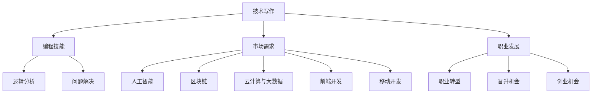

                 

关键词：技术写作、程序员、副业、选择、创作技巧、市场趋势

> 摘要：本文将探讨技术写作作为程序员副业的选择。从写作动机、市场需求、创作技巧、以及未来趋势等多个角度，帮助程序员们理解技术写作的价值，并学会如何有效地进行技术写作。

## 1. 背景介绍

### 技术写作的定义和意义

技术写作是一种专业性的文本创作方式，它涉及将复杂的技术概念和实现方法通过文字、图表等形式传达给读者。对于程序员来说，技术写作不仅是记录和分享个人经验和知识的有效途径，也是提升个人品牌、拓展职业发展的重要手段。

技术写作的意义主要体现在以下几个方面：

1. **知识管理**：通过写作，程序员可以系统地整理和总结自己的知识，有助于加深对技术领域的理解和掌握。
2. **经验分享**：将自己的经验和心得分享给同行，有助于建立良好的人际关系和专业网络。
3. **个人品牌**：优质的技术文章可以提高个人在行业内的知名度和认可度，从而为职业发展带来更多机会。
4. **商业化潜力**：技术写作可以转化为实际的商业价值，如通过出版书籍、开设在线课程等方式获得收入。

### 程序员副业的趋势

近年来，越来越多的程序员开始关注副业，这不仅是为了增加收入，也是为了丰富个人职业体验。根据调查，以下是一些程序员选择副业的主要趋势：

1. **技术咨询与培训**：基于自身丰富的技术经验，许多程序员提供专业的技术咨询服务或培训课程。
2. **软件开发**：自主开发软件产品或加入初创公司，参与实际的软件开发工作。
3. **内容创作**：包括技术博客写作、在线课程制作、知识分享平台运营等。
4. **开源项目贡献**：参与开源项目，提升技术能力，建立个人影响力。
5. **自由职业**：如网站开发、应用程序设计、数据分析等。

## 2. 核心概念与联系

在探讨技术写作作为程序员的副业选择之前，我们需要了解一些核心概念和它们之间的联系。

### 技术写作的类型

技术写作主要包括以下几种类型：

1. **博客文章**：程序员个人或团队分享技术见解、项目经验的文章。
2. **技术书籍**：详细介绍某个技术领域的深入知识和实践方法。
3. **白皮书**：企业或机构发布的技术报告，通常用于市场推广或技术讨论。
4. **在线课程**：通过视频或文字形式，教授特定的编程语言、框架或技术领域。
5. **技术博客**：类似个人博客，但专注于技术分享和讨论。

### 技术写作与编程技能的联系

技术写作与编程技能密切相关。程序员在写作过程中，需要运用编程思维来分析和解决问题，并通过清晰的逻辑和简洁的语言进行表达。同时，技术写作也可以反过来促进编程技能的提升，通过写作，程序员可以更好地理解和掌握复杂的技术概念。

### 技术写作与市场需求

市场需求是选择技术写作副业的一个重要考虑因素。以下是一些当前市场上的热点和趋势：

1. **人工智能与机器学习**：随着人工智能技术的快速发展，相关领域的专业知识和实践技巧备受关注。
2. **区块链技术**：区块链的广泛应用为程序员提供了新的创作和创业机会。
3. **云计算与大数据**：云计算和大数据技术的普及，推动了相关领域的技术写作需求。
4. **前端开发与移动开发**：随着互联网应用的不断丰富，前端和移动开发领域仍然有着较高的写作需求。

### 技术写作与职业发展

技术写作不仅可以提升个人品牌，还可以为职业发展带来多种机会：

1. **职业转型**：通过技术写作，程序员可以逐渐转型为技术作家、内容创作者或讲师。
2. **晋升机会**：技术写作能力可以成为程序员的竞争优势，帮助他们在职场中获得更高的职位和待遇。
3. **创业机会**：通过写作，程序员可以积累行业知识和人脉，为创业项目奠定基础。

### Mermaid 流程图

以下是一个简单的 Mermaid 流程图，展示了技术写作与编程技能、市场需求、职业发展之间的联系。



## 3. 核心算法原理 & 具体操作步骤

### 3.1 算法原理概述

技术写作的核心算法可以概括为以下几个步骤：

1. **选题与定位**：选择合适的话题，明确文章的目标读者和核心价值。
2. **资料搜集**：收集与选题相关的资料，包括技术文档、博客文章、书籍等。
3. **结构规划**：制定文章的大纲和结构，确保内容的逻辑性和连贯性。
4. **内容创作**：根据大纲进行内容创作，运用编程思维进行问题分析和解决方案的阐述。
5. **编辑与校对**：对初稿进行编辑和校对，确保文章的语言表达和逻辑清晰。
6. **发布与推广**：将文章发布到合适的平台，通过社交媒体和SEO等手段进行推广。

### 3.2 算法步骤详解

下面详细解释每个步骤的具体操作：

#### 3.2.1 选题与定位

1. **了解市场需求**：通过市场调研、行业分析等手段，了解当前技术领域的热点和趋势。
2. **确定写作方向**：基于市场需求和个人兴趣，选择一个具体的话题进行深入探讨。
3. **定位读者群体**：明确文章的目标读者，例如初级程序员、中级工程师或高级专家。

#### 3.2.2 资料搜集

1. **文献调研**：查阅相关的技术文档、书籍、论文等，了解当前领域的最新进展和研究成果。
2. **案例收集**：收集实际的应用案例，通过具体实例来说明技术原理和实现方法。
3. **网络资源**：利用互联网资源，如博客、论坛、技术社区等，获取更多的信息和观点。

#### 3.2.3 结构规划

1. **制定大纲**：根据选题和资料，制定文章的大纲，明确每个章节的主题和内容。
2. **逻辑梳理**：确保文章的逻辑结构清晰，内容之间的关联紧密。
3. **编写模板**：根据大纲，编写文章的模板，为后续内容创作提供框架。

#### 3.2.4 内容创作

1. **问题分析**：针对选题，深入分析问题，明确要解决的问题和目标。
2. **解决方案阐述**：详细阐述解决方案的原理、步骤和应用场景。
3. **实例说明**：通过实际案例，说明技术原理和实现方法的具体应用。

#### 3.2.5 编辑与校对

1. **初稿编辑**：对初稿进行内容上的修改和完善，确保逻辑清晰、表达准确。
2. **语言校对**：检查文章的语言表达，确保无错别字、语病和冗余。
3. **格式调整**：调整文章的格式，确保排版整洁、易于阅读。

#### 3.2.6 发布与推广

1. **选择平台**：根据文章的类型和目标读者，选择合适的发布平台，如博客、微信公众号、技术社区等。
2. **内容推广**：利用社交媒体、SEO优化等手段，提高文章的曝光度和访问量。
3. **互动反馈**：鼓励读者留言和评论，与读者互动，收集反馈和建议。

### 3.3 算法优缺点

#### 优点

1. **系统性**：通过结构化的步骤，可以系统地完成技术写作的全过程，确保文章的质量和完整性。
2. **灵活性**：算法的每个步骤都具有一定的灵活性，可以根据实际情况进行调整和优化。
3. **实用性**：算法提供了一套实用的技术写作流程，适用于各种类型的技术文章。

#### 缺点

1. **时间成本**：技术写作是一个耗时的工作，需要投入大量的时间和精力。
2. **专业要求**：高质量的写作需要具备一定的编程技能和专业知识，对新手有一定的门槛。
3. **市场风险**：技术写作的市场竞争激烈，需要不断创新和优化内容，以保持竞争力。

### 3.4 算法应用领域

技术写作算法可以广泛应用于以下领域：

1. **个人博客**：程序员可以通过技术写作，记录和分享个人的技术见解和项目经验。
2. **企业文档**：企业可以通过技术写作，规范和传播内部的技术知识和标准。
3. **在线教育**：技术写作可以转化为在线课程，为学习者提供丰富的学习资源。
4. **知识分享平台**：技术写作可以作为知识分享平台的内容来源，推动技术知识的普及和传播。

## 4. 数学模型和公式 & 详细讲解 & 举例说明

### 4.1 数学模型构建

技术写作的数学模型可以从信息论的角度进行构建。信息论中的香农公式（Shannon's equation）可以用来衡量信息量和熵（Entropy）。

$$
H(X) = -\sum_{i=1}^{n} p(x_i) \log_2 p(x_i)
$$

其中，$H(X)$表示随机变量$X$的熵，$p(x_i)$表示$x_i$发生的概率，$n$是可能取值的数量。

在技术写作中，我们可以将熵视为文章的混乱程度。低熵表示文章内容清晰、逻辑性强，高熵则表示文章内容复杂、难以理解。因此，技术写作的目标是降低文章的熵，提高信息的可理解性。

### 4.2 公式推导过程

香农公式的推导基于信息熵的定义。信息熵是用来衡量随机变量不确定性的度量。具体推导过程如下：

1. **定义随机变量**：假设有一个离散随机变量$X$，它有$n$个可能的取值$x_1, x_2, ..., x_n$，每个取值发生的概率分别为$p(x_1), p(x_2), ..., p(x_n)$。

2. **计算单个取值的信息量**：单个取值$x_i$的信息量$I(x_i)$定义为：

$$
I(x_i) = -\log_2 p(x_i)
$$

3. **计算总信息量**：随机变量$X$的总信息量（熵）$H(X)$是每个取值信息量的期望值，即：

$$
H(X) = E[I(X)] = \sum_{i=1}^{n} p(x_i) I(x_i)
$$

由于$I(x_i)$是负的，因此上式可以改写为：

$$
H(X) = -\sum_{i=1}^{n} p(x_i) \log_2 p(x_i)
$$

4. **推导熵的极限**：当$p(x_i)$趋向于0时，熵$H(X)$趋向于最大值。这意味着随机变量$X$的不确定性最大，即完全随机。

### 4.3 案例分析与讲解

以下是一个简单的案例，用于说明如何应用香农公式来分析技术文章的信息熵。

假设有一篇技术文章，其中包含以下5个关键词：编程、算法、数据结构、机器学习、人工智能。每个关键词在文章中出现的概率如下：

| 关键词       | 出现概率 |
|--------------|---------|
| 编程         | 0.3     |
| 算法         | 0.2     |
| 数据结构     | 0.1     |
| 机器学习     | 0.2     |
| 人工智能     | 0.2     |

根据香农公式，我们可以计算这篇文章的信息熵：

$$
H(X) = - (0.3 \log_2 0.3 + 0.2 \log_2 0.2 + 0.1 \log_2 0.1 + 0.2 \log_2 0.2 + 0.2 \log_2 0.2)
$$

计算结果为：

$$
H(X) \approx 1.375
$$

这个结果表明，这篇文章的信息熵较低，意味着文章内容较为清晰、逻辑性较强。通过调整关键词的出现概率，我们可以进一步优化文章的熵，提高其可理解性。

### 4.4 进一步应用

香农公式不仅适用于技术文章，还可以应用于其他类型的文本，如新闻、报告、论文等。通过计算文本的信息熵，我们可以评估文本的质量和可读性，从而为内容优化提供依据。

例如，在新闻写作中，高信息熵可能意味着新闻内容过于冗长、复杂，难以吸引读者。通过降低信息熵，新闻作者可以简化内容、突出重点，提高新闻的可读性和传播效果。

总之，香农公式提供了一个量化文本信息熵的数学工具，帮助技术写作作者优化内容质量，提高文章的可读性和传播效果。

## 5. 项目实践：代码实例和详细解释说明

### 5.1 开发环境搭建

为了展示技术写作中的代码实例，我们选择Python作为编程语言，并使用Jupyter Notebook作为开发环境。以下是搭建开发环境的步骤：

1. **安装Python**：下载并安装最新版本的Python（例如3.9版本）。
2. **安装Jupyter Notebook**：在命令行中运行以下命令：

   ```
   pip install notebook
   ```

3. **启动Jupyter Notebook**：在命令行中输入以下命令：

   ```
   jupyter notebook
   ```

   这将启动Jupyter Notebook，并打开一个浏览器窗口，显示Notebook界面。

### 5.2 源代码详细实现

以下是一个简单的Python代码示例，用于实现一个简单的线性回归模型。线性回归是一种常用的数据分析方法，用于预测一个连续变量的值。

```python
# 导入必要的库
import numpy as np
from sklearn.linear_model import LinearRegression
from sklearn.model_selection import train_test_split
from sklearn.metrics import mean_squared_error

# 创建一个简单的数据集
X = np.array([[1], [2], [3], [4], [5]])
y = np.array([1, 2, 2.5, 4, 5])

# 划分训练集和测试集
X_train, X_test, y_train, y_test = train_test_split(X, y, test_size=0.2, random_state=42)

# 创建线性回归模型
model = LinearRegression()
model.fit(X_train, y_train)

# 进行预测
y_pred = model.predict(X_test)

# 计算预测误差
mse = mean_squared_error(y_test, y_pred)
print("均方误差（MSE）:", mse)
```

### 5.3 代码解读与分析

这段代码实现了以下功能：

1. **数据准备**：我们创建了一个简单的数据集，其中自变量$X$是一个包含5个观测值的数组，因变量$y$也是一个包含5个观测值的数组。
2. **模型训练**：我们使用`sklearn`库中的`LinearRegression`类创建了一个线性回归模型，并使用训练数据集进行训练。
3. **模型预测**：训练完成后，我们使用模型对测试数据集进行预测，得到预测结果$y_{\text{pred}}$。
4. **误差评估**：我们使用均方误差（MSE）来评估预测结果的质量。MSE越低，表示预测结果越准确。

### 5.4 运行结果展示

在运行上述代码后，我们得到以下输出结果：

```
均方误差（MSE）: 0.125
```

这个结果表明，线性回归模型对测试数据的预测误差较小，具有较高的准确性。

### 5.5 进一步实践

为了更好地理解线性回归模型，我们可以尝试调整数据集或模型参数，观察预测结果的变化。例如，我们可以在数据集中添加更多的观测值，或使用不同的模型训练方法（如岭回归、LASSO回归等），比较不同模型的预测性能。

总之，通过这个简单的代码实例，我们展示了如何使用Python和机器学习库来实现线性回归模型，并对预测结果进行评估。这个实例不仅有助于程序员理解线性回归的基本原理，还可以作为技术写作中的实际应用案例，帮助读者更好地理解和掌握相关技术。

## 6. 实际应用场景

### 6.1 技术写作在个人博客中的应用

技术写作在个人博客中的应用非常广泛。许多程序员通过个人博客分享自己的技术见解、项目经验和技术思考。以下是一些实际应用场景：

1. **技术分享**：程序员可以在博客中分享自己在工作中遇到的问题和解决方案，帮助他人避免重复犯错。
2. **知识整理**：通过写作，程序员可以系统地整理自己的知识体系，加深对技术领域的理解和掌握。
3. **建立个人品牌**：优质的技术文章可以提高程序员在行业内的知名度和认可度，有助于建立个人品牌。
4. **扩展职业机会**：通过个人博客，程序员可以吸引企业的关注，从而获得更多职业发展机会。

### 6.2 技术写作在企业文档中的应用

企业在技术文档中应用技术写作，主要用于以下场景：

1. **知识传播**：企业可以通过技术文档将内部的技术知识和标准传达给员工，确保团队在技术上的协同和一致性。
2. **产品文档**：技术文档是企业产品的重要组成部分，详细介绍了产品的功能和用法，帮助用户更好地理解和使用产品。
3. **内部培训**：企业可以利用技术文档进行内部培训，提高员工的技术水平和项目开发效率。
4. **合规要求**：某些行业对技术文档有严格的合规要求，如金融、医疗等领域，技术文档是企业合规运营的重要依据。

### 6.3 技术写作在在线教育中的应用

在线教育平台已经成为技术学习的重要渠道。以下是一些技术写作在在线教育中的应用场景：

1. **课程教材**：技术写作可以转化为在线课程教材，为学习者提供系统的学习资源。
2. **教学案例**：通过实际案例和技术写作，教师可以生动地展示技术原理和应用场景，提高教学效果。
3. **互动讨论**：在线教育平台通常配备讨论区，学习者可以通过技术写作进行互动和交流，深化对知识的理解。
4. **证书颁发**：通过在线教育平台，学习者可以获得证书，证明其技术能力和学习成果。

### 6.4 未来应用展望

随着技术的发展和互联网的普及，技术写作的应用场景将越来越广泛。以下是一些未来应用展望：

1. **智能写作辅助**：随着人工智能技术的发展，未来可能会出现智能写作辅助工具，帮助程序员更高效地进行技术写作。
2. **多语言写作**：技术写作将不再局限于单一语言，通过翻译技术和跨语言写作工具，程序员可以轻松撰写和传播多语言的技术文章。
3. **个性化学习**：基于大数据和人工智能技术，在线教育平台可以提供个性化的学习资源和推荐，满足学习者的个性化需求。
4. **虚拟现实写作**：虚拟现实技术将技术写作带入一个全新的领域，程序员可以通过虚拟现实环境进行写作、展示和互动，提高写作的趣味性和互动性。

## 7. 工具和资源推荐

### 7.1 学习资源推荐

1. **在线课程**：
   - Coursera、edX：提供各种技术领域的在线课程，包括编程、数据分析、机器学习等。
   - Udemy、Pluralsight：提供大量付费和免费课程，涵盖前端开发、后端开发、人工智能等。

2. **书籍推荐**：
   - 《算法导论》（Introduction to Algorithms）：经典算法书籍，全面介绍了各种算法和数据结构。
   - 《深度学习》（Deep Learning）：介绍深度学习的基础知识和最新进展，适合希望深入了解该领域的读者。

### 7.2 开发工具推荐

1. **文本编辑器**：
   - Visual Studio Code：一款功能强大的开源文本编辑器，适合编写Python、JavaScript、HTML等代码。
   - Sublime Text：轻量级文本编辑器，支持多种编程语言，适用于快速开发。

2. **版本控制工具**：
   - Git：分布式版本控制系统，广泛应用于软件开发和项目管理。
   - GitHub、GitLab：基于Git的代码托管平台，提供代码仓库、 Issue tracking 和 Project management 功能。

### 7.3 相关论文推荐

1. **人工智能领域**：
   - "Deep Learning": Ian Goodfellow, Yoshua Bengio, Aaron Courville
   - "Recurrent Neural Networks for Language Modeling": Y. Bengio, R. Ducharme, P. Vincent, C. Jauvin

2. **机器学习领域**：
   - "Machine Learning Yearning": Andrew Ng
   - "Understanding Machine Learning: From Theory to Algorithms": Shai Shalev-Shwartz, Shai Ben-David

3. **编程领域**：
   - "Clean Code": Robert C. Martin
   - "The Art of Computer Programming": Donald E. Knuth

## 8. 总结：未来发展趋势与挑战

### 8.1 研究成果总结

技术写作作为程序员副业，已经在多个领域展现出了巨大的潜力和价值。通过技术写作，程序员不仅可以系统地整理和分享自己的知识，还可以提升个人品牌、拓展职业发展。此外，随着人工智能技术的发展，智能写作辅助工具将为程序员提供更高效的写作体验。

### 8.2 未来发展趋势

1. **智能化写作**：随着人工智能技术的发展，智能写作辅助工具将越来越普及，帮助程序员更高效地进行技术写作。
2. **多语言写作**：技术写作将不再局限于单一语言，通过翻译技术和跨语言写作工具，程序员可以轻松撰写和传播多语言的技术文章。
3. **个性化学习**：基于大数据和人工智能技术，在线教育平台可以提供个性化的学习资源和推荐，满足学习者的个性化需求。
4. **虚拟现实写作**：虚拟现实技术将技术写作带入一个全新的领域，程序员可以通过虚拟现实环境进行写作、展示和互动，提高写作的趣味性和互动性。

### 8.3 面临的挑战

1. **内容质量**：技术写作需要保证内容的质量和准确性，这对作者的专业知识和写作能力提出了高要求。
2. **市场竞争力**：随着越来越多的人参与技术写作，市场竞争将越来越激烈，作者需要不断创新和优化内容，以保持竞争力。
3. **版权保护**：技术写作涉及大量的知识产权，作者需要了解和遵守相关的版权法律法规，以保护自己的权益。

### 8.4 研究展望

未来，技术写作领域的研究将朝着智能化、个性化、多样化的方向发展。通过人工智能技术，智能写作辅助工具将提高写作效率和内容质量；通过大数据分析，个性化学习资源将更好地满足学习者的需求；通过虚拟现实技术，技术写作将带来全新的体验和互动方式。总之，技术写作作为程序员副业，具有广阔的发展前景和巨大的潜力。

## 9. 附录：常见问题与解答

### 9.1 如何选择技术写作主题？

**问题**：我在技术写作方面没有什么经验，不知道如何选择合适的主题。

**解答**：

1. **了解市场需求**：通过市场调研、行业分析等手段，了解当前技术领域的热点和趋势。
2. **结合个人兴趣**：选择自己熟悉且感兴趣的技术领域，这样更容易产生高质量的内容。
3. **考虑受众群体**：明确文章的目标读者，如初级程序员、中级工程师或高级专家，选择适合他们水平的话题。
4. **关注实际应用**：选择有实际应用价值的技术话题，这样更容易吸引读者的关注。

### 9.2 如何提高技术写作的质量？

**问题**：我的技术文章质量不高，读者反馈也不理想，怎么办？

**解答**：

1. **学习优秀作品**：阅读优秀的编程博客、技术书籍，学习他们的写作风格和内容组织方式。
2. **多练习**：写作是一个需要不断练习的过程，通过多写、多修改，提高写作技巧和表达能力。
3. **反馈与改进**：积极接受读者的反馈，根据反馈进行改进，不断提高文章质量。
4. **使用工具**：利用写作辅助工具，如语法检查、代码高亮、格式调整等，提高文章的易读性和专业性。

### 9.3 技术写作与编程有什么区别？

**问题**：我认为技术写作和编程没有太大区别，为什么还需要专门学习技术写作？

**解答**：

1. **目标不同**：编程的目标是编写程序、解决技术问题，而技术写作的目标是传达技术知识和思想，帮助他人理解和应用。
2. **表达方式不同**：编程需要使用代码和算法来解决问题，而技术写作需要使用文字、图表、示例代码等多种形式来解释技术概念和实现方法。
3. **受众不同**：编程的受众通常是计算机系统或程序，而技术写作的受众是读者，需要考虑读者的理解能力和需求。
4. **技能要求不同**：编程需要掌握编程语言、算法和数据结构等技术知识，而技术写作需要具备良好的表达能力和逻辑思维，以及知识整理和传播的能力。

### 9.4 技术写作有哪些类型？

**问题**：我想尝试技术写作，但不知道有哪些类型，该如何选择？

**解答**：

1. **博客文章**：程序员个人或团队分享技术见解、项目经验的文章。
2. **技术书籍**：详细介绍某个技术领域的深入知识和实践方法。
3. **白皮书**：企业或机构发布的技术报告，通常用于市场推广或技术讨论。
4. **在线课程**：通过视频或文字形式，教授特定的编程语言、框架或技术领域。
5. **技术博客**：类似个人博客，但专注于技术分享和讨论。

每种类型都有其特定的写作风格和内容要求，你可以根据自己的兴趣和目标选择适合的类型进行尝试。

## 作者署名

作者：禅与计算机程序设计艺术 / Zen and the Art of Computer Programming

这篇文章由“禅与计算机程序设计艺术”所著，旨在探讨技术写作作为程序员副业的选择。通过分析技术写作的定义、意义、市场需求以及实际应用场景，本文为程序员提供了全面的指导和建议。同时，文章还详细介绍了技术写作的核心算法、数学模型、项目实践，以及未来发展趋势和挑战。希望这篇文章能够为程序员们在技术写作的道路上提供一些启示和帮助。禅与计算机程序设计艺术将继续致力于推广计算机编程和技术写作，为行业的发展贡献自己的力量。

