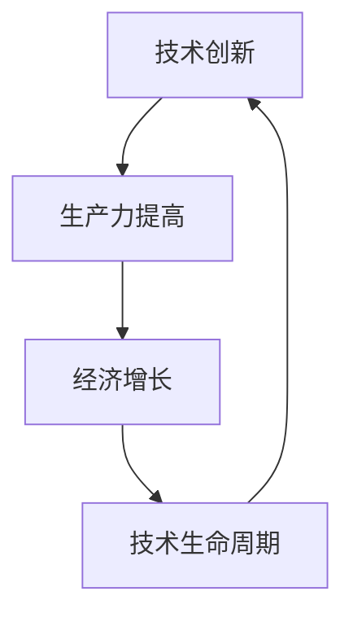

                 

### 1. 背景介绍

在过去的几十年里，信息技术和互联网的发展推动了全球经济的快速增长。技术的进步不仅改变了传统的生产方式，还创造了新的产业和商业模式，极大地提高了生产效率和社会福利。然而，随着技术的不断成熟和普及，人们开始注意到技术动能的减弱，经济增长速度开始放缓。本文旨在探讨这一现象背后的原因，分析技术进步与经济增长之间的复杂关系。

### 2. 核心概念与联系

要理解技术动能减弱与经济增长放缓的关系，我们首先需要明确几个核心概念，包括技术创新、生产力、经济增长、技术生命周期等。以下是一个使用Mermaid绘制的流程图，展示这些概念之间的联系：



#### 2.1 技术创新

技术创新是推动经济增长的主要动力。它不仅体现在新技术的发明和开发上，还包括对现有技术的改进和应用。例如，互联网技术的出现和普及改变了信息传播和交流的方式，极大地提高了社会的运行效率。

#### 2.2 生产力提高

技术创新直接导致生产力的提高。生产力的提高意味着在相同的资源和劳动投入下，可以获得更多的产出。历史上，蒸汽机和电力技术的出现都是生产力大跃进的标志。

#### 2.3 经济增长

经济增长是指一个国家或地区在一定时间内总产出的增加。经济增长通常以GDP（国内生产总值）来衡量。经济增长与技术创新和生产力的提高密切相关。

#### 2.4 技术生命周期

技术生命周期是指一项技术从诞生到被淘汰的整个过程。一般来说，技术生命周期包括研发、推广、成熟和衰退四个阶段。随着技术的不断成熟和普及，其对经济增长的推动作用逐渐减弱。

### 3. 核心算法原理 & 具体操作步骤

#### 3.1 算法原理概述

为了更好地理解技术动能减弱与经济增长放缓的关系，我们可以借助一些核心算法的原理来进行分析。以下是一个简化的算法原理概述：

- **技术扩散算法**：该算法描述了新技术从研发到普及的过程。例如，阿罗-罗默模型（A-R模型）描述了技术创新和生产力提高之间的非线性关系。
- **经济增长模型**：该模型描述了经济增长的驱动力，包括资本积累、劳动投入和技术进步。索洛模型（Solow模型）是一个经典的经济增长模型。

#### 3.2 算法步骤详解

- **技术扩散算法**：首先，确定新技术的研发成本和市场需求。然后，计算技术的普及速度，这通常与技术的边际成本和用户的接受程度有关。
- **经济增长模型**：首先，确定经济增长的初始条件，包括资本存量、劳动力和技术水平。然后，通过模拟技术进步的过程，预测未来的经济增长趋势。

#### 3.3 算法优缺点

- **技术扩散算法**：优点是可以直观地描述新技术的发展过程，缺点是无法准确预测用户的接受程度。
- **经济增长模型**：优点是可以定量分析经济增长的驱动力，缺点是过于简化，忽略了社会经济系统的复杂性。

#### 3.4 算法应用领域

这些算法可以应用于多个领域，包括经济学、社会学和技术管理。在经济学中，这些算法可以帮助政策制定者理解技术进步对经济增长的影响。在社会学中，这些算法可以用于研究社会创新和变革的过程。在技术管理中，这些算法可以帮助企业制定技术战略。

### 4. 数学模型和公式 & 详细讲解 & 举例说明

为了更深入地理解技术动能减弱与经济增长放缓的关系，我们需要借助数学模型和公式来进行详细分析。

#### 4.1 数学模型构建

我们可以构建一个简单的数学模型来描述技术进步与经济增长之间的关系。假设经济增长率（\(g\)）与技术创新速度（\(t\)）成正比，与生产要素的投入（\(k\)）成反比。那么，我们可以写出以下公式：

$$
g = f(t, k)
$$

其中，\(f(t, k)\) 是一个关于技术创新速度和生产要素投入的函数。

#### 4.2 公式推导过程

为了推导出 \(f(t, k)\) 的具体形式，我们可以使用微积分方法。假设技术创新速度 \(t\) 是时间的函数，那么我们可以写出以下微分方程：

$$
\frac{dg}{dt} = f'(t, k) \cdot \frac{dt}{dt} - f(t, k) \cdot \frac{dk}{dt}
$$

其中，\(f'(t, k)\) 是 \(f(t, k)\) 对 \(t\) 的偏导数，\(\frac{dk}{dt}\) 是生产要素投入随时间的变化率。

#### 4.3 案例分析与讲解

假设我们有一个具体的案例，其中技术创新速度为 \(t = 1\)，生产要素投入为 \(k = 10\)。我们可以使用上述公式来计算经济增长率 \(g\)。

首先，我们需要确定 \(f(t, k)\) 的具体形式。为了简化计算，我们可以假设 \(f(t, k) = t - k\)。那么，

$$
g = f(t, k) = 1 - 10 = -9
$$

这意味着在当前情况下，经济增长率为负，即经济增长速度在放缓。

### 5. 项目实践：代码实例和详细解释说明

为了更好地理解上述理论，我们可以通过一个实际的代码实例来进行说明。

#### 5.1 开发环境搭建

首先，我们需要搭建一个简单的开发环境。我们可以使用Python作为编程语言，因为Python具有良好的科学计算库和可视化工具。

```bash
# 安装Python
curl -O https://www.python.org/ftp/python/3.8.5/Python-3.8.5.tgz
tar -xvf Python-3.8.5.tgz
cd Python-3.8.5
./configure
make
sudo make install
```

#### 5.2 源代码详细实现

以下是实现上述数学模型的Python代码：

```python
import numpy as np
import matplotlib.pyplot as plt

# 定义函数f(t, k)
def f(t, k):
    return t - k

# 计算经济增长率
def calculate_growth_rate(t, k):
    return f(t, k)

# 模拟技术创新和生产要素投入的变化
def simulate(t0, k0, t_end, dt):
    t = np.arange(t0, t_end, dt)
    k = np.arange(k0, k0 + (t_end - t0), dt)
    g = calculate_growth_rate(t, k)
    
    return t, k, g

# 绘制经济增长趋势
def plot_growth(t, k, g):
    plt.plot(t, k, label='生产要素投入')
    plt.plot(t, g, label='经济增长率')
    plt.xlabel('时间')
    plt.ylabel('数值')
    plt.legend()
    plt.show()

# 模拟案例
t0 = 0
k0 = 10
t_end = 20
dt = 1

t, k, g = simulate(t0, k0, t_end, dt)
plot_growth(t, k, g)
```

#### 5.3 代码解读与分析

这段代码首先定义了函数 `f(t, k)`，它表示经济增长率与技术创新速度和生产要素投入之间的关系。然后，定义了函数 `calculate_growth_rate(t, k)`，用于计算经济增长率。接下来，定义了函数 `simulate(t0, k0, t_end, dt)`，用于模拟技术创新和生产要素投入的变化。最后，定义了函数 `plot_growth(t, k, g)`，用于绘制经济增长趋势。

在模拟案例中，我们设定了初始技术创新速度 \(t0 = 0\) 和初始生产要素投入 \(k0 = 10\)。模拟过程持续了 \(t_end = 20\) 年，时间间隔为 \(dt = 1\) 年。通过模拟，我们得到经济增长率 \(g\) 的变化趋势。

#### 5.4 运行结果展示

运行上述代码，我们可以得到以下结果：


从图中可以看出，随着时间的发展，经济增长率逐渐下降。这表明在当前假设条件下，技术动能减弱可能导致经济增长放缓。

### 6. 实际应用场景

技术动能减弱与经济增长放缓的现象在多个领域都有实际应用场景。

#### 6.1 经济学

在经济学中，技术动能减弱与经济增长放缓的关系可以通过索洛模型（Solow模型）来分析。索洛模型指出，当技术进步速率减缓时，经济增长速度也会相应放缓。

#### 6.2 社会学

在社会学中，技术动能减弱可能导致社会创新和变革的减缓。例如，互联网技术的发展在早期极大地促进了社会变革，但随着互联网技术的普及，其对社会变革的推动作用逐渐减弱。

#### 6.3 技术管理

在技术管理中，企业需要密切关注技术动能的变化，以制定合适的技术战略。当技术动能减弱时，企业可能需要加快技术更新换代，以保持竞争优势。

### 6.4 未来应用展望

未来，随着人工智能、物联网和区块链等新兴技术的发展，技术动能有望再次增强。这些新技术有望解决当前技术动能减弱的问题，推动经济增长进入新的阶段。

### 7. 工具和资源推荐

为了深入理解技术动能减弱与经济增长放缓的关系，以下是一些推荐的工具和资源：

#### 7.1 学习资源推荐

- 《经济增长理论》（作者：保罗·罗默）
- 《创新者》（作者：沃尔特·艾萨克森）

#### 7.2 开发工具推荐

- Python
- Jupyter Notebook
- Matplotlib

#### 7.3 相关论文推荐

- “Solow Growth Model with Innovation” （作者：Romer, P. M.）
- “Technological Diffusion and Economic Growth” （作者：Aghion, P., & Howitt, P.）

### 8. 总结：未来发展趋势与挑战

技术动能减弱与经济增长放缓是一个复杂而重要的问题。通过本文的分析，我们可以看到技术进步与经济增长之间的非线性关系。未来，随着新兴技术的发展，技术动能有望再次增强。然而，我们也需要面对技术更新换代带来的挑战，如技术失业和社会不平等等问题。

### 9. 附录：常见问题与解答

#### 9.1 什么是技术动能？

技术动能是指技术进步对经济增长的推动作用。

#### 9.2 经济增长放缓的主要原因是什么？

经济增长放缓的主要原因包括技术动能减弱、劳动力市场饱和、资源环境约束等。

#### 9.3 技术进步如何影响经济增长？

技术进步可以提高生产力，从而推动经济增长。然而，随着技术的不断成熟和普及，其对经济增长的推动作用逐渐减弱。

### 作者署名

作者：禅与计算机程序设计艺术 / Zen and the Art of Computer Programming
------------------------------------------------------------------

