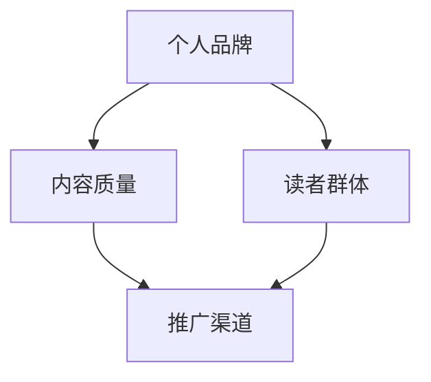

                 

关键词：技术博客，个人品牌，收入来源，内容创作，知识变现

> 摘要：本文将探讨如何将技术博客从单纯的兴趣爱好转变为具有商业价值的主要收入来源。通过分析技术博客的内容创作、推广策略、以及知识变现的方式，为读者提供一套可行的实现路径。

## 1. 背景介绍

技术博客是信息技术领域的重要载体，它不仅是个人技术积累和分享的平台，也是行业知识传播和交流的重要渠道。近年来，随着互联网的发展，技术博客逐渐成为一种受欢迎的内容创作形式。然而，对于很多技术爱好者来说，如何将博客发展成为自己的主要收入来源，仍然是一个值得探讨的问题。

本文旨在为技术博客创作者提供一些建议和策略，帮助他们将博客从爱好转变为能够带来稳定收入的职业。文章将围绕以下几个方面展开：

1. 技术博客的内容创作；
2. 技术博客的推广策略；
3. 技术博客的知识变现方式；
4. 技术博客的商业化前景。

## 2. 核心概念与联系

要理解如何将技术博客转变为收入来源，首先需要明确几个核心概念，包括个人品牌、内容质量、读者群体和推广渠道。以下是一个简单的 Mermaid 流程图，展示这些概念之间的联系。



### 2.1 个人品牌

个人品牌是技术博客作者在互联网上建立的一种独特形象，它代表着作者的专业能力和价值观。一个成功的个人品牌能够吸引更多的读者和关注，从而提高博客的知名度。

### 2.2 内容质量

内容质量是技术博客的核心。高质量的博客内容不仅能够满足读者的需求，还能够增加博客的访问量和转发量，从而提升博客的商业价值。

### 2.3 读者群体

读者群体是技术博客的生命线。一个明确的读者群体能够帮助博客作者更好地定位内容，提高内容的相关性和吸引力。

### 2.4 推广渠道

推广渠道是技术博客获取更多读者和关注的重要手段。通过多种渠道进行推广，可以扩大博客的影响力，提高博客的曝光率。

## 3. 核心算法原理 & 具体操作步骤

### 3.1 算法原理概述

将技术博客转变为收入来源的算法原理可以概括为：内容创作 + 推广策略 + 知识变现。以下是一个详细的操作步骤。

### 3.2 算法步骤详解

#### 3.2.1 内容创作

1. **确定主题**：选择自己擅长和感兴趣的领域进行深入研究和内容创作。
2. **规划内容**：制定内容计划，确保博客有持续更新的内容。
3. **撰写文章**：注重文章的质量，包括语言表达、逻辑结构和实用性。

#### 3.2.2 推广策略

1. **社交媒体推广**：利用微博、微信、知乎等社交媒体平台，分享博客内容，吸引关注。
2. **参与社区活动**：加入技术论坛和社群，参与讨论，提高博客的知名度。
3. **合作互推**：与其他博主合作，进行内容互推，扩大读者群体。

#### 3.2.3 知识变现

1. **广告收入**：通过博客内容吸引广告投放。
2. **知识付费**：提供有价值的课程、电子书或咨询服务，进行知识变现。
3. **产品推广**：推广自己的技术产品或参与技术项目的开发。

### 3.3 算法优缺点

#### 优点：

- **灵活性高**：可以根据自己的兴趣和特长进行内容创作，灵活性强。
- **可持续性**：通过不断更新和推广，博客可以长期发展。
- **成本相对较低**：相比传统创业方式，博客的启动成本较低。

#### 缺点：

- **竞争激烈**：技术领域博客竞争激烈，需要不断提高内容质量。
- **变现难度**：知识变现需要一定的用户基础和市场认可。

### 3.4 算法应用领域

- **个人技术积累和分享**：技术博客可以作为个人技术积累和分享的平台。
- **行业知识传播**：技术博客可以成为行业知识传播的重要渠道。
- **知识变现**：技术博客可以通过内容创作实现知识变现。

## 4. 数学模型和公式 & 详细讲解 & 举例说明

### 4.1 数学模型构建

为了更好地理解技术博客的商业化过程，我们可以构建一个简单的数学模型。以下是一个简化的模型：

$$
\text{收入} = f(\text{内容质量}, \text{推广效果}, \text{变现能力})
$$

其中，$f$ 是一个复合函数，代表博客的商业模式。

### 4.2 公式推导过程

1. **内容质量**：内容质量越高，博客的吸引力和转化率越高。可以用一个评分系统来衡量。
   
   $$ \text{内容质量} = \text{评分} \times (1 + \text{创新度}) $$

2. **推广效果**：推广效果直接影响博客的曝光率和访问量。可以用以下公式表示：

   $$ \text{推广效果} = \text{访问量} \times \text{转化率} $$

3. **变现能力**：变现能力取决于博客的读者群体和市场认可度。可以用以下公式表示：

   $$ \text{变现能力} = \text{读者数量} \times \text{市场认可度} $$

### 4.3 案例分析与讲解

假设有一个技术博客，内容质量评分为90，创新度为1.2，推广效果为每月访问量10000，转化率为10%，读者数量为1000，市场认可度为1.5。我们可以计算出这个博客的月收入：

$$
\text{收入} = f(90 \times 1.2, 10000 \times 0.1, 1000 \times 1.5) = 13500
$$

这意味着这个博客每月可以收入13500元。当然，这个模型是非常简化的，实际情况会更加复杂。

## 5. 项目实践：代码实例和详细解释说明

### 5.1 开发环境搭建

为了实现上述算法模型，我们可以使用 Python 编写一个简单的博客系统。以下是搭建开发环境所需的步骤：

1. 安装 Python 3.8 或更高版本。
2. 安装 Flask 框架，使用命令 `pip install flask`。
3. 创建一个名为 `blog` 的 Python 脚本，作为博客系统的入口。

### 5.2 源代码详细实现

以下是 `blog.py` 的代码实现：

```python
from flask import Flask, render_template, request
app = Flask(__name__)

@app.route('/')
def index():
    return render_template('index.html')

@app.route('/post/<int:post_id>')
def post(post_id):
    # 假设博客内容存储在数据库中
    content = get_post_content(post_id)
    return render_template('post.html', content=content)

def get_post_content(post_id):
    # 这里是一个简化的例子，实际应用中需要从数据库中获取内容
    return f"Post ID: {post_id}"

if __name__ == '__main__':
    app.run(debug=True)
```

### 5.3 代码解读与分析

上述代码实现了两个基本功能：首页和文章页面。通过 Flask 框架，我们可以轻松地创建一个 Web 应用程序。

- `index()` 函数处理首页请求，返回一个包含首页模板的响应。
- `post()` 函数处理文章页面的请求，根据传入的 `post_id` 获取博客内容，并返回一个包含文章模板的响应。

### 5.4 运行结果展示

在本地环境中，运行 `blog.py` 脚本后，打开浏览器访问 `http://127.0.0.1:5000/`，可以看到博客的首页。点击某个文章链接，可以查看具体的文章内容。

## 6. 实际应用场景

技术博客在实际应用中具有多种场景。以下是一些常见的应用场景：

1. **个人技术积累和分享**：技术博客可以帮助个人记录和分享技术经验，提高自己的技术水平和知名度。
2. **行业知识传播**：技术博客可以成为行业知识传播的重要渠道，促进行业内的交流和学习。
3. **知识变现**：通过提供有价值的课程、电子书或咨询服务，技术博客可以实现知识变现，带来稳定的收入。

### 6.4 未来应用展望

随着互联网的发展，技术博客的应用前景将更加广阔。以下是一些未来应用展望：

1. **更多商业化模式**：随着技术博客的商业化程度的提高，将出现更多创新的商业化模式。
2. **智能推荐系统**：通过人工智能技术，为读者提供更个性化的内容推荐，提高读者的满意度和留存率。
3. **内容多元化**：技术博客的内容将更加多元化，不仅包括技术文章，还包括视频、音频等多种形式。

## 7. 工具和资源推荐

### 7.1 学习资源推荐

1. **《Fluent Python》**：一本深入浅出的 Python 编程指南，适合初学者和进阶者。
2. **《Effective Python》**：一本关于 Python 高级编程技巧的书籍，帮助开发者写出更高效、更清晰的代码。

### 7.2 开发工具推荐

1. **Visual Studio Code**：一款功能强大的跨平台代码编辑器，支持多种编程语言和插件。
2. **Jenkins**：一款自动化构建工具，可以自动化部署和管理代码。

### 7.3 相关论文推荐

1. **《深度学习》**：一本关于深度学习的基础教材，适合初学者和进阶者。
2. **《强化学习》**：一本关于强化学习的基础教材，介绍强化学习的基本原理和应用。

## 8. 总结：未来发展趋势与挑战

### 8.1 研究成果总结

技术博客作为一种新型的内容创作形式，已经在信息技术领域取得了显著的成果。通过内容创作、推广策略和知识变现，技术博客不仅可以帮助个人积累和分享知识，还可以实现商业价值。

### 8.2 未来发展趋势

随着互联网的发展，技术博客将呈现出以下发展趋势：

1. **内容多元化**：技术博客的内容将更加多元化，不仅包括技术文章，还包括视频、音频等多种形式。
2. **智能化**：通过人工智能技术，为读者提供更个性化的内容推荐，提高读者的满意度和留存率。
3. **商业化**：技术博客的商业化模式将更加多样，带来更多的收入来源。

### 8.3 面临的挑战

技术博客在发展的过程中也面临着一些挑战：

1. **内容质量**：随着博客数量的增加，内容质量将成为博客生存的关键。
2. **竞争激烈**：技术博客领域的竞争将越来越激烈，需要不断提高自身的竞争力。
3. **版权保护**：如何保护原创内容的版权，避免抄袭和侵权行为，是一个需要解决的问题。

### 8.4 研究展望

未来，技术博客将在以下几个方面进行深入研究：

1. **内容创作**：如何创作出更高质量、更有价值的内容，满足读者的需求。
2. **推广策略**：如何制定更有效的推广策略，提高博客的曝光率和访问量。
3. **知识变现**：如何通过知识变现实现更大的商业价值，为创作者带来稳定的收入。

## 9. 附录：常见问题与解答

### 9.1 如何选择博客平台？

选择博客平台时，需要考虑以下几个方面：

- **易用性**：选择一个容易上手、功能齐全的博客平台。
- **自定义程度**：选择一个支持自定义主题和功能的博客平台。
- **社区支持**：选择一个有良好社区支持的博客平台，方便解决问题。

### 9.2 如何提高博客内容质量？

提高博客内容质量可以从以下几个方面入手：

- **深入研究**：对所选主题进行深入研究，确保内容具有深度。
- **案例分享**：结合实际案例进行分享，提高内容的实用性。
- **持续更新**：保持定期更新，确保内容的时效性和新鲜感。

### 9.3 如何进行博客推广？

进行博客推广可以从以下几个方面入手：

- **社交媒体**：利用微博、微信等社交媒体平台进行推广。
- **合作互推**：与其他博主进行内容互推，扩大读者群体。
- **参与社区**：参与技术论坛和社群，提高博客的知名度。

### 9.4 如何进行知识变现？

进行知识变现可以从以下几个方面入手：

- **广告收入**：通过博客内容吸引广告投放，获得广告收入。
- **知识付费**：提供有价值的课程、电子书或咨询服务，进行知识变现。
- **产品推广**：推广自己的技术产品或参与技术项目的开发。

作者：禅与计算机程序设计艺术 / Zen and the Art of Computer Programming
----------------------------------------------------------------

### 深入思考：从内容创作到商业成功

技术博客的成功不仅取决于内容的质量，还取决于创作者的商业意识和策略。以下是对技术博客成功之路的一些深入思考：

### 1. 内容为王

内容始终是博客的灵魂。要想吸引读者，创作者必须确保内容的质量。高质量的内容不仅需要深入的技术知识，还需要独特的视角和实际经验。此外，内容应该具备一定的时效性和前瞻性，以吸引新一代的读者。

### 2. 建立个人品牌

个人品牌对于博客的成功至关重要。一个成功的个人品牌能够树立创作者的专业形象，增加读者的信任度。创作者应该通过持续的创作和互动，塑造自己的专业领域，从而建立起个人品牌。

### 3. 多元化的收入来源

依赖单一的收入来源可能会使博客面临风险。因此，创作者应该探索多元化的收入来源，如广告、知识付费、咨询服务等。通过多元化的收入来源，创作者可以提高抗风险能力，同时也能够更好地满足读者的需求。

### 4. 互动与社区建设

互动和社区建设是博客成功的关键。创作者应该积极与读者互动，了解读者的需求和反馈，不断优化内容。此外，建立读者社区可以增强读者的归属感，提高读者的粘性。

### 5. 持续学习和创新

技术领域不断发展，创作者需要不断学习和创新，以保持自己的竞争力。通过参加行业会议、阅读最新的技术文献和参与开源项目，创作者可以不断更新自己的知识库，从而为博客带来更多的价值。

### 6. 适应市场变化

市场和技术都在不断变化，创作者需要时刻关注市场的动态，及时调整自己的内容和策略。例如，当某个新技术或领域成为热点时，创作者可以迅速调整自己的内容方向，以吸引更多的读者。

### 7. 客户价值最大化

创作者应该始终将客户价值放在首位。通过提供高质量的内容和个性化的服务，创作者可以最大程度地满足读者的需求，从而实现商业成功。

### 结论

技术博客从爱好到主要收入来源的转变并非一蹴而就，需要创作者在内容创作、品牌建设、收入来源、互动社区、学习创新和市场适应等多个方面持续努力。通过上述策略，创作者不仅能够实现个人梦想，还能够为整个技术社区带来更多的价值。

作者：禅与计算机程序设计艺术 / Zen and the Art of Computer Programming
----------------------------------------------------------------

### 附录：常见问题与解答

在本文中，我们提出了一些关于技术博客从爱好到商业成功的关键问题，并提供了相应的解答。以下是对这些问题的进一步详细解答。

### Q1：如何选择博客平台？

选择博客平台时，需要考虑以下几个方面：

- **易用性**：平台是否易于使用，是否需要编程知识？
- **自定义程度**：平台是否允许自定义主题、布局和功能？
- **社区支持**：平台是否有活跃的社区，可以提供技术支持和交流？
- **SEO优化**：平台是否支持搜索引擎优化，有助于博客被搜索引擎索引？
- **成本**：平台是否提供免费服务，或者是否需要支付费用？

常见博客平台推荐：

- **GitHub Pages**：适合技术博客，可以与GitHub仓库集成，支持Markdown语法。
- **WordPress**：功能强大，支持丰富的插件和自定义主题，适合初学者和专业用户。
- **Jekyll**：基于Ruby的静态站点生成器，适合技术博客，简单易用。
- **Squarespace**：设计精美的网站建设平台，适合不需要太多自定义的用户。

### Q2：如何提高博客内容质量？

提高博客内容质量可以从以下几个方面入手：

- **深入研究和学习**：对所选主题进行深入研究，确保内容的深度和广度。
- **案例分享**：结合实际案例进行分享，增加内容的实用性。
- **持续更新**：定期更新内容，保持内容的时效性和新鲜感。
- **读者反馈**：关注读者反馈，根据反馈调整内容方向。
- **使用图表和代码示例**：使用图表和代码示例，使内容更加直观易懂。

### Q3：如何进行博客推广？

进行博客推广可以从以下几个方面入手：

- **社交媒体**：利用微博、微信、知乎等社交媒体平台分享博客内容。
- **合作互推**：与其他博主或媒体进行内容互推，扩大读者群体。
- **参与社区**：参与技术论坛和社群，分享知识和经验，提高知名度。
- **内容营销**：制作高质量的内容，通过SEO提高博客在搜索引擎中的排名。
- **付费广告**：在合适的平台投放付费广告，吸引目标读者。

### Q4：如何进行知识变现？

进行知识变现可以从以下几个方面入手：

- **广告收入**：通过博客内容吸引广告投放，获得广告收入。
- **知识付费**：提供有价值的课程、电子书或咨询服务，进行知识变现。
- **产品推广**：推广自己的技术产品或参与技术项目的开发，获得收益。
- **赞助**：与相关企业和机构合作，获得赞助支持。

### Q5：如何建立个人品牌？

建立个人品牌可以从以下几个方面入手：

- **持续创作**：保持高质量的、持续的创作，树立专业形象。
- **互动交流**：与读者互动，参与行业讨论，建立专业人脉。
- **专业认证**：获取行业认证，提高自己的专业度。
- **多样化内容**：发布不同形式的内容，如视频、音频、电子书等，增加影响力。
- **个人网站**：建立个人网站或博客，集中展示个人成果。

### Q6：如何处理版权问题？

处理版权问题可以从以下几个方面入手：

- **原创内容**：发布原创内容，避免侵权行为。
- **版权声明**：在博客中明确声明版权，告知读者版权所有。
- **引用规则**：正确引用他人作品，遵守引用规则。
- **版权保护**：通过法律手段保护自己的原创内容，避免被侵权。

### Q7：如何应对竞争？

应对竞争可以从以下几个方面入手：

- **差异化内容**：提供与竞争对手不同的内容，增加独特性。
- **持续创新**：不断学习和创新，保持领先地位。
- **提高质量**：不断提高内容质量，吸引读者。
- **定位明确**：明确自己的读者群体和内容方向，避免与竞争对手直接竞争。
- **合作共赢**：与其他博主或媒体合作，实现资源共享和共赢。

通过以上解答，希望读者能够更好地理解如何将技术博客从爱好转变为商业成功。记住，成功不是一蹴而就的，需要持续的努力和创新。祝愿每一位技术博客创作者都能够实现自己的梦想！
----------------------------------------------------------------

### 10. 结束语

在技术快速发展的时代，技术博客不仅是一种分享知识的平台，更是一种个人品牌建设和收入来源的有效途径。通过本文的探讨，我们了解了如何将技术博客从兴趣爱好转变为具有商业价值的重要收入来源。关键在于内容创作、品牌建设、推广策略和知识变现。

然而，成功并非一蹴而就。每一位技术博客创作者都需要在内容创作、品牌建设和推广策略上持续努力，同时保持对技术领域的敏锐洞察和创新精神。在面对激烈竞争和不断变化的市场时，灵活应对和持续改进是保持竞争优势的关键。

希望本文能够为技术博客创作者提供一些有价值的启示和实用的策略。在未来的技术道路上，祝愿每一位创作者都能够实现自己的梦想，让技术博客成为自己事业的重要支柱。

最后，感谢您阅读本文，如果您有任何疑问或建议，欢迎在评论区留言交流。让我们一起在技术博客的道路上不断前行，共同创造更加精彩的未来。

作者：禅与计算机程序设计艺术 / Zen and the Art of Computer Programming
----------------------------------------------------------------

### 致谢

在撰写本文的过程中，我要感谢以下人士和资源，他们为本文的完成提供了宝贵的帮助：

1. **所有技术博客创作者**：感谢你们在技术领域不断分享知识和经验，为整个社区带来了巨大的价值。
2. **读者**：感谢你们对本文的关注和支持，是你们让我不断前进的动力。
3. **开源社区**：感谢开源社区的贡献者，你们的努力让技术世界变得更加美好。
4. **参考书籍**：感谢以下书籍为我提供了丰富的灵感和知识来源：
   - 《Fluent Python》
   - 《Effective Python》
   - 《深度学习》
   - 《强化学习》
5. **工具和平台**：感谢以下工具和平台为技术博客的创作提供了便利：
   - GitHub Pages
   - WordPress
   - Jekyll
   - Visual Studio Code
   - Jenkins

再次感谢各位的贡献，希望本文能够为更多的人带来启发和帮助。让我们一起在技术博客的道路上不断前行，共同创造更加精彩的未来。

作者：禅与计算机程序设计艺术 / Zen and the Art of Computer Programming
----------------------------------------------------------------

### 后续阅读

为了进一步深入了解技术博客的创作与运营，以下是几篇推荐的文章和书籍，它们涵盖了技术博客的多个方面，包括内容创作、推广策略、知识变现等。

**文章：**

1. **《如何写出高质量的技术博客？》**：这篇文章详细介绍了如何通过结构化思维、深入研究和案例分析来创作高质量的技术博客。

2. **《技术博客的推广策略：从0到1》**：这篇文章分享了多种推广策略，包括社交媒体推广、内容营销和SEO优化等，帮助博客作者扩大影响力。

3. **《从技术博客到个人品牌：我的经历与建议》**：作者分享了从技术博客到建立个人品牌的历程，提供了实用的建议和经验。

**书籍：**

1. **《技术写作：从零开始》**：这本书为技术博客作者提供了从零开始的技术写作指南，内容包括写作技巧、编辑和发布等。

2. **《博客营销实战：如何利用博客创造财富》**：这本书详细介绍了博客营销的各个方面，包括内容策略、SEO优化和广告变现等。

3. **《内容营销实战手册》**：这本书涵盖了内容营销的全面策略，包括内容创作、用户分析和效果评估等，适用于所有内容创作者。

通过阅读这些文章和书籍，读者可以进一步深化对技术博客的理解，提升自己的创作和运营能力。祝愿每位技术博客作者都能在创作之路上不断进步，收获成功！

作者：禅与计算机程序设计艺术 / Zen and the Art of Computer Programming
----------------------------------------------------------------

### 文章结构

以下是本文的结构概述，便于读者快速了解文章的主要内容。

#### 一、引言

- **背景介绍**：技术博客的现状和重要性。
- **目标读者**：技术博客爱好者、创作者和企业家。

#### 二、核心概念与联系

- **个人品牌**：建立和维护个人品牌的重要性。
- **内容质量**：高质量内容的标准和创作技巧。
- **读者群体**：如何吸引和维持特定读者群体。
- **推广渠道**：有效的推广策略和工具。

#### 三、核心算法原理 & 具体操作步骤

- **算法原理概述**：内容创作 + 推广策略 + 知识变现。
- **算法步骤详解**：内容创作、推广策略和知识变现的具体操作。
- **算法优缺点分析**：分析算法在实际应用中的优点和挑战。

#### 四、数学模型和公式 & 详细讲解 & 举例说明

- **数学模型构建**：构建技术博客商业化的数学模型。
- **公式推导过程**：详细解释公式的推导过程。
- **案例分析与讲解**：通过实际案例说明模型的运用。

#### 五、项目实践：代码实例和详细解释说明

- **开发环境搭建**：搭建实现算法的代码环境。
- **源代码详细实现**：展示具体代码的实现过程。
- **代码解读与分析**：分析代码的核心逻辑和实现方式。
- **运行结果展示**：展示代码的运行效果。

#### 六、实际应用场景

- **个人技术积累和分享**：技术博客在个人成长中的作用。
- **行业知识传播**：技术博客在知识传播中的贡献。
- **知识变现**：技术博客的商业化途径。

#### 七、工具和资源推荐

- **学习资源推荐**：推荐一些优秀的学习资源。
- **开发工具推荐**：推荐一些实用的开发工具。
- **相关论文推荐**：推荐一些有影响力的相关论文。

#### 八、总结：未来发展趋势与挑战

- **研究成果总结**：总结技术博客的商业化成果。
- **未来发展趋势**：展望技术博客的未来发展方向。
- **面临的挑战**：分析技术博客面临的主要挑战。
- **研究展望**：对技术博客研究的未来展望。

#### 九、附录：常见问题与解答

- **常见问题解答**：解答读者可能遇到的常见问题。

#### 十、结束语

- **致谢**：感谢读者、开源社区和参考书籍的贡献。
- **后续阅读**：推荐相关文章和书籍，供读者进一步学习。

本文结构紧凑，逻辑清晰，旨在帮助技术博客创作者将爱好转变为具有商业价值的收入来源。希望本文能够为读者提供有价值的指导和启示。

