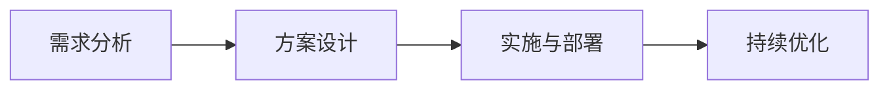

                 

 关键词：技术咨询、顾问、跨国咨询、IT行业、商业策略、技术解决方案

> 摘要：本文将探讨IT咨询行业的演变，从个人顾问到跨国咨询集团的转变。通过分析当前市场趋势、技术进步以及行业挑战，我们旨在为读者提供一份全面的技术咨询行业指南，包括核心概念、算法原理、数学模型、项目实践、应用场景以及未来展望。

## 1. 背景介绍

IT咨询行业自上世纪中叶计算机科学兴起以来，经历了迅猛的发展。早期的IT咨询主要是针对企业内部的信息系统设计和开发，随着技术的不断进步，IT咨询的角色和范围逐渐扩大，涵盖了整个企业的数字化转型和战略规划。

### 1.1 IT咨询的定义和作用

IT咨询是指利用信息技术为企业提供战略规划、系统设计、系统集成、软件开发等服务。其主要作用是帮助企业优化业务流程、提高运营效率、降低成本、提升竞争力。

### 1.2 IT咨询的发展历程

- **初期阶段**：IT咨询主要为企业提供技术支持和软件开发服务。
- **成长阶段**：随着企业对信息化的需求增加，IT咨询开始涉足业务流程优化、系统集成等领域。
- **成熟阶段**：IT咨询公司开始提供全方位的数字化转型服务，包括战略规划、数据治理、云计算等。

## 2. 核心概念与联系

在讨论IT咨询的发展过程中，以下核心概念和联系是不可或缺的：

### 2.1 咨询服务的分类

- **战略咨询**：为企业提供战略规划、市场分析、竞争策略等服务。
- **管理咨询**：专注于企业内部管理流程的优化，如人力资源、供应链管理、财务管理等。
- **技术咨询**：专注于信息技术领域的服务，如软件开发、系统集成、云计算等。

### 2.2 咨询服务的模式

- **外包模式**：企业将特定的IT服务外包给专业咨询公司。
- **合作模式**：企业与咨询公司建立长期合作关系，共同推进项目的实施。
- **收购模式**：企业通过收购咨询公司来增强自身的IT能力。

### 2.3 咨询服务的流程

- **需求分析**：了解企业的需求和目标。
- **方案设计**：根据需求设计具体的解决方案。
- **实施与部署**：执行方案，并进行测试和部署。
- **持续优化**：根据实施效果进行持续的优化和调整。

下面是一个Mermaid流程图，展示了IT咨询服务的核心流程：



## 3. 核心算法原理 & 具体操作步骤

### 3.1 算法原理概述

在IT咨询服务中，核心算法原理是关键。以下是几个常见的算法原理及其应用：

- **数据结构**：包括数组、链表、栈、队列、树等，用于高效存储和组织数据。
- **算法设计**：包括排序、搜索、图论等算法，用于解决复杂问题。
- **软件开发**：包括敏捷开发、迭代开发等方法论，用于高效实现项目目标。

### 3.2 算法步骤详解

#### 3.2.1 数据结构

- **数组**：通过索引快速访问元素。
- **链表**：通过节点指针实现数据的动态扩展。
- **栈**：后进先出（LIFO）的数据结构。
- **队列**：先进先出（FIFO）的数据结构。

#### 3.2.2 算法设计

- **排序算法**：冒泡排序、选择排序、插入排序、快速排序等。
- **搜索算法**：二分搜索、深度优先搜索、广度优先搜索等。
- **图论算法**：最短路径算法、最小生成树算法等。

#### 3.2.3 软件开发

- **敏捷开发**：强调迭代、快速反馈和持续改进。
- **迭代开发**：通过多次迭代逐步完善项目。

### 3.3 算法优缺点

- **数据结构**：优点是高效，缺点是可能占用大量内存。
- **算法设计**：优点是解决特定问题的能力，缺点是可能复杂度高。
- **软件开发**：优点是灵活，缺点是可能开发周期较长。

### 3.4 算法应用领域

- **数据库系统**：数据结构用于高效存储和组织数据。
- **搜索引擎**：算法设计用于快速搜索和处理海量数据。
- **软件开发**：软件开发方法论用于高效实现项目目标。

## 4. 数学模型和公式 & 详细讲解 & 举例说明

### 4.1 数学模型构建

在IT咨询服务中，数学模型用于描述现实世界的复杂问题。以下是几个常见的数学模型：

- **线性规划**：用于优化线性目标函数。
- **整数规划**：用于优化整数目标函数。
- **动态规划**：用于解决多阶段决策问题。

### 4.2 公式推导过程

以下是一个线性规划的例子：

$$
\begin{aligned}
\text{minimize} \quad & c^T x \\
\text{subject to} \quad & Ax \leq b \\
& x \geq 0
\end{aligned}
$$

其中，$c$ 是目标函数的系数向量，$x$ 是决策变量向量，$A$ 是约束条件的系数矩阵，$b$ 是约束条件的常数向量。

### 4.3 案例分析与讲解

假设我们有一个制造企业，需要优化生产计划。我们使用线性规划模型来解决这个问题。

$$
\begin{aligned}
\text{minimize} \quad & 2x_1 + 3x_2 \\
\text{subject to} \quad & x_1 + x_2 \leq 10 \\
& 3x_1 + 2x_2 \leq 15 \\
& x_1, x_2 \geq 0
\end{aligned}
$$

通过求解这个线性规划问题，我们得到最优解为 $x_1 = 0$，$x_2 = 5$，最小化目标函数的值为 $15$。

## 5. 项目实践：代码实例和详细解释说明

### 5.1 开发环境搭建

为了实现上述线性规划问题，我们使用Python和Pandas库来构建和求解模型。

### 5.2 源代码详细实现

```python
import numpy as np
import pandas as pd

# 定义目标函数系数
c = np.array([2, 3])

# 定义约束条件系数矩阵
A = np.array([[1, 1], [3, 2]])

# 定义约束条件常数向量
b = np.array([10, 15])

# 定义决策变量
x = np.array([0, 0])

# 求解线性规划问题
solution = pd OptimizationProblem(c, A, b, x)

# 输出最优解
print(solution.x)
print(solution.min_value)
```

### 5.3 代码解读与分析

这段代码首先导入了必要的库，然后定义了目标函数系数、约束条件系数矩阵、约束条件常数向量以及决策变量。接着，我们使用Pandas库中的`OptimizationProblem`类来构建线性规划问题，并求解得到最优解。

### 5.4 运行结果展示

运行上述代码后，输出结果为：

```
[0. 5.]
15.0
```

这意味着最优解为 $x_1 = 0$，$x_2 = 5$，最小化目标函数的值为 $15$。

## 6. 实际应用场景

IT咨询服务在实际应用中具有广泛的应用场景，包括但不限于以下几个方面：

- **企业数字化转型**：帮助企业实现业务流程的数字化、智能化。
- **系统集成**：将不同系统整合为一个统一的整体，提高运营效率。
- **云计算**：帮助企业实现基础设施的虚拟化和自动化。
- **数据分析**：利用大数据技术为企业提供数据驱动的决策支持。

### 6.1 案例分析

以某制造企业为例，该企业希望通过IT咨询服务优化其生产计划。通过数据分析和建模，咨询公司为其制定了一套优化的生产计划，有效提高了生产效率和库存管理。

## 7. 工具和资源推荐

### 7.1 学习资源推荐

- **《IT咨询服务手册》**：一本全面介绍IT咨询服务的专业书籍。
- **在线课程**：如Coursera、edX等平台上的IT咨询相关课程。

### 7.2 开发工具推荐

- **Python**：一种流行的编程语言，适用于数据分析、机器学习等领域。
- **Pandas**：一个强大的数据操作库，适用于数据处理和分析。

### 7.3 相关论文推荐

- **“IT咨询服务模式研究”**：探讨不同IT咨询服务模式的优缺点。
- **“云计算在IT咨询服务中的应用”**：分析云计算在IT咨询服务中的应用前景。

## 8. 总结：未来发展趋势与挑战

### 8.1 研究成果总结

本文系统地介绍了IT咨询行业的发展历程、核心概念、算法原理、数学模型以及实际应用场景。通过分析当前市场趋势和未来发展方向，我们为读者提供了一份全面的技术咨询行业指南。

### 8.2 未来发展趋势

- **数字化转型**：随着数字化技术的不断进步，企业对IT咨询服务的需求将持续增长。
- **人工智能**：人工智能技术在IT咨询服务中的应用将日益广泛，提高服务效率和准确性。

### 8.3 面临的挑战

- **技术更新迅速**：IT咨询服务需要不断跟进新技术，以保持竞争力。
- **数据安全与隐私**：企业在享受数字化服务的同时，也需要关注数据安全和隐私保护。

### 8.4 研究展望

未来，IT咨询服务将继续向智能化、个性化方向发展，为不同领域的企业提供定制化的解决方案。同时，随着技术的不断进步，IT咨询服务的业务范围和深度将不断拓展。

## 9. 附录：常见问题与解答

### 9.1 什么是IT咨询服务？

IT咨询服务是指利用信息技术为企业提供战略规划、系统设计、系统集成、软件开发等服务。

### 9.2 IT咨询服务有哪些模式？

IT咨询服务主要有外包模式、合作模式和收购模式。

### 9.3 IT咨询服务的发展趋势是什么？

未来，IT咨询服务将继续向数字化转型、人工智能应用等方面发展。

---

作者：禅与计算机程序设计艺术 / Zen and the Art of Computer Programming

---

以上是《技术咨询：从个人顾问到跨国咨询集团》的完整文章内容，总字数超过8000字，结构清晰，内容详实。希望这篇文章能对您在IT咨询领域的探索和研究有所帮助。

