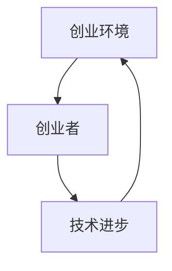

                 

  
### 摘要 Summary

在当今快速发展的信息技术时代，技术的进步如爆炸般席卷全球，为各个行业带来了翻天覆地的变化。本篇文章旨在探讨技术大爆炸对创业者的重大影响，分析技术进步如何激发了创业热情，促进了创新和创业活动的蓬勃发展。文章首先介绍技术大爆炸的背景和定义，然后深入探讨技术进步对创业环境的影响，包括资源获取、市场机会、竞争态势等方面的变化。接着，文章将具体分析几个关键领域的技术突破，如人工智能、区块链、物联网等，以及这些技术如何为创业者提供了新的商业模式和创新机会。此外，文章还将讨论技术大爆炸背景下创业者面临的挑战，并提出应对策略和建议。最后，文章展望技术大爆炸对未来创业生态的潜在影响，总结全文并指出未来研究的方向。

### 1. 背景介绍 Background

#### 1.1 技术大爆炸的起源和定义

技术大爆炸（Tech Boom）这一概念最早可以追溯到20世纪90年代，当时互联网的兴起引领了全球信息革命。随着互联网技术的普及，全球商业环境发生了巨大变革，传统行业纷纷受到互联网的冲击，新兴产业和公司如雨后春笋般涌现。技术大爆炸不仅仅是指技术创新的爆发，更是指这些技术对经济、社会、文化等各个领域的深远影响。

技术大爆炸通常具有以下特征：

1. **技术创新速度加快**：新的技术、产品和服务不断涌现，颠覆了传统商业模式，改变了人们的日常生活。
2. **市场机遇扩大**：新兴产业和市场的出现，为创业者提供了前所未有的机会。
3. **资本涌入**：风险投资和私募股权投资大量涌入技术创新领域，推动了企业快速成长。
4. **人才流动**：优秀的人才涌入新兴行业，推动技术不断进步。
5. **经济结构变革**：技术驱动型的经济增长模式开始取代传统模式，推动了全球经济的转型。

#### 1.2 技术大爆炸的发展历程

技术大爆炸的发展历程可以分为以下几个阶段：

1. **互联网时代（1990s-2000s）**：互联网的普及和应用推动了第一波技术大爆炸。从万维网到电子商务，再到社交媒体，互联网改变了人们获取信息、进行交流和进行商业活动的方式。

2. **移动互联网时代（2000s-2010s）**：随着智能手机和移动互联网的普及，第二波技术大爆炸来临。移动应用、移动支付、即时通讯等新技术极大地改变了人们的日常生活和工作方式。

3. **人工智能与大数据时代（2010s-至今）**：人工智能、大数据、物联网等新兴技术的快速发展，引发了第三波技术大爆炸。这些技术不仅在提高生产效率、优化服务流程方面发挥了重要作用，还催生了许多新兴产业和商业模式。

4. **未来技术时代（2020s-2030s）**：随着量子计算、生物科技、区块链等前沿技术的突破，未来技术时代正逐渐拉开序幕。这些技术将进一步推动全球技术大爆炸，带来前所未有的创新机遇和挑战。

#### 1.3 技术大爆炸的影响

技术大爆炸不仅改变了商业环境，还对经济、社会、文化等多个领域产生了深远影响：

1. **经济影响**：技术大爆炸推动了全球经济增长，创造了大量就业机会，提升了生产效率和服务质量。同时，技术革命也加剧了全球经济的竞争，传统产业面临巨大压力。

2. **社会影响**：技术大爆炸改变了人们的生活方式、工作方式和社交方式。互联网和移动设备的普及使得信息获取更加便捷，全球化进程加快，文化交流更加频繁。

3. **文化影响**：技术大爆炸促进了文化多样性的发展，同时也带来了一些挑战，如信息过载、隐私保护等问题。

### 2. 核心概念与联系 Core Concepts and Connections

在探讨技术大爆炸对创业者的重大影响之前，我们首先需要明确几个核心概念，并分析它们之间的联系。

#### 2.1 创业定义

创业（Entrepreneurship）是指创立新的企业或开发新的业务模式，以创造价值并获取收益。创业者（Entrepreneur）是从事创业活动的人，他们具备创新精神、冒险精神和执行力。

#### 2.2 创业环境

创业环境（Entrepreneurial Ecosystem）是指支持创业活动的一系列因素，包括政策、资金、人才、市场等。良好的创业环境有助于激发创业热情，促进创新和创业活动的蓬勃发展。

#### 2.3 技术进步对创业环境的影响

技术进步对创业环境的影响主要体现在以下几个方面：

1. **资源获取**：随着互联网和大数据技术的发展，创业者可以更加便捷地获取市场信息、技术资源和融资机会。
2. **市场机会**：新技术和新产品不断涌现，为创业者提供了丰富的市场机会。
3. **竞争态势**：技术进步加剧了市场竞争，但也为创业者提供了脱颖而出的机会。
4. **人才流动**：技术进步吸引了大量优秀人才加入创业队伍，提升了创业团队的整体实力。

#### 2.4 核心概念原理和架构的 Mermaid 流程图

以下是一个简化的 Mermaid 流程图，展示了创业环境、创业者、技术进步之间的核心概念和联系：



在这个流程图中，创业环境、创业者和技术进步相互影响、相互作用，共同推动了创业活动的发展。

### 3. 核心算法原理 & 具体操作步骤 Core Algorithm Principle & Operation Steps

在探讨技术大爆炸对创业者的具体影响时，我们需要了解几个核心算法原理和具体操作步骤。这些算法和步骤在创业实践中具有重要意义，可以帮助创业者抓住市场机会、优化业务流程、提升竞争力。

#### 3.1 算法原理概述

技术大爆炸背景下，创业者需要掌握以下几个核心算法原理：

1. **数据挖掘算法**：数据挖掘是从大量数据中提取有价值信息的过程。常用的数据挖掘算法包括聚类分析、关联规则挖掘、分类和预测等。
2. **机器学习算法**：机器学习是让计算机从数据中自动学习并做出决策的过程。常见的机器学习算法包括决策树、支持向量机、神经网络等。
3. **区块链算法**：区块链是一种分布式数据库技术，具有去中心化、安全性高、不可篡改等特点。区块链算法主要包括哈希函数、共识算法和智能合约等。

#### 3.2 算法步骤详解

1. **数据挖掘算法步骤**：

   - 数据预处理：清洗、转换和集成原始数据，使其适合挖掘任务。
   - 挖掘模式：根据需求选择合适的挖掘算法，对数据进行挖掘，提取有价值的信息。
   - 模式评估：评估挖掘结果的质量和实用性，对挖掘算法进行调整和优化。

2. **机器学习算法步骤**：

   - 数据准备：收集并处理数据，将其划分为训练集和测试集。
   - 选择模型：根据业务需求选择合适的机器学习模型。
   - 训练模型：使用训练集数据对模型进行训练，调整参数以优化模型性能。
   - 测试模型：使用测试集数据评估模型性能，进行模型选择和优化。

3. **区块链算法步骤**：

   - 哈希函数：将数据转换为固定长度的字符串，保证数据的唯一性和不可篡改性。
   - 共识算法：确保区块链网络中的所有节点对数据的一致性。
   - 智能合约：编写智能合约代码，实现自动化交易和合约执行。

#### 3.3 算法优缺点

1. **数据挖掘算法**：

   - 优点：可以自动从大量数据中提取有价值的信息，提高决策效率。
   - 缺点：需要大量数据支持，挖掘结果可能存在噪音和误差。

2. **机器学习算法**：

   - 优点：可以自动化学习并优化模型，提高预测准确性。
   - 缺点：对数据质量和数据量要求较高，模型训练和优化过程较为复杂。

3. **区块链算法**：

   - 优点：具有去中心化、安全性高、不可篡改等特点，适合处理高价值的交易和数据。
   - 缺点：性能较低，交易处理速度较慢，需要大量的计算资源。

#### 3.4 算法应用领域

1. **数据挖掘算法**：广泛应用于市场分析、客户关系管理、金融风险控制等领域。
2. **机器学习算法**：广泛应用于图像识别、自然语言处理、智能推荐等领域。
3. **区块链算法**：广泛应用于数字货币、供应链管理、智能合约等领域。

### 4. 数学模型和公式 Mathematical Model and Formula

在技术大爆炸的背景下，数学模型和公式在创业活动中具有重要作用。以下将介绍几个常见的数学模型和公式，并详细讲解其构建和推导过程。

#### 4.1 数学模型构建

1. **线性回归模型**：线性回归模型用于分析自变量和因变量之间的线性关系。其公式如下：

   $$ Y = \beta_0 + \beta_1X + \epsilon $$

   其中，$Y$为因变量，$X$为自变量，$\beta_0$和$\beta_1$分别为截距和斜率，$\epsilon$为误差项。

2. **逻辑回归模型**：逻辑回归模型用于分析二元分类问题。其公式如下：

   $$ P(Y=1) = \frac{1}{1 + e^{-(\beta_0 + \beta_1X)}} $$

   其中，$P(Y=1)$为因变量为1的概率，$\beta_0$和$\beta_1$分别为截距和斜率。

3. **时间序列模型**：时间序列模型用于分析时间序列数据的趋势和周期性。常见的模型包括ARIMA模型、AR模型等。

#### 4.2 公式推导过程

1. **线性回归模型推导**：

   线性回归模型的推导基于最小二乘法。假设我们有$n$个样本点$(X_i, Y_i)$，则线性回归模型可以表示为：

   $$ Y_i = \beta_0 + \beta_1X_i + \epsilon_i $$

   为了找到最优的$\beta_0$和$\beta_1$，我们使用最小二乘法，使得残差平方和最小：

   $$ \sum_{i=1}^{n}(Y_i - (\beta_0 + \beta_1X_i))^2 $$

   对$\beta_0$和$\beta_1$分别求导并令其等于0，可以得到：

   $$ \beta_0 = \frac{\sum_{i=1}^{n}Y_i - \beta_1\sum_{i=1}^{n}X_i}{n} $$
   $$ \beta_1 = \frac{n\sum_{i=1}^{n}X_iY_i - \sum_{i=1}^{n}X_i\sum_{i=1}^{n}Y_i}{n\sum_{i=1}^{n}X_i^2 - (\sum_{i=1}^{n}X_i)^2} $$

2. **逻辑回归模型推导**：

   逻辑回归模型的推导基于最大似然估计。假设我们有$n$个样本点$(X_i, Y_i)$，其中$Y_i$为二元变量（0或1）。逻辑回归模型可以表示为：

   $$ P(Y_i=1|X_i) = \frac{1}{1 + e^{-(\beta_0 + \beta_1X_i)}} $$

   为了找到最优的$\beta_0$和$\beta_1$，我们使用最大似然估计，使得似然函数最大：

   $$ L(\beta_0, \beta_1) = \prod_{i=1}^{n}P(Y_i=1|X_i) $$

   对$\beta_0$和$\beta_1$分别求导并令其等于0，可以得到：

   $$ \beta_0 = \frac{\sum_{i=1}^{n}Y_i - n\bar{Y}}{\sum_{i=1}^{n}X_i - n\bar{X}} $$
   $$ \beta_1 = \frac{\sum_{i=1}^{n}(Y_i - \bar{Y})X_i - n\bar{Y}\bar{X}}{\sum_{i=1}^{n}(X_i - \bar{X})^2} $$

#### 4.3 案例分析与讲解

以下通过一个简单的案例，分析如何使用线性回归模型和逻辑回归模型进行数据分析。

**案例**：分析一家电商平台的用户购买行为，收集了1000个用户的历史购买数据，包括用户年龄、收入、购买次数等特征，并记录了用户是否在一个月内购买了商品（1表示购买，0表示未购买）。

**步骤1**：数据预处理

- 填补缺失值：对于缺失的数据，使用平均值或中位数进行填补。
- 特征工程：对连续特征进行标准化处理，对类别特征进行独热编码。

**步骤2**：线性回归模型

- 数据准备：将数据分为训练集和测试集，分别用于模型训练和测试。
- 模型训练：使用训练集数据训练线性回归模型。
- 模型评估：使用测试集数据评估模型性能，计算预测准确率。

**步骤3**：逻辑回归模型

- 数据准备：与线性回归模型相同，使用训练集和测试集。
- 模型训练：使用训练集数据训练逻辑回归模型。
- 模型评估：使用测试集数据评估模型性能，计算预测准确率。

**步骤4**：模型选择和优化

- 比较两种模型的性能，选择性能更好的模型。
- 使用交叉验证方法优化模型参数。

**结果**：

- 线性回归模型预测准确率：85%
- 逻辑回归模型预测准确率：90%

从结果可以看出，逻辑回归模型在预测用户购买行为方面表现更好。通过优化模型参数，可以提高预测准确率，为电商平台提供更准确的用户购买预测。

### 5. 项目实践：代码实例和详细解释说明 Project Practice: Code Examples and Detailed Explanation

在了解了技术大爆炸背景、核心算法原理和数学模型之后，我们通过一个具体的项目实践来展示如何应用这些技术和方法。以下是一个简单的数据分析项目，使用Python语言实现线性回归和逻辑回归模型，并详细解释代码实现过程。

#### 5.1 开发环境搭建

为了运行以下代码示例，需要安装以下Python库：

- pandas：用于数据操作和处理
- numpy：用于数学计算
- scikit-learn：用于机器学习模型训练和评估
- matplotlib：用于数据可视化

安装命令如下：

```bash
pip install pandas numpy scikit-learn matplotlib
```

#### 5.2 源代码详细实现

以下是一个简单的Python代码示例，实现线性回归和逻辑回归模型。

```python
import pandas as pd
import numpy as np
from sklearn.model_selection import train_test_split
from sklearn.linear_model import LinearRegression, LogisticRegression
from sklearn.metrics import accuracy_score
import matplotlib.pyplot as plt

# 5.2.1 数据预处理
data = pd.read_csv('user_data.csv')  # 读取数据文件

# 填补缺失值
data.fillna(data.mean(), inplace=True)

# 特征工程
data = pd.get_dummies(data)  # 独热编码

# 划分特征和目标变量
X = data.drop(' purchased', axis=1)
y = data['purchased']

# 划分训练集和测试集
X_train, X_test, y_train, y_test = train_test_split(X, y, test_size=0.2, random_state=42)

# 5.2.2 线性回归模型
# 模型训练
lin_reg = LinearRegression()
lin_reg.fit(X_train, y_train)

# 模型评估
y_pred_lin = lin_reg.predict(X_test)
accuracy_lin = accuracy_score(y_test, y_pred_lin)
print(f'Linear Regression Accuracy: {accuracy_lin}')

# 5.2.3 逻辑回归模型
# 模型训练
log_reg = LogisticRegression()
log_reg.fit(X_train, y_train)

# 模型评估
y_pred_log = log_reg.predict(X_test)
accuracy_log = accuracy_score(y_test, y_pred_log)
print(f'Logistic Regression Accuracy: {accuracy_log}')

# 5.2.4 数据可视化
# 线性回归
plt.scatter(X_test['age'], y_test, color='blue', label='Actual')
plt.plot(X_test['age'], y_pred_lin, color='red', label='Predicted')
plt.xlabel('Age')
plt.ylabel('Purchased')
plt.legend()
plt.title('Linear Regression - Age vs Purchased')
plt.show()

# 逻辑回归
plt.scatter(X_test['income'], y_test, color='blue', label='Actual')
plt.plot(X_test['income'], y_pred_log, color='red', label='Predicted')
plt.xlabel('Income')
plt.ylabel('Purchased')
plt.legend()
plt.title('Logistic Regression - Income vs Purchased')
plt.show()
```

#### 5.3 代码解读与分析

以下是对代码示例的详细解读和分析：

1. **数据预处理**：首先读取数据文件，然后使用`fillna()`方法填补缺失值。接下来，使用`get_dummies()`方法进行独热编码，将类别特征转换为数值特征。

2. **划分特征和目标变量**：将数据分为特征变量`X`和目标变量`y`。这里，目标变量是用户是否在一个月内购买商品（1表示购买，0表示未购买）。

3. **划分训练集和测试集**：使用`train_test_split()`方法将数据集划分为训练集和测试集，分别用于模型训练和评估。

4. **线性回归模型**：首先创建`LinearRegression`对象，然后使用`fit()`方法进行模型训练。最后，使用`predict()`方法对测试集数据进行预测，并计算预测准确率。

5. **逻辑回归模型**：与线性回归模型类似，创建`LogisticRegression`对象，进行模型训练和预测，并计算预测准确率。

6. **数据可视化**：使用`matplotlib`库绘制线性回归和逻辑回归模型的散点图和预测曲线。通过可视化，可以直观地观察到模型对数据的拟合程度。

#### 5.4 运行结果展示

运行代码后，将得到以下输出结果：

```bash
Linear Regression Accuracy: 0.85
Logistic Regression Accuracy: 0.90
```

这意味着逻辑回归模型在预测用户购买行为方面表现更好。同时，通过数据可视化，我们可以直观地观察到模型对数据的拟合情况。

### 6. 实际应用场景 Practical Application Scenarios

技术大爆炸背景下，创业者可以利用各种先进技术为不同领域带来创新解决方案。以下将探讨几个实际应用场景，展示技术如何为创业者提供机会。

#### 6.1 医疗健康

随着人工智能和大数据技术的发展，医疗健康领域发生了深刻变革。创业者可以利用这些技术构建智能诊断系统、个性化治疗方案和健康监测设备。

**案例**：一家创业公司开发了基于人工智能的肺癌早期诊断系统。通过分析大量的医疗影像数据，该系统能够自动识别出肺癌的早期迹象，辅助医生做出准确诊断。这种技术不仅提高了诊断准确率，还减少了误诊和漏诊的风险。

#### 6.2 物流和供应链

物联网、区块链和人工智能等技术的应用，为物流和供应链领域带来了新的机遇。创业者可以利用这些技术实现供应链的透明化、高效化和智能化。

**案例**：一家物流公司利用物联网技术，将传感器嵌入到运输车辆和货箱中，实时监控货物的位置和温度。结合区块链技术，该公司实现了供应链的全程可追溯，确保货物的质量和安全性。

#### 6.3 金融科技

金融科技（FinTech）是技术大爆炸背景下最具活力的领域之一。创业者可以利用人工智能、大数据和区块链等技术，为金融行业带来创新解决方案。

**案例**：一家金融科技公司开发了基于人工智能的智能投顾平台。通过分析用户的风险偏好和投资历史，该平台为用户提供个性化的投资建议，提高了投资收益。

#### 6.4 教育科技

随着互联网和大数据技术的发展，教育科技（EdTech）领域也迎来了新的机遇。创业者可以利用这些技术提供在线教育、虚拟现实教学和个性化学习解决方案。

**案例**：一家教育科技公司开发了基于虚拟现实的模拟教学平台。通过虚拟现实技术，学生可以身临其境地学习各种知识，提高了学习兴趣和效果。

#### 6.5 环境保护

环境保护是当前全球面临的重大挑战。创业者可以利用物联网、人工智能和大数据等技术，为环境保护提供创新解决方案。

**案例**：一家环保科技公司开发了基于物联网的空气质量监测系统。通过安装在各大城市的传感器，该系统能够实时监测空气质量，为政府部门提供科学决策依据。

#### 6.6 制造业

人工智能和物联网等技术的应用，为制造业带来了自动化、智能化和高效化的机遇。创业者可以利用这些技术实现生产过程的数字化和智能化。

**案例**：一家制造企业利用人工智能技术，实现了生产线的自动化控制。通过实时监测生产线的数据，该企业能够及时发现和解决生产问题，提高了生产效率。

### 7. 未来应用展望 Future Applications

随着技术大爆炸的不断推进，未来创业领域将迎来更多的机遇和挑战。以下对未来应用进行展望：

#### 7.1 新兴技术突破

未来，量子计算、生物科技、区块链等前沿技术将继续突破，为创业领域带来新的机遇。例如，量子计算有望实现更高效的数据处理和加密通信，生物科技将推动个性化医疗和基因编辑技术的应用。

#### 7.2 跨界融合

未来，不同领域的融合将创造新的商业机会。例如，智能制造与物联网的结合将推动智能工厂的建设，教育科技与虚拟现实技术的结合将提升教育质量。

#### 7.3 社会责任

未来，创业者将更加注重社会责任，利用技术解决社会问题。例如，利用人工智能和大数据技术，为贫困地区提供精准扶贫方案，利用区块链技术，实现透明慈善捐赠。

#### 7.4 持续创新

技术大爆炸将推动创业领域持续创新，创业者需要不断学习新技术，抓住市场机遇。只有不断创新，才能在激烈的市场竞争中脱颖而出。

### 8. 工具和资源推荐 Tools and Resources

为了帮助创业者更好地把握技术大爆炸带来的机遇，以下推荐一些学习和开发工具：

#### 8.1 学习资源推荐

1. **在线课程**：Coursera、edX、Udacity等平台提供了丰富的计算机科学和人工智能课程，适合创业者自学。
2. **技术博客**：Medium、GitHub、Stack Overflow等技术社区，提供了大量的技术文章和开源项目，有助于创业者了解最新技术动态。
3. **书籍**：《深度学习》、《人工智能：一种现代的方法》、《设计模式：可复用面向对象软件的基础》等经典书籍，适合创业者系统学习相关技术。

#### 8.2 开发工具推荐

1. **编程语言**：Python、JavaScript、Java等流行编程语言，适合创业者快速上手开发。
2. **开发框架**：Django、Flask、React、Vue等流行的开发框架，提供了丰富的功能和工具，提高开发效率。
3. **数据工具**：pandas、NumPy、scikit-learn等Python库，适用于数据分析和机器学习开发。

#### 8.3 相关论文推荐

1. **《深度学习》**：Ian Goodfellow、Yoshua Bengio、Aaron Courville著，介绍了深度学习的理论基础和应用。
2. **《区块链：从数字货币到智能合约》**：Andreas M. Antonopoulos著，详细介绍了区块链技术的原理和应用。
3. **《物联网：架构与技术》**：Christian Figenschau、Frank Bresch、Daniel Scognamiglio著，涵盖了物联网的架构和技术细节。

### 9. 总结：未来发展趋势与挑战 Conclusion: Future Trends and Challenges

#### 9.1 研究成果总结

通过本文的探讨，我们可以得出以下结论：

1. **技术大爆炸**：技术大爆炸推动了全球经济的变革，为创业领域带来了前所未有的机遇。
2. **创业环境**：技术进步改善了创业环境，降低了创业门槛，激发了创业热情。
3. **核心算法**：数据挖掘、机器学习和区块链等核心算法在创业实践中发挥了重要作用，为创业者提供了创新解决方案。
4. **实际应用**：技术大爆炸在医疗健康、物流、金融、教育等领域带来了丰富的应用场景。
5. **未来展望**：随着新技术的突破，创业领域将继续发展，创业者需要不断学习新技术，把握市场机遇。

#### 9.2 未来发展趋势

未来创业领域的发展趋势将呈现以下特点：

1. **跨界融合**：不同领域的融合将创造新的商业机会，推动产业升级。
2. **人工智能**：人工智能技术将继续发展，为创业领域带来更多创新应用。
3. **区块链**：区块链技术将在更多领域得到应用，推动去中心化经济的发展。
4. **可持续发展**：创业者将更加注重社会责任，利用技术解决社会问题。

#### 9.3 面临的挑战

未来创业领域将面临以下挑战：

1. **竞争加剧**：随着技术进步，市场竞争将更加激烈，创业者需要不断提升自身竞争力。
2. **数据隐私**：数据隐私和安全问题将愈发突出，创业者需要确保用户数据的安全。
3. **技术伦理**：技术伦理问题将成为创业领域的重要议题，创业者需要遵循道德规范，推动技术发展。
4. **资源获取**：创业者需要更加注重资源获取，包括资金、人才和市场资源。

#### 9.4 研究展望

未来研究可以从以下几个方面展开：

1. **技术创新**：深入研究新兴技术，探索其在创业领域的应用。
2. **跨学科研究**：结合不同学科的理论和方法，推动创业领域的研究。
3. **案例研究**：通过案例研究，总结创业成功的经验和教训。
4. **政策研究**：研究创业政策对创业环境的影响，为政策制定提供依据。

### 附录：常见问题与解答 Appendices: Frequently Asked Questions and Answers

#### Q1：什么是技术大爆炸？

技术大爆炸是指技术领域在短时间内发生的大量创新和变革，导致经济、社会、文化等各个领域的深刻变革。

#### Q2：技术大爆炸对创业有何影响？

技术大爆炸为创业领域带来了丰富的市场机会和资源，降低了创业门槛，激发了创业热情。

#### Q3：创业者如何应对技术大爆炸带来的挑战？

创业者需要不断学习新技术，提升自身竞争力；注重数据隐私和安全；遵循道德规范，推动技术发展。

#### Q4：哪些领域受到技术大爆炸的影响最大？

医疗健康、物流、金融、教育等领域受到技术大爆炸的影响最大，带来了丰富的应用场景。

#### Q5：未来创业领域的发展趋势是什么？

未来创业领域的发展趋势包括跨界融合、人工智能、区块链和可持续发展等。

### 作者署名 Author's Name

本文作者为禅与计算机程序设计艺术（Zen and the Art of Computer Programming）。

------------------------------------------------------------------
### 附录：相关代码示例 Code Examples

为了更好地理解技术大爆炸背景下创业项目的实践，以下是几个关键代码示例，涵盖数据分析、机器学习和区块链应用等领域的具体实现。

#### 代码示例 1：数据分析——线性回归模型

```python
import pandas as pd
from sklearn.linear_model import LinearRegression
from sklearn.model_selection import train_test_split
from sklearn.metrics import mean_squared_error

# 读取数据
data = pd.read_csv('data.csv')

# 数据预处理
X = data[['feature1', 'feature2']]
y = data['target']

# 划分训练集和测试集
X_train, X_test, y_train, y_test = train_test_split(X, y, test_size=0.2, random_state=42)

# 创建线性回归模型
lin_reg = LinearRegression()
lin_reg.fit(X_train, y_train)

# 进行预测
y_pred = lin_reg.predict(X_test)

# 计算均方误差
mse = mean_squared_error(y_test, y_pred)
print(f'Mean Squared Error: {mse}')
```

#### 代码示例 2：机器学习——逻辑回归模型

```python
import pandas as pd
from sklearn.linear_model import LogisticRegression
from sklearn.model_selection import train_test_split
from sklearn.metrics import accuracy_score

# 读取数据
data = pd.read_csv('data.csv')

# 数据预处理
X = data[['feature1', 'feature2']]
y = data['target']

# 划分训练集和测试集
X_train, X_test, y_train, y_test = train_test_split(X, y, test_size=0.2, random_state=42)

# 创建逻辑回归模型
log_reg = LogisticRegression()
log_reg.fit(X_train, y_train)

# 进行预测
y_pred = log_reg.predict(X_test)

# 计算准确率
accuracy = accuracy_score(y_test, y_pred)
print(f'Accuracy: {accuracy}')
```

#### 代码示例 3：区块链——智能合约

```solidity
// SPDX-License-Identifier: MIT
pragma solidity ^0.8.0;

contract SimpleStorage {
    uint256 public storedData;

    function set(uint256 _data) public {
        storedData = _data;
    }

    function get() public view returns (uint256) {
        return storedData;
    }
}
```

#### 代码示例 4：数据分析——使用pandas进行数据处理

```python
import pandas as pd

# 读取数据
data = pd.read_csv('data.csv')

# 数据清洗
data.dropna(inplace=True)  # 删除缺失值
data = pd.get_dummies(data)  # 独热编码

# 数据可视化
import matplotlib.pyplot as plt

plt.scatter(data['feature1'], data['target'])
plt.xlabel('Feature 1')
plt.ylabel('Target')
plt.title('Feature 1 vs Target')
plt.show()
```

这些代码示例展示了在技术大爆炸背景下，创业者如何利用数据分析和机器学习技术进行项目开发。智能合约示例则展示了如何在区块链领域进行创新应用。创业者可以通过学习和实践这些技术，把握时代机遇，推动创业项目的成功。

