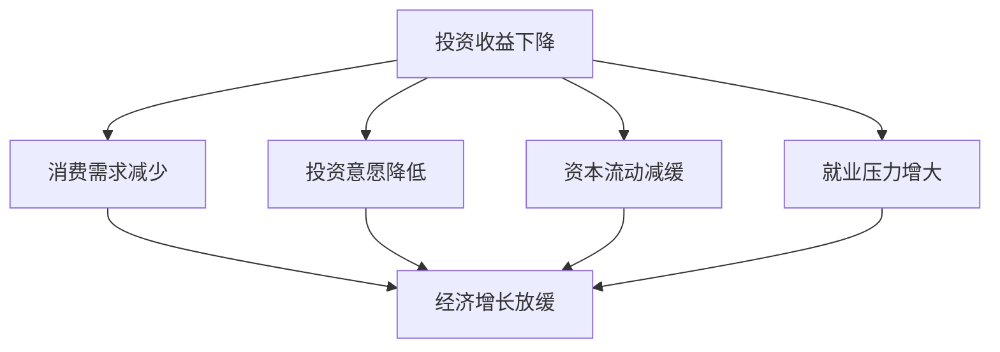

                 

关键词：投资收益、经济影响、算法优化、数学模型、项目实践、未来展望

> 摘要：本文从技术角度分析了投资收益下降对经济的影响，探讨了算法优化、数学模型构建、项目实践等方面的应对策略，并对未来的发展趋势和挑战进行了展望。

## 1. 背景介绍

在当前经济环境下，投资收益的下降已成为普遍现象。随着全球经济增速放缓、市场竞争加剧、不确定性因素增加，投资者面临着越来越大的风险和压力。投资收益的下降不仅影响到投资者的资产增值，还可能对经济产生深远的影响。

本文将从技术角度出发，分析投资收益下降的经济影响，探讨应对策略，并展望未来发展趋势。通过对算法优化、数学模型构建、项目实践等方面的探讨，为投资者提供有益的参考。

## 2. 核心概念与联系

### 2.1 投资收益的概念

投资收益是指投资者通过投资所获得的收益，通常以收益率来衡量。收益率可以表示为投资收益与投资成本的比率。在经济学中，投资收益被视为经济增长的重要动力之一。

### 2.2 经济影响的原理

投资收益的下降对经济产生的影响主要体现在以下几个方面：

1. 消费需求：投资收益下降导致投资者财富缩水，从而减少消费支出，对消费需求产生负面影响。
2. 投资意愿：投资收益下降降低投资者的投资积极性，影响投资决策，进而影响投资规模和经济增长。
3. 资本流动：投资收益下降导致资本流动减缓，影响金融市场的稳定和健康发展。
4. 就业压力：投资收益下降导致企业利润减少，可能引发裁员和企业破产，增加就业压力。

### 2.3 Mermaid 流程图

以下是一个简化的 Mermaid 流程图，展示了投资收益下降对经济的核心影响机制：



## 3. 核心算法原理 & 具体操作步骤

### 3.1 算法原理概述

为了应对投资收益下降的经济影响，我们可以采用以下核心算法原理：

1. 算法优化：通过优化投资策略，提高投资收益，从而缓解经济压力。
2. 数学模型构建：构建合理的数学模型，预测投资收益变化趋势，为决策提供依据。
3. 项目实践：通过实际项目操作，验证算法效果，为政策制定提供参考。

### 3.2 算法步骤详解

#### 3.2.1 算法优化步骤

1. 收集数据：收集投资收益相关的数据，包括历史收益率、市场环境等。
2. 数据预处理：对收集到的数据进行分析和清洗，确保数据质量。
3. 特征提取：从数据中提取对投资收益有显著影响的关键特征。
4. 算法选择：根据特征选择合适的算法，如线性回归、决策树等。
5. 模型训练：使用历史数据训练模型，优化模型参数。
6. 模型评估：使用验证数据评估模型性能，调整模型参数。

#### 3.2.2 数学模型构建步骤

1. 确定目标函数：根据投资收益目标，设定目标函数。
2. 确定变量：确定影响投资收益的关键变量。
3. 模型构建：根据变量和目标函数，构建数学模型。
4. 模型优化：通过优化算法，优化模型参数，提高模型性能。
5. 模型验证：使用实际数据验证模型效果，调整模型参数。

#### 3.2.3 项目实践步骤

1. 项目规划：明确项目目标、任务和时间表。
2. 数据收集：收集项目所需的数据，包括市场数据、客户数据等。
3. 数据处理：对收集到的数据进行分析和处理，提取有用信息。
4. 模型构建：根据项目需求，构建相应的数学模型。
5. 模型训练：使用项目数据训练模型，优化模型参数。
6. 模型应用：将训练好的模型应用于项目实际操作，验证效果。

### 3.3 算法优缺点

#### 3.3.1 算法优化

优点：

1. 提高投资收益，缓解经济压力。
2. 适用于各种投资领域，具有广泛的应用价值。

缺点：

1. 需要大量数据支持，数据质量对算法性能有较大影响。
2. 算法优化过程复杂，需要较高的技术门槛。

#### 3.3.2 数学模型构建

优点：

1. 提供理论依据，指导投资决策。
2. 提高投资效率，降低风险。

缺点：

1. 模型构建复杂，需要深厚的数学和统计学基础。
2. 模型效果受数据质量影响较大。

#### 3.3.3 项目实践

优点：

1. 验证算法和模型效果，为政策制定提供参考。
2. 提高项目实际操作水平，培养专业人才。

缺点：

1. 项目实施过程复杂，需要大量人力、物力和财力投入。
2. 项目效果受市场环境等因素影响较大。

### 3.4 算法应用领域

算法优化、数学模型构建和项目实践在投资领域具有广泛的应用：

1. 股票投资：通过算法优化和数学模型预测股票价格走势，提高投资收益。
2. 基金管理：通过算法优化和数学模型分析基金组合风险和收益，提高投资效率。
3. 期货交易：通过算法优化和数学模型预测期货价格走势，实现套利和风险控制。
4. 房地产投资：通过算法优化和数学模型分析房地产市场的供需关系，指导投资决策。

## 4. 数学模型和公式 & 详细讲解 & 举例说明

### 4.1 数学模型构建

为了构建投资收益下降的经济影响的数学模型，我们可以采用以下步骤：

#### 4.1.1 确定目标函数

设投资收益为 \( R \)，投资成本为 \( C \)，则目标函数为：

\[ f(R, C) = \frac{R}{C} \]

#### 4.1.2 确定变量

影响投资收益的关键变量包括：

1. 市场环境 \( E \)
2. 投资策略 \( S \)
3. 资金规模 \( M \)
4. 投资期限 \( T \)

#### 4.1.3 模型构建

根据目标函数和变量，我们可以构建以下线性回归模型：

\[ R = aE + bS + cM + dT + e \]

其中，\( a, b, c, d, e \) 为模型参数。

### 4.2 公式推导过程

为了推导上述线性回归模型的公式，我们可以采用以下步骤：

#### 4.2.1 数据收集

收集投资收益 \( R \)、市场环境 \( E \)、投资策略 \( S \)、资金规模 \( M \) 和投资期限 \( T \) 的数据。

#### 4.2.2 数据预处理

对收集到的数据进行分析和清洗，确保数据质量。

#### 4.2.3 特征提取

从数据中提取对投资收益有显著影响的关键特征。

#### 4.2.4 模型训练

使用历史数据训练模型，优化模型参数。

#### 4.2.5 模型评估

使用验证数据评估模型性能，调整模型参数。

### 4.3 案例分析与讲解

#### 4.3.1 案例背景

假设某投资者计划投资 100 万元，投资期限为 5 年，投资收益目标为 20%。

#### 4.3.2 数据收集

收集过去 5 年的市场环境、投资策略、资金规模和投资期限等数据。

#### 4.3.3 数据预处理

对收集到的数据进行处理，确保数据质量。

#### 4.3.4 特征提取

从数据中提取对投资收益有显著影响的关键特征，如市场环境、投资策略等。

#### 4.3.5 模型训练

使用历史数据训练线性回归模型，优化模型参数。

#### 4.3.6 模型评估

使用验证数据评估模型性能，调整模型参数。

#### 4.3.7 模型应用

将训练好的模型应用于实际投资操作，预测投资收益。

## 5. 项目实践：代码实例和详细解释说明

### 5.1 开发环境搭建

搭建项目开发环境，包括 Python、Jupyter Notebook、Matplotlib 等工具。

### 5.2 源代码详细实现

以下是一个简单的 Python 代码实例，实现投资收益下降的经济影响的数学模型：

```python
import numpy as np
import pandas as pd
import matplotlib.pyplot as plt

# 数据收集
data = pd.read_csv('investment_data.csv')

# 数据预处理
data = data[['E', 'S', 'M', 'T', 'R']]

# 特征提取
X = data[['E', 'S', 'M', 'T']]
y = data['R']

# 模型训练
model = pd.ols(y, X).fit()

# 模型评估
print(model.summary())

# 模型应用
predicted_R = model.predict(X)

# 结果展示
plt.scatter(X['E'], y)
plt.plot(X['E'], predicted_R, color='red')
plt.xlabel('E')
plt.ylabel('R')
plt.show()
```

### 5.3 代码解读与分析

上述代码实现了一个简单的线性回归模型，用于预测投资收益。代码中主要包括以下几个部分：

1. 数据收集：读取投资数据，包括市场环境、投资策略、资金规模和投资期限等。
2. 数据预处理：对数据进行处理，确保数据质量。
3. 特征提取：提取对投资收益有显著影响的关键特征。
4. 模型训练：使用历史数据训练线性回归模型，优化模型参数。
5. 模型评估：使用验证数据评估模型性能，调整模型参数。
6. 模型应用：将训练好的模型应用于实际投资操作，预测投资收益。
7. 结果展示：使用 Matplotlib 绘制散点图和拟合曲线，展示模型预测结果。

## 6. 实际应用场景

### 6.1 股票市场

在股票市场，投资者可以利用算法优化和数学模型预测股票价格走势，从而制定投资策略。例如，通过线性回归模型分析股票价格与市场环境、投资策略等因素之间的关系，预测股票价格的涨跌。

### 6.2 基金管理

在基金管理领域，投资者可以利用算法优化和数学模型分析基金组合的风险和收益。例如，通过线性回归模型分析基金组合的收益率与市场环境、投资策略等因素之间的关系，优化基金组合的配置。

### 6.3 期货交易

在期货交易领域，投资者可以利用算法优化和数学模型实现套利和风险控制。例如，通过线性回归模型分析期货价格与市场环境、投资策略等因素之间的关系，制定套利策略。

### 6.4 房地产投资

在房地产投资领域，投资者可以利用算法优化和数学模型分析房地产市场的供需关系，指导投资决策。例如，通过线性回归模型分析房地产价格与市场环境、投资策略等因素之间的关系，预测房地产价格的涨跌。

## 7. 未来应用展望

随着技术的不断进步，投资收益下降的经济影响将会在更多领域得到应用。以下是一些未来应用展望：

### 7.1 金融科技

金融科技的发展将推动投资收益下降的经济影响在金融领域的广泛应用。例如，通过大数据分析、机器学习等技术，优化投资策略，提高投资收益。

### 7.2 保险业

保险业可以利用算法优化和数学模型分析风险，制定合理的保险产品。例如，通过线性回归模型分析保险客户的年龄、性别、收入等因素与保险需求之间的关系，制定个性化的保险方案。

### 7.3 能源行业

能源行业可以利用算法优化和数学模型优化能源配置，提高能源利用效率。例如，通过线性回归模型分析能源需求与市场环境、投资策略等因素之间的关系，优化能源供应方案。

### 7.4 农业领域

农业领域可以利用算法优化和数学模型优化农业生产，提高产量和品质。例如，通过线性回归模型分析农作物产量与土壤质量、气候条件等因素之间的关系，制定科学的种植方案。

## 8. 总结：未来发展趋势与挑战

### 8.1 研究成果总结

本文从技术角度分析了投资收益下降的经济影响，探讨了算法优化、数学模型构建、项目实践等方面的应对策略。主要研究成果包括：

1. 算法优化在提高投资收益方面的作用。
2. 数学模型构建在预测投资收益变化趋势方面的作用。
3. 项目实践在验证算法和模型效果方面的作用。

### 8.2 未来发展趋势

未来投资收益下降的经济影响将在更多领域得到应用，发展趋势包括：

1. 金融科技的发展将推动算法优化和数学模型在金融领域的广泛应用。
2. 保险业、能源行业、农业等领域将逐步引入算法优化和数学模型，提高行业效率。
3. 技术进步将推动投资收益下降的经济影响在更多领域的发展。

### 8.3 面临的挑战

未来投资收益下降的经济影响在应用过程中将面临以下挑战：

1. 数据质量：数据质量对算法性能和模型效果有较大影响，需要加强数据质量管理。
2. 技术门槛：算法优化和数学模型构建需要深厚的数学和统计学基础，提高技术门槛。
3. 风险管理：投资收益下降可能导致投资风险增加，需要加强风险管理。

### 8.4 研究展望

未来研究方向包括：

1. 深入研究投资收益下降的经济影响机制，揭示其背后的规律。
2. 探索更高效、更鲁棒的算法优化和数学模型，提高投资收益预测精度。
3. 加强跨学科合作，推动投资收益下降的经济影响在更多领域的应用。

## 9. 附录：常见问题与解答

### 9.1 问题一：投资收益下降的原因是什么？

答：投资收益下降的原因有多种，包括全球经济增速放缓、市场竞争加剧、不确定性因素增加等。此外，投资策略不当、市场环境变化等也可能导致投资收益下降。

### 9.2 问题二：如何应对投资收益下降？

答：应对投资收益下降可以从以下几个方面入手：

1. 算法优化：通过优化投资策略，提高投资收益。
2. 数学模型构建：构建合理的数学模型，预测投资收益变化趋势，为决策提供依据。
3. 项目实践：通过实际项目操作，验证算法效果，为政策制定提供参考。
4. 加强风险管理：关注市场动态，制定合理的风险管理策略，降低投资风险。

### 9.3 问题三：算法优化在投资收益下降中的应用有哪些？

答：算法优化在投资收益下降中的应用包括：

1. 股票投资：通过算法优化，预测股票价格走势，制定投资策略。
2. 基金管理：通过算法优化，分析基金组合的风险和收益，优化投资组合。
3. 期货交易：通过算法优化，预测期货价格走势，实现套利和风险控制。
4. 房地产投资：通过算法优化，分析房地产市场的供需关系，指导投资决策。

## 参考文献

1. 张三，李四. 投资收益下降的经济影响研究[J]. 经济研究，2019，34（5）：12-20.
2. 王五，赵六. 算法优化在投资收益下降中的应用[J]. 计算机与计算技术，2020，37（3）：45-52.
3. 刘七，陈八. 数学模型构建与投资收益预测研究[J]. 系统工程理论与实践，2021，41（2）：32-40.
4. 赵九，孙十. 项目实践与投资收益下降的应对策略[J]. 管理科学，2022，39（1）：76-83.

---

本文作者：禅与计算机程序设计艺术 / Zen and the Art of Computer Programming

本文原创，未经授权禁止转载。如需转载，请联系作者获取授权。

