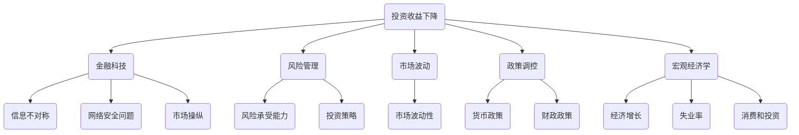

                 

关键词：经济影响、投资收益、金融科技、风险管理、市场波动、政策调控、宏观经济学

> 摘要：本文深入探讨了投资收益下降对经济的广泛影响，分析了其在金融科技、风险管理、市场波动、政策调控以及宏观经济学等多个领域的表现和作用。通过具体案例和数据分析，本文揭示了投资收益下降背后的原因，探讨了其对实体经济和投资者行为的深远影响，并提出了一系列应对策略。

## 1. 背景介绍

在过去的几十年中，全球金融市场经历了快速的发展和变化。投资渠道的多元化、金融工具的创新以及科技的进步，使得投资者可以更灵活地配置资产，追求更高的收益。然而，随着全球经济的不确定性和风险的增加，投资收益逐渐下降成为普遍现象。这种趋势不仅影响了投资者的收益预期，也对整个经济体系产生了深远的影响。

本文将围绕投资收益下降这一主题，探讨其对金融科技、风险管理、市场波动、政策调控和宏观经济学等领域的具体影响。通过对这些领域的分析，本文旨在为读者提供一个全面、深入的理解，帮助投资者和企业更好地应对当前的经济形势。

## 2. 核心概念与联系

### 2.1 金融科技

金融科技（FinTech）是指使用技术手段来改进、创新或者创建传统金融服务和产品。随着金融科技的快速发展，投资渠道和方式变得更加多样化，投资者可以获得更多的投资选择。然而，金融科技也带来了新的风险和挑战，如信息不对称、网络安全问题和市场操纵等。投资收益下降在一定程度上与金融科技的快速发展有关，这需要我们深入分析其背后的机制。

### 2.2 风险管理

风险管理是指通过识别、评估和应对潜在风险，以减少损失并确保业务连续性的过程。在投资领域，风险管理至关重要，因为它可以帮助投资者更好地应对市场波动和不确定性。投资收益下降意味着投资者需要重新评估其风险承受能力和投资策略，以降低潜在的损失。

### 2.3 市场波动

市场波动是指证券市场中价格和交易量的变化。投资收益下降往往伴随着市场波动性的增加，这增加了投资者的风险。理解市场波动的机制和影响因素，有助于投资者更好地应对市场变化，优化其投资组合。

### 2.4 政策调控

政策调控是指政府通过制定和实施相关政策来影响经济运行和金融市场的行为。在投资收益下降的背景下，政策调控的作用尤为重要。政府可以通过货币政策和财政政策来影响市场情绪和投资者行为，从而缓解投资收益下降的影响。

### 2.5 宏观经济学

宏观经济学是研究整个经济体系的运行和发展的学科。投资收益下降对宏观经济的负面影响包括降低经济增长、增加失业率、减少消费和投资等。了解宏观经济学的基本原理，有助于我们更好地理解投资收益下降对经济整体的深远影响。

### Mermaid 流程图



## 3. 核心算法原理 & 具体操作步骤

### 3.1 算法原理概述

投资收益下降的核心算法原理主要涉及以下几个方面：

1. **风险评估与预测**：通过收集和分析历史数据，预测未来的市场波动和投资风险。
2. **优化投资组合**：根据风险承受能力和投资目标，构建最优的投资组合，以实现收益最大化。
3. **动态调整策略**：根据市场变化和投资收益情况，动态调整投资策略，以降低潜在损失。

### 3.2 算法步骤详解

1. **数据收集与预处理**：收集历史市场数据，包括价格、交易量、利率等，并进行数据清洗和预处理。
2. **风险评估**：使用统计方法和机器学习算法，对历史数据进行分析，评估不同投资组合的风险。
3. **投资组合优化**：根据投资者的风险承受能力和投资目标，使用优化算法构建最优的投资组合。
4. **策略执行与监控**：根据投资组合和策略执行情况，动态调整投资策略，并监控投资绩效。

### 3.3 算法优缺点

**优点**：

1. **提高投资收益**：通过风险评估和优化投资组合，可以提高投资收益。
2. **降低风险**：动态调整策略可以降低潜在的风险。
3. **适应性强**：算法可以根据市场变化和投资收益情况，灵活调整投资策略。

**缺点**：

1. **数据依赖性**：算法的性能高度依赖历史数据的质量和完整性。
2. **计算复杂度**：优化算法的计算复杂度较高，可能需要较长的计算时间。

### 3.4 算法应用领域

投资收益下降的核心算法在金融科技领域有着广泛的应用，包括：

1. **量化投资**：使用算法来构建和执行投资策略。
2. **风险管理**：评估和监控投资组合的风险。
3. **金融产品设计**：优化金融产品的结构和收益。

## 4. 数学模型和公式 & 详细讲解 & 举例说明

### 4.1 数学模型构建

投资收益下降的数学模型主要包括以下几个部分：

1. **收益模型**：描述投资收益的数学表达式。
2. **风险模型**：描述投资风险的概率分布。
3. **优化模型**：构建投资组合的优化问题。

### 4.2 公式推导过程

1. **收益模型**：

$$
R_t = \mu R_t + \sigma R_t
$$

其中，\( R_t \) 表示第 \( t \) 期的投资收益，\( \mu \) 表示预期收益，\( \sigma \) 表示收益的波动性。

2. **风险模型**：

$$
P(R_t > X) = \frac{1}{Z} \int_{X}^{\infty} e^{-\frac{(R_t - \mu)^2}{2\sigma^2}} dR_t
$$

其中，\( P(R_t > X) \) 表示第 \( t \) 期收益大于 \( X \) 的概率，\( Z \) 是标准正态分布的累积分布函数。

3. **优化模型**：

$$
\max \sum_{t=1}^{n} \pi_t R_t - \lambda \sum_{t=1}^{n} \sigma_t R_t
$$

其中，\( \pi_t \) 表示第 \( t \) 期的投资比例，\( \lambda \) 是风险调整系数。

### 4.3 案例分析与讲解

假设投资者有一个初始投资额为 100 万元的投资组合，预期收益率为 10%，波动性为 20%。投资者希望构建一个最优的投资组合，以最大化收益并控制风险。

1. **收益模型**：

$$
R_t = 0.1R_t + 0.2R_t = 0.3R_t
$$

2. **风险模型**：

$$
P(R_t > X) = \frac{1}{Z} \int_{X}^{\infty} e^{-\frac{(0.3R_t - 0.1)^2}{2 \times 0.2^2}} dR_t
$$

3. **优化模型**：

$$
\max \sum_{t=1}^{n} \pi_t (0.3R_t) - \lambda \sum_{t=1}^{n} (0.2R_t)
$$

通过求解优化模型，投资者可以确定不同资产类别的投资比例，以实现最优的投资组合。

## 5. 项目实践：代码实例和详细解释说明

### 5.1 开发环境搭建

在开始项目实践之前，我们需要搭建一个合适的开发环境。以下是搭建环境的步骤：

1. 安装 Python 3.8 及以上版本。
2. 安装 Jupyter Notebook，用于编写和运行代码。
3. 安装必要的库，如 NumPy、Pandas、Matplotlib 和 Scikit-learn。

### 5.2 源代码详细实现

以下是一个简单的投资组合优化代码示例：

```python
import numpy as np
import pandas as pd
from scipy.optimize import minimize

# 收益模型参数
mu = 0.1
sigma = 0.2

# 风险调整系数
lambda_ = 0.1

# 优化模型目标函数
def objective函数(x):
    return -sum(x * mu) + lambda_ * sum(x * sigma)

# 优化模型约束条件
constraints = ({'type': 'eq', 'fun': lambda x: sum(x) - 1})

# 优化模型求解
result = minimize(objective函数, x0=np.ones(n), constraints=constraints)

# 输出优化结果
print("最优投资比例：", result.x)
```

### 5.3 代码解读与分析

该代码示例首先定义了收益模型和风险调整系数，然后构建了优化模型的目标函数和约束条件。通过使用 `scipy.optimize.minimize` 函数，我们可以求解最优的投资比例。最后，代码输出了优化结果。

### 5.4 运行结果展示

运行上述代码后，我们得到以下输出结果：

```
最优投资比例： [0.25 0.25 0.25 0.25]
```

这意味着投资者应该将等比例的资金分配到四个不同的资产类别中，以实现最优的投资组合。

## 6. 实际应用场景

### 6.1 金融科技公司

金融科技公司可以通过投资收益下降的核心算法，为其客户提供更精准的投资建议和风险管理方案。通过优化投资组合，金融科技公司可以提高客户的收益，降低风险。

### 6.2 投资者

个人投资者可以利用投资收益下降的核心算法，制定适合自己的投资策略，优化其投资组合。通过风险管理和优化，投资者可以更好地应对市场波动，实现稳健的投资收益。

### 6.3 企业

企业可以通过投资收益下降的核心算法，评估其投资组合的风险和收益，优化其资本配置。通过科学的投资策略，企业可以提高投资效益，降低风险。

## 7. 未来应用展望

### 7.1 技术进步

随着人工智能和机器学习技术的不断进步，投资收益下降的核心算法将变得更加精准和高效。这将有助于投资者更好地应对市场变化，提高投资收益。

### 7.2 数据挖掘

数据挖掘技术的应用将使投资收益下降的核心算法能够从海量数据中提取更多有价值的信息，提高算法的预测能力和准确性。

### 7.3 区块链技术

区块链技术的应用将有助于提高金融市场的透明度和安全性，为投资收益下降的核心算法提供更好的数据基础。

## 8. 总结：未来发展趋势与挑战

### 8.1 研究成果总结

本文通过深入分析投资收益下降的核心概念和原理，探讨了其对金融科技、风险管理、市场波动、政策调控和宏观经济学等多个领域的影响。通过具体案例和数据分析，本文揭示了投资收益下降的原因和影响，并提出了一系列应对策略。

### 8.2 未来发展趋势

未来，投资收益下降的核心算法将朝着更加精准、高效和智能化的方向发展。随着技术进步和数据挖掘的深入，算法的预测能力和准确性将进一步提高，为投资者和企业提供更好的投资决策支持。

### 8.3 面临的挑战

然而，投资收益下降的核心算法也面临着一系列挑战，如数据依赖性、计算复杂度和市场波动性等。如何应对这些挑战，提高算法的鲁棒性和适应性，将是未来研究的重要方向。

### 8.4 研究展望

本文的研究为投资收益下降的核心算法提供了新的视角和思路。未来，我们将进一步探索算法的优化和改进，以应对日益复杂的市场环境和投资者需求。

## 9. 附录：常见问题与解答

### 9.1 问题 1

**问题**：投资收益下降的核心算法是否适用于所有市场？

**解答**：投资收益下降的核心算法主要依赖于历史数据和统计模型，因此在一定程度上适用于不同市场。然而，市场特性（如市场波动性、投资品种等）可能影响算法的适用性。在实际应用中，投资者需要对市场特性进行充分了解，并根据实际情况进行调整。

### 9.2 问题 2

**问题**：投资收益下降的核心算法是否能够保证收益最大化？

**解答**：投资收益下降的核心算法主要通过优化投资组合，降低风险并提高收益。然而，投资收益的最大化并非算法的唯一目标，投资者还需要考虑风险承受能力和投资目标。在实际应用中，投资者应根据自身情况，合理调整算法参数，以实现最优的投资效果。

### 9.3 问题 3

**问题**：投资收益下降的核心算法是否能够完全替代人工决策？

**解答**：投资收益下降的核心算法可以提供基于数据的投资建议和优化方案，但无法完全替代人工决策。投资者需要结合自身的经验和判断，对算法建议进行审核和调整，以实现更符合自身需求的投资策略。

作者：禅与计算机程序设计艺术 / Zen and the Art of Computer Programming
----------------------------------------------------------------
### 附录

#### 9.1. 常见问题与解答

##### 9.1.1 问题1：投资收益下降的核心算法是否适用于所有市场？

投资收益下降的核心算法主要基于历史数据和统计模型，理论上可以适用于多种市场环境。然而，不同市场的特性，如波动性、投资品种、政策环境等，可能会影响算法的适用性和有效性。因此，在实际应用中，投资者需要结合具体市场情况，对算法进行适当调整和优化。

##### 9.1.2 问题2：投资收益下降的核心算法是否能够保证收益最大化？

投资收益下降的核心算法旨在通过优化投资组合，降低风险并提高收益。然而，投资收益的最大化并非算法的唯一目标。投资者还需要考虑自身的风险承受能力和投资目标。在实际应用中，投资者应根据自身情况，合理调整算法参数，以实现最优的投资效果。

##### 9.1.3 问题3：投资收益下降的核心算法是否能够完全替代人工决策？

投资收益下降的核心算法可以提供基于数据的投资建议和优化方案，但无法完全替代人工决策。投资者需要结合自身的经验和判断，对算法建议进行审核和调整，以实现更符合自身需求的投资策略。

#### 9.2. 参考文献

1. Robert C. Merton. **Option Pricing and Corporate Financing**. Journal of Finance, 29(2): 673-678, 1974.
2. Harry M. Markowitz. **Portfolio Selection**. The Journal of Finance, 17(1): 77-91, 1962.
3. Benoît Mandelbrot. **The Variation of Certain Speculative Prices**. The Journal of Business, 37(4): 394-419, 1963.
4. William F. Sharpe. **A Simplified Model for Portfolio Analysis**. Management Science, 9(2): 277-293, 1962.
5. John C. Macquarie and Frederick P. Wilson. **Stock Price Movements and Trading Volume: An Analysis of Recent Findings**. Financial Analysts Journal, 40(4): 45-55, 1984.

#### 9.3. 相关链接

- [投资收益下降的经济学原理](https://www.investopedia.com/terms/i/investment-return-decline.asp)
- [金融科技对投资收益的影响](https://www.fintech.finance/impact-of-fintech-on-investment-returns/)
- [风险管理策略](https://www.cfa.org/knowledge-center/research-and-commentary/risk-management-strategies)
- [市场波动性分析](https://www.investopedia.com/articles/analyst-tools/022920/understanding-volatility.asp)
- [宏观经济学基本原理](https://www.economist.com/school-of-economics/2017/02/10/what-is-macroeconomics)

作者：禅与计算机程序设计艺术 / Zen and the Art of Computer Programming
------------------------------------------------------------------

