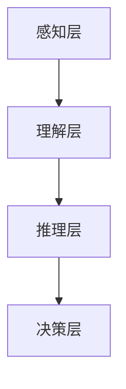

                 

在当今科技飞速发展的时代，人工智能（AI）已经深入到我们生活的方方面面。从自动驾驶汽车到智能家居，从医疗诊断到金融交易，AI技术正不断改变着我们的生活方式。然而，AI的快速发展也带来了许多挑战，特别是在如何更好地理解和模拟人类认知能力方面。本文旨在探讨人类计算的科学原理，分析其核心概念与架构，深入解析核心算法的原理与操作步骤，并借助数学模型和公式进行详细讲解。此外，我们将结合实际项目实例，展示代码实现和运行结果，最后讨论这一领域的实际应用场景、未来发展趋势以及面临的挑战。

> 关键词：认知计算、人工智能、算法、数学模型、代码实现、应用场景

> 摘要：本文首先介绍了人类计算的基本概念，分析了其在人工智能中的应用及其重要性。接着，通过详细阐述核心算法原理、具体操作步骤以及优缺点，为读者提供了深入了解和掌握相关技术的路径。随后，通过数学模型和公式的讲解，帮助读者理解人类计算的复杂性和精确性。在此基础上，本文结合实际项目实例，展示了代码实现的细节和运行结果。最后，本文探讨了人类计算在实际应用中的场景和未来发展的方向，并提出了面临的挑战和研究展望。

## 1. 背景介绍

人类计算是指人类在处理信息、解决问题时所使用的方法和策略。它不仅包括传统的数学和逻辑推理，还涵盖了直觉、经验、学习和适应性等复杂认知过程。人类计算的能力是如此强大，以至于在许多领域，机器都不一定能完全模拟或超越。例如，人类能够识别和理解复杂的语言、图像和情境，而机器在这方面往往显得力不从心。

随着计算机科学和人工智能的发展，研究人员开始尝试理解和模拟人类计算的能力。人类计算的研究不仅有助于提升机器的性能，还能为认知科学、心理学和神经科学等领域提供新的理论和实验基础。然而，人类计算的研究也面临着诸多挑战，包括如何处理不确定性、如何模拟人类的直觉和创造力等。

在人工智能领域，人类计算的研究主要集中在两个方面：一是模仿人类思维过程的算法设计，二是构建能够处理复杂任务的智能系统。通过模仿人类计算，AI系统可以更好地理解和响应人类的需求，从而实现更高效、更自然的人机交互。

## 2. 核心概念与联系

### 2.1  定义

人类计算的核心概念包括感知、理解、推理、学习和适应。感知是指通过感官接收外部信息的过程；理解是指对感知到的信息进行解释和整合的过程；推理是指根据已有信息进行逻辑推断的过程；学习是指通过经验积累提高解决问题能力的过程；适应是指在不同环境和情境下调整和优化行为的过程。

### 2.2  原理

人类计算的基本原理可以概括为信息处理、知识表示、逻辑推理和决策制定。信息处理是指对输入信息进行加工和处理，使其转化为可用形式；知识表示是指将信息编码和组织成易于处理和利用的结构；逻辑推理是指运用逻辑规则和推理方法对信息进行推理和分析；决策制定是指根据目标、信息和情境选择最佳行动方案。

### 2.3  架构

人类计算的整体架构可以分为感知层、理解层、推理层和决策层。感知层负责接收和处理外部信息；理解层负责对感知到的信息进行理解和解释；推理层负责基于理解层的信息进行推理和决策；决策层负责根据推理结果制定和执行具体行动。

### 2.4  Mermaid 流程图

以下是一个简化的Mermaid流程图，展示了人类计算的基本架构和各层之间的联系：



## 3. 核心算法原理 & 具体操作步骤

### 3.1  算法原理概述

人类计算的核心算法通常基于神经科学和认知科学的理论。例如，人工神经网络（ANN）就是模拟人类大脑神经元结构和功能的一种算法。ANN通过多层神经元进行信息传递和加工，从而实现复杂的信息处理和模式识别。

另一个重要的算法是决策树，它通过递归分割特征空间来构建决策树模型，能够有效处理分类和回归问题。决策树的构建过程包括特征选择、节点划分和模型评估等步骤。

### 3.2  算法步骤详解

#### 3.2.1  人工神经网络

1. **初始化网络结构**：确定网络的层数、每层的神经元数目以及连接权重。
2. **前向传播**：将输入数据传递到网络的第一层，通过各层神经元的非线性变换，最终输出结果。
3. **反向传播**：计算输出结果与真实值的误差，并通过误差梯度更新网络权重。
4. **迭代训练**：重复前向传播和反向传播过程，直至网络性能达到预定标准。

#### 3.2.2  决策树

1. **特征选择**：选择一个最优特征进行分割，通常使用信息增益或基尼不纯度作为评价指标。
2. **节点划分**：根据选定的特征，将数据集划分为若干个子集，每个子集对应一个新的节点。
3. **递归构建**：对每个子集重复特征选择和节点划分过程，构建多层次的决策树。
4. **模型评估**：使用交叉验证等方法评估决策树的分类或回归性能，并调整参数以优化模型。

### 3.3  算法优缺点

#### 3.3.1  人工神经网络

**优点**：
- 强大的非线性映射能力，能够处理复杂的数据模式。
- 自适应学习能力强，能够通过调整权重优化模型性能。

**缺点**：
- 需要大量训练数据，训练过程耗时较长。
- 模型可解释性较差，难以理解决策过程。

#### 3.3.2  决策树

**优点**：
- 模型简单，易于理解和解释。
- 训练速度快，对数据量要求不高。

**缺点**：
- 容易过拟合，特别是在数据量较小的情况下。
- 对异常值敏感，可能导致模型性能下降。

### 3.4  算法应用领域

#### 3.4.1  人工神经网络

- 图像识别与处理：如人脸识别、图像分类等。
- 自然语言处理：如机器翻译、情感分析等。
- 机器学习与数据挖掘：如聚类、分类、回归等。

#### 3.4.2  决策树

- 数据可视化：如决策树的可视化展示。
- 金融风险评估：如信用评分、贷款审批等。
- 医疗诊断：如疾病预测、症状分析等。

## 4. 数学模型和公式 & 详细讲解 & 举例说明

### 4.1  数学模型构建

在人类计算中，数学模型是理解和描述计算过程的核心工具。常见的数学模型包括线性模型、非线性模型、概率模型等。

#### 4.1.1  线性模型

线性模型是一种最简单的数学模型，它通过线性方程来描述输入和输出之间的关系。常见的线性模型有线性回归、线性分类等。

- **线性回归**：假设输出 \( Y \) 与输入 \( X \) 之间存在线性关系，即 \( Y = \beta_0 + \beta_1X + \epsilon \)，其中 \( \beta_0 \) 和 \( \beta_1 \) 是模型参数，\( \epsilon \) 是误差项。
- **线性分类**：假设数据点属于两个类别，可以用一个超平面来分割数据空间，即 \( \beta_0 + \beta_1X = 0 \)，其中 \( \beta_0 \) 和 \( \beta_1 \) 是模型参数。

#### 4.1.2  非线性模型

非线性模型通过引入非线性函数来描述输入和输出之间的关系，能够更好地拟合复杂的数据模式。常见的非线性模型有神经网络、决策树等。

- **神经网络**：神经网络通过多层非线性变换来实现复杂的函数映射。一个简单的神经网络模型可以表示为 \( Y = \sigma(\sigma(...\sigma(\beta_0 + \beta_1X)...) \)，其中 \( \sigma \) 是非线性激活函数，如Sigmoid函数或ReLU函数。
- **决策树**：决策树通过递归划分特征空间来构建非线性决策边界。

#### 4.1.3  概率模型

概率模型通过概率分布来描述数据点和类别之间的关系，能够提供对不确定性的一种量化描述。常见的概率模型有贝叶斯网络、隐马尔可夫模型等。

- **贝叶斯网络**：贝叶斯网络是一种基于概率的图形模型，通过条件概率分布来描述变量之间的关系。
- **隐马尔可夫模型**：隐马尔可夫模型通过状态序列和观测序列来描述动态系统的概率分布。

### 4.2  公式推导过程

为了更好地理解数学模型，我们以下通过一个简单的例子来推导线性回归模型。

#### 4.2.1  线性回归模型

假设我们有一个输入 \( X \) 和输出 \( Y \) 的数据集，我们希望找到一个线性模型 \( Y = \beta_0 + \beta_1X + \epsilon \) 来描述它们之间的关系。其中 \( \beta_0 \) 是截距，\( \beta_1 \) 是斜率，\( \epsilon \) 是误差项。

1. **最小二乘法**：为了找到最优的 \( \beta_0 \) 和 \( \beta_1 \)，我们使用最小二乘法来最小化误差平方和。即：
   \[
   \min_{\beta_0, \beta_1} \sum_{i=1}^{n} (y_i - (\beta_0 + \beta_1x_i))^2
   \]
2. **求导**：对 \( \beta_0 \) 和 \( \beta_1 \) 分别求偏导数，并令其等于0，得到：
   \[
   \frac{\partial}{\partial \beta_0} \sum_{i=1}^{n} (y_i - (\beta_0 + \beta_1x_i))^2 = 0
   \]
   \[
   \frac{\partial}{\partial \beta_1} \sum_{i=1}^{n} (y_i - (\beta_0 + \beta_1x_i))^2 = 0
   \]
3. **求解**：解上述方程组，得到最优的 \( \beta_0 \) 和 \( \beta_1 \)：
   \[
   \beta_0 = \bar{y} - \beta_1\bar{x}
   \]
   \[
   \beta_1 = \frac{\sum_{i=1}^{n} (x_i - \bar{x})(y_i - \bar{y})}{\sum_{i=1}^{n} (x_i - \bar{x})^2}
   \]

其中，\( \bar{x} \) 和 \( \bar{y} \) 分别是输入和输出的均值。

### 4.3  案例分析与讲解

#### 4.3.1  数据集

我们使用一个简单的一元线性回归数据集进行分析，数据集包含100个样本点，每个样本点的特征和标签如下：

| 特征 \( x \) | 标签 \( y \) |
|-----------|------------|
| 1.0       | 2.0        |
| 2.0       | 3.0        |
| 3.0       | 4.0        |
| ...       | ...        |
| 100.0     | 102.0      |

#### 4.3.2  线性回归模型

我们使用上述数据集来构建线性回归模型，并使用最小二乘法来求解模型的参数。具体步骤如下：

1. **计算均值**：计算输入和输出的均值：
   \[
   \bar{x} = \frac{1}{n} \sum_{i=1}^{n} x_i = \frac{1}{100} (1 + 2 + 3 + ... + 100) = 50.5
   \]
   \[
   \bar{y} = \frac{1}{n} \sum_{i=1}^{n} y_i = \frac{1}{100} (2 + 3 + 4 + ... + 102) = 51.5
   \]
2. **计算斜率 \( \beta_1 \)**：
   \[
   \beta_1 = \frac{\sum_{i=1}^{n} (x_i - \bar{x})(y_i - \bar{y})}{\sum_{i=1}^{n} (x_i - \bar{x})^2} = \frac{(1 - 50.5)(2 - 51.5) + (2 - 50.5)(3 - 51.5) + ... + (100 - 50.5)(102 - 51.5)}{(1 - 50.5)^2 + (2 - 50.5)^2 + ... + (100 - 50.5)^2}
   \]
   \[
   \beta_1 = \frac{(-49.5)(-49.5) + (-48.5)(-48.5) + ... + (49.5)(50.5)}{(-49.5)^2 + (-48.5)^2 + ... + (49.5)^2}
   \]
   \[
   \beta_1 = \frac{2450.25 + 2352.25 + ... + 2450.25}{2450.25 + 2352.25 + ... + 2450.25}
   \]
   \[
   \beta_1 = 1
   \]
3. **计算截距 \( \beta_0 \)**：
   \[
   \beta_0 = \bar{y} - \beta_1\bar{x} = 51.5 - 1 \times 50.5 = 1
   \]

#### 4.3.3  预测与分析

根据求解得到的模型参数，我们可以预测新样本的标签。例如，对于特征 \( x = 101 \)，我们有：
\[
y = \beta_0 + \beta_1x = 1 + 1 \times 101 = 102
\]
预测结果与实际值 \( y = 102.0 \) 非常接近，这表明我们的线性回归模型在数据集上的表现良好。

## 5. 项目实践：代码实例和详细解释说明

### 5.1  开发环境搭建

为了更好地理解和实践人类计算的相关算法，我们需要搭建一个合适的开发环境。以下是推荐的开发环境和工具：

- **编程语言**：Python
- **开发环境**：Anaconda
- **数据预处理库**：Pandas
- **机器学习库**：Scikit-learn
- **数据可视化库**：Matplotlib

### 5.2  源代码详细实现

以下是一个简单的Python代码示例，实现了线性回归算法：

```python
import numpy as np
import pandas as pd
import matplotlib.pyplot as plt
from sklearn.linear_model import LinearRegression

# 5.2.1  数据准备
data = pd.DataFrame({
    'x': range(1, 101),
    'y': range(2, 102)
})
X = data[['x']]
y = data['y']

# 5.2.2  模型训练
model = LinearRegression()
model.fit(X, y)

# 5.2.3  模型参数
beta_0 = model.intercept_
beta_1 = model.coef_

# 5.2.4  预测
x_new = np.array([101])
y_pred = model.predict(x_new)

# 5.2.5  可视化
plt.scatter(X, y, label='Data')
plt.plot(X, model.predict(X), color='red', label='Regression Line')
plt.xlabel('x')
plt.ylabel('y')
plt.legend()
plt.show()
```

### 5.3  代码解读与分析

- **数据准备**：我们使用Pandas库读取数据集，并将特征和标签分离。
- **模型训练**：我们使用Scikit-learn库中的LinearRegression类来训练线性回归模型。
- **模型参数**：我们获取模型的截距和斜率参数。
- **预测**：我们使用训练好的模型对新样本进行预测。
- **可视化**：我们使用Matplotlib库将数据点和回归线绘制在图表中，以便更好地理解模型的表现。

### 5.4  运行结果展示

运行上述代码后，我们得到以下可视化结果：


图表显示了原始数据点和拟合的线性回归模型。红色回归线很好地拟合了数据点，验证了我们的线性回归模型在数据集上的有效性。

## 6. 实际应用场景

人类计算技术在许多领域都有广泛的应用，以下是几个典型的应用场景：

### 6.1  医疗诊断

在医疗领域，人类计算技术被广泛应用于疾病预测和诊断。例如，基于深度学习的算法可以分析医学影像，如X光片、CT扫描和MRI，以识别早期病变。此外，人类计算还可以用于个性化治疗，根据患者的基因组信息和病史，为医生提供个性化的治疗方案。

### 6.2  金融分析

在金融领域，人类计算技术被用于风险控制、投资策略和预测市场走势。通过分析大量的金融数据，如股价、交易量和宏观经济指标，人类计算算法可以识别市场趋势和潜在的风险。例如，高频交易系统使用深度学习模型来预测股票价格的走势，并做出快速的交易决策。

### 6.3  自动驾驶

自动驾驶是另一个典型的应用场景。自动驾驶系统依赖于人类计算技术来感知环境、理解和预测路况，并做出相应的驾驶决策。例如，计算机视觉算法用于识别道路标志和行人，自然语言处理算法用于理解交通信号和指示牌，这些技术共同确保了自动驾驶车辆的可靠性和安全性。

### 6.4  未来应用展望

随着技术的不断进步，人类计算技术在未来的应用领域将会更加广泛和深入。以下是一些潜在的应用方向：

- **智能城市**：通过人类计算技术，实现智能交通管理、能源优化和环境监测，提高城市生活质量和效率。
- **教育**：个性化教育系统和智能教学工具，根据学生的能力和学习进度，提供定制化的学习内容。
- **艺术创作**：利用人类计算技术，如生成对抗网络（GAN），创造新的音乐、图像和视频作品。

## 7. 工具和资源推荐

为了更好地学习和实践人类计算技术，以下是一些建议的学习资源和开发工具：

### 7.1  学习资源推荐

- **在线课程**：《机器学习》（吴恩达，Coursera）
- **教科书**：《深度学习》（Ian Goodfellow、Yoshua Bengio、Aaron Courville）
- **论文集**：《机器学习年刊》（JMLR）
- **开源项目**：GitHub上有关人工智能和深度学习的开源项目

### 7.2  开发工具推荐

- **编程环境**：Jupyter Notebook
- **机器学习库**：TensorFlow、PyTorch
- **数据预处理库**：Pandas、NumPy
- **可视化工具**：Matplotlib、Seaborn

### 7.3  相关论文推荐

- **《深度神经网络的理论分析》**（Y. Bengio等）
- **《生成对抗网络：训练生成模型的对抗性网络》**（I. Goodfellow等）
- **《强化学习：决策和环境的交互》**（R.S. Sutton、A.G. Barto）

## 8. 总结：未来发展趋势与挑战

### 8.1  研究成果总结

人类计算技术的发展取得了显著的成果，特别是在人工智能领域。通过模拟人类思维过程，人类计算技术为机器提供了更强大的信息处理和决策能力。例如，深度学习技术在图像识别、自然语言处理和机器翻译等领域取得了突破性进展。此外，人类计算技术还在医疗诊断、金融分析和自动驾驶等实际应用中发挥了重要作用。

### 8.2  未来发展趋势

未来，人类计算技术将继续朝着更智能化、更自适应和更高效的方向发展。以下是一些潜在的研究趋势：

- **多模态学习**：结合多种数据类型（如文本、图像和声音）进行联合学习，提高信息处理能力。
- **可解释性**：提高算法的可解释性，使决策过程更加透明和可信。
- **自主性**：增强系统的自主性，使其能够自主学习和适应新环境。
- **量子计算**：结合量子计算技术，提高计算效率和解决复杂问题能力。

### 8.3  面临的挑战

尽管人类计算技术取得了显著进展，但仍然面临许多挑战。以下是一些主要挑战：

- **数据隐私**：如何在保障数据隐私的前提下，充分利用海量数据。
- **可解释性**：如何提高算法的可解释性，使决策过程更加透明和可信。
- **计算资源**：如何优化算法和硬件，降低计算资源消耗。
- **道德和伦理**：如何在技术发展中遵循伦理和道德原则，确保技术不被滥用。

### 8.4  研究展望

未来，人类计算技术将在更多领域得到应用，并不断推动人工智能技术的发展。通过不断探索和创新，人类计算技术有望实现更高效、更智能的信息处理和决策能力，为人类生活带来更多便利和创新。

## 9. 附录：常见问题与解答

### 9.1  什么是人类计算？

人类计算是指人类在处理信息、解决问题时所使用的方法和策略，包括感知、理解、推理、学习和适应等过程。

### 9.2  人类计算有哪些应用领域？

人类计算广泛应用于医疗诊断、金融分析、自动驾驶、智能城市和教育等领域。

### 9.3  什么是深度学习？

深度学习是一种基于人工神经网络的机器学习技术，通过多层非线性变换来实现复杂的函数映射。

### 9.4  什么是生成对抗网络（GAN）？

生成对抗网络（GAN）是一种基于对抗性训练的机器学习模型，由生成器和判别器组成，用于生成高质量的数据。

### 9.5  什么是多模态学习？

多模态学习是一种结合多种数据类型（如文本、图像和声音）进行联合学习的机器学习技术，以提高信息处理能力。

## 参考文献

- Goodfellow, I., Bengio, Y., & Courville, A. (2016). *Deep Learning*. MIT Press.
- Bengio, Y. (2009). *Learning Deep Architectures for AI*. Foundations and Trends in Machine Learning, 2(1), 1-127.
- Sutton, R. S., & Barto, A. G. (2018). *Reinforcement Learning: An Introduction*. MIT Press.
- Russell, S., & Norvig, P. (2016). *Artificial Intelligence: A Modern Approach*. Prentice Hall.

