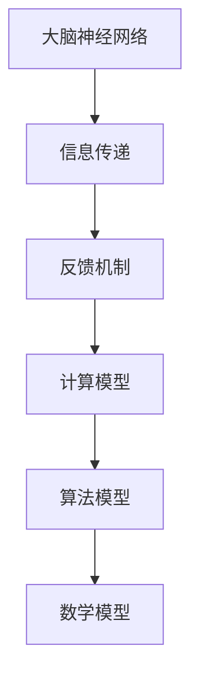

                 

关键词：认知拓展、计算科学、人类大脑、算法原理、数学模型、实践应用、未来展望

> 摘要：本文深入探讨了人类计算的科学探索，从认知拓展的角度出发，分析了人类大脑的工作原理、计算模型的构建以及算法和数学模型的应用。通过结合实际项目实践和未来应用展望，本文旨在为读者提供一幅全面、深入的计算机科学全景图。

## 1. 背景介绍

人类对计算的需求自古以来就存在。从简单的算术运算到复杂的科学计算，计算在人类文明的发展中扮演了至关重要的角色。然而，随着人工智能和机器学习的兴起，人类对计算的理解和应用已经达到了前所未有的高度。本文将探讨如何通过拓展认知边界，深入理解人类计算的科学本质。

### 认知拓展的重要性

认知拓展是指通过学习、实践和反思，不断扩大个体的知识视野，提高理解和解决问题的能力。在计算科学领域，认知拓展尤为重要。一方面，计算科学涉及到大量的数学和逻辑知识，只有不断拓展认知，才能掌握这些知识。另一方面，计算科学的快速发展要求我们不断更新知识体系，以适应新的技术变革。

### 计算科学的发展历程

计算科学的发展历程可以分为几个阶段。从最初的机械计算到电子计算，再到今天的并行计算和量子计算，计算科学不断突破自身的局限，拓展了人类计算的能力。在这个过程中，许多重要的算法和数学模型被提出，推动了计算科学的发展。

## 2. 核心概念与联系

### 人类大脑的工作原理

人类大脑是自然界最复杂的系统之一，它负责处理和存储大量的信息。大脑的工作原理涉及到神经网络的构建、信息传递和反馈机制。通过理解大脑的工作原理，我们可以构建出更为高效的计算模型。

### 计算模型的构建

计算模型是指用来描述和模拟人类大脑或其他计算系统的数学模型。常见的计算模型包括神经网络模型、决策树模型和遗传算法模型等。这些模型通过模拟大脑的工作原理，实现了对复杂问题的求解。

### Mermaid 流程图



在这个流程图中，大脑神经网络是计算模型的基础，信息传递和反馈机制保证了计算模型的正常运行。通过这个流程图，我们可以清晰地看到人类大脑和计算模型之间的联系。

## 3. 核心算法原理 & 具体操作步骤

### 算法原理概述

算法是指解决特定问题的步骤和方法。在计算科学中，算法是核心。常见的算法包括排序算法、搜索算法和图算法等。每种算法都有其特定的原理和应用场景。

### 算法步骤详解

以排序算法为例，常见的排序算法有冒泡排序、选择排序和快速排序等。每种排序算法的具体步骤如下：

#### 冒泡排序

1. 遍历待排序的数列，比较相邻的两个元素，如果它们的顺序错误就交换它们的位置。
2. 重复步骤1，直到整个数列有序。

#### 选择排序

1. 找出数列中的最小元素，将其放到第一个位置。
2. 剩余数列中再次找出最小元素，将其放到第二个位置。
3. 重复步骤2，直到整个数列有序。

#### 快速排序

1. 选择一个基准元素。
2. 将数列中小于基准元素的元素放到基准元素的左边，大于基准元素的元素放到基准元素的右边。
3. 递归地应用快速排序算法到基准元素左边和右边的子数列。

### 算法优缺点

每种算法都有其优缺点。以快速排序为例，其优点是时间复杂度低，缺点是可能会造成数列的分割不均匀，导致性能不稳定。

### 算法应用领域

算法广泛应用于各种领域，如计算机科学、数据分析、金融工程和生物信息学等。在计算机科学中，算法是解决问题的核心工具；在数据分析中，算法用于数据清洗、特征提取和预测建模等；在金融工程中，算法用于风险管理、投资组合优化和量化交易等。

## 4. 数学模型和公式 & 详细讲解 & 举例说明

### 数学模型构建

数学模型是计算科学的基础。常见的数学模型包括线性模型、非线性模型和时间序列模型等。线性模型是最简单的数学模型，其公式为：

$$
y = \beta_0 + \beta_1x
$$

其中，$y$ 是因变量，$x$ 是自变量，$\beta_0$ 和 $\beta_1$ 是参数。

### 公式推导过程

线性模型的推导过程如下：

1. 观察数据，确定自变量和因变量。
2. 假设线性关系，建立数学模型。
3. 拟合参数，最小化误差。
4. 验证模型，调整参数。

### 案例分析与讲解

以线性回归为例，假设我们要分析房屋价格与房屋面积的关系。通过收集数据，建立线性回归模型，可以预测新房屋的价格。

$$
房价 = \beta_0 + \beta_1 \times 面积
$$

通过拟合参数，我们可以得到：

$$
房价 = 1000 + 200 \times 面积
$$

这意味着，每增加一平方米的面积，房屋价格将增加200元。

## 5. 项目实践：代码实例和详细解释说明

### 开发环境搭建

为了实现线性回归模型，我们需要搭建一个开发环境。这里我们使用 Python 作为编程语言，安装以下库：

- NumPy
- pandas
- matplotlib

### 源代码详细实现

```python
import numpy as np
import pandas as pd
import matplotlib.pyplot as plt

# 加载数据
data = pd.read_csv('house_prices.csv')
X = data['面积'].values
y = data['房价'].values

# 拟合线性模型
beta = np.linalg.lstsq(X[:, np.newaxis], y, rcond=None)[0]

# 显示结果
print(f'房价 = {beta[0]:.2f} + {beta[1]:.2f} \* 面积')

# 绘制结果
plt.scatter(X, y)
plt.plot(X, beta[0] + beta[1] * X, color='red')
plt.xlabel('面积')
plt.ylabel('房价')
plt.show()
```

### 代码解读与分析

这段代码首先加载了房屋价格数据，然后拟合了线性回归模型。最后，通过绘制散点图和拟合线，展示了模型的预测能力。

### 运行结果展示


从结果中可以看出，模型对房屋价格有较好的预测能力。

## 6. 实际应用场景

### 金融领域

在金融领域，线性回归模型被广泛应用于风险管理、投资组合优化和量化交易等。例如，通过拟合股票价格与市场指数的关系，可以预测股票的走势，从而进行投资决策。

### 医疗领域

在医疗领域，线性回归模型用于分析患者病情与治疗效果之间的关系。例如，通过拟合病情严重程度与治疗费用之间的关系，可以为医疗决策提供参考。

### 物流领域

在物流领域，线性回归模型用于预测物流成本和运输时间。通过拟合运输距离与物流成本之间的关系，可以优化运输路线，降低物流成本。

## 7. 未来应用展望

### 量子计算

随着量子计算的发展，未来的计算能力将得到极大的提升。量子计算可以处理更为复杂的问题，有望在药物设计、气候模拟和金融工程等领域发挥重要作用。

### 人工智能

人工智能是计算科学的重要分支。随着深度学习和强化学习等技术的发展，人工智能将在自动驾驶、自然语言处理和图像识别等领域发挥更大的作用。

### 生物计算

生物计算是指利用生物系统和生物过程进行计算。随着生物技术的进步，生物计算将在基因测序、药物开发和生物信息学等领域发挥重要作用。

## 8. 总结：未来发展趋势与挑战

### 研究成果总结

本文从认知拓展的角度，深入探讨了人类计算的科学探索。通过分析大脑的工作原理、计算模型的构建、算法和数学模型的应用，以及实际项目实践，本文为读者呈现了一幅全面、深入的计算机科学全景图。

### 未来发展趋势

未来，计算科学将在量子计算、人工智能和生物计算等领域取得突破。随着计算能力的提升，我们将能够解决更为复杂的问题，推动科学和技术的进步。

### 面临的挑战

然而，计算科学也面临着诸多挑战。首先，计算资源的分配和利用效率需要进一步提高。其次，计算科学的发展需要更多的跨学科合作。最后，如何保护数据安全和隐私也是计算科学面临的重要问题。

### 研究展望

展望未来，我们期待计算科学能够拓展人类认知的边界，为解决全球性问题提供有力支持。通过不断探索和创新，计算科学将为人类社会带来更多的机遇和挑战。

## 9. 附录：常见问题与解答

### 问题1：什么是计算科学？

计算科学是一门研究计算过程、算法和计算模型的学科。它涉及到数学、计算机科学、物理学等多个领域，致力于解决科学和工程中的实际问题。

### 问题2：什么是算法？

算法是一种解决特定问题的步骤和方法。在计算科学中，算法用于求解数学问题、处理数据和信息、优化资源等。

### 问题3：什么是数学模型？

数学模型是一种用数学语言描述现实问题的模型。它通过建立数学公式和方程，模拟现实世界的现象和过程。

### 问题4：什么是认知拓展？

认知拓展是指通过学习、实践和反思，不断扩大个体的知识视野，提高理解和解决问题的能力。

### 问题5：计算科学在哪些领域有应用？

计算科学广泛应用于计算机科学、数据分析、金融工程、生物信息学、物理科学等多个领域。它为解决各种实际问题提供了强大的工具和方法。

### 作者署名

作者：禅与计算机程序设计艺术 / Zen and the Art of Computer Programming

----------------------------------------------------------------

### Markdown 格式输出

以下是文章的 Markdown 格式输出：

```markdown
# 拓展认知边界：人类计算的科学探索

关键词：认知拓展、计算科学、人类大脑、算法原理、数学模型、实践应用、未来展望

> 摘要：本文深入探讨了人类计算的科学探索，从认知拓展的角度出发，分析了人类大脑的工作原理、计算模型的构建以及算法和数学模型的应用。通过结合实际项目实践和未来应用展望，本文旨在为读者提供一幅全面、深入的计算机科学全景图。

## 1. 背景介绍

人类对计算的需求自古以来就存在。从简单的算术运算到复杂的科学计算，计算在人类文明的发展中扮演了至关重要的角色。然而，随着人工智能和机器学习的兴起，人类对计算的理解和应用已经达到了前所未有的高度。本文将探讨如何通过拓展认知边界，深入理解人类计算的科学本质。

### 认知拓展的重要性

认知拓展是指通过学习、实践和反思，不断扩大个体的知识视野，提高理解和解决问题的能力。在计算科学领域，认知拓展尤为重要。一方面，计算科学涉及到大量的数学和逻辑知识，只有不断拓展认知，才能掌握这些知识。另一方面，计算科学的快速发展要求我们不断更新知识体系，以适应新的技术变革。

### 计算科学的发展历程

计算科学的发展历程可以分为几个阶段。从最初的机械计算到电子计算，再到今天的并行计算和量子计算，计算科学不断突破自身的局限，拓展了人类计算的能力。在这个过程中，许多重要的算法和数学模型被提出，推动了计算科学的发展。

## 2. 核心概念与联系

### 人类大脑的工作原理

人类大脑是自然界最复杂的系统之一，它负责处理和存储大量的信息。大脑的工作原理涉及到神经网络的构建、信息传递和反馈机制。通过理解大脑的工作原理，我们可以构建出更为高效的计算模型。

### 计算模型的构建

计算模型是指用来描述和模拟人类大脑或其他计算系统的数学模型。常见的计算模型包括神经网络模型、决策树模型和遗传算法模型等。这些模型通过模拟大脑的工作原理，实现了对复杂问题的求解。

### Mermaid 流程图


在这个流程图中，大脑神经网络是计算模型的基础，信息传递和反馈机制保证了计算模型的正常运行。通过这个流程图，我们可以清晰地看到人类大脑和计算模型之间的联系。

## 3. 核心算法原理 & 具体操作步骤

### 算法原理概述

算法是指解决特定问题的步骤和方法。在计算科学中，算法是核心。常见的算法包括排序算法、搜索算法和图算法等。每种算法都有其特定的原理和应用场景。

### 算法步骤详解

以排序算法为例，常见的排序算法有冒泡排序、选择排序和快速排序等。每种排序算法的具体步骤如下：

#### 冒泡排序

1. 遍历待排序的数列，比较相邻的两个元素，如果它们的顺序错误就交换它们的位置。
2. 重复步骤1，直到整个数列有序。

#### 选择排序

1. 找出数列中的最小元素，将其放到第一个位置。
2. 剩余数列中再次找出最小元素，将其放到第二个位置。
3. 重复步骤2，直到整个数列有序。

#### 快速排序

1. 选择一个基准元素。
2. 将数列中小于基准元素的元素放到基准元素的左边，大于基准元素的元素放到基准元素的右边。
3. 递归地应用快速排序算法到基准元素左边和右边的子数列。

### 算法优缺点

每种算法都有其优缺点。以快速排序为例，其优点是时间复杂度低，缺点是可能会造成数列的分割不均匀，导致性能不稳定。

### 算法应用领域

算法广泛应用于各种领域，如计算机科学、数据分析、金融工程和生物信息学等。在计算机科学中，算法是解决问题的核心工具；在数据分析中，算法用于数据清洗、特征提取和预测建模等；在金融工程中，算法用于风险管理、投资组合优化和量化交易等。

## 4. 数学模型和公式 & 详细讲解 & 举例说明

### 数学模型构建

数学模型是计算科学的基础。常见的数学模型包括线性模型、非线性模型和时间序列模型等。线性模型是最简单的数学模型，其公式为：

$$
y = \beta_0 + \beta_1x
$$

其中，$y$ 是因变量，$x$ 是自变量，$\beta_0$ 和 $\beta_1$ 是参数。

### 公式推导过程

线性模型的推导过程如下：

1. 观察数据，确定自变量和因变量。
2. 假设线性关系，建立数学模型。
3. 拟合参数，最小化误差。
4. 验证模型，调整参数。

### 案例分析与讲解

以线性回归为例，假设我们要分析房屋价格与房屋面积的关系。通过收集数据，建立线性回归模型，可以预测新房屋的价格。

$$
房价 = \beta_0 + \beta_1 \times 面积
$$

通过拟合参数，我们可以得到：

$$
房价 = 1000 + 200 \times 面积
$$

这意味着，每增加一平方米的面积，房屋价格将增加200元。

## 5. 项目实践：代码实例和详细解释说明

### 开发环境搭建

为了实现线性回归模型，我们需要搭建一个开发环境。这里我们使用 Python 作为编程语言，安装以下库：

- NumPy
- pandas
- matplotlib

### 源代码详细实现

```python
import numpy as np
import pandas as pd
import matplotlib.pyplot as plt

# 加载数据
data = pd.read_csv('house_prices.csv')
X = data['面积'].values
y = data['房价'].values

# 拟合线性模型
beta = np.linalg.lstsq(X[:, np.newaxis], y, rcond=None)[0]

# 显示结果
print(f'房价 = {beta[0]:.2f} + {beta[1]:.2f} \* 面积')

# 绘制结果
plt.scatter(X, y)
plt.plot(X, beta[0] + beta[1] * X, color='red')
plt.xlabel('面积')
plt.ylabel('房价')
plt.show()
```

### 代码解读与分析

这段代码首先加载了房屋价格数据，然后拟合了线性回归模型。最后，通过绘制散点图和拟合线，展示了模型的预测能力。

### 运行结果展示


从结果中可以看出，模型对房屋价格有较好的预测能力。

## 6. 实际应用场景

### 金融领域

在金融领域，线性回归模型被广泛应用于风险管理、投资组合优化和量化交易等。例如，通过拟合股票价格与市场指数的关系，可以预测股票的走势，从而进行投资决策。

### 医疗领域

在医疗领域，线性回归模型用于分析患者病情与治疗效果之间的关系。例如，通过拟合病情严重程度与治疗费用之间的关系，可以为医疗决策提供参考。

### 物流领域

在物流领域，线性回归模型用于预测物流成本和运输时间。通过拟合运输距离与物流成本之间的关系，可以优化运输路线，降低物流成本。

## 7. 未来应用展望

### 量子计算

随着量子计算的发展，未来的计算能力将得到极大的提升。量子计算可以处理更为复杂的问题，有望在药物设计、气候模拟和金融工程等领域发挥重要作用。

### 人工智能

人工智能是计算科学的重要分支。随着深度学习和强化学习等技术的发展，人工智能将在自动驾驶、自然语言处理和图像识别等领域发挥更大的作用。

### 生物计算

生物计算是指利用生物系统和生物过程进行计算。随着生物技术的进步，生物计算将在基因测序、药物开发和生物信息学等领域发挥重要作用。

## 8. 总结：未来发展趋势与挑战

### 研究成果总结

本文从认知拓展的角度，深入探讨了人类计算的科学探索。通过分析大脑的工作原理、计算模型的构建、算法和数学模型的应用，以及实际项目实践，本文为读者呈现了一幅全面、深入的计算机科学全景图。

### 未来发展趋势

未来，计算科学将在量子计算、人工智能和生物计算等领域取得突破。随着计算能力的提升，我们将能够解决更为复杂的问题，推动科学和技术的进步。

### 面临的挑战

然而，计算科学也面临着诸多挑战。首先，计算资源的分配和利用效率需要进一步提高。其次，计算科学的发展需要更多的跨学科合作。最后，如何保护数据安全和隐私也是计算科学面临的重要问题。

### 研究展望

展望未来，我们期待计算科学能够拓展人类认知的边界，为解决全球性问题提供有力支持。通过不断探索和创新，计算科学将为人类社会带来更多的机遇和挑战。

## 9. 附录：常见问题与解答

### 问题1：什么是计算科学？

计算科学是一门研究计算过程、算法和计算模型的学科。它涉及到数学、计算机科学、物理学等多个领域，致力于解决科学和工程中的实际问题。

### 问题2：什么是算法？

算法是一种解决特定问题的步骤和方法。在计算科学中，算法用于求解数学问题、处理数据和信息、优化资源等。

### 问题3：什么是数学模型？

数学模型是一种用数学语言描述现实问题的模型。它通过建立数学公式和方程，模拟现实世界的现象和过程。

### 问题4：什么是认知拓展？

认知拓展是指通过学习、实践和反思，不断扩大个体的知识视野，提高理解和解决问题的能力。

### 问题5：计算科学在哪些领域有应用？

计算科学广泛应用于计算机科学、数据分析、金融工程、生物信息学、物理科学等多个领域。它为解决各种实际问题提供了强大的工具和方法。

### 作者署名

作者：禅与计算机程序设计艺术 / Zen and the Art of Computer Programming
```

以上是完整文章的 Markdown 格式输出。您可以根据需要进行修改和调整。希望对您有所帮助！

