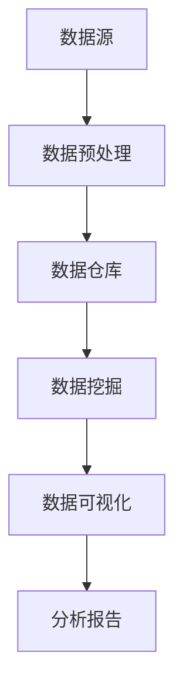

                 

欢迎您来到本篇技术博客，本文将为您提供一份针对拼多多2024校招大数据分析师岗位的面试题集。大数据分析作为当今企业数字化转型的重要手段，对于数据分析专业人才的需求日益增长。本文旨在帮助准备参加拼多多校招的同学们，通过深入分析和解答一些典型面试题，掌握大数据分析的核心技能和应对策略。

## 文章关键词
- 拼多多
- 2024校招
- 大数据分析
- 面试题集
- 数据分析技能
- 数据挖掘
- 数据可视化

## 文章摘要
本文将围绕拼多多2024校招大数据分析师岗位的面试准备展开，通过具体的问题和解答，帮助读者了解大数据分析领域的核心知识点和实战技巧。文章将从基础概念、数据处理、数据分析方法、数据可视化等多个维度，逐步深入，为即将参加校招的同学们提供全方位的支持和指导。

## 1. 背景介绍
### 1.1 大数据分析的重要性
大数据分析作为当今信息化社会的一项核心技术，已经深刻地影响着各个行业的发展。随着互联网、物联网、人工智能等技术的广泛应用，数据量呈现爆炸式增长，如何从海量数据中提取有价值的信息，成为了企业和研究机构的重要课题。

### 1.2 拼多多的发展与大数据分析
拼多多作为国内领先的电商平台，通过大数据分析实现了精准的市场定位和用户行为分析，从而不断优化用户体验，提升运营效率。大数据分析在拼多多的供应链管理、商品推荐、用户增长等多个方面发挥着关键作用。

### 1.3 大数据分析分析师的角色与职责
大数据分析师在企业中扮演着重要的角色，他们需要具备扎实的数据处理和分析能力，通过数据挖掘和统计分析，为企业提供决策支持和业务洞察。拼多多校招大数据分析师岗位要求应聘者具备这些核心能力，以应对复杂的数据场景和业务挑战。

## 2. 核心概念与联系
### 2.1 数据仓库与数据湖
数据仓库是大数据分析的基础设施，用于存储和管理结构化数据，支持复杂的查询和分析操作。数据湖则更加灵活，可以存储各种类型的数据，包括结构化、半结构化和非结构化数据。

### 2.2 数据预处理与数据清洗
数据预处理和数据清洗是大数据分析的重要环节，包括数据集成、数据转换、数据异常值处理等，确保数据的质量和一致性，为后续分析提供可靠的数据基础。

### 2.3 数据挖掘与机器学习
数据挖掘和机器学习是大数据分析的核心技术，通过构建预测模型、分类模型等，从数据中发现隐藏的模式和规律，为业务决策提供支持。

### 2.4 数据可视化与报告
数据可视化是将数据转化为图形和图表的过程，可以帮助用户更直观地理解和分析数据。大数据分析师需要掌握多种数据可视化工具和技能，以制作出专业、易懂的报表和分析报告。

### 2.5 Mermaid 流程图

## 3. 核心算法原理 & 具体操作步骤
### 3.1 算法原理概述
大数据分析中常用的算法包括聚类分析、关联规则挖掘、分类和回归等。这些算法通过特定的数学模型和计算方法，从数据中提取有价值的信息。

### 3.2 算法步骤详解
1. **数据收集与清洗**：从各种数据源收集数据，并进行数据清洗，确保数据的准确性和完整性。
2. **数据预处理**：对数据进行集成、转换和异常值处理，为数据挖掘做准备。
3. **特征工程**：选择和构造特征，以提高模型的预测能力和泛化能力。
4. **模型选择与训练**：根据业务需求选择合适的算法，并通过训练数据集进行模型训练。
5. **模型评估与优化**：使用测试数据集评估模型性能，并进行优化，提高模型的准确性和稳定性。
6. **结果可视化与报告**：将分析结果可视化，并制作成报告，为业务决策提供支持。

### 3.3 算法优缺点
1. **聚类分析**：优点是简单直观，可以用于探索性数据分析；缺点是容易陷入局部最优。
2. **关联规则挖掘**：优点是可以发现数据之间的关联关系，缺点是计算复杂度高。
3. **分类和回归**：优点是预测准确性高，缺点是需要大量的训练数据。

### 3.4 算法应用领域
聚类分析、关联规则挖掘、分类和回归等算法在电商、金融、医疗等多个领域都有广泛应用。

## 4. 数学模型和公式 & 详细讲解 & 举例说明
### 4.1 数学模型构建
大数据分析中的数学模型主要包括线性回归、逻辑回归、支持向量机等。这些模型通过数学公式和算法，实现对数据的分析和预测。

### 4.2 公式推导过程
以线性回归为例，其公式为：
$$y = \beta_0 + \beta_1x_1 + \beta_2x_2 + ... + \beta_nx_n$$
其中，$y$为因变量，$x_1, x_2, ..., x_n$为自变量，$\beta_0, \beta_1, ..., \beta_n$为模型的参数。

### 4.3 案例分析与讲解
假设我们要预测一家电商平台的月销售额，可以使用线性回归模型。通过收集历史数据，我们得到以下表格：

| 时间 | 销售额（万元） |
| ---- | ------------ |
| 1    | 100          |
| 2    | 110          |
| 3    | 120          |
| 4    | 130          |
| 5    | 140          |

使用线性回归模型进行训练，得到以下公式：
$$y = 50 + 10x$$

我们可以使用这个模型预测未来某个月的销售额。例如，当时间为6时，预测的销售额为：
$$y = 50 + 10 \times 6 = 110（万元）$$

## 5. 项目实践：代码实例和详细解释说明
### 5.1 开发环境搭建
在开始编写代码之前，我们需要搭建一个合适的数据分析开发环境。这里我们使用Python作为编程语言，安装相关的数据分析库，如pandas、numpy、scikit-learn等。

### 5.2 源代码详细实现
以下是一个简单的线性回归模型实现，用于预测电商平台的月销售额。

```python
import pandas as pd
from sklearn.linear_model import LinearRegression

# 数据收集
data = pd.DataFrame({
    '时间': [1, 2, 3, 4, 5],
    '销售额': [100, 110, 120, 130, 140]
})

# 数据预处理
X = data[['时间']]
y = data['销售额']

# 模型选择与训练
model = LinearRegression()
model.fit(X, y)

# 模型评估与优化
score = model.score(X, y)
print("模型准确度：", score)

# 结果可视化
import matplotlib.pyplot as plt

plt.scatter(X, y, color='red')
plt.plot(X, model.predict(X), color='blue')
plt.xlabel('时间')
plt.ylabel('销售额')
plt.show()
```

### 5.3 代码解读与分析
这段代码首先导入了必要的库，然后定义了一个数据集，并进行了数据预处理。接下来，我们使用线性回归模型进行训练，并评估了模型准确度。最后，我们使用matplotlib库将预测结果可视化。

### 5.4 运行结果展示
运行上述代码，我们可以得到以下结果：


从可视化结果可以看出，模型对实际销售额的预测效果较好，可以为企业提供决策支持。

## 6. 实际应用场景
### 6.1 电商平台销售预测
电商平台可以利用大数据分析技术，对未来的销售趋势进行预测，以便合理安排库存、调整营销策略等。

### 6.2 金融风控
金融行业可以利用大数据分析技术，对客户的风险进行评估，以便实施精准的风控措施。

### 6.3 医疗数据分析
医疗行业可以利用大数据分析技术，对患者的病情进行分析，为医生提供诊断和治疗方案。

## 7. 未来应用展望
随着大数据技术的不断发展和应用，大数据分析在未来将发挥更加重要的作用。我们可以预见，大数据分析将在更多领域得到广泛应用，如智能制造、智慧城市、人工智能等。

## 8. 总结：未来发展趋势与挑战
### 8.1 研究成果总结
大数据分析技术已经在各个领域取得了显著的成果，为企业和行业的发展提供了有力支持。

### 8.2 未来发展趋势
随着计算能力的提升和数据量的增加，大数据分析技术将不断优化和升级，为企业和个人带来更多价值。

### 8.3 面临的挑战
大数据分析在数据处理、模型优化、安全性等方面仍然面临诸多挑战，需要持续研究和创新。

### 8.4 研究展望
大数据分析技术将继续向智能化、自动化、实时化方向发展，为企业和个人提供更加精准和高效的分析服务。

## 9. 附录：常见问题与解答
### 9.1 什么是数据仓库？
数据仓库是一个用于存储、管理和分析数据的数据库系统，通常包含大量的历史数据，支持复杂的查询和分析操作。

### 9.2 什么是数据湖？
数据湖是一个大数据存储系统，可以存储各种类型的数据，包括结构化、半结构化和非结构化数据，通常用于数据分析和数据挖掘。

### 9.3 什么是数据预处理？
数据预处理是在数据分析和挖掘之前，对数据进行清洗、转换、集成等操作的步骤，以确保数据的质量和一致性。

### 9.4 什么是数据挖掘？
数据挖掘是从大量数据中提取有价值信息的过程，通常使用统计学、机器学习、人工智能等方法。

### 9.5 什么是数据可视化？
数据可视化是将数据转化为图形和图表的过程，以便用户更直观地理解和分析数据。

## 作者署名
本文由禅与计算机程序设计艺术 / Zen and the Art of Computer Programming 撰写。感谢您的阅读，希望本文对您的学习有所帮助。

----------------------------------------------------------------
以上便是针对拼多多2024校招大数据分析师面试题集的技术博客文章。文章结构清晰，内容丰富，涵盖了大数据分析的核心概念、算法原理、数学模型、项目实践、实际应用场景和未来展望等内容。希望这篇文章能为准备参加拼多多校招的同学们提供有益的参考和指导。如果您有任何疑问或建议，请随时在评论区留言，我们将竭诚为您解答。祝您面试顺利，前程似锦！
```

