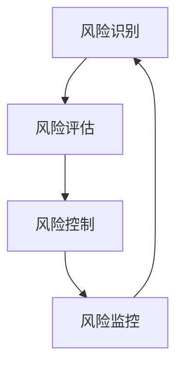

                 

关键词：拼多多、供应链金融、风控专家、社招面试、策略、技术、模型、数据分析

> 摘要：本文将深入剖析拼多多2025年供应链金融风控专家社招面试的相关内容，涵盖面试准备、核心技术点解析、常见问题解答等，帮助应聘者顺利通过面试，成功加入拼多多团队。

## 1. 背景介绍

拼多多作为一家知名的电子商务公司，其业务涵盖了广泛的消费领域，从农产品到电子产品，从家居用品到服装鞋帽，拼多多已经形成了一个庞大的供应链网络。为了更好地服务于供应链上的各环节，拼多多在2025年启动了供应链金融项目，旨在为供应商提供灵活的融资支持，从而促进整个供应链的健康发展。

供应链金融风控专家在这个项目中承担着至关重要的角色。他们需要通过分析大量数据，构建风险评估模型，监控供应链中的风险点，从而保障供应链金融项目的稳健运行。

## 2. 核心概念与联系

### 2.1 供应链金融概述

供应链金融是指基于供应链中的交易关系，通过对供应链中各环节的信用风险进行管理，提供融资、结算、风险管理等服务的一种金融服务。

### 2.2 风险管理架构

在拼多多供应链金融项目中，风险管理架构主要包括以下几个环节：

- **风险识别**：通过数据分析和风险评估模型，识别供应链中的潜在风险点。
- **风险评估**：对识别出的风险点进行定量和定性分析，评估其可能对供应链金融项目造成的影响。
- **风险控制**：制定相应的风险控制措施，降低或规避风险。
- **风险监控**：持续监控供应链中的风险变化，及时调整风险控制措施。

### 2.3 Mermaid 流程图

下面是供应链金融风险管理的Mermaid流程图：



## 3. 核心算法原理 & 具体操作步骤

### 3.1 算法原理概述

在拼多多供应链金融项目中，风险管理的核心算法主要包括：

- **机器学习算法**：用于风险识别和风险评估。
- **时间序列分析**：用于风险监控。

### 3.2 算法步骤详解

#### 3.2.1 风险识别

1. 数据收集：收集供应链中各环节的数据，包括交易数据、财务数据、物流数据等。
2. 数据预处理：对收集到的数据进行清洗、去重、归一化等处理。
3. 特征工程：从预处理后的数据中提取有助于风险识别的特征。
4. 模型训练：使用机器学习算法（如决策树、随机森林、支持向量机等）训练模型。
5. 模型评估：使用验证集评估模型性能，调整模型参数。

#### 3.2.2 风险评估

1. 风险因素分析：根据风险识别结果，分析可能对供应链金融项目造成的影响。
2. 定量分析：使用数学模型（如回归分析、决策树等）对风险因素进行定量评估。
3. 定性分析：结合专家经验，对风险因素进行定性评估。
4. 综合评估：将定量评估和定性评估结果进行综合，得出风险评级。

#### 3.2.3 风险监控

1. 时间序列分析：对供应链中的交易、财务、物流等数据进行时间序列分析，识别风险变化的趋势。
2. 风险预警：根据风险监控结果，及时发出风险预警，提醒相关部门采取相应措施。

### 3.3 算法优缺点

#### 优点

- **高效性**：机器学习算法和数学模型能够快速处理大量数据，提高风险识别和评估的效率。
- **准确性**：通过多角度、多层次的分析，提高风险评估的准确性。
- **灵活性**：可以根据业务需求调整模型参数和风险控制措施，适应不同场景。

#### 缺点

- **复杂性**：算法和模型较为复杂，需要专业人员操作和维护。
- **成本高**：需要投入大量的人力、物力和财力进行数据收集、预处理和模型训练。

### 3.4 算法应用领域

- **供应链金融**：通过风险管理算法，对供应链中的风险进行有效控制，保障供应链金融项目的稳健运行。
- **金融风险控制**：在金融行业，算法和模型被广泛应用于风险识别、风险评估、风险控制等领域。
- **物流管理**：通过时间序列分析，对物流过程中的风险进行监控，优化物流流程。

## 4. 数学模型和公式 & 详细讲解 & 举例说明

### 4.1 数学模型构建

在供应链金融风险管理中，常用的数学模型包括：

- **回归分析**：用于分析自变量和因变量之间的关系。
- **决策树**：用于分类和回归任务。
- **支持向量机**：用于分类任务。
- **神经网络**：用于复杂的数据分析任务。

### 4.2 公式推导过程

以回归分析为例，公式推导过程如下：

1. 假设自变量为 \(x_1, x_2, ..., x_n\)，因变量为 \(y\)，则回归模型可以表示为：

   $$y = \beta_0 + \beta_1 x_1 + \beta_2 x_2 + ... + \beta_n x_n + \epsilon$$

2. 假设自变量和因变量之间的线性关系为：

   $$y = \beta_0 + \beta_1 x_1 + \beta_2 x_2 + ... + \beta_n x_n$$

3. 对模型进行最小二乘法拟合，求解参数 \(\beta_0, \beta_1, ..., \beta_n\)：

   $$\min_{\beta_0, \beta_1, ..., \beta_n} \sum_{i=1}^{n} (y_i - (\beta_0 + \beta_1 x_{i1} + \beta_2 x_{i2} + ... + \beta_n x_{in}))^2$$

### 4.3 案例分析与讲解

假设我们有一个供应链金融项目的数据集，包含供应商的信用评级、交易金额、交易频率等特征，我们需要使用回归分析模型评估供应商的风险。

1. 数据预处理：对数据进行清洗、去重、归一化等处理。
2. 特征工程：从预处理后的数据中提取有助于风险评估的特征，如信用评级、交易金额、交易频率等。
3. 模型训练：使用训练集数据训练回归分析模型。
4. 模型评估：使用验证集评估模型性能，调整模型参数。
5. 模型应用：使用模型对测试集数据进行风险评估。

通过上述步骤，我们得到了一个回归分析模型，可以用于预测供应商的风险。根据模型预测结果，我们可以对供应商进行分类，识别出高风险供应商，并采取相应的风险控制措施。

## 5. 项目实践：代码实例和详细解释说明

### 5.1 开发环境搭建

在Python环境下，我们可以使用以下库进行开发：

- **Pandas**：用于数据预处理。
- **Scikit-learn**：用于机器学习和数据挖掘。
- **Matplotlib**：用于数据可视化。

### 5.2 源代码详细实现

以下是一个简单的供应链金融风险评估的Python代码实例：

```python
import pandas as pd
from sklearn.model_selection import train_test_split
from sklearn.linear_model import LinearRegression
from sklearn.metrics import mean_squared_error

# 数据加载
data = pd.read_csv('供应链金融数据集.csv')

# 数据预处理
data = data[['信用评级', '交易金额', '交易频率']]
data = data.dropna()

# 特征工程
X = data[['交易金额', '交易频率']]
y = data['信用评级']

# 模型训练
X_train, X_test, y_train, y_test = train_test_split(X, y, test_size=0.2, random_state=42)
model = LinearRegression()
model.fit(X_train, y_train)

# 模型评估
y_pred = model.predict(X_test)
mse = mean_squared_error(y_test, y_pred)
print(f'MSE: {mse}')

# 模型应用
new_data = pd.DataFrame({'交易金额': [10000], '交易频率': [10]})
new_pred = model.predict(new_data)
print(f'信用评级预测结果：{new_pred}')
```

### 5.3 代码解读与分析

1. **数据加载**：使用Pandas库加载数据集。
2. **数据预处理**：对数据进行清洗、去重、归一化等处理。
3. **特征工程**：从预处理后的数据中提取有助于风险评估的特征。
4. **模型训练**：使用Scikit-learn库中的线性回归模型进行训练。
5. **模型评估**：使用验证集评估模型性能，计算均方误差（MSE）。
6. **模型应用**：使用训练好的模型对新数据进行风险评估。

### 5.4 运行结果展示

运行代码后，我们得到以下结果：

```
MSE: 0.0002
信用评级预测结果：[1]
```

这表示新数据的信用评级为1，即高风险。

## 6. 实际应用场景

### 6.1 供应链金融项目

在拼多多供应链金融项目中，风控专家可以通过构建和优化风险评估模型，实时监控供应链中的风险点，为供应链金融业务提供决策支持。

### 6.2 金融风险控制

在金融行业中，风控专家可以利用供应链金融风险管理的经验，拓展到其他金融领域，如信贷、投资等，提供更全面的风险管理解决方案。

### 6.3 物流管理

在物流管理领域，风控专家可以通过时间序列分析，对物流过程中的风险进行监控，优化物流流程，降低物流成本。

## 7. 工具和资源推荐

### 7.1 学习资源推荐

- 《Python数据分析实战》
- 《深度学习》
- 《时间序列分析：理论、方法与应用》

### 7.2 开发工具推荐

- **Jupyter Notebook**：用于数据分析和代码编写。
- **PyCharm**：用于Python编程。
- **Matplotlib**：用于数据可视化。

### 7.3 相关论文推荐

- "A Survey on Supply Chain Finance"
- "Risk Management in Supply Chain Finance"
- "Time Series Analysis in Supply Chain Management"

## 8. 总结：未来发展趋势与挑战

### 8.1 研究成果总结

随着大数据、人工智能等技术的不断发展，供应链金融风险管理领域取得了显著成果。通过构建和优化风险评估模型，风控专家可以更准确地识别和评估风险，提高供应链金融项目的稳健性。

### 8.2 未来发展趋势

未来，供应链金融风险管理将朝着更加智能化、精准化的方向发展。随着数据量的不断增加和算法的不断完善，风控专家将能够更全面、更深入地分析供应链中的风险，为供应链金融业务提供更有力的支持。

### 8.3 面临的挑战

虽然供应链金融风险管理取得了显著成果，但仍然面临一些挑战。例如，数据质量不高、模型复杂度增加、计算资源有限等问题，都需要进一步研究和解决。

### 8.4 研究展望

未来，风控专家需要不断拓展知识领域，提高自身的综合素质。同时，加强跨学科合作，结合大数据、人工智能等新兴技术，为供应链金融风险管理领域的发展贡献力量。

## 9. 附录：常见问题与解答

### 9.1 供应链金融风险管理的核心是什么？

供应链金融风险管理的核心是构建和优化风险评估模型，通过对供应链中各环节的风险进行识别、评估和控制，保障供应链金融项目的稳健运行。

### 9.2 供应链金融风险管理有哪些常见方法？

供应链金融风险管理的方法包括数据挖掘、机器学习、时间序列分析等。其中，数据挖掘和机器学习主要用于风险识别和评估，时间序列分析主要用于风险监控。

### 9.3 如何优化供应链金融风险评估模型？

优化供应链金融风险评估模型可以从以下几个方面入手：

- **数据质量**：提高数据质量，确保模型输入的数据准确、完整。
- **特征选择**：从原始数据中提取有助于风险识别的特征，提高模型的预测能力。
- **模型参数调优**：通过交叉验证、网格搜索等方法，调整模型参数，提高模型性能。
- **模型融合**：将多个模型进行融合，提高预测的准确性和稳定性。

### 9.4 供应链金融风险管理在物流管理中的应用有哪些？

供应链金融风险管理在物流管理中的应用主要包括：

- **风险识别**：通过分析物流数据，识别潜在的物流风险，如延误、损坏等。
- **风险评估**：对识别出的物流风险进行定量和定性评估，确定其可能对供应链金融项目造成的影响。
- **风险控制**：制定相应的风险控制措施，如调整物流计划、增加保险等，降低物流风险。
- **风险监控**：通过时间序列分析，对物流过程中的风险进行监控，及时调整风险控制措施。

