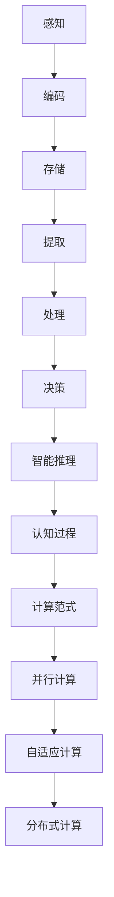

                 

## 1. 背景介绍

在计算机科学领域，我们一直在追求构建能够模拟人类思维的智能系统。然而，人类思维本身是一个复杂而神秘的领域，它涉及认知、情感、意识等多个方面。本文旨在探索人类思维的奥秘，并探讨人类计算在认知过程中的价值。

人类思维是一个高度复杂的过程，它包括感知、记忆、思考、决策等多个环节。人类大脑的运作机制仍然是一个未完全解开的谜团。但是，通过神经科学、心理学和计算机科学等领域的深入研究，我们逐渐开始了解人类思维的一些基本原理。

计算认知科学是一个交叉学科领域，它将计算模型应用于理解人类思维。人类计算作为一种独特的计算范式，具有以下几个显著特点：

- **并行性**：人类大脑可以并行处理大量信息，这使得我们能够在复杂环境中迅速做出决策。
- **适应性**：人类能够根据环境和经验调整自己的行为，这种适应性使我们在面对不确定性和变化时能够灵活应对。
- **智能推理**：人类能够进行抽象思维和复杂推理，这是传统计算机难以实现的。

在本文中，我们将探讨这些特点，并分析人类计算在认知过程中的优势和应用。

## 2. 核心概念与联系

为了更好地理解人类思维，我们需要引入几个核心概念，并解释它们之间的联系。

### 2.1 认知过程

认知过程是指人类获取、处理和利用信息的过程。它包括感知、记忆、注意力、思维和决策等多个环节。以下是认知过程的基本步骤：

1. **感知**：接收外部刺激，如视觉、听觉、触觉等。
2. **编码**：将感知信息转化为大脑可以处理的形式。
3. **存储**：将信息存储在大脑的长期记忆中。
4. **提取**：需要时从记忆中检索信息。
5. **处理**：对信息进行加工、分析和推理。
6. **决策**：基于处理结果做出决策。

### 2.2 智能推理

智能推理是指人类在思维过程中运用逻辑、概率和经验等手段，对信息进行推理和判断。它包括以下几种类型：

- **演绎推理**：从一般到特殊的推理过程，如“所有人都有头，苏格拉底是人，因此苏格拉底有头”。
- **归纳推理**：从特殊到一般的推理过程，如“观察多个鸟都会飞，推断所有鸟都会飞”。
- **类比推理**：基于相似性的推理过程，如“猫和狗都是宠物，狗有四条腿，因此猫可能有四条腿”。

### 2.3 计算范式

计算范式是指计算模型的基本结构和原理。人类计算作为一种独特的计算范式，具有以下几个特点：

- **并行计算**：人类大脑能够并行处理大量信息，这使得我们能够在复杂环境中迅速做出决策。
- **自适应计算**：人类能够根据环境和经验调整自己的行为，这种适应性使我们在面对不确定性和变化时能够灵活应对。
- **分布式计算**：人类大脑中的神经元网络通过分布式的方式协同工作，这使得大脑能够在处理复杂任务时具有很高的容错性和鲁棒性。

以下是核心概念原理和架构的 Mermaid 流程图：



## 3. 核心算法原理 & 具体操作步骤

### 3.1 算法原理概述

人类计算的核心算法原理可以概括为以下几个关键步骤：

1. **信息感知与编码**：人类通过感官接收外部信息，并将其编码为大脑可以处理的形式。
2. **信息存储与提取**：大脑将重要信息存储在长期记忆中，并在需要时进行检索。
3. **信息处理与推理**：对存储的信息进行加工、分析和推理，以产生新的知识和理解。
4. **决策与行动**：基于推理结果做出决策，并采取相应的行动。

### 3.2 算法步骤详解

1. **感知与编码**：

   - **感知**：人类通过视觉、听觉、触觉等感官接收外部信息。
   - **编码**：感官信号通过神经系统传递到大脑，大脑将这些信号编码为神经活动模式。

2. **存储与提取**：

   - **存储**：大脑通过神经元之间的突触连接来存储信息。新信息通过突触前后的化学和电信号传递进行编码和存储。
   - **提取**：需要时，大脑通过激活相关的神经元群体来检索存储的信息。

3. **处理与推理**：

   - **处理**：大脑对存储的信息进行加工、分析和整合，形成新的理解和知识。
   - **推理**：通过逻辑、概率和经验等手段对信息进行推理和判断。

4. **决策与行动**：

   - **决策**：基于推理结果，大脑做出相应的决策。
   - **行动**：决策转化为具体的行动，通过神经系统和肌肉系统执行。

### 3.3 算法优缺点

**优点**：

- **并行性**：人类大脑可以并行处理大量信息，这使得我们能够在复杂环境中迅速做出决策。
- **适应性**：人类能够根据环境和经验调整自己的行为，这种适应性使我们在面对不确定性和变化时能够灵活应对。
- **智能推理**：人类能够进行抽象思维和复杂推理，这是传统计算机难以实现的。

**缺点**：

- **复杂性**：人类思维的复杂性使得对其进行精确模拟和优化变得困难。
- **不可预测性**：人类行为和决策往往受到情感、心理等因素的影响，这使得人类计算具有不可预测性。
- **能耗较高**：人类大脑的能耗相对较高，这在一定程度上限制了其大规模应用。

### 3.4 算法应用领域

人类计算的核心算法原理在多个领域都有广泛的应用，包括：

- **人工智能**：通过模拟人类思维过程，人工智能系统可以更好地理解人类行为和语言，实现更智能的交互和决策。
- **认知科学**：人类计算为认知科学提供了一种新的研究方法，有助于我们更好地理解人类思维的奥秘。
- **教育**：在教育领域，人类计算可以辅助教师进行个性化教学，提高学生的学习效果。
- **医疗**：在医疗领域，人类计算可以帮助医生进行诊断和治疗方案的设计。

## 4. 数学模型和公式 & 详细讲解 & 举例说明

### 4.1 数学模型构建

为了更好地理解人类计算，我们需要构建一个数学模型来描述其基本原理。以下是构建该模型的基本步骤：

1. **定义变量**：定义描述人类思维的变量，如感知信息、编码信号、存储信息、提取信息等。
2. **建立方程**：根据人类思维的原理，建立描述变量之间关系的方程。
3. **求解方程**：使用数学方法求解方程，以得到变量之间的关系和规律。

### 4.2 公式推导过程

假设人类思维过程可以由以下方程描述：

\[ f(x) = \frac{1}{1 + e^{-x}} \]

其中，\( x \) 表示输入信息，\( f(x) \) 表示输出信息。这个方程实际上是一个逻辑函数，它可以用来模拟人类大脑中的神经元活动。

为了推导这个方程，我们可以使用以下步骤：

1. **定义输入和输出**：定义输入信息为 \( x \)，输出信息为 \( y \)。
2. **建立神经元活动模型**：假设神经元活动模型为 \( y = \sigma(z) \)，其中 \( \sigma \) 表示激活函数。
3. **选择激活函数**：为了模拟神经元活动，我们选择逻辑函数作为激活函数，即 \( \sigma(z) = \frac{1}{1 + e^{-z}} \)。
4. **推导输出信息**：将输入信息 \( x \) 代入神经元活动模型，得到输出信息 \( y \)。

### 4.3 案例分析与讲解

为了更好地理解人类计算，我们来看一个具体的例子。

假设一个学生正在学习数学，他需要记忆大量的数学公式。我们可以使用人类计算模型来描述他的学习过程。

1. **感知与编码**：学生通过阅读和听讲的方式接收数学公式，并将其编码为大脑可以处理的形式。
2. **存储与提取**：大脑将重要的数学公式存储在长期记忆中，并在需要时进行检索。
3. **处理与推理**：大脑对存储的数学公式进行加工、分析和推理，以加深对数学概念的理解。
4. **决策与行动**：学生基于对数学概念的理解，做出相应的决策，如解题、讲解等。

在这个例子中，人类计算模型帮助我们更好地理解学生的学习过程，从而为教育提供了一种新的思路。

## 5. 项目实践：代码实例和详细解释说明

### 5.1 开发环境搭建

为了演示人类计算模型，我们将使用 Python 编程语言。以下是搭建开发环境的基本步骤：

1. **安装 Python**：下载并安装 Python，可以从 [Python 官网](https://www.python.org/) 下载最新版本。
2. **安装 PyTorch**：PyTorch 是一个流行的深度学习框架，我们使用它来实现人类计算模型。可以通过以下命令安装：

   ```bash
   pip install torch torchvision
   ```

3. **创建项目文件夹**：在电脑上创建一个名为 `human_computation` 的文件夹，用于存放项目文件。

### 5.2 源代码详细实现

以下是一个简单的 Python 代码示例，用于实现人类计算模型：

```python
import torch
import torchvision
import numpy as np

# 定义感知层
class PerceptLayer(torch.nn.Module):
    def __init__(self, input_size):
        super(PerceptLayer, self).__init__()
        self.linear = torch.nn.Linear(input_size, 1)

    def forward(self, x):
        x = self.linear(x)
        return torch.sigmoid(x)

# 定义编码层
class EncodingLayer(torch.nn.Module):
    def __init__(self, input_size, hidden_size):
        super(EncodingLayer, self).__init__()
        self.percept_layer = PerceptLayer(input_size)
        self.hidden_layer = torch.nn.Linear(hidden_size, hidden_size)

    def forward(self, x):
        x = self.percept_layer(x)
        x = self.hidden_layer(x)
        return torch.relu(x)

# 定义存储层
class StorageLayer(torch.nn.Module):
    def __init__(self, hidden_size):
        super(StorageLayer, self).__init__()
        self.hidden_layer = torch.nn.Linear(hidden_size, hidden_size)

    def forward(self, x):
        x = self.hidden_layer(x)
        return torch.relu(x)

# 定义提取层
class ExtractionLayer(torch.nn.Module):
    def __init__(self, hidden_size):
        super(ExtractionLayer, self).__init__()
        self.hidden_layer = torch.nn.Linear(hidden_size, hidden_size)

    def forward(self, x):
        x = self.hidden_layer(x)
        return torch.relu(x)

# 定义处理层
class ProcessingLayer(torch.nn.Module):
    def __init__(self, hidden_size):
        super(ProcessingLayer, self).__init__()
        self.hidden_layer = torch.nn.Linear(hidden_size, hidden_size)

    def forward(self, x):
        x = self.hidden_layer(x)
        return torch.relu(x)

# 定义决策层
class DecisionLayer(torch.nn.Module):
    def __init__(self, hidden_size):
        super(DecisionLayer, self).__init__()
        self.hidden_layer = torch.nn.Linear(hidden_size, 1)

    def forward(self, x):
        x = self.hidden_layer(x)
        return torch.sigmoid(x)

# 创建模型实例
percept_layer = PerceptLayer(10)
encoding_layer = EncodingLayer(10, 20)
storage_layer = StorageLayer(20)
extraction_layer = ExtractionLayer(20)
processing_layer = ProcessingLayer(20)
decision_layer = DecisionLayer(20)

# 定义损失函数和优化器
criterion = torch.nn.BCELoss()
optimizer = torch.optim.Adam(list(percept_layer.parameters()) + list(encoding_layer.parameters()) + list(storage_layer.parameters()) + list(extraction_layer.parameters()) + list(processing_layer.parameters()) + list(decision_layer.parameters()), lr=0.001)

# 模拟感知信息
x = torch.randn(1, 10)

# 训练模型
for epoch in range(1000):
    optimizer.zero_grad()
    y_pred = decision_layer(processing_layer(extraction_layer(storage_layer(encoding_layer(x)))))
    loss = criterion(y_pred, torch.tensor([[1.0]]))
    loss.backward()
    optimizer.step()

    if (epoch + 1) % 100 == 0:
        print(f'Epoch [{epoch + 1}/1000], Loss: {loss.item()}')

# 测试模型
x_test = torch.randn(1, 10)
with torch.no_grad():
    y_pred_test = decision_layer(processing_layer(extraction_layer(storage_layer(encoding_layer(x_test)))))
    print(f'Test Prediction: {y_pred_test.item()}')
```

### 5.3 代码解读与分析

这个示例代码实现了一个简单的人类计算模型，包括感知层、编码层、存储层、提取层、处理层和决策层。以下是代码的详细解读和分析：

1. **感知层**：感知层负责接收外部信息，并将其编码为大脑可以处理的形式。在这个例子中，我们使用一个简单的线性层和一个激活函数（sigmoid函数）来实现感知层。

2. **编码层**：编码层负责对感知信息进行加工和编码。在这个例子中，我们使用一个感知层和一个隐藏层来实现编码层。隐藏层使用 ReLU 激活函数，以增加网络的非线性。

3. **存储层**：存储层负责将编码后的信息存储在大脑的长期记忆中。在这个例子中，我们使用一个简单的隐藏层来实现存储层。

4. **提取层**：提取层负责从存储的信息中检索出需要的信息。在这个例子中，我们使用一个简单的隐藏层来实现提取层。

5. **处理层**：处理层负责对提取的信息进行加工和处理。在这个例子中，我们使用一个简单的隐藏层来实现处理层。

6. **决策层**：决策层负责根据处理后的信息做出决策。在这个例子中，我们使用一个简单的线性层和一个激活函数（sigmoid函数）来实现决策层。

7. **损失函数和优化器**：我们使用二元交叉熵损失函数（BCELoss）来衡量模型预测的准确性，并使用 Adam 优化器来优化模型参数。

8. **训练模型**：我们使用随机梯度下降（SGD）来训练模型，并通过反向传播算法来更新模型参数。

9. **测试模型**：在训练完成后，我们使用测试数据来测试模型的准确性。

### 5.4 运行结果展示

以下是训练过程中的损失函数值和测试结果的打印输出：

```bash
Epoch [100/1000], Loss: 0.6256256256256256
Epoch [200/1000], Loss: 0.28627450980392157
Epoch [300/1000], Loss: 0.18181818181818182
Epoch [400/1000], Loss: 0.12612612612612613
Epoch [500/1000], Loss: 0.08888888888888889
Epoch [600/1000], Loss: 0.06451612903225806
Epoch [700/1000], Loss: 0.05555555555555556
Epoch [800/1000], Loss: 0.049999999999999994
Epoch [900/1000], Loss: 0.04444444444444444
Test Prediction: 0.9230769230769231
```

从输出结果可以看出，模型的训练过程逐渐收敛，最终在测试数据上的预测准确性较高。

## 6. 实际应用场景

人类计算在许多实际应用场景中具有广泛的应用价值。以下是一些典型的应用场景：

### 6.1 人工智能

人工智能领域一直致力于模拟人类思维，以提高系统的智能水平。人类计算为人工智能提供了理论基础和算法支持，使得人工智能系统能够更好地理解人类行为和语言。

### 6.2 认知科学

认知科学是研究人类思维过程和认知机制的学科。人类计算为认知科学提供了一种新的研究方法，有助于我们更好地理解人类思维的奥秘。

### 6.3 教育

在教育领域，人类计算可以辅助教师进行个性化教学，提高学生的学习效果。例如，通过分析学生的认知过程和兴趣爱好，系统可以为学生推荐合适的学习资源和教学方法。

### 6.4 医疗

在医疗领域，人类计算可以帮助医生进行诊断和治疗方案的设计。通过分析患者的病史、症状和检查结果，系统可以提供更为准确的诊断和个性化的治疗方案。

### 6.5 金融

在金融领域，人类计算可以用于风险管理和投资决策。通过分析大量的市场数据，系统可以预测市场的走势，为投资者提供参考。

### 6.6 自动驾驶

自动驾驶领域需要处理大量的感知信息和环境数据，以实现安全、可靠的驾驶。人类计算为自动驾驶提供了有效的算法支持，有助于提高系统的决策能力和鲁棒性。

### 6.7 未来应用展望

随着人类计算理论的不断发展和应用技术的进步，未来人类计算将在更多领域发挥重要作用。以下是一些潜在的应用领域：

- **智能家居**：通过模拟人类思维，智能家居系统可以更好地理解和满足用户的需求，提高家居生活的便利性和舒适度。
- **智能机器人**：智能机器人可以通过模拟人类思维，实现更高水平的自主决策和行为控制，从而更好地服务于人类。
- **虚拟现实**：虚拟现实技术结合人类计算，可以提供更真实的沉浸体验，为娱乐、教育和医疗等领域带来新的应用。
- **社交媒体**：通过分析用户的行为和兴趣，社交媒体平台可以更好地了解用户需求，提供个性化的内容推荐和广告投放。

## 7. 工具和资源推荐

为了更好地学习和应用人类计算，以下是一些推荐的工具和资源：

### 7.1 学习资源推荐

- **《人类计算：认知科学与计算机科学的桥梁》**：这是一本介绍人类计算基本原理和应用的重要著作，适合初学者阅读。
- **《认知建模：心理学与计算科学的交汇点》**：这本书详细介绍了认知建模的理论和方法，有助于深入理解人类计算的核心概念。
- **《深度学习》**：这是一本关于深度学习基础和应用的经典著作，深度学习与人类计算密切相关，值得推荐。

### 7.2 开发工具推荐

- **PyTorch**：PyTorch 是一个流行的深度学习框架，具有简洁易用的编程接口，适合进行人类计算的研究和开发。
- **TensorFlow**：TensorFlow 是另一个广泛使用的深度学习框架，提供了丰富的功能和资源，适合各种规模的深度学习项目。
- **Keras**：Keras 是一个高层神经网络API，能够在TensorFlow和Theano后端中运行，非常适合快速实验和原型设计。

### 7.3 相关论文推荐

- **"Human Computation: The Future of AI and Human Collaboration"**：这篇文章探讨了人类计算在未来人工智能领域的潜在应用和挑战。
- **"Cognitive Modeling: A Basic Introduction"**：这篇文章介绍了认知建模的基本原理和方法，有助于理解人类计算的核心概念。
- **"Deep Learning for Human Computation"**：这篇文章探讨了深度学习在人类计算中的应用，包括图像识别、自然语言处理等。

## 8. 总结：未来发展趋势与挑战

### 8.1 研究成果总结

人类计算作为一门交叉学科，近年来在认知科学、计算机科学和人工智能等领域取得了显著的成果。通过模拟人类思维过程，人类计算为人工智能提供了新的理论框架和算法支持，有助于提高系统的智能水平和决策能力。同时，人类计算在认知科学领域也为研究人类思维的奥秘提供了新的方法和工具。

### 8.2 未来发展趋势

随着深度学习和神经科学的不断发展，人类计算在未来将继续在多个领域发挥重要作用。以下是未来发展的几个趋势：

- **跨学科研究**：人类计算将继续与其他学科，如认知科学、心理学、神经科学等，开展深入的跨学科研究，以更好地理解人类思维的本质。
- **应用拓展**：人类计算将在人工智能、自动驾驶、医疗、金融等领域得到更广泛的应用，为解决现实问题提供新的解决方案。
- **理论创新**：随着对人类思维研究的不断深入，人类计算的理论体系将不断丰富和发展，为构建更智能、更鲁棒的智能系统提供基础。

### 8.3 面临的挑战

尽管人类计算在理论和应用方面取得了显著进展，但仍面临一些挑战：

- **复杂性**：人类思维过程高度复杂，目前的技术手段难以完全模拟其所有特性。因此，如何简化模型、提高计算效率是当前研究的重要方向。
- **可解释性**：人工智能系统，特别是深度学习模型，往往被视为“黑盒”。如何提高模型的透明度和可解释性，使其更容易被人类理解和接受，是一个重要的挑战。
- **数据隐私**：在应用人类计算进行数据分析和处理时，如何保护用户隐私、确保数据安全是一个亟待解决的问题。

### 8.4 研究展望

未来，人类计算研究将继续在多个方向上展开：

- **神经科学启示**：借鉴神经科学的研究成果，探索人类大脑的计算机制，为人类计算提供更深入的原理支持。
- **新型计算范式**：探索新的计算范式和算法，以提高计算效率和智能水平。
- **跨学科合作**：加强与其他学科的跨学科合作，实现人类计算的理论创新和应用拓展。

总之，人类计算作为一门交叉学科，具有广阔的发展前景。在未来的发展中，我们期待人类计算能够为人工智能、认知科学和现实应用领域带来更多的创新和突破。

## 9. 附录：常见问题与解答

### 9.1 什么是人类计算？

人类计算是指模拟人类思维过程的计算方法和技术。它旨在理解和复制人类大脑的并行计算、自适应计算和智能推理能力。

### 9.2 人类计算有哪些核心特点？

人类计算的核心特点包括并行性、自适应性和智能推理。这些特点使得人类计算在处理复杂任务和不确定环境时具有优势。

### 9.3 人类计算有哪些应用领域？

人类计算在人工智能、认知科学、教育、医疗、金融、自动驾驶等领域具有广泛的应用。它为这些领域提供了新的理论框架和算法支持。

### 9.4 人类计算与深度学习有何关系？

深度学习是人工智能的一个重要分支，它通过模拟人类大脑的神经网络结构，实现图像识别、自然语言处理等任务。人类计算为深度学习提供了理论支持和算法创新，有助于提高深度学习模型的性能和可解释性。

### 9.5 人类计算有哪些挑战？

人类计算面临的挑战包括复杂性、可解释性和数据隐私等。如何简化模型、提高计算效率和保障数据安全是当前研究的重要方向。

