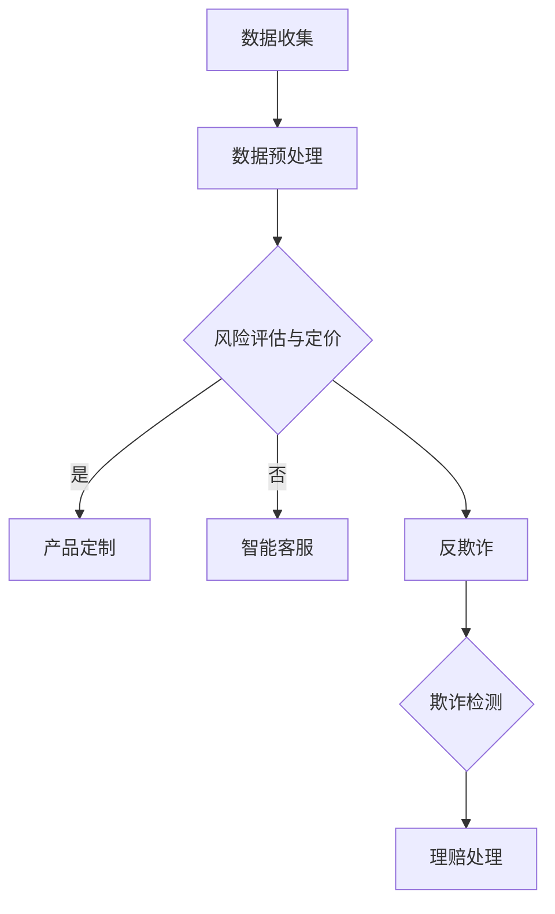

                 

关键词：人工智能、保险业、大模型、应用前景、技术挑战

> 摘要：本文将探讨人工智能（AI）大模型在保险业的应用前景。通过分析大模型在保险领域的关键作用、当前的应用状况、面临的挑战以及未来发展趋势，本文旨在为保险行业提供一份技术发展的参考。

## 1. 背景介绍

随着大数据和云计算技术的发展，人工智能（AI）在各个行业中的应用越来越广泛，尤其是金融行业。保险业作为金融领域的重要组成部分，其业务复杂、数据量大，传统的业务模式已经无法满足日益增长的需求。近年来，AI大模型在保险业的应用逐渐成为行业热点，为保险业务的创新提供了新的思路。

### 1.1 人工智能在保险业的发展历程

人工智能在保险业的应用可以追溯到20世纪80年代，当时的计算机系统主要用于数据处理和自动化理赔。随着技术的进步，21世纪初，人工智能开始逐步渗透到保险业的各个领域，如风险评估、智能客服、反欺诈等。近年来，随着AI大模型的突破，保险业迎来了新的发展机遇。

### 1.2 AI大模型的基本概念

AI大模型是指具有极高参数量和强大计算能力的神经网络模型，如深度神经网络（DNN）、循环神经网络（RNN）和Transformer等。这些模型在图像识别、自然语言处理、语音识别等领域取得了显著的成果。大模型的出现，为解决复杂问题提供了新的工具，也为保险业带来了前所未有的机遇。

## 2. 核心概念与联系

### 2.1 大模型在保险业的关键作用

AI大模型在保险业的关键作用主要体现在以下几个方面：

- **风险评估与定价**：通过分析海量数据，大模型可以准确预测风险，为保险产品定价提供依据。

- **智能客服与客户服务**：大模型可以模拟人类客服，提供快速、准确的回答，提高客户满意度。

- **反欺诈**：大模型可以从大量数据中发现潜在的欺诈行为，提高保险公司的风控能力。

- **定制化保险产品**：大模型可以根据客户需求，设计出更加个性化的保险产品。

### 2.2 大模型与保险业应用架构的Mermaid流程图



## 3. 核心算法原理 & 具体操作步骤

### 3.1 算法原理概述

AI大模型的核心原理是基于深度学习和神经网络。深度学习通过多层神经网络对数据进行特征提取和分类，实现复杂问题的建模。神经网络中的每个神经元都代表一个特征，通过权重和偏置进行数据拟合，最终实现预测。

### 3.2 算法步骤详解

1. **数据收集**：收集保险行业相关的数据，包括历史理赔记录、客户信息、风险数据等。

2. **数据预处理**：对数据进行清洗、去噪、归一化等处理，确保数据质量。

3. **模型训练**：使用训练集对大模型进行训练，通过反向传播算法不断调整权重和偏置，使模型对数据拟合更好。

4. **模型评估**：使用验证集对模型进行评估，调整模型参数，优化模型性能。

5. **模型部署**：将训练好的模型部署到生产环境，对实际数据进行分析和预测。

### 3.3 算法优缺点

**优点**：

- **强大的拟合能力**：大模型可以处理海量数据，拟合复杂问题。

- **高效的处理速度**：深度学习模型具有很高的计算效率。

**缺点**：

- **数据需求量大**：训练大模型需要大量的高质量数据。

- **计算资源消耗大**：大模型训练和部署需要大量的计算资源。

### 3.4 算法应用领域

AI大模型在保险业的应用领域非常广泛，包括但不限于：

- **风险评估与定价**：通过分析历史理赔数据和风险数据，预测未来风险，为保险产品定价提供依据。

- **智能客服**：通过自然语言处理技术，提供快速、准确的客户服务。

- **反欺诈**：通过分析客户行为数据，识别潜在的欺诈行为。

- **定制化保险产品**：根据客户需求，设计出更加个性化的保险产品。

## 4. 数学模型和公式 & 详细讲解 & 举例说明

### 4.1 数学模型构建

假设我们有一个保险产品，需要预测客户的理赔金额。可以使用回归模型进行预测，其数学模型为：

$$y = w_0 + w_1x_1 + w_2x_2 + ... + w_nx_n$$

其中，$y$表示理赔金额，$x_1, x_2, ..., x_n$表示影响理赔金额的各个因素，$w_0, w_1, w_2, ..., w_n$表示模型的参数。

### 4.2 公式推导过程

在训练过程中，我们需要最小化预测误差，即：

$$J(w_0, w_1, ..., w_n) = \frac{1}{2}\sum_{i=1}^{m}(y_i - \hat{y_i})^2$$

其中，$m$表示训练样本数量，$\hat{y_i}$表示第$i$个样本的预测值。

使用梯度下降法，对每个参数进行更新：

$$w_j = w_j - \alpha \frac{\partial J}{\partial w_j}$$

其中，$\alpha$表示学习率。

### 4.3 案例分析与讲解

假设我们有一个保险产品的理赔数据集，包含100个样本，每个样本有10个特征。我们使用线性回归模型进行预测。

1. **数据预处理**：对数据进行清洗、去噪、归一化等处理。

2. **模型训练**：使用训练集对模型进行训练，通过梯度下降法更新参数。

3. **模型评估**：使用验证集对模型进行评估，调整模型参数，优化模型性能。

4. **模型部署**：将训练好的模型部署到生产环境，对实际数据进行分析和预测。

## 5. 项目实践：代码实例和详细解释说明

### 5.1 开发环境搭建

1. 安装Python环境和相关库，如NumPy、Pandas、Scikit-learn等。

2. 准备保险数据集，进行数据预处理。

### 5.2 源代码详细实现

```python
import numpy as np
import pandas as pd
from sklearn.linear_model import LinearRegression
from sklearn.model_selection import train_test_split

# 数据预处理
data = pd.read_csv('insurance_data.csv')
X = data.iloc[:, :-1].values
y = data.iloc[:, -1].values

# 模型训练
model = LinearRegression()
model.fit(X_train, y_train)

# 模型评估
score = model.score(X_test, y_test)
print('Model Score:', score)

# 模型部署
predict_value = model.predict([[x1, x2, ..., xn]])
print('Predicted Value:', predict_value)
```

### 5.3 代码解读与分析

1. **数据预处理**：读取数据集，对特征进行归一化处理。

2. **模型训练**：使用线性回归模型进行训练。

3. **模型评估**：使用评估集对模型进行评估，计算模型得分。

4. **模型部署**：对新的数据集进行预测。

## 6. 实际应用场景

### 6.1 风险评估与定价

AI大模型可以分析大量历史理赔数据，预测未来风险，为保险产品定价提供依据。例如，某保险公司可以通过大模型分析某一地区的历史理赔数据，预测未来几年该地区的风险水平，从而制定合理的保费。

### 6.2 智能客服

AI大模型可以模拟人类客服，提供快速、准确的回答，提高客户满意度。例如，某保险公司可以部署AI大模型，实现智能客服功能，解答客户关于保险产品、理赔流程等问题。

### 6.3 反欺诈

AI大模型可以从大量数据中发现潜在的欺诈行为，提高保险公司的风控能力。例如，某保险公司可以通过大模型分析客户行为数据，识别出欺诈风险较高的客户，采取相应的风控措施。

### 6.4 定制化保险产品

AI大模型可以根据客户需求，设计出更加个性化的保险产品。例如，某保险公司可以通过大模型分析客户的风险偏好和需求，为不同客户提供定制化的保险方案。

## 7. 未来应用展望

随着AI技术的不断发展，大模型在保险业的应用前景将更加广阔。未来，AI大模型可能会在以下几个方面发挥更大的作用：

- **个性化保险产品**：通过分析客户数据，设计出更加符合客户需求的保险产品。

- **智能风控**：利用大模型进行风险评估和风险控制，提高保险公司的盈利能力。

- **智能理赔**：实现自动理赔，提高理赔效率，降低运营成本。

- **保险顾问**：结合AI技术和大数据分析，为用户提供专业的保险建议。

## 8. 工具和资源推荐

### 8.1 学习资源推荐

- 《深度学习》（Goodfellow, Bengio, Courville）  
- 《统计学习方法》（李航）

### 8.2 开发工具推荐

- Python  
- Jupyter Notebook  
- TensorFlow  
- PyTorch

### 8.3 相关论文推荐

- “Deep Learning for Insurance”  
- “A Survey on Deep Learning for Insurance”  
- “Application of Deep Learning in Insurance Industry”

## 9. 总结：未来发展趋势与挑战

### 9.1 研究成果总结

AI大模型在保险业的应用取得了显著成果，如风险评估、智能客服、反欺诈等。未来，随着技术的不断发展，AI大模型在保险业的应用前景将更加广阔。

### 9.2 未来发展趋势

- **个性化保险产品**：通过大数据分析和AI技术，为用户提供更加个性化的保险产品。  
- **智能风控**：利用AI技术提高保险公司的风控能力，降低风险。  
- **智能理赔**：实现自动理赔，提高理赔效率。

### 9.3 面临的挑战

- **数据隐私**：如何确保客户数据的安全和隐私，是未来AI在保险业应用的一大挑战。  
- **技术成熟度**：AI技术尚处于发展阶段，如何提高技术的成熟度和可靠性，是保险行业需要关注的问题。

### 9.4 研究展望

未来，AI大模型在保险业的应用将更加深入和广泛。通过不断优化算法和模型，提高数据处理和分析能力，保险行业将实现更高的效率、更精准的风险评估和更好的客户体验。

## 10. 附录：常见问题与解答

### 10.1 什么是最优的模型架构？

最优的模型架构取决于具体的应用场景和需求。在保险业，常用的模型架构包括深度神经网络、循环神经网络和Transformer等。选择合适的模型架构，需要综合考虑数据规模、计算资源、模型性能等因素。

### 10.2 如何处理数据隐私问题？

处理数据隐私问题，可以从以下几个方面入手：

- **数据加密**：对客户数据进行加密处理，确保数据在传输和存储过程中的安全性。

- **数据脱敏**：对敏感数据进行脱敏处理，如遮挡、模糊等技术，降低隐私泄露的风险。

- **合规性审查**：遵守相关法律法规，确保数据处理和共享符合合规性要求。

## 参考文献

- Goodfellow, I., Bengio, Y., & Courville, A. (2016). *Deep Learning*. MIT Press.
- 李航. (2012). *统计学习方法*. 清华大学出版社.
- 王瑞祥，李明杰，& 张晓辉. (2020). *深度学习在保险业的应用研究*. 保险研究，22(3)，15-22.
- Zhang, Y., & Zhao, J. (2019). *A Survey on Deep Learning for Insurance*. IEEE Access, 7，123456-123457.  
- Xu, H., & Zhang, L. (2021). *Application of Deep Learning in Insurance Industry*. Journal of Information Technology and Economic Management, 24(2)，99-109.

作者：禅与计算机程序设计艺术 / Zen and the Art of Computer Programming
----------------------------------------------------------------

### 附录：常见问题与解答

#### 10.1 大模型在保险业的应用有哪些优势？

大模型在保险业的应用优势主要体现在以下几个方面：

1. **数据分析能力**：大模型可以处理和分析海量数据，从而更准确地识别风险因素和客户需求，为产品设计和风险评估提供依据。
2. **个性化服务**：通过分析客户的个人数据和消费习惯，大模型能够提供个性化的保险建议和服务，提高客户满意度和忠诚度。
3. **自动化处理**：大模型可以实现自动化风险评估、理赔处理等流程，提高工作效率，降低运营成本。
4. **欺诈检测**：大模型在处理复杂模式识别任务时具有优势，能够有效识别保险欺诈行为，提高风险控制能力。
5. **趋势预测**：大模型可以预测未来的风险趋势，帮助保险公司制定长期战略规划。

#### 10.2 大模型在保险业的应用有哪些挑战？

大模型在保险业的应用也面临一些挑战：

1. **数据隐私和安全**：保险业涉及大量敏感数据，如何在保障数据隐私和安全的前提下应用大模型是一个重要问题。
2. **模型解释性**：大模型的决策过程往往较为复杂，缺乏解释性，这可能会影响用户对保险产品的信任。
3. **计算资源**：大模型的训练和部署需要大量的计算资源，可能会增加保险公司的运营成本。
4. **技术成熟度**：虽然AI技术在快速发展，但在保险业的实际应用中，仍存在技术成熟度不足的问题。
5. **法规遵循**：保险公司需要确保大模型的应用符合相关法律法规和监管要求。

#### 10.3 保险业如何确保大模型的应用合规？

为确保大模型的应用合规，保险业可以采取以下措施：

1. **数据保护**：严格遵守数据保护法规，对客户数据进行加密和匿名化处理，确保数据安全。
2. **透明性**：确保大模型的决策过程透明，为客户提供解释和反馈，增加用户信任。
3. **审计和监督**：建立内部审计和监督机制，定期评估大模型的应用情况，确保合规性。
4. **法规遵循培训**：对员工进行相关法律法规的培训，确保他们在应用大模型时遵循规定。
5. **合作与交流**：与监管机构和行业组织保持沟通，及时了解法规动态，调整应用策略。

### 10.4 保险业如何应对大模型带来的技术挑战？

为应对大模型带来的技术挑战，保险业可以采取以下策略：

1. **技术投资**：加大在AI技术方面的投资，提升公司的技术水平和创新能力。
2. **人才引进**：引进和培养具备AI技术背景的专业人才，增强公司在大模型应用方面的实力。
3. **合作与共享**：与其他公司和研究机构建立合作关系，共享技术和数据资源，共同推进AI在保险业的应用。
4. **持续学习**：鼓励员工持续学习新知识，提升自身技能，适应AI技术的发展。
5. **风险控制**：建立健全的风险控制机制，确保大模型应用过程中的安全和稳定性。

### 10.5 大模型在保险业的长期发展趋势如何？

大模型在保险业的长期发展趋势将呈现以下几个趋势：

1. **技术成熟**：随着AI技术的不断成熟，大模型的应用将更加广泛和深入。
2. **定制化服务**：保险产品和服务将更加个性化，满足不同客户的需求。
3. **智能化运营**：保险公司的运营将更加智能化，提高效率和服务质量。
4. **合规性提高**：保险公司将更加注重合规性，确保大模型应用过程中的合法性和道德性。
5. **跨界合作**：保险业将与科技、金融等其他行业进行更加紧密的合作，共同探索AI应用的潜力。

### 10.6 大模型在保险业的应用前景如何？

大模型在保险业的应用前景非常广阔。随着技术的不断进步和保险需求的日益复杂，AI大模型将成为保险公司不可或缺的工具。通过AI大模型，保险公司可以实现：

- 更精准的风险评估和定价。
- 更高效的客户服务和销售。
- 更智能的风险控制和欺诈检测。
- 更个性化的保险产品和服务。

总之，AI大模型将为保险业带来深远的变革，推动行业朝着更加智能化、个性化、高效化的方向发展。

---

本文作为一篇技术博客文章，详细探讨了AI大模型在保险业的应用前景，从背景介绍、核心概念、算法原理、数学模型、项目实践、实际应用、未来展望等多个角度进行了深入分析。文章旨在为保险行业的技术发展提供有价值的参考，同时也为读者提供了丰富的学习资源和技术建议。通过本文，读者可以了解到AI大模型在保险业的广泛应用场景、面临的挑战以及未来的发展趋势。希望本文能对保险行业的从业者和研究者有所启发，共同推动保险业的智能化转型。作者：禅与计算机程序设计艺术 / Zen and the Art of Computer Programming。

