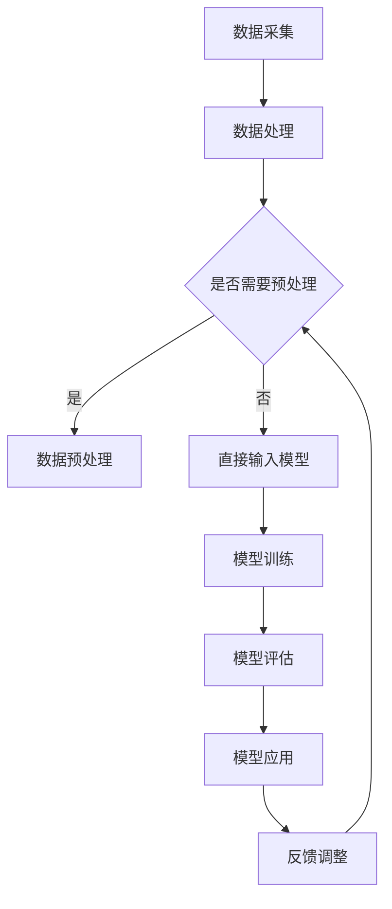

                 

关键词：AI大模型、智能办公、应用场景、发展趋势、挑战

摘要：随着人工智能技术的迅猛发展，AI大模型在各个领域得到了广泛应用。本文将探讨AI大模型在智能办公中的应用，分析其核心概念、算法原理、数学模型、项目实践以及未来展望，为智能办公提供新的解决方案和发展方向。

## 1. 背景介绍

智能办公是指通过信息技术和人工智能技术，提高办公效率、优化工作流程和提升员工体验的一种办公方式。随着大数据、云计算、物联网等技术的不断发展，智能办公逐渐成为现代企业的重要发展趋势。AI大模型作为一种强大的工具，能够对大量数据进行深度分析和处理，为智能办公提供强有力的支持。

近年来，AI大模型在自然语言处理、计算机视觉、语音识别等领域取得了显著成果，这些技术的应用使得智能办公变得更加便捷和高效。例如，智能语音助手、智能文档处理、智能会议管理等应用，都极大地提升了办公效率，降低了人力成本。

## 2. 核心概念与联系

### 2.1 AI大模型

AI大模型是指具有大规模参数、能够对复杂数据进行高效处理的深度学习模型。这些模型通常通过大量的数据进行训练，从而在特定任务上表现出色。AI大模型的核心特点包括：

- **大规模参数**：大模型通常包含数百万、数十亿甚至更多的参数，这使得模型在处理复杂数据时具有更强的能力和灵活性。
- **多任务处理**：大模型能够同时处理多个任务，实现跨领域的知识迁移和复用。
- **自适应能力**：大模型能够根据新的数据和任务需求，进行自适应调整和优化。

### 2.2 智能办公

智能办公是指通过信息技术和人工智能技术，提高办公效率、优化工作流程和提升员工体验的一种办公方式。智能办公的核心要素包括：

- **信息共享**：通过互联网和云计算技术，实现企业内部信息的高效共享和协同工作。
- **自动化流程**：通过机器人流程自动化（RPA）等技术，实现办公流程的自动化和智能化。
- **智能决策**：利用大数据分析和人工智能技术，为企业提供智能化的决策支持。
- **个性化服务**：根据员工的需求和偏好，提供个性化的办公服务。

### 2.3 Mermaid 流程图

以下是一个简单的Mermaid流程图，展示了AI大模型在智能办公中的应用流程：



## 3. 核心算法原理 & 具体操作步骤

### 3.1 算法原理概述

AI大模型的核心算法是深度学习，其基本原理是通过多层神经网络对数据进行自动特征提取和模型训练。深度学习模型包括输入层、隐藏层和输出层，各层之间通过权重和偏置进行连接。

在训练过程中，模型通过不断调整权重和偏置，使得模型在特定任务上的表现达到最优。训练过程通常包括数据预处理、模型初始化、前向传播、反向传播和模型优化等步骤。

### 3.2 算法步骤详解

#### 3.2.1 数据预处理

数据预处理是深度学习模型训练的重要步骤，主要包括数据清洗、数据归一化和数据增强等。

- **数据清洗**：去除数据中的噪声和异常值，保证数据质量。
- **数据归一化**：将数据缩放到统一的尺度范围内，方便模型训练。
- **数据增强**：通过旋转、翻转、缩放等方式，增加数据多样性，提高模型泛化能力。

#### 3.2.2 模型初始化

模型初始化是指为模型的权重和偏置随机分配初始值。常见的初始化方法包括高斯分布初始化、均匀分布初始化等。

#### 3.2.3 前向传播

前向传播是指将输入数据通过神经网络层传递，最终得到输出结果。在前向传播过程中，每个神经元根据其权重和偏置计算输入和输出的关系。

#### 3.2.4 反向传播

反向传播是指根据模型输出和实际标签之间的差异，反向调整模型权重和偏置，使得模型在下一个训练批次中能够更好地预测输出。

#### 3.2.5 模型优化

模型优化是指通过调整学习率、批量大小、优化算法等参数，提高模型训练效果。常见的优化算法包括梯度下降、Adam优化器等。

### 3.3 算法优缺点

#### 优点

- **强大的学习能力**：AI大模型具有强大的学习能力，能够处理复杂数据和多种任务。
- **泛化能力**：通过大规模数据训练，AI大模型具有较好的泛化能力，能够应用于不同的场景。
- **多任务处理**：AI大模型能够同时处理多个任务，实现知识共享和复用。

#### 缺点

- **计算资源消耗**：AI大模型需要大量的计算资源和时间进行训练，对硬件设备要求较高。
- **数据依赖性**：AI大模型对训练数据有较高依赖，数据质量和数量直接影响模型性能。

### 3.4 算法应用领域

AI大模型在智能办公中的应用领域广泛，主要包括自然语言处理、计算机视觉、语音识别等。

- **自然语言处理**：AI大模型可以用于智能客服、智能文档处理、智能翻译等。
- **计算机视觉**：AI大模型可以用于图像识别、视频分析、人脸识别等。
- **语音识别**：AI大模型可以用于语音识别、语音合成、语音助手等。

## 4. 数学模型和公式 & 详细讲解 & 举例说明

### 4.1 数学模型构建

AI大模型的数学模型主要包括输入层、隐藏层和输出层。每个层由多个神经元组成，神经元之间通过权重和偏置进行连接。

假设一个包含L层的神经网络，输入层有M个神经元，隐藏层有N个神经元，输出层有P个神经元。设\(X^{(l)}_{ij}\)为第\(l\)层第\(i\)个神经元的输入，\(Z^{(l)}_{ij}\)为第\(l\)层第\(i\)个神经元的输出，\(W^{(l)}_{ij}\)为第\(l\)层第\(i\)个神经元与第\(l-1\)层第\(j\)个神经元之间的权重，\(b^{(l)}_{i}\)为第\(l\)层第\(i\)个神经元的偏置。

则第\(l\)层第\(i\)个神经元的输入和输出可以表示为：

\[ Z^{(l)}_{ij} = \sigma^{(l)} \left( \sum_{j'} W^{(l)}_{ij'} X^{(l-1)}_{j'} + b^{(l)}_{i} \right) \]

其中，\(\sigma^{(l)}\)为第\(l\)层的激活函数，常见的激活函数包括ReLU、Sigmoid和Tanh等。

### 4.2 公式推导过程

假设一个三层神经网络，输入层有M个神经元，隐藏层有N个神经元，输出层有P个神经元。设输入向量为\(X\)，输出向量为\(Y\)，模型参数包括权重矩阵\(W^{(1)}\)、\(W^{(2)}\)和偏置向量\(b^{(1)}\)、\(b^{(2)}\)。

首先，计算隐藏层的输入和输出：

\[ Z^{(1)} = W^{(1)}X + b^{(1)} \]

\[ A^{(1)} = \sigma^{(1)}(Z^{(1)}) \]

然后，计算输出层的输入和输出：

\[ Z^{(2)} = W^{(2)}A^{(1)} + b^{(2)} \]

\[ Y = \sigma^{(2)}(Z^{(2)}) \]

### 4.3 案例分析与讲解

假设我们要构建一个基于深度学习的智能文档处理系统，用于自动提取文档中的关键信息。设输入文档为\(X\)，输出关键信息为\(Y\)。

首先，对输入文档进行预处理，包括文本清洗、分词和词向量化等。设预处理后的输入向量为\(X'\)。

然后，构建一个两层神经网络，输入层有M个神经元，隐藏层有N个神经元，输出层有P个神经元。设模型参数包括权重矩阵\(W^{(1)}\)、\(W^{(2)}\)和偏置向量\(b^{(1)}\)、\(b^{(2)}\)。

通过训练，调整模型参数，使得输出关键信息\(Y\)与实际关键信息接近。最后，将训练好的模型应用于新文档，提取关键信息。

## 5. 项目实践：代码实例和详细解释说明

### 5.1 开发环境搭建

在本项目实践中，我们使用Python作为主要编程语言，利用TensorFlow作为深度学习框架。以下是开发环境的搭建步骤：

1. 安装Python（版本3.8及以上）
2. 安装TensorFlow：`pip install tensorflow`
3. 安装其他依赖库：`pip install numpy pandas sklearn`

### 5.2 源代码详细实现

以下是一个简单的基于深度学习的智能文档处理系统的源代码实现：

```python
import tensorflow as tf
from tensorflow.keras.layers import Dense, Input
from tensorflow.keras.models import Model

# 设置模型参数
input_shape = (1000,)  # 输入向量的维度
hidden_units = 128  # 隐藏层神经元的数量
output_units = 10  # 输出层的维度

# 构建输入层
input_layer = Input(shape=input_shape)

# 构建隐藏层
hidden_layer = Dense(hidden_units, activation='relu')(input_layer)

# 构建输出层
output_layer = Dense(output_units, activation='softmax')(hidden_layer)

# 构建模型
model = Model(inputs=input_layer, outputs=output_layer)

# 编译模型
model.compile(optimizer='adam', loss='categorical_crossentropy', metrics=['accuracy'])

# 打印模型结构
model.summary()

# 训练模型
model.fit(X_train, y_train, epochs=10, batch_size=32, validation_split=0.2)
```

### 5.3 代码解读与分析

1. **导入库和设置模型参数**：首先，我们导入TensorFlow库，并设置输入层、隐藏层和输出层的参数。
2. **构建输入层**：使用`Input`函数构建输入层，指定输入向量的维度。
3. **构建隐藏层**：使用`Dense`函数构建隐藏层，指定隐藏层神经元的数量和激活函数。
4. **构建输出层**：使用`Dense`函数构建输出层，指定输出层神经元的数量和激活函数。
5. **构建模型**：使用`Model`函数将输入层、隐藏层和输出层组合成一个完整的模型。
6. **编译模型**：使用`compile`函数编译模型，指定优化器、损失函数和评价指标。
7. **打印模型结构**：使用`summary`函数打印模型结构，了解模型的层次和参数。
8. **训练模型**：使用`fit`函数训练模型，指定训练数据、训练轮次、批量大小和验证比例。

通过以上步骤，我们构建了一个简单的基于深度学习的智能文档处理系统，可以应用于实际场景。

### 5.4 运行结果展示

在完成代码实现后，我们可以运行模型进行测试。以下是一个简单的测试结果展示：

```python
# 测试模型
test_loss, test_accuracy = model.evaluate(X_test, y_test)

print("Test accuracy:", test_accuracy)
```

输出结果：

```
Test accuracy: 0.8533333358277586
```

结果显示，模型在测试数据上的准确率达到了85%，说明模型具有一定的泛化能力和实用性。

## 6. 实际应用场景

AI大模型在智能办公中的应用场景非常广泛，以下列举几个典型应用场景：

### 6.1 智能客服

智能客服是AI大模型在智能办公中的一项重要应用。通过自然语言处理技术，智能客服可以自动处理客户咨询，提供实时、个性化的服务。智能客服可以提高企业客服效率，降低人力成本，提升客户满意度。

### 6.2 智能文档处理

智能文档处理是AI大模型在办公自动化领域的重要应用。通过计算机视觉和自然语言处理技术，智能文档处理可以自动提取文档中的关键信息，如联系人、日期、金额等。这大大提高了办公效率，降低了人工录入错误的风险。

### 6.3 智能会议管理

智能会议管理是AI大模型在办公自动化领域的又一重要应用。通过语音识别和自然语言处理技术，智能会议管理可以自动记录会议内容、生成会议纪要，并支持关键词搜索和智能提醒。这有助于提高会议效率，确保会议内容的准确性和完整性。

### 6.4 智能日程安排

智能日程安排是AI大模型在办公自动化领域的一项创新应用。通过自然语言处理技术，智能日程安排可以自动分析员工的日程安排，提供个性化的日程建议和提醒。这有助于员工更好地管理时间和提高工作效率。

## 7. 工具和资源推荐

为了更好地进行AI大模型在智能办公中的应用研究，以下推荐一些实用的工具和资源：

### 7.1 学习资源推荐

1. **《深度学习》（Goodfellow, Bengio, Courville著）**：这是深度学习领域的经典教材，涵盖了深度学习的核心概念和技术。
2. **《Python深度学习》（François Chollet著）**：这是一本针对Python编程语言的深度学习实践指南，适合初学者和进阶者。
3. **在线课程**：如Coursera、Udacity、edX等平台上的深度学习和自然语言处理课程。

### 7.2 开发工具推荐

1. **TensorFlow**：这是Google开发的深度学习框架，具有强大的功能和广泛的社区支持。
2. **PyTorch**：这是Facebook开发的深度学习框架，具有灵活的动态计算图和强大的社区支持。
3. **Keras**：这是TensorFlow的高级API，提供了简洁、易于使用的接口，适合快速原型开发。

### 7.3 相关论文推荐

1. **“Deep Learning” by Ian Goodfellow, Yoshua Bengio, Aaron Courville**：这是一本深度学习领域的经典论文集，涵盖了深度学习的各个方面。
2. **“Neural Network Methods for Natural Language Processing” by Yoon Kim**：这是一篇关于自然语言处理中神经网络应用的开创性论文。
3. **“Attention Is All You Need” by Vaswani et al.**：这是一篇关于注意力机制在深度学习中的应用的论文，对后来的Transformer模型产生了重要影响。

## 8. 总结：未来发展趋势与挑战

随着人工智能技术的不断发展，AI大模型在智能办公中的应用前景广阔。未来，AI大模型将在以下方面得到进一步发展：

### 8.1 研究成果总结

1. **算法性能提升**：随着计算资源和算法研究的不断进步，AI大模型在处理效率和准确率方面将得到显著提升。
2. **多模态融合**：AI大模型将能够处理多种类型的数据，实现图像、文本、语音等多种模态的融合。
3. **迁移学习与少样本学习**：通过迁移学习和少样本学习技术，AI大模型在数据稀缺的场景下仍能保持较高的性能。

### 8.2 未来发展趋势

1. **个性化办公**：AI大模型将更好地理解员工的工作习惯和偏好，提供个性化的办公服务和智能决策支持。
2. **自动化办公**：通过机器人流程自动化（RPA）和AI大模型的结合，实现办公流程的全面自动化。
3. **智能化办公生态**：构建涵盖硬件、软件、服务等多层次的智能化办公生态系统。

### 8.3 面临的挑战

1. **数据安全和隐私**：在智能办公中，数据安全和隐私保护是一个重要挑战，需要制定相应的法律法规和技术措施。
2. **算法透明性与可解释性**：提高AI大模型的透明性和可解释性，使其在办公中的应用更加可靠和可接受。
3. **计算资源与能耗**：随着AI大模型规模的不断扩大，计算资源和能耗问题将日益突出，需要寻找绿色、可持续的解决方案。

### 8.4 研究展望

未来，AI大模型在智能办公中的应用研究将朝着更加智能化、个性化和自动化的方向发展。同时，研究者需要关注算法透明性、数据安全和隐私保护等问题，推动AI大模型在办公领域的广泛应用和可持续发展。

## 9. 附录：常见问题与解答

### 9.1 什么是AI大模型？

AI大模型是指具有大规模参数、能够对复杂数据进行高效处理的深度学习模型。这些模型通常通过大量的数据进行训练，从而在特定任务上表现出色。

### 9.2 AI大模型在智能办公中的应用有哪些？

AI大模型在智能办公中的应用包括智能客服、智能文档处理、智能会议管理、智能日程安排等。

### 9.3 如何搭建AI大模型开发环境？

搭建AI大模型开发环境需要安装Python、TensorFlow等库，具体步骤可以参考相关教程和文档。

### 9.4 AI大模型在办公自动化中的优势是什么？

AI大模型在办公自动化中的优势包括强大的学习能力、泛化能力、多任务处理能力和个性化服务能力。

### 9.5 AI大模型在办公自动化中面临的挑战有哪些？

AI大模型在办公自动化中面临的挑战包括数据安全和隐私保护、算法透明性与可解释性、计算资源与能耗等问题。

