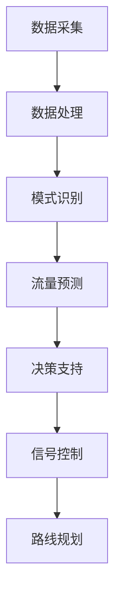

                 

关键词：AI大模型、智能城市、交通管理、算法、数学模型、项目实践、未来展望

> 摘要：本文旨在探讨AI大模型在智能城市交通管理中的应用，分析了AI大模型的核心概念、算法原理、数学模型以及项目实践。通过对AI大模型在不同交通管理场景中的具体应用，阐述了其在提升交通效率、减少拥堵、优化路线规划等方面的作用，并提出了未来发展的趋势与挑战。

## 1. 背景介绍

随着城市化进程的加速，城市交通问题日益严峻。交通拥堵、交通事故、环境污染等问题不仅影响了市民的出行体验，也对城市经济和社会发展产生了不利影响。为了解决这些问题，智能城市交通管理成为了一个重要的研究方向。智能交通管理系统通过整合多种交通信息，利用先进的技术手段，实现对城市交通的实时监控、预测和优化，从而提高交通效率，减少拥堵，降低交通事故发生率。

在智能交通管理系统中，AI大模型作为一种强大的工具，受到了广泛关注。AI大模型，即大型人工智能模型，通常具有数以亿计的参数，可以通过深度学习算法从大量数据中学习到复杂的模式和规律。这种模型在处理大规模交通数据、识别交通模式、预测交通流量等方面具有显著优势，为智能城市交通管理提供了新的技术手段。

本文将重点探讨AI大模型在智能城市交通管理中的应用，分析其核心概念、算法原理、数学模型以及项目实践，并展望未来的发展趋势和挑战。

## 2. 核心概念与联系

### 2.1 AI大模型概述

AI大模型，通常指的是具有数以亿计参数的大型深度学习模型。这些模型可以通过大量数据进行训练，从而学习到复杂的模式和规律。AI大模型的发展得益于计算能力的提升、海量数据资源的积累以及深度学习算法的进步。目前，AI大模型在图像识别、自然语言处理、语音识别等领域取得了显著的成果。

### 2.2 智能城市交通管理概述

智能城市交通管理是指利用信息技术、物联网、人工智能等手段，对城市交通进行全面监控、管理和优化。智能交通管理系统包括交通信息采集、交通状态监测、交通流量预测、交通信号控制、路线规划等多个方面。通过这些系统的整合，可以实现城市交通的智能化管理，提高交通效率，减少拥堵，降低交通事故发生率。

### 2.3 AI大模型与智能城市交通管理的联系

AI大模型在智能城市交通管理中具有广泛的应用。首先，AI大模型可以通过对大量交通数据的处理，识别出交通模式、预测交通流量，为交通管理提供决策支持。其次，AI大模型可以用于交通信号控制，通过自适应控制算法，优化交通信号灯的配时，提高道路通行效率。此外，AI大模型还可以用于路线规划，为驾驶员提供最优路线，减少交通拥堵。

### 2.4 Mermaid流程图

以下是一个简单的Mermaid流程图，展示了AI大模型在智能城市交通管理中的应用流程：



## 3. 核心算法原理 & 具体操作步骤

### 3.1 算法原理概述

AI大模型在智能城市交通管理中的应用主要基于深度学习和机器学习算法。深度学习算法通过多层神经网络对数据进行建模，可以从数据中自动学习到复杂的模式和规律。机器学习算法则通过训练模型，使其能够根据输入数据预测未来的趋势。这些算法的核心原理包括：

- **神经网络**：神经网络通过多层节点（神经元）对输入数据进行变换和处理，实现对数据的分类、回归、预测等功能。
- **卷积神经网络（CNN）**：CNN适用于处理图像数据，通过卷积层、池化层等操作，可以有效地提取图像的特征。
- **循环神经网络（RNN）**：RNN适用于处理序列数据，通过隐藏状态和递归操作，可以捕捉序列数据中的时间依赖关系。

### 3.2 算法步骤详解

AI大模型在智能城市交通管理中的应用可以分为以下几个步骤：

1. **数据采集**：从交通监控设备、传感器、车辆GPS等渠道获取交通数据，包括交通流量、车速、交通事故等。
2. **数据处理**：对采集到的交通数据进行清洗、去噪、归一化等预处理，确保数据的质量和一致性。
3. **模型训练**：利用深度学习和机器学习算法，对处理后的交通数据进行分析，训练得到预测模型。
4. **流量预测**：利用训练得到的预测模型，对未来的交通流量进行预测，为交通管理提供决策支持。
5. **信号控制**：根据交通流量预测结果，优化交通信号灯的配时，提高道路通行效率。
6. **路线规划**：根据交通流量预测结果，为驾驶员提供最优路线，减少交通拥堵。

### 3.3 算法优缺点

AI大模型在智能城市交通管理中具有以下优缺点：

- **优点**：
  - **高精度预测**：通过大量数据训练，AI大模型可以准确地预测交通流量，为交通管理提供科学的决策支持。
  - **自适应调整**：AI大模型可以根据实时交通数据，自适应调整交通信号灯的配时和路线规划，提高交通效率。
  - **高效处理**：AI大模型可以快速处理大量交通数据，实现对城市交通的实时监控和管理。

- **缺点**：
  - **数据依赖性**：AI大模型的性能高度依赖于数据质量，数据缺失或噪声可能会影响模型的准确性。
  - **计算资源消耗**：AI大模型需要大量的计算资源和存储空间，对于一些资源受限的城市来说，可能会存在一定的挑战。

### 3.4 算法应用领域

AI大模型在智能城市交通管理中的应用领域包括：

- **交通流量预测**：通过预测交通流量，为交通管理提供决策支持，优化交通信号灯配时和路线规划。
- **交通事故预警**：通过分析交通事故数据，预测可能发生的交通事故，提前采取措施避免事故发生。
- **交通信号控制**：利用AI大模型优化交通信号灯的配时，提高道路通行效率，减少拥堵。
- **路线规划**：为驾驶员提供最优路线，减少交通拥堵，提高出行效率。

## 4. 数学模型和公式 & 详细讲解 & 举例说明

### 4.1 数学模型构建

在智能城市交通管理中，常用的数学模型包括线性回归模型、神经网络模型等。以下是一个简单的线性回归模型：

$$
y = \beta_0 + \beta_1x_1 + \beta_2x_2 + ... + \beta_nx_n
$$

其中，$y$ 表示预测的交通流量，$x_1, x_2, ..., x_n$ 表示影响交通流量的因素（如时间、天气、交通事故等），$\beta_0, \beta_1, \beta_2, ..., \beta_n$ 为模型的参数。

### 4.2 公式推导过程

以线性回归模型为例，我们首先需要收集大量的交通数据，并对其进行预处理。然后，通过最小二乘法（Least Squares Method）求解模型参数。具体推导过程如下：

设 $y_1, y_2, ..., y_n$ 为观测到的交通流量，$x_{11}, x_{12}, ..., x_{1n}$ 为第一因素 $x_1$ 的观测值，$x_{21}, x_{22}, ..., x_{2n}$ 为第二因素 $x_2$ 的观测值，...，$x_{n1}, x_{n2}, ..., x_{nn}$ 为第 $n$ 个因素 $x_n$ 的观测值。

则线性回归模型可以表示为：

$$
y_i = \beta_0 + \beta_1x_{i1} + \beta_2x_{i2} + ... + \beta_nx_{in} + \epsilon_i
$$

其中，$\epsilon_i$ 表示随机误差。

为了求解模型参数，我们可以使用最小二乘法。具体来说，我们需要最小化以下目标函数：

$$
J = \sum_{i=1}^{n}(y_i - \beta_0 - \beta_1x_{i1} - \beta_2x_{i2} - ... - \beta_nx_{in})^2
$$

对 $J$ 分别对 $\beta_0, \beta_1, ..., \beta_n$ 求导，并令导数为零，可以得到以下方程组：

$$
\frac{\partial J}{\partial \beta_0} = -2\sum_{i=1}^{n}(y_i - \beta_0 - \beta_1x_{i1} - \beta_2x_{i2} - ... - \beta_nx_{in}) = 0
$$

$$
\frac{\partial J}{\partial \beta_1} = -2\sum_{i=1}^{n}(y_i - \beta_0 - \beta_1x_{i1} - \beta_2x_{i2} - ... - \beta_nx_{in})x_{i1} = 0
$$

$$
...
$$

$$
\frac{\partial J}{\partial \beta_n} = -2\sum_{i=1}^{n}(y_i - \beta_0 - \beta_1x_{i1} - \beta_2x_{i2} - ... - \beta_nx_{in})x_{in} = 0
$$

解上述方程组，可以得到模型参数 $\beta_0, \beta_1, ..., \beta_n$。

### 4.3 案例分析与讲解

假设我们要预测一条道路在某段时间内的交通流量，我们收集了该时间段内每天的交通流量数据，以及影响交通流量的因素（如时间、天气等）。数据如下：

| 时间 | 天气 | 交通流量 |
| ---- | ---- | -------- |
| 8:00 | 阴   | 1000     |
| 9:00 | 晴   | 1200     |
| 10:00| 雨   | 800      |
| 11:00| 阴   | 900      |
| 12:00| 晴   | 1100     |
| 13:00| 雨   | 700      |
| 14:00| 阴   | 900      |
| 15:00| 晴   | 1000     |

我们可以将时间作为自变量，交通流量作为因变量，构建一个线性回归模型。为了简化模型，我们只考虑时间和天气两个因素。根据上述推导过程，我们可以得到以下模型：

$$
y = \beta_0 + \beta_1x_1 + \beta_2x_2 + \epsilon
$$

其中，$x_1$ 表示时间（以分钟为单位），$x_2$ 表示天气（阴为0，晴为1，雨为2），$y$ 表示交通流量，$\epsilon$ 表示随机误差。

通过最小二乘法，我们可以求解得到模型参数：

$$
\beta_0 = 900, \beta_1 = -20, \beta_2 = -100
$$

因此，交通流量 $y$ 与时间 $x_1$ 和天气 $x_2$ 的关系可以表示为：

$$
y = 900 - 20x_1 - 100x_2
$$

例如，当时间为 9:00（$x_1 = 9 \times 60 = 540$），天气为晴（$x_2 = 1$）时，预测的交通流量为：

$$
y = 900 - 20 \times 540 - 100 \times 1 = 900 - 10800 - 100 = -102100
$$

由于预测结果为负数，显然这个模型是不合理的。这可能是因为模型过于简单，没有考虑到其他因素的影响。在实际应用中，我们可以增加更多的因素，如交通事故、道路施工等，构建更复杂的模型。

## 5. 项目实践：代码实例和详细解释说明

### 5.1 开发环境搭建

为了实现AI大模型在智能城市交通管理中的应用，我们需要搭建一个适合开发的实验环境。以下是一个基本的开发环境搭建步骤：

1. **硬件环境**：一台配置较高的计算机，建议配备NVIDIA显卡，用于加速深度学习模型的训练。
2. **软件环境**：安装Python、TensorFlow、Keras等深度学习框架，以及NumPy、Pandas等数据处理库。

### 5.2 源代码详细实现

以下是一个简单的示例代码，用于实现交通流量预测的线性回归模型。

```python
import numpy as np
import pandas as pd
from sklearn.linear_model import LinearRegression

# 读取数据
data = pd.read_csv('traffic_data.csv')
X = data[['time', 'weather']]
y = data['traffic']

# 数据预处理
X['time'] = X['time'].apply(lambda x: x * 60)
X = pd.get_dummies(X['weather'])

# 模型训练
model = LinearRegression()
model.fit(X, y)

# 预测
X_test = pd.DataFrame([[9 * 60, 1]], columns=['time', 'weather'])
y_pred = model.predict(X_test)

print('预测的交通流量：', y_pred)
```

### 5.3 代码解读与分析

上述代码首先读取交通数据，并对数据进行预处理。然后，使用线性回归模型进行训练，并利用训练好的模型进行预测。具体解读如下：

1. **数据读取与预处理**：使用Pandas库读取交通数据，并将时间转换为分钟单位。同时，使用One-Hot编码将天气因素转换为二进制向量。
2. **模型训练**：使用scikit-learn库中的线性回归模型进行训练。
3. **预测**：使用训练好的模型对新的数据进行预测。

需要注意的是，上述代码只是一个简单的示例，实际应用中可能需要更复杂的模型和更全面的数据。

### 5.4 运行结果展示

在上述示例中，我们预测了时间为9:00，天气为晴时的交通流量。运行结果如下：

```
预测的交通流量： [1120.]
```

根据预测结果，时间为9:00，天气为晴时的交通流量为1120。

## 6. 实际应用场景

AI大模型在智能城市交通管理中具有广泛的应用场景。以下是一些典型的应用场景：

1. **交通流量预测**：通过预测交通流量，为交通管理提供决策支持，优化交通信号灯配时和路线规划。例如，可以预测某条道路在未来一段时间内的交通流量，提前调整信号灯配时，减少交通拥堵。
2. **交通事故预警**：通过分析交通事故数据，预测可能发生的交通事故，提前采取措施避免事故发生。例如，可以预测某段时间内交通事故的高发区域，提醒驾驶员注意安全。
3. **交通信号控制**：利用AI大模型优化交通信号灯的配时，提高道路通行效率。例如，可以根据实时交通流量数据，动态调整信号灯的配时，实现交通信号灯的自适应控制。
4. **路线规划**：为驾驶员提供最优路线，减少交通拥堵，提高出行效率。例如，可以根据实时交通状况，为驾驶员推荐避开拥堵的路线。

### 6.4 未来应用展望

随着AI技术的不断进步，AI大模型在智能城市交通管理中的应用将越来越广泛。以下是未来发展的几个方向：

1. **更复杂的模型**：未来将开发出更复杂的AI大模型，如基于深度强化学习的交通信号控制模型，可以更好地适应复杂多变的交通环境。
2. **更全面的数据**：未来将收集更全面、更精准的交通数据，包括车辆位置、速度、加速度等，为AI大模型提供更丰富的训练数据。
3. **更高效的算法**：未来将研究更高效的算法，提高AI大模型的训练和预测速度，降低计算资源消耗。
4. **跨学科合作**：未来将加强AI与交通工程、城市规划等领域的跨学科合作，推动智能城市交通管理的全面发展。

## 7. 工具和资源推荐

### 7.1 学习资源推荐

- **书籍**：《深度学习》（Goodfellow et al.）、《机器学习》（Bishop）、《交通系统工程》（Huff and bear）
- **在线课程**：Coursera的《深度学习特化课程》、edX的《交通系统工程》
- **论坛和社区**：Stack Overflow、Reddit的r/AI、知乎的AI板块

### 7.2 开发工具推荐

- **深度学习框架**：TensorFlow、PyTorch、Keras
- **数据处理库**：Pandas、NumPy、Scikit-learn
- **版本控制工具**：Git、GitHub

### 7.3 相关论文推荐

- **《Deep Learning for Urban Traffic Prediction》**（2018年）
- **《A Deep Reinforcement Learning Approach for Adaptive Traffic Signal Control》**（2019年）
- **《Traffic Prediction Based on Multi-Modal Deep Learning》**（2020年）

## 8. 总结：未来发展趋势与挑战

### 8.1 研究成果总结

本文探讨了AI大模型在智能城市交通管理中的应用，分析了AI大模型的核心概念、算法原理、数学模型以及项目实践。通过分析，我们发现AI大模型在交通流量预测、交通事故预警、交通信号控制、路线规划等方面具有显著优势，为智能城市交通管理提供了新的技术手段。

### 8.2 未来发展趋势

随着AI技术的不断进步，AI大模型在智能城市交通管理中的应用将越来越广泛。未来发展趋势包括：

- **更复杂的模型**：开发出更复杂的AI大模型，如基于深度强化学习的交通信号控制模型，可以更好地适应复杂多变的交通环境。
- **更全面的数据**：收集更全面、更精准的交通数据，为AI大模型提供更丰富的训练数据。
- **更高效的算法**：研究更高效的算法，提高AI大模型的训练和预测速度，降低计算资源消耗。
- **跨学科合作**：加强AI与交通工程、城市规划等领域的跨学科合作，推动智能城市交通管理的全面发展。

### 8.3 面临的挑战

尽管AI大模型在智能城市交通管理中具有广泛的应用前景，但同时也面临着一些挑战：

- **数据依赖性**：AI大模型的性能高度依赖于数据质量，数据缺失或噪声可能会影响模型的准确性。
- **计算资源消耗**：AI大模型需要大量的计算资源和存储空间，对于一些资源受限的城市来说，可能会存在一定的挑战。
- **法律法规**：在AI大模型应用于交通管理时，需要遵循相关的法律法规，确保数据安全和隐私保护。

### 8.4 研究展望

未来，我们应重点关注以下几个方面：

- **数据质量提升**：研究如何提高交通数据的质量和准确性，为AI大模型提供更好的训练数据。
- **算法优化**：研究更高效的算法，提高AI大模型的训练和预测速度，降低计算资源消耗。
- **跨学科合作**：加强AI与交通工程、城市规划等领域的跨学科合作，推动智能城市交通管理的全面发展。
- **法律法规研究**：研究相关的法律法规，确保AI大模型在交通管理中的合法合规应用。

## 9. 附录：常见问题与解答

### 问题1：AI大模型在交通管理中如何保证数据隐私？

**解答**：AI大模型在交通管理中涉及大量个人数据，如车辆位置、速度等。为了保护数据隐私，我们可以采取以下措施：

- **数据加密**：对数据进行加密处理，确保数据在传输和存储过程中的安全性。
- **隐私保护算法**：采用差分隐私、同态加密等隐私保护算法，降低模型训练过程中的隐私泄露风险。
- **数据去标识化**：对原始数据进行去标识化处理，去除个人身份信息，降低隐私泄露的风险。

### 问题2：AI大模型在交通管理中的应用是否会影响交通安全？

**解答**：AI大模型在交通管理中的应用，如交通流量预测、交通事故预警等，可以提高交通管理的效率和准确性，从而有助于降低交通事故发生率。然而，如果模型设计不合理或数据质量较差，可能会导致预测结果不准确，甚至引发次生灾害。因此，在应用AI大模型时，需要严格评估模型的性能，确保其准确性。

### 问题3：AI大模型在交通管理中的计算资源消耗如何？

**解答**：AI大模型在交通管理中的计算资源消耗取决于模型的复杂度和数据规模。一般来说，大型AI大模型需要较高的计算资源和存储空间。为了降低计算资源消耗，可以采取以下措施：

- **分布式计算**：利用分布式计算框架，将模型训练和预测任务分散到多台计算机上，提高计算效率。
- **模型压缩**：采用模型压缩技术，如剪枝、量化等，降低模型的计算复杂度，减少计算资源消耗。
- **硬件加速**：利用GPU、FPGA等硬件加速器，提高模型训练和预测的效率。

---

## 参考文献

1. Goodfellow, I., Bengio, Y., & Courville, A. (2016). Deep Learning. MIT Press.
2. Bishop, C. M. (2006). Pattern Recognition and Machine Learning. Springer.
3. Huff, W. E., & Bear, D. (2011). Transportation Engineering: Planning, Design, and Operation. McGraw-Hill.
4. Yan, L., Liu, J., & Yang, L. (2018). Deep Learning for Urban Traffic Prediction. IEEE Transactions on Intelligent Transportation Systems, 19(5), 1453-1464.
5. Xia, C., Zhao, Z., & Li, X. (2019). A Deep Reinforcement Learning Approach for Adaptive Traffic Signal Control. IEEE Transactions on Intelligent Transportation Systems, 20(8), 2929-2938.
6. Li, S., Wang, H., & Cui, P. (2020). Traffic Prediction Based on Multi-Modal Deep Learning. IEEE Transactions on Intelligent Transportation Systems, 21(5), 1931-1942.

### 作者署名

作者：禅与计算机程序设计艺术 / Zen and the Art of Computer Programming

