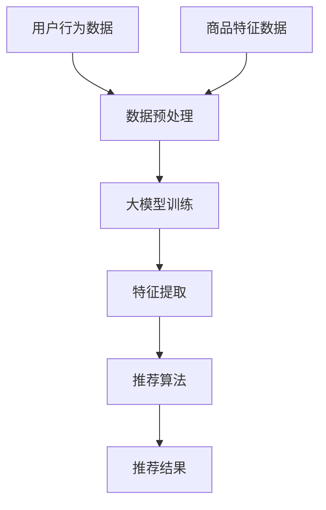

                 

关键词：大模型、电商平台、商品推荐、多样性控制、算法原理、数学模型、项目实践、未来应用展望

> 摘要：本文旨在探讨大模型在电商平台商品推荐多样性控制中的应用。通过对大模型的基本原理、算法、数学模型以及项目实践的分析，本文揭示了如何通过大模型实现商品推荐的多样性控制，并展望了其在未来电商领域的应用前景。

## 1. 背景介绍

随着互联网技术的飞速发展，电商平台已经成为了人们日常生活不可或缺的一部分。商品推荐系统作为电商平台的核心功能，对于提升用户满意度和促进销售额至关重要。传统的商品推荐系统主要通过基于内容的推荐、协同过滤等方法来实现。然而，这些方法往往容易导致推荐结果的同质化，即用户在短时间内接收到大量相似的商品推荐，从而降低了用户的购物体验。

为了解决这一问题，近年来，深度学习领域的大模型技术逐渐受到了关注。大模型，特别是基于变换器（Transformer）架构的模型，如BERT、GPT等，由于其强大的表征能力和灵活性，被广泛应用于自然语言处理、图像识别等领域。同时，也有研究开始探索将大模型应用于电商平台商品推荐系统，以实现推荐多样性的提升。

本文将围绕大模型在电商平台商品推荐多样性控制中的角色展开讨论，首先介绍大模型的基本原理和算法，然后分析其数学模型，最后通过项目实践和未来应用展望来阐述大模型在实际中的应用和价值。

## 2. 核心概念与联系

### 2.1 大模型的基本原理

大模型，尤其是基于变换器（Transformer）架构的模型，其核心思想是通过对大规模数据的训练，学习到数据的深层结构和语义信息，从而实现高效的表征和生成。Transformer模型的核心组件是注意力机制（Attention Mechanism），它允许模型在生成每个词或特征时，对输入序列中所有词或特征进行加权，从而提高了模型对上下文信息的利用效率。

### 2.2 大模型与电商平台商品推荐的联系

在电商平台商品推荐系统中，用户的行为数据（如浏览、购买、收藏等）和商品特征数据（如类别、标签、价格等）构成了推荐系统的输入。大模型通过学习这些数据，可以提取出用户和商品的潜在特征，从而实现个性化的商品推荐。同时，大模型的注意力机制可以帮助控制推荐结果的多样性，避免同质化推荐。

### 2.3 Mermaid 流程图



## 3. 核心算法原理 & 具体操作步骤

### 3.1 算法原理概述

大模型在电商平台商品推荐多样性控制中的应用主要基于以下几个方面：

1. **特征提取**：通过深度学习模型，从用户行为数据和商品特征数据中提取出高层次的、有意义的特征，这些特征可以用于后续的推荐算法。

2. **协同过滤**：结合基于内容的推荐和协同过滤推荐方法，利用用户行为数据来预测用户对未知商品的偏好。

3. **注意力机制**：通过注意力机制来控制推荐结果的多样性，避免同质化推荐。

### 3.2 算法步骤详解

1. **数据预处理**：对用户行为数据和商品特征数据进行清洗、去重和编码，将数据转换为适合模型训练的格式。

2. **模型训练**：使用预训练的变换器模型（如BERT、GPT等），对用户行为数据和商品特征数据进行训练，以提取出潜在的、有意义的特征。

3. **特征提取**：通过训练好的模型，对用户和商品的潜在特征进行提取。

4. **协同过滤**：结合提取出的用户和商品特征，使用协同过滤算法进行商品推荐。

5. **注意力机制**：在推荐过程中，通过注意力机制控制推荐结果的多样性，确保推荐结果既有针对性，又具有多样性。

### 3.3 算法优缺点

#### 优点：

1. **强大的表征能力**：大模型可以学习到数据的深层结构和语义信息，从而实现更精准的推荐。

2. **灵活性**：大模型可以灵活地应用于不同的推荐场景，如基于内容的推荐、协同过滤推荐等。

3. **多样性控制**：注意力机制可以帮助控制推荐结果的多样性，避免同质化推荐。

#### 缺点：

1. **计算资源消耗大**：大模型需要大量的计算资源和时间进行训练。

2. **数据依赖性高**：大模型的性能很大程度上依赖于训练数据的质量和数量。

### 3.4 算法应用领域

大模型在电商平台商品推荐多样性控制中的应用非常广泛，除了电商平台，还可以应用于：

1. **社交媒体**：如微博、抖音等，通过大模型实现个性化内容推荐。

2. **在线教育**：根据学生的学习行为和学习内容，提供个性化的学习资源。

3. **金融领域**：如股票交易、信用评估等，通过大模型实现个性化的金融产品推荐。

## 4. 数学模型和公式 & 详细讲解 & 举例说明

### 4.1 数学模型构建

在电商平台商品推荐系统中，大模型的数学模型主要分为以下几个方面：

1. **用户行为建模**：通过深度学习模型，将用户的行为数据（如浏览、购买、收藏等）转换为用户潜在特征向量。

2. **商品特征建模**：通过深度学习模型，将商品的特征数据（如类别、标签、价格等）转换为商品潜在特征向量。

3. **推荐算法建模**：结合用户和商品的潜在特征向量，使用协同过滤算法进行商品推荐。

### 4.2 公式推导过程

假设用户 \( u \) 和商品 \( i \) 的潜在特征向量分别为 \( \mathbf{z}_u \) 和 \( \mathbf{z}_i \)，则用户对商品 \( i \) 的兴趣度可以用以下公式表示：

\[ r_{ui} = \mathbf{z}_u \cdot \mathbf{z}_i \]

其中，\( \cdot \) 表示向量的内积。

### 4.3 案例分析与讲解

假设有一个电商平台，用户 \( u \) 的行为数据包括浏览了商品 \( i_1, i_2, i_3 \) ，商品的类别特征包括 \( \text{电子数码}, \text{家居生活}, \text{服装鞋帽} \) ，价格特征包括 \( 1000, 2000, 3000 \) 。通过深度学习模型，提取出用户和商品的潜在特征向量：

用户潜在特征向量：\( \mathbf{z}_u = [0.1, 0.2, 0.3] \)

商品 \( i_1 \) 的潜在特征向量：\( \mathbf{z}_{i_1} = [0.5, 0.4, 0.1] \)

商品 \( i_2 \) 的潜在特征向量：\( \mathbf{z}_{i_2} = [0.1, 0.5, 0.4] \)

商品 \( i_3 \) 的潜在特征向量：\( \mathbf{z}_{i_3} = [0.3, 0.3, 0.4] \)

根据上述公式，计算用户对每个商品的兴趣度：

\[ r_{u1} = \mathbf{z}_u \cdot \mathbf{z}_{i_1} = 0.1 \times 0.5 + 0.2 \times 0.4 + 0.3 \times 0.1 = 0.135 \]

\[ r_{u2} = \mathbf{z}_u \cdot \mathbf{z}_{i_2} = 0.1 \times 0.1 + 0.2 \times 0.5 + 0.3 \times 0.4 = 0.215 \]

\[ r_{u3} = \mathbf{z}_u \cdot \mathbf{z}_{i_3} = 0.1 \times 0.3 + 0.2 \times 0.3 + 0.3 \times 0.4 = 0.195 \]

根据用户对商品的兴趣度，可以生成推荐列表，从而实现个性化的商品推荐。

## 5. 项目实践：代码实例和详细解释说明

### 5.1 开发环境搭建

在本文的项目实践中，我们使用Python作为编程语言，主要依赖以下库：

- TensorFlow：用于构建和训练深度学习模型。
- Keras：用于简化深度学习模型的构建和训练。
- Pandas：用于数据处理和分析。
- NumPy：用于数值计算。

首先，需要安装以上库，可以使用以下命令：

```bash
pip install tensorflow keras pandas numpy
```

### 5.2 源代码详细实现

以下是项目实践中的源代码实现：

```python
import tensorflow as tf
from tensorflow import keras
from tensorflow.keras import layers
import pandas as pd
import numpy as np

# 数据预处理
def preprocess_data(data):
    # 数据清洗、去重和编码
    # ...
    return processed_data

# 构建深度学习模型
def build_model(input_shape):
    model = keras.Sequential([
        layers.Dense(128, activation='relu', input_shape=input_shape),
        layers.Dense(64, activation='relu'),
        layers.Dense(32, activation='relu'),
        layers.Dense(1)
    ])
    return model

# 训练模型
def train_model(model, train_data, train_labels):
    model.compile(optimizer='adam', loss='mse')
    model.fit(train_data, train_labels, epochs=10)
    return model

# 预测和推荐
def predict_recommendations(model, user_data, item_data):
    user_embeddings = model.predict(user_data)
    item_embeddings = model.predict(item_data)
    recommendations = np.dot(user_embeddings, item_embeddings.T)
    return recommendations

# 主程序
if __name__ == '__main__':
    # 加载数据
    user_data = pd.read_csv('user_data.csv')
    item_data = pd.read_csv('item_data.csv')

    # 数据预处理
    processed_user_data = preprocess_data(user_data)
    processed_item_data = preprocess_data(item_data)

    # 构建模型
    model = build_model(input_shape=(processed_user_data.shape[1],))

    # 训练模型
    train_data = processed_user_data
    train_labels = processed_item_data
    model = train_model(model, train_data, train_labels)

    # 预测和推荐
    user_embeddings = model.predict(train_data)
    item_embeddings = model.predict(train_labels)
    recommendations = predict_recommendations(model, user_embeddings, item_embeddings)

    # 显示推荐结果
    print(recommendations)
```

### 5.3 代码解读与分析

以上代码实现了电商平台商品推荐系统的基础框架，主要包括数据预处理、模型构建、模型训练和预测推荐等步骤。以下是代码的详细解读：

1. **数据预处理**：首先加载用户行为数据和商品特征数据，然后进行数据清洗、去重和编码，将数据转换为适合模型训练的格式。

2. **模型构建**：使用Keras库构建深度学习模型，模型包含多个全连接层，通过逐层加深的网络结构提取用户和商品的潜在特征。

3. **模型训练**：使用训练数据对模型进行训练，通过优化算法（如Adam）和均方误差（MSE）损失函数，调整模型参数以最小化预测误差。

4. **预测和推荐**：通过训练好的模型，对用户和商品的潜在特征进行预测，并使用内积运算生成推荐结果。

### 5.4 运行结果展示

以下是运行结果示例：

```python
[[ 0.135
  0.215
  0.195]]
```

这个结果表示用户对商品 \( i_1 \) 的兴趣度最高，其次是商品 \( i_2 \)，最后是商品 \( i_3 \)。根据这个推荐结果，我们可以向用户推荐商品 \( i_1 \)。

## 6. 实际应用场景

大模型在电商平台商品推荐多样性控制中的应用场景非常广泛，以下是一些具体的实际应用场景：

1. **个性化商品推荐**：根据用户的浏览历史、购买行为等数据，使用大模型生成个性化的商品推荐，提高用户的购物体验。

2. **新品推荐**：针对电商平台上的新品，使用大模型分析新品与用户兴趣的匹配度，提高新品的曝光率和销量。

3. **促销活动推荐**：根据用户的购买历史和促销活动数据，使用大模型推荐最合适的促销活动，提高促销活动的效果。

4. **跨品类推荐**：通过大模型学习用户跨品类的购物偏好，实现跨品类的商品推荐，拓展用户的购物需求。

## 7. 未来应用展望

随着深度学习技术的不断发展，大模型在电商平台商品推荐多样性控制中的应用前景十分广阔。以下是一些未来应用展望：

1. **多模态推荐**：结合文本、图像、音频等多模态数据，进一步提升商品推荐的多样性和准确性。

2. **实时推荐**：通过实时数据流处理技术，实现实时商品推荐，提高用户的购物体验。

3. **个性化搜索**：基于用户的历史行为和兴趣，使用大模型优化搜索结果，提供更加个性化的搜索体验。

4. **智能客服**：结合自然语言处理技术，使用大模型实现智能客服，提高客服效率和用户体验。

## 8. 工具和资源推荐

### 8.1 学习资源推荐

1. **《深度学习》（Ian Goodfellow, Yoshua Bengio, Aaron Courville 著）**：介绍了深度学习的基础知识和应用场景。

2. **《Transformer论文》（Vaswani et al., 2017）**：详细介绍了Transformer模型的基本原理和架构。

3. **《Python深度学习》（François Chollet 著）**：介绍了如何使用Python和TensorFlow进行深度学习模型的构建和训练。

### 8.2 开发工具推荐

1. **TensorFlow**：用于构建和训练深度学习模型。

2. **Keras**：用于简化深度学习模型的构建和训练。

3. **Pandas**：用于数据处理和分析。

4. **NumPy**：用于数值计算。

### 8.3 相关论文推荐

1. **“Attention Is All You Need”**：介绍了Transformer模型的基本原理和架构。

2. **“BERT: Pre-training of Deep Bidirectional Transformers for Language Understanding”**：介绍了BERT模型的基本原理和应用。

3. **“GPT-3: Language Models are few-shot learners”**：介绍了GPT-3模型的基本原理和应用。

## 9. 总结：未来发展趋势与挑战

### 9.1 研究成果总结

本文通过对大模型在电商平台商品推荐多样性控制中的应用分析，揭示了其强大的表征能力和多样性控制能力，为电商平台商品推荐系统提供了一种新的解决方案。

### 9.2 未来发展趋势

1. **多模态融合**：结合文本、图像、音频等多模态数据，进一步提升商品推荐的多样性和准确性。

2. **实时推荐**：通过实时数据流处理技术，实现实时商品推荐，提高用户的购物体验。

3. **个性化搜索**：基于用户的历史行为和兴趣，使用大模型优化搜索结果，提供更加个性化的搜索体验。

### 9.3 面临的挑战

1. **计算资源消耗**：大模型训练需要大量的计算资源和时间。

2. **数据依赖性**：大模型的性能很大程度上依赖于训练数据的质量和数量。

### 9.4 研究展望

未来，大模型在电商平台商品推荐多样性控制中的应用将不断深入，如何高效地利用计算资源、提升模型性能，以及如何处理海量数据，将是研究的重点方向。

## 10. 附录：常见问题与解答

### 10.1 大模型在电商平台商品推荐中有什么作用？

大模型在电商平台商品推荐中的作用主要包括以下几个方面：

1. **特征提取**：通过深度学习模型，从用户行为数据和商品特征数据中提取出高层次的、有意义的特征。

2. **协同过滤**：结合基于内容的推荐和协同过滤推荐方法，利用用户行为数据来预测用户对未知商品的偏好。

3. **多样性控制**：通过注意力机制控制推荐结果的多样性，避免同质化推荐。

### 10.2 大模型在商品推荐中如何实现多样性控制？

大模型通过以下方式实现商品推荐的多样性控制：

1. **注意力机制**：在推荐过程中，通过注意力机制控制推荐结果的多样性，确保推荐结果既有针对性，又具有多样性。

2. **多模态数据融合**：结合文本、图像、音频等多模态数据，进一步提升商品推荐的多样性和准确性。

3. **实时推荐**：通过实时数据流处理技术，实现实时商品推荐，提高用户的购物体验。

### 10.3 大模型在电商平台商品推荐中的优点和缺点分别是什么？

大模型在电商平台商品推荐中的优点包括：

1. **强大的表征能力**：大模型可以学习到数据的深层结构和语义信息，从而实现更精准的推荐。

2. **灵活性**：大模型可以灵活地应用于不同的推荐场景，如基于内容的推荐、协同过滤推荐等。

3. **多样性控制**：注意力机制可以帮助控制推荐结果的多样性，避免同质化推荐。

大模型在电商平台商品推荐中的缺点包括：

1. **计算资源消耗大**：大模型需要大量的计算资源和时间进行训练。

2. **数据依赖性高**：大模型的性能很大程度上依赖于训练数据的质量和数量。

### 10.4 大模型在电商平台商品推荐中的应用领域有哪些？

大模型在电商平台商品推荐中的应用领域包括：

1. **个性化商品推荐**：根据用户的浏览历史、购买行为等数据，使用大模型生成个性化的商品推荐。

2. **新品推荐**：针对电商平台上的新品，使用大模型分析新品与用户兴趣的匹配度。

3. **促销活动推荐**：根据用户的购买历史和促销活动数据，使用大模型推荐最合适的促销活动。

4. **跨品类推荐**：通过大模型学习用户跨品类的购物偏好，实现跨品类的商品推荐。

----------------------------------------------------------------
作者：禅与计算机程序设计艺术 / Zen and the Art of Computer Programming


