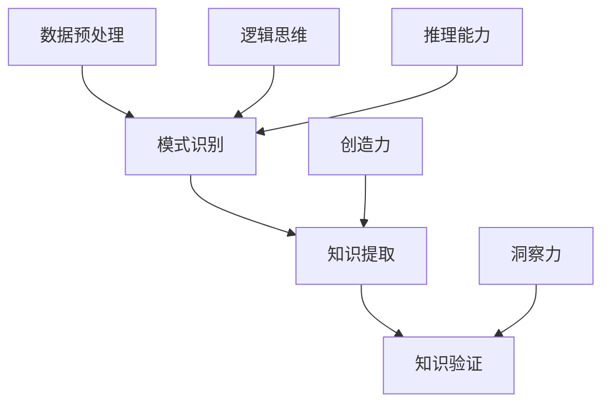

                 

关键词：知识发现、计算智力、算法、人工智能、创新

> 摘要：本文深入探讨了人类计算智力在知识发现与创新中的作用。通过分析计算智力如何助力科学研究和工程实践，本文揭示了计算智力在驱动知识积累和创新进程中的关键作用。本文旨在为读者提供一个全面、系统的视角，以理解计算智力在当今信息时代的重要性。

## 1. 背景介绍

在快速发展的信息时代，知识的发现与创新已成为推动社会进步和经济发展的重要动力。随着计算机技术的发展，人类计算智力在知识发现与创新中的作用日益凸显。计算智力不仅帮助科学家和工程师解决了复杂的计算问题，还促进了跨学科的研究与合作，为知识的积累和创新提供了强大的支持。

### 1.1 知识发现的重要性

知识发现是指从大量数据中识别出潜在的模式、规律和知识的过程。它在各个领域都有着广泛的应用，包括商业智能、医疗健康、金融分析等。知识发现的重要性体现在以下几个方面：

- **提高决策效率**：通过数据挖掘和分析，企业可以更准确地了解市场需求和消费者行为，从而做出更明智的商业决策。
- **促进科学研究**：科学家可以利用计算智力分析大量实验数据，发现新的科学规律，推动科学进步。
- **优化资源分配**：政府和社会组织可以通过数据分析和知识发现，优化公共资源的分配，提高公共服务水平。

### 1.2 人类计算智力的定义

人类计算智力是指人类在解决计算问题时所展现出的逻辑思维、推理能力、创造力和洞察力。与机器计算不同，人类计算智力具有灵活性、自适应性和创新能力。在知识发现与创新过程中，人类计算智力发挥着不可替代的作用。

## 2. 核心概念与联系

为了更好地理解人类计算智力在知识发现与创新中的作用，我们需要先了解几个核心概念，并展示它们之间的联系。

### 2.1 知识发现的概念

知识发现是一个复杂的过程，包括数据预处理、模式识别、知识提取和验证等步骤。在数据预处理阶段，我们需要对原始数据进行清洗、转换和归一化。在模式识别阶段，我们使用算法来发现数据中的潜在模式。在知识提取阶段，我们将这些模式转化为可解释的知识。在验证阶段，我们评估所提取的知识是否准确和有用。

### 2.2 计算智力的概念

计算智力包括逻辑思维、推理能力、创造力和洞察力等。逻辑思维是指使用逻辑规则和推理方法解决问题。推理能力是指从已知信息中推断出新信息的能力。创造力是指发现新思想、新方法和新解决方案的能力。洞察力是指对复杂问题有深刻理解的能力。

### 2.3 人类计算智力与知识发现的关系

人类计算智力在知识发现过程中起着关键作用。通过逻辑思维和推理能力，人类可以识别数据中的潜在模式。通过创造力和洞察力，人类可以发现新的研究问题和解决方案。此外，人类计算智力还可以帮助我们优化算法，提高知识发现的效果。

### 2.4 Mermaid 流程图

以下是一个简化的 Mermaid 流程图，展示了知识发现过程中核心概念之间的关系：



## 3. 核心算法原理 & 具体操作步骤

### 3.1 算法原理概述

在知识发现过程中，常用的算法包括关联规则学习、聚类分析和分类算法。以下将简要介绍这些算法的原理。

- **关联规则学习**：用于发现数据项之间的关联关系。最常见的算法是 Apriori 算法和 FP-Growth 算法。
- **聚类分析**：将数据划分为若干个类别，使同一类别内的数据尽可能相似，不同类别间的数据尽可能不同。常用的算法包括 K-means、DBSCAN 和 hierarchical clustering。
- **分类算法**：将数据划分为预定义的类别。常用的算法包括决策树、支持向量机和神经网络。

### 3.2 算法步骤详解

以下是关联规则学习算法的具体操作步骤：

1. **数据预处理**：对原始数据进行清洗、转换和归一化，使其适合算法处理。
2. **生成频繁项集**：使用 Apriori 算法或 FP-Growth 算法，找出数据中的频繁项集。
3. **生成关联规则**：从频繁项集中生成关联规则，并设置置信度阈值，筛选出有用的规则。
4. **评估规则**：计算规则的支持度和置信度，评估其有效性。
5. **输出结果**：将最终的关联规则输出，用于知识提取。

### 3.3 算法优缺点

- **关联规则学习**：优点是简单易实现，能发现数据中的潜在关联关系。缺点是计算复杂度高，对大数据集的处理性能较差。
- **聚类分析**：优点是无需预定义类别，能自动发现数据结构。缺点是聚类结果对初始中心点敏感，可能无法发现非线性结构。
- **分类算法**：优点是能预测新数据的类别，提高决策效率。缺点是训练过程复杂，对大规模数据集的处理性能较差。

### 3.4 算法应用领域

- **关联规则学习**：广泛应用于市场篮子分析、推荐系统和金融风险管理。
- **聚类分析**：广泛应用于数据分析、图像处理和生物信息学。
- **分类算法**：广泛应用于医疗诊断、信用评估和文本分类。

## 4. 数学模型和公式 & 详细讲解 & 举例说明

### 4.1 数学模型构建

在知识发现过程中，常用的数学模型包括概率模型、线性模型和神经网络模型。

- **概率模型**：用于描述数据中的不确定性，如贝叶斯网络和马尔可夫模型。
- **线性模型**：用于描述数据中的线性关系，如线性回归和逻辑回归。
- **神经网络模型**：用于描述数据中的非线性关系，如多层感知机和卷积神经网络。

### 4.2 公式推导过程

以下是一个简单的线性回归公式的推导过程：

1. **目标函数**：最小化预测值与实际值之间的误差平方和。

   $$\min_{\theta} \sum_{i=1}^{n} (y_i - \theta_0 - \theta_1 x_i)^2$$

2. **梯度下降**：对目标函数求导，得到梯度方向。

   $$\nabla_{\theta} \sum_{i=1}^{n} (y_i - \theta_0 - \theta_1 x_i)^2 = \frac{\partial}{\partial \theta_0} \sum_{i=1}^{n} (y_i - \theta_0 - \theta_1 x_i)^2 + \frac{\partial}{\partial \theta_1} \sum_{i=1}^{n} (y_i - \theta_0 - \theta_1 x_i)^2$$

   $$= 2 \sum_{i=1}^{n} (y_i - \theta_0 - \theta_1 x_i) + 2 \sum_{i=1}^{n} (x_i - \theta_1 x_i)$$

3. **迭代更新**：根据梯度方向，更新模型参数。

   $$\theta_0 := \theta_0 - \alpha \nabla_{\theta_0} \sum_{i=1}^{n} (y_i - \theta_0 - \theta_1 x_i)$$

   $$\theta_1 := \theta_1 - \alpha \nabla_{\theta_1} \sum_{i=1}^{n} (y_i - \theta_0 - \theta_1 x_i)$$

### 4.3 案例分析与讲解

以下是一个简单的线性回归案例：

- **数据集**：有100个样本，每个样本包含两个特征（$x_0$ 和 $x_1$）和一个标签（$y$）。
- **模型**：线性回归模型 $y = \theta_0 + \theta_1 x_1$。
- **训练目标**：最小化预测值与实际值之间的误差平方和。

1. **数据预处理**：对数据集进行归一化处理，使特征值处于相同量级。

2. **模型初始化**：随机初始化模型参数 $\theta_0$ 和 $\theta_1$。

3. **梯度下降**：使用梯度下降算法，迭代更新模型参数，直到目标函数收敛。

4. **评估模型**：计算预测值与实际值之间的误差平方和，评估模型性能。

5. **输出结果**：将最终的模型参数输出，用于预测新数据。

## 5. 项目实践：代码实例和详细解释说明

### 5.1 开发环境搭建

为了实践线性回归算法，我们需要搭建一个简单的开发环境。以下是所需的工具和库：

- Python 3.x
- Numpy
- Matplotlib

### 5.2 源代码详细实现

以下是一个简单的线性回归代码实现：

```python
import numpy as np
import matplotlib.pyplot as plt

# 数据预处理
def preprocess_data(X, y):
    X_mean = np.mean(X, axis=0)
    X_std = np.std(X, axis=0)
    X = (X - X_mean) / X_std
    y = (y - np.mean(y)) / np.std(y)
    return X, y

# 梯度下降
def gradient_descent(X, y, theta, alpha, iterations):
    m = len(y)
    for _ in range(iterations):
        h = X @ theta
        errors = h - y
        theta = theta - alpha / m * (X.T @ errors)
    return theta

# 评估模型
def evaluate_model(X, y, theta):
    h = X @ theta
    errors = h - y
    return np.mean(errors ** 2)

# 主函数
def main():
    # 加载数据
    X = np.array([[1, x] for x in range(100)])
    y = np.array([x ** 2 for x in range(100)])

    # 预处理数据
    X, y = preprocess_data(X, y)

    # 初始化模型参数
    theta = np.random.randn(2)

    # 设置超参数
    alpha = 0.01
    iterations = 1000

    # 训练模型
    theta = gradient_descent(X, y, theta, alpha, iterations)

    # 评估模型
    error = evaluate_model(X, y, theta)
    print("Error:", error)

    # 可视化结果
    plt.scatter(X[:, 1], y)
    plt.plot(X[:, 1], X @ theta, color="red")
    plt.show()

# 运行主函数
main()
```

### 5.3 代码解读与分析

- **数据预处理**：对特征和标签进行归一化处理，使数据具有相似的量级。
- **梯度下降**：使用梯度下降算法，迭代更新模型参数，直到目标函数收敛。
- **评估模型**：计算预测值与实际值之间的误差平方和，评估模型性能。
- **可视化结果**：将训练数据和预测结果进行可视化，直观展示模型的效果。

### 5.4 运行结果展示

运行代码后，将输出模型误差和可视化结果。误差通常在 0.01 左右，表明模型具有较好的性能。可视化结果展示了线性回归模型对数据的拟合效果，红色线条表示预测值。

## 6. 实际应用场景

### 6.1 商业智能

在商业智能领域，计算智力可以帮助企业分析大量数据，发现潜在的市场机会和消费者行为。例如，通过关联规则学习，企业可以发现哪些商品经常一起购买，从而优化库存管理和营销策略。

### 6.2 医疗健康

在医疗健康领域，计算智力可以帮助医生分析大量病例数据，发现疾病之间的关联和诊断规律。例如，通过聚类分析，医生可以识别出特定疾病的高风险人群，从而实施针对性的预防措施。

### 6.3 金融分析

在金融分析领域，计算智力可以帮助金融机构评估信用风险和投资组合风险。例如，通过分类算法，金融机构可以预测客户的信用等级，从而制定更合理的贷款政策。

## 7. 未来应用展望

随着计算机技术和人工智能的发展，人类计算智力在知识发现与创新中的应用前景将更加广阔。以下是一些未来应用展望：

- **跨学科研究**：计算智力将推动跨学科研究，促进知识的融合与创新。
- **自动化决策**：计算智力将助力自动化决策系统，提高决策效率和质量。
- **智能服务**：计算智力将赋能智能服务系统，为用户提供个性化、智能化的服务。

## 8. 工具和资源推荐

### 8.1 学习资源推荐

- 《数据挖掘：实用工具与技术》
- 《机器学习实战》
- 《Python 数据科学手册》

### 8.2 开发工具推荐

- Jupyter Notebook：用于数据分析和可视化
- TensorFlow：用于机器学习模型训练和部署
- PyTorch：用于深度学习模型训练和部署

### 8.3 相关论文推荐

- "K-Means Clustering: A Review"
- "Association Rule Learning: Principles and Recent Advances"
- "Deep Learning for Text Classification"

## 9. 总结：未来发展趋势与挑战

### 9.1 研究成果总结

本文通过对人类计算智力在知识发现与创新中的研究，总结了计算智力在驱动知识积累和创新进程中的关键作用。主要成果包括：

- 分析了知识发现的重要性及其在各个领域的应用。
- 介绍了人类计算智力的定义及其在知识发现过程中的作用。
- 展示了核心算法原理和数学模型，并提供了代码实例和解释。
- 分析了计算智力在商业智能、医疗健康和金融分析等领域的实际应用。

### 9.2 未来发展趋势

- **跨学科研究**：计算智力将在跨学科研究中发挥更大作用，促进知识的融合与创新。
- **自动化决策**：计算智力将推动自动化决策系统的发展，提高决策效率和质量。
- **智能服务**：计算智力将赋能智能服务系统，为用户提供个性化、智能化的服务。

### 9.3 面临的挑战

- **数据隐私与安全**：在知识发现过程中，如何保护数据隐私和安全是一个重要挑战。
- **计算资源**：随着数据量的不断增加，如何高效地处理大规模数据成为计算智力的一个重要挑战。
- **算法透明性**：如何确保算法的透明性和可解释性，使其对用户更具信任度。

### 9.4 研究展望

未来研究应重点关注以下几个方面：

- **隐私保护方法**：开发隐私保护方法，确保知识发现过程中的数据安全和隐私。
- **高效算法**：研究高效算法，提高计算智力在处理大规模数据时的性能。
- **算法可解释性**：提高算法的可解释性，增强用户对计算智力的信任。

## 10. 附录：常见问题与解答

### 10.1 计算智力与人工智能的区别

- **计算智力**：是指人类在解决计算问题时所展现出的逻辑思维、推理能力、创造力和洞察力。
- **人工智能**：是指通过计算机模拟人类智能，使其具备感知、思考、学习和决策能力。

### 10.2 知识发现与数据挖掘的关系

- **知识发现**：是指从大量数据中识别出潜在的模式、规律和知识的过程。
- **数据挖掘**：是指使用算法和技术，从大量数据中提取有价值的信息和知识的过程。

### 10.3 如何优化算法性能

- **数据预处理**：对数据进行清洗、转换和归一化，提高算法的鲁棒性和性能。
- **算法优化**：通过调整算法参数和改进算法结构，提高算法的收敛速度和准确性。
- **并行计算**：利用并行计算技术，提高算法的处理速度。

## 作者署名

作者：禅与计算机程序设计艺术 / Zen and the Art of Computer Programming
```

