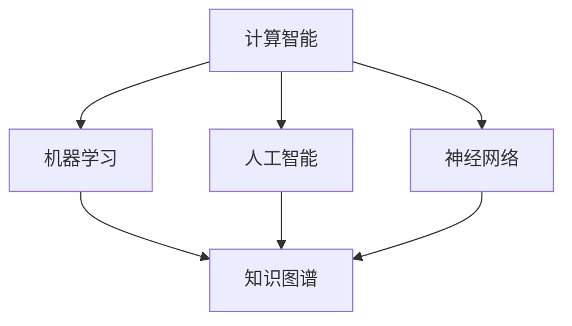

                 

关键词：知识发现、计算智能、人工智能、创新能力、技术发展

> 摘要：本文深入探讨了人类计算在推动知识发现与创新中的作用。通过分析计算技术的演变，本文揭示了计算在提高人类认知能力、支持知识整合与创新能力方面的巨大潜力。文章分为多个部分，包括背景介绍、核心概念与联系、核心算法原理、数学模型和公式、项目实践、实际应用场景、工具和资源推荐，以及总结与展望。

## 1. 背景介绍

知识发现与创新是现代社会发展的核心驱动力。随着信息技术和计算科学的飞速发展，人类对于数据和信息处理的效率得到了极大提升。计算技术不仅改变了人类的工作方式，也深刻影响了知识的生产和传播。然而，计算在推动知识发现与创新中的作用究竟有多大？这是一个值得探讨的问题。

计算技术的起源可以追溯到20世纪中期，随着计算机的出现，数据处理能力得到了质的飞跃。从最初的电子管计算机到现在的量子计算机，计算技术的每一次进步都为知识发现与创新提供了新的工具和平台。本文旨在梳理计算技术的历史演变，分析其在知识发现与创新中的作用，并提出未来可能的发展趋势。

## 2. 核心概念与联系

为了更好地理解计算在知识发现与创新中的作用，我们需要明确几个核心概念，包括计算智能、知识图谱和算法。

### 2.1 计算智能

计算智能是指利用计算技术模拟和扩展人类智能的能力。它包括机器学习、人工智能、神经网络等多种技术。计算智能的核心是算法，这些算法通过处理大量数据，发现隐藏的模式和关联，从而推动知识发现。

### 2.2 知识图谱

知识图谱是一种用于表示实体及其之间关系的图形结构。它可以被视为一种知识整合工具，通过将数据转化为图形结构，使得知识更加直观和易于理解。知识图谱在知识发现中扮演了重要角色，它能够帮助人类从海量数据中快速提取有价值的信息。

### 2.3 算法

算法是计算的核心，它是解决问题的方法和规则。在知识发现与创新中，算法被用于数据分析、模式识别和预测建模等任务。不同类型的算法具有不同的优势和适用场景，因此选择合适的算法对于知识发现和创新至关重要。

以下是一个使用Mermaid绘制的知识图谱，展示了计算智能、知识图谱和算法之间的关系：



## 3. 核心算法原理 & 具体操作步骤

### 3.1 算法原理概述

在知识发现与创新中，常用的算法包括关联规则挖掘、聚类分析和分类算法。这些算法通过处理数据，提取有价值的信息，从而推动知识发现。

- **关联规则挖掘**：用于发现数据集中项之间的关联关系。它通过支持度和置信度两个指标来评估规则的强度。
- **聚类分析**：将数据集划分为多个类别，使得同一类别内的数据尽可能相似，不同类别间的数据尽可能不同。
- **分类算法**：用于将数据分为预定义的类别。常见的分类算法包括决策树、随机森林和支持向量机。

### 3.2 算法步骤详解

#### 关联规则挖掘

1. **数据预处理**：对原始数据进行清洗和预处理，包括去除重复项、缺失值填充等。
2. **生成候选集**：根据支持度和置信度，生成所有可能的关联规则候选集。
3. **修剪候选集**：根据最小支持度和最小置信度，修剪掉不符合要求的关联规则。
4. **输出结果**：将最终筛选出的关联规则输出。

#### 聚类分析

1. **选择聚类算法**：根据数据特点选择合适的聚类算法，如K-Means、层次聚类等。
2. **初始化聚类中心**：随机选择初始聚类中心。
3. **迭代计算**：计算每个数据点与聚类中心的距离，将其分配到最近的聚类。
4. **更新聚类中心**：计算每个聚类的中心点，重复迭代直到聚类中心不再变化。

#### 分类算法

1. **数据预处理**：对数据进行标准化和特征提取。
2. **模型训练**：使用训练数据集训练分类模型。
3. **模型评估**：使用测试数据集评估模型性能，调整参数以优化模型。
4. **分类预测**：使用训练好的模型对新数据进行分类预测。

### 3.3 算法优缺点

- **关联规则挖掘**：优点是能够发现数据之间的关联关系，缺点是生成的规则数量可能非常庞大，需要进一步筛选。
- **聚类分析**：优点是能够自动发现数据结构，缺点是对初始聚类中心的选择敏感。
- **分类算法**：优点是能够对新数据进行准确的分类预测，缺点是训练过程可能非常耗时。

### 3.4 算法应用领域

- **电子商务**：通过关联规则挖掘，可以推荐相关商品，提高销售额。
- **生物信息学**：通过聚类分析，可以识别蛋白质的结构和功能。
- **金融领域**：通过分类算法，可以进行信用评分和风险控制。

## 4. 数学模型和公式 & 详细讲解 & 举例说明

### 4.1 数学模型构建

在知识发现与创新中，常用的数学模型包括线性回归、逻辑回归和支持向量机。

#### 线性回归

线性回归模型表示为：

$$ y = \beta_0 + \beta_1x + \epsilon $$

其中，$y$ 是因变量，$x$ 是自变量，$\beta_0$ 和 $\beta_1$ 是模型的参数，$\epsilon$ 是误差项。

#### 逻辑回归

逻辑回归模型用于二分类问题，表示为：

$$ P(y=1) = \frac{1}{1 + e^{-(\beta_0 + \beta_1x)}} $$

其中，$P(y=1)$ 是因变量为1的概率，$\beta_0$ 和 $\beta_1$ 是模型的参数。

#### 支持向量机

支持向量机模型表示为：

$$ w \cdot x + b = 0 $$

其中，$w$ 是模型参数，$x$ 是输入特征，$b$ 是偏置项。

### 4.2 公式推导过程

以线性回归为例，我们推导其参数估计过程。

假设我们有 $n$ 个数据点 $(x_i, y_i)$，其中 $i=1,2,...,n$。线性回归模型的目标是最小化损失函数：

$$ J(\beta_0, \beta_1) = \frac{1}{2n} \sum_{i=1}^{n} (y_i - (\beta_0 + \beta_1x_i))^2 $$

为了求解 $\beta_0$ 和 $\beta_1$，我们对损失函数进行求导，并令导数为0：

$$ \frac{\partial J}{\partial \beta_0} = 0, \frac{\partial J}{\partial \beta_1} = 0 $$

解得：

$$ \beta_0 = \frac{1}{n} \sum_{i=1}^{n} y_i - \beta_1 \frac{1}{n} \sum_{i=1}^{n} x_i $$

$$ \beta_1 = \frac{1}{n} \sum_{i=1}^{n} (x_i - \bar{x})(y_i - \bar{y}) $$

其中，$\bar{x}$ 和 $\bar{y}$ 分别是 $x$ 和 $y$ 的均值。

### 4.3 案例分析与讲解

假设我们有一个简单的线性回归问题，数据集如下：

| $x$ | $y$ |
|-----|-----|
| 1   | 2   |
| 2   | 4   |
| 3   | 6   |

我们希望找到一条直线来拟合这些数据点。

1. **数据预处理**：计算 $x$ 和 $y$ 的均值：

   $$ \bar{x} = \frac{1+2+3}{3} = 2 $$
   $$ \bar{y} = \frac{2+4+6}{3} = 4 $$

2. **参数估计**：

   $$ \beta_0 = \frac{1}{3} \sum_{i=1}^{3} y_i - \beta_1 \frac{1}{3} \sum_{i=1}^{3} x_i = 4 - 2\beta_1 $$
   $$ \beta_1 = \frac{1}{3} \sum_{i=1}^{3} (x_i - \bar{x})(y_i - \bar{y}) = \frac{1}{3} \left[(1-2)(2-4) + (2-2)(4-4) + (3-2)(6-4)\right] = 2 $$

   代入 $\beta_1 = 2$ 得到：

   $$ \beta_0 = 4 - 2 \times 2 = 0 $$

3. **拟合直线**：得到线性回归模型：

   $$ y = 0 + 2x $$

4. **预测**：对于新的输入 $x=4$，预测 $y$ 的值：

   $$ y = 2 \times 4 = 8 $$

## 5. 项目实践：代码实例和详细解释说明

### 5.1 开发环境搭建

1. **安装Python**：确保Python环境已安装，版本不低于3.6。
2. **安装依赖库**：使用pip安装以下依赖库：

   ```bash
   pip install numpy matplotlib scikit-learn
   ```

### 5.2 源代码详细实现

以下是一个简单的线性回归项目，用于拟合给定数据集：

```python
import numpy as np
import matplotlib.pyplot as plt
from sklearn.linear_model import LinearRegression

# 数据集
X = np.array([[1], [2], [3]])
y = np.array([2, 4, 6])

# 创建线性回归模型
model = LinearRegression()

# 训练模型
model.fit(X, y)

# 输出模型参数
print("模型参数：\n", model.coef_, model.intercept_)

# 预测新数据
new_data = np.array([[4]])
predicted_y = model.predict(new_data)
print("预测结果：", predicted_y)

# 绘制拟合直线和原始数据点
plt.scatter(X, y, color='blue', label='原始数据')
plt.plot(X, model.predict(X), color='red', label='拟合直线')
plt.xlabel('x')
plt.ylabel('y')
plt.legend()
plt.show()
```

### 5.3 代码解读与分析

- **数据集**：我们使用一个简单的二维数据集，其中每个数据点表示为 $x$ 和 $y$。
- **线性回归模型**：我们使用 `sklearn` 库中的 `LinearRegression` 类创建线性回归模型。
- **模型训练**：使用 `fit` 方法训练模型，模型参数通过 `coef_` 和 `intercept_` 属性获取。
- **预测**：使用 `predict` 方法对新数据进行预测，并输出预测结果。
- **可视化**：使用 `matplotlib` 库绘制拟合直线和原始数据点。

## 6. 实际应用场景

### 6.1 电子商务

在电子商务领域，关联规则挖掘被广泛应用于推荐系统。通过分析用户购买历史数据，发现商品之间的关联关系，为用户提供个性化推荐。

### 6.2 生物信息学

在生物信息学领域，聚类分析被用于蛋白质结构预测和基因表达数据分析。通过自动识别数据中的结构模式，帮助科学家理解生物系统的复杂性。

### 6.3 金融领域

在金融领域，分类算法被用于信用评分和风险控制。通过对历史数据进行分析，预测客户的信用风险，为金融机构提供决策支持。

## 6.4 未来应用展望

随着计算技术的不断发展，知识发现与创新将在更多领域得到应用。例如，在医疗领域，利用深度学习和大数据分析技术，可以加速新药的发现和治疗方案的优化。在环境科学领域，通过分析环境数据，可以预测气候变化和自然灾害，为环境保护提供科学依据。

## 7. 工具和资源推荐

### 7.1 学习资源推荐

- **书籍**：《深度学习》（Goodfellow, Bengio, Courville著）
- **在线课程**：Coursera、edX等平台上的机器学习和数据科学课程
- **开源项目**：GitHub上的机器学习和数据科学项目

### 7.2 开发工具推荐

- **编程语言**：Python、R、Julia
- **库和框架**：scikit-learn、TensorFlow、PyTorch、Keras

### 7.3 相关论文推荐

- **机器学习**：《Learning to Represent Text with Recurrent Neural Networks》（Mikolov et al., 2014）
- **深度学习**：《A Theoretically Grounded Application of Dropout in Recurrent Neural Networks》（Gal and Ghahramani, 2016）
- **数据科学**：《On the Robustness of Deep Learning to Adversarial Examples》（Carlini and Wagner, 2017）

## 8. 总结：未来发展趋势与挑战

### 8.1 研究成果总结

计算技术已经在知识发现与创新中发挥了重要作用，通过算法和数学模型，我们能够从海量数据中提取有价值的信息。未来的研究将集中在提高计算效率、增强算法鲁棒性和扩展应用领域。

### 8.2 未来发展趋势

- **计算能力提升**：随着量子计算和神经形态计算的发展，计算能力将得到显著提升，为知识发现提供更强有力的支持。
- **算法优化**：算法将在效率和准确性方面进行持续优化，以应对复杂的应用场景。
- **跨学科融合**：计算技术与生物学、环境科学、医学等领域的深度融合，将带来新的创新机会。

### 8.3 面临的挑战

- **数据隐私与安全**：如何保护数据隐私和确保计算安全是当前面临的重要挑战。
- **算法公平性**：如何确保算法的公平性和透明性，避免算法偏见和歧视。

### 8.4 研究展望

未来的研究将围绕如何更好地利用计算技术推动知识发现与创新。通过不断探索和尝试，我们有望在计算智能领域取得更多突破，为人类社会的进步贡献力量。

## 9. 附录：常见问题与解答

### 9.1 计算智能是什么？

计算智能是指利用计算技术模拟和扩展人类智能的能力。它包括机器学习、人工智能、神经网络等多种技术。

### 9.2 知识图谱有什么作用？

知识图谱是一种用于表示实体及其之间关系的图形结构。它能够帮助人类从海量数据中快速提取有价值的信息，支持知识整合与创新。

### 9.3 如何选择合适的算法？

选择合适的算法取决于具体的应用场景和数据特点。例如，在处理大规模数据集时，可以使用分布式算法；在处理图像和视频数据时，可以使用深度学习算法。

### 9.4 计算智能的未来发展趋势是什么？

计算智能的未来发展趋势包括计算能力的提升、算法的优化和跨学科的融合。随着量子计算和神经形态计算的发展，计算智能将在更多领域得到应用。

