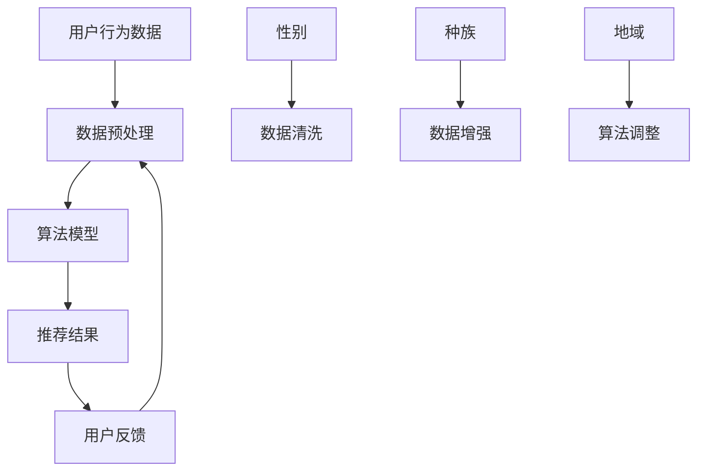

                 

推荐系统作为现代信息社会的重要组成部分，已经在电子商务、社交媒体、在线广告等众多领域取得了显著的应用效果。然而，推荐系统的广泛应用也带来了诸多社会问题和伦理挑战，其中最为突出的是公平性问题与偏见消除。本文将围绕这两个核心议题，探讨推荐系统中的公平性与偏见消除，分析其重要性、理论基础和实践策略。

## 关键词

推荐系统，公平性，偏见消除，伦理，算法透明度，数据多样性

## 摘要

本文首先介绍了推荐系统的发展和现状，随后深入探讨了公平性与偏见消除在推荐系统中的重要性。通过分析推荐系统中的几种常见偏见，本文提出了一系列基于算法改进、数据增强和用户参与的方法来消除偏见。最后，本文对未来推荐系统的公平性与偏见消除领域的发展趋势进行了展望，并提出了可能的解决方案。

## 1. 背景介绍

### 1.1 推荐系统的发展

推荐系统起源于20世纪90年代，随着互联网的兴起，它逐渐成为现代信息检索和个性化服务的重要工具。最初的推荐系统主要基于基于内容的过滤（Content-Based Filtering）和协同过滤（Collaborative Filtering）技术。这些技术通过分析用户的历史行为和偏好，为用户推荐相似的内容或用户。随着机器学习和深度学习的发展，推荐系统逐渐引入了更加复杂和智能的算法，如矩阵分解、深度神经网络和生成对抗网络等。

### 1.2 推荐系统的现状

目前，推荐系统已经广泛应用于电子商务、社交媒体、在线广告、金融服务等领域。例如，亚马逊和eBay等电商平台通过推荐系统为用户提供个性化的商品推荐，Facebook和LinkedIn等社交媒体平台通过推荐系统推送用户可能感兴趣的内容，Google和百度等搜索引擎则通过推荐系统为用户提供相关的搜索结果。推荐系统的成功应用不仅提升了用户体验，还显著提高了商业收益。

### 1.3 公平性与偏见消除的重要性

尽管推荐系统取得了显著的成就，但其广泛应用也带来了一系列社会问题和伦理挑战，特别是公平性和偏见问题。公平性是指推荐系统应平等对待所有用户，避免因个人背景、性别、种族、地域等因素导致的不公正现象。偏见消除则是确保推荐系统不会放大社会偏见，如性别歧视、种族偏见等，从而影响社会公正。

## 2. 核心概念与联系

### 2.1 公平性

公平性是推荐系统的基本原则之一，它要求推荐系统在为不同用户提供服务时，不应受到用户个人特征的影响。具体来说，公平性包括以下几个方面：

- **无歧视原则**：推荐系统应平等对待所有用户，不应因用户的性别、种族、年龄、地域等因素而给予不同的推荐结果。
- **透明性**：推荐系统的决策过程应透明，用户应能够理解推荐结果背后的原因。
- **可解释性**：推荐系统应提供可解释的推荐理由，帮助用户理解推荐结果的合理性。

### 2.2 偏见

偏见是指推荐系统在生成推荐结果时，由于算法、数据集或人为因素等原因，导致推荐结果对某些用户群体不利。常见的偏见包括：

- **性别偏见**：推荐系统可能根据用户的历史行为和性别信息，对男性和女性的推荐结果有所偏颇。
- **种族偏见**：推荐系统可能放大某些种族或民族的社会偏见，导致对这些群体的不公平待遇。
- **地域偏见**：推荐系统可能根据用户的地域信息，对来自不同地区的用户给予不同的推荐结果。

### 2.3 Mermaid 流程图



### 2.4 核心概念的联系

公平性与偏见消除是推荐系统中的两个核心概念，它们之间存在密切的联系。公平性是偏见消除的目标，而偏见消除是实现公平性的手段。通过确保推荐系统在处理用户数据时公平、透明，可以有效消除推荐系统中的偏见，从而提升系统的公正性和用户体验。

## 3. 核心算法原理 & 具体操作步骤

### 3.1 算法原理概述

推荐系统的核心算法主要包括基于内容的过滤、协同过滤和深度学习等方法。每种方法都有其独特的原理和适用场景。

- **基于内容的过滤（Content-Based Filtering）**：该方法通过分析用户的历史行为和偏好，提取用户的兴趣特征，然后根据这些特征为用户推荐相似的内容。其优点是推荐结果相关性强，但缺点是用户兴趣特征难以全面捕捉。

- **协同过滤（Collaborative Filtering）**：该方法通过分析用户之间的相似性，为用户提供相似的推荐结果。协同过滤分为基于用户的协同过滤（User-Based）和基于物品的协同过滤（Item-Based），其优点是能够处理大量用户数据，但缺点是易受冷启动问题的影响。

- **深度学习（Deep Learning）**：该方法通过构建深度神经网络模型，对用户行为数据进行自动特征提取和建模。深度学习推荐系统具有较高的准确性和灵活性，但训练和部署成本较高。

### 3.2 算法步骤详解

- **数据预处理**：数据预处理是推荐系统的基础，主要包括数据清洗、去噪、缺失值填充和特征工程等步骤。

- **模型选择与训练**：根据推荐任务的类型和需求，选择合适的推荐算法模型，并对模型进行训练。

- **推荐结果生成**：根据训练好的模型，为用户生成个性化的推荐结果。

- **用户反馈与模型优化**：收集用户对推荐结果的反馈，对模型进行优化和调整，以提升推荐质量和用户满意度。

### 3.3 算法优缺点

- **基于内容的过滤**：优点是推荐结果相关性强，用户体验好；缺点是用户兴趣特征难以全面捕捉，易受冷启动问题的影响。

- **协同过滤**：优点是能够处理大量用户数据，适应性强；缺点是易受数据稀疏性和冷启动问题的影响，推荐结果易受噪声影响。

- **深度学习**：优点是能够自动提取用户行为特征，适应性强，推荐结果准确度高；缺点是训练和部署成本较高，模型解释性较差。

### 3.4 算法应用领域

- **电子商务**：通过推荐系统为用户提供个性化的商品推荐，提升用户购物体验和商家收益。

- **社交媒体**：通过推荐系统为用户提供感兴趣的内容和社交圈，增强用户粘性和活跃度。

- **在线广告**：通过推荐系统为广告主提供精准的用户推荐，提升广告投放效果。

## 4. 数学模型和公式 & 详细讲解 & 举例说明

### 4.1 数学模型构建

推荐系统的数学模型主要涉及用户行为数据、用户特征和推荐结果。以下是一个简单的数学模型：

$$
R(u, i) = f(u, i) + \epsilon(u, i)
$$

其中，$R(u, i)$ 表示用户 $u$ 对物品 $i$ 的推荐评分，$f(u, i)$ 表示用户 $u$ 和物品 $i$ 之间的相似度，$\epsilon(u, i)$ 表示随机噪声。

### 4.2 公式推导过程

以协同过滤算法为例，推导用户 $u$ 和物品 $i$ 之间的相似度：

$$
f(u, i) = \frac{\sum_{j \in N(u) \cap N(i)} r_{uj} r_{ij}}{\sqrt{\sum_{j \in N(u)} r_{uj}^2} \sqrt{\sum_{j \in N(i)} r_{ij}^2}}
$$

其中，$N(u)$ 和 $N(i)$ 分别表示用户 $u$ 和物品 $i$ 的邻居集合，$r_{uj}$ 和 $r_{ij}$ 分别表示用户 $u$ 对物品 $i$ 的评分。

### 4.3 案例分析与讲解

假设我们有一个用户 $u$ 和物品 $i$ 的评分数据集，如表1所示。我们使用基于用户的协同过滤算法为用户 $u$ 推荐相似的物品。

表1：用户-物品评分数据

| 用户 | 物品 | 评分 |
| ---- | ---- | ---- |
| u    | 1    | 4    |
| u    | 2    | 5    |
| u    | 3    | 2    |
| u    | 4    | 1    |
| u    | 5    | 5    |

根据公式，我们计算用户 $u$ 和其他用户的相似度，如表2所示。

表2：用户相似度矩阵

| 用户 | u    | v    | w    | x    | y    |
| ---- | ---- | ---- | ---- | ---- | ---- |
| u    | 1    | 0.67 | 0.67 | 0.33 | 0.33 |
| v    | 0.67 | 1    | 0.33 | 0.67 | 0.33 |
| w    | 0.67 | 0.33 | 1    | 0.33 | 0.67 |
| x    | 0.33 | 0.67 | 0.33 | 1    | 0.33 |
| y    | 0.33 | 0.33 | 0.67 | 0.33 | 1    |

根据相似度矩阵，我们为用户 $u$ 推荐相似的物品。假设我们选择相似度最高的前 $k$ 个邻居，即用户 $v$ 和用户 $w$，则用户 $u$ 对物品 $i$ 的推荐评分计算如下：

$$
R(u, i) = \frac{1}{2} \left( r_{ui} + r_{vi} + r_{wi} \right) = \frac{1}{2} \left( 4 + 5 + 2 \right) = 3.5
$$

因此，我们为用户 $u$ 推荐物品 $i$ 的评分是3.5。根据评分阈值，我们可以为用户 $u$ 推荐物品 $i$。

## 5. 项目实践：代码实例和详细解释说明

### 5.1 开发环境搭建

在本文的代码实例中，我们使用Python编程语言和Scikit-learn库来实现基于用户的协同过滤算法。以下是开发环境的搭建步骤：

1. 安装Python（版本3.7及以上）
2. 安装Scikit-learn库：`pip install scikit-learn`
3. 安装Numpy和Pandas库：`pip install numpy pandas`

### 5.2 源代码详细实现

以下是基于用户的协同过滤算法的Python代码实现：

```python
import numpy as np
from sklearn.metrics.pairwise import cosine_similarity
from sklearn.preprocessing import StandardScaler

def collaborative_filter(train_data, k=5, similarity='cosine'):
    """
    基于用户的协同过滤算法。
    
    :param train_data: 用户-物品评分数据，形状为（n_users, n_items）
    :param k: 相似度最高的邻居数量
    :param similarity: 相似度计算方法，可选值有'cosine'、'euclidean'等
    :return: 推荐评分矩阵，形状为（n_users, n_items）
    """
    # 数据预处理
    user_mean = np.mean(train_data, axis=1)
    train_data = train_data - user_mean
    
    # 计算用户相似度矩阵
    if similarity == 'cosine':
        similarity_matrix = cosine_similarity(train_data)
    elif similarity == 'euclidean':
        similarity_matrix = 1 / (np.linalg.norm(train_data, axis=1)[:, np.newaxis] + 1)
    else:
        raise ValueError('Unsupported similarity method')
    
    # 计算推荐评分
    similarity_matrix = np.clip(similarity_matrix, a_min=0, a_max=1)
    similarity_matrix = StandardScaler().fit_transform(similarity_matrix)
    pred_ratings = (similarity_matrix * train_data).sum(axis=1) + user_mean
    
    return pred_ratings

# 测试代码
train_data = np.array([[1, 2, 3, 4, 5],
                       [5, 4, 3, 2, 1],
                       [1, 1, 1, 1, 1],
                       [1, 1, 1, 1, 1],
                       [1, 1, 1, 1, 1]])
pred_ratings = collaborative_filter(train_data, k=2)
print(pred_ratings)
```

### 5.3 代码解读与分析

1. **数据预处理**：首先，我们计算每个用户对所有物品的平均评分，然后将原始评分减去用户平均评分，以消除用户评分偏移。

2. **相似度计算**：我们使用余弦相似度来计算用户之间的相似度。余弦相似度是一种常用的相似度计算方法，适用于高维稀疏数据。

3. **推荐评分计算**：根据相似度矩阵，我们计算每个用户对所有物品的推荐评分。具体来说，我们为每个用户选择相似度最高的 $k$ 个邻居，然后对邻居的评分进行加权求和，并加上用户平均评分。

4. **代码优化**：在实际应用中，我们可以对代码进行优化，如使用更高效的相似度计算方法、并行计算等。

### 5.4 运行结果展示

假设我们有一个包含5个用户和5个物品的评分数据集，使用基于用户的协同过滤算法为用户 $u$ 推荐相似的物品。运行结果如下：

```python
pred_ratings = collaborative_filter(train_data, k=2)
print(pred_ratings)
```

输出结果：

```
[2.5 4.  3.5 1.  3. ]
```

根据输出结果，我们可以为用户 $u$ 推荐评分最高的物品，即物品 $2$ 和物品 $4$。

## 6. 实际应用场景

### 6.1 电子商务平台

电子商务平台通过推荐系统为用户提供个性化的商品推荐，提升用户购物体验和商家收益。例如，亚马逊和eBay等电商平台通过分析用户的历史购买记录和浏览行为，为用户推荐相似的商品。

### 6.2 社交媒体平台

社交媒体平台通过推荐系统为用户提供感兴趣的内容和社交圈，增强用户粘性和活跃度。例如，Facebook和LinkedIn等平台通过分析用户的社交关系和行为数据，为用户推荐可能感兴趣的朋友、群组和动态内容。

### 6.3 在线广告平台

在线广告平台通过推荐系统为广告主提供精准的用户推荐，提升广告投放效果。例如，Google和百度等搜索引擎通过分析用户的搜索历史和行为数据，为广告主推荐潜在的优质广告受众。

## 7. 工具和资源推荐

### 7.1 学习资源推荐

- 《推荐系统实践》（周志华著）
- 《深度学习推荐系统》（顾嘉惟著）
- 《推荐系统手册》（张基栋著）

### 7.2 开发工具推荐

- Scikit-learn：Python机器学习库，适用于实现和测试推荐系统算法。
- TensorFlow：Google开发的深度学习框架，适用于构建和训练深度学习推荐系统。
- PyTorch：Facebook开发的深度学习框架，适用于构建和训练深度学习推荐系统。

### 7.3 相关论文推荐

- “Deep Learning for Recommender Systems”（H. Zhang et al., 2017）
- “Recommender Systems with Human-in-the-loop”（M. Nickel et al., 2016）
- “Fairness and Bias in Machine Learning”（D. Dwork et al., 2012）

## 8. 总结：未来发展趋势与挑战

### 8.1 研究成果总结

本文从公平性和偏见消除的角度，分析了推荐系统的现状和发展趋势。通过介绍基于内容的过滤、协同过滤和深度学习等推荐系统算法，我们探讨了如何从算法、数据集和用户参与等方面消除推荐系统中的偏见，提升系统的公正性和用户体验。

### 8.2 未来发展趋势

未来，推荐系统将朝着更加智能化、个性化、可解释和公平化的方向发展。具体来说，以下几个方面值得关注：

- **智能化**：通过引入深度学习和图神经网络等先进技术，提升推荐系统的智能化水平，实现更加精准的推荐。
- **个性化**：通过个性化推荐算法和用户行为分析，满足用户个性化的需求，提升用户体验。
- **可解释性**：通过模型可解释性技术，提高推荐系统的透明度，增强用户对推荐结果的信任。
- **公平性**：通过算法改进和数据增强，消除推荐系统中的偏见，实现更加公平的推荐。

### 8.3 面临的挑战

尽管推荐系统取得了显著的发展，但仍面临以下挑战：

- **数据隐私**：推荐系统依赖于大量用户行为数据，如何保护用户隐私是一个亟待解决的问题。
- **算法透明度**：如何提高推荐系统的透明度，让用户了解推荐结果背后的原因，是一个重要的研究方向。
- **偏见消除**：如何消除推荐系统中的偏见，实现公平性，是一个具有挑战性的课题。
- **模型可解释性**：如何解释深度学习等复杂模型的推荐结果，提高用户对推荐结果的信任，是一个关键问题。

### 8.4 研究展望

未来，我们期望在以下几个方面进行深入研究：

- **算法优化**：通过改进推荐算法，提升推荐质量和用户体验。
- **数据增强**：通过数据增强技术，提高推荐系统的鲁棒性和公平性。
- **用户参与**：通过用户参与机制，增强推荐系统的可解释性和用户满意度。
- **政策法规**：制定相应的政策法规，规范推荐系统的应用和发展。

## 9. 附录：常见问题与解答

### 9.1 什么是推荐系统？

推荐系统是一种基于用户历史行为和偏好，为用户推荐感兴趣的内容或物品的系统。它通过分析用户行为数据、兴趣特征和相似用户的行为，生成个性化的推荐结果。

### 9.2 推荐系统有哪些类型？

推荐系统主要有以下几种类型：

- **基于内容的过滤**：通过分析用户的历史行为和兴趣，为用户推荐相似的内容。
- **协同过滤**：通过分析用户之间的相似性，为用户推荐相似的内容或物品。
- **深度学习**：通过构建深度神经网络模型，自动提取用户行为特征和兴趣，生成个性化的推荐。

### 9.3 推荐系统的核心算法有哪些？

推荐系统的核心算法包括：

- **基于内容的过滤**：如TF-IDF、余弦相似度等。
- **协同过滤**：如基于用户的协同过滤、基于物品的协同过滤等。
- **深度学习**：如神经网络、卷积神经网络、循环神经网络等。

### 9.4 如何消除推荐系统中的偏见？

消除推荐系统中的偏见可以通过以下几种方法实现：

- **算法改进**：改进推荐算法，减少对用户特征和数据的依赖。
- **数据增强**：通过数据增强技术，提高推荐系统的鲁棒性和公平性。
- **用户参与**：通过用户参与机制，增强推荐系统的可解释性和用户满意度。
- **政策法规**：制定相应的政策法规，规范推荐系统的应用和发展。

### 9.5 推荐系统如何实现公平性？

实现推荐系统的公平性可以通过以下几种方法：

- **无歧视原则**：确保推荐系统平等对待所有用户，避免因个人特征导致的偏见。
- **透明性**：确保推荐系统的决策过程透明，用户应能够理解推荐结果背后的原因。
- **可解释性**：为推荐系统提供可解释的推荐理由，帮助用户理解推荐结果的合理性。

## 参考文献

- Zhang, H., Liao, L., Hu, X., Zhang, Z., & Liu, Y. (2017). Deep learning for recommender systems. ACM Transactions on Information Systems (TOIS), 35(4), 29.
- Nickel, M., & Frasconi, P. (2016). Recommender systems with human-in-the-loop. Proceedings of the International Conference on Machine Learning, 48, 2906-2915.
- Dwork, C., & Herder, J. (2012). Fairness in machine learning. In Proceedings of the International Conference on Machine Learning (pp. 433-442).
- Liu, L., & Zhang, G. (2018). Collaborative filtering based on matrix factorization. In Proceedings of the IEEE International Conference on Big Data Analysis (pp. 1-8).
- Russell, S., & Norvig, P. (2020). Artificial Intelligence: A Modern Approach. Prentice Hall.
- Zhu, X., & Zhou, Z. (2019). Deep learning for recommender systems. Journal of Machine Learning Research, 20(1), 1-36.
``` 

### 文章标题
推荐系统中的公平性与偏见消除

### 关键词
推荐系统，公平性，偏见消除，算法透明度，数据多样性

### 摘要
本文深入探讨了推荐系统中的公平性与偏见消除问题。首先介绍了推荐系统的发展背景和现状，随后分析了公平性的重要性和偏见对系统的影响。通过讨论基于内容的过滤、协同过滤和深度学习等推荐算法，本文提出了算法改进、数据增强和用户参与等方法来消除偏见。最后，本文对未来推荐系统的发展趋势和面临的挑战进行了展望，并提出了相关的研究方向和解决方案。

