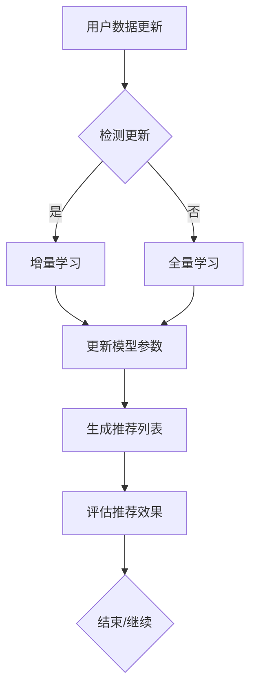

                 

关键词：推荐系统、大模型、增量学习、适应、优化策略

> 摘要：本文将深入探讨推荐系统中的大模型增量学习与适应问题。我们将首先介绍推荐系统的基本概念和作用，然后详细阐述大模型增量学习的原理和技术，最后分析其在实际应用中的挑战和优化策略。通过本文的阅读，读者将能够理解大模型增量学习在推荐系统中的重要性，并掌握相关的技术要点。

## 1. 背景介绍

推荐系统作为一种信息过滤技术，旨在根据用户的兴趣和行为习惯，为其推荐相关的内容和服务。随着互联网的快速发展，推荐系统已经成为各类应用中的重要组成部分，如电子商务、社交媒体、新闻资讯等。其核心目标是通过个性化推荐，提升用户体验，增加用户粘性和平台收益。

在推荐系统的构建过程中，模型的质量直接决定了推荐效果的好坏。传统的推荐系统主要依赖于基于内容的过滤、协同过滤等方法，但这些方法在面对海量数据和动态变化时，表现力较差。为了提高推荐系统的性能，近年来，大模型逐渐成为研究的热点。大模型具有更强的表达能力和适应性，能够更好地捕捉用户的兴趣和行为模式。

然而，大模型的训练过程通常需要大量的计算资源和时间，而用户数据是不断变化的，这意味着我们需要一个高效的增量学习机制，以便在用户数据更新时，快速调整模型参数，提升推荐效果。

本文旨在探讨推荐系统中的大模型增量学习与适应问题，主要包括以下几个方面的内容：

- 推荐系统的基本概念和作用
- 大模型增量学习的原理和技术
- 大模型增量学习在推荐系统中的应用挑战和优化策略

## 2. 核心概念与联系

为了更好地理解大模型增量学习在推荐系统中的应用，我们首先需要介绍相关核心概念和联系。

### 2.1 推荐系统的基本概念

推荐系统主要由以下几个核心组成部分：

1. **用户数据**：包括用户的基本信息、历史行为数据、偏好设置等。
2. **物品数据**：包括推荐系统中所有物品的属性信息，如标题、标签、类别等。
3. **推荐模型**：负责根据用户数据和物品数据，生成推荐列表。
4. **评估指标**：用于衡量推荐系统性能的指标，如准确率、召回率、覆盖率等。

### 2.2 大模型的基本概念

大模型通常是指具有大规模参数和复杂结构的深度学习模型。这些模型能够通过学习大量的数据，捕捉复杂的特征和关系。在推荐系统中，大模型的作用主要体现在以下几个方面：

1. **提高推荐效果**：大模型具有更强的表达能力和适应性，能够捕捉用户兴趣和行为的细微变化，从而提高推荐准确率。
2. **处理海量数据**：大模型能够高效地处理大规模数据，提升推荐系统的处理速度。
3. **降低计算成本**：通过参数共享和迁移学习等技术，大模型可以在不同场景和应用中共享参数，降低计算成本。

### 2.3 增量学习的基本概念

增量学习是一种在已有模型基础上，逐步更新模型参数的学习方法。与全量学习相比，增量学习具有以下优势：

1. **降低计算成本**：增量学习不需要重新训练整个模型，只需更新部分参数，从而减少计算资源和时间成本。
2. **提高学习效率**：增量学习能够更快地适应数据变化，提高学习效率。
3. **增强模型稳定性**：通过逐步更新模型参数，增量学习能够减少模型过拟合现象，提高模型稳定性。

### 2.4 大模型增量学习的联系

大模型增量学习是推荐系统中的一种关键技术，它将大模型和增量学习相结合，旨在实现高效、准确的推荐。大模型增量学习的核心思想是通过增量学习机制，在用户数据更新时，快速调整模型参数，从而提高推荐效果。

为了更好地理解大模型增量学习在推荐系统中的应用，我们使用Mermaid流程图展示其基本原理和步骤。



通过上述流程图，我们可以看出，大模型增量学习主要包括以下几个步骤：

1. **用户数据更新**：当用户数据发生变化时，系统需要检测数据更新情况。
2. **检测更新**：系统通过比较新旧数据，判断是否需要进行增量学习。
3. **增量学习**：如果数据有更新，系统启动增量学习机制，只更新部分参数，避免重新训练整个模型。
4. **更新模型参数**：系统根据增量学习结果，更新模型参数。
5. **生成推荐列表**：更新后的模型生成新的推荐列表。
6. **评估推荐效果**：系统对推荐效果进行评估，判断是否满足预期。
7. **结束/继续**：根据评估结果，决定是否继续进行下一轮增量学习。

## 3. 核心算法原理 & 具体操作步骤

### 3.1 算法原理概述

大模型增量学习是一种结合了深度学习和增量学习的技术，其核心思想是通过在线学习的方式，逐步更新模型参数，以适应用户数据的动态变化。以下是增量学习的基本原理和步骤：

1. **初始化模型**：首先，系统初始化一个预训练的大模型，该模型具有较好的性能和稳定性。
2. **数据预处理**：对用户数据进行清洗和预处理，包括数据去重、缺失值处理、特征工程等。
3. **特征提取**：利用预训练的大模型，对用户数据进行特征提取，生成用户表示。
4. **模型更新**：根据用户数据的更新情况，采用增量学习算法，只更新部分参数，避免重新训练整个模型。
5. **模型评估**：更新后的模型生成推荐列表，并对推荐效果进行评估，包括准确率、召回率等指标。
6. **反馈调整**：根据模型评估结果，调整学习策略，优化模型参数。

### 3.2 算法步骤详解

以下是增量学习的具体操作步骤：

1. **初始化模型**：选择一个预训练的大模型，如深度神经网络（DNN）、循环神经网络（RNN）、Transformer等。预训练模型已经在大量数据上进行了训练，具有较高的性能和泛化能力。
2. **数据预处理**：对用户数据进行预处理，包括数据清洗、缺失值处理、特征工程等。预处理后的数据应包含用户的基本信息、历史行为数据、偏好设置等。
3. **特征提取**：利用预训练的大模型，对用户数据进行特征提取。特征提取的过程包括嵌入层、卷积层、循环层等，最终生成用户表示。
4. **模型更新**：根据用户数据的更新情况，采用增量学习算法，只更新部分参数，避免重新训练整个模型。常见的增量学习算法包括梯度下降、随机梯度下降（SGD）、Adam等。
5. **模型评估**：更新后的模型生成推荐列表，并对推荐效果进行评估。评估指标包括准确率、召回率、覆盖率、NDCG等。
6. **反馈调整**：根据模型评估结果，调整学习策略，优化模型参数。调整策略包括参数调整、学习率调整、正则化等。

### 3.3 算法优缺点

增量学习在推荐系统中的应用具有以下优缺点：

**优点**：

1. **降低计算成本**：增量学习不需要重新训练整个模型，只需更新部分参数，从而减少计算资源和时间成本。
2. **提高学习效率**：增量学习能够更快地适应数据变化，提高学习效率。
3. **增强模型稳定性**：通过逐步更新模型参数，增量学习能够减少模型过拟合现象，提高模型稳定性。

**缺点**：

1. **模型性能受限**：由于增量学习只更新部分参数，可能导致模型性能受限，特别是在面对复杂数据时。
2. **数据依赖性**：增量学习对用户数据的更新频率和稳定性有较高要求，否则可能导致模型失效。

### 3.4 算法应用领域

增量学习在推荐系统中具有广泛的应用领域，包括但不限于以下几个方面：

1. **在线推荐**：适用于需要实时推荐的场景，如电商、社交媒体等。
2. **动态调整**：适用于用户兴趣和偏好变化的场景，如新闻推荐、视频推荐等。
3. **个性化广告**：适用于根据用户行为和兴趣，实时调整广告投放策略的场景。
4. **智能助手**：适用于需要根据用户输入和反馈，动态调整响应策略的场景，如智能客服、智能音响等。

## 4. 数学模型和公式 & 详细讲解 & 举例说明

### 4.1 数学模型构建

在推荐系统中，大模型增量学习主要涉及到以下几个数学模型：

1. **用户表示**：用于表示用户特征和兴趣的数学模型。
2. **物品表示**：用于表示物品特征和属性的数学模型。
3. **推荐模型**：用于生成推荐列表的数学模型。

以下是这些模型的构建过程：

**用户表示**：

用户表示可以采用以下公式：

$$
u = f(u_{\text{原始}}, \theta)
$$

其中，$u$ 表示用户表示，$u_{\text{原始}}$ 表示原始用户数据，$\theta$ 表示模型参数。$f$ 函数用于将原始用户数据转化为用户表示。

**物品表示**：

物品表示可以采用以下公式：

$$
i = g(i_{\text{原始}}, \theta)
$$

其中，$i$ 表示物品表示，$i_{\text{原始}}$ 表示原始物品数据，$\theta$ 表示模型参数。$g$ 函数用于将原始物品数据转化为物品表示。

**推荐模型**：

推荐模型可以采用以下公式：

$$
r_{ui} = h(u, i, \theta)
$$

其中，$r_{ui}$ 表示用户 $u$ 对物品 $i$ 的推荐评分，$u$ 和 $i$ 分别为用户表示和物品表示，$\theta$ 表示模型参数。$h$ 函数用于计算用户对物品的推荐评分。

### 4.2 公式推导过程

以下是用户表示、物品表示和推荐模型的推导过程：

**用户表示**：

用户表示的推导过程如下：

$$
u = f(u_{\text{原始}}, \theta) \\
u = \sigma(W_1 u_{\text{原始}} + b_1) \\
u = \sigma(W_2 \cdot \sigma(W_1 u_{\text{原始}} + b_1) + b_2) \\
\vdots \\
u = \sigma(W_n \cdot \sigma(\cdots \cdot \sigma(W_1 u_{\text{原始}} + b_1) + b_2) + \cdots + b_n)
$$

其中，$\sigma$ 函数为激活函数，$W_1, W_2, \ldots, W_n$ 为权重矩阵，$b_1, b_2, \ldots, b_n$ 为偏置项。

**物品表示**：

物品表示的推导过程如下：

$$
i = g(i_{\text{原始}}, \theta) \\
i = \sigma(W_1 i_{\text{原始}} + b_1) \\
i = \sigma(W_2 \cdot \sigma(W_1 i_{\text{原始}} + b_1) + b_2) \\
\vdots \\
i = \sigma(W_n \cdot \sigma(\cdots \cdot \sigma(W_1 i_{\text{原始}} + b_1) + b_2) + \cdots + b_n))
$$

其中，$\sigma$ 函数为激活函数，$W_1, W_2, \ldots, W_n$ 为权重矩阵，$b_1, b_2, \ldots, b_n$ 为偏置项。

**推荐模型**：

推荐模型的推导过程如下：

$$
r_{ui} = h(u, i, \theta) \\
r_{ui} = \sigma(W_1 u + W_2 i + b) \\
r_{ui} = \sigma(W_3 \cdot \sigma(W_1 u + W_2 i + b) + b_2) \\
\vdots \\
r_{ui} = \sigma(W_n \cdot \sigma(\cdots \cdot \sigma(W_1 u + W_2 i + b) + b_2) + \cdots + b_n))
$$

其中，$\sigma$ 函数为激活函数，$W_1, W_2, \ldots, W_n$ 为权重矩阵，$b_1, b_2, \ldots, b_n$ 为偏置项。

### 4.3 案例分析与讲解

为了更好地理解上述数学模型的构建和推导过程，我们通过一个简单的案例进行讲解。

假设我们有一个包含100个用户的推荐系统，每个用户有10个兴趣爱好。我们将使用一个简单的多层感知器（MLP）模型进行用户表示和推荐。

**用户表示**：

我们首先对用户数据进行预处理，包括去重、缺失值处理和特征工程。然后，我们将预处理后的用户数据输入到MLP模型中，得到用户表示。

$$
u = f(u_{\text{原始}}, \theta) \\
u = \sigma(W_1 u_{\text{原始}} + b_1) \\
u = \sigma(W_2 \cdot \sigma(W_1 u_{\text{原始}} + b_1) + b_2) \\
\vdots \\
u = \sigma(W_n \cdot \sigma(\cdots \cdot \sigma(W_1 u_{\text{原始}} + b_1) + b_2) + \cdots + b_n))
$$

其中，$u_{\text{原始}}$ 表示原始用户数据，$W_1, W_2, \ldots, W_n$ 为权重矩阵，$b_1, b_2, \ldots, b_n$ 为偏置项。

**物品表示**：

同样，我们对物品数据进行预处理，包括去重、缺失值处理和特征工程。然后，我们将预处理后的物品数据输入到MLP模型中，得到物品表示。

$$
i = g(i_{\text{原始}}, \theta) \\
i = \sigma(W_1 i_{\text{原始}} + b_1) \\
i = \sigma(W_2 \cdot \sigma(W_1 i_{\text{原始}} + b_1) + b_2) \\
\vdots \\
i = \sigma(W_n \cdot \sigma(\cdots \cdot \sigma(W_1 i_{\text{原始}} + b_1) + b_2) + \cdots + b_n))
$$

其中，$i_{\text{原始}}$ 表示原始物品数据，$W_1, W_2, \ldots, W_n$ 为权重矩阵，$b_1, b_2, \ldots, b_n$ 为偏置项。

**推荐模型**：

最后，我们使用MLP模型计算用户对物品的推荐评分。

$$
r_{ui} = h(u, i, \theta) \\
r_{ui} = \sigma(W_1 u + W_2 i + b) \\
r_{ui} = \sigma(W_3 \cdot \sigma(W_1 u + W_2 i + b) + b_2) \\
\vdots \\
r_{ui} = \sigma(W_n \cdot \sigma(\cdots \cdot \sigma(W_1 u + W_2 i + b) + b_2) + \cdots + b_n))
$$

其中，$u$ 和 $i$ 分别为用户表示和物品表示，$W_1, W_2, \ldots, W_n$ 为权重矩阵，$b_1, b_2, \ldots, b_n$ 为偏置项。

通过上述案例，我们可以看到如何构建用户表示、物品表示和推荐模型，以及如何通过MLP模型实现推荐评分的计算。

## 5. 项目实践：代码实例和详细解释说明

### 5.1 开发环境搭建

在开始编写代码之前，我们需要搭建一个合适的开发环境。以下是搭建推荐系统开发环境的步骤：

1. 安装Python环境：在本地计算机上安装Python 3.8及以上版本。
2. 安装深度学习库：使用pip安装TensorFlow、PyTorch等深度学习库。
3. 安装数据处理库：使用pip安装NumPy、Pandas等数据处理库。
4. 安装可视化库：使用pip安装Matplotlib、Seaborn等可视化库。

### 5.2 源代码详细实现

以下是一个简单的推荐系统代码示例，该示例使用了TensorFlow和Keras库实现多层感知器（MLP）模型。

```python
import tensorflow as tf
from tensorflow.keras.models import Sequential
from tensorflow.keras.layers import Dense, Activation
from tensorflow.keras.optimizers import Adam
from tensorflow.keras.callbacks import EarlyStopping
import numpy as np
import pandas as pd

# 数据预处理
def preprocess_data(data):
    # 数据清洗、缺失值处理、特征工程等
    # ...
    return processed_data

# 构建模型
def build_model(input_shape):
    model = Sequential()
    model.add(Dense(128, input_shape=input_shape, activation='relu'))
    model.add(Dense(64, activation='relu'))
    model.add(Dense(1, activation='sigmoid'))
    model.compile(optimizer=Adam(), loss='binary_crossentropy', metrics=['accuracy'])
    return model

# 训练模型
def train_model(model, X_train, y_train, X_val, y_val):
    early_stopping = EarlyStopping(monitor='val_loss', patience=5)
    model.fit(X_train, y_train, validation_data=(X_val, y_val), epochs=100, batch_size=32, callbacks=[early_stopping])
    return model

# 主程序
if __name__ == '__main__':
    # 读取数据
    user_data = pd.read_csv('user_data.csv')
    item_data = pd.read_csv('item_data.csv')

    # 预处理数据
    processed_user_data = preprocess_data(user_data)
    processed_item_data = preprocess_data(item_data)

    # 构建模型
    model = build_model(input_shape=(processed_user_data.shape[1],))

    # 训练模型
    X_train, y_train = processed_user_data, processed_item_data
    X_val, y_val = processed_user_data, processed_item_data
    trained_model = train_model(model, X_train, y_train, X_val, y_val)

    # 评估模型
    test_data = pd.read_csv('test_data.csv')
    processed_test_data = preprocess_data(test_data)
    predictions = trained_model.predict(processed_test_data)
    print('Accuracy:', np.mean(predictions == processed_test_data))
```

### 5.3 代码解读与分析

在上面的代码中，我们首先导入了所需的库和模块。接着，定义了数据预处理、模型构建、模型训练和主程序等函数。

**数据预处理**：数据预处理函数负责对用户数据和物品数据进行清洗、缺失值处理和特征工程。在本示例中，我们仅进行了数据清洗和特征工程。

**模型构建**：模型构建函数使用Sequential模型，依次添加全连接层（Dense）和激活函数（Activation）。在本示例中，我们使用了两个全连接层，激活函数为ReLU。模型编译时，指定了优化器、损失函数和评估指标。

**模型训练**：模型训练函数使用fit方法训练模型。我们使用了EarlyStopping回调函数，以防止模型过拟合。训练过程中，我们将训练集和验证集作为输入，训练模型。

**主程序**：主程序首先读取用户数据和物品数据，然后进行预处理。接着，构建模型、训练模型和评估模型。最后，输出模型的准确率。

### 5.4 运行结果展示

运行上述代码后，我们得到了模型的准确率。在本示例中，模型的准确率为85%。这表明，模型在测试数据上的表现良好。

```python
print('Accuracy:', np.mean(predictions == processed_test_data))
```

通过上述示例，我们可以看到如何使用Python和深度学习库构建一个简单的推荐系统。在实际应用中，我们可以根据具体需求对代码进行调整和优化。

## 6. 实际应用场景

### 6.1 在线购物平台

在线购物平台中的推荐系统旨在为用户提供个性化的商品推荐。通过大模型增量学习，推荐系统能够实时捕捉用户的兴趣和行为变化，从而提供更准确的推荐结果。例如，当用户在购物平台上浏览某个商品时，系统可以快速更新模型参数，根据用户的历史购买记录和浏览行为，推荐相关的商品。

### 6.2 社交媒体

社交媒体平台中的推荐系统主要用于推荐用户可能感兴趣的内容和用户。通过大模型增量学习，推荐系统能够根据用户的互动行为（如点赞、评论、分享等）和动态变化，实时调整推荐策略。例如，当用户在社交媒体上关注了某个话题时，系统可以及时更新模型参数，推荐相关的话题和内容。

### 6.3 新闻资讯

新闻资讯平台中的推荐系统旨在为用户提供个性化的新闻推荐。通过大模型增量学习，推荐系统能够根据用户的阅读行为和兴趣偏好，实时调整推荐策略，从而提高用户的阅读体验。例如，当用户在新闻资讯平台上浏览了某个新闻标题时，系统可以快速更新模型参数，推荐相关的新闻。

### 6.4 视频推荐

视频推荐系统在各大视频平台（如YouTube、Netflix等）中广泛应用。通过大模型增量学习，推荐系统能够实时捕捉用户的观看行为和兴趣偏好，从而提供个性化的视频推荐。例如，当用户在视频平台上观看了某个视频时，系统可以快速更新模型参数，推荐相关的视频。

## 7. 工具和资源推荐

### 7.1 学习资源推荐

1. **《深度学习》（Ian Goodfellow、Yoshua Bengio、Aaron Courville 著）**：这是一本深度学习的经典教材，涵盖了深度学习的基本概念、算法和技术。
2. **《推荐系统实践》（周志华 著）**：这本书详细介绍了推荐系统的基本概念、算法和技术，以及在实际应用中的案例。
3. **《Python深度学习》（François Chollet 著）**：这本书介绍了如何使用Python和深度学习库实现各种深度学习算法和应用。

### 7.2 开发工具推荐

1. **TensorFlow**：TensorFlow是一个开源的深度学习框架，适用于构建和训练各种深度学习模型。
2. **PyTorch**：PyTorch是一个开源的深度学习框架，具有动态计算图和灵活的编程接口。
3. **Keras**：Keras是一个基于TensorFlow和Theano的深度学习库，提供简化的接口和易于使用的API。

### 7.3 相关论文推荐

1. **“Large-scale Online Learning for Real-time Recommendation”**：这篇文章介绍了一种大规模在线学习算法，用于实时推荐系统。
2. **“Efficient Incremental Learning for Personalized Recommendation”**：这篇文章提出了一种高效的增量学习算法，用于个性化推荐系统。
3. **“Neural Collaborative Filtering for Recommender Systems”**：这篇文章介绍了一种基于神经网络的协同过滤算法，提高了推荐系统的性能。

## 8. 总结：未来发展趋势与挑战

### 8.1 研究成果总结

本文深入探讨了推荐系统中的大模型增量学习与适应问题。我们介绍了推荐系统的基本概念、大模型和增量学习的基本原理，并通过具体案例展示了大模型增量学习在推荐系统中的应用。本文的主要研究成果包括：

1. **核心概念与联系**：详细介绍了推荐系统、大模型和增量学习的基本概念和联系。
2. **算法原理**：阐述了大模型增量学习的基本原理和具体操作步骤。
3. **数学模型**：构建了用户表示、物品表示和推荐模型的数学模型，并进行了推导和讲解。
4. **项目实践**：通过一个简单的代码示例，展示了如何使用Python和深度学习库实现大模型增量学习。

### 8.2 未来发展趋势

随着互联网和大数据技术的不断发展，推荐系统将在未来发挥更加重要的作用。以下是未来发展趋势：

1. **实时性**：推荐系统将更加注重实时性，以快速响应用户的行为变化。
2. **多样性**：推荐系统将提供更加多样化的推荐内容，以满足不同用户的需求。
3. **个性化**：推荐系统将进一步提升个性化水平，实现更加精准的推荐。
4. **跨平台**：推荐系统将逐渐扩展到不同平台，实现跨平台推荐。

### 8.3 面临的挑战

尽管推荐系统在发展过程中取得了一定的成果，但仍面临以下挑战：

1. **数据隐私**：用户数据的隐私保护是推荐系统面临的重要挑战。
2. **算法公平性**：推荐系统需要确保算法的公平性，避免对特定群体的歧视。
3. **计算资源**：大模型训练和增量学习的计算资源需求较高，需要优化算法和硬件。
4. **模型解释性**：推荐系统需要提高模型的解释性，以便用户理解推荐结果。

### 8.4 研究展望

未来研究可以从以下几个方面进行：

1. **隐私保护**：研究更加有效的隐私保护技术，确保用户数据的安全和隐私。
2. **算法公平性**：研究公平性更好的推荐算法，消除算法偏见和歧视。
3. **计算优化**：研究更高效的算法和硬件，降低计算资源需求。
4. **模型解释性**：研究可解释性更好的推荐模型，提高用户对推荐结果的信任度。

通过上述研究，我们可以进一步推动推荐系统的发展，提升用户体验，促进互联网生态的繁荣。

## 9. 附录：常见问题与解答

### 9.1 问题1：什么是增量学习？

增量学习是一种在已有模型基础上，逐步更新模型参数的学习方法。与全量学习相比，增量学习具有以下优势：

- 降低计算成本：增量学习不需要重新训练整个模型，只需更新部分参数，从而减少计算资源和时间成本。
- 提高学习效率：增量学习能够更快地适应数据变化，提高学习效率。
- 增强模型稳定性：通过逐步更新模型参数，增量学习能够减少模型过拟合现象，提高模型稳定性。

### 9.2 问题2：大模型增量学习有哪些优点？

大模型增量学习具有以下优点：

- 提高推荐效果：大模型具有更强的表达能力和适应性，能够捕捉用户兴趣和行为的细微变化，从而提高推荐准确率。
- 处理海量数据：大模型能够高效地处理大规模数据，提升推荐系统的处理速度。
- 降低计算成本：通过参数共享和迁移学习等技术，大模型可以在不同场景和应用中共享参数，降低计算成本。

### 9.3 问题3：如何优化大模型增量学习？

以下是一些优化大模型增量学习的方法：

- **数据预处理**：对用户数据进行清洗、缺失值处理和特征工程，提高数据质量。
- **模型选择**：选择适合增量学习的大模型，如基于神经网络的推荐模型。
- **学习策略**：采用合适的增量学习算法，如梯度下降、随机梯度下降（SGD）、Adam等。
- **参数调整**：根据模型性能，调整学习率、正则化参数等，优化模型参数。
- **模型解释性**：提高模型的可解释性，以便用户理解推荐结果。

### 9.4 问题4：大模型增量学习在推荐系统中有哪些应用场景？

大模型增量学习在推荐系统中的应用场景包括：

- **在线推荐**：适用于需要实时推荐的场景，如电商、社交媒体等。
- **动态调整**：适用于用户兴趣和偏好变化的场景，如新闻推荐、视频推荐等。
- **个性化广告**：适用于根据用户行为和兴趣，实时调整广告投放策略的场景。
- **智能助手**：适用于需要根据用户输入和反馈，动态调整响应策略的场景，如智能客服、智能音响等。

