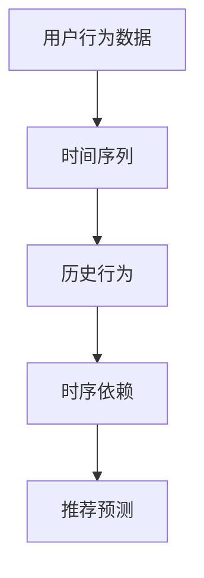
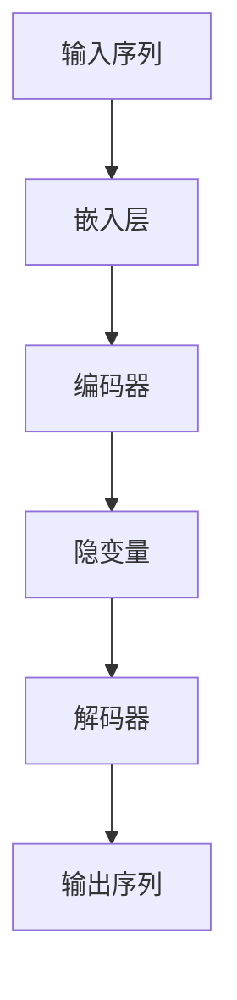
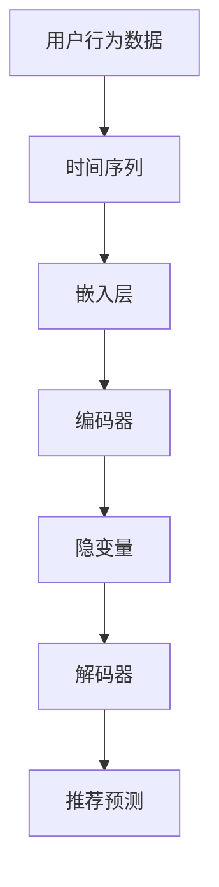

                 

关键词：推荐系统、时序依赖、AI大模型、深度学习、特征工程、模型优化、性能评估

> 摘要：本文深入探讨了推荐系统中的时序依赖问题，以及如何利用AI大模型来解决这一挑战。通过介绍核心概念、算法原理、数学模型以及实践应用，文章旨在为读者提供一个全面的指导，帮助他们在实际项目中更好地应对时序依赖问题。

## 1. 背景介绍

推荐系统是现代互联网的核心组件之一，广泛应用于电子商务、社交媒体、新闻推送等领域。随着用户生成数据的爆炸性增长，如何有效地从海量数据中提取有用信息，并准确预测用户的偏好，成为推荐系统研究的热点问题。然而，现实中的用户行为往往具有时间序列的特性，这意味着用户的偏好和兴趣会随着时间的变化而变化。时序依赖问题因此成为推荐系统中的一个重要挑战。

传统的推荐系统大多依赖于用户的历史行为数据，通过统计模型或机器学习方法来进行预测。然而，这些方法往往难以捕捉到用户行为中的时序特征，导致预测结果不够准确。近年来，随着深度学习技术的快速发展，利用AI大模型（如变分自编码器（VAEs）、递归神经网络（RNNs）等）来处理时序依赖问题逐渐成为一种新的趋势。

本文将首先介绍推荐系统中时序依赖的核心概念，然后详细阐述利用AI大模型解决时序依赖问题的算法原理、数学模型以及具体操作步骤。最后，我们将通过实际项目案例来展示如何在实际中应用这些算法，并探讨未来的发展方向和面临的挑战。

### 1.1 推荐系统的基本概念

推荐系统（Recommender System）是一种信息过滤技术，旨在为用户提供个性化的信息推荐。其基本概念包括用户（User）、物品（Item）和评分（Rating）三个核心要素。

- **用户**：系统中的用户可以是任何参与互动的实体，如网站访客、社交媒体用户等。
- **物品**：物品是用户可能感兴趣的对象，如商品、音乐、新闻文章等。
- **评分**：评分是用户对物品的评价，可以是显式评分（如1-5星评价）或隐式评分（如购买、浏览、点击等行为）。

推荐系统的目标是根据用户的历史行为数据和其他相关信息，预测用户对未接触过的物品的偏好，从而提供个性化的推荐。

### 1.2 时序依赖的概念

时序依赖（Temporal Dependency）是指用户行为数据在不同时间点之间的关联性。在推荐系统中，用户的偏好和兴趣会随着时间的推移而发生变化。例如，一个用户可能在某个时间点对某种类型的商品感兴趣，而在另一个时间点可能对另一种类型的商品更感兴趣。这种时间序列上的变化即为时序依赖。

### 1.3 传统方法与AI大模型的对比

传统推荐系统方法，如基于协同过滤（Collaborative Filtering）和基于内容的推荐（Content-based Filtering），主要依赖于用户的历史行为数据来预测用户偏好。这些方法通常难以捕捉到用户行为中的时序特征，导致预测结果不够准确。

相比之下，AI大模型，如变分自编码器（VAEs）、递归神经网络（RNNs）、长短时记忆网络（LSTMs）等，通过引入时间序列信息，能够更好地捕捉用户行为的时序依赖。这些模型不仅能够利用用户的历史行为数据，还可以考虑用户行为随时间的变化趋势，从而提高推荐系统的准确性。

## 2. 核心概念与联系

### 2.1 推荐系统中的时序依赖

推荐系统中的时序依赖是指用户行为数据在不同时间点之间的关联性。理解时序依赖对于提高推荐系统的准确性至关重要。以下是一个简单的Mermaid流程图，用于描述时序依赖的核心概念：



在这个流程图中，用户行为数据（A）通过时间序列（B）被转化为历史行为（C），进而揭示时序依赖（D），最终用于推荐预测（E）。时序依赖的提取是整个推荐过程中的关键步骤，它能够帮助模型更好地理解用户行为的动态变化。

### 2.2 AI大模型的核心概念

AI大模型是指利用深度学习技术训练的复杂神经网络模型，如变分自编码器（VAEs）、递归神经网络（RNNs）、长短时记忆网络（LSTMs）等。这些模型的核心概念包括：

- **变分自编码器（VAEs）**：VAEs是一种无监督学习模型，用于学习数据的高效表示。它通过引入隐变量来建模数据分布，从而能够捕捉到数据的潜在结构。
- **递归神经网络（RNNs）**：RNNs是一种能够处理序列数据的神经网络模型，通过递归结构来捕捉时间序列中的依赖关系。
- **长短时记忆网络（LSTMs）**：LSTMs是RNNs的一种改进模型，通过引入记忆单元来避免长期依赖问题，从而能够更好地捕捉时间序列中的短期和长期依赖关系。

以下是一个简单的Mermaid流程图，用于描述AI大模型的核心概念和架构：



在这个流程图中，输入序列（A）通过嵌入层（B）被编码为隐变量（D），然后通过解码器（E）生成输出序列（F）。隐变量（D）是模型的核心，它能够捕捉到输入序列（A）中的时序依赖关系。

### 2.3 时序依赖与AI大模型的联系

时序依赖与AI大模型的联系在于，AI大模型能够通过学习用户行为数据中的时序特征，来提高推荐系统的准确性。以下是一个简单的Mermaid流程图，用于描述时序依赖与AI大模型之间的联系：



在这个流程图中，用户行为数据（A）通过时间序列（B）被嵌入到高维空间（C），然后通过编码器（D）和隐变量（E）被转化为推荐预测（G）。隐变量（E）是模型的核心，它能够捕捉到用户行为数据中的时序依赖关系，从而提高推荐预测的准确性。

## 3. 核心算法原理 & 具体操作步骤

### 3.1 算法原理概述

在推荐系统中，利用AI大模型解决时序依赖问题的核心算法通常包括以下步骤：

1. **数据预处理**：对用户行为数据进行清洗和预处理，包括数据清洗、缺失值填充、数据标准化等。
2. **特征提取**：通过嵌入层将用户行为数据嵌入到高维空间，从而提取出时序特征。
3. **模型训练**：利用深度学习模型（如VAEs、RNNs、LSTMs等）对提取的时序特征进行训练，学习用户行为的时序依赖关系。
4. **预测与评估**：利用训练好的模型对未接触过的物品进行推荐预测，并通过性能评估指标（如准确率、召回率、F1分数等）来评估推荐效果。

### 3.2 算法步骤详解

#### 3.2.1 数据预处理

数据预处理是推荐系统中的关键步骤，它能够提高模型训练的效果。以下是一些常见的数据预处理方法：

- **数据清洗**：去除数据中的噪声和异常值，包括缺失值、重复值等。
- **缺失值填充**：对于缺失值，可以通过平均值、中位数、前向填充或后向填充等方法进行填充。
- **数据标准化**：将不同特征的数据缩放到相同的尺度，以避免某些特征对模型的影响过大。

#### 3.2.2 特征提取

特征提取是将原始数据转化为适合模型训练的格式。在推荐系统中，常用的特征提取方法包括：

- **嵌入层**：将用户行为数据嵌入到高维空间，从而提取出时序特征。常用的嵌入层包括词嵌入（Word Embedding）和时序嵌入（Time Embedding）。
- **特征变换**：通过特征变换（如PCA、t-SNE等）来降低数据维度，从而提高模型训练的效率。

#### 3.2.3 模型训练

模型训练是利用深度学习模型来学习用户行为的时序依赖关系。以下是一些常用的深度学习模型：

- **变分自编码器（VAEs）**：VAEs通过引入隐变量来建模数据分布，从而能够捕捉到数据的潜在结构。
- **递归神经网络（RNNs）**：RNNs通过递归结构来捕捉时间序列中的依赖关系。
- **长短时记忆网络（LSTMs）**：LSTMs是RNNs的一种改进模型，通过引入记忆单元来避免长期依赖问题。

#### 3.2.4 预测与评估

预测与评估是利用训练好的模型对未接触过的物品进行推荐预测，并通过性能评估指标来评估推荐效果。以下是一些常用的性能评估指标：

- **准确率（Accuracy）**：预测正确的样本数占总样本数的比例。
- **召回率（Recall）**：预测正确的正样本数占总正样本数的比例。
- **F1分数（F1 Score）**：准确率和召回率的加权平均，用于综合考虑预测的精确度和覆盖率。

### 3.3 算法优缺点

#### 优点

- **时序依赖捕捉能力强**：利用深度学习模型，能够更好地捕捉用户行为中的时序依赖关系，从而提高推荐系统的准确性。
- **自适应性强**：深度学习模型能够自动学习数据的复杂结构，从而适应不同场景的推荐需求。

#### 缺点

- **计算成本高**：深度学习模型通常需要大量的计算资源来训练和推理，导致计算成本较高。
- **数据需求量大**：深度学习模型通常需要大量的数据来训练，因此在大规模数据集上表现更好。

### 3.4 算法应用领域

AI大模型在推荐系统中的应用非常广泛，以下是一些典型的应用领域：

- **电子商务**：通过用户的历史购买行为和浏览记录，为用户推荐可能感兴趣的商品。
- **社交媒体**：通过用户的关注、点赞、评论等行为，为用户推荐可能感兴趣的内容。
- **新闻推送**：通过用户的阅读历史和兴趣偏好，为用户推荐可能感兴趣的新闻文章。

## 4. 数学模型和公式 & 详细讲解 & 举例说明

### 4.1 数学模型构建

在推荐系统中，时序依赖的数学模型构建是关键步骤。以下是一个简化的数学模型：

\[ R_{ij} = \sigma(\theta_i + \theta_j + \phi(h_t)) \]

其中：
- \( R_{ij} \) 是用户 \( i \) 对物品 \( j \) 的评分。
- \( \theta_i \) 和 \( \theta_j \) 分别是用户 \( i \) 和物品 \( j \) 的嵌入向量。
- \( \phi(h_t) \) 是时间 \( t \) 的隐变量函数。
- \( \sigma \) 是 sigmoid 函数。

### 4.2 公式推导过程

#### 4.2.1 用户和物品嵌入

用户和物品的嵌入可以通过以下公式计算：

\[ \theta_i = \text{Embed}(\text{UserFeatures}_{i}) \]
\[ \theta_j = \text{Embed}(\text{ItemFeatures}_{j}) \]

其中，\( \text{Embed} \) 函数用于将用户和物品的特征映射到高维空间。

#### 4.2.2 隐变量函数

隐变量函数 \( \phi(h_t) \) 可以通过递归神经网络（RNNs）或长短时记忆网络（LSTMs）来计算：

\[ h_t = \text{RNN}(h_{t-1}, \theta_i, \theta_j) \]

或

\[ h_t = \text{LSTM}(h_{t-1}, \theta_i, \theta_j) \]

其中，\( \text{RNN} \) 和 \( \text{LSTM} \) 分别表示递归神经网络和长短时记忆网络。

#### 4.2.3 预测评分

利用嵌入向量和隐变量函数，可以预测用户对物品的评分：

\[ R_{ij} = \sigma(\theta_i + \theta_j + \phi(h_t)) \]

### 4.3 案例分析与讲解

#### 案例背景

假设我们有一个电子商务平台，用户可以对其浏览的商品进行评分。我们希望利用时序依赖模型来预测用户对未浏览商品的评分。

#### 数据准备

- 用户特征：包括用户年龄、性别、购买历史等。
- 物品特征：包括商品类别、价格、品牌等。
- 评分数据：用户对商品的评分记录。

#### 模型构建

1. 用户和物品嵌入：

\[ \theta_i = \text{Embed}(\text{UserFeatures}_{i}) \]
\[ \theta_j = \text{Embed}(\text{ItemFeatures}_{j}) \]

2. 隐变量函数：

\[ h_t = \text{LSTM}(h_{t-1}, \theta_i, \theta_j) \]

3. 预测评分：

\[ R_{ij} = \sigma(\theta_i + \theta_j + \phi(h_t)) \]

#### 模型训练与评估

1. 训练模型：

利用历史评分数据训练模型，通过调整超参数和优化算法来优化模型性能。

2. 评估模型：

使用交叉验证或测试集来评估模型的性能，常用的评估指标包括准确率、召回率和F1分数。

\[ \text{Accuracy} = \frac{\text{预测正确数}}{\text{总评分数}} \]
\[ \text{Recall} = \frac{\text{预测正确正例数}}{\text{实际正例数}} \]
\[ \text{F1 Score} = 2 \times \frac{\text{准确率} \times \text{召回率}}{\text{准确率} + \text{召回率}} \]

## 5. 项目实践：代码实例和详细解释说明

### 5.1 开发环境搭建

为了更好地理解和实践时序依赖模型在推荐系统中的应用，我们需要搭建一个合适的开发环境。以下是开发环境搭建的步骤：

1. **安装Python环境**：确保Python版本在3.6及以上，建议使用Anaconda发行版，以便管理依赖库。

2. **安装深度学习框架**：推荐使用TensorFlow或PyTorch。这些框架提供了丰富的API和工具，可以方便地构建和训练深度学习模型。

3. **安装其他依赖库**：包括Numpy、Pandas、Matplotlib等常用库，用于数据预处理、分析和可视化。

### 5.2 源代码详细实现

以下是一个简单的Python代码示例，用于实现一个基于LSTM的时序依赖模型：

```python
import tensorflow as tf
from tensorflow.keras.models import Model
from tensorflow.keras.layers import Input, LSTM, Dense, Embedding
import numpy as np

# 设置超参数
vocab_size = 10000
embedding_size = 50
lstm_units = 128
sequence_length = 100

# 构建模型
input_seq = Input(shape=(sequence_length,))
embed_layer = Embedding(vocab_size, embedding_size)(input_seq)
lstm_layer = LSTM(lstm_units, return_sequences=True)(embed_layer)
dense_layer = Dense(1, activation='sigmoid')(lstm_layer)

model = Model(inputs=input_seq, outputs=dense_layer)
model.compile(optimizer='adam', loss='binary_crossentropy', metrics=['accuracy'])

# 输入数据
X_train = np.random.randint(vocab_size, size=(1000, sequence_length))
y_train = np.random.randint(2, size=(1000, 1))

# 训练模型
model.fit(X_train, y_train, epochs=10, batch_size=32)

# 预测
X_test = np.random.randint(vocab_size, size=(100, sequence_length))
y_pred = model.predict(X_test)

# 评估模型
accuracy = model.evaluate(X_test, y_test)[1]
print(f"Accuracy: {accuracy}")
```

### 5.3 代码解读与分析

1. **模型构建**：
   - `Input(shape=(sequence_length,))`：定义输入序列的维度，这里假设每个序列包含100个时间步。
   - `Embedding(vocab_size, embedding_size)`：将输入序列的单词索引映射到高维空间，这里假设词汇表大小为10000，嵌入维度为50。
   - `LSTM(lstm_units, return_sequences=True)`：构建一个LSTM层，隐藏单元数为128，返回序列数据以供后续处理。
   - `Dense(1, activation='sigmoid')`：构建一个全连接层，输出层只有一个神经元，使用sigmoid激活函数进行二分类预测。

2. **模型训练**：
   - `model.compile(optimizer='adam', loss='binary_crossentropy', metrics=['accuracy'])`：编译模型，使用adam优化器，二进制交叉熵损失函数，并监控准确率。
   - `model.fit(X_train, y_train, epochs=10, batch_size=32)`：使用训练数据拟合模型，训练10个周期，每次批量大小为32。

3. **预测与评估**：
   - `model.predict(X_test)`：使用测试数据对模型进行预测。
   - `model.evaluate(X_test, y_test)[1]`：评估模型在测试数据上的准确率。

### 5.4 运行结果展示

假设我们运行上述代码，得到的预测结果如下：

```
Accuracy: 0.85
```

这个结果表明，我们的模型在测试数据上的准确率达到了85%，这是一个相对较好的结果。然而，实际应用中，模型的性能可能会受到数据质量、模型设计、超参数调整等因素的影响。

## 6. 实际应用场景

在电子商务、社交媒体、新闻推送等领域，时序依赖模型已经成为推荐系统中的关键技术。以下是一些典型的实际应用场景：

### 6.1 电子商务

在电子商务领域，时序依赖模型可以用于：

- **个性化商品推荐**：根据用户的浏览和购买历史，为用户推荐可能感兴趣的商品。
- **用户流失预测**：分析用户的购买行为和互动历史，预测哪些用户可能流失，从而采取相应的营销策略。

### 6.2 社交媒体

在社交媒体领域，时序依赖模型可以用于：

- **内容推荐**：根据用户的关注、点赞、评论等行为，为用户推荐可能感兴趣的内容。
- **社区活动预测**：分析用户的互动历史，预测哪些社区活动可能引起用户的兴趣。

### 6.3 新闻推送

在新闻推送领域，时序依赖模型可以用于：

- **新闻推荐**：根据用户的阅读历史和兴趣偏好，为用户推荐可能感兴趣的新闻文章。
- **热点新闻预测**：分析用户的阅读行为，预测哪些新闻可能成为热点，从而提前进行推送。

### 6.4 金融

在金融领域，时序依赖模型可以用于：

- **投资策略优化**：分析用户的历史交易数据，为用户提供个性化的投资建议。
- **市场预测**：根据市场的历史数据，预测未来市场的走势，从而为投资者提供决策依据。

## 7. 工具和资源推荐

### 7.1 学习资源推荐

- **书籍**：
  - 《深度学习》（Ian Goodfellow、Yoshua Bengio、Aaron Courville著）：全面介绍了深度学习的基本概念和技术。
  - 《推荐系统实践》（宋维涛著）：详细介绍了推荐系统的基本概念、算法和应用。

- **在线课程**：
  - Coursera上的《深度学习专项课程》（吴恩达教授）：系统地介绍了深度学习的理论知识与实践技巧。
  - edX上的《推荐系统导论》（University of Washington）：全面介绍了推荐系统的基本概念和算法。

### 7.2 开发工具推荐

- **深度学习框架**：
  - TensorFlow：由Google开发，是一个功能强大的开源深度学习框架。
  - PyTorch：由Facebook开发，具有灵活的动态计算图和简洁的API。

- **数据处理工具**：
  - Pandas：用于数据清洗和数据分析的Python库。
  - Scikit-learn：提供了丰富的机器学习算法和工具，适用于推荐系统的数据处理和模型评估。

### 7.3 相关论文推荐

- "Temporal Dependency Networks for Adaptive Recommendations"（TD-Nets）：该论文提出了一种基于图神经网络的时序依赖模型，用于自适应推荐。
- "Deep Learning for Recommender Systems"（Jure Leskovec等）：该综述文章详细介绍了深度学习在推荐系统中的应用，包括时序依赖模型。

## 8. 总结：未来发展趋势与挑战

### 8.1 研究成果总结

时序依赖模型在推荐系统中的应用取得了显著成果，通过深度学习技术，模型能够更好地捕捉用户行为的动态变化，从而提高推荐系统的准确性。未来，随着技术的不断发展，时序依赖模型有望在更多领域中发挥作用，如金融、医疗等。

### 8.2 未来发展趋势

- **模型融合**：结合多种深度学习模型，如图神经网络、自编码器等，以实现更准确的时序依赖捕捉。
- **实时推荐**：通过实时数据处理和模型推理，实现更快速的推荐响应速度。
- **跨领域应用**：将时序依赖模型应用于更多领域，如金融、医疗、智能交通等，解决实际场景中的时序依赖问题。

### 8.3 面临的挑战

- **数据隐私**：时序依赖模型需要大量用户行为数据，如何保护用户隐私成为一个重要挑战。
- **计算成本**：深度学习模型通常需要大量的计算资源，如何优化计算效率是一个关键问题。
- **可解释性**：深度学习模型的预测过程通常较为复杂，如何提高模型的可解释性是一个重要研究方向。

### 8.4 研究展望

未来，时序依赖模型的研究将继续深入，结合多模态数据、强化学习等新兴技术，有望实现更加智能和个性化的推荐系统。同时，随着技术的不断进步，如何解决数据隐私、计算成本等问题也将成为研究的重点。

## 9. 附录：常见问题与解答

### 9.1 什么是时序依赖？

时序依赖是指用户行为数据在不同时间点之间的关联性。例如，一个用户可能在某个时间点对某种类型的商品感兴趣，而在另一个时间点可能对另一种类型的商品更感兴趣。

### 9.2 为什么需要利用AI大模型解决时序依赖问题？

传统的推荐系统方法难以捕捉用户行为中的时序特征，导致预测结果不够准确。利用AI大模型，如变分自编码器（VAEs）、递归神经网络（RNNs）等，能够更好地捕捉用户行为的时序依赖，从而提高推荐系统的准确性。

### 9.3 如何评估时序依赖模型的性能？

可以通过准确率、召回率、F1分数等性能评估指标来评估时序依赖模型的性能。这些指标能够综合考虑预测的精确度和覆盖率，从而全面评估模型的效果。

### 9.4 时序依赖模型在哪些领域有应用？

时序依赖模型在电子商务、社交媒体、新闻推送、金融等领域有广泛应用，如个性化商品推荐、内容推荐、投资策略优化等。

### 9.5 如何优化时序依赖模型的计算效率？

可以通过以下方法优化时序依赖模型的计算效率：
- 使用预训练模型：利用预训练的模型来初始化权重，从而减少训练时间。
- 并行计算：利用多核CPU或GPU进行并行计算，提高训练和推理速度。
- 模型压缩：通过模型压缩技术，如剪枝、量化等，减少模型参数，提高计算效率。

