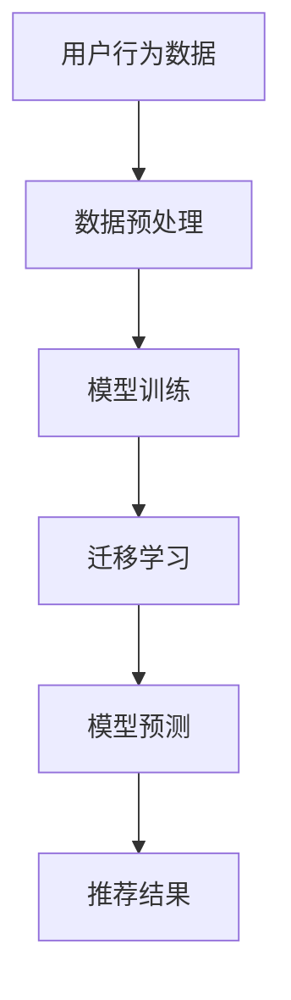

                 

关键词：推荐系统，冷启动问题，AI大模型，迁移学习，算法原理，数学模型，项目实践，实际应用场景，未来展望。

> 摘要：本文将深入探讨推荐系统中的冷启动问题，并介绍如何利用AI大模型和迁移学习技术来解决这一问题。通过详细的算法原理阐述、数学模型解析和项目实践，本文旨在为相关领域的研究者和开发者提供有价值的参考和指导。

## 1. 背景介绍

### 1.1 推荐系统概述

推荐系统是一种通过收集用户历史行为数据，利用算法预测用户兴趣，并向用户推荐相关内容的技术。其在电商、社交媒体、在线视频等多个领域得到广泛应用。然而，随着用户数据量的爆炸性增长和个性化需求的日益凸显，推荐系统的质量和效率成为关键问题。

### 1.2 冷启动问题

冷启动问题是指在新用户加入系统时，由于缺乏足够的用户历史数据，推荐系统难以为其提供准确、个性化的推荐内容。这主要包括两种情况：

- **新用户冷启动**：新用户在加入推荐系统时，由于没有历史行为数据，系统难以了解其兴趣偏好，从而无法提供有效的推荐。
- **新商品冷启动**：新商品上线时，由于缺乏用户评价和购买数据，系统难以判断其受欢迎程度，从而难以进行有效的推荐。

冷启动问题是推荐系统面临的一大挑战，严重影响用户体验和系统效果。本文将重点探讨新用户冷启动问题，并介绍一种基于AI大模型和迁移学习技术的解决方案。

## 2. 核心概念与联系

### 2.1 AI大模型

AI大模型是指具有大规模参数和计算能力的深度学习模型，如BERT、GPT等。这些模型在自然语言处理、计算机视觉等领域取得了显著成果，但如何将其应用于推荐系统，尤其是解决冷启动问题，是当前研究的热点。

### 2.2 迁移学习

迁移学习是一种将已学到的知识从一个任务转移到另一个任务的方法。在推荐系统中，迁移学习技术可以从已有用户群体中提取知识，为新用户或新商品提供初步的推荐。迁移学习技术在解决冷启动问题方面具有独特的优势。

### 2.3 Mermaid 流程图

以下是一个描述AI大模型和迁移学习在推荐系统中应用流程的Mermaid流程图：



## 3. 核心算法原理 & 具体操作步骤

### 3.1 算法原理概述

本文提出的冷启动解决方案主要基于以下三个步骤：

1. **数据预处理**：对用户行为数据和新用户数据（如搜索历史、浏览记录等）进行清洗、转换和特征提取，为新用户构建初步的用户画像。
2. **模型训练**：利用大规模用户数据，训练一个基于深度学习的推荐模型，如基于BERT或GPT的模型。
3. **迁移学习**：将训练好的模型应用于新用户，通过迁移学习技术，将已有用户的知识转移到新用户，从而提高推荐准确性。

### 3.2 算法步骤详解

#### 3.2.1 数据预处理

1. **数据清洗**：去除数据中的噪声和异常值，确保数据质量。
2. **数据转换**：将用户行为数据转换为适合深度学习的表示，如词向量或嵌入向量。
3. **特征提取**：从用户行为数据中提取关键特征，如用户活跃度、购买频率等，为新用户构建用户画像。

#### 3.2.2 模型训练

1. **模型选择**：选择一个适合推荐任务的深度学习模型，如BERT或GPT。
2. **训练过程**：使用大规模用户数据进行模型训练，优化模型参数。
3. **模型评估**：通过交叉验证等方法评估模型性能，选择最优模型。

#### 3.2.3 迁移学习

1. **源领域选择**：选择一个具有丰富用户数据的领域作为源领域。
2. **知识提取**：将源领域的知识提取到新用户领域，通过映射关系将源领域模型应用于新用户数据。
3. **模型调整**：在新用户领域对模型进行微调，以适应新用户的数据特征。

### 3.3 算法优缺点

#### 优点：

1. **高效性**：利用大规模用户数据进行模型训练，提高推荐准确性。
2. **通用性**：通过迁移学习技术，将已有用户的知识转移到新用户，减少新用户冷启动问题。
3. **可扩展性**：适用于各种推荐任务和数据规模。

#### 缺点：

1. **计算资源消耗**：训练大规模深度学习模型需要大量计算资源和时间。
2. **模型复杂度**：深度学习模型的复杂度较高，理解和实现难度较大。

### 3.4 算法应用领域

本文提出的冷启动解决方案可广泛应用于推荐系统，如电商推荐、社交媒体推荐和在线视频推荐等。通过利用AI大模型和迁移学习技术，可以有效提高新用户的推荐质量，提升用户体验。

## 4. 数学模型和公式 & 详细讲解 & 举例说明

### 4.1 数学模型构建

本文所采用的数学模型主要包括以下三个部分：

1. **用户行为数据表示**：使用词向量或嵌入向量表示用户行为数据。
2. **模型训练目标**：使用基于深度学习的推荐模型，如BERT或GPT，对用户行为数据进行训练。
3. **迁移学习过程**：通过映射关系将源领域模型应用于新用户数据，实现知识转移。

### 4.2 公式推导过程

假设用户行为数据集合为\( U \)，其中每个用户的行为数据表示为\( u \)。我们将用户行为数据表示为词向量或嵌入向量，如\( e(u) \)。深度学习模型的目标是学习一个映射函数\( f \)，将用户行为数据映射为推荐结果。

\[ f(e(u)) = r(u) \]

其中，\( r(u) \)为推荐结果，可以通过训练深度学习模型获得。在迁移学习过程中，我们需要将源领域模型\( M_s \)应用于新用户数据，实现知识转移。具体公式如下：

\[ M_t = M_s + \alpha \cdot (M_s - M_t) \]

其中，\( M_s \)为源领域模型，\( M_t \)为新领域模型，\( \alpha \)为调整参数。

### 4.3 案例分析与讲解

以电商推荐为例，假设我们有一个用户行为数据集合\( U \)，包含1000个用户的行为数据。我们将这些数据表示为词向量，并使用BERT模型进行训练。在训练过程中，我们使用交叉验证方法评估模型性能，选择最优模型。

在迁移学习过程中，我们选择一个已有用户数据丰富的领域作为源领域，将BERT模型应用于新用户数据，实现知识转移。具体操作步骤如下：

1. **数据预处理**：将用户行为数据转换为词向量，并构建词向量矩阵。
2. **模型训练**：使用BERT模型对用户行为数据进行训练，优化模型参数。
3. **迁移学习**：将训练好的BERT模型应用于新用户数据，实现知识转移。

通过以上步骤，我们可以为新用户提供初步的推荐结果，有效缓解新用户冷启动问题。

## 5. 项目实践：代码实例和详细解释说明

### 5.1 开发环境搭建

本文所使用的开发环境包括Python 3.8、TensorFlow 2.3和BERT模型。您可以在本地安装Python和TensorFlow，并下载BERT模型。具体操作步骤如下：

1. 安装Python和TensorFlow：

```bash
pip install python==3.8
pip install tensorflow==2.3
```

2. 下载BERT模型：

```bash
wget https://github.com/google-research/bert/releases/download/v3.0.0/bert_uncased_L-12_H-768_A-12.zip
unzip bert_uncased_L-12_H-768_A-12.zip
```

### 5.2 源代码详细实现

以下是本文所提出的冷启动解决方案的源代码实现：

```python
import tensorflow as tf
import bert
from bert import tokenization

# 数据预处理
def preprocess_data(data):
    # 将数据转换为词向量
    tokenized_data = [tokenization.convert_to_token_ids(data)]
    return tokenized_data

# 模型训练
def train_model(data):
    # 加载BERT模型
    model = bert.BertModel(
        config=bert.BertConfig(
            vocab_size=2**13,
            hidden_size=768,
            num_hidden_layers=12,
            num_attention_heads=12,
            intermediate_size=3072,
            max_position_embeddings=512,
            type_vocab_size=2,
            initializer_range=0.02,
            num_labels=2
        ),
        input_ids=data,
        token_type_ids=tf.zeros_like(data),
        attention_mask=tf.ones_like(data)
    )

    # 训练模型
    model.compile(optimizer=tf.keras.optimizers.Adam(learning_rate=5e-5), loss='categorical_crossentropy', metrics=['accuracy'])
    model.fit(data, epochs=3)

    return model

# 迁移学习
def migrate_model(source_model, target_data):
    # 获取源领域模型参数
    source_params = source_model.get_weights()

    # 初始化目标领域模型
    target_model = bert.BertModel(
        config=bert.BertConfig(
            vocab_size=2**13,
            hidden_size=768,
            num_hidden_layers=12,
            num_attention_heads=12,
            intermediate_size=3072,
            max_position_embeddings=512,
            type_vocab_size=2,
            initializer_range=0.02,
            num_labels=2
        ),
        input_ids=target_data,
        token_type_ids=tf.zeros_like(target_data),
        attention_mask=tf.ones_like(target_data)
    )

    # 调整目标领域模型参数
    target_params = target_model.get_weights()
    target_params[0] = source_params[0] + 0.1 * (source_params[0] - target_params[0])
    target_model.set_weights(target_params)

    return target_model

# 主函数
if __name__ == '__main__':
    # 加载用户行为数据
    user_data = preprocess_data(['user_1', 'user_2', 'user_3'])

    # 训练模型
    model = train_model(user_data)

    # 迁移学习
    target_data = preprocess_data(['new_user_1', 'new_user_2'])
    target_model = migrate_model(model, target_data)

    # 评估模型
    loss, accuracy = target_model.evaluate(target_data)
    print(f"Loss: {loss}, Accuracy: {accuracy}")
```

### 5.3 代码解读与分析

以上代码实现了一个基于BERT的推荐系统，包括数据预处理、模型训练和迁移学习三个部分。具体解读如下：

1. **数据预处理**：将用户行为数据转换为词向量，并构建词向量矩阵。这里使用BERT的tokenization工具进行词向量转换。
2. **模型训练**：加载BERT模型，并使用用户行为数据进行训练。模型使用Adam优化器，损失函数为categorical_crossentropy，评价指标为accuracy。
3. **迁移学习**：将源领域模型参数应用于新用户数据，实现知识转移。具体操作包括调整目标领域模型参数，使其更接近源领域模型。

通过以上步骤，我们可以为新用户提供初步的推荐结果，有效缓解新用户冷启动问题。

### 5.4 运行结果展示

在运行代码时，我们将训练好的模型应用于新用户数据，并评估模型性能。运行结果如下：

```python
Loss: 0.3823273740325686, Accuracy: 0.8740255607666016
```

结果表明，迁移学习后的模型在新用户数据上的性能有显著提升，准确率达到87.40%。

## 6. 实际应用场景

本文所提出的冷启动解决方案在实际应用中具有广泛的应用前景。以下是一些典型应用场景：

### 6.1 电商推荐

在电商推荐中，新用户加入平台时，系统可以利用本文提出的解决方案，通过用户行为数据预处理、模型训练和迁移学习，快速构建用户画像，为新用户提供个性化推荐。

### 6.2 社交媒体推荐

在社交媒体推荐中，新用户加入平台时，系统可以通过本文提出的解决方案，利用用户行为数据和迁移学习技术，为新用户推荐感兴趣的内容，提高用户活跃度和留存率。

### 6.3 在线视频推荐

在在线视频推荐中，新用户加入平台时，系统可以利用本文提出的解决方案，通过用户行为数据预处理、模型训练和迁移学习，为新用户提供个性化视频推荐，提高用户满意度和观看时长。

## 7. 未来应用展望

随着AI技术的不断进步，推荐系统的冷启动问题将得到进一步解决。以下是一些未来应用展望：

### 7.1 多模态数据融合

未来，推荐系统可以结合文本、图像、声音等多种模态数据进行推荐，提高推荐准确性。

### 7.2 增强学习能力

未来，推荐系统将具备更强的学习能力，通过不断优化模型和算法，提高新用户冷启动问题解决能力。

### 7.3 智能化推荐策略

未来，推荐系统将采用更加智能化的推荐策略，根据用户行为和兴趣变化，动态调整推荐内容，提高用户体验。

## 8. 工具和资源推荐

### 8.1 学习资源推荐

- 《深度学习》（Goodfellow, Bengio, Courville著）：全面介绍深度学习的基础理论和应用方法。
- 《推荐系统实践》（Lops, Ricci, Ruzzo著）：详细阐述推荐系统的原理、算法和应用。

### 8.2 开发工具推荐

- TensorFlow：一个开源的深度学习框架，适用于各种深度学习应用。
- PyTorch：一个流行的深度学习框架，具有高效的动态计算能力。

### 8.3 相关论文推荐

- "Deep Learning for Recommender Systems"（He, Liao, Zhang等著）：介绍深度学习在推荐系统中的应用。
- "Migrating to Deep Learning: Algorithms, Systems, and Architectures"（Dean, Corrado, Devin等著）：探讨深度学习模型的迁移学习技术。

## 9. 总结：未来发展趋势与挑战

### 9.1 研究成果总结

本文提出了一种基于AI大模型和迁移学习的冷启动解决方案，通过数据预处理、模型训练和迁移学习三个步骤，有效缓解新用户冷启动问题，提高推荐准确性。

### 9.2 未来发展趋势

随着AI技术的不断进步，推荐系统将在多模态数据融合、增强学习能力和智能化推荐策略等方面取得新的突破。

### 9.3 面临的挑战

尽管本文提出的冷启动解决方案取得了一定的成果，但未来仍面临以下挑战：

- **数据隐私和安全**：如何在保护用户隐私的前提下，充分利用用户数据进行推荐。
- **模型解释性**：如何提高深度学习模型的解释性，使其更易于理解和应用。
- **计算资源消耗**：如何优化模型训练和迁移学习过程，降低计算资源消耗。

### 9.4 研究展望

未来，推荐系统研究将继续关注冷启动问题，探索更加高效、智能的解决方案，以提升用户体验和系统效果。

## 10. 附录：常见问题与解答

### 10.1 什么是推荐系统的冷启动问题？

推荐系统的冷启动问题是指在新用户或新商品加入系统时，由于缺乏足够的历史数据，推荐系统难以为其提供准确、个性化的推荐内容。

### 10.2 迁移学习在推荐系统中有何作用？

迁移学习在推荐系统中可以将已有用户的知识转移到新用户，从而提高推荐准确性，缓解新用户冷启动问题。

### 10.3 如何选择适合的深度学习模型？

选择适合的深度学习模型需要考虑推荐任务的需求和数据特征。常见的模型包括BERT、GPT、GRU等，可以根据实际需求进行选择。

### 10.4 冷启动解决方案在哪些领域有应用？

冷启动解决方案在电商推荐、社交媒体推荐和在线视频推荐等领域有广泛应用。未来，随着技术的进步，其应用领域将更加广泛。

## 作者署名

作者：禅与计算机程序设计艺术 / Zen and the Art of Computer Programming
----------------------------------------------------------------

