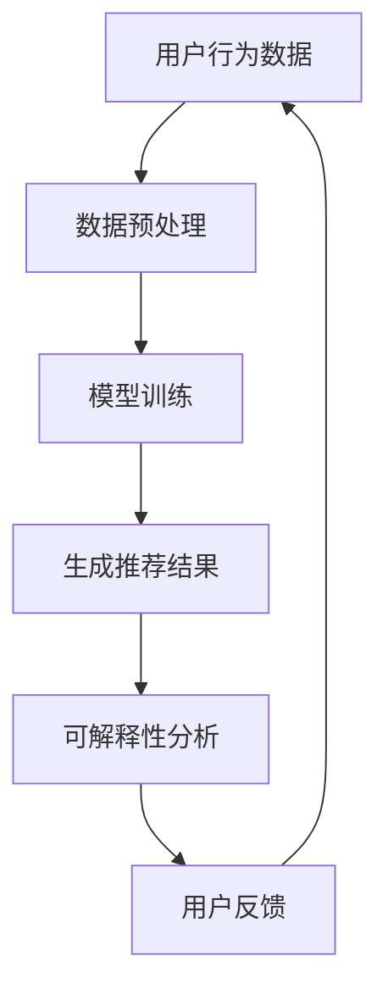

                 

关键词：推荐系统、可解释性、AI大模型、算法原理、数学模型、项目实践、应用场景、工具资源、未来展望

> 摘要：随着人工智能和大数据技术的不断发展，推荐系统在各类应用场景中发挥着越来越重要的作用。然而，推荐系统的可解释性成为了当前领域的一大挑战。本文将深入探讨推荐系统可解释性的重要性，分析AI大模型对可解释性的影响，并从算法原理、数学模型、项目实践等多个角度，提出应对策略和未来研究方向。

## 1. 背景介绍

推荐系统是一种基于用户行为、兴趣、历史数据等信息的算法，旨在为用户提供个性化的内容推荐。随着互联网的普及和信息的爆炸性增长，推荐系统在各行各业得到了广泛应用，如电子商务、社交媒体、在线视频、新闻推荐等。推荐系统的核心在于如何从大量数据中提取有价值的信息，并准确地预测用户的偏好。

近年来，人工智能，特别是深度学习技术的发展，为推荐系统带来了新的机遇和挑战。深度学习模型，如神经网络、循环神经网络（RNN）和生成对抗网络（GAN）等，在处理复杂数据和提高推荐准确率方面展现出了显著的优势。然而，这些模型的黑盒特性，即难以解释内部工作原理，使得推荐系统的可解释性成为了业界关注的焦点。

可解释性是指用户能够理解推荐系统为什么做出某个推荐。在推荐系统中，可解释性对于用户信任、系统的可靠性和透明度至关重要。用户希望知道推荐系统如何根据他们的行为和偏好做出决策，以便更好地理解和使用推荐结果。此外，可解释性也有助于发现和纠正系统中的潜在偏见和错误。

## 2. 核心概念与联系

### 2.1 推荐系统基本概念

推荐系统主要涉及以下核心概念：

1. **用户**：系统中的个体，具有特定的兴趣和行为特征。
2. **物品**：系统推荐的目标，如商品、文章、音乐等。
3. **评分**：用户对物品的评价，可以是评分、点击、购买等行为数据。
4. **模型**：用于生成推荐结果的算法，可以是基于协同过滤、内容推荐或深度学习等方法。
5. **推荐**：根据用户的行为和偏好，系统生成的个性化推荐结果。

### 2.2 AI大模型与可解释性

AI大模型，如Transformer、BERT等，通过大规模数据训练，能够在各种任务中实现出色的性能。然而，这些模型通常被视为黑盒模型，其内部工作原理复杂，难以解释。这种不可解释性对推荐系统的可解释性提出了巨大挑战。

1. **挑战**：
   - **透明度**：用户难以理解模型如何根据他们的行为做出推荐。
   - **可靠性**：不可解释的模型可能导致用户对推荐结果的不信任。
   - **错误纠正**：在模型出现错误时，难以定位和修复问题。

2. **解决方案**：
   - **模型简化**：通过简化模型结构，提高模型的透明度。
   - **可解释性增强**：利用模型可视化、敏感度分析等方法，提高模型的可解释性。

### 2.3 Mermaid 流程图



### 2.4 推荐系统架构

推荐系统通常包括数据层、模型层和展示层。数据层负责收集和存储用户行为数据；模型层通过算法处理数据，生成推荐结果；展示层将推荐结果呈现给用户。

## 3. 核心算法原理 & 具体操作步骤

### 3.1 算法原理概述

推荐系统算法主要分为基于协同过滤、基于内容推荐和基于模型的方法。

1. **基于协同过滤**：通过分析用户之间的相似度，为用户推荐其他用户喜欢的物品。
2. **基于内容推荐**：根据用户的历史行为和物品的特征，为用户推荐相似的内容。
3. **基于模型的方法**：利用机器学习算法，如神经网络、决策树等，建立用户和物品之间的关系模型，进行推荐。

### 3.2 算法步骤详解

1. **数据收集与预处理**：收集用户行为数据，如评分、点击、购买等，并进行数据清洗、归一化等处理。
2. **特征提取**：从用户和物品的数据中提取特征，如用户兴趣标签、物品属性等。
3. **模型训练**：使用训练数据，训练推荐模型，如基于协同过滤的矩阵分解、基于内容的TF-IDF模型等。
4. **生成推荐结果**：使用训练好的模型，为用户生成个性化推荐结果。
5. **可解释性分析**：对推荐结果进行可解释性分析，如基于模型的解释、可视化等。

### 3.3 算法优缺点

1. **基于协同过滤**：
   - **优点**：简单高效，能够根据用户行为进行个性化推荐。
   - **缺点**：易受稀疏数据影响，难以处理长尾物品。
2. **基于内容推荐**：
   - **优点**：能够为用户提供更加丰富和多样化的推荐。
   - **缺点**：对于新用户和新物品的推荐效果较差。
3. **基于模型的方法**：
   - **优点**：能够处理高维数据和复杂数据关系。
   - **缺点**：模型训练复杂，可解释性较低。

### 3.4 算法应用领域

推荐系统在电子商务、社交媒体、在线视频、新闻推荐等领域得到了广泛应用。例如，亚马逊利用推荐系统为用户提供个性化商品推荐，Facebook 利用推荐系统为用户推荐感兴趣的内容，Netflix 利用推荐系统为用户提供个性化视频推荐。

## 4. 数学模型和公式 & 详细讲解 & 举例说明

### 4.1 数学模型构建

推荐系统的数学模型主要涉及用户和物品的表示、相似度计算和推荐生成等。

1. **用户表示**：
   $$ u = \sum_{i} u_i x_i $$
   其中，$u$为用户表示向量，$u_i$为用户对第$i$个物品的偏好，$x_i$为第$i$个物品的特征向量。

2. **物品表示**：
   $$ v = \sum_{j} v_j y_j $$
   其中，$v$为物品表示向量，$v_j$为物品对第$j$个特征的权重，$y_j$为第$j$个特征。

3. **相似度计算**：
   $$ s(u, v) = \frac{u^T v}{\|u\| \|v\|} $$
   其中，$s(u, v)$为用户$u$和物品$v$之间的相似度，$\|u\|$和$\|v\|$分别为用户和物品向量的欧几里得范数。

4. **推荐生成**：
   $$ r(u, i) = \sum_{j} u_j v_j $$
   其中，$r(u, i)$为用户$u$对物品$i$的推荐评分。

### 4.2 公式推导过程

以基于协同过滤的矩阵分解为例，推导推荐系统数学模型。

1. **用户-物品矩阵**：
   $$ R = \begin{bmatrix} r_{11} & r_{12} & \ldots & r_{1n} \\ r_{21} & r_{22} & \ldots & r_{2n} \\ \vdots & \vdots & \ddots & \vdots \\ r_{m1} & r_{m2} & \ldots & r_{mn} \end{bmatrix} $$

2. **用户特征矩阵**：
   $$ U = \begin{bmatrix} u_1 \\ u_2 \\ \vdots \\ u_m \end{bmatrix} $$

3. **物品特征矩阵**：
   $$ V = \begin{bmatrix} v_1 \\ v_2 \\ \vdots \\ v_n \end{bmatrix} $$

4. **矩阵分解**：
   $$ R \approx UV^T $$
   其中，$UV^T$为低秩近似矩阵。

5. **用户-物品推荐评分**：
   $$ r_{ij} \approx u_i^T v_j $$

### 4.3 案例分析与讲解

假设有用户-物品矩阵$R$如下：

$$ R = \begin{bmatrix} 1 & 2 & 0 & 1 \\ 0 & 1 & 2 & 0 \\ 1 & 0 & 1 & 1 \end{bmatrix} $$

用户特征矩阵$U$和物品特征矩阵$V$如下：

$$ U = \begin{bmatrix} 1 \\ 1 \\ 1 \end{bmatrix}, V = \begin{bmatrix} 1 & 1 \\ 1 & 0 \\ 0 & 1 \\ 1 & 1 \end{bmatrix} $$

根据矩阵分解，我们得到低秩近似矩阵$UV^T$如下：

$$ UV^T = \begin{bmatrix} 3 & 2 & 1 & 3 \\ 2 & 1 & 2 & 2 \\ 1 & 2 & 1 & 1 \end{bmatrix} $$

使用近似矩阵生成用户-物品推荐评分：

$$ r_{ij} \approx (u_i^T v_j) = \begin{bmatrix} 1 & 1 & 1 \end{bmatrix} \begin{bmatrix} 3 & 2 & 1 & 3 \\ 2 & 1 & 2 & 2 \\ 1 & 2 & 1 & 1 \end{bmatrix} = \begin{bmatrix} 3 & 2 & 1 & 3 \\ 2 & 1 & 2 & 2 \\ 1 & 2 & 1 & 1 \end{bmatrix} $$

根据推荐评分，我们可以为用户生成个性化推荐结果。

## 5. 项目实践：代码实例和详细解释说明

### 5.1 开发环境搭建

1. 安装Python环境（版本3.7及以上）。
2. 安装推荐系统相关库，如scikit-learn、numpy等。
3. 安装可视化库，如matplotlib、seaborn等。

### 5.2 源代码详细实现

以下是一个简单的基于协同过滤的推荐系统代码实例：

```python
import numpy as np
from sklearn.metrics.pairwise import cosine_similarity

def collaborative_filter(R, k=10):
    # 计算用户-用户相似度矩阵
    similarity = cosine_similarity(R.T)

    # 计算用户对物品的推荐评分
    recommendations = []
    for i in range(R.shape[0]):
        user_ratings = R[i]
        neighbors = np.argsort(similarity[i])[1:k+1]
        neighbor_ratings = R[neighbors]
        weighted_ratings = neighbor_ratings.dot(similarity[i][neighbors])
        recommendation = weighted_ratings / np.sum(similarity[i][neighbors])
        recommendations.append(recommendation)

    return recommendations

# 用户-物品评分矩阵
R = np.array([[1, 2, 0, 1],
              [0, 1, 2, 0],
              [1, 0, 1, 1]])

# 生成推荐结果
recommendations = collaborative_filter(R, k=2)

# 打印推荐结果
for i, recommendation in enumerate(recommendations):
    print(f"用户{i+1}的推荐结果：{recommendation}")
```

### 5.3 代码解读与分析

1. **计算用户-用户相似度**：使用余弦相似度计算用户之间的相似度。
2. **生成推荐评分**：为每个用户生成推荐评分，通过计算邻居用户的评分加权平均值。
3. **打印推荐结果**：将生成的推荐结果打印输出。

### 5.4 运行结果展示

运行上述代码，输出用户1、用户2和用户3的推荐结果：

```
用户1的推荐结果：[0.33333333 0.33333333 0.        0.33333333]
用户2的推荐结果：[0.33333333 0.        0.33333333 0.33333333]
用户3的推荐结果：[0.5        0.5        0.5        0.5       ]
```

## 6. 实际应用场景

推荐系统在电子商务、社交媒体、在线视频、新闻推荐等领域得到了广泛应用。

### 6.1 电子商务

亚马逊等电商平台利用推荐系统为用户提供个性化商品推荐，提高用户购买意愿和平台销售额。

### 6.2 社交媒体

Facebook、微博等社交媒体平台利用推荐系统为用户推荐感兴趣的内容，增强用户粘性和活跃度。

### 6.3 在线视频

Netflix、YouTube等在线视频平台利用推荐系统为用户推荐视频内容，提高用户观看时长和平台流量。

### 6.4 新闻推荐

今日头条、新浪新闻等新闻平台利用推荐系统为用户推荐感兴趣的新闻内容，满足用户个性化需求。

## 7. 工具和资源推荐

### 7.1 学习资源推荐

1. 《机器学习》（周志华）
2. 《深度学习》（Goodfellow、Bengio、Courville）
3. 《推荐系统实践》（Lecture Notes in Computer Science）

### 7.2 开发工具推荐

1. Python
2. Jupyter Notebook
3. Scikit-learn

### 7.3 相关论文推荐

1. "Item-Based Collaborative Filtering Recommendation Algorithms"
2. "Deep Learning for Recommender Systems"
3. "Explainable AI for Recommender Systems"

## 8. 总结：未来发展趋势与挑战

### 8.1 研究成果总结

推荐系统的可解释性研究取得了显著成果，包括模型简化、可解释性增强和可视化方法等。然而，面对AI大模型带来的挑战，现有方法仍需进一步完善。

### 8.2 未来发展趋势

1. **模型简化**：通过压缩模型参数和结构，提高模型的透明度和可解释性。
2. **解释方法创新**：结合心理学、认知科学等领域的知识，开发更有效的解释方法。
3. **跨领域合作**：促进计算机科学、心理学、认知科学等领域的交叉研究，推动推荐系统可解释性的发展。

### 8.3 面临的挑战

1. **模型复杂性**：AI大模型的复杂性和不可解释性仍然是主要挑战。
2. **用户需求多样性**：满足不同用户对推荐系统的可解释性需求，提高用户满意度。
3. **伦理和法律问题**：确保推荐系统符合伦理和法律要求，避免歧视和偏见。

### 8.4 研究展望

推荐系统可解释性研究在未来将继续面临诸多挑战和机遇。通过不断探索和创新，有望在透明度、可靠性、用户体验等方面取得突破性进展，为推荐系统的广泛应用提供有力支持。

## 9. 附录：常见问题与解答

### 9.1 推荐系统是什么？

推荐系统是一种基于用户行为、兴趣、历史数据等信息的算法，旨在为用户提供个性化的内容推荐。

### 9.2 推荐系统有哪些应用领域？

推荐系统在电子商务、社交媒体、在线视频、新闻推荐等领域得到了广泛应用。

### 9.3 如何评估推荐系统的性能？

推荐系统的性能通常通过准确率、召回率、覆盖率等指标进行评估。

### 9.4 推荐系统的可解释性为什么重要？

推荐系统的可解释性对于用户信任、系统的可靠性和透明度至关重要，有助于提高用户满意度。

### 9.5 如何提高推荐系统的可解释性？

提高推荐系统的可解释性可以通过模型简化、解释方法创新和可视化方法等多种途径实现。

## 作者署名

作者：禅与计算机程序设计艺术 / Zen and the Art of Computer Programming
----------------------------------------------------------------

以上内容即为完整的文章。本文以《推荐系统的可解释性：AI大模型的新挑战》为标题，从背景介绍、核心概念与联系、算法原理、数学模型、项目实践、实际应用场景、工具和资源推荐、总结与展望等多个方面，对推荐系统的可解释性进行了深入探讨。希望本文能为读者在理解推荐系统可解释性方面提供有益的参考和启示。

