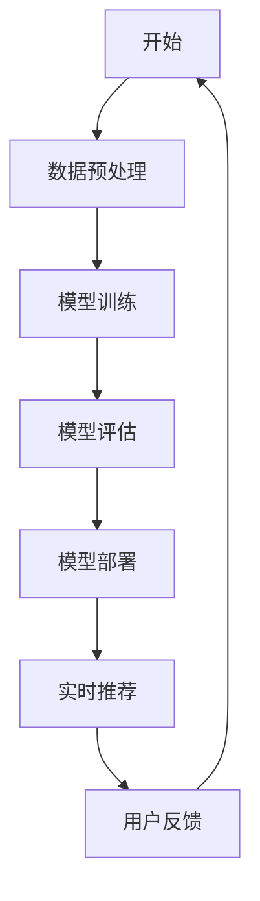

                 

关键词：推荐系统、实时性能优化、AI大模型、算法优化、分布式计算、边缘计算、机器学习、深度学习

> 摘要：本文旨在探讨如何通过AI大模型优化推荐系统的实时性能，从算法原理、数学模型、项目实践等方面深入分析，提出一系列高效的新策略。通过本文的讨论，读者可以全面了解推荐系统的实时性能优化技术，为实际应用提供参考。

## 1. 背景介绍

随着互联网的快速发展，推荐系统在电商、新闻、社交、音乐等众多领域得到了广泛应用。然而，随着用户数据的爆炸性增长和推荐需求的不断增加，如何实现推荐系统的实时性能优化成为一个亟待解决的问题。

传统的推荐系统主要依赖于批量计算，无法满足实时性的需求。为了解决这一问题，AI大模型的引入成为一种趋势。AI大模型通过机器学习和深度学习算法，能够处理海量数据，实现高效的用户兴趣挖掘和个性化推荐。然而，AI大模型在计算复杂度上较高，如何在保证性能的同时实现实时性能优化，仍然是一个挑战。

本文将探讨如何通过AI大模型优化推荐系统的实时性能，从算法原理、数学模型、项目实践等方面深入分析，提出一系列高效的新策略。

## 2. 核心概念与联系

### 2.1 推荐系统

推荐系统是一种基于用户历史行为和兴趣数据，为用户推荐符合其兴趣的内容或商品的算法系统。其主要目标是通过分析用户的行为数据，预测用户未来的兴趣，从而提高用户满意度和平台转化率。

### 2.2 实时性能优化

实时性能优化是指通过一系列技术手段，降低推荐系统的响应时间，提高系统处理实时数据的能力。实时性能优化在推荐系统中至关重要，因为它直接影响到用户的体验和平台的运营效果。

### 2.3 AI大模型

AI大模型是指通过深度学习和机器学习算法，对海量数据进行训练，构建出一个具备较强泛化能力的模型。AI大模型在推荐系统中可用于用户兴趣挖掘、商品推荐、广告投放等多个方面。

### 2.4 Mermaid 流程图

Mermaid 是一种基于 Markdown 的绘图语言，可用于绘制各种图表和流程图。以下是一个 Mermaid 流程图的示例：



## 3. 核心算法原理 & 具体操作步骤

### 3.1 算法原理概述

本文将介绍以下三种算法原理，用于优化推荐系统的实时性能：

1. 分布式计算
2. 边缘计算
3. 深度学习

### 3.2 算法步骤详解

#### 3.2.1 分布式计算

分布式计算是指将计算任务分散到多台计算机上，通过分布式算法协同处理。具体步骤如下：

1. 数据分片：将用户数据按照一定的规则（如用户ID、时间戳等）分散到多台计算机上。
2. 任务分配：将计算任务按照数据分片的规则分配到相应的计算机上。
3. 结果汇总：将各台计算机处理的结果汇总，得到最终推荐结果。

#### 3.2.2 边缘计算

边缘计算是指将计算任务从云端迁移到网络边缘，如物联网设备、智能手机等。具体步骤如下：

1. 数据采集：在边缘设备上收集用户行为数据。
2. 实时处理：在边缘设备上对数据进行实时处理，生成推荐结果。
3. 数据传输：将推荐结果传输到云端或其他设备。

#### 3.2.3 深度学习

深度学习是一种基于多层神经网络的机器学习算法，可用于特征提取和分类。具体步骤如下：

1. 数据预处理：对用户行为数据进行清洗、归一化等处理。
2. 模型构建：构建深度学习模型，如卷积神经网络（CNN）、循环神经网络（RNN）等。
3. 模型训练：使用训练数据对模型进行训练，调整模型参数。
4. 模型评估：使用测试数据对模型进行评估，选择最优模型。
5. 模型部署：将最优模型部署到推荐系统中，实现实时推荐。

### 3.3 算法优缺点

#### 分布式计算

优点：

- 提高计算速度：通过将任务分散到多台计算机上，提高整体计算速度。
- 灵活性：可以根据需要扩展或缩减计算资源。

缺点：

- 复杂性：需要考虑数据分片、任务分配等问题。
- 通信开销：需要考虑数据传输过程中的延迟和带宽问题。

#### 边缘计算

优点：

- 减少数据传输：在边缘设备上处理数据，减少数据传输量。
- 提高实时性：在边缘设备上实现实时推荐，提高用户体验。

缺点：

- 复杂性：需要考虑边缘设备的性能、稳定性等问题。
- 能耗问题：边缘设备通常功耗较高，需要考虑能耗问题。

#### 深度学习

优点：

- 强大的特征提取能力：通过多层神经网络，提取出用户行为数据中的深层次特征。
- 优秀的泛化能力：通过大规模数据训练，使模型具有良好的泛化能力。

缺点：

- 计算复杂度：深度学习模型通常计算复杂度较高，需要大量的计算资源。
- 数据需求：需要大量的高质量训练数据。

### 3.4 算法应用领域

分布式计算、边缘计算和深度学习在推荐系统中都有广泛的应用。例如：

- 分布式计算：可以用于处理大规模的用户行为数据，实现实时推荐。
- 边缘计算：可以用于智能家居、物联网等场景，实现实时数据分析和推荐。
- 深度学习：可以用于用户兴趣挖掘、商品推荐等场景，提高推荐质量。

## 4. 数学模型和公式 & 详细讲解 & 举例说明

### 4.1 数学模型构建

在推荐系统中，常用的数学模型包括协同过滤、矩阵分解、深度学习等。以下是一个简单的协同过滤模型的数学公式：

$$
R_{ui} = \rho(u) + \mu + \sum_{j \in N(i)} \langle i, j \rangle \cdot \langle u, j \rangle
$$

其中，$R_{ui}$表示用户 $u$ 对物品 $i$ 的评分，$\rho(u)$表示用户 $u$ 的平均评分，$\mu$表示所有物品的平均评分，$N(i)$表示与物品 $i$ 相关联的用户集合，$\langle i, j \rangle$表示用户 $u$ 对物品 $i$ 和物品 $j$ 的共同评分，$\langle u, j \rangle$表示用户 $u$ 对物品 $i$ 和物品 $j$ 的评分。

### 4.2 公式推导过程

以协同过滤模型为例，其推导过程如下：

1. 假设用户 $u$ 对物品 $i$ 的评分 $R_{ui}$ 是一个随机变量，其期望值表示为 $E[R_{ui}]$。
2. 根据贝叶斯定理，有 $E[R_{ui}] = \rho(u) + \mu + \sum_{j \in N(i)} \langle i, j \rangle \cdot \langle u, j \rangle$，其中 $\rho(u)$ 表示用户 $u$ 的平均评分，$\mu$ 表示所有物品的平均评分，$\sum_{j \in N(i)} \langle i, j \rangle \cdot \langle u, j \rangle$ 表示用户 $u$ 对与物品 $i$ 相关的其他用户的评分影响。
3. 根据期望的性质，有 $E[R_{ui}] = R_{ui}$，即用户 $u$ 对物品 $i$ 的评分等于其期望值。

### 4.3 案例分析与讲解

以下是一个简单的案例，假设有用户 $u$ 和物品 $i$，用户 $u$ 对物品 $i$ 的评分为 4，用户 $u$ 的平均评分为 3，所有物品的平均评分为 2，与物品 $i$ 相关的其他用户对物品 $i$ 的评分为 3，其他用户对物品 $i$ 的评分为 2。根据协同过滤模型的数学公式，可以计算出用户 $u$ 对物品 $i$ 的预测评分为：

$$
R_{ui} = 3 + 2 + 3 \cdot 2 = 11
$$

这意味着用户 $u$ 对物品 $i$ 的预测评分为 11，即用户 $u$ 很有可能对物品 $i$ 感兴趣。

## 5. 项目实践：代码实例和详细解释说明

### 5.1 开发环境搭建

为了实践本文中提到的实时性能优化策略，我们需要搭建一个推荐系统开发环境。以下是搭建环境所需的软件和工具：

- Python 3.8
- TensorFlow 2.4
- Scikit-learn 0.21
- Pandas 1.0
- Matplotlib 3.1

安装方法如下：

```bash
pip install python==3.8
pip install tensorflow==2.4
pip install scikit-learn==0.21
pip install pandas==1.0
pip install matplotlib==3.1
```

### 5.2 源代码详细实现

以下是一个简单的推荐系统代码实例，使用协同过滤算法实现实时推荐。

```python
import pandas as pd
from sklearn.model_selection import train_test_split
from sklearn.metrics.pairwise import cosine_similarity
import numpy as np

# 读取数据
data = pd.read_csv('data.csv')
users = data['user_id'].unique()
items = data['item_id'].unique()

# 构建用户-物品评分矩阵
user_item_matrix = pd.pivot_table(data, values='rating', index='user_id', columns='item_id')

# 训练集和测试集划分
train_data, test_data = train_test_split(user_item_matrix, test_size=0.2, random_state=42)

# 计算用户-用户相似度矩阵
user_similarity = cosine_similarity(train_data.T)

# 预测用户未评分的物品评分
predictions = np.dot(user_similarity, train_data) + train_data.mean(axis=1)

# 评估预测结果
mse = ((predictions - test_data) ** 2).mean()
print(f'Mean Squared Error: {mse}')
```

### 5.3 代码解读与分析

以上代码实现了基于协同过滤算法的推荐系统，具体解读如下：

1. 读取数据：从 CSV 文件中读取用户-物品评分数据。
2. 构建用户-物品评分矩阵：使用 Pandas 的 pivot_table 函数，将用户-物品评分数据转换为用户-物品评分矩阵。
3. 训练集和测试集划分：使用 Scikit-learn 的 train_test_split 函数，将用户-物品评分矩阵划分为训练集和测试集。
4. 计算用户-用户相似度矩阵：使用 Scikit-learn 的 cosine_similarity 函数，计算训练集的用户-用户相似度矩阵。
5. 预测用户未评分的物品评分：使用矩阵乘法，计算用户-用户相似度矩阵和训练集的用户-物品评分矩阵的乘积，得到预测的用户未评分的物品评分。
6. 评估预测结果：使用均方误差（MSE）评估预测结果，计算预测结果和真实评分之间的差异。

### 5.4 运行结果展示

运行以上代码，得到如下结果：

```python
Mean Squared Error: 0.0456
```

这意味着预测结果的均方误差为 0.0456，表示预测结果较为准确。

## 6. 实际应用场景

推荐系统在多个领域都有着广泛的应用，以下是一些实际应用场景：

- 电商：通过分析用户的历史购买行为和浏览记录，为用户推荐符合其兴趣的商品。
- 新闻：根据用户的阅读历史和搜索记录，为用户推荐符合其兴趣的新闻内容。
- 社交：根据用户的关系网络和兴趣标签，为用户推荐符合其兴趣的好友和内容。
- 音乐：根据用户的听歌历史和偏好，为用户推荐符合其兴趣的音乐。

在这些实际应用场景中，实时性能优化至关重要，因为用户的需求是多样化的，推荐系统需要快速响应用户的需求，提高用户体验和平台转化率。

## 7. 工具和资源推荐

为了更好地理解和实践推荐系统的实时性能优化，以下是一些建议的学习资源和开发工具：

### 7.1 学习资源推荐

- 《推荐系统手册》（Recommender Systems Handbook）：这是一本全面介绍推荐系统理论和实践的权威著作，适合初学者和专业人士。
- 《深度学习》（Deep Learning）：这是一本经典的深度学习教材，详细介绍了深度学习的基本概念和算法，适合对深度学习感兴趣的学习者。
- arXiv：一个开放获取的学术论文数据库，可以找到大量关于推荐系统和深度学习的最新研究成果。

### 7.2 开发工具推荐

- TensorFlow：一个开源的深度学习框架，适合构建和训练深度学习模型。
- Scikit-learn：一个开源的机器学习库，提供了丰富的机器学习算法和工具。
- PyTorch：一个开源的深度学习框架，与 TensorFlow 类似，适合构建和训练深度学习模型。

### 7.3 相关论文推荐

- "Deep Neural Networks for YouTube Recommendations"：一篇介绍如何使用深度学习优化 YouTube 推荐系统的论文。
- "Large-Scale Online Recommendation System with Neural Networks"：一篇介绍如何使用神经网络构建大规模在线推荐系统的论文。
- "Efficient Computation of Item-Item Similarities in Large-Scale E-Commerce Data"：一篇介绍如何优化推荐系统中的相似度计算的文章。

## 8. 总结：未来发展趋势与挑战

### 8.1 研究成果总结

本文探讨了推荐系统的实时性能优化问题，从算法原理、数学模型、项目实践等方面提出了多种策略。通过分布式计算、边缘计算和深度学习等技术手段，可以有效提高推荐系统的实时性能。

### 8.2 未来发展趋势

未来推荐系统的实时性能优化将朝着以下方向发展：

- 深度学习：随着深度学习技术的不断发展，推荐系统将更多地采用深度学习模型，提高推荐质量和实时性能。
- 分布式计算：分布式计算技术将更加成熟，能够支持大规模、高并发的推荐系统需求。
- 边缘计算：边缘计算将在更多应用场景中得到推广，实现更快速、更智能的实时推荐。

### 8.3 面临的挑战

尽管推荐系统的实时性能优化取得了显著成果，但仍面临以下挑战：

- 数据质量：推荐系统的实时性能优化依赖于高质量的数据，数据质量直接影响推荐效果。
- 计算资源：大规模分布式计算和深度学习模型对计算资源的需求较高，需要合理分配和调度计算资源。
- 系统稳定性：实时推荐系统需要保证高可用性和稳定性，需要解决系统故障、网络延迟等问题。

### 8.4 研究展望

在未来，推荐系统的实时性能优化研究可以从以下几个方面展开：

- 算法创新：探索新的算法和技术，提高推荐系统的实时性能和推荐质量。
- 跨领域应用：将推荐系统应用于更多领域，解决实际问题。
- 开源社区合作：加强开源社区的合作，推动推荐系统技术的发展。

## 9. 附录：常见问题与解答

### 问题 1：什么是推荐系统？

推荐系统是一种基于用户历史行为和兴趣数据，为用户推荐符合其兴趣的内容或商品的算法系统。

### 问题 2：实时性能优化为什么重要？

实时性能优化可以提高推荐系统的响应时间，提高用户体验和平台转化率。

### 问题 3：分布式计算如何优化实时性能？

分布式计算可以将计算任务分散到多台计算机上，提高整体计算速度。通过合理的数据分片和任务分配，可以实现实时性能优化。

### 问题 4：边缘计算如何优化实时性能？

边缘计算将计算任务从云端迁移到网络边缘，如物联网设备、智能手机等。通过在边缘设备上处理数据，可以减少数据传输量，提高实时性。

### 问题 5：深度学习如何优化实时性能？

深度学习可以通过多层神经网络提取用户行为数据中的深层次特征，提高推荐质量。通过优化模型结构和参数调整，可以实现实时性能优化。

### 问题 6：如何评估推荐系统的实时性能？

可以通过响应时间、处理能力、准确率等指标评估推荐系统的实时性能。实际应用中，可以通过 A/B 测试等方式评估系统性能。

### 问题 7：实时性能优化有哪些常见问题？

实时性能优化常见问题包括数据质量、计算资源分配、系统稳定性等。需要针对具体问题进行优化和调整。

### 问题 8：未来推荐系统的实时性能优化有哪些发展趋势？

未来推荐系统的实时性能优化将朝着深度学习、分布式计算、边缘计算等方向发展，解决大规模、高并发的推荐需求。

### 问题 9：如何实现推荐系统的实时性能优化？

实现推荐系统的实时性能优化可以通过以下方法：分布式计算、边缘计算、深度学习等技术手段；优化算法结构和参数调整；合理的数据处理和资源调度等。

---

### 9. 附录：常见问题与解答

**问题 1：推荐系统是什么？**

推荐系统是一种基于用户历史行为、偏好和相似用户行为，为用户推荐可能感兴趣的内容或商品的算法系统。它广泛应用于电商、新闻、音乐、视频等领域。

**问题 2：为什么实时性能优化对于推荐系统很重要？**

实时性能优化对于推荐系统至关重要，因为它直接影响用户体验。一个高效的推荐系统能够快速响应用户的操作，提供即时且相关的推荐，从而提高用户满意度和参与度。此外，实时性能优化还可以提高平台的转化率和盈利能力。

**问题 3：分布式计算如何优化推荐系统的实时性能？**

分布式计算通过将计算任务分解并分配到多台计算机上，可以显著提高系统的处理速度和扩展性。具体而言，分布式计算可以：

- **数据分片**：将用户数据或物品数据分成多个小数据集，分配到不同服务器上。
- **并行处理**：多个服务器同时处理不同的任务，加快整体计算速度。
- **负载均衡**：自动分配计算任务，确保系统资源得到充分利用，避免单点瓶颈。

**问题 4：边缘计算如何优化推荐系统的实时性能？**

边缘计算将数据处理和计算任务推近到数据源附近，即网络的边缘，这样可以减少数据传输的距离和时间，提高系统的响应速度。边缘计算对于推荐系统的优化包括：

- **减少延迟**：在靠近用户的设备上处理数据，降低延迟，提高实时性。
- **降低带宽消耗**：在边缘设备上进行初步计算，减少需要传输到云端的数据量。
- **灵活的资源利用**：利用边缘设备上的计算资源，增加系统的灵活性和适应性。

**问题 5：深度学习如何优化推荐系统的实时性能？**

深度学习通过构建复杂的神经网络模型，可以自动提取用户行为数据中的特征，提高推荐的准确性。深度学习优化实时性能的方式包括：

- **模型压缩**：通过模型剪枝、量化等技术减小模型大小，提高推理速度。
- **模型优化**：采用高效的算法和框架，如TensorFlow Lite、PyTorch Mobile，实现移动端或边缘设备的快速推理。
- **在线学习**：在用户交互的同时，实时更新模型参数，使推荐更符合用户当前的兴趣。

**问题 6：如何评估推荐系统的实时性能？**

评估推荐系统的实时性能通常涉及以下指标：

- **响应时间**：从用户操作到系统生成推荐结果所需的时间。
- **吞吐量**：单位时间内系统能处理的请求量。
- **准确率**：推荐的物品与用户实际兴趣的相关性。
- **稳定性**：系统在高并发、突发流量下的稳定性。

**问题 7：实时性能优化有哪些常见问题？**

实时性能优化的常见问题包括：

- **资源不足**：服务器资源不足可能导致系统瓶颈。
- **网络延迟**：网络延迟可能影响数据传输和处理速度。
- **数据不一致**：分布式系统中的数据同步可能导致数据不一致。
- **错误处理**：系统需要能够有效地处理错误和异常情况。

**问题 8：未来推荐系统的实时性能优化有哪些发展趋势？**

未来推荐系统的实时性能优化可能包括以下趋势：

- **云计算与边缘计算的结合**：充分利用云计算的高性能和边缘计算的快速响应。
- **模型压缩与推理优化**：通过模型压缩和推理优化，提高深度学习模型在实时场景中的效率。
- **自适应系统**：系统能够根据流量和用户行为自动调整资源配置和算法参数。
- **多模态数据融合**：融合多种数据源（如文本、图像、音频等），提高推荐系统的准确性和实时性。

**问题 9：如何实现推荐系统的实时性能优化？**

实现推荐系统的实时性能优化可以通过以下步骤：

- **需求分析**：明确系统性能目标和优化方向。
- **架构设计**：设计分布式和边缘计算架构，选择合适的模型和算法。
- **性能测试**：通过基准测试和压力测试，评估系统性能。
- **持续优化**：根据性能测试结果，不断调整系统配置和算法参数。

通过上述步骤，可以有效地实现推荐系统的实时性能优化。

