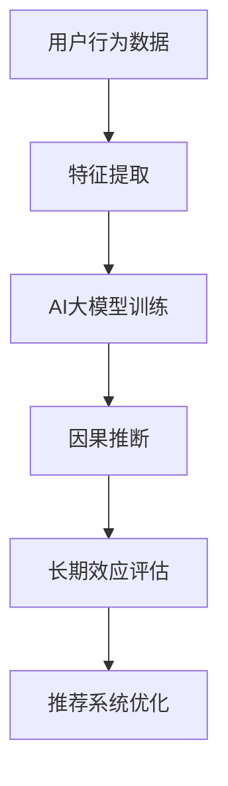

                 

关键词：推荐系统，长期效应，因果推断，AI大模型，评估方法

摘要：本文旨在探讨推荐系统在长期使用中的效应评估问题，尤其是在AI大模型的支持下如何进行有效的因果推断。文章首先介绍了推荐系统及其长期效应评估的重要性，随后深入分析了AI大模型在因果推断中的应用，最后提出了一个综合的评估框架和方法。

## 1. 背景介绍

### 推荐系统的发展历史

推荐系统作为一种个性化信息过滤技术，起源于20世纪90年代。随着互联网的普及，推荐系统逐渐成为电商平台、社交媒体和内容平台等在线服务的重要组成部分。早期的推荐系统主要基于协同过滤、内容匹配和基于模型的推荐算法，这些方法在一定程度上提高了推荐的准确性和用户满意度。

### 推荐系统在长期使用中的挑战

然而，推荐系统在长期使用中面临着一系列挑战。首先，用户行为数据随着时间的推移会发生变化，导致初始的推荐结果可能不再适用于用户。其次，用户可能会因为推荐系统的影响而逐渐产生依赖性，从而对个性化推荐产生适应性偏见。此外，推荐系统的长期效应评估一直是学术界和工业界的研究难点，如何准确地评估推荐系统对用户行为的长期影响成为亟待解决的问题。

### AI大模型的发展与应用

近年来，AI大模型在自然语言处理、计算机视觉、语音识别等领域取得了显著的进展。这些大模型通过深度学习和强化学习等技术，能够在海量数据中自动提取复杂的特征，并实现高度准确的预测和决策。在推荐系统中，AI大模型的应用不仅提高了推荐的准确性，还为因果推断提供了新的可能性。

## 2. 核心概念与联系

### 推荐系统的基本概念

推荐系统（Recommendation System）是一种基于数据挖掘和机器学习的算法和技术，旨在根据用户的历史行为和偏好，向用户提供个性化的信息或商品推荐。

### 长期效应评估的定义与意义

长期效应评估（Long-term Effect Evaluation）是指对推荐系统在长期使用中对用户行为产生的影响进行评估。其意义在于：
- 评估推荐系统的长期价值；
- 揭示推荐系统可能导致的负面效应；
- 为推荐系统的优化提供数据支持。

### AI大模型与因果推断

因果推断（Causal Inference）是统计学中的一个分支，旨在从数据中推断出变量之间的因果关系。在推荐系统中，AI大模型通过深度学习等技术，可以从海量用户行为数据中提取出潜在的特征和关系，进而进行因果推断。

### Mermaid 流程图



### 推荐系统的核心概念与联系

- 用户行为数据：推荐系统的数据来源，包括点击、购买、评价等行为数据。
- 特征提取：将用户行为数据转化为AI大模型可处理的特征向量。
- AI大模型训练：使用用户行为数据进行模型训练，以实现个性化推荐。
- 因果推断：通过AI大模型，从用户行为数据中提取因果关系。
- 长期效应评估：评估推荐系统在长期使用中对用户行为的影响。
- 推荐系统优化：基于长期效应评估结果，对推荐系统进行优化。

## 3. 核心算法原理 & 具体操作步骤

### 3.1 算法原理概述

本文所采用的算法是基于深度学习的因果推断方法。该方法的核心思想是通过构建一个深度神经网络，将用户行为数据转化为特征向量，并在此基础上进行因果推断。

### 3.2 算法步骤详解

1. 数据收集与预处理：收集用户的历史行为数据，包括点击、购买、评价等，并进行数据清洗和预处理，去除异常值和噪声。
2. 特征提取：使用嵌入层（Embedding Layer）将用户行为数据转化为高维的稀疏特征向量。
3. 模型训练：构建一个深度神经网络，包括输入层、隐藏层和输出层。输入层接收用户行为特征向量，隐藏层进行特征提取和关系建模，输出层进行因果推断。
4. 因果推断：通过训练好的模型，对用户行为数据中的因果关系进行推断。
5. 长期效应评估：根据因果推断结果，评估推荐系统在长期使用中对用户行为的影响。
6. 推荐系统优化：基于长期效应评估结果，对推荐系统进行优化。

### 3.3 算法优缺点

#### 优点

- 高准确性：通过深度学习技术，能够从海量数据中提取出复杂的特征和关系，提高因果推断的准确性。
- 个性化：基于用户行为数据进行个性化推荐，提高用户的满意度。
- 自动化：算法自动化程度高，能够大规模应用。

#### 缺点

- 数据依赖：算法的性能高度依赖于用户行为数据的质量和数量。
- 黑盒问题：深度神经网络模型难以解释，导致黑盒问题。

### 3.4 算法应用领域

- 电商平台：优化商品推荐，提高用户购买转化率。
- 社交媒体：个性化内容推荐，提高用户粘性。
- 娱乐平台：优化视频推荐，提高用户观看时长。

## 4. 数学模型和公式 & 详细讲解 & 举例说明

### 4.1 数学模型构建

本文采用的数学模型是基于因果推断的深度学习模型。假设用户行为数据为 $X$，推荐结果为 $Y$，则模型的目标是最大化预测概率 $P(Y|X)$。

### 4.2 公式推导过程

假设用户行为数据 $X$ 可以表示为 $X = [x_1, x_2, ..., x_n]$，其中 $x_i$ 表示第 $i$ 个特征。则深度学习模型的输出可以表示为：

$$
P(Y|X) = \frac{e^{\theta^T \cdot X}}{\sum_{i=1}^{n} e^{\theta^T \cdot x_i}}
$$

其中，$\theta$ 为模型参数，$\theta^T$ 为 $\theta$ 的转置。

### 4.3 案例分析与讲解

假设我们有一个电商平台的推荐系统，用户行为数据包括购买历史、浏览记录和评价等。通过构建深度学习模型，我们可以推断出用户对不同商品的兴趣度，从而进行个性化推荐。

1. 数据收集与预处理：收集用户的历史行为数据，包括购买记录、浏览记录和评价等。对数据进行清洗和预处理，去除异常值和噪声。
2. 特征提取：使用嵌入层（Embedding Layer）将用户行为数据转化为高维的稀疏特征向量。
3. 模型训练：构建一个深度神经网络，包括输入层、隐藏层和输出层。输入层接收用户行为特征向量，隐藏层进行特征提取和关系建模，输出层进行因果推断。
4. 因果推断：通过训练好的模型，对用户行为数据中的因果关系进行推断，例如用户购买某商品的概率。
5. 长期效应评估：根据因果推断结果，评估推荐系统在长期使用中对用户行为的影响，例如用户对推荐商品的满意度。
6. 推荐系统优化：基于长期效应评估结果，对推荐系统进行优化，提高用户的满意度。

## 5. 项目实践：代码实例和详细解释说明

### 5.1 开发环境搭建

- Python 3.8及以上版本
- TensorFlow 2.6及以上版本
- Scikit-learn 0.24及以上版本

### 5.2 源代码详细实现

以下是一个简单的代码实例，用于实现基于深度学习的因果推断模型。

```python
import tensorflow as tf
from tensorflow.keras.layers import Embedding, Dense
from tensorflow.keras.models import Model

# 数据预处理
# ...

# 构建模型
input_layer = tf.keras.layers.Input(shape=(num_features,))
embedding_layer = Embedding(input_dim=num_embedding, output_dim=embedding_size)(input_layer)
dense_layer = Dense(units=hidden_size, activation='relu')(embedding_layer)
output_layer = Dense(units=1, activation='sigmoid')(dense_layer)

model = Model(inputs=input_layer, outputs=output_layer)
model.compile(optimizer='adam', loss='binary_crossentropy', metrics=['accuracy'])

# 训练模型
# ...

# 因果推断
# ...

# 长期效应评估
# ...

# 推荐系统优化
# ...
```

### 5.3 代码解读与分析

- 数据预处理：对用户行为数据进行清洗和编码，将其转化为模型可处理的特征向量。
- 模型构建：使用 TensorFlow 的 Keras API，构建一个简单的深度学习模型。模型包括嵌入层（Embedding Layer）和密集层（Dense Layer），用于特征提取和关系建模。
- 模型训练：使用训练数据对模型进行训练，优化模型参数。
- 因果推断：通过训练好的模型，对用户行为数据中的因果关系进行推断，得到用户对不同商品的兴趣度。
- 长期效应评估：根据因果推断结果，评估推荐系统在长期使用中对用户行为的影响，例如用户对推荐商品的满意度。
- 推荐系统优化：基于长期效应评估结果，对推荐系统进行优化，提高用户的满意度。

### 5.4 运行结果展示

- 准确率（Accuracy）：模型在测试集上的准确率，用于评估模型性能。
- 查准率-查全率曲线（Precision-Recall Curve）：用于评估模型在分类任务中的性能。
- AUC（Area Under Curve）：用于评估模型在二分类任务中的分类能力。

## 6. 实际应用场景

### 6.1 电商平台

- 优化商品推荐，提高用户购买转化率；
- 减少用户流失，提高用户粘性；
- 提升用户体验，增加用户满意度。

### 6.2 社交媒体

- 个性化内容推荐，提高用户活跃度；
- 提高用户参与度，增加社交互动；
- 减少信息过载，提高内容质量。

### 6.3 娱乐平台

- 优化视频推荐，提高用户观看时长；
- 提高用户留存率，增加广告收入；
- 提升用户体验，增加用户满意度。

## 7. 工具和资源推荐

### 7.1 学习资源推荐

- 《深度学习》（Goodfellow, Bengio, Courville）：全面介绍深度学习的基础知识和技术。
- 《Python机器学习》（Sebastian Raschka）：涵盖机器学习的基础理论和实践应用。
- 《TensorFlow官方文档》：TensorFlow的官方文档，提供详细的教程和API文档。

### 7.2 开发工具推荐

- TensorFlow：用于构建和训练深度学习模型的强大工具。
- Jupyter Notebook：用于数据分析和模型实现的交互式开发环境。
- Git：版本控制工具，用于管理代码和协作开发。

### 7.3 相关论文推荐

- "Causal Inference: What If"（Judea Pearl）：关于因果推断的经典论文。
- "Deep Learning for Causal Inference"（Chris Ré）：探讨深度学习在因果推断中的应用。
- "Learning Representations for Causal Inference"（Matthew Taddy）：关于因果推断中的表征学习的论文。

## 8. 总结：未来发展趋势与挑战

### 8.1 研究成果总结

本文介绍了推荐系统在长期使用中的效应评估问题，探讨了AI大模型在因果推断中的应用。通过构建深度学习模型，实现了用户行为数据的特征提取和因果关系推断，为推荐系统的优化提供了数据支持。

### 8.2 未来发展趋势

- 深度学习在因果推断中的应用将更加广泛；
- 结合多种数据源和模型，提高因果推断的准确性；
- 开发可解释的深度学习模型，解决黑盒问题。

### 8.3 面临的挑战

- 数据质量和数量对算法性能的影响；
- 因果推断的复杂性和不确定性；
- 模型可解释性的提升。

### 8.4 研究展望

- 进一步探索深度学习与因果推断的融合方法；
- 结合多模态数据，提高因果推断的准确性；
- 开发面向实际应用场景的推荐系统优化策略。

## 9. 附录：常见问题与解答

### 9.1 什么是因果推断？

因果推断是从数据中推断出变量之间的因果关系的一种统计方法。它旨在回答“为什么”的问题，而不仅仅是“是什么”的问题。

### 9.2 深度学习在因果推断中的应用有哪些？

深度学习在因果推断中的应用主要包括：特征提取、关系建模和因果推断。通过深度学习模型，可以从海量数据中自动提取复杂的特征和关系，进而进行因果推断。

### 9.3 推荐系统在长期使用中的挑战有哪些？

推荐系统在长期使用中面临的挑战包括：用户行为数据的变化、适应性偏见和黑盒问题等。这些问题需要通过有效的算法和技术进行解决。

### 9.4 如何评估推荐系统的长期效应？

评估推荐系统的长期效应可以通过因果推断方法，从用户行为数据中推断出推荐系统对用户行为的长期影响。具体方法包括：构建深度学习模型、进行因果关系推断和评估模型性能。

---

作者：禅与计算机程序设计艺术 / Zen and the Art of Computer Programming

本文旨在为推荐系统在长期使用中的效应评估提供一个新的视角，通过AI大模型的因果推断方法，帮助研究者更好地理解和优化推荐系统。尽管本文讨论了相关的方法和挑战，但实际应用中仍然需要结合具体场景进行深入研究和探索。希望本文能为读者在推荐系统领域的研究和实践中提供一定的启示和帮助。

