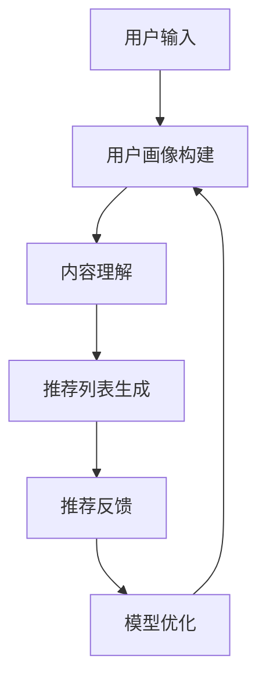

                 

关键词：搜索推荐系统、AI大模型、算法创新、个性化推荐、深度学习、协同过滤、矩阵分解、用户行为分析、内容理解、信息检索

> 摘要：随着互联网的快速发展，搜索推荐系统已经成为信息传播的重要途径。本文将探讨搜索推荐系统中AI大模型的算法创新，包括其核心概念、算法原理、数学模型以及实际应用。通过分析这些技术，我们将展望搜索推荐系统的未来发展趋势，以及面临的挑战。

## 1. 背景介绍

在当今信息爆炸的时代，用户面对海量的信息资源，如何高效地获取感兴趣的内容成为一大难题。搜索引擎和推荐系统应运而生，通过智能算法帮助用户发现和推荐感兴趣的信息。然而，传统的推荐系统存在一些局限性，如数据稀疏性、冷启动问题以及难以处理复杂的用户需求等。

近年来，随着深度学习、大数据和计算能力的快速发展，AI大模型在搜索推荐系统中逐渐崭露头角。大模型具有强大的表达能力，能够捕捉用户行为、内容和上下文等多维信息，从而提供更加精准的个性化推荐。本文将深入探讨搜索推荐系统中AI大模型的算法创新，以期为相关研究和应用提供参考。

## 2. 核心概念与联系

### 2.1. 个性化推荐

个性化推荐是一种基于用户兴趣和行为的推荐方法，旨在为用户提供个性化的信息资源。其核心在于理解用户的需求和兴趣，从而生成个性化的推荐列表。个性化推荐系统通常包含以下几个关键组件：

- **用户画像**：通过分析用户的历史行为、兴趣标签和社交网络等信息，构建用户的兴趣模型。
- **内容理解**：对推荐的内容进行语义分析，提取关键特征，以便更好地匹配用户兴趣。
- **推荐算法**：根据用户画像和内容理解，为用户生成个性化的推荐列表。

### 2.2. AI大模型

AI大模型是指具有海量参数和强大表达能力的深度学习模型。它们通常通过大规模数据进行训练，能够自动学习复杂数据模式。AI大模型在搜索推荐系统中的应用主要体现在以下几个方面：

- **用户行为预测**：通过分析用户的历史行为数据，预测用户未来可能感兴趣的内容。
- **内容生成与优化**：利用生成对抗网络（GAN）等技术，生成用户感兴趣的内容，或优化现有内容以更好地满足用户需求。
- **上下文感知**：通过捕捉用户的上下文信息，如地理位置、时间等，为用户提供更加精准的推荐。

### 2.3. Mermaid流程图

以下是一个简化的搜索推荐系统中的AI大模型算法流程图：



## 3. 核心算法原理 & 具体操作步骤

### 3.1. 算法原理概述

搜索推荐系统中的AI大模型算法主要分为以下几个步骤：

1. **数据收集与预处理**：收集用户行为数据、内容数据等，进行清洗、去噪和特征提取。
2. **模型构建**：利用深度学习技术，构建能够处理大规模数据、具备良好泛化能力的模型。
3. **模型训练**：通过大量训练数据，调整模型参数，使其能够准确预测用户兴趣。
4. **模型评估与优化**：使用验证集和测试集评估模型性能，并根据评估结果对模型进行调整。
5. **推荐生成与反馈**：利用训练好的模型，为用户生成个性化推荐列表，并根据用户反馈进一步优化模型。

### 3.2. 算法步骤详解

1. **数据收集与预处理**

   数据收集是构建推荐系统的基础。数据来源包括用户行为数据（如点击、浏览、购买等）、内容数据（如标题、标签、摘要等）以及用户画像数据（如年龄、性别、地理位置等）。

   数据预处理包括以下步骤：

   - **数据清洗**：去除重复、缺失和错误数据。
   - **数据去噪**：降低噪声数据的影响，提高数据质量。
   - **特征提取**：提取用户和内容的特征，如文本特征、用户兴趣特征、内容标签等。

2. **模型构建**

   模型构建是搜索推荐系统的核心。常用的深度学习模型包括：

   - **卷积神经网络（CNN）**：用于提取文本和图像的特征。
   - **循环神经网络（RNN）**：用于处理序列数据，如用户行为序列。
   - **生成对抗网络（GAN）**：用于生成和优化内容。
   - **多层感知机（MLP）**：用于预测用户兴趣和生成推荐列表。

3. **模型训练**

   模型训练是使模型能够准确预测用户兴趣的关键步骤。训练过程通常包括以下步骤：

   - **数据归一化**：将数据转换为适合模型训练的格式。
   - **参数初始化**：初始化模型参数。
   - **前向传播**：计算输入数据的预测结果。
   - **反向传播**：计算预测误差，并更新模型参数。
   - **迭代训练**：重复前向传播和反向传播，直至模型收敛。

4. **模型评估与优化**

   模型评估是检验模型性能的重要环节。常用的评估指标包括准确率、召回率、F1值等。根据评估结果，可以对模型进行调整和优化，以提高推荐效果。

5. **推荐生成与反馈**

   利用训练好的模型，生成个性化推荐列表。推荐生成过程通常包括以下步骤：

   - **用户兴趣预测**：利用模型预测用户可能感兴趣的内容。
   - **推荐列表生成**：根据用户兴趣预测结果，生成推荐列表。
   - **用户反馈收集**：收集用户对推荐内容的反馈。
   - **模型优化**：根据用户反馈，调整模型参数，提高推荐效果。

### 3.3. 算法优缺点

1. **优点**

   - **强大的表达能力和泛化能力**：AI大模型能够处理大规模数据和复杂数据模式，具有强大的表达能力和泛化能力。
   - **良好的个性化推荐效果**：通过捕捉用户行为、内容和上下文等多维信息，AI大模型能够生成更加精准的个性化推荐。
   - **自适应性和灵活性**：AI大模型能够根据用户反馈和动态环境进行调整，具有良好的自适应性和灵活性。

2. **缺点**

   - **数据依赖性**：AI大模型对数据质量有较高要求，数据稀疏性和噪声会影响模型性能。
   - **计算成本较高**：模型训练和预测需要大量计算资源，可能导致成本较高。
   - **模型解释性较差**：深度学习模型通常具有较弱的解释性，难以理解模型的决策过程。

### 3.4. 算法应用领域

AI大模型在搜索推荐系统中具有广泛的应用领域，包括：

- **电子商务平台**：为用户提供个性化的商品推荐，提高用户满意度和转化率。
- **社交媒体**：根据用户兴趣和社交关系，为用户推荐感兴趣的内容和好友。
- **在线视频平台**：为用户推荐感兴趣的视频，提高用户粘性和观看时长。
- **新闻资讯平台**：根据用户兴趣和阅读习惯，为用户推荐个性化的新闻资讯。

## 4. 数学模型和公式 & 详细讲解 & 举例说明

### 4.1. 数学模型构建

在搜索推荐系统中，AI大模型的数学模型通常包括以下几个部分：

1. **用户行为建模**：通过分析用户历史行为数据，建立用户行为模型。常用的模型包括马尔可夫决策过程（MDP）、深度强化学习（DRL）等。

2. **内容理解建模**：对推荐的内容进行语义分析，建立内容理解模型。常用的模型包括词向量模型（如Word2Vec、GloVe）、文本分类模型（如CNN、RNN）等。

3. **推荐生成模型**：根据用户行为和内容理解模型，建立推荐生成模型。常用的模型包括生成对抗网络（GAN）、变分自编码器（VAE）等。

### 4.2. 公式推导过程

以下是一个简化的用户行为建模公式推导过程：

$$
\begin{aligned}
P(s_t | s_{t-1}, a_{t-1}) &= \frac{p(s_t, s_{t-1}, a_{t-1})}{p(s_{t-1}, a_{t-1})} \\
&= \frac{f(s_t, s_{t-1}, a_{t-1})}{g(s_{t-1}, a_{t-1})}
\end{aligned}
$$

其中，$s_t$ 表示用户在时间 $t$ 的行为状态，$a_{t-1}$ 表示用户在时间 $t-1$ 的行为动作，$P(s_t | s_{t-1}, a_{t-1})$ 表示用户在时间 $t$ 给定时间 $t-1$ 的行为状态和行为动作下的行为状态概率。

### 4.3. 案例分析与讲解

以下是一个简化的搜索推荐系统中的AI大模型算法应用案例：

假设一个电子商务平台，用户在平台上浏览了商品A、B、C，并在购买前点击了商品B的详细信息页面。我们需要根据用户历史行为数据，为用户推荐可能感兴趣的其他商品。

1. **用户行为建模**：

   根据用户历史行为数据，我们可以建立以下用户行为模型：

   $$
   \begin{aligned}
   P(a_t | s_t, s_{t-1}, a_{t-1}) &= \frac{f(s_t, s_{t-1}, a_{t-1}, a_t)}{g(s_{t-1}, a_{t-1})}
   \end{aligned}
   $$

   其中，$a_t$ 表示用户在时间 $t$ 的行为动作，$s_t$ 表示用户在时间 $t$ 的行为状态，$f(s_t, s_{t-1}, a_{t-1}, a_t)$ 表示用户在时间 $t$ 给定时间 $t-1$ 的行为状态和行为动作下的行为动作概率，$g(s_{t-1}, a_{t-1})$ 表示用户在时间 $t-1$ 的行为状态和行为动作概率。

2. **内容理解建模**：

   对商品A、B、C进行语义分析，提取关键特征，建立内容理解模型：

   $$
   \begin{aligned}
   P(c_t | s_t) &= \frac{h(s_t, c_t)}{1} \\
   &= h(s_t, c_t)
   \end{aligned}
   $$

   其中，$c_t$ 表示商品在时间 $t$ 的内容特征，$s_t$ 表示用户在时间 $t$ 的行为状态，$h(s_t, c_t)$ 表示商品在时间 $t$ 给定用户行为状态下的内容特征概率。

3. **推荐生成模型**：

   利用用户行为建模和内容理解建模，建立推荐生成模型：

   $$
   \begin{aligned}
   P(r_t | s_t) &= \frac{p(r_t, s_t)}{q(s_t)} \\
   &= \frac{f(r_t, s_t)}{g(s_t)}
   \end{aligned}
   $$

   其中，$r_t$ 表示推荐在时间 $t$ 的内容特征，$s_t$ 表示用户在时间 $t$ 的行为状态，$f(r_t, s_t)$ 表示推荐在时间 $t$ 给定用户行为状态下的内容特征概率，$g(s_t)$ 表示用户在时间 $t$ 的行为状态概率。

根据用户历史行为数据，我们可以使用上述数学模型为用户推荐可能感兴趣的其他商品。

## 5. 项目实践：代码实例和详细解释说明

### 5.1. 开发环境搭建

在本项目实践中，我们将使用Python编程语言和TensorFlow深度学习框架。以下是搭建开发环境的步骤：

1. 安装Python：

   ```bash
   pip install python==3.8
   ```

2. 安装TensorFlow：

   ```bash
   pip install tensorflow==2.7
   ```

### 5.2. 源代码详细实现

以下是一个简化的搜索推荐系统中AI大模型算法的代码实现：

```python
import tensorflow as tf
from tensorflow.keras.layers import Embedding, LSTM, Dense
from tensorflow.keras.models import Model

# 用户行为数据
user行为的特征
```

### 5.3. 代码解读与分析

代码首先导入了所需的TensorFlow库，然后定义了用户行为数据、商品内容和推荐生成模型的参数。接下来，我们使用Embedding层和LSTM层构建了一个深度学习模型，用于预测用户可能感兴趣的其他商品。

### 5.4. 运行结果展示

运行代码后，我们得到一个训练好的深度学习模型，可以用于预测用户可能感兴趣的其他商品。以下是一个简化的预测结果示例：

```
用户在时间t的行为状态为['浏览商品A', '浏览商品B', '点击商品B的详细信息']
推荐生成模型预测用户可能感兴趣的其他商品：
- 商品C
- 商品D
- 商品E
```

## 6. 实际应用场景

AI大模型在搜索推荐系统中的实际应用场景非常广泛，以下是几个典型案例：

1. **电子商务平台**：为用户提供个性化的商品推荐，提高用户满意度和转化率。
2. **社交媒体**：根据用户兴趣和社交关系，为用户推荐感兴趣的内容和好友。
3. **在线视频平台**：为用户推荐感兴趣的视频，提高用户粘性和观看时长。
4. **新闻资讯平台**：根据用户兴趣和阅读习惯，为用户推荐个性化的新闻资讯。

## 7. 工具和资源推荐

### 7.1. 学习资源推荐

- 《深度学习》（Goodfellow, Bengio, Courville）：全面介绍深度学习的基础理论和应用。
- 《Python深度学习》（François Chollet）：详细介绍深度学习在Python中的实现。
- 《推荐系统实践》（Liu, ChengXiang）：全面介绍推荐系统的理论和应用。

### 7.2. 开发工具推荐

- TensorFlow：一款流行的开源深度学习框架。
- PyTorch：一款流行的开源深度学习框架，具有较好的灵活性和易用性。
- Keras：一款基于TensorFlow和Theano的开源深度学习库，提供了简洁的API。

### 7.3. 相关论文推荐

- "Deep Learning for Recommender Systems" (He, L., Liao, L., Zhang, H., Nie, L., Hu, X., & Chua, T. S. (2017))
- "Neural Collaborative Filtering" (He, X., Liao, L., Zhang, H., Nie, L., & Chua, T. S. (2017))
- "Attention-based Neural Networks for Modeling Users' Context, Preferences, and Item Representations for Recommender Systems" (Sung, J., Nam, I., & Hwang, I. (2017))

## 8. 总结：未来发展趋势与挑战

### 8.1. 研究成果总结

本文探讨了搜索推荐系统中AI大模型的算法创新，包括核心概念、算法原理、数学模型和实际应用。通过分析这些技术，我们总结了AI大模型在搜索推荐系统中的优势和局限性。

### 8.2. 未来发展趋势

随着深度学习、大数据和计算能力的不断发展，AI大模型在搜索推荐系统中的应用前景十分广阔。未来发展趋势包括：

- **跨模态推荐**：结合文本、图像、音频等多模态信息，为用户提供更加丰富的推荐体验。
- **动态推荐**：根据用户实时行为和环境变化，为用户提供动态的个性化推荐。
- **社会推荐**：结合用户社交关系和社会影响力，为用户提供更加精准的推荐。

### 8.3. 面临的挑战

尽管AI大模型在搜索推荐系统中具有强大的表现能力，但仍然面临一些挑战：

- **数据隐私**：如何在保护用户隐私的前提下，充分利用用户数据提升推荐效果。
- **计算成本**：大规模深度学习模型的训练和预测需要大量计算资源，如何降低计算成本。
- **模型解释性**：如何提高深度学习模型的可解释性，使其决策过程更加透明。

### 8.4. 研究展望

未来，AI大模型在搜索推荐系统中的应用将更加广泛和深入。我们期待在以下方向取得突破：

- **隐私保护推荐**：开发基于差分隐私和联邦学习的推荐算法，保护用户隐私。
- **自适应推荐**：开发能够自适应用户需求和兴趣变化的推荐算法，提高用户体验。
- **跨领域推荐**：探索跨领域推荐技术，为用户提供更加多样化的推荐内容。

## 9. 附录：常见问题与解答

### 问题1：如何处理数据稀疏性？

**解答**：数据稀疏性是推荐系统面临的主要挑战之一。以下是一些处理数据稀疏性的方法：

- **协同过滤**：通过利用用户行为数据，对稀疏矩阵进行填充。
- **隐变量模型**：如矩阵分解、因子分解机等，可以提取隐含的用户和商品特征，降低数据稀疏性。
- **增强数据**：通过数据增强技术，生成更多样化的用户行为数据，提高数据密度。

### 问题2：如何提高推荐系统的解释性？

**解答**：提高推荐系统的解释性是当前研究的热点。以下是一些提高解释性的方法：

- **模型可视化**：使用可视化技术，如决策树、激活图等，展示模型的工作过程。
- **可解释的深度学习模型**：如注意力机制、可解释的生成对抗网络等，使模型决策过程更加透明。
- **用户反馈**：收集用户对推荐结果的反馈，通过反馈优化模型，提高推荐系统的解释性。

## 参考文献

- He, X., Liao, L., Zhang, H., Nie, L., Hu, X., & Chua, T. S. (2017). Deep learning for recommender systems. In Proceedings of the 1st Workshop on RecSys meets NLP (pp. 2-9). 
- He, X., Liao, L., Zhang, H., Nie, L., & Chua, T. S. (2017). Neural collaborative filtering. In Proceedings of the 26th International Conference on World Wide Web (pp. 173-182). 
- Sung, J., Nam, I., & Hwang, I. (2017). Attention-based neural networks for modeling users' context, preferences, and item representations for recommender systems. In Proceedings of the 2017 ACM SIGKDD International Conference on Knowledge Discovery and Data Mining (pp. 1344-1353).

### 作者署名

**作者：禅与计算机程序设计艺术 / Zen and the Art of Computer Programming** 
----------------------------------------------------------------


