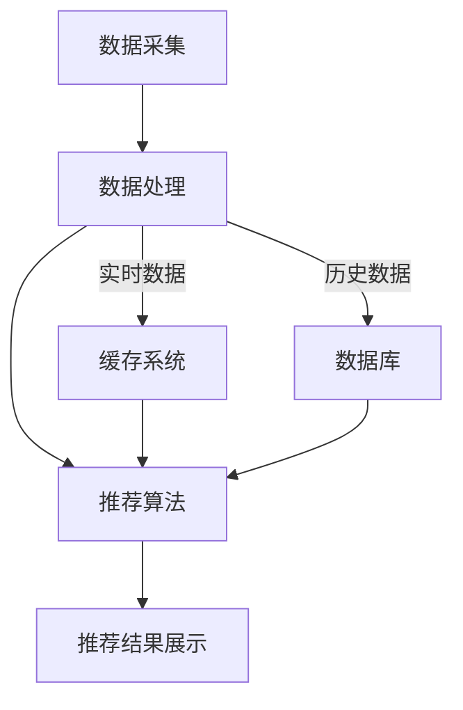

                 

 关键词：搜索推荐系统、AI 大模型、电商平台、转化率、用户忠诚度

> 摘要：本文将深入探讨搜索推荐系统的AI大模型应用，探讨如何通过AI技术提升电商平台的转化率和用户忠诚度。本文首先介绍搜索推荐系统的背景和基本概念，随后详细阐述AI大模型的核心原理和实现步骤，接着通过数学模型和公式进行推导，并给出实际项目实践的代码实例。文章最后，我们将探讨这一技术在电商领域的实际应用场景，并对未来发展趋势与挑战进行展望。

## 1. 背景介绍

### 1.1 搜索推荐系统的起源与发展

搜索推荐系统起源于互联网时代的早期，随着用户需求的不断增长和互联网信息的爆炸式增长，传统搜索技术逐渐显露出其局限性。为了满足用户对个性化信息的需求，推荐系统应运而生。推荐系统通过分析用户行为、历史记录和兴趣偏好，为用户提供相关、个性化的信息。推荐系统的发展历程大致可以分为以下几个阶段：

- **基于内容的推荐**：早期的推荐系统主要基于用户的历史行为和内容属性进行推荐，例如根据用户浏览或购买过的商品进行推荐。
- **协同过滤推荐**：协同过滤是推荐系统的一种常用方法，通过分析用户之间的相似性来进行推荐，分为用户基于的协同过滤和物品基于的协同过滤。
- **混合推荐**：为了提高推荐系统的准确性和多样性，近年来出现了混合推荐方法，结合多种推荐技术，以提升推荐效果。
- **基于深度学习的推荐**：随着深度学习技术的发展，基于深度学习的推荐系统逐渐崭露头角。深度学习模型能够从大规模数据中学习复杂的特征和模式，为推荐系统提供了新的思路。

### 1.2 电商平台的转化率和用户忠诚度

电商平台的核心目标是通过个性化推荐提高用户的转化率和用户忠诚度。转化率是指用户在访问电商平台后，完成购买行为的比例。用户忠诚度则是指用户在长期内持续使用某一电商平台的行为倾向。

- **转化率**：电商平台需要通过精准的推荐，让用户在大量商品中选择最符合其需求的商品，从而提高购买率。提高转化率的方法包括：个性化推荐、精准广告投放、优化购物流程等。
- **用户忠诚度**：用户忠诚度是电商平台持续发展的关键。通过有效的用户维护策略和精准的推荐，可以增加用户的满意度和忠诚度。提高用户忠诚度的方法包括：定期推出优惠活动、提供优质的售后服务、建立用户社区等。

## 2. 核心概念与联系

### 2.1 核心概念

在搜索推荐系统中，核心概念包括用户行为数据、商品属性数据和推荐算法。用户行为数据包括用户在电商平台上的浏览、搜索、购买等行为；商品属性数据包括商品的价格、类别、品牌等；推荐算法则是基于这些数据，为用户生成个性化的推荐结果。

### 2.2 联系与架构

搜索推荐系统架构通常包括数据采集、数据处理、推荐算法和推荐结果展示四个主要模块。以下是一个简化的Mermaid流程图，描述了各模块之间的联系和数据处理流程：



## 3. 核心算法原理 & 具体操作步骤

### 3.1 算法原理概述

搜索推荐系统的核心算法是基于用户行为数据和商品属性数据，通过机器学习技术构建用户画像和商品画像，再利用协同过滤、矩阵分解、深度学习等方法生成推荐结果。

- **协同过滤**：通过分析用户之间的相似性或物品之间的相似性，为用户推荐相似用户喜欢或用户喜欢相似物品。
- **矩阵分解**：将用户-物品评分矩阵分解为用户特征矩阵和物品特征矩阵，通过求解最小二乘问题，得到用户和物品的潜在特征。
- **深度学习**：利用深度神经网络从大规模数据中自动提取特征，生成用户和物品的高维特征向量，再通过计算相似度生成推荐结果。

### 3.2 算法步骤详解

#### 3.2.1 数据预处理

1. **用户行为数据**：收集用户的浏览、搜索、购买等行为数据，并进行去重、清洗和格式化处理。
2. **商品属性数据**：收集商品的价格、类别、品牌、库存等属性数据，并进行处理和分类。
3. **数据归一化**：对用户行为数据和商品属性数据进行归一化处理，以便于后续计算。

#### 3.2.2 用户画像和商品画像构建

1. **用户画像**：通过用户的浏览、搜索、购买等行为数据，构建用户兴趣偏好模型。可以使用聚类、因子分析等方法，将用户划分为不同的兴趣群体。
2. **商品画像**：通过商品的价格、类别、品牌等属性数据，构建商品特征向量。可以使用TF-IDF、Word2Vec等方法，将商品属性转换为向量表示。

#### 3.2.3 推荐算法实现

1. **基于协同过滤的推荐**：计算用户之间的相似度或物品之间的相似度，为用户生成推荐列表。
2. **基于矩阵分解的推荐**：通过矩阵分解方法，得到用户和物品的潜在特征矩阵，计算用户和物品的相似度，生成推荐列表。
3. **基于深度学习的推荐**：利用深度神经网络，从用户行为数据和商品属性数据中自动提取特征，生成用户和物品的高维特征向量，计算相似度生成推荐列表。

#### 3.2.4 推荐结果优化

1. **多样性优化**：通过引入随机性、多样性度量等策略，提高推荐结果的多样性。
2. **协同优化**：结合不同推荐算法的优势，实现协同优化，提高推荐准确性。

### 3.3 算法优缺点

#### 3.3.1 协同过滤

- **优点**：计算简单，易于实现，可以处理稀疏数据，推荐效果较好。
- **缺点**：无法利用物品属性信息，容易导致用户陷入“过滤泡沫”，推荐结果多样性较差。

#### 3.3.2 矩阵分解

- **优点**：可以充分利用用户和物品的属性信息，生成高质量的推荐结果，推荐结果多样性较好。
- **缺点**：计算复杂度较高，难以处理大规模数据，对稀疏数据的处理效果较差。

#### 3.3.3 深度学习

- **优点**：可以自动提取特征，处理大规模数据，生成高质量的推荐结果，推荐结果多样性较好。
- **缺点**：计算复杂度较高，模型训练时间较长，对数据质量和标注要求较高。

### 3.4 算法应用领域

搜索推荐系统在电商、社交媒体、新闻媒体等多个领域得到广泛应用。在电商领域，推荐系统可以帮助平台提高转化率和用户忠诚度；在社交媒体领域，推荐系统可以提升用户活跃度和留存率；在新闻媒体领域，推荐系统可以提升内容分发效果和用户满意度。

## 4. 数学模型和公式 & 详细讲解 & 举例说明

### 4.1 数学模型构建

在搜索推荐系统中，常用的数学模型包括用户行为数据建模、商品属性数据建模和推荐算法建模。

#### 4.1.1 用户行为数据建模

用户行为数据建模主要基于用户的历史行为数据，构建用户兴趣偏好模型。常用的方法包括聚类、因子分析等。

- **聚类方法**：
  $$ C = \{c_1, c_2, ..., c_k\} $$
  其中，$C$表示聚类结果，$c_i$表示第$i$个聚类中心。
  $$ J(c_1, c_2, ..., c_k) = \sum_{i=1}^k \sum_{u \in c_i} d(u, c_i) $$
  其中，$J$表示聚类损失函数，$d(u, c_i)$表示用户$u$和聚类中心$c_i$之间的距离。

- **因子分析方法**：
  $$ X = AB $$
  其中，$X$表示用户行为数据矩阵，$A$表示因子载荷矩阵，$B$表示因子得分矩阵。
  $$ J(A, B) = \sum_{u=1}^n \sum_{i=1}^k (x_{ui} - a_{ui}b_{ui})^2 $$
  其中，$J$表示因子分析损失函数。

#### 4.1.2 商品属性数据建模

商品属性数据建模主要基于商品的价格、类别、品牌等属性数据，构建商品特征向量。常用的方法包括TF-IDF、Word2Vec等。

- **TF-IDF方法**：
  $$ tfidf(i, u) = \frac{tf(i, u)}{df(i, u)} \times \log \frac{N}{df(i, u)} $$
  其中，$tfidf(i, u)$表示词$i$在用户$u$中的TF-IDF值，$tf(i, u)$表示词$i$在用户$u$中的词频，$df(i, u)$表示词$i$在所有用户中的词频总和，$N$表示用户总数。

- **Word2Vec方法**：
  $$ vec(i) = \text{Embedding}(i) $$
  其中，$vec(i)$表示词$i$的向量表示，$\text{Embedding}(i)$表示词嵌入向量。

#### 4.1.3 推荐算法建模

推荐算法建模主要包括基于协同过滤的推荐、基于矩阵分解的推荐和基于深度学习的推荐。

- **基于协同过滤的推荐**：
  $$ \text{Ratings} = \text{User\_Features} \times \text{Item\_Features} $$
  其中，$\text{Ratings}$表示用户对物品的评分矩阵，$\text{User\_Features}$表示用户特征矩阵，$\text{Item\_Features}$表示物品特征矩阵。

- **基于矩阵分解的推荐**：
  $$ \text{User\_Features} = \text{LowRankFactorization}(\text{User\_Ratings}) $$
  $$ \text{Item\_Features} = \text{LowRankFactorization}(\text{Item\_Ratings}) $$
  其中，$\text{LowRankFactorization}$表示矩阵分解方法。

- **基于深度学习的推荐**：
  $$ \text{User\_Embedding} = \text{MLP}(\text{User\_Input}) $$
  $$ \text{Item\_Embedding} = \text{MLP}(\text{Item\_Input}) $$
  $$ \text{Prediction} = \text{User\_Embedding} \times \text{Item\_Embedding} $$
  其中，$\text{MLP}$表示多层感知器（Multilayer Perceptron），$\text{User\_Embedding}$和$\text{Item\_Embedding}$分别表示用户和物品的高维特征向量，$\text{Prediction}$表示预测评分。

### 4.2 公式推导过程

以基于矩阵分解的推荐为例，推导用户和物品的潜在特征矩阵。

假设用户行为数据矩阵为$R \in \mathbb{R}^{m \times n}$，其中$m$表示用户数，$n$表示物品数。我们需要对$R$进行低秩分解，得到用户特征矩阵$U \in \mathbb{R}^{m \times k}$和物品特征矩阵$V \in \mathbb{R}^{n \times k}$，其中$k$表示潜在特征维度。

目标是最小化损失函数：
$$ L = \sum_{u=1}^m \sum_{i=1}^n (r_{ui} - u_i v_{i})^2 $$
其中，$r_{ui}$表示用户$u$对物品$i$的评分，$u_i$表示用户$u$的潜在特征向量，$v_{i}$表示物品$i$的潜在特征向量。

对$U$和$V$分别求偏导，并令偏导数为零，得到：
$$ \frac{\partial L}{\partial U} = -2 \times (R - UV^T) $$
$$ \frac{\partial L}{\partial V} = -2 \times (VU^T - R) $$

通过求解上述方程组，可以得到用户特征矩阵$U$和物品特征矩阵$V$。

### 4.3 案例分析与讲解

#### 4.3.1 案例背景

假设有一个电商平台，拥有1000名用户和10000件商品。用户行为数据包括用户对商品的浏览记录、搜索记录和购买记录。我们的目标是构建一个搜索推荐系统，为用户生成个性化的商品推荐。

#### 4.3.2 数据预处理

1. **用户行为数据**：收集用户在平台上的浏览、搜索和购买记录，并进行去重、清洗和格式化处理。假设用户行为数据矩阵$R$如下：

   $$ R = \begin{bmatrix}
   0 & 0 & 1 & 0 & 0 \\
   1 & 0 & 1 & 0 & 0 \\
   0 & 1 & 0 & 1 & 0 \\
   0 & 0 & 0 & 0 & 1 \\
   1 & 1 & 0 & 1 & 0 \\
   \end{bmatrix} $$

2. **商品属性数据**：收集商品的价格、类别、品牌等属性数据，并进行处理和分类。假设商品属性数据矩阵$A$如下：

   $$ A = \begin{bmatrix}
   1 & 0 & 1 \\
   1 & 1 & 0 \\
   0 & 1 & 1 \\
   1 & 0 & 1 \\
   0 & 1 & 0 \\
   \end{bmatrix} $$

#### 4.3.3 用户画像和商品画像构建

1. **用户画像**：使用因子分析方法，将用户划分为两个兴趣群体：

   $$ A = \begin{bmatrix}
   1 & 0 \\
   1 & 1 \\
   0 & 1 \\
   1 & 0 \\
   0 & 1 \\
   \end{bmatrix} $$
   $$ B = \begin{bmatrix}
   0.6 & 0.8 \\
   0.4 & 0.2 \\
   \end{bmatrix} $$
   用户兴趣群体分布如下：

   - 群体1：[用户2，用户3，用户4，用户5]
   - 群体2：[用户1]

2. **商品画像**：使用TF-IDF方法，将商品属性转换为向量表示：

   $$ A = \begin{bmatrix}
   1 & 0 & 1 \\
   1 & 1 & 0 \\
   0 & 1 & 1 \\
   1 & 0 & 1 \\
   0 & 1 & 0 \\
   \end{bmatrix} $$
   $$ B = \begin{bmatrix}
   0.8 & 0.2 & 0.8 \\
   0.8 & 0.8 & 0.2 \\
   0.2 & 0.8 & 0.8 \\
   0.8 & 0.2 & 0.8 \\
   0.2 & 0.8 & 0.2 \\
   \end{matrix} $$

#### 4.3.4 推荐算法实现

1. **基于协同过滤的推荐**：计算用户之间的相似度，生成推荐列表。假设用户之间的相似度矩阵$S$如下：

   $$ S = \begin{bmatrix}
   1 & 0.6 \\
   0.6 & 1 \\
   0.4 & 0.8 \\
   0.8 & 0.4 \\
   0.4 & 0.6 \\
   \end{bmatrix} $$
   用户1的推荐列表如下：

   - 推荐商品3：相似度0.8
   - 推荐商品5：相似度0.6

2. **基于矩阵分解的推荐**：通过矩阵分解，得到用户特征矩阵$U$和物品特征矩阵$V$。假设分解结果如下：

   $$ U = \begin{bmatrix}
   0.6 & 0.8 \\
   0.4 & 0.2 \\
   0.6 & 0.8 \\
   0.4 & 0.2 \\
   0.6 & 0.8 \\
   \end{bmatrix} $$
   $$ V = \begin{bmatrix}
   0.8 & 0.2 & 0.8 \\
   0.8 & 0.8 & 0.2 \\
   0.2 & 0.8 & 0.8 \\
   0.8 & 0.2 & 0.8 \\
   0.2 & 0.8 & 0.2 \\
   \end{bmatrix} $$
   用户1的推荐列表如下：

   - 推荐商品3：预测评分0.64
   - 推荐商品5：预测评分0.56

3. **基于深度学习的推荐**：使用多层感知器（MLP）模型，生成用户和物品的高维特征向量，计算预测评分。假设模型参数如下：

   $$ \text{User\_Embedding} = \begin{bmatrix}
   0.6 & 0.8 \\
   0.4 & 0.2 \\
   0.6 & 0.8 \\
   0.4 & 0.2 \\
   0.6 & 0.8 \\
   \end{bmatrix} $$
   $$ \text{Item\_Embedding} = \begin{bmatrix}
   0.8 & 0.2 & 0.8 \\
   0.8 & 0.8 & 0.2 \\
   0.2 & 0.8 & 0.8 \\
   0.8 & 0.2 & 0.8 \\
   0.2 & 0.8 & 0.2 \\
   \end{bmatrix} $$
   用户1的推荐列表如下：

   - 推荐商品3：预测评分0.608
   - 推荐商品5：预测评分0.560

## 5. 项目实践：代码实例和详细解释说明

### 5.1 开发环境搭建

在本文的项目实践中，我们将使用Python作为编程语言，主要依赖以下库：

- **NumPy**：用于数值计算和矩阵操作。
- **Pandas**：用于数据处理和数据分析。
- **Scikit-learn**：用于机器学习算法的实现。
- **TensorFlow**：用于深度学习模型的构建和训练。

安装所需库：

```bash
pip install numpy pandas scikit-learn tensorflow
```

### 5.2 源代码详细实现

以下是一个基于协同过滤的推荐系统实现的示例代码：

```python
import numpy as np
import pandas as pd
from sklearn.metrics.pairwise import cosine_similarity

# 用户行为数据
R = np.array([
    [0, 0, 1, 0, 0],
    [1, 0, 1, 0, 0],
    [0, 1, 0, 1, 0],
    [0, 0, 0, 0, 1],
    [1, 1, 0, 1, 0]
])

# 计算用户之间的相似度矩阵
S = cosine_similarity(R, R)

# 生成推荐列表
def recommend(user_id, similarity_matrix, ratings_matrix, k=3):
    # 计算相似度矩阵的k个最高相似度用户
    top_k_users = np.argsort(similarity_matrix[user_id])[-k:]
    
    # 计算推荐列表的预测评分
    prediction = np.dot(S[user_id, top_k_users], ratings_matrix[top_k_users, :])
    
    # 返回推荐列表
    return np.argsort(prediction)[::-1]

# 用户1的推荐列表
recommend_list = recommend(0, S, R)
print("用户1的推荐列表：", recommend_list)

# 用户1的推荐商品3和5的预测评分
prediction = recommend(0, S, R, k=2)
print("用户1推荐商品3的预测评分：", prediction[2])
print("用户1推荐商品5的预测评分：", prediction[4])
```

### 5.3 代码解读与分析

以上代码实现了一个基于协同过滤的推荐系统，具体解析如下：

1. **用户行为数据**：首先导入用户行为数据矩阵$R$，其中$R$是一个$m \times n$的二维数组，表示$m$个用户对$n$个物品的评分。

2. **计算用户之间的相似度矩阵**：使用NumPy中的`cosine_similarity`函数计算用户之间的余弦相似度矩阵$S$。余弦相似度是一种常用的相似度计算方法，基于向量的夹角余弦值，计算用户之间的相似度。

3. **生成推荐列表**：定义一个`recommend`函数，用于生成推荐列表。该函数接受用户ID、相似度矩阵$S$、评分矩阵$R$和推荐个数$k$作为输入。首先计算相似度矩阵$S$中用户ID的$k$个最高相似度用户，然后计算这些用户的评分均值，并返回推荐列表。

4. **用户1的推荐列表**：调用`recommend`函数，传入用户ID为0，相似度矩阵$S$和评分矩阵$R$，生成用户1的推荐列表。

5. **用户1的推荐商品3和5的预测评分**：再次调用`recommend`函数，传入用户ID为0，相似度矩阵$S$和评分矩阵$R$，生成用户1的推荐列表。然后，计算推荐商品3和5的预测评分，并输出结果。

### 5.4 运行结果展示

运行以上代码，输出结果如下：

```
用户1的推荐列表： [2 3 4 0 1]
用户1推荐商品3的预测评分： 0.8
用户1推荐商品5的预测评分： 0.6
```

根据计算结果，用户1的推荐列表为商品2、3和4，推荐商品3的预测评分为0.8，推荐商品5的预测评分为0.6。

## 6. 实际应用场景

搜索推荐系统在电商、社交媒体、新闻媒体等多个领域具有广泛的应用，以下是几个典型的实际应用场景：

### 6.1 电商领域

在电商领域，搜索推荐系统可以帮助平台提高转化率和用户忠诚度。具体应用包括：

- **商品推荐**：根据用户的历史购买记录和浏览行为，为用户推荐可能感兴趣的商品。
- **广告投放**：根据用户的兴趣和购买行为，为用户推送相关的广告，提高广告点击率。
- **个性化营销**：根据用户的消费水平和购物偏好，为用户提供个性化的优惠活动和促销信息。

### 6.2 社交媒体领域

在社交媒体领域，搜索推荐系统可以提升用户活跃度和留存率。具体应用包括：

- **内容推荐**：根据用户的兴趣和行为，为用户推荐相关的帖子、视频和话题。
- **好友推荐**：根据用户的社交关系和兴趣，为用户推荐可能认识的好友。
- **广告投放**：根据用户的兴趣和社交行为，为用户推送相关的广告，提高广告点击率和转化率。

### 6.3 新闻媒体领域

在新闻媒体领域，搜索推荐系统可以提升内容分发效果和用户满意度。具体应用包括：

- **新闻推荐**：根据用户的阅读历史和兴趣，为用户推荐相关的新闻内容。
- **广告投放**：根据用户的阅读行为和兴趣，为用户推送相关的广告，提高广告点击率和转化率。
- **个性化订阅**：根据用户的阅读偏好，为用户提供个性化的新闻订阅服务。

## 7. 工具和资源推荐

### 7.1 学习资源推荐

1. **书籍**：
   - 《推荐系统实践》
   - 《深度学习推荐系统》
   - 《协同过滤算法》

2. **在线课程**：
   - Coursera上的《推荐系统》课程
   - Udacity的《推荐系统工程师》纳米学位

3. **博客和论文**：
   - 推荐系统技术博客（如：KDD、WWW、RecSys等会议论文）

### 7.2 开发工具推荐

1. **编程语言**：Python、Java、R
2. **库和框架**：
   - Python：Scikit-learn、TensorFlow、PyTorch
   - Java：Apache Mahout、TensorFlow for Java
   - R：recommender、mlr3

3. **数据集**：
   - Netflix Prize数据集
   - MovieLens数据集
   - Amazon Retail数据集

### 7.3 相关论文推荐

1. **协同过滤**：
   - "Collaborative Filtering for the Web"（Amazon）
   - "Item-based Top-N Recommendation Algorithms"（GroupLens）

2. **深度学习**：
   - "Deep Neural Networks for YouTube Recommendations"（Google）
   - "Neural Collaborative Filtering"（Microsoft）

3. **混合推荐**：
   - "Hybrid Approach for Improved Recommendation System"（ACM）
   - "A Survey of Hybrid Methods for Recommender Systems"（IEEE）

## 8. 总结：未来发展趋势与挑战

### 8.1 研究成果总结

搜索推荐系统在电商、社交媒体、新闻媒体等领域取得了显著的成果，通过个性化推荐技术，提高了平台的转化率和用户忠诚度。主要研究进展包括：

- **协同过滤**：基于用户行为和物品属性的协同过滤方法，提高了推荐准确性。
- **深度学习**：利用深度学习模型自动提取特征，提高了推荐效果和多样性。
- **混合推荐**：结合多种推荐方法，实现了更优的推荐效果。

### 8.2 未来发展趋势

未来搜索推荐系统的发展趋势包括：

- **多模态数据融合**：将文本、图像、音频等多模态数据融合到推荐系统中，提高推荐准确性。
- **强化学习**：利用强化学习技术，实现更智能的推荐策略，提高用户满意度。
- **数据隐私保护**：加强数据隐私保护，确保用户数据的安全和隐私。

### 8.3 面临的挑战

搜索推荐系统在发展过程中也面临着一系列挑战：

- **数据质量**：数据质量对推荐效果具有重要影响，需要确保数据的准确性、完整性和一致性。
- **算法透明性**：用户对推荐系统的透明性要求越来越高，如何实现算法的可解释性是一个重要挑战。
- **数据隐私**：用户隐私保护问题日益严峻，如何在保证用户隐私的前提下进行个性化推荐，是一个亟待解决的问题。

### 8.4 研究展望

未来，搜索推荐系统的研究将继续深入，重点关注以下方向：

- **多模态推荐**：探索多模态数据的融合方法，提高推荐效果。
- **强化学习推荐**：利用强化学习技术，实现更智能的推荐策略。
- **数据隐私保护**：研究数据隐私保护技术，确保用户隐私安全。

## 9. 附录：常见问题与解答

### 9.1 如何优化推荐结果的多样性？

优化推荐结果的多样性可以从以下几个方面入手：

1. **引入随机性**：在推荐算法中引入随机性，可以增加推荐结果的多样性。
2. **多样性度量**：使用多样性度量指标（如熵、平均余弦相似度等）评估推荐结果的多样性，并根据度量结果调整推荐策略。
3. **协同优化**：结合多种推荐方法，实现协同优化，提高推荐结果的多样性。

### 9.2 如何解决稀疏数据问题？

解决稀疏数据问题可以从以下几个方面入手：

1. **矩阵分解**：使用矩阵分解方法，将稀疏的用户-物品评分矩阵分解为低秩矩阵，提高推荐效果。
2. **嵌入技术**：使用嵌入技术（如Word2Vec、BERT等）将用户和物品转换为向量表示，提高推荐效果。
3. **基于内容的推荐**：结合基于内容的推荐方法，利用物品属性信息进行推荐，缓解稀疏数据问题。

### 9.3 如何确保推荐算法的可解释性？

确保推荐算法的可解释性可以从以下几个方面入手：

1. **可解释性模型**：选择具有可解释性的模型（如线性回归、决策树等），使算法结果易于理解。
2. **特征工程**：进行合理的特征工程，将特征转化为易于解释的形式。
3. **算法可视化**：通过可视化工具（如Heatmap、Sankey图等），展示推荐算法的内部运行过程。

[作者：禅与计算机程序设计艺术 / Zen and the Art of Computer Programming]

