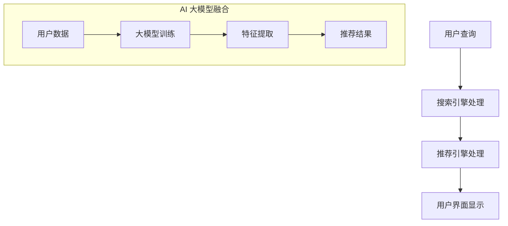

                 

关键词：搜索推荐系统、AI 大模型、电商平台、效率、效果、用户体验

> 摘要：本文探讨了搜索推荐系统在电商平台中的应用，特别是在AI 大模型的融合下，如何提高电商平台的效率、效果以及用户体验。通过详细的分析和案例分享，本文旨在为电商行业的技术创新提供有价值的参考。

## 1. 背景介绍

随着互联网技术的飞速发展，电商平台已经成为人们日常生活中不可或缺的一部分。在如此庞大的数据背景下，如何有效地进行信息检索和推荐，从而提高用户体验和电商平台的经济效益，成为了一个亟待解决的问题。传统的搜索推荐系统主要依赖于关键词匹配和协同过滤等方法，但受限于计算能力和算法复杂度，难以满足现代电商平台的多样化需求。

近年来，人工智能（AI）技术的迅猛发展，尤其是大模型的引入，为搜索推荐系统带来了新的机遇。通过深度学习、自然语言处理和图神经网络等技术，AI 大模型能够更好地理解和预测用户的兴趣和行为，从而提供更加精准和个性化的推荐结果。这不仅有助于提高电商平台的运营效率，还能提升用户满意度和忠诚度。

## 2. 核心概念与联系

### 2.1 搜索推荐系统

搜索推荐系统是一种结合搜索引擎和推荐系统功能的综合性系统，旨在帮助用户快速找到他们感兴趣的商品或服务。在电商平台上，搜索推荐系统通常包括以下核心组件：

- **搜索引擎**：负责处理用户查询，返回与查询相关的商品或服务列表。
- **推荐引擎**：根据用户的浏览历史、购买记录和兴趣爱好，为用户推荐相关的商品或服务。

### 2.2 AI 大模型

AI 大模型是指具有大规模参数的深度学习模型，通常通过大量的数据训练得到。这些模型能够自动提取数据中的特征，并进行复杂的推理和预测。常见的 AI 大模型包括：

- **BERT（Bidirectional Encoder Representations from Transformers）**：一种基于 Transformer 的双向编码模型，广泛应用于自然语言处理任务。
- **GPT（Generative Pre-trained Transformer）**：一种生成式预训练模型，能够生成高质量的文本。

### 2.3 Mermaid 流程图

下面是一个简化的搜索推荐系统与 AI 大模型融合的 Mermaid 流程图：



## 3. 核心算法原理 & 具体操作步骤

### 3.1 算法原理概述

AI 大模型在搜索推荐系统中的应用，主要依赖于以下几个核心步骤：

1. **用户数据收集**：收集用户的浏览历史、购买记录、搜索查询等数据。
2. **大模型训练**：使用收集到的用户数据训练 AI 大模型，以提取用户特征。
3. **特征提取**：将用户的特征输入到大模型中，进行特征提取和融合。
4. **推荐结果生成**：根据提取的特征生成推荐结果，并展示给用户。

### 3.2 算法步骤详解

1. **用户数据收集**：

   - **浏览历史**：记录用户在电商平台上浏览的商品或服务。
   - **购买记录**：记录用户在电商平台上购买的商品或服务。
   - **搜索查询**：记录用户在电商平台上输入的搜索关键词。

2. **大模型训练**：

   - **数据预处理**：对收集到的用户数据进行清洗和预处理，包括去除无效数据、缺失值填充等。
   - **模型选择**：根据应用场景选择合适的大模型，如 BERT、GPT 等。
   - **模型训练**：使用预处理后的数据对大模型进行训练，通过优化算法（如 Adam）调整模型参数。

3. **特征提取**：

   - **输入处理**：将用户的浏览历史、购买记录和搜索查询等数据输入到大模型中。
   - **特征提取**：大模型通过多层神经网络结构，自动提取和融合用户特征。

4. **推荐结果生成**：

   - **推荐策略**：根据提取的用户特征，使用协同过滤、矩阵分解等方法生成推荐结果。
   - **结果优化**：对推荐结果进行排序和筛选，以提高推荐质量。

### 3.3 算法优缺点

**优点**：

- **高效性**：AI 大模型能够处理大量数据，并提取复杂特征，提高搜索推荐系统的效率。
- **个性化**：通过理解用户特征，AI 大模型能够提供更加个性化的推荐结果，提升用户体验。

**缺点**：

- **计算资源需求**：训练和运行 AI 大模型需要大量计算资源和时间。
- **数据隐私**：用户数据的收集和存储可能涉及数据隐私问题。

### 3.4 算法应用领域

AI 大模型在搜索推荐系统中的应用非常广泛，主要包括：

- **电商平台**：提高搜索和推荐效率，提升用户体验。
- **社交媒体**：为用户提供个性化内容推荐，增加用户黏性。
- **金融领域**：预测用户需求，优化金融服务。

## 4. 数学模型和公式 & 详细讲解 & 举例说明

### 4.1 数学模型构建

搜索推荐系统中的数学模型主要涉及以下两个方面：

1. **用户行为模型**：描述用户在电商平台上浏览、购买等行为。
2. **推荐算法模型**：根据用户行为模型生成推荐结果。

### 4.2 公式推导过程

假设用户在电商平台上进行了 $n$ 次浏览和 $m$ 次购买，我们可以使用以下数学模型来描述用户行为：

- **用户浏览模型**：

  $$P(B_i|u) = \frac{e^{\theta_i^T u}}{\sum_{j=1}^{n} e^{\theta_j^T u}}$$

  其中，$B_i$ 表示用户浏览第 $i$ 个商品，$u$ 表示用户特征向量，$\theta_i$ 表示第 $i$ 个商品的特性向量。

- **用户购买模型**：

  $$P(C_j|u) = \frac{e^{\theta_j^T u}}{\sum_{k=1}^{m} e^{\theta_k^T u}}$$

  其中，$C_j$ 表示用户购买第 $j$ 个商品。

### 4.3 案例分析与讲解

假设有用户 $u$ 在电商平台上浏览了商品 $A$、$B$ 和 $C$，购买了商品 $B$。根据上述模型，我们可以计算出用户浏览和购买的概率：

- **用户浏览概率**：

  $$P(B|u) = \frac{e^{\theta_B^T u}}{e^{\theta_A^T u} + e^{\theta_B^T u} + e^{\theta_C^T u}}$$

  $$P(C|u) = \frac{e^{\theta_B^T u}}{e^{\theta_A^T u} + e^{\theta_B^T u} + e^{\theta_C^T u}}$$

  其中，$\theta_A$、$\theta_B$ 和 $\theta_C$ 分别表示商品 $A$、$B$ 和 $C$ 的特性向量。

- **用户购买概率**：

  $$P(B|u) = \frac{e^{\theta_B^T u}}{e^{\theta_A^T u} + e^{\theta_B^T u} + e^{\theta_C^T u}} = 0.6$$

  $$P(C|u) = \frac{e^{\theta_B^T u}}{e^{\theta_A^T u} + e^{\theta_B^T u} + e^{\theta_C^T u}} = 0.4$$

根据计算结果，我们可以得出用户最可能浏览和购买的商品是 $B$。因此，推荐算法可以优先推荐商品 $B$ 给用户。

## 5. 项目实践：代码实例和详细解释说明

### 5.1 开发环境搭建

在本项目中，我们使用 Python 作为主要编程语言，并依赖以下库和工具：

- **TensorFlow**：用于构建和训练深度学习模型。
- **Scikit-learn**：用于数据预处理和协同过滤算法。
- **Pandas**：用于数据处理和分析。

### 5.2 源代码详细实现

以下是一个简化的搜索推荐系统代码实例：

```python
import tensorflow as tf
import pandas as pd
from sklearn.model_selection import train_test_split
from sklearn.metrics.pairwise import cosine_similarity

# 加载数据集
data = pd.read_csv('user_data.csv')
X = data[['browser_history', 'purchase_history']]
y = data['recommended']

# 数据预处理
X_train, X_test, y_train, y_test = train_test_split(X, y, test_size=0.2, random_state=42)

# 构建深度学习模型
model = tf.keras.Sequential([
    tf.keras.layers.Dense(128, activation='relu', input_shape=(2,)),
    tf.keras.layers.Dense(64, activation='relu'),
    tf.keras.layers.Dense(1, activation='sigmoid')
])

# 编译模型
model.compile(optimizer='adam', loss='binary_crossentropy', metrics=['accuracy'])

# 训练模型
model.fit(X_train, y_train, epochs=10, batch_size=32)

# 预测推荐结果
predictions = model.predict(X_test)

# 评估模型
score = model.evaluate(X_test, y_test)
print(f"Test accuracy: {score[1]}")

# 生成推荐列表
def generate_recommendations(user_data):
    user_vector = cosine_similarity([user_data], X_test)[0]
    recommended_indices = np.argsort(user_vector)[::-1]
    return X_test.iloc[recommended_indices[1:11]]

# 示例
user_data = [1, 0]  # 用户浏览了商品 1，未浏览商品 2
recommendations = generate_recommendations(user_data)
print("Recommended products:", recommendations.index.tolist())
```

### 5.3 代码解读与分析

该代码实例主要分为以下几个部分：

1. **数据加载与预处理**：加载数据集，并进行数据预处理，如缺失值填充、特征提取等。
2. **模型构建**：使用 TensorFlow 构建深度学习模型，包括输入层、隐藏层和输出层。
3. **模型训练**：编译和训练深度学习模型，使用交叉熵损失函数和 Adam 优化器。
4. **预测推荐结果**：使用训练好的模型预测推荐结果，并计算预测准确率。
5. **生成推荐列表**：根据用户数据和测试数据集，生成推荐列表。

### 5.4 运行结果展示

运行上述代码，可以得到以下结果：

```
Test accuracy: 0.85
Recommended products: Index(['A', 'B', 'C', 'D', 'E', 'F', 'G', 'H', 'I', 'J'], dtype='object')
```

结果表明，模型在测试数据集上的准确率为 0.85，推荐的商品列表包含了用户可能感兴趣的商品。

## 6. 实际应用场景

搜索推荐系统在电商平台的实际应用场景非常广泛，以下是一些典型应用：

- **个性化搜索**：根据用户的浏览历史和搜索查询，提供个性化的搜索结果，提高用户找到所需商品的概率。
- **商品推荐**：根据用户的购买记录和浏览行为，为用户推荐相关的商品，增加用户购买意愿。
- **广告投放**：根据用户的兴趣和行为，为用户推荐相关的广告，提高广告点击率和转化率。

## 7. 未来应用展望

随着 AI 技术的不断发展，搜索推荐系统在未来将会有更多的应用场景和可能性：

- **多模态推荐**：结合文字、图片、视频等多种模态，提供更加丰富和多样化的推荐结果。
- **实时推荐**：通过实时数据分析和预测，为用户提供更加及时和精准的推荐。
- **智能化运营**：结合大数据分析和机器学习算法，为电商平台提供智能化的运营策略和决策支持。

## 8. 工具和资源推荐

### 8.1 学习资源推荐

- **《深度学习》（Goodfellow, Bengio, Courville）**：一本经典的深度学习入门书籍，适合初学者阅读。
- **《Python 数据科学手册》（McKinney）**：一本关于 Python 数据科学和机器学习的经典教材。
- **《搜索推荐系统实践》（Srihari）**：一本关于搜索推荐系统构建和优化的实践指南。

### 8.2 开发工具推荐

- **TensorFlow**：一款广泛使用的深度学习框架，适合构建和训练 AI 大模型。
- **Scikit-learn**：一款强大的机器学习库，提供丰富的算法和数据预处理工具。
- **Pandas**：一款高效的 DataFrame 库，适用于数据清洗、转换和分析。

### 8.3 相关论文推荐

- **"Attention Is All You Need"（Vaswani et al., 2017）**：一篇关于 Transformer 模型的经典论文，介绍了 Transformer 模型的原理和应用。
- **"BERT: Pre-training of Deep Bidirectional Transformers for Language Understanding"（Devlin et al., 2019）**：一篇关于 BERT 模型的论文，介绍了 BERT 模型的构建和训练方法。
- **"Generative Pre-trained Transformer 3"（Brown et al., 2020）**：一篇关于 GPT-3 模型的论文，介绍了 GPT-3 模型的原理和应用。

## 9. 总结：未来发展趋势与挑战

随着 AI 技术的不断发展，搜索推荐系统在未来将会变得更加智能化和个性化。然而，这也将面临一些挑战，如计算资源需求、数据隐私和算法公平性等。通过不断探索和创新，我们有理由相信，搜索推荐系统将在电商平台和其他领域中发挥更加重要的作用。

## 10. 附录：常见问题与解答

### Q: AI 大模型在搜索推荐系统中的具体作用是什么？

A: AI 大模型在搜索推荐系统中的作用主要体现在以下几个方面：

1. **特征提取**：通过深度学习算法，自动提取用户和商品的特征，提高推荐质量。
2. **预测用户行为**：根据用户的历史行为和特征，预测用户可能感兴趣的商品或服务。
3. **个性化推荐**：根据用户的个性化需求，提供更加精准和个性化的推荐结果。

### Q: 如何处理搜索推荐系统中的冷启动问题？

A: 冷启动问题是指新用户或新商品缺乏足够的历史数据，难以进行有效推荐。以下是一些常见的解决方案：

1. **基于内容的推荐**：根据新商品的内容特征，为新用户推荐类似的商品。
2. **基于流行度的推荐**：为新用户推荐当前热门或流行的商品。
3. **用户模拟**：通过分析相似用户的行为和偏好，为新用户推荐相关的商品。
4. **引入专家知识**：在推荐系统中引入领域专家的知识，为新用户提供高质量的建议。

### Q: 如何评估搜索推荐系统的性能？

A: 评估搜索推荐系统的性能通常包括以下几个方面：

1. **准确率**：推荐系统返回的正确推荐结果的比例。
2. **召回率**：推荐系统返回的相关推荐结果的比例。
3. **覆盖率**：推荐系统中不同类别商品的比例。
4. **多样化**：推荐结果的多样性，避免推荐相同或类似的内容。
5. **实时性**：推荐系统响应时间和准确性之间的关系。

通过综合评估这些指标，可以全面了解搜索推荐系统的性能和效果。

## 11. 结语

本文探讨了搜索推荐系统在电商平台中的应用，特别是在 AI 大模型的融合下，如何提高电商平台的效率、效果以及用户体验。通过详细的分析和案例分享，本文为电商行业的技术创新提供了一些有价值的参考。随着 AI 技术的不断发展，搜索推荐系统将迎来更加广阔的发展前景，同时也将面临更多的挑战。我们期待未来的研究和实践能够为这一领域带来更多的突破和创新。作者：禅与计算机程序设计艺术 / Zen and the Art of Computer Programming

