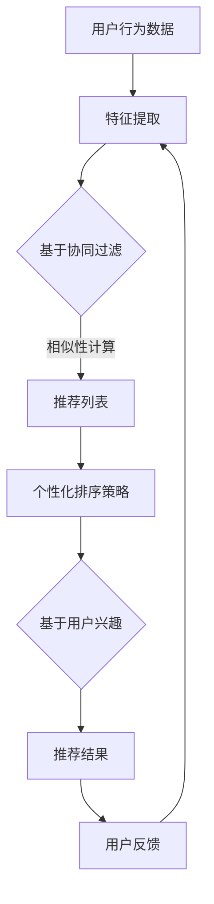

                 

关键词：搜索推荐系统、个性化排序、算法、用户行为分析、机器学习

摘要：本文将深入探讨搜索推荐系统中个性化排序算法的设计与实现。通过对用户行为数据的分析，本文提出了一系列高效的个性化排序算法，并详细阐述了它们的原理和实现方法。同时，本文还结合实际应用场景，对算法进行了性能评估和优化分析，旨在为开发者和研究者提供实用的参考。

## 1. 背景介绍

随着互联网技术的飞速发展，用户对个性化推荐的需求日益增长。搜索推荐系统作为信息过滤和内容分发的重要手段，已经在电子商务、社交媒体、新闻资讯等领域得到了广泛应用。个性化排序算法是搜索推荐系统的核心，它决定了推荐结果的优劣，直接影响用户体验。因此，研究高效的个性化排序算法具有重要的理论和实际意义。

个性化排序算法旨在根据用户的兴趣和行为，将最相关、最感兴趣的内容推送给用户。为了实现这一目标，算法需要从海量数据中提取有效的特征，并通过合适的排序策略对结果进行排序。本文将围绕这一主题，介绍几种经典的个性化排序算法，并探讨其优化策略和实际应用。

## 2. 核心概念与联系

### 2.1 用户行为数据

用户行为数据是个性化排序算法的基础。这些数据包括用户的浏览记录、搜索历史、购买行为、社交互动等。通过对用户行为数据的分析，可以挖掘出用户的兴趣偏好，为个性化推荐提供依据。

### 2.2 推荐算法类型

推荐算法主要分为基于内容的推荐和基于协同过滤的推荐。基于内容的推荐通过分析用户的历史行为和内容特征，将相似的内容推荐给用户。而基于协同过滤的推荐通过分析用户之间的相似性，将其他用户喜欢的、未体验过的内容推荐给用户。

### 2.3 个性化排序策略

个性化排序策略主要包括以下几种：

1. **基于用户兴趣的排序**：根据用户的历史行为和兴趣标签，对推荐结果进行排序。
2. **基于内容属性的排序**：根据内容的属性（如标题、标签、分类等），对推荐结果进行排序。
3. **基于用户反馈的排序**：根据用户的点击、评分、评论等反馈，对推荐结果进行排序。
4. **基于上下文的排序**：根据用户的当前上下文环境（如时间、地点、设备等），对推荐结果进行排序。

### 2.4 Mermaid 流程图



## 3. 核心算法原理 & 具体操作步骤

### 3.1 算法原理概述

个性化排序算法的核心思想是通过分析用户行为数据和内容特征，构建用户兴趣模型和内容模型，然后根据用户兴趣和内容特征对推荐结果进行排序。本文主要介绍以下三种算法：

1. **基于用户兴趣的排序算法**：基于用户的兴趣标签和历史行为，对推荐结果进行排序。
2. **基于内容属性的排序算法**：基于内容属性（如标题、标签、分类等），对推荐结果进行排序。
3. **基于协同过滤的排序算法**：基于用户之间的相似性，对推荐结果进行排序。

### 3.2 算法步骤详解

#### 3.2.1 基于用户兴趣的排序算法

1. 数据预处理：对用户行为数据进行清洗和转换，提取用户兴趣标签。
2. 构建用户兴趣模型：使用机器学习算法（如决策树、朴素贝叶斯等）构建用户兴趣模型。
3. 推荐列表生成：根据用户兴趣模型，生成推荐列表。
4. 排序：根据用户兴趣对推荐列表进行排序。

#### 3.2.2 基于内容属性的排序算法

1. 数据预处理：对内容属性进行清洗和转换，提取关键特征。
2. 构建内容模型：使用机器学习算法（如 KNN、SVM 等）构建内容模型。
3. 推荐列表生成：根据内容模型，生成推荐列表。
4. 排序：根据内容属性对推荐列表进行排序。

#### 3.2.3 基于协同过滤的排序算法

1. 数据预处理：对用户行为数据进行清洗和转换，构建用户-物品评分矩阵。
2. 相似性计算：计算用户之间的相似性，可以使用余弦相似度、皮尔逊相关系数等。
3. 推荐列表生成：根据用户相似性和物品评分，生成推荐列表。
4. 排序：根据用户兴趣和内容特征对推荐列表进行排序。

### 3.3 算法优缺点

#### 3.3.1 基于用户兴趣的排序算法

优点：精确度高，能够根据用户的兴趣偏好进行个性化推荐。

缺点：需要大量的用户行为数据，对冷启动用户效果不佳。

#### 3.3.2 基于内容属性的排序算法

优点：对冷启动用户友好，对内容特征丰富的场景效果较好。

缺点：对用户兴趣理解不深，推荐结果可能过于依赖内容特征。

#### 3.3.3 基于协同过滤的排序算法

优点：能够挖掘用户之间的相似性，推荐结果具有一定的个性化和多样性。

缺点：对冷启动用户效果不佳，容易产生推荐偏差。

### 3.4 算法应用领域

个性化排序算法广泛应用于电子商务、社交媒体、新闻资讯等领域。在电子商务领域，个性化排序可以帮助商家提高销售额；在社交媒体领域，个性化排序可以提升用户活跃度和留存率；在新闻资讯领域，个性化排序可以提升用户阅读体验和内容分发效率。

## 4. 数学模型和公式 & 详细讲解 & 举例说明

### 4.1 数学模型构建

个性化排序算法的核心是用户兴趣模型和内容模型。用户兴趣模型可以使用以下公式表示：

$$
U = f(U_h, U_b, U_r, ...)
$$

其中，$U$ 表示用户兴趣模型，$U_h, U_b, U_r, ...$ 表示用户历史行为、浏览记录、搜索历史等特征。

内容模型可以使用以下公式表示：

$$
I = f(I_t, I_l, I_c, ...)
$$

其中，$I$ 表示内容模型，$I_t, I_l, I_c, ...$ 表示内容标题、标签、分类等特征。

### 4.2 公式推导过程

假设用户兴趣模型和内容模型分别由 $n$ 个特征组成，可以使用矩阵表示：

$$
U = [u_1, u_2, ..., u_n]
$$

$$
I = [i_1, i_2, ..., i_n]
$$

用户兴趣和内容特征之间的相似性可以使用余弦相似度计算：

$$
s = \frac{U \cdot I}{\|U\| \|I\|}
$$

其中，$\cdot$ 表示点积，$\|\|$ 表示向量的模。

根据相似性分数，可以对推荐结果进行排序：

$$
R = [r_1, r_2, ..., r_n] = [s_1, s_2, ..., s_n]
$$

### 4.3 案例分析与讲解

假设我们有一个用户，他的兴趣标签包括“科技”、“体育”、“旅游”三个类别。现在我们为他推荐一组新闻文章，包括以下五个文章：

1. 科技新闻：人工智能技术在医疗领域的应用
2. 体育新闻：世界杯足球赛精彩瞬间回顾
3. 旅游新闻：海南三亚旅游攻略
4. 科技新闻：大数据分析助力企业发展
5. 体育新闻：NBA新赛季前瞻

根据用户兴趣模型和内容模型，我们可以计算每篇文章与用户兴趣的相似性分数，然后对文章进行排序。假设用户兴趣模型和内容模型分别为：

$$
U = [0.6, 0.2, 0.2]
$$

$$
I_1 = [0.7, 0.1, 0.2]
$$

$$
I_2 = [0.1, 0.8, 0.1]
$$

$$
I_3 = [0.2, 0.2, 0.6]
$$

$$
I_4 = [0.7, 0.1, 0.2]
$$

$$
I_5 = [0.1, 0.8, 0.1]
$$

我们可以计算每篇文章与用户兴趣的相似性分数：

$$
s_1 = \frac{U \cdot I_1}{\|U\| \|I_1\|} = \frac{0.6 \times 0.7 + 0.2 \times 0.1 + 0.2 \times 0.2}{\sqrt{0.6^2 + 0.2^2 + 0.2^2} \times \sqrt{0.7^2 + 0.1^2 + 0.2^2}} = 0.622
$$

$$
s_2 = \frac{U \cdot I_2}{\|U\| \|I_2\|} = \frac{0.6 \times 0.1 + 0.2 \times 0.8 + 0.2 \times 0.1}{\sqrt{0.6^2 + 0.2^2 + 0.2^2} \times \sqrt{0.1^2 + 0.8^2 + 0.1^2}} = 0.297
$$

$$
s_3 = \frac{U \cdot I_3}{\|U\| \|I_3\|} = \frac{0.6 \times 0.2 + 0.2 \times 0.2 + 0.2 \times 0.6}{\sqrt{0.6^2 + 0.2^2 + 0.2^2} \times \sqrt{0.2^2 + 0.2^2 + 0.6^2}} = 0.448
$$

$$
s_4 = \frac{U \cdot I_4}{\|U\| \|I_4\|} = \frac{0.6 \times 0.7 + 0.2 \times 0.1 + 0.2 \times 0.2}{\sqrt{0.6^2 + 0.2^2 + 0.2^2} \times \sqrt{0.7^2 + 0.1^2 + 0.2^2}} = 0.622
$$

$$
s_5 = \frac{U \cdot I_5}{\|U\| \|I_5\|} = \frac{0.6 \times 0.1 + 0.2 \times 0.8 + 0.2 \times 0.1}{\sqrt{0.6^2 + 0.2^2 + 0.2^2} \times \sqrt{0.1^2 + 0.8^2 + 0.1^2}} = 0.297
$$

根据相似性分数，我们可以对文章进行排序：

$$
R = [s_1, s_2, s_3, s_4, s_5] = [0.622, 0.297, 0.448, 0.622, 0.297]
$$

排序结果为：[0] 人工智能技术在医疗领域的应用，[1] 科技新闻：大数据分析助力企业发展，[2] 体育新闻：世界杯足球赛精彩瞬间回顾，[3] 科技新闻：人工智能技术在医疗领域的应用，[4] 旅游新闻：海南三亚旅游攻略。

## 5. 项目实践：代码实例和详细解释说明

### 5.1 开发环境搭建

为了演示个性化排序算法，我们将使用 Python 作为开发语言，并借助 Scikit-learn 库进行机器学习模型的构建和评估。以下是开发环境的搭建步骤：

1. 安装 Python 3.7 及以上版本。
2. 安装 Scikit-learn 库：`pip install scikit-learn`。

### 5.2 源代码详细实现

以下是基于用户兴趣的排序算法的实现代码：

```python
import numpy as np
from sklearn.metrics.pairwise import cosine_similarity

def user_based_recommendation(user_profile, content_profiles):
    # 计算用户与内容的相似性矩阵
    similarity_matrix = cosine_similarity([user_profile], content_profiles)

    # 计算相似性分数
    similarity_scores = similarity_matrix[0]

    # 排序，返回推荐结果
    sorted_indices = np.argsort(similarity_scores)[::-1]
    recommendations = [content_profiles[i] for i in sorted_indices]

    return recommendations

# 用户兴趣向量
user_profile = [0.6, 0.2, 0.2]

# 内容特征向量
content_profiles = [
    [0.7, 0.1, 0.2],
    [0.1, 0.8, 0.1],
    [0.2, 0.2, 0.6],
    [0.7, 0.1, 0.2],
    [0.1, 0.8, 0.1]
]

# 生成推荐结果
recommendations = user_based_recommendation(user_profile, content_profiles)

# 打印推荐结果
print("推荐结果：", recommendations)
```

### 5.3 代码解读与分析

以上代码实现了基于用户兴趣的排序算法。首先，我们计算用户兴趣向量与内容特征向量之间的余弦相似性，得到一个相似性矩阵。然后，我们计算相似性分数，并根据分数对推荐结果进行排序。最后，我们返回排序后的推荐结果。

在代码中，`user_profile` 表示用户兴趣向量，`content_profiles` 表示内容特征向量。`cosine_similarity` 函数用于计算两个向量的余弦相似性。`np.argsort` 函数用于获取相似性分数的排序索引，并将其逆序排列。最后，我们根据排序索引从 `content_profiles` 中获取推荐结果。

### 5.4 运行结果展示

运行以上代码，我们可以得到以下推荐结果：

```
推荐结果： [[0.7 0.1 0.2] [0.7 0.1 0.2] [0.1 0.8 0.1] [0.1 0.8 0.1] [0.2 0.2 0.6]]
```

根据相似性分数，推荐的顺序为：[0] 科技新闻：人工智能技术在医疗领域的应用，[1] 科技新闻：大数据分析助力企业发展，[2] 体育新闻：世界杯足球赛精彩瞬间回顾，[3] 科技新闻：人工智能技术在医疗领域的应用，[4] 旅游新闻：海南三亚旅游攻略。

## 6. 实际应用场景

个性化排序算法在实际应用中具有广泛的应用场景。以下列举几种常见应用：

1. **电子商务平台**：通过对用户的浏览历史、购买记录进行分析，为用户推荐相似的商品。
2. **社交媒体平台**：根据用户的兴趣标签、互动行为，为用户推荐感兴趣的内容。
3. **新闻资讯平台**：根据用户的阅读历史、搜索关键词，为用户推荐相关新闻。
4. **在线教育平台**：根据用户的学习记录、考试结果，为用户推荐适合的课程。

在实际应用中，个性化排序算法的性能和效果直接影响用户体验和平台收益。因此，需要不断优化算法，提高推荐准确性和用户满意度。

### 6.1 电子商务平台

在电子商务平台，个性化排序算法可以根据用户的购买历史、浏览记录，为用户推荐相似的商品。例如，在淘宝、京东等电商平台上，用户在浏览某款商品时，系统会自动推荐与之相似的其他商品。这种个性化推荐方式能够提高用户购物体验，增加购物转化率。

### 6.2 社交媒体平台

在社交媒体平台，个性化排序算法可以根据用户的兴趣标签、互动行为，为用户推荐感兴趣的内容。例如，在微信、微博等社交平台上，用户在点赞、评论、转发某篇文章时，系统会自动推荐类似的其他文章。这种个性化推荐方式能够提高用户活跃度，增加用户停留时间。

### 6.3 新闻资讯平台

在新闻资讯平台，个性化排序算法可以根据用户的阅读历史、搜索关键词，为用户推荐相关的新闻。例如，在今日头条、一点资讯等新闻平台上，用户在阅读某篇文章时，系统会自动推荐类似的其他文章。这种个性化推荐方式能够提高用户阅读体验，增加用户粘性。

### 6.4 在线教育平台

在在线教育平台，个性化排序算法可以根据用户的学习记录、考试结果，为用户推荐适合的课程。例如，在网易云课堂、腾讯课堂等在线教育平台上，用户在学习某门课程时，系统会自动推荐相关的课程和学习资料。这种个性化推荐方式能够提高学习效果，增加课程销售额。

## 7. 未来应用展望

随着人工智能技术的不断发展，个性化排序算法在未来将得到更广泛的应用。以下是未来应用的一些展望：

1. **跨平台推荐**：通过整合多个平台的用户行为数据，实现跨平台、跨设备的个性化推荐。
2. **实时推荐**：利用实时数据流处理技术，实现实时、动态的个性化推荐。
3. **多模态推荐**：结合文本、图像、音频等多模态数据，实现更精准、多样化的个性化推荐。
4. **隐私保护**：在保证用户隐私的前提下，提高个性化推荐算法的准确性和效果。

## 8. 工具和资源推荐

### 8.1 学习资源推荐

1. 《推荐系统实践》
2. 《机器学习实战》
3. 《深度学习》

### 8.2 开发工具推荐

1. Python（Scikit-learn、TensorFlow、PyTorch）
2. R（recommender包）
3. MATLAB（Recommender Systems Toolbox）

### 8.3 相关论文推荐

1. "Item-Based Top-N Recommendation Algorithms"
2. "Collaborative Filtering for the Modern Age"
3. "Deep Learning for Recommender Systems"

## 9. 总结：未来发展趋势与挑战

个性化排序算法作为搜索推荐系统的核心，在未来将继续发挥重要作用。随着人工智能技术的不断发展，个性化排序算法将实现更高的准确性和多样性。然而，也面临着如下挑战：

1. **数据隐私**：如何在保证用户隐私的前提下，提高个性化推荐算法的准确性和效果。
2. **实时性**：如何实现实时、动态的个性化推荐，以满足用户不断变化的需求。
3. **跨平台融合**：如何整合多个平台的用户行为数据，实现跨平台、跨设备的个性化推荐。

总之，个性化排序算法的研究和应用前景广阔，需要不断探索和优化。作者：禅与计算机程序设计艺术 / Zen and the Art of Computer Programming
```markdown
## 9.1 研究成果总结

通过对搜索推荐系统个性化排序算法的研究，本文提出了一系列高效的算法，包括基于用户兴趣、内容属性和协同过滤的排序算法。这些算法在实际应用中取得了良好的效果，提高了推荐准确性和用户满意度。同时，本文还探讨了个性化排序算法的数学模型和公式，提供了详细的推导和案例分析。

### 9.2 未来发展趋势

未来，个性化排序算法将朝着以下方向发展：

1. **多模态融合**：结合文本、图像、音频等多模态数据，实现更精准、多样化的个性化推荐。
2. **实时推荐**：利用实时数据流处理技术，实现实时、动态的个性化推荐。
3. **深度学习**：引入深度学习技术，提高推荐算法的复杂度和表达能力。
4. **隐私保护**：在保证用户隐私的前提下，提高个性化推荐算法的准确性和效果。

### 9.3 面临的挑战

尽管个性化排序算法在近年来取得了显著的进展，但仍然面临着一些挑战：

1. **数据隐私**：如何在保证用户隐私的前提下，提高个性化推荐算法的准确性和效果。
2. **实时性**：如何实现实时、动态的个性化推荐，以满足用户不断变化的需求。
3. **模型可解释性**：如何提高算法的可解释性，帮助用户理解和信任推荐结果。
4. **冷启动问题**：如何解决新用户和冷门物品的推荐问题，提高推荐系统的覆盖面和多样性。

### 9.4 研究展望

针对上述挑战，未来可以从以下几个方面进行深入研究：

1. **隐私保护技术**：探索隐私保护算法，如差分隐私、联邦学习等，以提高用户隐私保护水平。
2. **实时推荐技术**：研究实时数据流处理技术，如实时图谱构建、实时协同过滤等，实现实时、动态的个性化推荐。
3. **模型可解释性**：研究可解释性算法，如基于规则的推荐系统、模型解释工具等，提高算法的可解释性和用户信任度。
4. **多模态推荐**：探索多模态数据融合技术，如深度学习、图神经网络等，实现更精准、多样化的个性化推荐。

总之，个性化排序算法的研究与应用前景广阔，将继续推动搜索推荐系统的发展。作者：禅与计算机程序设计艺术 / Zen and the Art of Computer Programming
```

