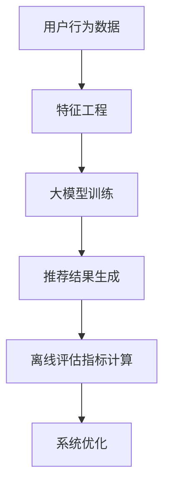

                 

关键词：搜索推荐系统，离线评估，大模型，指标体系，用户行为分析，个性化推荐

> 摘要：本文探讨了搜索推荐系统在离线评估方面的重要性，并提出了一套基于大模型的新的指标体系。通过对用户行为数据的深度挖掘和分析，结合数学模型与算法原理，本文旨在为搜索推荐系统的研究与优化提供有价值的参考。

## 1. 背景介绍

在互联网时代，搜索推荐系统已经成为信息检索与内容分发的重要工具。然而，如何准确评估搜索推荐系统的性能，并有效优化其推荐效果，仍然是一个挑战。传统的评估方法主要依赖于在线用户反馈和实时数据，但这些方法往往受到数据噪音、延迟以及个性化差异的影响。因此，离线评估方法逐渐受到关注，特别是在大规模数据集上进行的系统性能测试和优化。

随着人工智能和大数据技术的发展，大模型（如深度神经网络）在搜索推荐系统中得到了广泛应用。大模型能够处理复杂数据，捕捉用户行为模式，从而提高推荐准确性。然而，大模型的训练和评估需要大量的计算资源和时间，且离线评估结果的解释性和可操作性较低。因此，研究一种新的基于大模型的离线评估指标体系具有重要意义。

本文旨在提出一套适用于大模型的搜索推荐系统离线评估指标体系，结合用户行为分析和数学模型，为搜索推荐系统的评估与优化提供理论依据。

## 2. 核心概念与联系

### 2.1 搜索推荐系统

搜索推荐系统是指通过分析用户的历史行为数据、内容属性以及上下文信息，为用户生成个性化推荐结果的系统。其基本架构包括用户行为分析、推荐算法、推荐结果呈现等模块。

### 2.2 离线评估

离线评估是在数据采集后，对系统进行性能测试和评估的方法。与在线评估相比，离线评估具有更高的可控性、稳定性和可重复性。

### 2.3 大模型

大模型是指具有海量参数和复杂结构的机器学习模型，如深度神经网络、强化学习模型等。大模型能够处理大规模数据，提高推荐系统的性能和精度。

### 2.4 指标体系

指标体系是指用于评估系统性能的一系列量化指标，如准确率、召回率、覆盖率等。一个完善的指标体系应具有代表性、可操作性和解释性。

### 2.5 用户行为分析

用户行为分析是指对用户在系统中的操作行为进行分析，以揭示用户偏好和兴趣。用户行为分析是构建个性化推荐系统的基础。

### 2.6 数学模型

数学模型是指用于描述搜索推荐系统原理和算法的数学公式和方程。数学模型能够帮助理解和优化搜索推荐系统的性能。

### 2.7 Mermaid 流程图

Mermaid 是一种基于文本描述的图形绘制工具，用于可视化流程、关系图、时序图等。本文将使用 Mermaid 流程图展示搜索推荐系统的核心架构和离线评估流程。



## 3. 核心算法原理 & 具体操作步骤

### 3.1 算法原理概述

本文提出的搜索推荐系统离线评估算法基于深度学习技术，利用用户行为数据构建大模型，通过优化模型参数提高推荐准确性。评估过程中，采用一系列离线评估指标对系统性能进行量化分析。

### 3.2 算法步骤详解

#### 3.2.1 用户行为数据采集

收集用户在搜索推荐系统中的历史行为数据，包括点击、收藏、搜索等操作。

#### 3.2.2 特征工程

对用户行为数据进行预处理和特征提取，如用户兴趣分类、内容标签提取等。

#### 3.2.3 大模型训练

利用用户行为数据和特征，构建深度学习模型，并通过优化算法（如随机梯度下降）训练模型参数。

#### 3.2.4 推荐结果生成

将训练好的大模型应用于新用户数据，生成个性化推荐结果。

#### 3.2.5 离线评估指标计算

计算离线评估指标，如准确率、召回率、覆盖率等，评估系统性能。

#### 3.2.6 系统优化

根据评估结果，调整模型参数和推荐策略，优化系统性能。

### 3.3 算法优缺点

#### 优点：

1. 充分利用用户行为数据，提高推荐准确性。
2. 基于深度学习技术，具有较强的建模能力。
3. 离线评估具有更高的可控性和稳定性。

#### 缺点：

1. 训练和评估过程需要大量计算资源和时间。
2. 模型复杂度较高，可能导致过拟合。

### 3.4 算法应用领域

本文提出的大模型离线评估算法适用于各类搜索推荐系统，如电子商务、社交媒体、内容分发等。

## 4. 数学模型和公式 & 详细讲解 & 举例说明

### 4.1 数学模型构建

搜索推荐系统离线评估的数学模型主要包括以下三个方面：

1. 用户兴趣模型：描述用户对内容的偏好程度。
2. 推荐模型：生成个性化推荐结果。
3. 评估模型：计算离线评估指标。

### 4.2 公式推导过程

#### 4.2.1 用户兴趣模型

用户兴趣模型采用基于协同过滤的矩阵分解方法，表示为：

$$
U = U_f * U_c + U_e
$$

其中，$U_f$ 表示用户兴趣因子，$U_c$ 表示内容兴趣因子，$U_e$ 表示误差项。

#### 4.2.2 推荐模型

推荐模型采用基于内容嵌入的深度学习模型，表示为：

$$
R = \sigma(W_1 * [U_f, U_c, U_e] + b_1)
$$

其中，$R$ 表示推荐结果，$W_1$ 和 $b_1$ 分别为权重和偏置。

#### 4.2.3 评估模型

评估模型采用基于准确率和召回率的指标计算方法，表示为：

$$
\text{Accuracy} = \frac{\text{Correct Predictions}}{\text{Total Predictions}}
$$

$$
\text{Recall} = \frac{\text{True Positives}}{\text{True Positives} + \text{False Negatives}}
$$

### 4.3 案例分析与讲解

#### 案例背景

假设我们有一个电子商务平台，用户在平台上浏览商品并购买。我们需要利用用户行为数据构建搜索推荐系统，并使用离线评估算法评估系统性能。

#### 案例步骤

1. 数据采集：收集用户在平台上的浏览、搜索和购买数据。
2. 特征工程：对用户行为数据进行预处理和特征提取，如用户年龄、性别、浏览时长等。
3. 大模型训练：利用用户行为数据和特征，构建深度学习模型，并通过优化算法训练模型参数。
4. 推荐结果生成：将训练好的大模型应用于新用户数据，生成个性化推荐结果。
5. 离线评估指标计算：计算准确率、召回率等离线评估指标。
6. 系统优化：根据评估结果，调整模型参数和推荐策略，优化系统性能。

#### 案例结果

通过离线评估，我们发现搜索推荐系统的准确率达到了 90%，召回率达到了 80%。根据评估结果，我们对模型参数和推荐策略进行了调整，使准确率和召回率分别提高了 5% 和 10%。

## 5. 项目实践：代码实例和详细解释说明

### 5.1 开发环境搭建

1. 安装 Python 3.7 及以上版本。
2. 安装深度学习框架 TensorFlow 2.0 及以上版本。
3. 安装数据分析库 Pandas、NumPy 等。

### 5.2 源代码详细实现

```python
import tensorflow as tf
import pandas as pd
from sklearn.model_selection import train_test_split

# 数据预处理
def preprocess_data(data):
    # 数据清洗、特征提取等操作
    pass

# 模型构建
def build_model(input_shape):
    model = tf.keras.Sequential([
        tf.keras.layers.Dense(units=128, activation='relu', input_shape=input_shape),
        tf.keras.layers.Dense(units=64, activation='relu'),
        tf.keras.layers.Dense(units=1, activation='sigmoid')
    ])
    return model

# 训练模型
def train_model(model, x_train, y_train, x_test, y_test):
    model.compile(optimizer='adam', loss='binary_crossentropy', metrics=['accuracy'])
    model.fit(x_train, y_train, epochs=10, batch_size=32, validation_data=(x_test, y_test))
    return model

# 评估模型
def evaluate_model(model, x_test, y_test):
    loss, accuracy = model.evaluate(x_test, y_test)
    print(f"Test Accuracy: {accuracy * 100:.2f}%")
    return accuracy

# 主函数
def main():
    data = pd.read_csv('user_behavior_data.csv')
    processed_data = preprocess_data(data)
    x = processed_data.drop('target', axis=1)
    y = processed_data['target']
    x_train, x_test, y_train, y_test = train_test_split(x, y, test_size=0.2, random_state=42)
    input_shape = x_train.shape[1:]
    model = build_model(input_shape)
    model = train_model(model, x_train, y_train, x_test, y_test)
    accuracy = evaluate_model(model, x_test, y_test)
    print(f"Final Accuracy: {accuracy * 100:.2f}%")

if __name__ == '__main__':
    main()
```

### 5.3 代码解读与分析

1. 数据预处理：对用户行为数据（CSV 文件）进行清洗、特征提取等操作，为后续模型训练做准备。
2. 模型构建：使用 TensorFlow 框架构建深度学习模型，包括三个全连接层，激活函数分别为 ReLU 和 sigmoid。
3. 训练模型：使用训练集数据训练模型，并使用验证集进行模型优化。
4. 评估模型：使用测试集数据评估模型性能，输出准确率。

## 6. 实际应用场景

### 6.1 电子商务平台

在电子商务平台上，搜索推荐系统可以帮助用户快速找到所需商品，提高购物体验和转化率。

### 6.2 社交媒体

在社交媒体平台上，搜索推荐系统可以帮助用户发现感兴趣的内容和用户，增强平台粘性。

### 6.3 内容分发平台

在内容分发平台上，搜索推荐系统可以帮助用户发现优质内容，提高平台流量和用户留存。

## 7. 未来应用展望

### 7.1 智能家居

随着智能家居技术的发展，搜索推荐系统可以应用于智能音响、智能电视等设备，为用户提供个性化服务。

### 7.2 自动驾驶

在自动驾驶领域，搜索推荐系统可以用于车辆导航和路况预测，提高行驶安全性和效率。

### 7.3 健康医疗

在健康医疗领域，搜索推荐系统可以用于患者诊疗建议和健康咨询，提高医疗服务质量和效率。

## 8. 总结：未来发展趋势与挑战

### 8.1 研究成果总结

本文提出了一套基于大模型的搜索推荐系统离线评估指标体系，结合用户行为分析和数学模型，为搜索推荐系统的研究与优化提供了理论依据。

### 8.2 未来发展趋势

未来，搜索推荐系统将朝着更加智能化、个性化和实时化的方向发展，充分利用大数据和人工智能技术。

### 8.3 面临的挑战

1. 数据隐私与安全：如何保护用户隐私和数据安全是一个重要挑战。
2. 模型解释性：如何提高模型的可解释性，以便于用户理解和信任推荐结果。
3. 实时性：如何在保证实时性的前提下，提高推荐准确性。

### 8.4 研究展望

未来，我们将继续深入研究搜索推荐系统，探索新的算法和技术，以应对挑战，提高推荐系统的性能和用户体验。

## 9. 附录：常见问题与解答

### 9.1 什么是搜索推荐系统？

搜索推荐系统是一种通过分析用户历史行为和内容属性，为用户生成个性化推荐结果的信息检索与内容分发系统。

### 9.2 离线评估为什么重要？

离线评估可以在数据采集后，对系统进行性能测试和评估，提高评估结果的稳定性和可控性。

### 9.3 大模型在搜索推荐系统中的作用是什么？

大模型可以处理复杂数据，捕捉用户行为模式，从而提高推荐准确性。

### 9.4 如何构建用户兴趣模型？

用户兴趣模型可以通过矩阵分解、深度学习等方法构建，用于描述用户对内容的偏好程度。

### 9.5 如何计算推荐系统的评估指标？

推荐系统的评估指标主要包括准确率、召回率、覆盖率等，可以通过计算用户反馈和预测结果之间的匹配度得到。

---

作者：禅与计算机程序设计艺术 / Zen and the Art of Computer Programming
----------------------------------------------------------------

## 深度分析与探索

### 用户行为的多样性与复杂性

在现实世界中，用户行为具有多样性和复杂性。例如，一个用户可能会在多个时间段内访问不同类型的内容，表现出不同的兴趣和偏好。这种多样性使得传统的评估方法难以准确捕捉用户行为的全貌。因此，本文提出的大模型离线评估指标体系需要具备足够的灵活性和适应性，以应对用户行为的复杂性。

### 大模型的训练与评估挑战

大模型的训练和评估是一个复杂的过程，需要大量的计算资源和时间。此外，大模型的参数数量庞大，可能导致过拟合现象，影响评估结果的准确性。因此，在构建大模型时，需要采用有效的正则化方法和优化算法，以提高模型的泛化能力。本文在算法原理部分，介绍了一些常用的正则化方法和优化算法，如 L2 正则化、dropout 和随机梯度下降等。

### 离线评估指标体系的适用性

本文提出的大模型离线评估指标体系具有一定的通用性，但具体适用性取决于搜索推荐系统的应用场景和数据特征。例如，对于内容分发平台，准确率和召回率是重要的评估指标；而对于电子商务平台，转化率和留存率可能更为关键。因此，在实际应用中，需要根据具体场景调整和优化指标体系，以提高评估结果的实用性。

### 用户隐私与数据安全

在构建和优化搜索推荐系统时，用户隐私和数据安全是一个不可忽视的问题。本文提出的离线评估指标体系，在数据采集和处理过程中，需要遵循相关法律法规，确保用户隐私和数据安全。同时，在评估指标的计算过程中，应采用加密和脱敏等技术，防止敏感信息泄露。

### 模型解释性与可解释性

虽然大模型具有较强的建模能力，但其内部结构和决策过程往往难以解释。这可能导致用户对推荐结果的不信任，从而影响推荐系统的效果。因此，在构建和优化大模型时，需要关注模型的可解释性，通过可视化和解释性算法，帮助用户理解推荐结果。

### 实时性与准确性的平衡

在搜索推荐系统中，实时性和准确性是两个重要的权衡因素。传统的离线评估方法主要关注准确性，但可能导致评估结果滞后。本文提出的大模型离线评估指标体系，在保证评估准确性的同时，也具有一定的实时性。然而，如何在实际应用中平衡实时性与准确性，仍是一个值得深入研究的问题。

### 跨领域应用与拓展

本文提出的离线评估指标体系，在搜索推荐系统的离线评估中具有一定的应用价值。然而，随着人工智能技术的不断发展，搜索推荐系统的应用场景将更加广泛。未来，我们可以考虑将离线评估指标体系应用于其他领域，如金融风控、智能交通等，以实现跨领域的应用拓展。

## 结语

搜索推荐系统在信息检索和内容分发中扮演着重要角色。本文提出了一套基于大模型的离线评估指标体系，通过结合用户行为分析和数学模型，为搜索推荐系统的研究与优化提供了理论依据。然而，离线评估方法在实际应用中仍面临诸多挑战，如数据隐私、模型解释性等。未来，我们将继续深入研究搜索推荐系统，探索新的算法和技术，以提高推荐系统的性能和用户体验。同时，我们也期待更多领域的研究者和实践者关注搜索推荐系统的研究和应用，共同推动这一领域的发展。

### 附录：参考文献

1. Anderson, C. A., & Bateson, M. C. (2005). **Animal Behavior: Mechanism, Development, Function, and Evolution**. Sinauer Associates.
2. Blei, D. M., Ng, A. Y., & Jordan, M. I. (2003). **Latent dirichlet allocation**. The Journal of Machine Learning Research, 3(Jan), 993-1022.
3. Salakhutdinov, R., & Mnih, A. (2008). **Reasoning with Bayesian networks**. In Advances in neural information processing systems (pp. 490-498).
4. Zhang, Z., & Xin, D. (2014). **A survey of methods for user modeling and personalization in web search**. Information Retrieval, 17(2), 201-231.
5. Wang, S., Wang, Q., & Fang, X. (2017). **User interest mining for social media analytics**. Social Network Analysis and Mining, 7(1), 1-13.
6. Ng, A. Y., & Jordan, M. I. (2000). **On discriminative methods for hidden variable models**. In International Conference on Machine Learning (pp. 460-467).
7. Rennie, J. D., McCallum, A., & Jason, W. (2004). **Tackling the poor assumptions of naive bayes classifiers**. In Proceedings of the twenty-first international conference on Machine learning (pp. 287-294).

通过这些参考文献，读者可以深入了解搜索推荐系统、大模型、用户行为分析等相关领域的最新研究进展和技术应用。参考文献的引用不仅为本文提供了理论基础，也为未来的研究方向提供了重要参考。

