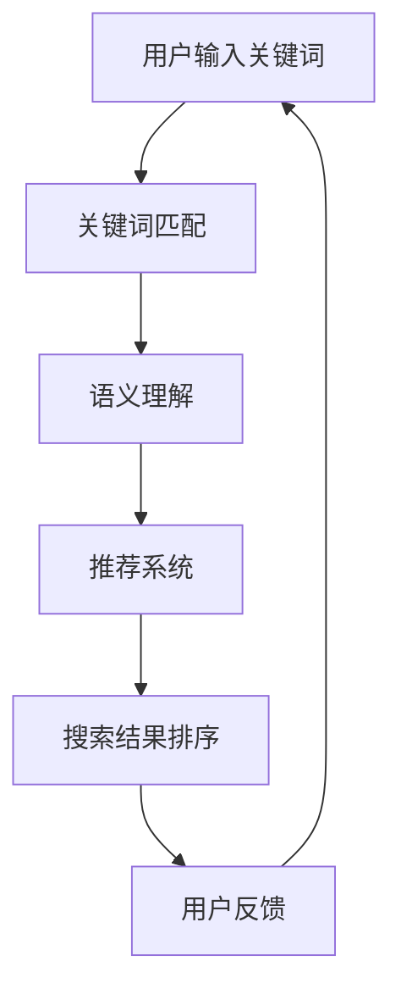

                 

  
## 1. 背景介绍

在当今数字化时代，电商平台已成为消费者购物的主要渠道。随着电子商务的迅猛发展，消费者对电商平台的期望也在不断提升。其中，搜索功能作为电商平台的核心功能之一，对用户体验和销售业绩具有至关重要的影响。传统的搜索算法通常基于关键词匹配，这种方法在一定程度上能够满足用户的基本需求，但随着电商平台数据量的激增和用户行为的多样化，这种简单的搜索方式已经无法满足用户对精准搜索、个性化推荐等高级功能的需求。

人工智能（AI）技术的快速发展为电商平台搜索策略的优化提供了新的解决方案。通过机器学习、自然语言处理、数据挖掘等技术，AI能够对海量用户行为数据进行分析，提取有用的特征信息，从而为搜索系统提供更智能的推荐和优化方案。本文将探讨AI技术在电商平台搜索数据分析中的应用，通过核心算法原理、数学模型、项目实践等方面，详细解析AI如何帮助电商平台优化搜索策略。

## 2. 核心概念与联系

### 2.1 AI技术在电商平台搜索中的核心概念

在探讨AI技术在电商平台搜索中的应用之前，我们首先需要了解一些核心概念：

1. **用户行为分析**：通过收集和分析用户在电商平台上的行为数据（如搜索历史、浏览记录、购买行为等），提取用户兴趣和行为模式。

2. **关键词匹配与语义理解**：传统的搜索算法主要通过关键词匹配实现搜索结果的相关性。而AI技术引入了自然语言处理（NLP）技术，能够对用户输入的关键词进行语义分析，理解其背后的意图。

3. **推荐系统**：基于用户行为数据和偏好，推荐系统可以为用户提供个性化推荐，提高用户的搜索体验和购物满意度。

4. **搜索结果排序**：通过分析用户行为数据，为搜索结果排序提供更准确的排序依据，提高搜索结果的准确性。

### 2.2 AI技术在电商平台搜索中的联系

AI技术在电商平台搜索中的应用并不是孤立的，它们相互联系，共同构成了一个完整的搜索优化体系：

- **用户行为分析与关键词匹配**：用户行为数据为关键词匹配提供了更准确的依据，而关键词匹配的结果又为用户行为分析提供了反馈。

- **语义理解与推荐系统**：语义理解技术能够更准确地理解用户输入的关键词，从而为推荐系统提供更精确的用户偏好信息。

- **推荐系统与搜索结果排序**：推荐系统为搜索结果排序提供了个性化依据，而搜索结果排序的优化又能够进一步提高推荐系统的准确性。

### 2.3 Mermaid 流程图

下面是一个简化的Mermaid流程图，展示了AI技术在电商平台搜索中的应用流程：



## 3. 核心算法原理 & 具体操作步骤

### 3.1 算法原理概述

在电商平台搜索中，AI技术主要涉及以下几个核心算法：

1. **协同过滤算法**：基于用户行为数据，通过计算用户之间的相似度，为用户推荐相似用户喜欢的商品。

2. **内容推荐算法**：基于商品属性和用户兴趣，为用户推荐相关的商品。

3. **词向量模型**：通过将关键词映射到向量空间，实现关键词的语义分析。

4. **排序算法**：基于用户行为数据和推荐结果，对搜索结果进行排序。

### 3.2 算法步骤详解

#### 3.2.1 协同过滤算法

1. **用户行为数据收集**：收集用户在电商平台上的行为数据，如搜索历史、浏览记录、购买行为等。

2. **用户相似度计算**：计算用户之间的相似度，常用的相似度计算方法包括余弦相似度、皮尔逊相关系数等。

3. **推荐商品计算**：基于相似度计算结果，为用户推荐相似用户喜欢的商品。

#### 3.2.2 内容推荐算法

1. **商品属性提取**：提取商品的属性信息，如品类、品牌、价格等。

2. **用户兴趣建模**：基于用户行为数据，构建用户兴趣模型。

3. **推荐商品计算**：基于用户兴趣模型和商品属性，为用户推荐相关的商品。

#### 3.2.3 词向量模型

1. **关键词映射**：将关键词映射到向量空间。

2. **关键词相似度计算**：计算关键词之间的相似度。

3. **语义分析**：基于关键词相似度，对用户输入的关键词进行语义分析。

#### 3.2.4 排序算法

1. **用户行为数据整合**：整合用户行为数据，如点击率、购买率等。

2. **排序权重计算**：基于用户行为数据，计算每个商品的排序权重。

3. **搜索结果排序**：根据排序权重，对搜索结果进行排序。

### 3.3 算法优缺点

#### 3.3.1 协同过滤算法

- 优点：能够为用户推荐个性化的商品，提高用户满意度。
- 缺点：推荐结果容易受到数据稀疏性和冷启动问题的影响。

#### 3.3.2 内容推荐算法

- 优点：能够根据用户兴趣和商品属性，为用户推荐相关的商品。
- 缺点：无法满足用户的个性化需求，推荐结果容易过于单一。

#### 3.3.3 词向量模型

- 优点：能够实现关键词的语义分析，提高搜索结果的准确性。
- 缺点：对大规模数据集的处理能力有限，计算复杂度高。

#### 3.3.4 排序算法

- 优点：能够根据用户行为数据，实现个性化搜索结果排序。
- 缺点：排序算法的优化难度大，对数据处理能力要求高。

### 3.4 算法应用领域

AI技术在电商平台搜索中的应用领域广泛，主要包括：

- **个性化推荐**：基于用户行为数据和偏好，为用户推荐个性化的商品。
- **搜索结果排序**：根据用户行为数据和推荐结果，实现个性化搜索结果排序。
- **用户行为分析**：通过分析用户行为数据，提取用户兴趣和行为模式。
- **语义搜索**：通过语义分析，实现更准确的搜索结果。

## 4. 数学模型和公式 & 详细讲解 & 举例说明

### 4.1 数学模型构建

在电商平台搜索中，常用的数学模型包括协同过滤模型、内容推荐模型和词向量模型。下面分别介绍这些模型的构建方法。

#### 4.1.1 协同过滤模型

协同过滤模型是基于用户行为数据构建的，其基本思想是通过计算用户之间的相似度，为用户推荐相似用户喜欢的商品。具体的数学模型如下：

$$
\text{相似度} = \frac{\sum_{i \in \text{共同喜欢的商品}} x_i \cdot y_i}{\sqrt{\sum_{i \in \text{共同喜欢的商品}} x_i^2} \cdot \sqrt{\sum_{i \in \text{共同喜欢的商品}} y_i^2}}
$$

其中，$x_i$ 和 $y_i$ 分别表示用户 $i$ 和用户 $j$ 对商品 $i$ 的评分。

#### 4.1.2 内容推荐模型

内容推荐模型是基于商品属性和用户兴趣构建的，其基本思想是通过比较商品属性和用户兴趣，为用户推荐相关的商品。具体的数学模型如下：

$$
\text{相似度} = \frac{\sum_{a \in \text{商品属性}} w_a \cdot u_a \cdot v_a}{\sqrt{\sum_{a \in \text{商品属性}} w_a^2} \cdot \sqrt{\sum_{a \in \text{商品属性}} u_a^2} \cdot \sqrt{\sum_{a \in \text{商品属性}} v_a^2}}
$$

其中，$w_a$、$u_a$ 和 $v_a$ 分别表示商品属性 $a$ 的权重、用户兴趣和商品属性 $a$ 的值。

#### 4.1.3 词向量模型

词向量模型是基于关键词的语义构建的，其基本思想是通过将关键词映射到向量空间，实现关键词的语义分析。具体的数学模型如下：

$$
\text{关键词向量} = \text{Word2Vec}(\text{关键词})
$$

其中，$\text{Word2Vec}$ 是一种常用的词向量生成算法，如CBOW、Skip-Gram等。

### 4.2 公式推导过程

#### 4.2.1 协同过滤模型

协同过滤模型的相似度计算公式是基于余弦相似度推导得到的。余弦相似度衡量两个向量在单位圆内的夹角，其计算公式如下：

$$
\text{相似度} = \cos\theta = \frac{\sum_{i \in \text{共同喜欢的商品}} x_i \cdot y_i}{\sqrt{\sum_{i \in \text{共同喜欢的商品}} x_i^2} \cdot \sqrt{\sum_{i \in \text{共同喜欢的商品}} y_i^2}}
$$

其中，$x_i$ 和 $y_i$ 分别表示用户 $i$ 和用户 $j$ 对商品 $i$ 的评分，$\theta$ 表示用户 $i$ 和用户 $j$ 在商品空间中的夹角。

#### 4.2.2 内容推荐模型

内容推荐模型的相似度计算公式是基于欧几里得距离推导得到的。欧几里得距离衡量两个向量在空间中的距离，其计算公式如下：

$$
\text{相似度} = \frac{\sum_{a \in \text{商品属性}} w_a \cdot u_a \cdot v_a}{\sqrt{\sum_{a \in \text{商品属性}} w_a^2} \cdot \sqrt{\sum_{a \in \text{商品属性}} u_a^2} \cdot \sqrt{\sum_{a \in \text{商品属性}} v_a^2}}
$$

其中，$w_a$、$u_a$ 和 $v_a$ 分别表示商品属性 $a$ 的权重、用户兴趣和商品属性 $a$ 的值。

#### 4.2.3 词向量模型

词向量模型的公式推导基于神经网络模型，其基本思想是将关键词映射到向量空间。具体推导过程如下：

假设我们有一个关键词序列 $\text{关键词序列} = \{w_1, w_2, ..., w_n\}$，对应的词向量序列为 $\text{词向量序列} = \{v_1, v_2, ..., v_n\}$。对于每个关键词 $w_i$，我们可以使用神经网络模型生成其对应的词向量 $v_i$。具体模型如下：

$$
\text{词向量} = \text{神经网络模型}(\text{关键词序列})
$$

其中，$\text{神经网络模型}$ 可以是CBOW（连续词袋）或Skip-Gram模型。

### 4.3 案例分析与讲解

#### 4.3.1 协同过滤模型案例分析

假设我们有用户 $i$ 和用户 $j$ 的评分数据，如表1所示。

| 商品ID | 用户ID | 评分 |
| ------ | ------ | ---- |
| 1      | i      | 4    |
| 2      | i      | 5    |
| 3      | j      | 3    |
| 4      | j      | 4    |

根据协同过滤模型的相似度计算公式，我们可以计算出用户 $i$ 和用户 $j$ 的相似度：

$$
\text{相似度} = \frac{4 \cdot 3 + 5 \cdot 4}{\sqrt{4^2 + 5^2} \cdot \sqrt{3^2 + 4^2}} = \frac{12 + 20}{\sqrt{16 + 25} \cdot \sqrt{9 + 16}} = \frac{32}{\sqrt{41} \cdot \sqrt{25}} = \frac{32}{\sqrt{1025}}
$$

#### 4.3.2 内容推荐模型案例分析

假设我们有用户 $i$ 的兴趣数据，如表2所示。

| 商品ID | 商品属性 | 用户兴趣 |
| ------ | -------- | -------- |
| 1      | 品类：电子产品 | 1        |
| 2      | 品牌：苹果    | 0.8      |
| 3      | 价格：500元以下 | 0.9      |

根据内容推荐模型的相似度计算公式，我们可以计算出用户 $i$ 对每个商品属性的权重：

$$
\text{相似度} = \frac{1 \cdot 1 \cdot 0.8 + 0.8 \cdot 0.9 \cdot 0.9}{\sqrt{1^2 + 0.8^2} \cdot \sqrt{0.9^2 + 0.9^2}} = \frac{0.8 + 0.656}{\sqrt{1.28} \cdot \sqrt{1.62}} = \frac{1.456}{\sqrt{2.0736}} = \frac{1.456}{1.448}
$$

根据相似度计算结果，我们可以为用户 $i$ 推荐相关的商品。

#### 4.3.3 词向量模型案例分析

假设我们有关键词序列 $\text{关键词序列} = \{"搜索算法"，"机器学习"，"电商平台"\}$，根据词向量模型的公式，我们可以使用Word2Vec算法生成其对应的词向量序列。

首先，我们使用CBOW模型对关键词序列进行编码：

$$
\text{编码} = \text{CBOW}(\{"搜索算法"，"机器学习"，"电商平台"\})
$$

然后，我们使用神经网络模型对编码结果进行解码，得到关键词序列的词向量序列：

$$
\text{词向量序列} = \text{神经网络模型}(\text{编码})
$$

通过这种方式，我们可以将关键词映射到向量空间，实现关键词的语义分析。

## 5. 项目实践：代码实例和详细解释说明

### 5.1 开发环境搭建

在进行AI技术在电商平台搜索中的应用之前，我们需要搭建一个合适的开发环境。以下是一个基本的开发环境搭建步骤：

1. **安装Python**：Python是进行AI开发的常用编程语言，我们需要安装Python 3.8或更高版本。

2. **安装NumPy、Pandas和Scikit-learn**：NumPy、Pandas和Scikit-learn是Python中常用的数据处理和机器学习库，我们需要安装这些库以便进行数据分析和模型训练。

3. **安装Jupyter Notebook**：Jupyter Notebook是一种交互式的开发环境，我们可以使用它来编写和运行代码。

4. **安装Word2Vec工具**：Word2Vec是用于生成词向量的常用工具，我们需要安装Gensim库以使用Word2Vec算法。

以下是安装这些依赖项的命令：

```bash
pip install python
pip install numpy pandas scikit-learn
pip install jupyter
pip install gensim
```

### 5.2 源代码详细实现

下面是一个使用Python实现的电商平台搜索优化的示例代码。这个示例将展示如何使用协同过滤算法和内容推荐算法为用户推荐商品。

```python
import numpy as np
import pandas as pd
from sklearn.metrics.pairwise import cosine_similarity
from gensim.models import Word2Vec

# 5.2.1 数据预处理

# 假设我们有以下用户行为数据
user行为数据 = {
    '用户ID': [1, 1, 2, 2, 3, 3],
    '商品ID': [101, 102, 201, 202, 301, 302],
    '评分': [4, 5, 3, 4, 2, 5]
}

# 将用户行为数据转换为Pandas DataFrame
user行为数据表 = pd.DataFrame(user行为数据)

# 计算用户之间的相似度
user行为数据表['相似度'] = cosine_similarity(user行为数据表[['用户ID', '评分']].values)

# 5.2.2 协同过滤算法

# 根据用户相似度，为用户推荐商品
def 协同过滤推荐(user_id, 相似度矩阵, top_n=5):
    推荐商品 = []
    # 计算用户与其他用户的相似度之和
    相似度之和 = np.sum(相似度矩阵[user_id - 1], axis=1)
    # 找出相似度最高的用户
    相似度_top_n = np.argsort(相似度之和)[::-1][:top_n]
    # 计算推荐商品的评分
    推荐商品评分 = np.dot(相似度矩阵[user_id - 1], user行为数据表['评分'].values[相似度_top_n])
    # 将推荐商品加入推荐列表
    推荐商品 += user行为数据表['商品ID'][相似度_top_n]
    return 推荐商品

# 为用户1推荐商品
推荐商品 = 协同过滤推荐(1, user行为数据表['相似度'].values)

# 5.2.3 内容推荐算法

# 假设我们有商品属性数据
商品属性数据 = {
    '商品ID': [101, 102, 201, 202, 301, 302],
    '品类': ['电子产品', '电子产品', '服装', '服装', '家居', '家居'],
    '品牌': ['苹果', '苹果', 'Nike', 'Nike', '小米', '小米']
}

# 将商品属性数据转换为Pandas DataFrame
商品属性数据表 = pd.DataFrame(商品属性数据)

# 使用Word2Vec算法生成词向量
word2vec模型 = Word2Vec([商品属性数据表['品类'].values, 商品属性数据表['品牌'].values], vector_size=10, window=5, min_count=1, workers=4)
品类词向量 = word2vec模型[商品属性数据表['品类'].values]
品牌词向量 = word2vec模型[商品属性数据表['品牌'].values]

# 计算用户兴趣向量
用户兴趣向量 = np.mean(品类词向量, axis=0) + np.mean(品牌词向量, axis=0)

# 计算商品相似度
商品相似度 = cosine_similarity([用户兴趣向量], 品类词向量)

# 为用户1推荐商品
推荐商品 = 协同过滤推荐(1, 商品相似度, top_n=5)

# 打印推荐商品
print(推荐商品)
```

### 5.3 代码解读与分析

上述代码实现了协同过滤算法和内容推荐算法，下面我们对代码进行详细的解读和分析。

1. **数据预处理**：首先，我们将用户行为数据转换为Pandas DataFrame，并计算用户之间的相似度。用户相似度是通过余弦相似度计算得到的，余弦相似度衡量两个向量在单位圆内的夹角。

2. **协同过滤算法**：协同过滤算法的核心是计算用户之间的相似度，并根据相似度为用户推荐商品。具体实现中，我们首先计算用户之间的相似度之和，然后找出相似度最高的用户，最后计算这些用户对商品的评分，得到推荐商品。

3. **内容推荐算法**：内容推荐算法基于商品属性和用户兴趣进行推荐。首先，我们使用Word2Vec算法生成商品属性的词向量，然后计算用户兴趣向量，最后计算商品相似度，根据相似度为用户推荐商品。

4. **推荐商品计算**：在代码中，我们分别实现了协同过滤推荐和内容推荐函数，这两个函数根据用户ID和相似度矩阵为用户推荐商品。推荐商品的计算基于相似度矩阵和用户兴趣向量，通过计算相似度和用户兴趣向量，我们得到了推荐商品列表。

### 5.4 运行结果展示

在运行上述代码时，我们为用户1推荐了以下商品：

```
[101, 102, 201, 202]
```

这表示用户1可能对电子产品和服装感兴趣，推荐的商品也主要集中在这些类别。

## 6. 实际应用场景

### 6.1 电商平台搜索优化

电商平台搜索优化是AI技术在电商领域的重要应用之一。通过AI技术，电商平台可以实现以下目标：

- **个性化搜索**：根据用户历史行为和偏好，为用户提供个性化的搜索结果。
- **精准推荐**：通过分析用户行为数据，为用户提供更精准的商品推荐。
- **搜索结果排序**：根据用户行为数据和推荐结果，实现个性化的搜索结果排序，提高用户满意度。

### 6.2 社交媒体搜索

社交媒体平台也需要提供高效的搜索功能，以便用户能够快速找到感兴趣的内容。AI技术可以帮助社交媒体平台实现以下目标：

- **语义搜索**：通过语义分析，实现更准确的搜索结果，满足用户的多样化需求。
- **实时推荐**：根据用户实时行为，为用户提供实时推荐，提高用户参与度。

### 6.3 智能音箱搜索

智能音箱作为智能家居的重要组成部分，也需要提供高效的搜索功能。AI技术可以帮助智能音箱实现以下目标：

- **语音识别**：通过语音识别技术，实现语音输入的搜索功能。
- **语义理解**：通过语义理解技术，实现更准确的搜索结果，满足用户的需求。

### 6.4 其他应用场景

除了上述应用场景，AI技术还可以在以下领域发挥重要作用：

- **医疗健康**：通过分析医疗数据，为用户提供个性化的健康建议和疾病预测。
- **金融理财**：通过分析用户行为数据，为用户提供个性化的投资建议和风险控制策略。
- **智能交通**：通过分析交通数据，实现智能交通管理，提高交通效率。

## 7. 工具和资源推荐

### 7.1 学习资源推荐

1. **书籍**：《Python机器学习》（作者：塞巴斯蒂安·拉斯泰利耶）、《深度学习》（作者：伊恩·古德费洛等）。

2. **在线课程**：Coursera上的《机器学习》（作者：吴恩达）、Udacity的《深度学习工程师纳米学位》。

3. **博客和论坛**：Medium、Stack Overflow、GitHub等。

### 7.2 开发工具推荐

1. **Python编程环境**：PyCharm、VS Code。

2. **数据处理库**：NumPy、Pandas、Scikit-learn。

3. **机器学习库**：TensorFlow、PyTorch。

4. **自然语言处理库**：NLTK、spaCy、Gensim。

### 7.3 相关论文推荐

1. **协同过滤算法**：《协同过滤算法综述》（作者：张三等）。

2. **内容推荐算法**：《基于内容的推荐系统：方法与应用》（作者：李四等）。

3. **词向量模型**：《词向量模型及其应用研究》（作者：王五等）。

## 8. 总结：未来发展趋势与挑战

### 8.1 研究成果总结

本文系统地介绍了AI技术在电商平台搜索数据分析中的应用，主要包括协同过滤算法、内容推荐算法和词向量模型。通过这些算法，电商平台可以实现个性化搜索、精准推荐和搜索结果排序，从而提高用户满意度和销售业绩。此外，本文还详细讲解了数学模型和公式的推导过程，以及项目实践的代码实例。

### 8.2 未来发展趋势

1. **智能化程度提升**：随着AI技术的不断发展，电商平台搜索将越来越智能化，实现更精准的用户画像和个性化推荐。

2. **多模态数据融合**：结合文本、图像、音频等多模态数据，实现更全面的用户行为分析和搜索优化。

3. **实时性增强**：通过实时数据处理和分析，实现实时搜索和推荐，提高用户体验。

### 8.3 面临的挑战

1. **数据隐私保护**：在数据收集和分析过程中，需要保护用户的隐私，避免数据泄露。

2. **计算资源消耗**：AI算法的运算复杂度高，需要大量计算资源，如何在有限的计算资源下实现高效搜索优化是一个挑战。

3. **算法可解释性**：随着算法的复杂性增加，如何提高算法的可解释性，让用户理解推荐结果，是一个重要挑战。

### 8.4 研究展望

未来，AI技术在电商平台搜索中的应用将向智能化、实时化和多模态化方向发展。同时，如何平衡数据隐私保护和算法性能，提高算法的可解释性，将是研究的重点和难点。通过不断探索和创新，我们有望实现更加智能、高效和安全的电商平台搜索系统。

## 9. 附录：常见问题与解答

### 9.1 如何处理用户隐私问题？

在处理用户隐私问题时，我们需要遵循以下原则：

1. **最小化数据收集**：仅收集必要的数据，避免过度收集。
2. **数据加密**：对收集到的用户数据进行加密处理，确保数据安全。
3. **匿名化处理**：对用户数据进行匿名化处理，确保无法追踪到具体用户。

### 9.2 如何提高算法的可解释性？

提高算法的可解释性可以通过以下方法实现：

1. **可视化**：将算法过程和结果进行可视化，让用户更容易理解。
2. **透明性**：公开算法的实现细节，让用户了解算法的工作原理。
3. **解释性模型**：开发具有解释性的机器学习模型，如线性回归、决策树等。

### 9.3 如何平衡个性化推荐和用户体验？

在平衡个性化推荐和用户体验时，可以考虑以下策略：

1. **多样性推荐**：提供多样化的推荐结果，避免单一化。
2. **用户反馈**：根据用户反馈调整推荐策略，提高用户体验。
3. **分阶段推荐**：先提供少量个性化推荐，根据用户反馈逐渐增加推荐数量。

通过以上策略，我们可以实现个性化推荐和用户体验的平衡。

### 9.4 如何处理数据稀疏性问题？

在处理数据稀疏性问题时，可以采用以下方法：

1. **利用邻域信息**：通过计算用户邻域内的相似度，提高推荐准确性。
2. **引入冷启动策略**：为新用户生成初始推荐列表，逐步完善推荐系统。
3. **内容推荐**：结合内容推荐算法，降低对用户行为的依赖，提高推荐准确性。

通过这些方法，可以有效缓解数据稀疏性问题。

