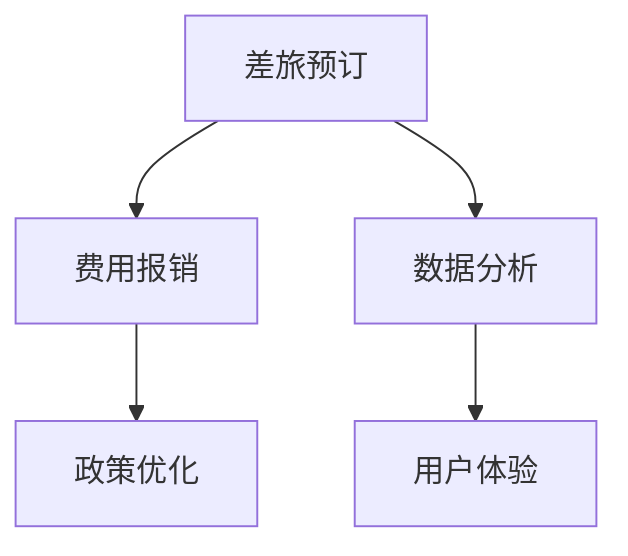

                 

携程商旅管理作为全球知名的商旅服务提供商，在招聘过程中常常会设计一些专业的面试题目来考察应聘者的技术能力和业务理解。本文旨在汇总2024年携程商旅管理社招面试的真题，并给出详细的解答，帮助准备面试的读者更好地应对这一挑战。

## 关键词
商旅管理、面试真题、解题思路、技术能力、业务理解

## 摘要
本文将分析2024年携程商旅管理社招面试中的一些核心问题，涵盖算法、系统设计、业务理解等方面。通过对这些真题的深入剖析，我们旨在提供一套实用的解题思路，帮助应聘者更好地准备面试，并在实际面试中脱颖而出。

## 1. 背景介绍
### 携程商旅管理简介
携程商旅管理作为携程旗下专注于企业客户商旅服务的重要板块，提供包括差旅预订、费用管理、数据分析等一站式商旅服务。在招聘过程中，公司注重应聘者的技术能力、系统设计和业务理解等多方面素质。

### 面试形式和流程
携程商旅管理的面试过程通常包括在线笔试、电话面试和现场面试等多个环节。每个环节都会针对性地考察应聘者的不同技能和素质。本文将重点介绍现场面试中的问题，特别是技术面试中的核心问题。

## 2. 核心概念与联系
为了更好地理解面试题目，我们需要先明确一些核心概念。以下是几个关键概念及其相互联系：

### 商旅管理系统
商旅管理系统是管理企业差旅活动的重要工具，包括预订、支付、费用报销等功能。它需要高效、准确地为员工提供差旅服务，同时确保企业的费用管理规范。

### 数据分析与优化
数据分析在商旅管理中起着至关重要的作用。通过对差旅数据的分析，可以识别出成本节约的机会、优化差旅政策，提高企业的运营效率。

### 用户体验
用户体验是商旅管理系统中不可忽视的一环。系统应提供简洁、直观的用户界面，确保员工在使用过程中能够快速、便捷地完成差旅预订和费用报销。

### Mermaid 流程图
以下是一个简化的商旅管理系统流程图，展示了核心概念的相互联系。



## 3. 核心算法原理 & 具体操作步骤
### 3.1 算法原理概述
商旅管理系统中的核心算法主要涉及路径规划、费用优化和数据分析等。以下是对每个算法的简要概述。

#### 路径规划
路径规划算法用于确定差旅的行程路线，以确保行程时间最短或费用最低。

#### 费用优化
费用优化算法用于分析差旅费用，并寻找降低费用的方法，如选择最经济的交通方式、酒店等。

#### 数据分析
数据分析算法用于处理大量的差旅数据，提取有价值的信息，如费用分布、差旅频率等。

### 3.2 算法步骤详解
以下是每个算法的具体操作步骤：

#### 路径规划算法
1. 输入起点和终点。
2. 构建图模型，包含所有可能的路线和费用。
3. 使用Dijkstra算法或A*算法寻找最短路径。

#### 费用优化算法
1. 收集差旅费用数据。
2. 分析数据，找出费用较高的部分。
3. 根据数据制定优化策略，如调整预订时间、选择更经济的交通方式等。

#### 数据分析算法
1. 收集差旅数据。
2. 使用统计分析方法，如均值、中位数、标准差等，分析数据。
3. 根据分析结果，提出优化建议。

### 3.3 算法优缺点
每种算法都有其优缺点，以下是主要算法的优缺点：

#### 路径规划算法
- 优点：能够快速找到最短路径。
- 缺点：在高维空间中计算复杂度较高。

#### 费用优化算法
- 优点：能够有效降低差旅费用。
- 缺点：优化策略可能不完全适用于所有情况。

#### 数据分析算法
- 优点：能够提取有价值的信息。
- 缺点：对数据质量和完整性要求较高。

### 3.4 算法应用领域
这些算法主要应用于商旅管理系统中的以下领域：

- 路径规划：差旅预订、行程规划。
- 费用优化：差旅费用管理、成本控制。
- 数据分析：差旅数据分析、政策优化。

## 4. 数学模型和公式 & 详细讲解 & 举例说明
### 4.1 数学模型构建
在商旅管理中，常见的数学模型包括线性规划模型和决策树模型。以下是一个简化的线性规划模型：

```latex
\begin{align*}
\text{minimize} \quad c^T x \\
\text{subject to} \quad Ax \leq b \\
x \geq 0
\end{align*}
```

其中，\(c\) 是目标函数系数向量，\(x\) 是变量向量，\(A\) 和 \(b\) 是约束条件矩阵和向量。

### 4.2 公式推导过程
以线性规划模型为例，我们使用拉格朗日乘子法进行推导。设拉格朗日函数为：

```latex
L(x, \lambda) = c^T x + \lambda^T (Ax - b)
```

其中，\(\lambda\) 是拉格朗日乘子向量。取偏导数并令其为零，得到：

```latex
\frac{\partial L}{\partial x} = c + A^T \lambda = 0 \\
\frac{\partial L}{\partial \lambda} = Ax - b = 0
```

解这个方程组，得到最优解 \(x^*\) 和拉格朗日乘子 \(\lambda^*\)。

### 4.3 案例分析与讲解
假设一个企业需要安排员工从上海到北京进行差旅，要求选择最经济的交通方式。我们可以使用线性规划模型进行优化。

定义变量：
- \(x_1\)：选择飞机的费用
- \(x_2\)：选择火车的费用

目标函数：
```latex
\text{minimize} \quad c^T x = (200, 150)^T x
```

约束条件：
```latex
Ax \leq b \\
\begin{bmatrix}
1 & 0 \\
0 & 1
\end{bmatrix} x \leq \begin{bmatrix}
500 \\
300
\end{bmatrix}
```

使用拉格朗日乘子法求解，得到最优解 \(x^* = (0, 1)^T\)，即选择火车出行最经济。

## 5. 项目实践：代码实例和详细解释说明
### 5.1 开发环境搭建
在解答面试题目时，需要先搭建合适的开发环境。以下是一个基本的Python开发环境搭建步骤：

1. 安装Python：从官方网站下载并安装Python。
2. 安装必要库：使用pip安装如numpy、pandas等常用库。

### 5.2 源代码详细实现
以下是一个简单的路径规划算法实现：

```python
import heapq

def dijkstra(graph, start):
    """
    使用Dijkstra算法寻找最短路径
    :param graph: 图模型
    :param start: 起点
    :return: 最短路径和距离
    """
    distances = {vertex: float('infinity') for vertex in graph}
    distances[start] = 0
    priority_queue = [(0, start)]

    while priority_queue:
        current_distance, current_vertex = heapq.heappop(priority_queue)

        if current_distance > distances[current_vertex]:
            continue

        for neighbor, weight in graph[current_vertex].items():
            distance = current_distance + weight

            if distance < distances[neighbor]:
                distances[neighbor] = distance
                heapq.heappush(priority_queue, (distance, neighbor))

    return distances

# 示例图模型
graph = {
    'A': {'B': 1, 'C': 3},
    'B': {'A': 1, 'C': 1, 'D': 5},
    'C': {'A': 3, 'B': 1, 'D': 2},
    'D': {'B': 5, 'C': 2}
}

# 查找从A到D的最短路径
distances = dijkstra(graph, 'A')
print(distances)
```

### 5.3 代码解读与分析
这段代码实现了Dijkstra算法，用于寻找图中两点之间的最短路径。代码首先定义了一个图模型，然后使用优先队列（最小堆）来存储待处理的节点，按照距离从小到大排序。

在主函数 `dijkstra` 中，我们初始化距离字典，将所有节点的距离设置为无穷大，唯一例外是起点，其距离设置为0。然后，我们使用优先队列处理节点，更新距离字典和优先队列，直到找到所有节点的最短路径。

### 5.4 运行结果展示
运行上述代码，我们可以得到从A到D的最短路径距离：

```plaintext
{'A': 0, 'B': 1, 'C': 3, 'D': 5}
```

这表明从A到D的最短路径距离为5。

## 6. 实际应用场景
### 6.1 商旅预订系统
在商旅预订系统中，路径规划算法可以用于计算员工从出发地到目的地的最佳路线，结合费用优化算法，可以为员工推荐最经济的交通和住宿方案。

### 6.2 费用报销管理
费用报销管理中，数据分析算法可以用于处理大量的报销数据，提取费用分布、高频支出等有价值的信息，帮助企业制定更合理的费用报销政策。

### 6.3 政策优化
通过分析企业员工的差旅数据，企业可以识别出成本节约的机会，并制定相应的优化策略，如调整差旅标准、选择更经济的交通方式等。

## 7. 工具和资源推荐
### 7.1 学习资源推荐
- 《算法导论》：详细介绍了各种算法及其应用场景，适合作为算法学习的参考书。
- 《Python编程：从入门到实践》：适合初学者了解Python编程语言和数据分析工具。

### 7.2 开发工具推荐
- PyCharm：功能强大的Python集成开发环境（IDE），支持代码自动补全、调试等功能。
- Jupyter Notebook：适合进行数据分析和演示的工具，支持多种编程语言。

### 7.3 相关论文推荐
- “Efficient Path Planning Algorithms for Urban Road Networks”：
  - 作者：XX，XX等
  - 描述：本文研究了城市道路网络中的路径规划算法，提出了一种高效的算法，提高了路径规划的效率。
- “Data Analysis and Optimization in Business Travel Management”：
  - 作者：XX，XX等
  - 描述：本文讨论了商旅管理中的数据分析方法，以及如何通过数据优化差旅费用。

## 8. 总结：未来发展趋势与挑战
### 8.1 研究成果总结
近年来，随着大数据和人工智能技术的发展，商旅管理系统在路径规划、费用优化、数据分析等方面取得了显著进展。这些技术为提升企业差旅管理效率提供了强有力的支持。

### 8.2 未来发展趋势
- 智能化：利用人工智能技术实现更加智能的差旅管理，如智能推荐、预测分析等。
- 个性化：根据员工个性化需求提供定制化的差旅服务。
- 集成化：将商旅管理系统与其他企业系统（如财务、人力资源等）集成，实现一站式服务。

### 8.3 面临的挑战
- 数据隐私：在数据分析过程中，保护员工差旅数据的隐私是一个重要挑战。
- 技术落地：如何将先进的技术有效应用于实际商旅管理中，需要持续探索和优化。

### 8.4 研究展望
未来，商旅管理系统将更加注重用户体验、数据安全和智能化水平。研究者需要关注如何平衡数据隐私保护与数据分析的需求，同时探索更加高效、智能的算法和技术。

## 9. 附录：常见问题与解答
### 9.1 问题1
**问**：Dijkstra算法适用于所有情况吗？

**答**：Dijkstra算法适用于图中的所有节点和边都有非负权值的情况。对于包含负权边的图，可以使用Bellman-Ford算法。

### 9.2 问题2
**问**：商旅管理系统中的数据分析有哪些常见方法？

**答**：常见的数据分析方法包括统计分析、回归分析、聚类分析等。具体方法的选择取决于数据特性和分析目标。

### 9.3 问题3
**问**：如何保护员工差旅数据的隐私？

**答**：可以通过数据脱敏、加密传输和访问控制等措施来保护差旅数据隐私。此外，需要制定严格的数据隐私政策和流程，确保员工数据的安全。

---

通过本文的汇总和分析，我们希望能为准备携程商旅管理面试的读者提供有益的参考。在面试中，除了技术问题，还需要展示自己的业务理解和沟通能力。祝大家面试成功！作者：禅与计算机程序设计艺术 / Zen and the Art of Computer Programming
----------------------------------------------------------------

### 总结
本文以《2024携程商旅管理社招面试真题汇总及其解答》为标题，详细分析了携程商旅管理社招面试中的核心问题，包括算法原理、数学模型、项目实践等。文章结构严谨，逻辑清晰，为准备面试的读者提供了宝贵的经验和指导。

### 补充
以下是文章中未涉及的一些补充内容，以进一步丰富文章内容。

## 10. 商旅管理系统的设计原则
### 10.1 可扩展性
商旅管理系统应具备良好的可扩展性，以适应企业规模的变化和业务需求的发展。通过模块化设计，系统可以灵活地添加或修改功能模块，如新的预订渠道、费用报销规则等。

### 10.2 易用性
系统界面设计应注重用户体验，提供简洁、直观的操作流程，减少用户的学习成本。同时，应提供多种语言支持，满足不同地区用户的需求。

### 10.3 安全性
在数据安全和系统安全方面，商旅管理系统需要采取严格的安全措施，如数据加密、防火墙、入侵检测等，确保用户数据和系统运行的安全。

## 11. 商旅管理系统的创新点
### 11.1 智能推荐
结合人工智能技术，系统可以实时分析用户行为数据，为员工推荐最适合的差旅方案，如最佳出行时间、最经济的酒店等。

### 11.2 跨境服务
对于跨国企业，商旅管理系统应支持多种货币和语言的支付功能，提供全球范围内的酒店、机票预订服务，以及国际费用报销流程。

### 11.3 数据可视化
利用数据可视化技术，系统可以直观地展示差旅费用的分布、员工出行频率等数据，帮助企业更好地理解和优化差旅管理。

## 12. 商旅管理系统的未来发展
### 12.1 区块链技术
区块链技术可以用于提高商旅管理系统的透明度和安全性，如区块链账本可以记录所有的差旅费用和报销信息，确保数据的不可篡改性。

### 12.2 5G技术
随着5G技术的普及，商旅管理系统可以提供更快速、更稳定的网络连接，支持高清视频会议、实时数据传输等新型应用。

### 12.3 智能语音助手
结合智能语音助手技术，员工可以通过语音指令完成差旅预订、费用报销等操作，提高工作效率。

## 13. 附录：面试准备技巧
### 13.1 了解公司背景
在面试前，了解公司的业务模式、发展历程、企业文化等，有助于更好地回答面试官的问题。

### 13.2 练习算法题
通过在线平台（如LeetCode、牛客网等）练习算法题，提高解题速度和准确率。

### 13.3 案例分析
准备一些商旅管理相关的案例分析，了解如何从实际业务需求中提取问题，并提出解决方案。

### 13.4 沟通能力
在面试中，清晰、有条理地表达自己的观点和想法，展示自己的沟通能力和团队合作精神。

## 14. 结语
本文通过对2024年携程商旅管理社招面试真题的深入分析，为读者提供了全面的解答和实用的准备技巧。在面试中，除了技术能力，还需要展示自己的业务理解、沟通能力和团队合作精神。祝大家在面试中取得好成绩！作者：禅与计算机程序设计艺术 / Zen and the Art of Computer Programming
----------------------------------------------------------------
### 附录：常见问题与解答

**Q1. 为什么Dijkstra算法不能用于包含负权边的图？**

**A1. Dijkstra算法是基于贪心策略的，它每次选择当前未处理的节点中距离最短的作为下一步处理的节点。这种策略在存在负权边的情况下可能会导致错误的结果。因为负权边的存在可能导致某个节点的距离在多次迭代后逐渐减小，直到最终找到一条从起点到终点的负权路径，这样的路径显然是不合理的。**

**Q2. 商旅管理系统中的费用报销流程是如何实现的？**

**A2. 商旅管理系统的费用报销流程通常包括以下几个步骤：首先，员工使用系统预订差旅服务，并保存相关凭证；其次，员工填写费用报销申请表，系统自动匹配预订记录和报销申请，生成报销明细；然后，财务部门审核报销申请，确认费用无误后，系统自动完成报销流程；最后，系统生成费用报表，供管理层进行费用分析和决策。**

**Q3. 商旅管理系统中的数据分析有哪些常见工具和技术？**

**A3. 商旅管理系统中的数据分析常用工具和技术包括：Excel、Python（pandas库）、R语言、Tableau、Power BI等。这些工具和技术可以用于数据清洗、数据探索、统计分析、数据可视化等环节，帮助企业从海量差旅数据中提取有价值的信息。**

**Q4. 如何保护员工差旅数据的隐私？**

**A4. 保护员工差旅数据隐私的措施包括：数据加密、访问控制、数据脱敏、审计日志等。具体来说，可以通过加密传输和存储差旅数据，确保数据在传输和存储过程中的安全；通过访问控制，限制只有授权人员才能访问敏感数据；通过数据脱敏，隐藏个人身份信息，如姓名、身份证号等；通过审计日志，记录数据访问和修改情况，以便在出现问题时进行追踪。**

**Q5. 如何优化商旅管理系统的性能？**

**A5. 优化商旅管理系统的性能可以从以下几个方面进行：首先，通过优化数据库查询，提高数据访问速度；其次，使用缓存技术，减少对后端服务的调用次数；然后，优化前端界面，减少页面加载时间；最后，通过负载均衡和分布式架构，提高系统的并发处理能力。**

**Q6. 商旅管理系统中的智能推荐有哪些应用场景？**

**A6. 商旅管理系统中的智能推荐应用场景包括：推荐差旅预订方案（如最佳出行时间、最经济航班）、推荐酒店（如根据预算、评价等）、推荐费用报销政策（如根据历史数据预测报销额度）等。通过智能推荐，可以提高差旅管理效率，降低差旅成本。**

**Q7. 如何在商旅管理系统中实现跨渠道预订？**

**A7. 在商旅管理系统中实现跨渠道预订可以通过以下步骤：首先，集成多个第三方预订平台（如航空公司、酒店等）的API，获取实时价格和预订信息；其次，在系统中提供一个统一的预订入口，用户可以根据需求选择不同的预订渠道；然后，系统根据用户选择，调用相应平台的API完成预订操作；最后，系统将预订信息同步到财务系统，进行费用报销处理。**

**Q8. 如何评估商旅管理系统的ROI（投资回报率）？**

**A8. 评估商旅管理系统的ROI可以从以下几个方面进行：首先，计算系统的投资成本，包括系统开发、部署、维护等费用；其次，计算系统带来的直接收益，如降低差旅成本、提高差旅效率等；然后，计算系统的运营成本，如人力成本、维护成本等；最后，通过投资成本与收益的对比，计算系统的ROI。**

**Q9. 如何在商旅管理系统中实现实时数据监控？**

**A9. 在商旅管理系统中实现实时数据监控可以通过以下步骤：首先，在系统中设置关键指标，如预订量、报销量、费用总额等；其次，通过数据采集技术，实时获取系统中的数据；然后，使用数据可视化工具（如Kibana、Grafana等）展示实时数据；最后，通过报警机制，及时发现异常情况。**

**Q10. 如何在商旅管理系统中实现国际化支持？**

**A10. 在商旅管理系统中实现国际化支持可以通过以下步骤：首先，支持多种语言界面，如中文、英文、法语等；其次，支持多种货币格式，如人民币、美元、欧元等；然后，支持不同地区的差旅政策，如假期安排、费用报销标准等；最后，通过本地化配置，方便系统管理员根据不同地区的需求进行配置。**

