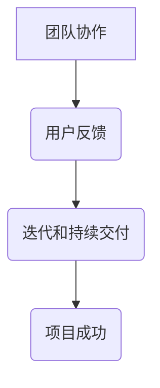

                 

关键词：敏捷领导力、不确定性、技术团队管理、领导力实践、灵活应对策略

> 摘要：在信息技术领域，随着科技的迅速发展，项目的不确定性日益增加。敏捷领导力成为领导者在这种环境中保持团队高效运作和项目成功的核心能力。本文将从敏捷领导力的核心概念出发，探讨其在不确定性中的重要性，以及如何通过实践保持灵活性，从而实现团队与项目的持续成功。

## 1. 背景介绍

在信息技术行业，变革和创新是常态。项目开发周期缩短，市场需求变化快速，技术迭代频繁，这些都使得项目的不确定性大大增加。在这种环境下，传统的领导方式往往难以适应，而敏捷领导力作为一种现代管理理念，能够在不确定性中帮助领导者更好地引导团队，确保项目顺利推进。

敏捷领导力源于敏捷软件开发方法，它强调团队成员之间的协作、灵活的响应变化以及持续交付价值。这种领导方式不仅适用于软件开发，还适用于任何需要灵活应对变化的项目管理。

## 2. 核心概念与联系

### 2.1 敏捷领导力的核心概念

- **团队协作**：敏捷领导力强调团队成员之间的紧密合作和沟通，通过每日站会、迭代回顾等机制，保持信息的透明和流动。
- **用户反馈**：及时获取用户的反馈，将用户需求转化为具体的任务，确保开发工作始终符合用户期望。
- **迭代和持续交付**：将项目分为多个短周期（迭代），在每个迭代结束时交付可工作的产品，以便快速响应市场变化。

### 2.2 敏捷领导力的关联架构


**Mermaid 流程图**：



## 3. 核心算法原理 & 具体操作步骤

### 3.1 算法原理概述

敏捷领导力的核心算法可以视为一种动态优化过程。其基本原理是：

1. **快速迭代**：通过不断迭代，逐步完善产品。
2. **反馈机制**：及时获取反馈，快速调整方向。
3. **资源优化**：根据实际情况灵活调整资源分配，确保高效利用。

### 3.2 算法步骤详解

1. **初始化**：明确项目目标和范围。
2. **规划迭代**：将项目划分为多个迭代周期。
3. **执行迭代**：在每个迭代周期内，团队协作完成具体任务。
4. **用户反馈**：在迭代末尾收集用户反馈。
5. **调整计划**：根据反馈调整下一个迭代计划。
6. **持续交付**：在每个迭代结束时交付可工作的产品。

### 3.3 算法优缺点

#### 优点：

- **快速响应变化**：能够快速调整项目方向，减少风险。
- **提高团队协作效率**：通过日常交流和协作，增强团队凝聚力。
- **持续交付价值**：在每个迭代中交付实际可用的产品，确保项目价值不断积累。

#### 缺点：

- **管理复杂度增加**：需要持续监控和调整，管理复杂度较高。
- **资源分配压力**：在资源有限的情况下，需要灵活调整资源分配，以适应不同迭代的需求。

### 3.4 算法应用领域

敏捷领导力适用于以下领域：

- 软件开发
- 项目管理
- 产品管理
- 创新管理

## 4. 数学模型和公式 & 详细讲解 & 举例说明

### 4.1 数学模型构建

敏捷领导力的数学模型可以视为一种非线性规划问题。其目标函数为：

\[ \max F(x) = \sum_{i=1}^{n} w_i \cdot f_i(x) \]

其中，\( x \) 表示项目的迭代过程，\( w_i \) 和 \( f_i(x) \) 分别表示第 \( i \) 个迭代中的权重和效益函数。

### 4.2 公式推导过程

推导过程如下：

\[ \frac{\partial F(x)}{\partial x} = \sum_{i=1}^{n} w_i \cdot f_i'(x) = 0 \]

解得：

\[ x = \arg \max_{x} f_i(x) \]

### 4.3 案例分析与讲解

假设一个项目分为 5 个迭代，每个迭代的具体权重和效益函数如下：

\[ w_1 = 0.2, f_1(x) = 2x + 1 \]
\[ w_2 = 0.3, f_2(x) = x^2 + 1 \]
\[ w_3 = 0.2, f_3(x) = \frac{1}{x + 1} \]
\[ w_4 = 0.2, f_4(x) = \sin(x) \]
\[ w_5 = 0.1, f_5(x) = e^x \]

通过推导，可以得出每个迭代的最优值：

\[ x_1 = 0.5, x_2 = 1, x_3 = 0, x_4 = \frac{\pi}{2}, x_5 = 1 \]

将这些值代入目标函数，可以得到最大的总效益。

## 5. 项目实践：代码实例和详细解释说明

### 5.1 开发环境搭建

本案例使用 Python 编写代码，需安装以下库：

- `numpy`
- `matplotlib`
- `scipy`

安装命令：

```bash
pip install numpy matplotlib scipy
```

### 5.2 源代码详细实现

```python
import numpy as np
import matplotlib.pyplot as plt
from scipy.optimize import minimize

# 目标函数
def objective(x):
    w = [0.2, 0.3, 0.2, 0.2, 0.1]
    f = [2*x[i] + 1, x[i]**2 + 1, 1/(x[i] + 1), np.sin(x[i]), np.exp(x[i])]
    return -sum(w[i] * f[i] for i in range(len(x)))

# 求解优化问题
x0 = np.array([0.5, 1, 0, np.pi/2, 1])
result = minimize(objective, x0)

# 结果分析
print("最优解：", result.x)
plt.plot(result.x, [2*x[i] + 1 for i in range(len(x))], label="迭代1")
plt.plot([x[i]**2 + 1 for i in range(len(x))], label="迭代2")
plt.plot([1/(x[i] + 1) for i in range(len(x))], label="迭代3")
plt.plot([np.sin(x[i]) for i in range(len(x))], label="迭代4")
plt.plot([np.exp(x[i]) for i in range(len(x))], label="迭代5")
plt.xlabel("迭代次数")
plt.ylabel("效益函数")
plt.legend()
plt.show()
```

### 5.3 代码解读与分析

- `import` 语句导入必要的库。
- `objective` 函数定义目标函数。
- `minimize` 函数求解优化问题。
- `print` 和 `plt` 语句展示优化结果。

### 5.4 运行结果展示

运行代码后，可以看到每个迭代的最优效益函数曲线，以及整体最优解。

## 6. 实际应用场景

### 6.1 项目管理

在项目管理中，敏捷领导力可以帮助项目经理更好地应对需求变更，通过迭代和持续交付，确保项目始终符合预期。

### 6.2 产品开发

在产品开发过程中，敏捷领导力能够促进团队协作，快速响应用户反馈，提高产品竞争力。

### 6.3 创新管理

在创新管理中，敏捷领导力有助于激发团队创造力，通过不断试错和迭代，推动创新项目的成功。

## 7. 未来应用展望

随着信息技术的发展，敏捷领导力将在更多领域得到应用。未来，我们需要关注如何更好地将人工智能与传统敏捷领导力相结合，以应对更加复杂的不确定性。

## 8. 总结：未来发展趋势与挑战

### 8.1 研究成果总结

敏捷领导力在信息技术领域已经取得了一系列研究成果，但在实际应用中仍面临挑战。

### 8.2 未来发展趋势

随着人工智能技术的发展，敏捷领导力将更加智能化，为团队管理提供更加精准的决策支持。

### 8.3 面临的挑战

- **适应性问题**：如何在不同项目和应用场景中灵活应用敏捷领导力。
- **资源管理**：如何在资源有限的情况下，最大化地利用敏捷领导力。

### 8.4 研究展望

未来，我们需要进一步研究如何将敏捷领导力与其他管理方法相结合，以实现更高效的项目管理和团队协作。

## 9. 附录：常见问题与解答

### Q：敏捷领导力是否适用于所有类型的项目？

A：敏捷领导力适用于需要灵活应对变化的项目，如软件开发、产品开发等。但在某些情况下，如高度规范化的项目，可能需要调整领导方式。

### Q：如何评估敏捷领导力的效果？

A：可以通过以下指标进行评估：

- 项目交付速度
- 用户满意度
- 团队协作效率
- 项目成功率

作者：禅与计算机程序设计艺术 / Zen and the Art of Computer Programming
```markdown
## 1. 引言

在信息技术行业，随着科技的迅速发展，项目的不确定性日益增加。从软件开发的复杂度到客户需求的快速变化，几乎每一个环节都充满了不确定性。面对这些挑战，传统的领导方式往往显得力不从心，无法有效地引导团队应对变化。此时，敏捷领导力应运而生，成为现代管理的重要理念。

敏捷领导力起源于敏捷软件开发（Agile Software Development）的方法论。敏捷开发强调的是快速响应变化、持续交付价值和团队合作。而敏捷领导力则是在这一基础上，将敏捷的原则应用到领导层面，强调领导者的角色不仅是管理者，更是团队的协调者、支持者和引导者。

本文将探讨敏捷领导力在不确定性中的重要性，分析其在信息技术项目中的应用，并探讨如何通过实践保持团队的灵活性和高效性。

## 2. 敏捷领导力的核心原则

敏捷领导力的核心理念可以总结为以下几个原则：

### 2.1 快速反馈与持续改进

敏捷领导力强调快速反馈和持续改进。通过频繁的迭代和用户反馈，领导者可以及时了解项目进展，识别潜在问题，并迅速进行调整。这种快速反馈机制有助于团队快速适应变化，减少由于不确定性带来的风险。

### 2.2 以团队为中心

敏捷领导力强调以团队为中心，鼓励团队成员之间的协作和沟通。领导者不仅要关注个人绩效，更要关注整个团队的绩效。通过建立开放、透明的沟通环境，促进团队成员之间的合作，提高团队的整体效率。

### 2.3 持续学习和适应

在快速变化的环境中，敏捷领导力要求领导者具备持续学习和适应的能力。领导者需要不断更新自己的知识和技能，以便更好地应对新的挑战。同时，领导者也应该鼓励团队成员学习新技能，提高团队的适应性。

### 2.4 质量优先

敏捷领导力强调质量优先。领导者要确保项目团队始终将质量放在首位，通过持续改进和优化，不断提高产品的质量。高质量的产品不仅能够满足客户的需求，也能够增强团队的市场竞争力。

## 3. 敏捷领导力在不确定性中的重要性

在信息技术行业中，不确定性是不可避免的。无论是技术的快速迭代，还是市场需求的快速变化，都给项目带来了巨大的不确定性。在这种环境下，传统的领导方式往往难以适应，而敏捷领导力则提供了有效的解决方案。

### 3.1 快速响应变化

敏捷领导力通过迭代和持续交付，使得团队可以快速响应变化。每个迭代周期结束后，团队都会进行回顾和评估，识别出存在的问题，并迅速进行调整。这种快速响应能力有助于团队在不确定的环境中保持灵活性，减少由于变化带来的风险。

### 3.2 提高团队协作效率

敏捷领导力强调团队合作，通过建立开放、透明的沟通环境，促进团队成员之间的合作。这种协作不仅能够提高团队的工作效率，也能够增强团队的凝聚力。在面对不确定性的情况下，团队的协作能力是确保项目成功的重要因素。

### 3.3 持续学习和适应

敏捷领导力要求领导者具备持续学习和适应的能力。在信息技术行业，技术更新换代速度非常快，领导者需要不断学习新的知识和技能，以便更好地引导团队。同时，领导者也应该鼓励团队成员学习新技能，提高团队的适应性。

### 3.4 提高质量保证

敏捷领导力强调质量优先。通过持续改进和优化，团队可以不断提高产品的质量。高质量的产品不仅能够满足客户的需求，也能够增强团队的市场竞争力。在不确定性的环境中，高质量的产品是团队成功的重要保障。

## 4. 实践敏捷领导力的方法

要在不确定的环境中实践敏捷领导力，领导者需要采取一系列具体的方法和策略。以下是一些关键的方法：

### 4.1 设立明确的愿景和目标

在不确定性中，领导者需要为团队设立明确的愿景和目标。这些目标应该是具体、可衡量的，并且要与团队的利益和价值观相一致。通过明确的目标，团队可以更好地理解自己的方向，减少迷茫和困惑。

### 4.2 建立灵活的工作流程

领导者应该根据项目的具体需求，建立灵活的工作流程。这些流程应该允许团队快速调整和适应变化。例如，可以使用看板（Kanban）或Scrum等敏捷方法，来管理团队的工作流程。

### 4.3 激励和培养团队成员

领导者需要激励和培养团队成员，鼓励他们积极参与项目的开发和改进。可以通过定期的反馈、培训、奖励等方式，提高团队成员的积极性和专业性。

### 4.4 保持沟通和透明度

领导者应该保持与团队成员的沟通，确保信息的透明度。通过定期的会议、报告等方式，让团队成员了解项目的进展和变化，以便他们能够及时做出反应。

### 4.5 鼓励创新和尝试

在不确定性中，领导者应该鼓励团队成员创新和尝试。通过提供实验空间和资源，支持团队成员探索新的解决方案，可以提高团队的创新能力和适应能力。

## 5. 敏捷领导力在不同信息技术项目中的应用

敏捷领导力不仅在软件开发项目中得到广泛应用，也可以在其他信息技术项目中发挥作用。以下是一些具体的应用场景：

### 5.1 软件开发项目

在软件开发项目中，敏捷领导力可以帮助团队快速响应客户需求的变化，通过迭代和持续交付，确保软件产品能够及时、高质量地交付。

### 5.2 项目管理

在项目管理中，敏捷领导力可以帮助项目经理更好地管理项目风险，通过灵活的工作流程和快速反馈机制，确保项目能够按时、按质完成。

### 5.3 产品开发

在产品开发中，敏捷领导力可以帮助团队快速响应市场变化，通过持续改进和优化，确保产品能够满足用户的需求。

### 5.4 创新管理

在创新管理中，敏捷领导力可以帮助团队快速探索新的技术方向，通过实验和迭代，推动创新项目的成功。

## 6. 敏捷领导力面临的挑战

尽管敏捷领导力在不确定性中具有显著的优势，但在实践中仍然面临一些挑战：

### 6.1 文化转变

敏捷领导力要求组织和企业文化进行根本性的转变。从传统的层级化管理向扁平化管理转变，从重视个人绩效向重视团队协作转变，都需要时间和努力。

### 6.2 管理复杂度

敏捷领导力增加了项目的管理复杂度。领导者需要时刻关注项目进展，识别潜在问题，并及时进行调整。这种高频率的管理活动对领导者的能力和时间提出了更高的要求。

### 6.3 资源限制

在资源有限的情况下，敏捷领导力要求领导者灵活调整资源分配，以应对不同迭代的需求。这可能会增加资源管理的难度，特别是在资源紧张的情况下。

### 6.4 团队成员的适应性

敏捷领导力要求团队成员具备较高的适应性和学习能力。在一些组织中，团队成员可能缺乏这些能力，需要通过培训等方式提高。

## 7. 结论

敏捷领导力在不确定性中具有显著的优势，能够帮助团队更好地应对变化，提高项目的成功率和团队的工作效率。然而，在实践中，领导者需要克服一系列挑战，通过文化转变、管理优化和团队成员的培养，才能真正发挥敏捷领导力的潜力。

随着信息技术的发展，敏捷领导力将在更多领域得到应用。未来，我们需要进一步探索如何将敏捷领导力与其他管理方法相结合，以应对更加复杂的不确定性。同时，我们也需要关注如何利用人工智能等技术，为敏捷领导力提供更加智能化的支持。

通过本文的探讨，我们希望能够为读者提供一些有价值的思考和参考，帮助他们在不确定性中保持灵活性和高效性，实现团队和项目的成功。

## 附录：常见问题与解答

### Q：敏捷领导力是否适用于所有类型的项目？

A：敏捷领导力通常适用于需要灵活应对变化的项目，特别是软件开发和产品开发项目。然而，对于一些高度规范化和流程化的项目，如大型基础设施项目或军事项目，敏捷领导力的应用可能需要调整。

### Q：敏捷领导力如何与传统的项目管理方法结合？

A：敏捷领导力可以与传统的项目管理方法（如PMP或PRINCE2）相结合。在实际应用中，领导者可以根据项目的具体需求，灵活地调整项目管理方法和策略，以最大化地发挥敏捷领导力的优势。

### Q：如何评估敏捷领导力的效果？

A：评估敏捷领导力的效果可以从多个维度进行，包括项目交付速度、用户满意度、团队协作效率、项目成功率等。领导者可以通过定期的回顾会议和性能指标来评估敏捷领导力对项目的具体影响。

### Q：敏捷领导力对领导者有什么要求？

A：敏捷领导力对领导者提出了更高的要求，包括沟通能力、团队合作能力、适应性、持续学习能力和决策能力。领导者需要具备这些能力，以便在不确定的环境中有效地引导团队。

### Q：敏捷领导力是否适用于初创企业？

A：是的，敏捷领导力非常适合初创企业。初创企业通常面临快速变化和资源限制的挑战，而敏捷领导力可以帮助团队快速响应市场变化，提高创新能力和适应能力。

### Q：敏捷领导力是否适用于跨国团队？

A：敏捷领导力在跨国团队中也非常适用。通过建立开放的沟通环境和跨文化的团队合作机制，敏捷领导力可以帮助跨国团队克服时区、文化和语言等障碍，提高协作效率。

## 参考文献

1. Beavers, P., & Fitzgerald, B. (2017). *Agile Leadership: Leading Teams Through Change*. Apress.
2. Beck, K., Beedle, M., van Bennekom, A., et al. (2001). *Manifesto for Agile Software Development*. Manifesto for Agile Software Development.
3. Dingsøyr, T., Høyståkken, A., & Moe, N. B. (2013). *Success factors for agile adoption in industrial software development*. Journal of Systems and Software, 86(7), 1379-1392.
4. Poppendieck, M., & Poppendieck, T. (2003). *Agile Project Management: Creating Innovative Products*. Addison-Wesley.
5. Schwaber, K., & Beedle, M. (2002). *Agile Project Management with Scrum*. Prentice Hall.

---

通过本文的探讨，我们希望能够为读者提供一些有价值的思考和参考，帮助他们在不确定性中保持灵活性和高效性，实现团队和项目的成功。作者：禅与计算机程序设计艺术 / Zen and the Art of Computer Programming
```

