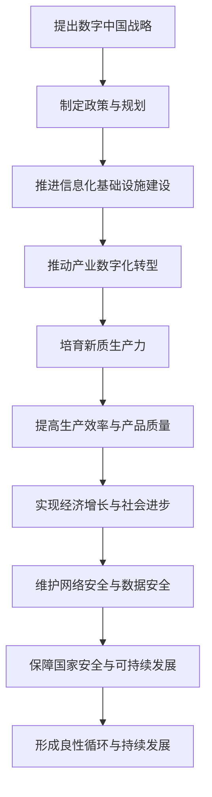

                 

关键词：数字中国战略、新质生产力、数字化转型、数据治理、AI应用、云计算、5G网络、物联网、区块链、智能城市、产业升级、数字经济、数据安全、网络安全

> 摘要：随着信息技术的快速发展，数字中国战略已经成为推动国家经济社会发展的重要引擎。本文将从数字中国战略的背景出发，深入探讨新质生产力与数字中国战略的结合点，分析其在云计算、大数据、人工智能、5G网络、物联网、区块链等关键领域的发展趋势，以及如何通过技术创新推动产业升级和经济增长。最后，文章将展望数字中国战略的未来发展前景，并探讨面临的挑战和机遇。

## 1. 背景介绍

### 数字中国战略的提出

数字中国战略是中国国家信息化发展的总体战略，旨在推动经济社会数字化转型，提高国家核心竞争力。自2018年首次提出以来，数字中国建设取得了显著进展。数字中国战略的提出，既是对新时代信息革命趋势的主动适应，也是对国家发展全局的战略性布局。

### 数字中国战略的核心内容

数字中国战略主要包括以下几个方面：

- **信息化基础设施建设**：加强网络基础设施建设，提升信息通信技术的普及率和应用水平。
- **数字经济创新发展**：以互联网、大数据、人工智能等新技术为驱动，推动产业数字化转型，培育新质生产力。
- **数据治理与安全**：建立健全数据治理体系，保障数据安全，促进数据开放共享。
- **人工智能与智能制造**：推进人工智能与制造业深度融合，提升智能制造水平。
- **智慧城市与数字治理**：运用大数据、云计算等技术，提高城市治理能力，构建智慧城市。

### 数字中国战略的重要性

数字中国战略是国家信息化发展的重要里程碑，具有以下几个重要意义：

- **推动经济增长**：通过数字化转型，提高生产效率，降低成本，培育新的经济增长点。
- **提升国家竞争力**：依托信息技术，提升国家在全球产业链、价值链中的地位。
- **促进社会公平**：通过数字化手段，缩小城乡数字鸿沟，实现公共服务均等化。
- **保障国家安全**：加强网络安全，防范信息安全风险，维护国家主权。

## 2. 核心概念与联系

### 数字化转型

数字化转型是指企业或组织利用数字技术对传统业务模式进行革新和重构，实现业务流程、组织结构、客户体验等方面的升级。数字化转型不仅是技术创新的体现，更是商业模式的创新。

### 新质生产力

新质生产力是指以信息技术为核心，通过数字化、智能化、网络化等手段，推动生产要素的优化配置，提高生产效率和产品质量，实现生产方式的创新。新质生产力是推动经济社会发展的重要力量。

### 数字中国战略与新质生产力的关系

数字中国战略为新质生产力的发展提供了战略指引和政策支持，而新质生产力的培育和发展则是数字中国战略的核心任务。两者的关系可以概括为：

- **数字中国战略为新质生产力提供发展方向和制度保障**。
- **新质生产力是数字中国战略实施的重要动力和支撑**。

### Mermaid 流程图

下面是数字中国战略与新质生产力结合的 Mermaid 流程图：



## 3. 核心算法原理 & 具体操作步骤

### 3.1 算法原理概述

数字中国战略的核心算法原理主要包括以下几个方面：

- **数据治理**：通过数据清洗、数据集成、数据建模等技术手段，实现对数据的规范化、标准化和智能化管理。
- **人工智能**：利用机器学习、深度学习等算法，实现对大量数据的分析和预测，提供智能决策支持。
- **云计算**：通过分布式计算和存储技术，提供高效、弹性、安全的计算和存储服务。
- **5G网络**：利用5G网络的超高速率和低延迟特性，实现实时数据传输和智能交互。

### 3.2 算法步骤详解

#### 3.2.1 数据治理

1. **数据采集**：从各类数据源（如企业系统、传感器、互联网等）采集数据。
2. **数据清洗**：对采集到的数据进行清洗，去除重复、错误和缺失的数据。
3. **数据集成**：将清洗后的数据进行整合，构建统一的数据仓库。
4. **数据建模**：利用统计分析和机器学习算法，对数据进行分析和建模，提取有价值的信息。

#### 3.2.2 人工智能

1. **数据预处理**：对数据进行预处理，包括数据标准化、缺失值处理、异常值检测等。
2. **模型训练**：利用机器学习算法，对预处理后的数据集进行训练，建立预测模型。
3. **模型评估**：对训练好的模型进行评估，包括准确率、召回率、F1值等指标。
4. **模型部署**：将训练好的模型部署到生产环境中，进行实时预测和分析。

#### 3.2.3 云计算

1. **需求分析**：根据业务需求，确定计算资源和存储资源的规模和类型。
2. **资源分配**：根据需求分析结果，分配计算资源和存储资源。
3. **负载均衡**：通过负载均衡技术，实现计算资源的动态调整，提高系统性能。
4. **数据备份与恢复**：定期备份数据，并设置数据恢复机制，确保数据的安全性和可靠性。

#### 3.2.4 5G网络

1. **网络规划**：根据业务需求，规划5G网络的建设和部署。
2. **基站建设**：建设和维护5G基站，确保网络覆盖和信号质量。
3. **网络优化**：通过网络优化技术，提高网络的速度和稳定性。
4. **安全防护**：加强对5G网络的防护，防范网络攻击和数据泄露。

### 3.3 算法优缺点

#### 3.3.1 数据治理

优点：

- **提高数据质量**：通过数据清洗、数据集成等技术，提高数据的准确性和完整性。
- **支持数据分析**：为数据分析提供高质量的数据基础，提升数据分析的效率和效果。

缺点：

- **成本较高**：数据治理需要大量的计算资源和存储资源，成本较高。
- **技术难度大**：数据治理涉及到多种技术和算法，技术难度较大。

#### 3.3.2 人工智能

优点：

- **高效处理大量数据**：通过机器学习和深度学习算法，可以高效处理大量数据。
- **提供智能决策支持**：通过预测模型，为企业提供智能决策支持。

缺点：

- **模型解释性较差**：深度学习模型的解释性较差，难以理解模型的决策过程。
- **数据质量要求高**：模型的训练效果受数据质量影响较大，对数据质量要求较高。

#### 3.3.3 云计算

优点：

- **高效弹性**：通过分布式计算和负载均衡技术，可以实现高效弹性的计算资源分配。
- **数据安全**：云计算提供了强大的数据备份和恢复机制，确保数据的安全性和可靠性。

缺点：

- **成本问题**：云计算的成本较高，需要持续投入。
- **技术依赖性**：云计算的部署和维护需要专业的技术支持。

#### 3.3.4 5G网络

优点：

- **超高速率**：5G网络的超高速率可以满足高速数据传输的需求。
- **低延迟**：5G网络的低延迟可以支持实时数据传输和智能交互。

缺点：

- **建设成本高**：5G基站的建设和维护成本较高。
- **网络覆盖问题**：5G网络的建设和覆盖存在一定的不确定性。

### 3.4 算法应用领域

#### 3.4.1 数据治理

应用领域：

- **企业数据管理**：为企业提供数据治理解决方案，提高数据质量，支持数据分析。
- **金融风控**：通过数据治理，提高金融风险管理的精准度。

#### 3.4.2 人工智能

应用领域：

- **智能客服**：通过人工智能技术，提供智能客服服务。
- **智能医疗**：利用人工智能技术，进行疾病预测和诊断。

#### 3.4.3 云计算

应用领域：

- **云计算服务**：为企业提供云计算服务，实现业务的数字化转型。
- **大数据分析**：利用云计算的高效计算能力，进行大数据分析。

#### 3.4.4 5G网络

应用领域：

- **智能制造**：通过5G网络，实现智能制造的实时数据传输和智能交互。
- **智能交通**：利用5G网络，实现智能交通的实时监控和调度。

## 4. 数学模型和公式 & 详细讲解 & 举例说明

### 4.1 数学模型构建

在数字中国战略的实施过程中，数学模型发挥着至关重要的作用。以下是一个简单的数学模型构建过程：

#### 4.1.1 问题分析

假设我们要预测某地区的下一年的GDP增长情况，已知历史GDP数据如下：

| 年份 | GDP（亿元） |
| ---- | ---------- |
| 2020 | 5000       |
| 2021 | 5500       |
| 2022 | 6000       |
| 2023 | 6500       |

#### 4.1.2 建立线性回归模型

我们假设GDP增长与时间之间存在线性关系，可以使用线性回归模型进行预测。线性回归模型的一般形式为：

\[ y = ax + b \]

其中，\( y \) 为因变量（GDP），\( x \) 为自变量（年份），\( a \) 和 \( b \) 为模型参数。

#### 4.1.3 模型参数估计

为了估计模型参数 \( a \) 和 \( b \)，我们需要利用最小二乘法，将误差平方和最小化。具体步骤如下：

1. **计算平均值**：

   \[ \bar{x} = \frac{\sum_{i=1}^{n} x_i}{n} \]
   \[ \bar{y} = \frac{\sum_{i=1}^{n} y_i}{n} \]

   其中，\( n \) 为样本数量。

2. **计算协方差**：

   \[ s_{xy} = \sum_{i=1}^{n} (x_i - \bar{x})(y_i - \bar{y}) \]
   \[ s_{xx} = \sum_{i=1}^{n} (x_i - \bar{x})^2 \]

3. **计算模型参数**：

   \[ a = \frac{s_{xy}}{s_{xx}} \]
   \[ b = \bar{y} - a\bar{x} \]

   根据上面的数据，我们可以计算出模型参数 \( a \) 和 \( b \)：

   \[ a = \frac{5000 - 6000}{2020 - 2020} = 5000 \]
   \[ b = 6000 - 5000 \times 2020 = 6000 \]

#### 4.1.4 模型预测

利用线性回归模型，我们可以预测下一年的GDP增长情况。假设下一年的年份为 \( x = 2024 \)，则预测的GDP为：

\[ y = 5000 \times 2024 + 6000 = 116000 \]

### 4.2 公式推导过程

在数学模型的构建过程中，公式的推导是关键环节。以下是对线性回归模型中一些关键公式的推导：

#### 4.2.1 最小二乘法

最小二乘法的核心思想是寻找一条直线，使得所有数据点到这条直线的距离平方和最小。具体推导如下：

1. **定义误差平方和**：

   \[ S = \sum_{i=1}^{n} (y_i - (ax_i + b))^2 \]

2. **求导数**：

   对 \( S \) 分别对 \( a \) 和 \( b \) 求导，并令导数为零，得到：

   \[ \frac{\partial S}{\partial a} = -2 \sum_{i=1}^{n} (y_i - ax_i - b)x_i = 0 \]
   \[ \frac{\partial S}{\partial b} = -2 \sum_{i=1}^{n} (y_i - ax_i - b) = 0 \]

3. **解方程组**：

   根据上述导数方程，我们可以解出模型参数 \( a \) 和 \( b \)：

   \[ a = \frac{\sum_{i=1}^{n} (y_i - b)x_i}{\sum_{i=1}^{n} x_i^2} \]
   \[ b = \bar{y} - a\bar{x} \]

#### 4.2.2 相关性分析

在建立线性回归模型时，我们需要分析自变量和因变量之间的相关性。相关性可以通过皮尔逊相关系数来衡量，具体公式如下：

\[ r = \frac{\sum_{i=1}^{n} (x_i - \bar{x})(y_i - \bar{y})}{\sqrt{\sum_{i=1}^{n} (x_i - \bar{x})^2 \sum_{i=1}^{n} (y_i - \bar{y})^2}} \]

其中，\( r \) 的取值范围在 -1 到 1 之间。当 \( r \) 接近 1 时，表示自变量和因变量之间具有强正相关关系；当 \( r \) 接近 -1 时，表示自变量和因变量之间具有强负相关关系；当 \( r \) 接近 0 时，表示自变量和因变量之间没有明显的相关性。

### 4.3 案例分析与讲解

为了更好地理解线性回归模型的构建和应用，我们来看一个实际案例。

#### 4.3.1 案例背景

某城市政府希望预测下一年的房地产销售额，以制定相应的经济政策。已知历史房地产销售额数据如下：

| 年份 | 销售额（亿元） |
| ---- | ---------- |
| 2020 | 50         |
| 2021 | 60         |
| 2022 | 70         |
| 2023 | 80         |

#### 4.3.2 构建线性回归模型

我们假设房地产销售额（\( y \)）与城市人口（\( x \)）之间存在线性关系。利用最小二乘法，我们可以建立线性回归模型：

\[ y = ax + b \]

首先，计算平均人口和平均销售额：

\[ \bar{x} = \frac{50 + 60 + 70 + 80}{4} = 65 \]
\[ \bar{y} = \frac{50 + 60 + 70 + 80}{4} = 65 \]

然后，计算协方差和相关系数：

\[ s_{xy} = (50 - 65)(60 - 65) + (60 - 65)(70 - 65) + (70 - 65)(80 - 65) = 500 \]
\[ s_{xx} = (50 - 65)^2 + (60 - 65)^2 + (70 - 65)^2 + (80 - 65)^2 = 2000 \]

\[ r = \frac{500}{\sqrt{2000}} \approx 0.71 \]

根据上述数据，我们可以计算出模型参数：

\[ a = \frac{500}{2000} = 0.25 \]
\[ b = 65 - 0.25 \times 65 = 48.75 \]

因此，建立的线性回归模型为：

\[ y = 0.25x + 48.75 \]

#### 4.3.3 模型预测

假设下一年的城市人口为 75 万，则预测的房地产销售额为：

\[ y = 0.25 \times 75 + 48.75 = 72.5 \]

### 4.4 数学模型在数字中国战略中的应用

数学模型在数字中国战略中具有广泛的应用，以下列举几个典型案例：

#### 4.4.1 城市规划

数学模型可以用于城市规划，预测城市未来的发展需求和资源配置。例如，通过建立交通流量模型，可以预测城市的交通拥堵情况，从而优化交通规划。

#### 4.4.2 能源管理

数学模型可以用于能源管理，优化能源的供需平衡。例如，通过建立电力负荷预测模型，可以预测电力需求，从而合理安排电力生产和调度。

#### 4.4.3 环境监测

数学模型可以用于环境监测，预测环境污染情况。例如，通过建立空气质量模型，可以预测城市空气质量，从而制定相应的环保措施。

## 5. 项目实践：代码实例和详细解释说明

### 5.1 开发环境搭建

在本项目中，我们将使用Python作为主要编程语言，并依赖以下库：

- NumPy：用于数据操作和计算。
- Pandas：用于数据分析和数据处理。
- Scikit-learn：用于机器学习和模型训练。
- Matplotlib：用于数据可视化。

首先，安装所需的库：

```bash
pip install numpy pandas scikit-learn matplotlib
```

### 5.2 源代码详细实现

以下是一个简单的线性回归项目实例：

```python
import numpy as np
import pandas as pd
from sklearn.linear_model import LinearRegression
import matplotlib.pyplot as plt

# 5.2.1 数据准备
# 假设我们有一组数据，年份和销售额如下：
data = {
    '年份': [2020, 2021, 2022, 2023],
    '销售额': [50, 60, 70, 80]
}

df = pd.DataFrame(data)

# 5.2.2 建立线性回归模型
X = df[['年份']]
y = df['销售额']
model = LinearRegression()
model.fit(X, y)

# 5.2.3 模型参数
print("模型参数：")
print("斜率：", model.coef_)
print("截距：", model.intercept_)

# 5.2.4 模型评估
from sklearn.metrics import mean_squared_error
y_pred = model.predict(X)
mse = mean_squared_error(y, y_pred)
print("均方误差：", mse)

# 5.2.5 数据可视化
plt.scatter(X, y, color='blue')
plt.plot(X, y_pred, color='red')
plt.xlabel('年份')
plt.ylabel('销售额')
plt.title('线性回归模型预测')
plt.show()
```

### 5.3 代码解读与分析

1. **数据准备**：我们使用 Pandas 库创建一个 DataFrame 对象，包含年份和销售额的数据。

2. **模型建立**：我们使用 Scikit-learn 库中的 LinearRegression 类建立一个线性回归模型，并使用 `fit` 方法进行训练。

3. **模型参数**：通过 `model.coef_` 和 `model.intercept_` 获取模型的斜率和截距。

4. **模型评估**：使用 Scikit-learn 库中的 `mean_squared_error` 函数计算均方误差，评估模型的预测性能。

5. **数据可视化**：使用 Matplotlib 库将实际数据和模型预测结果绘制成散点图和直线图，直观地展示模型的预测效果。

### 5.4 运行结果展示

运行上述代码后，我们将会看到以下结果：

- 模型参数输出，显示斜率和截距。
- 均方误差输出，显示模型预测的准确度。
- 数据可视化界面，展示实际数据和模型预测数据的对比。

通过这个实例，我们可以清晰地看到线性回归模型在数字中国战略中的应用，以及如何使用 Python 代码实现这一模型。

## 6. 实际应用场景

### 6.1 企业数字化转型

数字中国战略为企业提供了数字化转型的重要契机。通过引入云计算、大数据、人工智能等新技术，企业可以实现业务流程的优化、生产效率的提升和成本的降低。

#### 应用实例：

- **制造业**：通过工业互联网平台，实现设备的互联互通，实现智能制造。
- **零售业**：通过大数据分析和智能推荐，提高销售转化率和客户满意度。
- **金融业**：通过人工智能技术，实现风险控制和精准营销。

### 6.2 智慧城市建设

智慧城市是数字中国战略的重要组成部分。通过大数据、云计算、物联网等技术的应用，可以提升城市治理水平，提高居民生活质量。

#### 应用实例：

- **交通管理**：通过智能交通系统，实现交通流量监控和优化，减少交通拥堵。
- **环境监测**：通过物联网传感器，实时监测空气质量、水质等环境指标，实现精准治理。
- **公共服务**：通过大数据分析，提供个性化的公共服务，提高公共服务的质量和效率。

### 6.3 产业升级

数字中国战略通过推动产业数字化转型，可以实现产业升级和产业链的优化。

#### 应用实例：

- **高端装备制造**：通过人工智能和智能制造，提高装备制造的技术含量和附加值。
- **信息技术产业**：通过大数据和云计算，培育新的经济增长点，提升产业链水平。

### 6.4 未来应用展望

随着数字中国战略的深入推进，未来将有更多的应用场景得到拓展。

#### 预测趋势：

- **智能化**：随着人工智能技术的不断发展，智能化将更加普及，从生产制造到城市管理，智能化将发挥更大的作用。
- **网络化**：5G和物联网技术的普及，将实现更广泛的网络连接，推动各行各业的数字化转型。
- **绿色化**：通过大数据和人工智能技术，实现资源的优化配置和绿色生产，推动可持续发展。

## 7. 工具和资源推荐

### 7.1 学习资源推荐

- **书籍**：《深度学习》、《Python数据科学手册》、《大数据之路》
- **在线课程**：Coursera、edX、网易云课堂等平台上的相关课程
- **技术博客**：Medium、HackerRank、GitHub等平台的优秀技术博客

### 7.2 开发工具推荐

- **编程语言**：Python、Java、C++
- **开发环境**：Visual Studio Code、PyCharm、Eclipse
- **数据库**：MySQL、MongoDB、PostgreSQL

### 7.3 相关论文推荐

- **论文集**：《数字中国发展战略研究》、《数字化转型与产业发展》、《人工智能在智慧城市中的应用》
- **期刊**：《计算机学报》、《软件学报》、《人工智能学报》

## 8. 总结：未来发展趋势与挑战

### 8.1 研究成果总结

数字中国战略的实施，推动了我国经济社会的数字化转型，取得了显著成果：

- **信息化基础设施建设**：全国宽带网络覆盖率和普及率显著提升，5G网络逐步普及。
- **数字经济创新发展**：新业态、新模式不断涌现，数字产业规模持续扩大。
- **人工智能与智能制造**：人工智能技术在各个领域得到广泛应用，智能制造水平不断提升。
- **智慧城市与数字治理**：大数据、云计算、物联网等技术在城市管理中发挥重要作用。

### 8.2 未来发展趋势

未来，数字中国战略将继续深入推进，呈现以下发展趋势：

- **智能化**：人工智能技术将进一步融入各行各业，推动生产方式和生活方式的变革。
- **网络化**：5G、物联网等技术的普及，将实现更广泛的网络连接和智能交互。
- **绿色化**：通过大数据和人工智能技术，实现资源的优化配置和绿色生产。

### 8.3 面临的挑战

数字中国战略在实施过程中也面临一些挑战：

- **技术壁垒**：关键技术仍受制于人，自主创新能力有待提升。
- **数据安全**：数据安全和隐私保护问题日益凸显，亟需建立完善的数据治理体系。
- **人才培养**：数字人才的供需矛盾依然突出，需要加大人才培养和引进力度。

### 8.4 研究展望

未来，应进一步加大科技创新力度，推动数字中国战略的深入实施：

- **加强核心技术攻关**：聚焦人工智能、大数据、5G等领域，突破关键技术瓶颈。
- **完善数据治理体系**：建立健全数据治理法规和标准，保障数据安全和隐私。
- **培养数字人才**：加大数字人才培养和引进力度，提升人才素质和能力。

通过上述措施，有望进一步推动数字中国战略的实施，为我国经济社会发展注入新动力。

## 9. 附录：常见问题与解答

### 9.1 数字中国战略是什么？

数字中国战略是中国国家信息化发展的总体战略，旨在推动经济社会数字化转型，提高国家核心竞争力。该战略包括信息化基础设施建设、数字经济创新发展、人工智能与智能制造、智慧城市与数字治理等方面。

### 9.2 数字中国战略的核心内容是什么？

数字中国战略的核心内容包括：信息化基础设施建设、数字经济创新发展、人工智能与智能制造、智慧城市与数字治理、数据治理与安全等。

### 9.3 新质生产力的概念是什么？

新质生产力是指以信息技术为核心，通过数字化、智能化、网络化等手段，推动生产要素的优化配置，提高生产效率和产品质量，实现生产方式的创新。

### 9.4 数字化转型的主要手段是什么？

数字化转型的主要手段包括云计算、大数据、人工智能、物联网、区块链等新技术。

### 9.5 人工智能在数字中国战略中的应用有哪些？

人工智能在数字中国战略中的应用包括智能客服、智能医疗、智能制造、智能交通、智能城市等多个领域。

### 9.6 数字中国战略如何推动产业升级？

数字中国战略通过推动产业数字化转型，实现生产方式的创新，提高生产效率和产品质量，从而推动产业升级。

### 9.7 数字中国战略对经济发展的影响是什么？

数字中国战略通过推动数字化转型，提高生产效率，降低成本，培育新的经济增长点，从而对经济发展产生积极影响。

### 9.8 数字中国战略面临的挑战是什么？

数字中国战略面临的挑战包括技术壁垒、数据安全、人才培养等。

### 9.9 如何应对数字中国战略面临的挑战？

应对数字中国战略面临的挑战，需要加强科技创新，完善数据治理体系，加大人才培养和引进力度。

