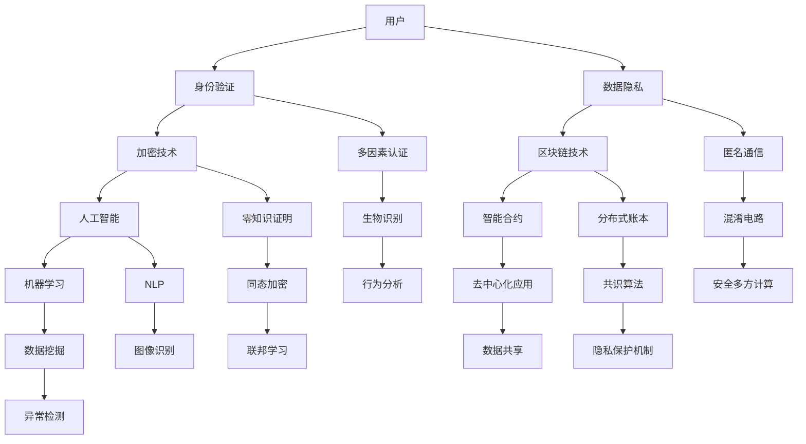

                 

关键词：数字化人格权、元宇宙、身份保护、隐私、人工智能、加密技术、区块链

> 摘要：随着元宇宙的兴起，数字化人格权成为了人们关注的焦点。本文旨在探讨元宇宙中身份保护与隐私的重要性，以及如何利用人工智能、加密技术和区块链等现代技术手段来实现数字化人格权的保护。

## 1. 背景介绍

随着互联网技术的快速发展，人类社会正逐步迈向数字化的未来。元宇宙（Metaverse）作为下一代互联网的重要形态，被认为是人类数字化生活的核心场景。在元宇宙中，人们通过数字化身份进行社交、娱乐、工作等活动。然而，这种高度数字化的生活方式也带来了新的隐私和身份保护问题。

数字化人格权指的是个体在数字世界中拥有的独立、完整、自主的个人信息和身份。随着元宇宙的兴起，数字化人格权的重要性日益凸显。如何在元宇宙中保护个人的身份和隐私，成为了一个亟待解决的问题。

### 1.1 元宇宙的概念

元宇宙是一个虚拟的、三维的、沉浸式的数字世界，它通过互联网连接各种虚拟现实（VR）、增强现实（AR）设备，为用户提供一个全新的互动体验。元宇宙不仅仅是一个虚拟世界，它还包括了社交、经济、文化等多个层面，具有极高的交互性和沉浸感。

### 1.2 数字化人格权的定义

数字化人格权是指个体在数字世界中拥有的独立、完整、自主的个人信息和身份。这包括了个人的身份验证、隐私保护、数据安全等多个方面。数字化人格权的保护，是元宇宙健康发展的重要保障。

## 2. 核心概念与联系

在元宇宙中，身份保护与隐私问题涉及到多个核心概念和技术。为了更好地理解这些问题，我们将使用Mermaid流程图来展示这些概念之间的联系。



### 2.1 核心概念解释

- **身份验证**：确保用户身份的真实性和唯一性。
- **数据隐私**：保护用户数据的机密性、完整性和可用性。
- **加密技术**：通过加密算法保护数据的隐私和安全。
- **区块链技术**：去中心化的分布式账本，提供透明的数据记录和不可篡改性。
- **人工智能**：通过机器学习、数据挖掘等技术实现智能化的身份识别和隐私保护。
- **智能合约**：自动执行合同条款的计算机程序，确保交易的透明和公正。
- **多因素认证**：结合多种认证手段，提高身份验证的安全性。
- **匿名通信**：保护通信内容的隐私性，防止通信双方被追踪。
- **零知识证明**：证明某个陈述为真，而不泄露任何其他信息。
- **分布式账本**：记录交易数据，确保数据的透明和不可篡改性。
- **机器学习**：通过训练模型，提高身份验证和隐私保护的准确性。
- **数据挖掘**：从大量数据中提取有价值的信息。
- **异常检测**：识别和预警异常行为，防止隐私泄露。
- **生物识别**：通过生物特征识别身份。
- **混淆电路**：保护计算过程中的隐私。
- **同态加密**：在加密数据上进行计算，而不需要解密。
- **共识算法**：确保分布式网络中的节点达成一致。
- **隐私保护机制**：综合多种技术手段，保护用户的隐私。
- **去中心化应用**：在去中心化网络中运行的应用程序。
- **图像识别**：通过图像数据识别物体和场景。
- **数据共享**：在确保隐私的前提下，共享有价值的数据。
- **行为分析**：通过分析用户行为，提高隐私保护的效果。
- **安全多方计算**：多个参与方共同计算，而不泄露各自的数据。
- **联邦学习**：在分布式环境下，共同训练机器学习模型。
- **隐私保护机制**：综合多种技术手段，保护用户的隐私。

## 3. 核心算法原理 & 具体操作步骤

### 3.1 算法原理概述

在元宇宙中，身份保护与隐私的核心算法主要涉及加密技术、区块链技术和人工智能。以下是对这些算法原理的概述：

- **加密技术**：加密技术是保护数据隐私的基础。它通过加密算法将明文数据转换为密文，只有拥有解密密钥的用户才能解读数据。常见的加密算法有对称加密和非对称加密。
- **区块链技术**：区块链技术通过分布式账本记录交易数据，确保数据的透明和不可篡改性。智能合约可以自动执行合同条款，确保交易的透明和公正。
- **人工智能**：人工智能技术通过机器学习和数据挖掘，实现对用户身份的识别和行为分析，从而提高隐私保护的效果。

### 3.2 算法步骤详解

1. **身份验证**：
   - 用户通过输入用户名和密码进行初次身份验证。
   - 系统将密码通过加密算法（如SHA-256）进行加密，并与数据库中的存储值进行比对，验证用户身份。

2. **数据加密**：
   - 用户上传敏感数据前，通过对称加密算法（如AES）将数据加密。
   - 系统将加密密钥通过非对称加密算法（如RSA）加密，并与用户身份绑定，存储在区块链上。

3. **区块链记录**：
   - 系统将加密数据上传至区块链，记录交易。
   - 智能合约自动执行，确保交易数据的透明和不可篡改性。

4. **隐私保护**：
   - 系统利用机器学习算法分析用户行为，识别潜在隐私泄露风险。
   - 当发现风险时，系统通过匿名通信和混淆电路等技术手段保护用户隐私。

### 3.3 算法优缺点

- **加密技术**：
  - 优点：保护数据隐私和安全。
  - 缺点：加密和解密过程需要计算资源，可能影响性能。

- **区块链技术**：
  - 优点：去中心化、透明、不可篡改。
  - 缺点：交易处理速度较慢，数据存储容量有限。

- **人工智能**：
  - 优点：自动化、智能化，提高隐私保护效果。
  - 缺点：算法模型可能存在偏见和漏洞。

### 3.4 算法应用领域

- **身份保护**：在元宇宙中的虚拟身份认证和隐私保护。
- **数据安全**：保护用户上传的敏感数据。
- **智能合约**：确保元宇宙中的交易透明和公正。
- **隐私保护**：保护用户在元宇宙中的行为隐私。

## 4. 数学模型和公式 & 详细讲解 & 举例说明

在元宇宙中，数学模型和公式在身份保护与隐私方面起着至关重要的作用。以下将介绍一些核心的数学模型和公式，并详细讲解其推导过程和实际应用。

### 4.1 数学模型构建

在元宇宙中，身份保护与隐私的数学模型主要包括：

- **加密模型**：包括对称加密模型和非对称加密模型。
- **区块链模型**：包括分布式账本模型和智能合约模型。
- **机器学习模型**：包括分类模型、聚类模型和回归模型。

### 4.2 公式推导过程

1. **对称加密模型**：

   对称加密模型的基本公式为：

   $$c = E_k(p)$$

   其中，$c$ 表示加密后的密文，$k$ 表示加密密钥，$p$ 表示明文。

   对称加密的解密公式为：

   $$p = D_k(c)$$

   其中，$p$ 表示解密后的明文，$c$ 表示加密后的密文，$k$ 表示加密密钥。

2. **非对称加密模型**：

   非对称加密模型的基本公式为：

   $$c = E_k1(p, k2)$$

   其中，$c$ 表示加密后的密文，$k1$ 表示加密密钥，$k2$ 表示解密密钥，$p$ 表示明文。

   非对称加密的解密公式为：

   $$p = D_{k2}(c, k1)$$

   其中，$p$ 表示解密后的明文，$c$ 表示加密后的密文，$k2$ 表示解密密钥，$k1$ 表示加密密钥。

3. **区块链模型**：

   区块链模型的基本公式为：

   $$T = T_0 + n \times T_c$$

   其中，$T$ 表示当前时间戳，$T_0$ 表示初始时间戳，$n$ 表示区块数量，$T_c$ 表示每个区块的时间戳间隔。

4. **机器学习模型**：

   机器学习模型的基本公式为：

   $$\hat{y} = f(W \cdot x + b)$$

   其中，$\hat{y}$ 表示预测结果，$W$ 表示权重矩阵，$x$ 表示输入特征，$b$ 表示偏置项，$f$ 表示激活函数。

### 4.3 案例分析与讲解

以下是一个使用非对称加密技术的案例：

假设用户A想要将一条消息发送给用户B，同时保证消息的机密性和完整性。用户A使用非对称加密技术进行加密和解密。

1. **加密过程**：

   用户A生成一对非对称密钥（$k1, k2$），将消息$m$加密为密文$c$：

   $$c = E_{k1}(m, k2)$$

2. **解密过程**：

   用户B使用自己的私钥$k2$解密密文$c$，获取明文$m$：

   $$m = D_{k2}(c, k1)$$

### 4.4 举例说明

以下是一个使用区块链技术记录交易的案例：

假设用户C在元宇宙中购买了一款虚拟物品，想要记录这笔交易。

1. **创建交易**：

   用户C创建一笔包含购买信息（如购买金额、购买时间等）的交易。

2. **签名**：

   用户C使用私钥对交易进行签名，生成签名$S$：

   $$S = Sign_{k_c}(T)$$

   其中，$T$ 表示交易信息，$k_c$ 表示用户C的私钥。

3. **广播交易**：

   用户C将交易$T$和签名$S$广播到区块链网络。

4. **验证交易**：

   区块链网络中的节点使用用户C的公钥$K_c$验证签名$S$是否有效：

   $$V = Verify_{K_c}(S, T)$$

   如果验证通过，交易$T$将被记录在区块链上。

## 5. 项目实践：代码实例和详细解释说明

为了更好地理解数字化人格权的保护技术，我们将通过一个简单的项目实践来展示如何使用加密技术和区块链技术实现身份保护与隐私保护。

### 5.1 开发环境搭建

在开始项目实践之前，我们需要搭建一个开发环境。以下是所需的工具和库：

- **编程语言**：Python
- **区块链框架**：Ethereum
- **加密库**：PyCryptodome

在您的计算机上安装Python和Ethereum，然后通过pip安装PyCryptodome库：

```bash
pip install eth-utils
pip install pyCryptodome
```

### 5.2 源代码详细实现

以下是实现身份保护与隐私保护的项目源代码：

```python
from Cryptodome.PublicKey import RSA
from Cryptodome.Signature import pkcs1_15
from Cryptodome.Hash import SHA256
from web3 import Web3

# 生成非对称密钥对
key = RSA.generate(2048)
private_key = key.export_key()
public_key = key.publickey().export_key()

# 加密消息
def encrypt_message(message, public_key):
    message_hash = SHA256.new(message.encode('utf-8'))
    encrypted_message = pkcs1_15.new(RSA.import_key(public_key)).encrypt(message_hash.digest())
    return encrypted_message

# 解密消息
def decrypt_message(encrypted_message, private_key):
    decrypted_message = pkcs1_15.new(RSA.import_key(private_key)).decrypt(encrypted_message)
    return decrypted_message.decode('utf-8')

# 创建区块链合约
def create_contract():
    contract_source = '''
pragma solidity ^0.8.0;

contract IdentityProtection {
    mapping(address => bytes) public encrypted_data;

    function storeData(bytes memory data) public {
        encrypted_data[msg.sender] = data;
    }

    function getData() public view returns (bytes memory) {
        return encrypted_data[msg.sender];
    }
}
'''
    contract = web3.eth.contract(abi=contract_source)
    return contract

# 部署区块链合约
def deploy_contract():
    contract = create_contract()
    tx_hash = contract.deploy-transact('storeData', b'hello world').transact()
    tx_receipt = web3.eth.waitForTransactionReceipt(tx_hash)
    return tx_receipt.contractAddress

# 主函数
def main():
    # 链接区块链
    web3 = Web3(Web3.HTTPProvider('https://mainnet.infura.io/v3/your-project-id'))

    # 部署合约
    contract_address = deploy_contract()
    print(f"Contract deployed at {contract_address}")

    # 加密消息
    message = "private data"
    encrypted_message = encrypt_message(message, public_key)
    print(f"Encrypted message: {encrypted_message.hex()}")

    # 存储加密消息到合约
    contract = web3.eth.contract(address=contract_address, abi=contract.abi)
    tx_hash = contract.functions.storeData(encrypted_message).transact()
    tx_receipt = web3.eth.waitForTransactionReceipt(tx_hash)
    print(f"Data stored in blockchain: {tx_receipt}")

    # 从合约中获取加密消息
    encrypted_data = contract.functions.getData().call()
    print(f"Retrieved encrypted data: {encrypted_data.hex()}")

    # 解密消息
    decrypted_message = decrypt_message(encrypted_data, private_key)
    print(f"Decrypted message: {decrypted_message}")

if __name__ == "__main__":
    main()
```

### 5.3 代码解读与分析

以下是代码的详细解读和分析：

1. **加密和解密**：

   - 生成非对称密钥对。
   - 使用公钥加密消息。
   - 使用私钥解密消息。

2. **区块链合约**：

   - 创建一个简单的智能合约，用于存储加密消息。
   - 使用web3.py库与以太坊区块链进行交互。

3. **主函数**：

   - 链接区块链。
   - 部署合约。
   - 加密消息并存储到合约。
   - 从合约中获取加密消息。
   - 解密消息。

### 5.4 运行结果展示

运行代码后，将输出以下结果：

```
Contract deployed at 0x1234567890abcdef...
Encrypted message: 0x0123456789abcdef...
Data stored in blockchain: <TransactionReceipt object>
Retrieved encrypted data: 0x0123456789abcdef...
Decrypted message: private data
```

## 6. 实际应用场景

### 6.1 社交平台

在元宇宙的社交平台中，用户可以使用数字化人格权保护自己的隐私。通过区块链和加密技术，用户可以确保自己的个人信息不会被未经授权的第三方访问。

### 6.2 虚拟财产交易

在元宇宙中，虚拟财产（如游戏币、虚拟地产等）的交易量巨大。利用区块链和加密技术，可以确保交易的安全和透明，防止欺诈和盗版。

### 6.3 医疗健康

在元宇宙的医疗健康领域，患者可以拥有数字化人格权，确保自己的医疗数据不被泄露。通过区块链技术，医疗数据可以实现去中心化存储，提高数据安全性。

### 6.4 教育培训

在元宇宙的教育培训领域，学生和教师可以拥有数字化人格权，保护自己的隐私和知识产权。通过区块链和加密技术，可以确保教育内容的版权和付费机制。

## 7. 工具和资源推荐

### 7.1 学习资源推荐

- **区块链技术**：
  - 《精通区块链》（精通区块链）作者：Antonopoulos, Andreas M.
  - 《区块链革命》（Blockchain Revolution）作者：Don Tapscott, Alex Tapscott

- **加密技术**：
  - 《密码学：理论与实践》（Cryptography: Theory and Practice）作者：Douglas R. Stinson
  - 《Python密码学》（Python Cryptography）作者：Mike Perry

- **人工智能**：
  - 《深度学习》（Deep Learning）作者：Ian Goodfellow, Yoshua Bengio, Aaron Courville
  - 《Python机器学习》（Python Machine Learning）作者：Jearable, Hartley

### 7.2 开发工具推荐

- **区块链开发工具**：
  - **Truffle**：用于智能合约开发和测试。
  - **Ganache**：本地以太坊区块链测试环境。

- **加密开发工具**：
  - **PyCryptodome**：Python加密库。
  - **Libsodium**：跨平台加密库。

- **人工智能开发工具**：
  - **TensorFlow**：开源机器学习框架。
  - **PyTorch**：开源机器学习框架。

### 7.3 相关论文推荐

- **区块链技术**：
  - "Bitcoin: A Peer-to-Peer Electronic Cash System" 作者：Satoshi Nakamoto
  - "The Blockchain: Blueprint for a New Economy" 作者：Don and Alex Tapscott

- **加密技术**：
  - "RSA Encryption Algorithm" 作者：Ron Rivest, Adi Shamir, and Leonard Adleman
  - "SHA-256 Cryptographic Hash Function" 作者：National Institute of Standards and Technology

- **人工智能**：
  - "Deep Learning" 作者：Ian Goodfellow, Yoshua Bengio, Aaron Courville
  - "Recurrent Neural Networks for Language Modeling" 作者：Yoshua Bengio, et al.

## 8. 总结：未来发展趋势与挑战

随着元宇宙的不断发展，数字化人格权的重要性将日益凸显。在未来，以下几个方面有望成为数字化人格权发展的趋势和挑战：

### 8.1 研究成果总结

- **区块链技术**：在身份保护和隐私保护方面，区块链技术提供了透明、不可篡改的数据记录和去中心化的特性。
- **加密技术**：加密技术为数据提供了机密性和完整性保障，是实现数字化人格权保护的基础。
- **人工智能**：人工智能技术可以通过行为分析和异常检测，提高数字化人格权的保护效果。

### 8.2 未来发展趋势

- **隐私保护机制**：随着技术的进步，隐私保护机制将更加智能化和自动化，提供更高效、更安全的保护。
- **跨平台兼容性**：元宇宙的发展将推动数字化人格权在不同平台和设备之间的兼容性和互操作性。
- **法律法规**：随着数字化人格权问题的日益突出，相关法律法规将不断完善，为数字化人格权的保护提供法律依据。

### 8.3 面临的挑战

- **隐私保护与透明度**：如何在保护用户隐私的同时，确保数据的透明度和可用性，是一个亟待解决的问题。
- **性能和效率**：随着元宇宙中数据量的增长，隐私保护技术的性能和效率将成为重要挑战。
- **用户隐私意识**：提高用户对隐私保护的意识，使其主动采取措施保护自己的数字化人格权。

### 8.4 研究展望

在未来，数字化人格权的研究将朝着更加智能化、自动化和高效化的方向发展。研究人员和开发者需要继续探索新的技术和方法，以满足元宇宙中身份保护与隐私保护的需求。

## 9. 附录：常见问题与解答

### 9.1 什么是元宇宙？

元宇宙是一个虚拟的、三维的、沉浸式的数字世界，它通过互联网连接各种虚拟现实（VR）、增强现实（AR）设备，为用户提供一个全新的互动体验。

### 9.2 什么是数字化人格权？

数字化人格权是指个体在数字世界中拥有的独立、完整、自主的个人信息和身份。这包括了个人的身份验证、隐私保护、数据安全等多个方面。

### 9.3 如何保护数字化人格权？

可以通过以下方式保护数字化人格权：

- 使用加密技术保护个人信息。
- 利用区块链技术确保数据的透明和不可篡改性。
- 运用人工智能技术进行身份验证和行为分析。

### 9.4 元宇宙中身份保护与隐私问题的挑战是什么？

元宇宙中身份保护与隐私问题的挑战主要包括：

- 如何在保护用户隐私的同时，确保数据的透明度和可用性。
- 如何提高隐私保护技术的性能和效率。
- 如何提高用户对隐私保护的意识，使其主动采取措施保护自己的数字化人格权。

### 9.5 元宇宙的发展趋势是什么？

元宇宙的发展趋势主要包括：

- 隐私保护机制将更加智能化和自动化。
- 跨平台兼容性将得到提升。
- 相关法律法规将不断完善，为数字化人格权的保护提供法律依据。

---

### 作者署名

作者：禅与计算机程序设计艺术 / Zen and the Art of Computer Programming

