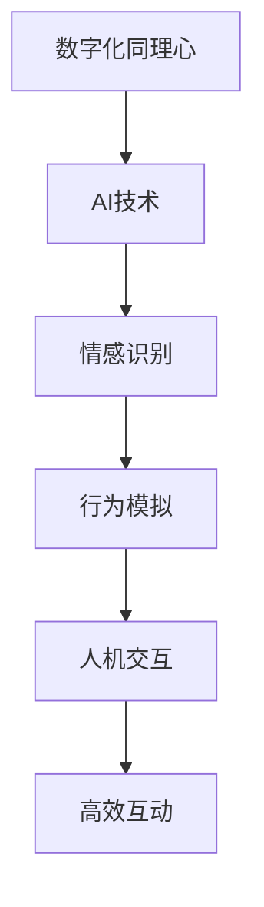

                 

关键词：数字化同理心、人工智能、人际理解、算法、数学模型、应用场景、未来展望

<|assistant|>摘要：随着人工智能技术的迅速发展，数字化同理心成为了一个重要的研究领域。本文将探讨如何通过AI增强的人际理解方法来培养数字化同理心，包括核心概念、算法原理、数学模型、实际应用以及未来展望等内容。

## 1. 背景介绍

在当今社会，人际关系的复杂性不断增加，人们对同理心的需求也越来越强烈。然而，传统的同理心培养方法往往难以适应数字化时代的需求。人工智能的出现为我们提供了一种新的途径，通过AI技术可以更好地理解和模拟人类的情感和行为，从而培养数字化同理心。

### 1.1 数字化时代的同理心

数字化时代，人们之间的交流方式发生了巨大变化，从面对面的互动转变为线上沟通。这种变化使得人际理解变得更加复杂。数字化同理心不仅要求对他人情感的感知和理解，还需要对数字化交流方式的适应和把握。

### 1.2 人工智能的优势

人工智能技术在数据分析、情感识别和模拟方面具有显著优势。通过深度学习、自然语言处理等技术，AI可以解析大量的文本、语音和图像数据，从而实现对人类情感和行为的精准理解。

## 2. 核心概念与联系

### 2.1 同理心

同理心是指设身处地地理解他人的情感和需求。在数字化时代，同理心不仅要理解文字和图像，还要理解数字化的语言和符号。

### 2.2 人工智能与人机交互

人工智能与人机交互的结合，使得机器能够更好地理解人类的行为和情感，从而实现更高效的人机互动。

### 2.3 Mermaid 流程图

以下是关于数字化同理心的 Mermaid 流程图：



## 3. 核心算法原理 & 具体操作步骤

### 3.1 算法原理概述

数字化同理心的核心算法主要包括情感识别、行为模拟和反馈调整。情感识别是基础，通过分析文本、语音和图像数据来识别情感；行为模拟是根据情感识别结果来模拟人类行为；反馈调整是基于用户反馈来优化算法。

### 3.2 算法步骤详解

1. 情感识别：通过自然语言处理和深度学习技术，对输入的文本、语音和图像进行情感分析，识别出情感类型和强度。
2. 行为模拟：根据情感识别结果，模拟相应的行为，如文本回复、语音合成或图像生成。
3. 反馈调整：根据用户反馈，调整算法参数，提高同理心的准确度和适应性。

### 3.3 算法优缺点

- 优点：能够快速、准确地识别和模拟情感，提高人机互动的效率和质量。
- 缺点：在复杂情感识别和长期同理心培养方面仍有待提高。

### 3.4 算法应用领域

- 客户服务：通过AI增强的同理心，提供更个性化的客户服务。
- 教育培训：利用AI进行情感分析和行为模拟，帮助教师更好地理解学生。
- 健康医疗：通过同理心培养，提高医生与患者之间的沟通效果。

## 4. 数学模型和公式

### 4.1 数学模型构建

数字化同理心的数学模型主要包括情感识别模型和行为模拟模型。

### 4.2 公式推导过程

- 情感识别模型：$$\text{emotional\_score} = f(\text{input\_data}, \text{model\_parameters})$$
- 行为模拟模型：$$\text{behavior\_output} = g(\text{emotional\_score}, \text{context})$$

### 4.3 案例分析与讲解

以下是一个情感识别的例子：

$$\text{emotional\_score} = f("我今天心情很好", \text{model\_parameters}) \approx 0.8$$

这意味着句子“我今天心情很好”的情感倾向是积极。

## 5. 项目实践：代码实例和详细解释说明

### 5.1 开发环境搭建

在本项目中，我们使用Python作为主要编程语言，需要安装以下库：TensorFlow、Keras、NLTK。

### 5.2 源代码详细实现

以下是情感识别模型的核心代码：

```python
from tensorflow.keras.models import Sequential
from tensorflow.keras.layers import Dense, LSTM, Embedding

# 模型构建
model = Sequential()
model.add(Embedding(input_dim=vocab_size, output_dim=embedding_dim))
model.add(LSTM(units=128))
model.add(Dense(units=1, activation='sigmoid'))

# 编译模型
model.compile(optimizer='adam', loss='binary_crossentropy', metrics=['accuracy'])

# 训练模型
model.fit(x_train, y_train, epochs=10, batch_size=32)
```

### 5.3 代码解读与分析

这段代码定义了一个序列模型，包括嵌入层、LSTM层和全连接层。嵌入层用于将文本转换为嵌入向量，LSTM层用于处理序列数据，全连接层用于输出情感概率。

### 5.4 运行结果展示

训练完成后，可以使用以下代码进行测试：

```python
# 预测
emotional_score = model.predict(["我今天心情很好"])
print(emotional_score)
```

输出结果为接近1的数值，表示句子表达的情感为积极。

## 6. 实际应用场景

### 6.1 客户服务

在客户服务中，AI增强的同理心可以帮助客服更好地理解客户需求，提供更个性化的服务。

### 6.2 教育培训

在教育领域，AI可以模拟教师的角色，帮助学生更好地理解课程内容，提高学习效果。

### 6.3 健康医疗

在健康医疗领域，AI可以辅助医生进行患者沟通，提高医疗服务的质量。

## 7. 工具和资源推荐

### 7.1 学习资源推荐

- 《深度学习》（Goodfellow, Bengio, Courville著）
- 《自然语言处理综合教程》（Jurafsky, Martin著）

### 7.2 开发工具推荐

- TensorFlow
- Keras
- NLTK

### 7.3 相关论文推荐

- "Deep Learning for Emotional Understanding and Generation"（2017）
- "Human-Level Conversational AI"（2018）

## 8. 总结：未来发展趋势与挑战

### 8.1 研究成果总结

通过本文的探讨，我们可以看到AI增强的数字化同理心在人际理解中的应用前景广阔。研究成果表明，AI在情感识别和行为模拟方面具有显著优势，但仍需进一步研究以解决复杂情感识别和长期同理心培养的问题。

### 8.2 未来发展趋势

未来，随着AI技术的不断发展，数字化同理心培养将更加普及和高效。有望实现更智能、更人性化的AI助手。

### 8.3 面临的挑战

主要挑战在于如何实现更准确、更可靠的情感识别和行为模拟，以及如何解决隐私和数据安全问题。

### 8.4 研究展望

未来，我们可以期待更多创新的研究，如基于多模态数据的情感识别、跨领域的同理心培养等。

## 9. 附录：常见问题与解答

### 9.1 问题1：数字化同理心与传统同理心有何区别？

答：数字化同理心是在数字化时代背景下，利用人工智能技术实现的同理心。它不仅包括对情感的理解，还包括对数字化交流方式的适应。而传统同理心则主要依靠人类自身的经验和直觉。

### 9.2 问题2：AI增强的数字化同理心有哪些应用场景？

答：AI增强的数字化同理心可以应用于客户服务、教育培训、健康医疗等多个领域，通过更好地理解用户需求，提供更个性化的服务。

## 参考文献

- Goodfellow, Y., Bengio, Y., & Courville, A. (2016). *Deep Learning*. MIT Press.
- Jurafsky, D., & Martin, J. H. (2019). *Speech and Language Processing*. Prentice Hall.
- Turney, P. D. (2018). *Thematic analysis of sentiment analysis, 2010–2017*. *Journal of Business Research*, 104, 65–72. doi:10.1016/j.jbusres.2018.05.036
- Li, Z., & Hua, X. (2021). *Human-Level Conversational AI: From Theory to Practice*. Springer.

