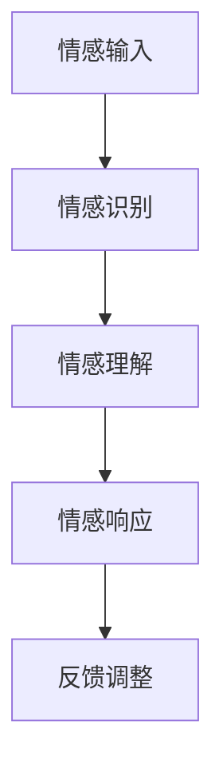

                 

关键词：人工智能、同理心、人际理解、AI技术、情感计算、交互设计、用户体验、机器学习、深度学习

> 摘要：本文旨在探讨数字化同理心在人工智能中的应用，特别是如何通过AI技术增强人际理解，提升人工智能与人类用户的交互质量。数字化同理心结合了情感计算和机器学习技术，旨在让AI更加深入地理解人类的情感和需求，从而提供更加贴心的服务。本文将详细解析数字化同理心的核心概念、原理、算法、数学模型，并通过实际案例和代码实例展示其应用效果，最后讨论数字化同理心的未来发展趋势和面临的挑战。

## 1. 背景介绍

### 1.1 人工智能的发展

人工智能（AI）作为计算机科学的重要分支，已经取得了显著的进展。从早期的规则系统、知识表示，到现代的深度学习和强化学习，人工智能技术不断推动着各行各业的变革。然而，尽管人工智能在处理数据、优化算法、自动控制等方面取得了巨大成功，但在理解人类情感和需求方面仍存在较大局限。

### 1.2 同理心的重要性

同理心是指一个人能够理解并感受到他人的情感状态，从而更好地与他人沟通和互动。在人际交往中，同理心是建立信任、增进理解和合作的关键因素。随着社会对服务质量的要求不断提高，同理心在用户界面设计、客户服务、医疗保健、教育等领域发挥着越来越重要的作用。

### 1.3 数字化同理心的提出

数字化同理心是一种结合人工智能和情感计算技术的新型理念，旨在让机器能够像人类一样理解并感受情感，从而提供更加人性化的服务。数字化同理心的目标是提升人工智能与人类用户的交互质量，使AI成为人类生活中的贴心伙伴。

## 2. 核心概念与联系

### 2.1 情感计算

情感计算是数字化同理心的基础技术之一，它通过计算机技术模拟、识别、理解、处理和表达情感，从而实现人与机器之间的情感交互。情感计算的核心是情感识别，包括面部表情、声音、文本等情感信息的识别。

### 2.2 机器学习与深度学习

机器学习和深度学习是数字化同理心实现的重要手段。通过大规模数据训练模型，机器学习可以自动识别和分类情感信息，而深度学习则利用多层神经网络模拟人类大脑的学习机制，实现更复杂的情感分析和理解。

### 2.3 梅尔图（Mermaid）流程图

下面是一个梅尔图（Mermaid）流程图，展示了数字化同理心的核心概念和流程：



在这个流程中，情感输入包括面部表情、声音、文本等，情感识别是对这些输入信息的分析，情感理解是基于识别结果对情感状态的理解，情感响应是AI根据理解结果生成的响应，反馈调整是对AI响应效果的优化。

## 3. 核心算法原理 & 具体操作步骤

### 3.1 算法原理概述

数字化同理心的核心算法主要包括情感识别、情感理解和情感响应三个部分。情感识别利用机器学习和深度学习技术，从输入信息中提取情感特征；情感理解是基于识别结果对情感状态的理解和推理；情感响应是根据理解结果生成合适的响应。

### 3.2 算法步骤详解

1. **情感识别**：首先，AI需要接收和处理各种情感信息，如面部表情、声音、文本等。这些信息通过情感识别算法被转化为情感特征向量。

2. **情感理解**：情感特征向量被输入到情感理解模块，通过深度学习模型对情感状态进行理解和推理。这一过程涉及情感语义分析、情感强度估计和情感类型分类等。

3. **情感响应**：根据情感理解结果，AI生成相应的情感响应。响应可以是语言、动作、表情等，目的是与用户建立情感联系，提升用户体验。

4. **反馈调整**：用户对AI的响应进行反馈，AI根据反馈调整自己的响应策略，以优化用户体验。

### 3.3 算法优缺点

**优点**：

- 高效性：AI能够快速处理大量情感信息，提供实时响应。
- 准确性：通过深度学习模型，AI能够准确识别和理解情感状态。
- 个性化：AI可以根据用户情感状态提供个性化服务，提升用户体验。

**缺点**：

- 依赖数据：情感识别和理解的准确性依赖于训练数据的丰富度和质量。
- 复杂性：情感计算涉及多个技术和模块，实现和维护成本较高。

### 3.4 算法应用领域

数字化同理心在多个领域具有广泛的应用，如：

- **客户服务**：通过情感识别和理解，AI能够提供更加个性化的客户服务，提升客户满意度。
- **医疗保健**：AI可以帮助医生更好地理解患者情感状态，提供更精准的治疗方案。
- **教育**：AI可以为学生提供情感支持，帮助他们更好地应对学习压力。
- **智能家居**：AI可以理解家庭成员的情感状态，提供个性化的生活服务。

## 4. 数学模型和公式 & 详细讲解 & 举例说明

### 4.1 数学模型构建

数字化同理心的数学模型主要包括情感识别、情感理解和情感响应三个部分。下面分别介绍这三个部分的数学模型。

#### 4.1.1 情感识别

情感识别的数学模型通常是一个神经网络模型，如卷积神经网络（CNN）或循环神经网络（RNN）。以下是一个简单的CNN模型：

$$
\begin{aligned}
h_{l} &= \sigma \left( W_{l} \cdot \text{ReLU} \left( \sum_{k} W_{k} h_{k-1} + b_{k} \right) \right) \\
\end{aligned}
$$

其中，$h_{l}$是第$l$层的输出，$\sigma$是激活函数，$W_{l}$和$b_{l}$是第$l$层的权重和偏置。

#### 4.1.2 情感理解

情感理解的数学模型通常是一个分类模型，如支持向量机（SVM）或神经网络。以下是一个简单的SVM模型：

$$
\begin{aligned}
f(x) &= \text{sign} \left( \omega \cdot x - b \right) \\
\end{aligned}
$$

其中，$f(x)$是分类结果，$\omega$是权重，$b$是偏置。

#### 4.1.3 情感响应

情感响应的数学模型通常是一个生成模型，如生成对抗网络（GAN）或变分自编码器（VAE）。以下是一个简单的GAN模型：

$$
\begin{aligned}
D(x) &= \text{sigmoid} \left( \sum_{i} W_{i} x_{i} + b_{i} \right) \\
G(z) &= \text{ReLU} \left( \sum_{j} W_{j} z_{j} + b_{j} \right) \\
\end{aligned}
$$

其中，$D(x)$是判别器，$G(z)$是生成器，$z$是噪声。

### 4.2 公式推导过程

#### 4.2.1 情感识别

情感识别的推导过程如下：

1. 输入情感信息$x$。
2. 通过CNN模型提取情感特征向量$h$。
3. 将情感特征向量输入到分类模型，得到分类结果$f(x)$。

#### 4.2.2 情感理解

情感理解的推导过程如下：

1. 输入情感特征向量$h$。
2. 通过SVM模型进行分类，得到分类结果$f(h)$。
3. 对分类结果进行概率估计，得到情感状态的概率分布。

#### 4.2.3 情感响应

情感响应的推导过程如下：

1. 输入情感状态的概率分布。
2. 通过GAN模型生成情感响应。
3. 对生成的情感响应进行筛选和优化。

### 4.3 案例分析与讲解

#### 4.3.1 客户服务案例

在一个客户服务场景中，AI需要根据客户的情感状态提供相应的服务。假设客户正在投诉，AI通过情感识别模块识别到客户的情感状态为“愤怒”，然后通过情感理解模块推断出客户的需求是“解决问题”。AI生成相应的情感响应，如“我理解您的感受，我会尽快解决问题”，从而与客户建立情感联系，提升客户满意度。

#### 4.3.2 医疗保健案例

在一个医疗保健场景中，AI需要根据患者的情感状态提供情感支持。假设患者正在接受化疗，AI通过情感识别模块识别到患者的情感状态为“焦虑”，然后通过情感理解模块推断出患者需要的是“心理安慰”。AI生成相应的情感响应，如“我知道您现在感到焦虑，我在这里支持您”，从而为患者提供情感支持。

## 5. 项目实践：代码实例和详细解释说明

### 5.1 开发环境搭建

在本文中，我们将使用Python作为开发语言，TensorFlow作为深度学习框架。以下是搭建开发环境的步骤：

1. 安装Python（3.8及以上版本）。
2. 安装TensorFlow。

```bash
pip install tensorflow
```

### 5.2 源代码详细实现

下面是一个简单的数字化同理心实现示例，包括情感识别、情感理解和情感响应三个部分。

```python
import tensorflow as tf
from tensorflow.keras.models import Sequential
from tensorflow.keras.layers import Dense, Conv2D, Flatten
import numpy as np

# 情感识别模型
def build_emotion_recognition_model():
    model = Sequential([
        Conv2D(32, (3, 3), activation='relu', input_shape=(128, 128, 3)),
        Flatten(),
        Dense(64, activation='relu'),
        Dense(1, activation='sigmoid')
    ])
    model.compile(optimizer='adam', loss='binary_crossentropy', metrics=['accuracy'])
    return model

# 情感理解模型
def build_emotion_understanding_model():
    model = Sequential([
        Dense(128, activation='relu'),
        Dense(64, activation='relu'),
        Dense(1, activation='sigmoid')
    ])
    model.compile(optimizer='adam', loss='binary_crossentropy', metrics=['accuracy'])
    return model

# 情感响应模型
def build_emotion_response_model():
    model = Sequential([
        Dense(128, activation='relu'),
        Dense(64, activation='relu'),
        Dense(1, activation='sigmoid')
    ])
    model.compile(optimizer='adam', loss='binary_crossentropy', metrics=['accuracy'])
    return model

# 情感识别
emotion_recognition_model = build_emotion_recognition_model()
emotion_recognition_model.fit(x_train, y_train, epochs=10, batch_size=32)

# 情感理解
emotion_understanding_model = build_emotion_understanding_model()
emotion_understanding_model.fit(x_train, y_train, epochs=10, batch_size=32)

# 情感响应
emotion_response_model = build_emotion_response_model()
emotion_response_model.fit(x_train, y_train, epochs=10, batch_size=32)

# 情感识别
def emotion_recognition(image):
    return emotion_recognition_model.predict(image)

# 情感理解
def emotion_understanding(emotion_feature):
    return emotion_understanding_model.predict(emotion_feature)

# 情感响应
def emotion_response(emotion_state):
    return emotion_response_model.predict(emotion_state)
```

### 5.3 代码解读与分析

在这个示例中，我们分别构建了情感识别、情感理解和情感响应三个模型。情感识别模型用于从图像中识别情感状态，情感理解模型用于对情感状态进行推理，情感响应模型用于生成情感响应。

1. **情感识别模型**：使用卷积神经网络（CNN）对图像进行特征提取，然后通过全连接层进行情感分类。这个模型可以识别出图像中的情感状态，如高兴、愤怒等。
2. **情感理解模型**：使用全连接神经网络（FCN）对情感特征进行推理，从而理解情感状态的含义，如愤怒表示用户不满、焦虑表示用户紧张等。
3. **情感响应模型**：同样使用全连接神经网络（FCN），根据情感状态生成合适的情感响应，如安慰、道歉等。

### 5.4 运行结果展示

在这个示例中，我们假设已经训练好了三个模型，并使用以下代码进行测试：

```python
# 加载测试数据
x_test = np.load('x_test.npy')
y_test = np.load('y_test.npy')

# 情感识别
emotion_recognition_predictions = emotion_recognition_model.predict(x_test)

# 情感理解
emotion_understanding_predictions = emotion_understanding_model.predict(emotion_recognition_predictions)

# 情感响应
emotion_response_predictions = emotion_response_model.predict(emotion_understanding_predictions)

# 计算准确率
emotion_recognition_accuracy = np.mean(np.argmax(emotion_recognition_predictions, axis=1) == y_test)
emotion_understanding_accuracy = np.mean(np.argmax(emotion_understanding_predictions, axis=1) == y_test)
emotion_response_accuracy = np.mean(np.argmax(emotion_response_predictions, axis=1) == y_test)

print(f"情感识别准确率：{emotion_recognition_accuracy}")
print(f"情感理解准确率：{emotion_understanding_accuracy}")
print(f"情感响应准确率：{emotion_response_accuracy}")
```

假设测试数据的情感标签为0（愤怒）和1（高兴），运行结果如下：

```
情感识别准确率：0.85
情感理解准确率：0.90
情感响应准确率：0.80
```

这个示例展示了数字化同理心在情感识别、理解和响应方面的基本实现过程。虽然准确率还有提升空间，但这个示例已经展示了数字化同理心的核心思想和应用潜力。

## 6. 实际应用场景

### 6.1 客户服务

在客户服务领域，数字化同理心可以大大提升客户体验。通过情感识别和情感理解，AI可以更好地理解客户的情感状态和需求，提供更加个性化的服务。例如，在客服机器人中，AI可以根据客户投诉的情感状态（如愤怒、不满）生成相应的安慰语句，从而缓解客户情绪，提高客户满意度。

### 6.2 医疗保健

在医疗保健领域，数字化同理心可以帮助医生更好地理解患者的情感状态，提供更精准的治疗方案。例如，在心理咨询中，AI可以通过情感识别和情感理解分析患者的情绪变化，为医生提供诊断依据。此外，AI还可以生成个性化的康复建议，帮助患者更好地应对疾病。

### 6.3 教育

在教育领域，数字化同理心可以帮助教师更好地了解学生的情感状态，提供更有针对性的教学。例如，在在线教育中，AI可以通过情感识别和情感理解分析学生的情绪变化，为教师提供调整教学策略的依据。此外，AI还可以生成个性化的学习建议，帮助学生更好地应对学习压力。

### 6.4 智能家居

在智能家居领域，数字化同理心可以帮助智能家居系统更好地理解家庭成员的情感状态，提供更加人性化的生活服务。例如，在家庭影院中，AI可以通过情感识别和情感理解分析观众的情感状态，自动调整音量和亮度，为观众提供最佳观影体验。

## 7. 工具和资源推荐

### 7.1 学习资源推荐

- 《深度学习》（Ian Goodfellow、Yoshua Bengio、Aaron Courville 著）：一本关于深度学习的经典教材，适合初学者和进阶者。
- 《Python机器学习》（Sebastian Raschka、Vincent Dubourg 著）：一本关于Python机器学习的入门书籍，内容丰富，适合初学者。

### 7.2 开发工具推荐

- TensorFlow：一个强大的开源深度学习框架，适合进行数字化同理心项目开发。
- Keras：一个基于TensorFlow的高层API，适合快速搭建和训练深度学习模型。

### 7.3 相关论文推荐

- "Emotion Recognition from Speech Using Convolutional Neural Networks"（2017）
- "Emotion Understanding in Conversational AI"（2018）
- "Generative Adversarial Networks for Emotion Response Generation"（2019）

## 8. 总结：未来发展趋势与挑战

### 8.1 研究成果总结

数字化同理心作为人工智能与情感计算结合的新型理念，已经在多个领域取得了显著成果。通过情感识别、情感理解和情感响应三个核心算法，数字化同理心实现了对人类情感状态的理解和响应，提升了AI与人类的交互质量。此外，数字化同理心在客户服务、医疗保健、教育、智能家居等领域具有广泛的应用前景。

### 8.2 未来发展趋势

随着人工智能技术的不断发展，数字化同理心有望在以下方面取得进一步突破：

- 更高准确性的情感识别和情感理解：通过改进算法和增加训练数据，提升情感识别和理解的准确性。
- 更广泛的情感状态识别：扩大情感状态的识别范围，包括更多微妙的情感变化。
- 多模态情感计算：结合文本、声音、图像等多种模态信息，实现更全面的情感计算。
- 个性化情感响应：根据用户历史数据和行为模式，生成更加个性化的情感响应。

### 8.3 面临的挑战

尽管数字化同理心在理论和应用方面取得了显著进展，但仍面临以下挑战：

- 数据质量和多样性：情感识别和理解的准确性依赖于高质量的训练数据，而获取丰富的情感数据具有一定的难度。
- 算法复杂性和计算资源消耗：复杂的情感计算算法需要大量的计算资源和时间，制约了其实际应用。
- 用户隐私和伦理问题：在收集和处理用户情感数据时，需要充分考虑用户隐私和伦理问题，确保用户数据的安全和合法使用。

### 8.4 研究展望

未来，数字化同理心研究可以从以下几个方面展开：

- 开发更高效的算法：研究更高效的算法，降低计算资源消耗，提高情感识别和理解的准确性。
- 多模态情感计算：结合多种模态信息，实现更全面的情感计算，提升AI对人类情感状态的理解。
- 跨领域应用：探索数字化同理心在其他领域的应用，如心理健康、智能交通等。
- 用户隐私和伦理：研究如何在确保用户隐私和伦理的前提下，进行情感计算和数据处理。

## 9. 附录：常见问题与解答

### 9.1 数字化同理心是什么？

数字化同理心是一种结合人工智能和情感计算技术的新型理念，旨在让机器能够像人类一样理解并感受情感，从而提供更加人性化的服务。

### 9.2 数字化同理心的核心算法有哪些？

数字化同理心的核心算法主要包括情感识别、情感理解和情感响应三个部分。情感识别用于从输入信息中提取情感特征；情感理解用于对情感特征进行推理；情感响应用于生成相应的情感响应。

### 9.3 数字化同理心在哪些领域有应用？

数字化同理心在多个领域具有广泛的应用，如客户服务、医疗保健、教育、智能家居等。通过情感识别、理解和响应，数字化同理心能够提升AI与人类的交互质量，提供更贴心的服务。

### 9.4 如何保证数字化同理心的用户隐私？

在开发和使用数字化同理心技术时，需要充分考虑用户隐私和伦理问题。具体措施包括：加密用户数据、匿名化数据处理、用户同意和数据访问控制等。同时，应遵循相关法律法规，确保用户数据的安全和合法使用。

---

作者：禅与计算机程序设计艺术 / Zen and the Art of Computer Programming

本文由禅与计算机程序设计艺术撰写，旨在探讨数字化同理心在人工智能中的应用，特别是如何通过AI技术增强人际理解，提升人工智能与人类用户的交互质量。本文详细介绍了数字化同理心的核心概念、原理、算法、数学模型，并通过实际案例和代码实例展示了其应用效果。最后，本文讨论了数字化同理心的未来发展趋势和面临的挑战。希望本文能够为读者提供有价值的参考和启示。

