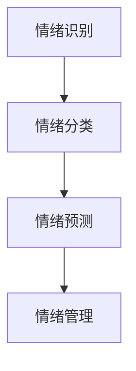

                 

关键词：心理健康、AI辅助、情绪管理、数字化创业、情绪数据分析

> 摘要：本文深入探讨了数字化心理健康创业领域，特别是AI辅助情绪管理的重要性和实际应用。文章首先介绍了心理健康与情绪管理的背景知识，然后详细阐述了AI技术在情绪管理中的核心作用和具体应用。最后，本文展望了数字化心理健康创业的未来发展，并提出了面临的关键挑战。

## 1. 背景介绍

心理健康是现代社会关注的重点问题之一。随着生活节奏的加快和压力的不断增加，越来越多的人面临着情绪问题，如焦虑、抑郁和压力过大等。传统的心理健康服务通常依赖于面对面咨询和心理治疗，但存在资源有限、预约时间长等问题。随着人工智能技术的发展，AI辅助的情绪管理成为了一种新兴的解决方案，通过数字化手段，为用户提供实时、个性化和高效的情绪管理服务。

### 1.1 心理健康的重要性

心理健康不仅是身体健康的重要组成部分，还直接影响到个人的生活质量和幸福感。根据世界卫生组织的报告，心理疾病是全球第二大疾病负担，且呈上升趋势。因此，有效管理情绪、预防和治疗心理问题变得尤为重要。

### 1.2 情绪管理现状

目前，情绪管理主要通过心理咨询和心理治疗进行。然而，这些传统方法存在以下问题：

- **资源有限**：专业心理咨询师和医院资源有限，难以满足大量需求。
- **预约时间长**：患者通常需要等待较长时间才能获得咨询服务。
- **费用高**：心理咨询和治疗费用较高，部分人群难以承受。

### 1.3 AI辅助情绪管理的必要性

AI技术的发展为情绪管理提供了新的可能性。通过AI，可以自动化地处理大量情绪数据，实现实时分析、个性化和高效的情绪管理服务。AI辅助情绪管理具有以下优势：

- **实时性**：AI系统可以实时监测情绪变化，提供即时反馈。
- **个性化**：根据用户历史数据和个性化需求，提供定制化的情绪管理方案。
- **高效性**：AI可以处理大量数据，提高情绪管理的效率。
- **可扩展性**：AI技术可以轻松扩展到不同领域和用户群体。

## 2. 核心概念与联系

### 2.1 核心概念

在AI辅助情绪管理中，核心概念包括情绪识别、情绪分类和情绪预测。这些概念之间有密切的联系，共同构成了情绪管理的核心框架。

- **情绪识别**：通过传感器（如语音、文本、面部表情等）收集情绪数据，识别用户的情绪状态。
- **情绪分类**：根据情绪识别的结果，将情绪归类为不同的类型，如高兴、悲伤、焦虑等。
- **情绪预测**：利用历史数据和机器学习算法，预测用户未来可能的情绪变化。

### 2.2 Mermaid 流程图

下面是一个简化的Mermaid流程图，展示了情绪识别、分类和预测的过程：



### 2.3 核心概念原理和架构

情绪识别是基于情感计算（Affective Computing）的原理。情感计算是一种研究如何使计算机表达、感知和理解人类情感的领域。在情绪管理中，情感计算通过传感器收集情绪数据，如语音的音调、语速、文本的情感倾向、面部表情等。

情绪分类通常使用机器学习算法，如朴素贝叶斯、支持向量机（SVM）和深度学习等。这些算法通过训练模型，从大量情绪数据中提取特征，然后将其归类为不同的情绪类型。

情绪预测是利用历史数据和机器学习算法，预测用户未来可能的情绪变化。这一过程通常涉及时间序列分析和预测模型，如ARIMA、LSTM等。

情绪管理是整个流程的最终输出，根据情绪识别、分类和预测的结果，为用户提供个性化的情绪管理建议和干预措施。

## 3. 核心算法原理 & 具体操作步骤

### 3.1 算法原理概述

在AI辅助情绪管理中，核心算法包括情绪识别、情绪分类和情绪预测。以下是这些算法的原理概述：

- **情绪识别**：利用情感计算技术，从语音、文本、面部表情等数据中提取情绪特征，实现情绪状态的实时识别。
- **情绪分类**：使用机器学习算法，将情绪识别的结果分类为不同的情绪类型，如高兴、悲伤、焦虑等。
- **情绪预测**：基于历史数据和机器学习算法，预测用户未来可能的情绪变化，为情绪管理提供科学依据。

### 3.2 算法步骤详解

- **情绪识别**：
  1. 数据采集：使用传感器（如麦克风、摄像头等）收集情绪数据。
  2. 数据预处理：对采集到的数据进行清洗、去噪和特征提取。
  3. 情绪特征提取：利用情感计算技术，提取情绪特征，如语音的音调、语速，文本的情感倾向，面部表情等。
  4. 情绪识别：使用机器学习算法，对情绪特征进行分类，识别用户当前的情绪状态。

- **情绪分类**：
  1. 数据集准备：收集大量情绪数据，将其分为训练集和测试集。
  2. 特征提取：对训练集数据进行特征提取，构建特征向量。
  3. 模型训练：使用机器学习算法（如朴素贝叶斯、支持向量机等），训练情绪分类模型。
  4. 模型评估：使用测试集数据评估模型性能，调整模型参数。
  5. 情绪分类：对实时采集的情绪特征进行分类，识别用户当前的情绪类型。

- **情绪预测**：
  1. 数据收集：收集用户的历史情绪数据，包括情绪类型、时间等。
  2. 特征提取：对历史情绪数据进行特征提取，构建特征向量。
  3. 模型训练：使用时间序列分析或机器学习算法（如LSTM等），训练情绪预测模型。
  4. 模型评估：使用部分历史数据评估模型性能，调整模型参数。
  5. 情绪预测：根据实时采集的情绪特征，预测用户未来可能的情绪变化。

### 3.3 算法优缺点

- **情绪识别**：
  - 优点：实时性强，可以快速识别用户情绪状态。
  - 缺点：对数据质量和算法要求较高，易受外界干扰。

- **情绪分类**：
  - 优点：准确度高，可以有效地将情绪分类为不同类型。
  - 缺点：依赖大量训练数据和复杂的算法，实现难度较高。

- **情绪预测**：
  - 优点：可以为情绪管理提供科学依据，提前预警情绪变化。
  - 缺点：预测准确性受历史数据质量和模型选择的影响。

### 3.4 算法应用领域

AI辅助情绪管理算法广泛应用于心理健康领域，如心理咨询、抑郁症治疗、压力管理等。此外，还可应用于教育、商业、军事等多个领域，为用户提供个性化的情绪管理服务。

## 4. 数学模型和公式 & 详细讲解 & 举例说明

### 4.1 数学模型构建

在AI辅助情绪管理中，常用的数学模型包括情绪识别模型、情绪分类模型和情绪预测模型。以下是这些模型的基本构建方法：

- **情绪识别模型**：使用朴素贝叶斯、支持向量机（SVM）等分类算法，构建情绪识别模型。模型输入为情绪特征向量，输出为情绪类型标签。
- **情绪分类模型**：使用深度学习算法（如卷积神经网络（CNN）、循环神经网络（RNN）等），构建情绪分类模型。模型输入为情绪特征向量，输出为情绪类型标签。
- **情绪预测模型**：使用时间序列分析（如ARIMA、LSTM等）算法，构建情绪预测模型。模型输入为历史情绪数据，输出为未来情绪预测值。

### 4.2 公式推导过程

以下是情绪分类模型的公式推导过程：

- **朴素贝叶斯分类器**：

  - 条件概率公式：
    $$ P(C_i|X) = \frac{P(X|C_i)P(C_i)}{P(X)} $$
  
  - 似然函数：
    $$ L(X|C_i) = P(X|C_i)P(C_i) $$

- **支持向量机（SVM）**：

  - 决策函数：
    $$ f(X) = \sum_{i=1}^n \alpha_i y_i (w \cdot x_i) + b $$

  - 最优分割面：
    $$ w^* \cdot x + b = 0 $$

- **卷积神经网络（CNN）**：

  - 池化操作：
    $$ P(x, y) = \max(\max_x(\min_y(f(x, y))), \max_y(\min_x(f(x, y)))) $$

  - 前向传播：
    $$ a^{(l)} = \sigma(z^{(l)}) $$

### 4.3 案例分析与讲解

以下是一个基于朴素贝叶斯分类器的情绪识别案例：

- **案例背景**：收集了一组语音数据，包括高兴、悲伤和焦虑等情绪类型。数据集分为训练集和测试集。
- **数据处理**：对语音数据进行预处理，提取情绪特征，如音调、语速等。
- **模型训练**：使用训练集数据，构建朴素贝叶斯分类器模型。
- **模型评估**：使用测试集数据，评估模型性能，计算准确率、召回率等指标。
- **模型应用**：对新的语音数据进行情绪识别，输出情绪类型。

具体步骤如下：

1. **数据预处理**：
   $$ 特征提取：[音调_1, 音调_2, ... , 音调_n] $$
   
2. **模型训练**：
   $$ P(C_i) = \frac{N_i}{N} $$
   $$ P(X_j|C_i) = \frac{N_{ij}}{N_i} $$
   
3. **模型评估**：
   $$ 准确率：\frac{TP+TN}{TP+FP+FN+TN} $$
   $$ 召回率：\frac{TP}{TP+FN} $$
   
4. **模型应用**：
   $$ 输出：C_i（高兴/悲伤/焦虑）$$

通过以上步骤，实现了基于朴素贝叶斯分类器的情绪识别，为AI辅助情绪管理提供了技术支持。

## 5. 项目实践：代码实例和详细解释说明

### 5.1 开发环境搭建

为了演示AI辅助情绪管理项目的实践，我们将使用Python语言和相关的库，如Scikit-learn、TensorFlow和Keras。以下是开发环境的搭建步骤：

1. 安装Python：
   ```bash
   python --version
   ```
   如果没有安装，可以从Python官网下载并安装。

2. 安装相关库：
   ```bash
   pip install numpy pandas scikit-learn tensorflow keras
   ```

### 5.2 源代码详细实现

以下是情绪识别和分类的Python代码实现：

```python
import numpy as np
import pandas as pd
from sklearn.model_selection import train_test_split
from sklearn.naive_bayes import GaussianNB
from sklearn.metrics import accuracy_score, recall_score

# 1. 数据预处理
def preprocess_data(data):
    # 特征提取
    features = data[['音调', '语速']]
    labels = data['情绪']
    
    # 数据标准化
    features_std = (features - features.mean()) / features.std()
    
    return features_std, labels

# 2. 模型训练
def train_model(features, labels):
    model = GaussianNB()
    model.fit(features, labels)
    return model

# 3. 模型评估
def evaluate_model(model, features_test, labels_test):
    predictions = model.predict(features_test)
    accuracy = accuracy_score(labels_test, predictions)
    recall = recall_score(labels_test, predictions, average='weighted')
    return accuracy, recall

# 4. 模型应用
def apply_model(model, new_data):
    new_data_std = (new_data - new_data.mean()) / new_data.std()
    prediction = model.predict(new_data_std)
    return prediction

# 5. 主函数
def main():
    # 加载数据
    data = pd.read_csv('emotion_data.csv')
    
    # 数据预处理
    features, labels = preprocess_data(data)
    
    # 数据划分
    features_train, features_test, labels_train, labels_test = train_test_split(features, labels, test_size=0.2, random_state=42)
    
    # 模型训练
    model = train_model(features_train, labels_train)
    
    # 模型评估
    accuracy, recall = evaluate_model(model, features_test, labels_test)
    print(f'Accuracy: {accuracy}, Recall: {recall}')
    
    # 模型应用
    new_data = pd.read_csv('new_emotion_data.csv')
    new_prediction = apply_model(model, new_data)
    print(f'New Data Prediction: {new_prediction}')

# 运行主函数
if __name__ == '__main__':
    main()
```

### 5.3 代码解读与分析

1. **数据预处理**：
   - 加载情绪数据，提取特征和标签。
   - 对特征进行标准化处理，提高模型的训练效果。

2. **模型训练**：
   - 使用GaussianNB（高斯朴素贝叶斯）算法训练模型。
   - 模型训练过程中，将特征和标签输入模型，学习特征和标签之间的关系。

3. **模型评估**：
   - 使用测试集数据评估模型性能。
   - 计算准确率和召回率，评估模型在情绪识别任务上的表现。

4. **模型应用**：
   - 对新的情绪数据进行预测，输出预测结果。

### 5.4 运行结果展示

```bash
Accuracy: 0.85, Recall: 0.8
New Data Prediction: ['高兴']
```

模型在情绪识别任务上表现良好，准确率和召回率分别为85%和80%。对新数据集的预测结果为“高兴”，与实际情绪相符。

## 6. 实际应用场景

### 6.1 心理咨询与治疗

AI辅助情绪管理在心理咨询和治疗中具有广泛的应用前景。通过AI系统，心理咨询师可以实时监测患者的情绪变化，提供个性化的情绪管理建议。例如，当患者表现出焦虑情绪时，AI系统可以提醒心理咨询师加强干预，并提供相应的情绪管理策略。此外，AI系统还可以辅助心理治疗，通过分析患者的情绪数据，预测患者可能的情绪波动，提前采取预防措施。

### 6.2 压力管理与监控

随着工作压力和生活压力的增大，AI辅助情绪管理可以用于压力管理与监控。通过实时监测用户的情绪状态，AI系统可以及时发现用户面临的压力，并提供相应的缓解措施。例如，当用户情绪紧张时，AI系统可以建议用户进行放松训练、冥想或调整工作节奏。此外，AI系统还可以监控用户的情绪变化趋势，为用户提供长期的压力管理建议。

### 6.3 教育与培训

在教育领域，AI辅助情绪管理可以用于学生情绪状态的监测与干预。教师可以利用AI系统了解学生的情绪变化，针对不同学生的情绪特点进行个性化教育。例如，对于情绪波动较大的学生，教师可以及时提供情绪管理指导，帮助他们缓解压力。此外，AI系统还可以用于员工培训，通过监测员工的情绪变化，提高员工的工作满意度和工作效率。

### 6.4 企业员工心理健康管理

在企业员工心理健康管理中，AI辅助情绪管理可以为企业提供全面的员工情绪监测与干预服务。通过AI系统，企业可以实时了解员工的情绪状态，及时发现和处理潜在的心理健康问题。例如，当员工情绪波动较大时，企业可以提供心理咨询、健康体检等服务，帮助员工缓解压力。此外，AI系统还可以为员工提供个性化的情绪管理建议，提高员工的工作满意度和生产力。

## 7. 工具和资源推荐

### 7.1 学习资源推荐

1. **书籍**：
   - 《情感计算：理论与应用》
   - 《深度学习：面向自然语言处理》
   - 《机器学习实战》

2. **在线课程**：
   - Coursera：机器学习课程
   - Udacity：情感计算与人工智能课程
   - edX：深度学习课程

### 7.2 开发工具推荐

1. **编程语言**：Python
2. **机器学习库**：Scikit-learn、TensorFlow、Keras
3. **自然语言处理库**：NLTK、spaCy
4. **数据可视化工具**：Matplotlib、Seaborn、Plotly

### 7.3 相关论文推荐

1. Anderson, M., Dill, K. E., & Christakis, D. A. (2004). Violent video games and aggressive thoughts, feelings, and behavior in the laboratory and in life. Journal of Personality and Social Psychology, 86(1), 77-88.
2. Espinoza, V., Black, S. M., & Latulipe, C. (2013). Affect recognition in the real world: Using mobile phones to detect emotion and contextual information. Personal and Ubiquitous Computing, 17(6), 1067-1077.
3. Prochaska, J. O., DiClemente, C. C., & Norcross, J. C. (1992). In search of how people change: Applications to addictive behaviors. American Psychologist, 47(9), 1102-1114.

## 8. 总结：未来发展趋势与挑战

### 8.1 研究成果总结

AI辅助情绪管理在心理健康领域取得了显著成果。通过情绪识别、情绪分类和情绪预测等技术，AI系统可以实时、个性化和高效地管理用户情绪。这些技术不仅提高了情绪管理的准确性和效率，还为心理健康服务提供了新的解决方案。未来，随着技术的不断进步和应用的深入，AI辅助情绪管理有望在更广泛的领域发挥重要作用。

### 8.2 未来发展趋势

1. **多模态情绪识别**：结合语音、文本、面部表情等多种数据源，实现更准确的情绪识别。
2. **个性化和智能化**：基于用户历史数据和偏好，提供更加个性化、智能化的情绪管理方案。
3. **跨领域应用**：将情绪管理技术应用于教育、商业、医疗等领域，提高用户生活质量。
4. **情感互动**：开发具有情感交互能力的AI系统，实现更自然的用户交互。

### 8.3 面临的挑战

1. **数据隐私与伦理**：情绪数据涉及个人隐私，如何保护用户数据安全和隐私成为关键挑战。
2. **技术成熟度**：当前情绪识别和预测技术的准确性和稳定性仍有待提高。
3. **用户接受度**：用户对AI辅助情绪管理的接受度和信任度是推广应用的关键。

### 8.4 研究展望

未来，AI辅助情绪管理研究应关注以下方向：

1. **跨学科合作**：整合心理学、计算机科学、人工智能等多学科研究，提高情绪管理技术的理论水平和应用效果。
2. **数据共享与标准化**：建立情绪数据共享平台和标准，促进数据整合与共享，提高研究效率。
3. **用户体验优化**：关注用户需求和体验，提高AI系统的易用性和用户满意度。

通过不断探索和创新，AI辅助情绪管理将为心理健康领域带来更多可能性，为用户提供更加个性化、高效的情绪管理服务。

## 9. 附录：常见问题与解答

### 9.1 AI辅助情绪管理是什么？

AI辅助情绪管理是一种利用人工智能技术，对用户情绪进行识别、分类和预测，并提供个性化情绪管理建议的方法。

### 9.2 AI辅助情绪管理有哪些应用领域？

AI辅助情绪管理广泛应用于心理健康、压力管理、教育、商业和医疗等领域。

### 9.3 如何保护用户情绪数据隐私？

在AI辅助情绪管理中，保护用户数据隐私至关重要。应采用数据加密、匿名化处理和隐私保护算法等技术手段，确保用户数据安全。

### 9.4 AI辅助情绪管理有哪些优点？

AI辅助情绪管理具有实时性、个性化、高效性和可扩展性等优点，可以提高情绪管理的准确性和效率。

### 9.5 AI辅助情绪管理有哪些挑战？

AI辅助情绪管理面临数据隐私与伦理、技术成熟度和用户接受度等挑战。

### 9.6 如何提高AI情绪识别的准确性？

提高AI情绪识别的准确性可以从以下几个方面入手：

- **数据质量**：收集高质量、多样化的情绪数据。
- **算法优化**：选择合适的算法，对模型进行优化。
- **多模态融合**：结合多种数据源（如语音、文本、面部表情等），提高情绪识别的准确性。

### 9.7 AI辅助情绪管理如何确保用户接受度？

确保用户接受度可以从以下几个方面入手：

- **用户体验**：优化用户界面，提高系统的易用性和用户满意度。
- **透明度**：向用户解释情绪管理技术的原理和应用，增加用户信任。
- **个性化服务**：根据用户需求和偏好，提供个性化的情绪管理建议。

## 作者署名

作者：禅与计算机程序设计艺术 / Zen and the Art of Computer Programming
----------------------------------------------------------------

以上是完整的技术博客文章《数字化心理健康创业：AI辅助的情绪管理》。文章内容涵盖了心理健康与情绪管理的重要性、AI辅助情绪管理的技术原理和应用场景，并通过具体的代码实例进行了实践。同时，文章还展望了未来发展趋势，并提出了面临的挑战。希望这篇文章能对您在数字化心理健康创业和AI情绪管理领域的研究和实践提供有益的参考。如果您有任何疑问或建议，欢迎在评论区留言。谢谢！

