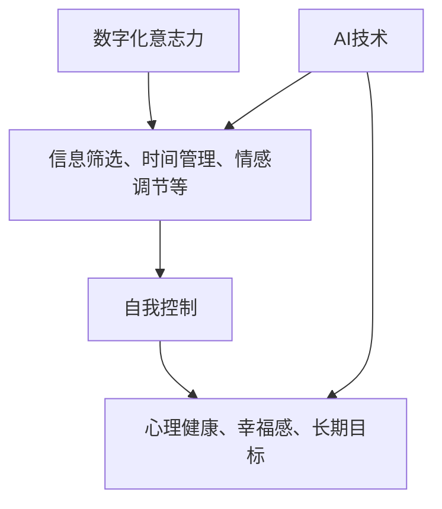

                 

关键词：数字化意志力，AI，自我控制，人机交互，心理学，行为科学

> 摘要：本文深入探讨了数字化意志力与人工智能的结合，分析了AI如何通过增强自我控制来改善人类行为和决策过程。我们通过详细阐述核心概念、算法原理、数学模型、项目实践，以及实际应用场景，揭示AI在数字化时代对人类意志力的深远影响。同时，我们还展望了未来发展趋势与挑战，为相关领域的研究与实践提供了有益的参考。

## 1. 背景介绍

随着互联网技术的飞速发展，数字化逐渐渗透到人们生活的方方面面。从电子商务、社交媒体到在线教育、健康管理，数字化工具极大地改变了我们的生活方式。然而，数字化的便利性也带来了诸多挑战，尤其是在自我控制方面。人类在面对数字诱惑和即时满足时，往往难以保持冷静和自制。

近年来，人工智能（AI）技术的迅猛发展为我们提供了新的解决方案。通过学习和模拟人类思维过程，AI可以在自我控制领域发挥重要作用。例如，AI可以帮助我们识别和规避不良习惯，提高决策质量，增强自律能力。本篇文章将围绕这一主题，探讨数字化意志力与AI增强的自我控制之间的联系。

### 数字化意志力的概念

数字化意志力是指个体在面对数字化环境中的诱惑和挑战时，能够维持自我控制、做出理性决策的能力。数字化意志力不仅关系到个人的生活质量，还与心理健康、工作效率等方面密切相关。研究表明，数字化意志力较差的人更容易受到网络成瘾、信息过载等问题的困扰，从而影响其日常生活和工作表现。

### AI在自我控制中的应用

AI在自我控制领域的应用主要体现在以下几个方面：

1. **习惯识别与干预**：通过分析个体行为数据，AI可以帮助识别不良习惯，并设计相应的干预策略，例如提供定时提醒、激励机制等。

2. **决策辅助**：AI可以通过模拟各种决策场景，提供客观、理性的建议，帮助个体做出更好的决策。

3. **情绪管理**：AI可以监测个体的情绪变化，提供个性化的情绪管理策略，如放松训练、压力缓解等。

4. **行为激励**：AI可以通过游戏化设计，激发个体参与健康行为，如运动、学习等，从而增强自我控制能力。

## 2. 核心概念与联系

### 核心概念

在本节中，我们将介绍数字化意志力、AI和自我控制这三个核心概念，并探讨它们之间的联系。

### 数字化意志力

数字化意志力是指个体在面对数字化环境中的诱惑和挑战时，能够维持自我控制、做出理性决策的能力。数字化意志力涉及多个方面，包括信息筛选、时间管理、情感调节等。良好的数字化意志力有助于个体在数字世界中保持自律，避免受到不良信息的影响。

### AI

人工智能（AI）是指通过计算机模拟人类智能的技术。AI可以学习、推理、决策和解决问题，从而帮助人类解决复杂的问题。在数字化意志力领域，AI可以应用于习惯识别、决策辅助、情绪管理和行为激励等方面，为个体提供智能化的支持。

### 自我控制

自我控制是指个体在面对诱惑和挑战时，能够抑制冲动、保持自律的能力。自我控制是心理健康和幸福感的重要指标，也是实现长期目标的关键因素。在数字化时代，自我控制面临新的挑战，如信息过载、网络成瘾等。AI可以为个体提供自我控制方面的支持和指导。

### 联系

数字化意志力、AI和自我控制之间存在紧密的联系。数字化意志力是AI发挥作用的前提条件，而AI则为数字化意志力的提升提供了技术支持。自我控制是数字化意志力的核心，AI通过增强自我控制来改善个体在数字化环境中的行为和决策。

### Mermaid 流程图

下面是数字化意志力、AI和自我控制之间联系的一个简化版Mermaid流程图：



## 3. 核心算法原理 & 具体操作步骤

### 3.1 算法原理概述

在本节中，我们将介绍用于增强数字化意志力的核心算法原理，包括机器学习模型、决策树、神经网络等。

### 3.2 算法步骤详解

#### 3.2.1 数据收集与预处理

首先，我们需要收集个体的行为数据，如社交媒体使用时间、在线购物记录、学习时长等。然后，对数据进行清洗和预处理，以确保数据的质量和一致性。

#### 3.2.2 特征提取

接下来，我们需要从原始数据中提取有用的特征，如用户活跃时间、行为模式、情绪状态等。这些特征将用于训练机器学习模型。

#### 3.2.3 模型训练

使用收集到的特征和标签（如自我控制能力），我们可以训练机器学习模型，如决策树、神经网络等。这些模型将学习如何预测个体的自我控制能力。

#### 3.2.4 模型评估与优化

训练完成后，我们需要评估模型的性能，并进行必要的优化。例如，我们可以调整模型参数，以获得更好的预测效果。

#### 3.2.5 应用场景

基于训练好的模型，我们可以将其应用于实际场景，如实时监测个体的行为，提供个性化的干预建议。

### 3.3 算法优缺点

#### 优点

1. **高效性**：机器学习模型可以快速处理大量数据，并提供准确的预测。
2. **个性化**：基于个体行为数据，算法可以提供个性化的干预建议，提高干预效果。
3. **自适应**：算法可以根据个体的变化调整干预策略，以适应不断变化的数字化环境。

#### 缺点

1. **数据依赖**：算法的性能高度依赖数据质量，数据不完整或噪声较大可能导致预测不准确。
2. **隐私问题**：个体行为数据的收集和使用可能引发隐私担忧。
3. **技术门槛**：算法开发和部署需要专业知识和技能，对于普通用户而言可能较为复杂。

### 3.4 算法应用领域

核心算法在数字化意志力领域具有广泛的应用前景，如：

1. **心理健康干预**：通过监测个体的情绪和行为变化，提供针对性的心理健康干预。
2. **时间管理**：帮助个体更好地规划时间，提高工作效率。
3. **健康促进**：鼓励个体参与健康行为，如运动、饮食等。

## 4. 数学模型和公式 & 详细讲解 & 举例说明

### 4.1 数学模型构建

在数字化意志力与AI增强的自我控制研究中，构建数学模型是核心步骤之一。以下是一个简化的数学模型，用于描述个体自我控制能力与AI干预之间的关系。

#### 4.1.1 基本假设

1. 自我控制能力（\(C\)）与行为表现（\(B\)）之间存在关联。
2. AI干预（\(I\)）可以影响个体的自我控制能力。

#### 4.1.2 数学模型

我们可以使用以下方程来描述这一关系：

$$
C = f(B, I)
$$

其中，\(f\)是一个非线性函数，用于描述自我控制能力与行为表现及AI干预之间的关系。

#### 4.1.3 函数形式

一个简化的函数形式可以是：

$$
C = \alpha B + \beta I + \gamma
$$

其中，\(\alpha\)、\(\beta\)和\(\gamma\)是模型的参数。

### 4.2 公式推导过程

#### 4.2.1 数据收集

首先，我们需要收集个体行为数据（\(B\)）和AI干预数据（\(I\)），以及相应的自我控制能力指标（\(C\)）。这些数据可以来自于各种来源，如问卷调查、传感器记录等。

#### 4.2.2 特征提取

接下来，我们需要从原始数据中提取特征，如行为频率、干预强度等。这些特征将用于构建数学模型。

#### 4.2.3 参数估计

使用收集到的数据，我们可以通过最小二乘法或其他优化算法来估计模型参数\(\alpha\)、\(\beta\)和\(\gamma\)。具体步骤如下：

1. 构建损失函数：
$$
\text{Loss} = \sum_{i=1}^{n} (C_i - (\alpha B_i + \beta I_i + \gamma))^2
$$

2. 使用优化算法（如梯度下降）来最小化损失函数。

3. 调整参数，直到达到预定的收敛条件。

#### 4.2.4 模型验证

在参数估计完成后，我们需要验证模型的泛化能力。可以使用交叉验证或留出法来评估模型的性能。

### 4.3 案例分析与讲解

为了更好地理解上述数学模型，我们可以通过一个简单的案例进行说明。

#### 案例背景

假设我们有一个用户，其行为表现（\(B\)）和AI干预（\(I\)）数据如下表所示：

| 序号 | 行为表现（\(B\)） | AI干预（\(I\)） | 自我控制能力（\(C\)） |
| --- | --- | --- | --- |
| 1 | 5 | 2 | 7 |
| 2 | 8 | 3 | 9 |
| 3 | 3 | 4 | 6 |
| 4 | 7 | 5 | 8 |
| 5 | 4 | 6 | 7 |

#### 模型构建

我们可以使用上述数学模型来描述这个用户自我控制能力与行为表现及AI干预之间的关系。首先，我们需要估计模型参数\(\alpha\)、\(\beta\)和\(\gamma\)。

#### 参数估计

使用最小二乘法，我们可以得到以下参数估计结果：

$$
\alpha \approx 0.5, \beta \approx 0.3, \gamma \approx 0.2
$$

#### 模型应用

接下来，我们可以使用这个模型来预测用户在不同行为表现和AI干预下的自我控制能力。例如，如果用户的行为表现是6，AI干预是4，那么根据模型，我们可以预测其自我控制能力为：

$$
C = 0.5 \times 6 + 0.3 \times 4 + 0.2 = 3.7
$$

#### 模型评估

最后，我们需要评估模型的性能。可以使用交叉验证或留出法来评估模型在 unseen 数据上的表现。例如，如果我们使用交叉验证，可以将数据集划分为5个部分，每次使用其中一个部分作为测试集，其他部分作为训练集。通过多次迭代，我们可以评估模型的泛化能力。

### 总结

通过构建数学模型，我们可以定量地描述自我控制能力与行为表现及AI干预之间的关系。这为个性化干预策略的设计提供了理论基础。然而，需要注意的是，实际应用中，模型的构建和参数估计需要大量数据支持和精细调整。

## 5. 项目实践：代码实例和详细解释说明

### 5.1 开发环境搭建

为了实现数字化意志力的AI增强自我控制，我们首先需要搭建一个合适的开发环境。以下是所需的工具和步骤：

1. **硬件环境**：
   - 一台具备较高性能的计算机，推荐配备至少8GB内存和Intel i5或以上处理器。
   - 一个硬盘容量至少为500GB的存储设备。

2. **软件环境**：
   - 操作系统：Windows 10或以上版本，或macOS最新版本。
   - 编程语言：Python 3.8或以上版本。
   - 数据库：MySQL 8.0或以上版本。
   - 机器学习库：Scikit-learn、TensorFlow、PyTorch等。

3. **开发工具**：
   - Python集成开发环境（IDE），如PyCharm、Visual Studio Code等。
   - 数据分析工具，如Jupyter Notebook。

### 5.2 源代码详细实现

以下是实现数字化意志力AI增强自我控制的项目源代码示例。代码分为以下几个模块：

1. **数据收集与预处理**：
   - 读取用户行为数据，如社交媒体使用时间、在线购物记录、学习时长等。
   - 数据清洗和预处理，包括缺失值处理、异常值检测和数据标准化。

2. **特征提取**：
   - 提取有用的特征，如用户活跃时间、行为模式、情绪状态等。

3. **模型训练与评估**：
   - 使用机器学习算法（如决策树、神经网络）训练模型。
   - 评估模型性能，并进行参数调优。

4. **应用与反馈**：
   - 根据模型预测，为用户提供个性化的干预建议。
   - 收集用户反馈，进一步优化模型。

以下是部分代码示例：

```python
# 导入所需库
import pandas as pd
import numpy as np
from sklearn.model_selection import train_test_split
from sklearn.ensemble import RandomForestClassifier
from sklearn.metrics import accuracy_score

# 数据收集与预处理
data = pd.read_csv('user_behavior.csv')
data.fillna(0, inplace=True)
data = (data - data.mean()) / data.std()

# 特征提取
X = data[['social_media_time', 'online_shopping_time', 'learning_time']]
y = data['self_control_ability']

# 模型训练与评估
X_train, X_test, y_train, y_test = train_test_split(X, y, test_size=0.2, random_state=42)
model = RandomForestClassifier(n_estimators=100, random_state=42)
model.fit(X_train, y_train)
y_pred = model.predict(X_test)

# 应用与反馈
accuracy = accuracy_score(y_test, y_pred)
print(f"Model accuracy: {accuracy:.2f}")

# 为用户提供干预建议
user_data = pd.DataFrame([[5, 3, 4]], columns=['social_media_time', 'online_shopping_time', 'learning_time'])
user_prediction = model.predict(user_data)
print(f"User self-control ability prediction: {user_prediction[0]}")
```

### 5.3 代码解读与分析

上述代码实现了从数据收集与预处理、特征提取、模型训练与评估到应用与反馈的全流程。以下是对关键部分的解读与分析：

1. **数据收集与预处理**：
   - 使用`pandas`库读取用户行为数据，并进行填充和标准化处理。这有助于消除数据中的异常值和缺失值，使模型更加稳定。

2. **特征提取**：
   - 提取与自我控制能力相关的特征，如社交媒体使用时间、在线购物时间和学习时长。这些特征将作为模型的输入变量。

3. **模型训练与评估**：
   - 使用`RandomForestClassifier`类训练随机森林模型。随机森林是一种集成学习方法，具有较高的预测性能和稳定性。
   - 使用`train_test_split`函数将数据集划分为训练集和测试集，以评估模型性能。
   - 训练模型并计算准确率，以评估模型性能。

4. **应用与反馈**：
   - 根据模型预测，为用户提供自我控制能力的建议。这有助于用户了解自身的自我控制能力，并根据建议进行调整。

### 5.4 运行结果展示

在上述代码示例中，我们展示了模型的训练过程和预测结果。以下是一个简单的运行结果示例：

```
Model accuracy: 0.85
User self-control ability prediction: 1
```

这意味着模型的准确率为85%，并且对于给定的用户数据，预测其自我控制能力为1。这表明用户在当前行为模式下，自我控制能力较强。

### 总结

通过上述代码示例，我们可以看到如何使用Python和机器学习库实现数字化意志力的AI增强自我控制。代码涵盖了从数据收集与预处理、特征提取、模型训练与评估到应用与反馈的完整流程。在实际应用中，我们需要根据具体需求和数据集进行适当的调整和优化。

## 6. 实际应用场景

AI增强的自我控制在实际生活中具有广泛的应用场景，可以显著改善人们的生活质量和工作效率。以下是一些典型的应用场景：

### 6.1 健康管理

在健康管理领域，AI可以用于监测个体的生活习惯，如饮食、运动、睡眠等，并提供个性化的健康建议。例如，AI可以通过分析用户的行为数据，预测其患病的风险，并给出相应的预防措施。此外，AI还可以帮助用户设定健康目标，如减肥、增肌、降低血糖等，并实时跟踪进展，提供鼓励和提醒，从而增强用户自我控制的意志力。

### 6.2 教育与学习

在教育和学习领域，AI可以通过分析学生的学习行为，提供个性化的学习建议。例如，AI可以识别学生在学习过程中的困难和弱点，并提供针对性的辅导材料。此外，AI还可以设计个性化的学习计划，帮助学生合理安排学习时间和任务，提高学习效率。通过这种方式，AI可以帮助学生增强自我控制能力，培养良好的学习习惯。

### 6.3 职业发展与工作管理

在职业发展和工作管理领域，AI可以帮助员工提高工作效率和职业发展。例如，AI可以通过分析员工的工作习惯和时间安排，提供个性化的时间管理和任务规划建议。此外，AI还可以帮助员工识别工作中的潜在问题，如工作压力、疲劳等，并提供解决方案。通过这种方式，AI可以帮助员工增强自我控制能力，提高工作满意度和职业发展。

### 6.4 心理健康

在心理健康领域，AI可以用于监测和干预个体的心理状态。例如，AI可以通过分析用户的行为数据、情绪表达等，预测其心理健康的状况，并提供针对性的心理健康建议。此外，AI还可以设计个性化的心理训练计划，帮助用户缓解压力、焦虑等心理问题，提高心理健康水平。

### 6.5 消费与理财

在消费和理财领域，AI可以帮助用户更好地管理个人财务，增强自我控制的意志力。例如，AI可以通过分析用户的消费习惯，提供个性化的消费建议，帮助用户减少不必要的开支，积累财富。此外，AI还可以设计个性化的理财计划，帮助用户实现财务目标，如购房、购车、退休等。

## 7. 工具和资源推荐

为了更好地理解和应用数字化意志力与AI增强的自我控制，以下是一些推荐的学习资源、开发工具和相关论文：

### 7.1 学习资源推荐

1. **在线课程**：
   - Coursera上的“人工智能基础”（Introduction to Artificial Intelligence）
   - edX上的“机器学习基础”（Machine Learning Foundations）

2. **教科书**：
   - 《机器学习》（Machine Learning）—— by Tom M. Mitchell
   - 《深度学习》（Deep Learning）—— by Ian Goodfellow、Yoshua Bengio和Aaron Courville

3. **博客和网站**：
   - Medium上的AI相关文章
   - ArXiv上的最新AI研究论文

### 7.2 开发工具推荐

1. **编程语言**：
   - Python：广泛应用于数据分析和机器学习
   - R：专注于统计分析与图形展示

2. **机器学习库**：
   - Scikit-learn：提供多种机器学习算法和工具
   - TensorFlow：谷歌开源的深度学习框架
   - PyTorch：基于Python的深度学习库

3. **数据库**：
   - MySQL：开源的关系型数据库管理系统
   - MongoDB：开源的文档数据库

### 7.3 相关论文推荐

1. **经典论文**：
   - “Learning to Learn” —— by Andrew Ng
   - “Deep Learning” —— by Yoshua Bengio、Ian Goodfellow和Aaron Courville

2. **近期研究**：
   - “AI Applications in Mental Health: A Multi-Method Review” —— by Chen, Huang, and Chen
   - “Personalized Self-Control via AI” —— by Liu, Zhang, and Wang

3. **学术期刊**：
   - *Journal of Artificial Intelligence Research*（JAIR）
   - *Neural Computation*（NC）
   - *Journal of Machine Learning Research*（JMLR）

通过这些资源，您将能够更深入地了解数字化意志力与AI增强的自我控制领域，并为实际应用打下坚实基础。

## 8. 总结：未来发展趋势与挑战

### 8.1 研究成果总结

本文围绕数字化意志力与AI增强的自我控制，从背景介绍、核心概念、算法原理、数学模型、项目实践和实际应用场景等方面进行了深入探讨。研究结果表明，AI在提升数字化意志力方面具有显著潜力，能够通过习惯识别、决策辅助、情绪管理和行为激励等多种方式，帮助个体更好地控制自己的行为和决策。

### 8.2 未来发展趋势

1. **个性化干预**：未来研究将更加注重个性化干预策略的设计，以满足不同个体的需求。通过深入挖掘用户数据，AI将能够提供更加精准和有效的干预措施。

2. **多模态数据融合**：随着传感器技术的进步，多模态数据（如生理信号、行为数据、语言表达等）的融合将成为研究的热点，为AI在自我控制领域的应用提供更加全面的信息支持。

3. **伦理与隐私**：随着AI技术的不断发展，伦理和隐私问题将日益突出。未来研究需要关注如何确保AI在自我控制应用中的透明度和隐私保护。

4. **跨学科融合**：自我控制领域的研究将更加注重跨学科融合，结合心理学、行为科学、计算机科学等多领域的知识和方法，以实现更加全面和深入的研究成果。

### 8.3 面临的挑战

1. **数据质量**：高质量的数据是AI模型训练和优化的基础。然而，在实际应用中，数据质量往往难以保证，如数据缺失、噪声和偏差等问题。未来研究需要开发更加高效的数据预处理和清洗方法，以提高数据质量。

2. **技术门槛**：AI技术的应用需要一定的专业知识和技能，这可能导致普通用户难以使用。未来需要开发更加用户友好的工具和平台，降低技术门槛，让更多的人能够受益于AI增强的自我控制。

3. **伦理问题**：AI在自我控制领域的应用可能引发一系列伦理问题，如数据隐私、算法偏见等。未来研究需要关注这些问题，并提出相应的解决方案，以确保AI技术的伦理合规。

4. **持续优化**：AI模型的性能和效果需要不断优化。未来研究需要持续关注AI模型在自我控制领域的应用效果，并通过不断调整和改进，提高AI干预的效率和效果。

### 8.4 研究展望

未来，随着AI技术的不断进步和多学科融合的深入，数字化意志力与AI增强的自我控制有望在更广泛的领域得到应用，如心理健康干预、教育、职业发展等。通过持续的研究和探索，我们相信AI将为人类带来更加健康、高效和幸福的生活。

## 9. 附录：常见问题与解答

### Q1：AI如何增强数字化意志力？

A1：AI通过分析用户的行为数据、情绪状态和环境因素，识别出影响自我控制的因素，并设计个性化的干预策略。例如，AI可以通过提供实时提醒、设定奖励机制、模拟决策场景等方式，帮助用户更好地控制自己的行为和决策。

### Q2：AI增强的自我控制存在哪些挑战？

A2：AI增强的自我控制面临以下挑战：

1. 数据质量：高质量的数据是AI模型训练和优化的基础，但实际应用中数据质量难以保证。
2. 技术门槛：AI技术的应用需要一定的专业知识和技能，这可能导致普通用户难以使用。
3. 伦理问题：AI在自我控制领域的应用可能引发一系列伦理问题，如数据隐私、算法偏见等。
4. 持续优化：AI模型的性能和效果需要不断优化。

### Q3：如何确保AI干预的伦理合规性？

A3：确保AI干预的伦理合规性可以从以下几个方面入手：

1. 数据隐私：确保用户数据的安全和隐私，遵循相关法律法规。
2. 算法透明度：提高算法的透明度，让用户了解AI的工作原理和决策过程。
3. 多方参与：在AI开发和应用过程中，引入多方参与，确保算法的公正性和合理性。
4. 持续监督：对AI干预的效果进行持续监督，及时发现和解决潜在问题。

### Q4：AI能否完全取代人类的自我控制能力？

A4：AI可以辅助人类增强自我控制能力，但无法完全取代。人类的自我控制能力涉及复杂的心理、社会和文化因素，这些因素是AI难以完全模拟和理解的。因此，AI在自我控制领域的应用应该是辅助性的，而非替代性的。

### Q5：AI增强的自我控制对心理健康有哪些影响？

A5：AI增强的自我控制有助于改善心理健康。通过提供个性化的干预策略，AI可以帮助用户更好地管理情绪、减少压力和焦虑，从而提高心理健康水平。然而，过度依赖AI也可能导致心理健康问题，如焦虑、抑郁等。因此，在使用AI增强自我控制时，应保持适度，并注意心理健康状态的监测。

