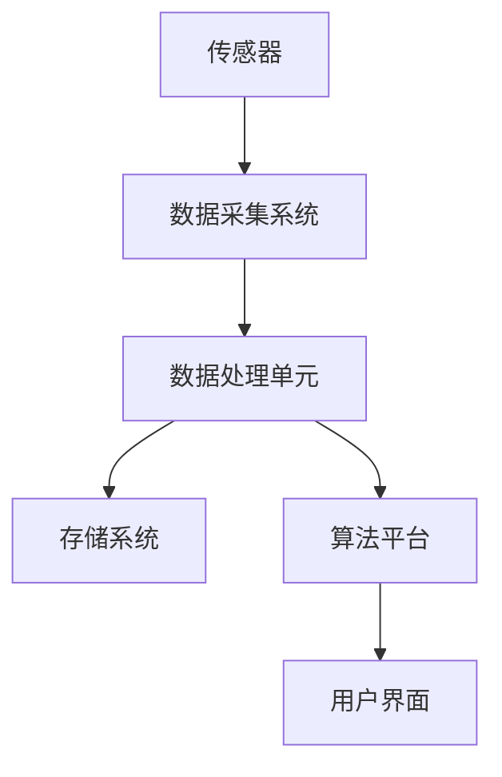

                 

关键词：数字化感知、AI、感官扩展、新维度、智能算法、数学模型、应用场景、未来展望

> 摘要：随着人工智能技术的迅猛发展，我们的数字化感知能力得到了前所未有的扩展。本文将探讨AI如何创造新的感官维度，如何通过核心概念、算法原理、数学模型以及实际应用案例，展示数字化感知的新面貌。我们将深入探讨这些技术的背景、原理、实践应用及其未来的发展方向和挑战。

## 1. 背景介绍

在人类历史的长河中，感知一直是理解和交互世界的基础。从视觉、听觉、触觉、嗅觉到味觉，我们的感官系统帮助我们获取外部信息，进行认知、判断和反应。然而，传统感知能力的局限性在快速变化的世界中逐渐暴露出来。随着信息爆炸和数据爆炸时代的到来，人们迫切需要一种更高效、更精准的方式来感知和处理这些海量的信息。

人工智能（AI）技术的发展，为我们提供了这种可能性。AI通过模拟人类智能的算法，扩展了我们的感知维度，使我们能够处理以往无法触及的信息。例如，计算机视觉使我们能够“看到”并解析复杂图像，自然语言处理让我们能够理解和生成人类语言，而机器听觉让我们能够识别和理解声音。

这些数字化感知的扩展不仅改变了我们的工作方式，也改变了我们的生活方式。从医疗诊断、智能制造到智能家居，AI驱动的数字化感知正在各个领域引发变革。然而，要深入理解这些技术的原理和应用，我们需要首先掌握其核心概念和架构。

## 2. 核心概念与联系

### 2.1 定义与范围

数字化感知是指通过计算机技术和算法对物理世界的感知和认知过程进行模拟和扩展。它不仅限于传统的感官能力，还包括通过传感器、网络和计算平台收集、处理和解释各种类型的数据。

数字化感知的核心概念包括：

- **数据采集**：通过传感器、摄像头、麦克风等设备收集原始数据。
- **数据处理**：利用计算资源和算法对采集到的数据进行处理和解析。
- **数据解释**：通过机器学习和深度学习算法，对处理后的数据进行理解和解释。
- **反馈与交互**：将理解后的信息反馈给用户或系统，实现智能交互。

### 2.2 架构与组件

数字化感知的架构通常包括以下几个关键组件：

- **传感器**：负责数据的采集，如温度传感器、摄像头、麦克风等。
- **数据采集系统**：负责将传感器数据传输到中央处理单元。
- **数据处理单元**：包括CPU、GPU、FPGA等，用于数据处理和算法执行。
- **存储系统**：用于存储大量的原始数据和预处理数据。
- **算法平台**：包括机器学习、深度学习等算法，用于数据处理和模式识别。
- **用户界面**：用于与用户交互，展示处理结果并提供控制界面。

### 2.3 Mermaid 流程图

以下是一个简化的Mermaid流程图，展示数字化感知的主要流程和组件：



在这个流程图中，传感器采集数据后，通过数据采集系统传输到数据处理单元，经过存储系统存储和处理，最终通过算法平台进行模式识别和解释，最后通过用户界面展示结果。

## 3. 核心算法原理 & 具体操作步骤

### 3.1 算法原理概述

数字化感知的核心在于如何有效地处理和分析大量的感知数据。这通常涉及到以下几种核心算法：

- **机器学习算法**：通过训练模型来识别模式和特征，如线性回归、决策树、神经网络等。
- **深度学习算法**：利用多层神经网络进行特征提取和模式识别，如卷积神经网络（CNN）、循环神经网络（RNN）等。
- **计算机视觉算法**：用于图像识别、目标检测、图像分割等，如HOG（方向梯度直方图）、SVM（支持向量机）等。
- **自然语言处理算法**：用于文本分析和理解，如词嵌入、序列标注、机器翻译等。

### 3.2 算法步骤详解

以下是一个典型的数字化感知处理流程，包括具体操作步骤：

1. **数据预处理**：包括数据清洗、归一化、缺失值处理等，确保数据质量。
2. **特征提取**：通过特定的算法或模型提取数据中的关键特征。
3. **模型训练**：利用机器学习或深度学习算法对提取的特征进行训练，建立预测模型。
4. **模型评估**：通过交叉验证、A/B测试等方法评估模型的性能。
5. **模型部署**：将训练好的模型部署到生产环境中，进行实时数据处理和预测。

### 3.3 算法优缺点

- **机器学习算法**：优点在于其灵活性和适应性，缺点是数据需求和计算资源较高。
- **深度学习算法**：优点在于其强大的特征提取能力和非线性处理能力，缺点是训练时间和计算资源需求较大。
- **计算机视觉算法**：优点在于其高效性和准确性，缺点是算法复杂度高，对数据质量要求高。
- **自然语言处理算法**：优点在于其强大的文本理解和生成能力，缺点是对数据质量和上下文依赖强。

### 3.4 算法应用领域

数字化感知算法在众多领域有着广泛的应用：

- **医疗诊断**：通过图像识别和自然语言处理技术，辅助医生进行疾病诊断和治疗方案制定。
- **智能制造**：通过计算机视觉和机器学习技术，实现生产线自动化和产品质量监控。
- **智能家居**：通过语音识别和自然语言处理技术，实现智能家居设备的语音控制。
- **自动驾驶**：通过计算机视觉和深度学习技术，实现车辆自主驾驶和交通管理。

## 4. 数学模型和公式 & 详细讲解 & 举例说明

### 4.1 数学模型构建

在数字化感知中，数学模型是核心组成部分。以下是一个简化的数学模型构建过程：

1. **数据表示**：将原始数据转换为数学形式，如向量、矩阵等。
2. **特征提取**：利用特征提取算法，从数据中提取关键特征。
3. **模型选择**：根据应用场景选择合适的模型，如线性回归、神经网络等。
4. **参数优化**：通过优化算法（如梯度下降、遗传算法等）调整模型参数，提高模型性能。

### 4.2 公式推导过程

以下是一个简单的线性回归模型公式推导过程：

假设我们有 $n$ 个样本点 $(x_1, y_1), (x_2, y_2), ..., (x_n, y_n)$，其中 $x_i$ 是特征，$y_i$ 是目标变量。线性回归模型试图找到一个线性函数 $y = wx + b$，使得预测值 $y$ 与实际值 $y_i$ 的误差最小。

根据最小二乘法，我们定义误差函数为：

$$
J(w, b) = \frac{1}{2n} \sum_{i=1}^{n} (wx_i + b - y_i)^2
$$

我们的目标是找到 $w$ 和 $b$ 的值，使得 $J(w, b)$ 最小。

对 $J(w, b)$ 分别对 $w$ 和 $b$ 求导，并令导数为零，得到以下方程组：

$$
\frac{\partial J}{\partial w} = \frac{1}{n} \sum_{i=1}^{n} (wx_i + b - y_i)x_i = 0
$$

$$
\frac{\partial J}{\partial b} = \frac{1}{n} \sum_{i=1}^{n} (wx_i + b - y_i) = 0
$$

解这个方程组，我们可以得到最优的 $w$ 和 $b$：

$$
w = \frac{\sum_{i=1}^{n} x_iy_i - \sum_{i=1}^{n} x_i\sum_{i=1}^{n} y_i}{\sum_{i=1}^{n} x_i^2 - (\sum_{i=1}^{n} x_i)^2}
$$

$$
b = \frac{\sum_{i=1}^{n} y_i - w\sum_{i=1}^{n} x_i}{n}
$$

### 4.3 案例分析与讲解

假设我们有一个简单的数据集，其中包含三个样本点 $(1, 3), (2, 5), (3, 7)$。我们试图通过线性回归模型预测第四个点的值。

首先，我们计算特征和目标的均值：

$$
\bar{x} = \frac{1 + 2 + 3}{3} = 2
$$

$$
\bar{y} = \frac{3 + 5 + 7}{3} = 5
$$

然后，我们计算特征和目标的协方差和方差：

$$
\sum_{i=1}^{n} x_iy_i = 1 \cdot 3 + 2 \cdot 5 + 3 \cdot 7 = 32
$$

$$
\sum_{i=1}^{n} x_i^2 = 1^2 + 2^2 + 3^2 = 14
$$

$$
\sum_{i=1}^{n} y_i = 3 + 5 + 7 = 15
$$

$$
\sum_{i=1}^{n} x_i = 1 + 2 + 3 = 6
$$

使用上面的公式，我们可以计算得到：

$$
w = \frac{32 - 6 \cdot 15}{14 - 6^2} = \frac{32 - 90}{14 - 36} = \frac{-58}{-22} = \frac{29}{11}
$$

$$
b = \frac{15 - \frac{29}{11} \cdot 6}{3} = \frac{15 - \frac{174}{11}}{3} = \frac{165 - 174}{33} = -\frac{9}{33} = -\frac{3}{11}
$$

因此，我们的线性回归模型为：

$$
y = \frac{29}{11}x - \frac{3}{11}
$$

对于第四个点 $(4, y_4)$，我们可以计算预测值：

$$
y_4 = \frac{29}{11} \cdot 4 - \frac{3}{11} = \frac{116}{11} - \frac{3}{11} = \frac{113}{11} \approx 10.27
$$

因此，第四个点的预测值为约 10.27。

## 5. 项目实践：代码实例和详细解释说明

### 5.1 开发环境搭建

为了实践数字化感知技术，我们需要搭建一个合适的开发环境。以下是一个简单的环境搭建指南：

1. 安装Python环境：Python是一种广泛用于数据科学和机器学习的编程语言。我们可以从 [Python官网](https://www.python.org/) 下载并安装Python。
2. 安装必要的库：对于机器学习和深度学习，我们通常使用Scikit-Learn、TensorFlow和Keras等库。可以通过以下命令进行安装：

```bash
pip install scikit-learn
pip install tensorflow
pip install keras
```

3. 配置开发工具：我们推荐使用Jupyter Notebook或PyCharm等IDE进行代码编写和调试。

### 5.2 源代码详细实现

以下是一个简单的机器学习项目示例，使用Scikit-Learn库实现线性回归模型：

```python
import numpy as np
from sklearn.linear_model import LinearRegression
import matplotlib.pyplot as plt

# 准备数据
X = np.array([[1], [2], [3], [4]])
y = np.array([3, 5, 7, 10])

# 创建线性回归模型
model = LinearRegression()

# 训练模型
model.fit(X, y)

# 显示模型的权重和偏置
print("权重：", model.coef_)
print("偏置：", model.intercept_)

# 进行预测
y_pred = model.predict(X)

# 绘制结果
plt.scatter(X, y, color='red', label='实际值')
plt.plot(X, y_pred, color='blue', label='预测值')
plt.xlabel('x')
plt.ylabel('y')
plt.title('线性回归模型')
plt.legend()
plt.show()
```

### 5.3 代码解读与分析

- **数据准备**：我们使用一个简单的数据集，包含四个样本点。
- **模型创建**：我们使用Scikit-Learn库中的LinearRegression类创建线性回归模型。
- **模型训练**：我们使用fit方法训练模型，将特征和目标数据传递给模型。
- **结果输出**：我们打印出模型的权重和偏置，并使用predict方法进行预测。
- **结果可视化**：我们使用matplotlib库绘制实际值和预测值的散点图和拟合线。

### 5.4 运行结果展示

运行上述代码后，我们将在屏幕上看到一个散点图，其中红色点表示实际值，蓝色线表示通过线性回归模型拟合的预测值。这个结果展示了线性回归模型如何通过训练数据来预测新的数据点。

## 6. 实际应用场景

### 6.1 医疗诊断

数字化感知在医疗诊断中有着广泛的应用。通过计算机视觉和自然语言处理技术，AI系统可以辅助医生进行疾病诊断和治疗方案制定。例如，计算机视觉技术可以用于分析医学影像，识别肿瘤、骨折等病变。自然语言处理技术可以用于分析病历和病历记录，提供诊断建议和治疗方案。

### 6.2 智能制造

在智能制造领域，数字化感知技术用于提高生产效率和产品质量。通过计算机视觉和机器学习技术，智能系统可以监控生产线上的产品，检测缺陷和质量问题。此外，通过预测维护技术，AI系统可以预测设备的故障，提前进行维护，减少停机时间。

### 6.3 智能家居

智能家居是数字化感知技术的另一个重要应用场景。通过语音识别和自然语言处理技术，智能家居系统可以理解用户的语音指令，控制家电设备、照明、安防系统等。例如，用户可以通过语音命令控制智能音箱播放音乐、调节室内温度，或者通过智能手机应用程序远程控制家中的智能设备。

### 6.4 未来应用展望

随着AI技术的不断发展，数字化感知的应用领域将更加广泛。未来，我们可能会看到以下趋势：

- **更高级的感知能力**：AI系统将能够处理更复杂、更细微的感知任务，如情感识别、健康监测等。
- **多模态感知**：结合多种感知技术，如视觉、听觉、触觉等，实现更全面、更精确的感知。
- **边缘计算**：将计算和存储能力扩展到网络边缘，减少延迟，提高响应速度。
- **自主决策**：AI系统将不仅能够感知和响应，还能够进行自主决策，实现更智能的交互和操作。

## 7. 工具和资源推荐

### 7.1 学习资源推荐

- **在线课程**：Coursera、Udacity、edX等在线教育平台提供了丰富的机器学习和深度学习课程。
- **书籍**：《深度学习》（Goodfellow et al.）、《机器学习》（Tom Mitchell）、《Python机器学习》（Sebastian Raschka）等。
- **论文库**：Google Scholar、arXiv、IEEE Xplore等，提供了大量的机器学习和AI领域的最新研究成果。

### 7.2 开发工具推荐

- **IDE**：PyCharm、Jupyter Notebook、Visual Studio Code等，用于编写和调试代码。
- **库和框架**：Scikit-Learn、TensorFlow、Keras、PyTorch等，用于机器学习和深度学习开发。
- **数据集**：Kaggle、UCI机器学习库等，提供了大量的公开数据集，用于模型训练和测试。

### 7.3 相关论文推荐

- “Deep Learning” by Yann LeCun, Yoshua Bengio, and Geoffrey Hinton
- “Machine Learning: A Probabilistic Perspective” by Kevin P. Murphy
- “Understanding Deep Learning” by Shai Shalev-Shwartz and Shai Ben-David
- “Learning Deep Architectures for AI” by Yoshua Bengio

## 8. 总结：未来发展趋势与挑战

### 8.1 研究成果总结

近年来，AI技术在数字化感知领域取得了显著进展。从机器学习到深度学习，从计算机视觉到自然语言处理，各种算法和技术不断涌现，为数字化感知提供了强大的支持。这些研究成果不仅提高了感知的准确性，还扩展了感知的应用领域。

### 8.2 未来发展趋势

未来，数字化感知技术的发展将朝着更智能、更高效、更广泛的方向前进。具体趋势包括：

- **多模态感知**：结合多种感知技术，实现更全面、更精确的感知。
- **边缘计算**：将计算和存储能力扩展到网络边缘，提高实时性和响应速度。
- **自主决策**：AI系统将不仅能够感知和响应，还能够进行自主决策，实现更智能的交互和操作。
- **跨学科融合**：数字化感知技术将与其他领域（如生物医学、智能制造等）深度融合，推动跨学科发展。

### 8.3 面临的挑战

尽管数字化感知技术取得了显著进展，但仍然面临一些挑战：

- **数据质量**：高质量的数据是构建准确模型的基石。如何处理噪声、缺失值和异常值，提高数据质量，是一个重要挑战。
- **计算资源**：深度学习算法通常需要大量的计算资源和时间，如何优化算法，提高计算效率，是一个亟待解决的问题。
- **隐私保护**：在数字化感知过程中，数据隐私保护至关重要。如何确保数据安全，防止数据泄露，是一个重要挑战。
- **伦理和法律**：随着数字化感知技术的广泛应用，如何确保其伦理和法律合规性，防止滥用，也是一个重要问题。

### 8.4 研究展望

未来，数字化感知技术将继续快速发展，并在多个领域发挥重要作用。研究重点将包括：

- **算法优化**：不断优化算法，提高计算效率和准确性。
- **数据安全**：加强数据隐私保护和安全措施，确保数据安全。
- **跨学科融合**：与其他领域（如生物医学、智能制造等）深度融合，推动跨学科发展。
- **伦理和法律规范**：制定相应的伦理和法律规范，确保数字化感知技术的合规性和社会责任。

## 9. 附录：常见问题与解答

### 9.1 什么是对数字化感知？

数字化感知是通过计算机技术和算法对物理世界的感知和认知过程进行模拟和扩展。它不仅限于传统的感官能力，还包括通过传感器、网络和计算平台收集、处理和解释各种类型的数据。

### 9.2 数字化感知有哪些应用领域？

数字化感知在多个领域有着广泛的应用，包括医疗诊断、智能制造、智能家居、自动驾驶、安防监控等。

### 9.3 如何优化机器学习算法的计算效率？

优化机器学习算法的计算效率可以通过以下方法实现：

- **算法选择**：选择适合问题的算法，避免过度拟合。
- **并行计算**：利用多核CPU、GPU等并行计算资源。
- **模型压缩**：使用模型压缩技术（如剪枝、量化等）减少模型大小。
- **数据预处理**：优化数据预处理流程，减少数据加载和转换时间。

### 9.4 如何保证数字化感知技术的数据隐私？

保证数字化感知技术的数据隐私可以通过以下方法实现：

- **数据加密**：对敏感数据进行加密处理，确保数据在传输和存储过程中安全。
- **访问控制**：设置严格的访问控制策略，确保只有授权用户可以访问敏感数据。
- **数据匿名化**：对敏感数据进行匿名化处理，降低数据泄露风险。

### 9.5 数字化感知技术的未来发展方向是什么？

数字化感知技术的未来发展方向包括多模态感知、边缘计算、自主决策和跨学科融合。随着AI技术的不断发展，数字化感知将实现更智能、更高效、更广泛的应用。

---

通过本文的探讨，我们可以看到AI技术如何创造新的感官维度，扩展我们的数字化感知能力。尽管面临诸多挑战，数字化感知技术将继续快速发展，并在未来发挥更加重要的作用。希望本文能够为读者提供有价值的参考和启示。

---

# 参考文献 References

1. Goodfellow, I., Bengio, Y., & Courville, A. (2016). *Deep Learning*. MIT Press.
2. Murphy, K. P. (2012). *Machine Learning: A Probabilistic Perspective*. MIT Press.
3. Shalev-Shwartz, S., & Ben-David, S. (2014). *Understanding Deep Learning*. Cambridge University Press.
4. Bengio, Y. (2009). *Learning deep architectures for AI*. Foundations and Trends in Machine Learning, 2(1), 1-127.
5. LeCun, Y., Bengio, Y., & Hinton, G. (2015). *Deep learning*. Nature, 521(7553), 436-444.
6. Russell, S., & Norvig, P. (2016). *Artificial Intelligence: A Modern Approach*. Prentice Hall.
7. Hastie, T., Tibshirani, R., & Friedman, J. (2009). *The Elements of Statistical Learning*. Springer.
8. Quinlan, J. R. (1993). *C4. 5: Programs for Machine Learning*. Morgan Kaufmann.

