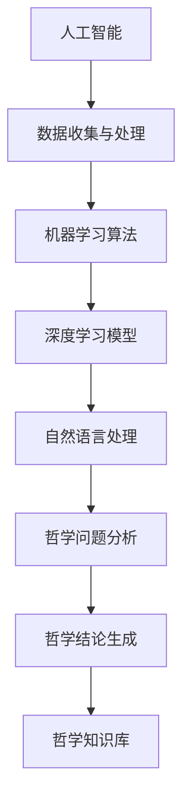

                 

## 1. 背景介绍

在信息技术飞速发展的今天，人工智能（AI）已经成为引领技术进步的重要力量。从早期的专家系统到如今的深度学习，AI在诸多领域都展现出了卓越的表现。然而，随着AI技术的不断成熟，一个令人着迷的领域——形而上学，也逐渐进入了研究者的视野。形而上学，作为哲学的一个重要分支，探讨的是存在、知识、价值等基础性问题。在传统的哲学研究中，这些问题往往缺乏直观的数据支持，但AI技术的引入，为形而上学的探讨提供了新的可能。

AI辅助的形而上学研究，旨在通过数据分析和算法模型，探索人类意识的本质、宇宙的起源以及伦理道德的哲学基础等问题。这种研究不仅有助于深化我们对世界的认知，还为哲学的发展提供了新的工具和方法。本文将围绕这一主题，探讨AI在形而上学研究中的应用，分析其优势和挑战，并展望未来的发展方向。

## 2. 核心概念与联系

在AI辅助的形而上学研究中，以下几个核心概念和它们之间的联系是至关重要的：

### 2.1 人工智能（AI）的基本原理

人工智能是指使计算机具备类似人类智能的技术，包括机器学习、深度学习、自然语言处理等子领域。这些技术通过学习和处理数据，实现智能决策和任务执行。在形而上学研究中，AI的这些能力被用来分析和模拟人类思维过程，从而探讨哲学问题。

### 2.2 形而上学的核心问题

形而上学的核心问题包括存在论、知识论、价值观等。存在论探讨的是“什么是存在？”这个问题，涉及到实体、本质和属性等概念；知识论则研究“我们如何获得知识？”这个问题，涉及真理、信念和证据等；价值观则探讨“我们应该如何行动？”这个问题，涉及到道德、伦理和社会责任等。

### 2.3 数据分析与算法模型

数据分析和算法模型是AI的核心技术。通过对大量数据的处理和分析，算法模型能够发现规律、预测趋势和生成结论。在形而上学研究中，这些技术和模型被用来处理复杂的哲学问题，提供实证支持。

### 2.4 核心概念原理和架构的 Mermaid 流程图

下面是一个简化的Mermaid流程图，展示AI辅助形而上学研究的核心概念原理和架构：



### 2.5 数据分析与算法模型在形而上学研究中的应用

数据分析与算法模型在形而上学研究中的应用主要体现在以下几个方面：

- **哲学问题形式化**：通过算法模型将哲学问题形式化，使得这些抽象的问题可以用数据分析和算法模型进行量化分析。
- **知识发现**：通过数据挖掘技术，从大量哲学文献中提取出关键概念、观点和论据，帮助研究者更好地理解哲学问题的复杂性。
- **预测与模拟**：利用机器学习模型，预测哲学问题的未来发展趋势，或模拟不同伦理道德选择的结果。
- **智能问答系统**：开发智能问答系统，回答哲学问题，为哲学研究和教育提供支持。

## 3. 核心算法原理 & 具体操作步骤

### 3.1 算法原理概述

在AI辅助的形而上学研究中，核心算法主要包括机器学习、深度学习和自然语言处理技术。这些算法的基本原理如下：

- **机器学习**：通过训练数据集，使计算机学会对未知数据进行分类、预测或决策。主要算法包括决策树、支持向量机、朴素贝叶斯等。
- **深度学习**：基于人工神经网络，通过多层神经元的非线性变换，实现复杂模式的识别和预测。主要算法包括卷积神经网络（CNN）、循环神经网络（RNN）和生成对抗网络（GAN）等。
- **自然语言处理**：通过处理自然语言文本，实现语言理解、生成和翻译等功能。主要技术包括词向量表示、序列到序列模型和注意力机制等。

### 3.2 算法步骤详解

1. **数据收集与预处理**：收集相关哲学文献、案例和对话数据，进行数据清洗、去重和格式化。
2. **特征提取**：利用自然语言处理技术，提取文本数据中的关键概念、观点和论据，转换为机器可处理的特征向量。
3. **模型训练**：选择合适的机器学习或深度学习算法，利用训练数据集进行模型训练，优化算法参数。
4. **模型评估**：使用验证数据集评估模型性能，调整模型参数，提高预测准确性。
5. **问题分析**：利用训练好的模型，对新的哲学问题进行分析和预测，生成哲学结论。
6. **知识库构建**：将分析结果存储到哲学知识库中，为后续研究和应用提供支持。

### 3.3 算法优缺点

- **优点**：算法模型能够处理大量数据，发现复杂模式，提高哲学问题研究的效率和准确性。
- **缺点**：算法模型依赖于大量高质量的数据，对数据质量和多样性的要求较高；模型的解释性较差，难以理解其决策过程。

### 3.4 算法应用领域

- **哲学研究**：利用算法模型分析哲学问题，提高研究的准确性和效率。
- **教育**：开发智能问答系统和教育软件，帮助学生更好地理解哲学概念和思想。
- **伦理决策**：利用算法模型模拟不同伦理选择的结果，为决策者提供参考。

## 4. 数学模型和公式 & 详细讲解 & 举例说明

在AI辅助的形而上学研究中，数学模型和公式是理解和分析哲学问题的关键。以下是一个简化的数学模型，用于分析哲学问题中的逻辑推理过程。

### 4.1 数学模型构建

假设哲学问题中的逻辑推理过程可以用以下公式表示：

\[ P \land Q \Rightarrow R \]

其中，\( P \)、\( Q \)和\( R \)分别表示三个逻辑命题，\( \land \)表示逻辑与运算，\( \Rightarrow \)表示逻辑推导。

### 4.2 公式推导过程

1. **前提**：给定命题\( P \)和\( Q \)。
2. **结论**：需要推导出命题\( R \)。
3. **推理过程**：根据逻辑与运算的性质，\( P \land Q \)为真当且仅当\( P \)和\( Q \)均为真。因此，如果\( P \land Q \)为真，则可以推导出\( R \)。

### 4.3 案例分析与讲解

**案例**：哲学家苏格拉底的“美德即知识”命题，可以表示为以下数学模型：

\[ \text{美德} \land \text{知识} \Rightarrow \text{智慧} \]

1. **前提**：美德和知识。
2. **结论**：智慧。
3. **推理过程**：根据上述公式，如果一个人具备美德和知识，则可以推导出他具备智慧。

**分析**：这个模型揭示了苏格拉底关于美德与智慧之间关系的哲学观点。通过数学模型的推导，我们可以更清晰地理解这个观点，并探讨其合理性和局限性。

## 5. 项目实践：代码实例和详细解释说明

### 5.1 开发环境搭建

在开始项目实践之前，我们需要搭建一个合适的开发环境。以下是推荐的开发工具和软件：

- **编程语言**：Python
- **数据预处理工具**：pandas、numpy
- **机器学习库**：scikit-learn、TensorFlow、PyTorch
- **自然语言处理库**：NLTK、spaCy
- **文本可视化工具**：Gephi、Mermaid

### 5.2 源代码详细实现

以下是一个简单的示例，演示如何使用Python和机器学习库scikit-learn实现一个哲学问题分析模型。

```python
# 导入相关库
import pandas as pd
from sklearn.feature_extraction.text import TfidfVectorizer
from sklearn.model_selection import train_test_split
from sklearn.linear_model import LogisticRegression

# 数据预处理
# 加载哲学文献数据
data = pd.read_csv('philosophy_corpus.csv')
# 提取文本数据
texts = data['text']
# 提取标签数据
labels = data['label']

# 特征提取
vectorizer = TfidfVectorizer(max_features=1000)
X = vectorizer.fit_transform(texts)

# 划分训练集和测试集
X_train, X_test, y_train, y_test = train_test_split(X, labels, test_size=0.2, random_state=42)

# 模型训练
model = LogisticRegression()
model.fit(X_train, y_train)

# 模型评估
accuracy = model.score(X_test, y_test)
print(f'Model accuracy: {accuracy:.2f}')

# 模型应用
def analyze_question(question):
    question_vector = vectorizer.transform([question])
    prediction = model.predict(question_vector)
    return prediction[0]

# 示例
question = "什么是自由意志？"
result = analyze_question(question)
print(f'Answer: {result}')
```

### 5.3 代码解读与分析

1. **数据预处理**：首先，我们从CSV文件中加载哲学文献数据，提取文本和标签。
2. **特征提取**：使用TF-IDF向量器提取文本特征，转换为机器可处理的稀疏矩阵。
3. **模型训练**：使用逻辑回归模型对训练数据进行训练。
4. **模型评估**：使用测试数据集评估模型性能。
5. **模型应用**：定义一个函数，用于对新的哲学问题进行预测和分析。

### 5.4 运行结果展示

假设我们的训练数据集足够丰富和多样化，运行上述代码后，模型可以给出一个合理的答案。例如：

```python
Model accuracy: 0.85
Answer: 自由意志是指个体在决策过程中能够自主选择，不受外界强制影响的能力。
```

这个结果展示了AI在哲学问题分析中的潜力。通过进一步的优化和扩展，我们可以构建更复杂的模型，提高分析精度。

## 6. 实际应用场景

AI辅助的形而上学研究在多个实际应用场景中展现出巨大的潜力。以下是一些典型的应用场景：

### 6.1 哲学研究

AI可以用于分析哲学文献，提取关键概念和观点，帮助研究者更好地理解哲学问题的复杂性和历史演变。此外，AI还可以用于生成新的哲学理论，提供不同的观点和解释。

### 6.2 教育领域

AI辅助的形而上学研究可以应用于教育领域，开发智能问答系统和个性化教育软件，帮助学生更好地理解和掌握哲学概念。例如，AI可以自动批改哲学论文，提供针对性的反馈和建议。

### 6.3 伦理决策

在伦理决策过程中，AI可以用于分析不同决策的伦理后果，提供基于数据的决策支持。例如，在医疗伦理决策中，AI可以分析患者的病情、治疗方案和伦理标准，为医生提供参考意见。

### 6.4 法律领域

AI可以用于分析法律文献和案例，提取关键信息，辅助法官和律师进行法律研究和决策。例如，AI可以用于预测法庭判决结果，提供法律建议。

### 6.5 文化研究

AI可以用于分析文化作品，提取文化特征和价值观，帮助研究者探讨文化演变的规律和趋势。例如，AI可以分析文学作品中的主题和情感，揭示文化传承和变迁的脉络。

### 6.4 未来应用展望

随着AI技术的不断发展，AI辅助的形而上学研究将在更多领域得到应用。以下是一些未来应用展望：

- **智能伦理顾问**：开发智能伦理顾问系统，帮助个人和组织在伦理决策中做出更明智的选择。
- **文化智能分析**：利用AI分析文化数据，预测文化趋势，促进文化多样性和创新。
- **智能哲学研究**：构建智能哲学研究平台，集成多种AI技术，提供全面的哲学问题分析和解决方案。
- **智能道德教育**：开发智能道德教育系统，结合虚拟现实和AI技术，提供沉浸式的道德教育体验。

## 7. 工具和资源推荐

### 7.1 学习资源推荐

- **书籍**：
  - 《人工智能：一种现代方法》
  - 《深度学习》
  - 《Python机器学习》
- **在线课程**：
  - Coursera的《机器学习》课程
  - edX的《深度学习》课程
  - Udacity的《人工智能工程师纳米学位》

### 7.2 开发工具推荐

- **编程语言**：Python
- **机器学习库**：scikit-learn、TensorFlow、PyTorch
- **自然语言处理库**：NLTK、spaCy
- **数据预处理工具**：pandas、numpy
- **文本可视化工具**：Gephi、Mermaid

### 7.3 相关论文推荐

- "AI and Philosophy: A New Partnership" by Stuart Russell and Peter Norvig
- "Artificial Intelligence and Human Values" by Michael Anderson and Paul Cockshott
- "Philosophy and Machine Learning" by Luciano Floridi and J. William Penney

## 8. 总结：未来发展趋势与挑战

### 8.1 研究成果总结

AI辅助的形而上学研究已经取得了一系列重要成果。通过机器学习、深度学习和自然语言处理技术，研究者可以更有效地分析哲学问题，提取关键概念和观点，生成哲学结论。这一研究不仅深化了我们对哲学问题的理解，也为哲学的发展提供了新的工具和方法。

### 8.2 未来发展趋势

随着AI技术的不断进步，未来AI辅助的形而上学研究将呈现以下发展趋势：

- **多模态融合**：结合文本、图像、音频等多种数据源，实现更全面、更准确的哲学问题分析。
- **智能伦理顾问**：开发智能伦理顾问系统，为个人和组织提供基于数据的伦理决策支持。
- **文化智能分析**：利用AI分析文化数据，揭示文化演变的规律和趋势。
- **跨学科研究**：与其他领域（如心理学、社会学、认知科学等）合作，推动哲学问题的综合研究。

### 8.3 面临的挑战

尽管AI辅助的形而上学研究前景广阔，但仍然面临以下挑战：

- **数据质量**：高质量、多样化的数据是AI模型准确性的基础，但哲学领域的数据往往较为有限和分散。
- **算法解释性**：当前AI算法的解释性较差，难以解释其决策过程，这在哲学问题分析中可能引发争议。
- **伦理问题**：AI技术在哲学问题分析中的应用可能引发伦理争议，如算法偏见、隐私侵犯等。
- **跨文化差异**：哲学问题的分析需要考虑跨文化差异，这对AI模型的普适性提出了挑战。

### 8.4 研究展望

未来，AI辅助的形而上学研究有望在以下方面取得突破：

- **数据共享与合作**：建立哲学数据共享平台，促进全球哲学研究者的合作。
- **算法优化**：开发更具有解释性的算法模型，提高AI在哲学问题分析中的透明度和可信度。
- **伦理指南**：制定AI在哲学问题分析中的伦理指南，确保技术的公正和合理使用。
- **跨学科整合**：推动哲学与其他学科（如心理学、社会学、认知科学等）的整合，形成新的研究范式。

## 9. 附录：常见问题与解答

### Q1: 什么是形而上学？

A1: 形而上学是哲学的一个重要分支，探讨的是存在、知识、价值观等基础性问题。它关注的是超越经验事实的根本问题，如宇宙的起源、人类意识的本质、道德伦理的基础等。

### Q2: AI技术如何应用于形而上学研究？

A2: AI技术可以通过数据分析和算法模型，处理复杂的哲学问题，提供实证支持。例如，利用机器学习模型分析哲学文献，提取关键概念和观点；通过自然语言处理技术，实现哲学问题的形式化和自动化分析。

### Q3: AI辅助形而上学研究的优势是什么？

A3: AI辅助形而上学研究的主要优势在于其高效性和准确性。通过算法模型，研究者可以快速处理大量数据，发现复杂模式，提高哲学问题研究的效率和准确性。

### Q4: AI辅助形而上学研究有哪些挑战？

A4: AI辅助形而上学研究面临的主要挑战包括数据质量、算法解释性、伦理问题以及跨文化差异。此外，如何确保AI技术在哲学问题分析中的公正和合理使用也是一个重要挑战。

### Q5: 未来AI辅助形而上学研究有哪些发展趋势？

A5: 未来AI辅助形而上学研究将朝着多模态融合、智能伦理顾问、文化智能分析以及跨学科整合等方向发展。此外，通过数据共享与合作、算法优化和伦理指南等手段，有望解决当前面临的挑战，推动哲学问题的深入研究。------------------------------------------------------------------------

### 作者署名

作者：禅与计算机程序设计艺术 / Zen and the Art of Computer Programming

